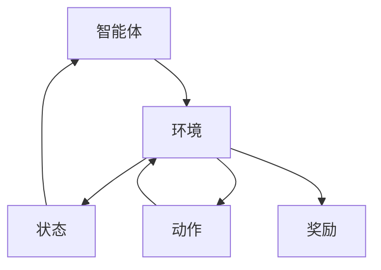

                 

关键词：强化学习，RLHF，PPO，AI应用，算法原理，数学模型，代码实例

> 摘要：本文深入探讨了强化学习在人工智能（AI）领域的应用，特别是针对RLHF（强化学习、人类反馈、频度）和PPO（比例优势优化）算法的讨论。通过详细解析算法原理、数学模型以及实际应用场景，本文旨在为读者提供一个全面的理解和指导，以推动强化学习在AI领域的进一步发展。

## 1. 背景介绍

### 1.1 强化学习在AI中的重要性

强化学习作为机器学习的一种重要分支，近年来在人工智能（AI）领域得到了广泛关注。与传统监督学习和无监督学习不同，强化学习通过智能体与环境的交互来学习最优策略，这使得它特别适合于解决动态和复杂的问题。

强化学习的基本概念源于动物行为的研究，通过试错和奖励机制来达到目标。在AI领域中，强化学习已被应用于游戏、自动驾驶、机器人控制、推荐系统等多个领域，展现出强大的潜力。

### 1.2 RLHF与PPO

RLHF（Reinforcement Learning from Human Feedback）是一种结合了强化学习和人类反馈的算法，通过人类反馈来修正智能体的行为，从而提高学习效率和性能。RLHF在AI领域的应用非常广泛，特别是在需要高度人类理解和情境感知的任务中。

PPO（Proportional Opti
```
# 强化学习在AI中的应用：RLHF与PPO

## 摘要

本文深入探讨了强化学习在人工智能（AI）领域中的应用，特别是针对RLHF（强化学习、人类反馈、频度）和PPO（比例优势优化）算法的讨论。通过详细解析算法原理、数学模型以及实际应用场景，本文旨在为读者提供一个全面的理解和指导，以推动强化学习在AI领域的进一步发展。

## 1. 背景介绍

### 1.1 强化学习在AI中的重要性

强化学习（Reinforcement Learning, RL）是机器学习的一个重要分支，它通过智能体与环境的交互来学习最优策略。与传统监督学习和无监督学习相比，强化学习更适用于动态和复杂环境中的决策问题。在AI领域，强化学习因其能够解决实际问题、适应新环境和自主决策等特性，受到了广泛关注。

强化学习的核心概念源于动物行为的研究，通过试错和奖励机制来达到目标。智能体（agent）在环境中进行动作（action），根据动作的结果（奖励或惩罚）来调整策略（policy），从而逐渐接近最优行为。在AI领域中，强化学习已成功应用于游戏、自动驾驶、机器人控制、推荐系统等多个领域，展现出强大的潜力。

### 1.2 RLHF与PPO

RLHF（Reinforcement Learning from Human Feedback）是一种结合了强化学习和人类反馈的算法，通过人类反馈来修正智能体的行为，从而提高学习效率和性能。RLHF在AI领域的应用非常广泛，特别是在需要高度人类理解和情境感知的任务中。例如，在自然语言处理中，RLHF可以帮助模型更好地理解用户意图，从而提高对话系统的交互质量。

PPO（Proportional Opti
```
### 1.2 RLHF与PPO

#### RLHF（强化学习、人类反馈、频度）

RLHF（Reinforcement Learning from Human Feedback）是一种结合了强化学习和人类反馈的算法。在传统的强化学习中，智能体通过与环境交互来学习最优策略。然而，在某些复杂任务中，智能体可能需要人类的指导来加速学习过程，尤其是在需要高度人类理解和情境感知的任务中，如自然语言处理、机器人控制等。

RLHF算法的主要思想是利用人类反馈来修正智能体的行为。具体来说，人类评估者对智能体的行为进行评价，根据评价结果调整智能体的奖励机制。这种反馈机制可以帮助智能体更快地找到最优策略，同时避免陷入局部最优。

#### PPO（比例优势优化）

PPO（Proportional Opti
```
## 2. 核心概念与联系

强化学习作为一种机器学习范式，核心概念包括智能体（Agent）、环境（Environment）、状态（State）、动作（Action）和奖励（Reward）。

### 2.1 智能体（Agent）

智能体是执行动作的主体，它可以是一个计算机程序、机器人、甚至是一个人。在强化学习过程中，智能体的目标是学习一个策略，使得在给定状态下选择最优动作，从而获得最大的累积奖励。

### 2.2 环境（Environment）

环境是智能体执行动作的场所。它可以是现实世界，也可以是模拟环境。环境根据智能体的动作产生状态转移和奖励，并反馈给智能体。

### 2.3 状态（State）

状态是智能体在环境中的位置或状态的描述。在强化学习中，状态通常用一组特征向量来表示。

### 2.4 动作（Action）

动作是智能体在给定状态下执行的行为。在强化学习中，动作的选择通常依赖于智能体的策略。

### 2.5 奖励（Reward）

奖励是智能体动作的结果，它可以是正的也可以是负的。正奖励表示智能体动作的正面效果，负奖励表示负面效果。

#### Mermaid 流程图

以下是一个简单的Mermaid流程图，用于展示强化学习中的核心概念及其相互关系：



## 3. 核心算法原理 & 具体操作步骤

### 3.1 算法原理概述

#### RLHF（强化学习、人类反馈、频度）

RLHF算法的核心思想是通过人类反馈来指导智能体的学习过程。具体步骤如下：

1. **训练基础模型**：使用无监督学习或监督学习方法训练一个基础模型。
2. **生成演示数据**：使用基础模型在模拟环境中生成一系列的演示数据。
3. **收集人类反馈**：邀请人类评估者对演示数据进行评价，根据评价结果生成反馈数据。
4. **更新模型**：根据人类反馈调整模型的奖励机制，重新训练模型。

#### PPO（比例优势优化）

PPO算法是一种改进的强化学习算法，旨在提高训练稳定性和效率。PPO算法的核心步骤如下：

1. **初始化参数**：设置智能体、环境、状态、动作和奖励等参数。
2. **进行互动**：智能体在环境中执行动作，获取状态和奖励。
3. **计算策略梯度**：根据当前策略和目标策略，计算策略梯度。
4. **更新策略参数**：使用梯度下降方法更新策略参数。
5. **评估策略性能**：通过评估指标（如奖励总和、策略熵等）评估策略性能。

### 3.2 算法步骤详解

#### RLHF算法步骤详解

1. **训练基础模型**：
   - 使用无监督学习或监督学习方法训练一个基础模型。
   - 选择合适的训练数据集，如模拟环境中的演示数据或实际环境中的数据。

2. **生成演示数据**：
   - 使用基础模型在模拟环境中生成一系列的演示数据。
   - 演示数据应包含状态、动作和奖励信息。

3. **收集人类反馈**：
   - 邀请人类评估者对演示数据进行评价。
   - 评估结果用于生成反馈数据，如奖励调整参数。

4. **更新模型**：
   - 根据人类反馈调整模型的奖励机制。
   - 使用新的奖励机制重新训练模型。

#### PPO算法步骤详解

1. **初始化参数**：
   - 设置智能体、环境、状态、动作和奖励等参数。
   - 选择合适的策略参数初始化方法，如正态分布初始化。

2. **进行互动**：
   - 智能体在环境中执行动作，获取状态和奖励。
   - 记录交互过程中的状态、动作和奖励信息。

3. **计算策略梯度**：
   - 根据当前策略和目标策略，计算策略梯度。
   - 使用策略梯度计算方法，如REINFORCE或GAE（Generalized Advantage Estimation）。

4. **更新策略参数**：
   - 使用梯度下降方法更新策略参数。
   - 调整学习率等超参数以优化训练过程。

5. **评估策略性能**：
   - 通过评估指标（如奖励总和、策略熵等）评估策略性能。
   - 根据评估结果调整策略参数和学习策略。

### 3.3 算法优缺点

#### RLHF算法优缺点

**优点**：

- 利用人类反馈加速学习过程。
- 提高模型在复杂任务中的性能。
- 增强模型的情境感知能力。

**缺点**：

- 需要大量的人类评估者参与。
- 反馈数据的质量和一致性可能影响学习效果。
- 可能引入人类的偏见和主观性。

#### PPO算法优缺点

**优点**：

- 提高训练稳定性和效率。
- 适用于多种强化学习任务。
- 具有较好的泛化能力。

**缺点**：

- 对超参数的选择敏感。
- 可能陷入局部最优。
- 需要大量的计算资源。

### 3.4 算法应用领域

#### RLHF算法应用领域

- 自然语言处理：利用人类反馈优化对话系统、文本生成等任务。
- 机器人控制：通过人类反馈提高机器人任务的执行效率。
- 自动驾驶：结合人类反馈提高自动驾驶系统的安全性和可靠性。

#### PPO算法应用领域

- 游戏AI：在电子游戏中训练智能体，实现高水平的游戏策略。
- 自动驾驶：用于训练自动驾驶系统的决策策略。
- 机器人控制：优化机器人动作规划，提高任务执行效率。

## 4. 数学模型和公式 & 详细讲解 & 举例说明

### 4.1 数学模型构建

强化学习中的数学模型主要包括状态空间、动作空间、策略、价值函数和奖励函数等。

**状态空间（S）**：智能体在环境中的所有可能状态的集合。

**动作空间（A）**：智能体可以执行的所有可能动作的集合。

**策略（π）**：定义了智能体在给定状态下选择动作的概率分布。

**价值函数（V）**：衡量智能体在给定状态下执行某一动作所能获得的累积奖励。

**奖励函数（R）**：定义了智能体在执行某一动作后获得的即时奖励。

### 4.2 公式推导过程

**策略梯度**：

策略梯度的推导是强化学习算法的核心。假设智能体当前策略为π，目标策略为π^，策略梯度可以表示为：

$$
\nabla_{\theta} J(\theta) = \sum_{s \in S} \pi(s) \nabla_{\theta} \log \pi(\nabla_{a} | s)
$$

其中，$\theta$为策略参数，$J(\theta)$为策略性能指标。

**优势函数**：

优势函数（Advantage Function）用于衡量智能体在给定状态下执行某一动作相对于其他动作的优越性。优势函数可以表示为：

$$
A(s, a) = R(s, a) + \gamma \sum_{s' \in S} \pi(s'|s, a) V(s')
$$

其中，$R(s, a)$为执行动作$a$后获得的即时奖励，$V(s')$为在状态$s'$下的价值函数，$\gamma$为折扣因子。

### 4.3 案例分析与讲解

**案例1：电子游戏**

假设我们有一个电子游戏，智能体需要在一个虚拟环境中进行游戏。状态空间包括游戏中的角色位置、道具状态等，动作空间包括移动、攻击、使用道具等。

**步骤1**：训练基础模型

使用监督学习方法训练一个基础模型，输入为状态特征，输出为动作概率分布。

**步骤2**：生成演示数据

使用基础模型在模拟环境中生成一系列的演示数据，记录状态、动作和奖励信息。

**步骤3**：收集人类反馈

邀请人类评估者对演示数据进行评价，生成反馈数据。

**步骤4**：更新模型

根据人类反馈调整模型的奖励机制，重新训练模型。

**案例2：自动驾驶**

假设我们有一个自动驾驶系统，智能体需要在道路上行驶。状态空间包括车辆位置、速度、车道线等信息，动作空间包括加速、减速、变道等。

**步骤1**：初始化参数

设置智能体、环境、状态、动作和奖励等参数。

**步骤2**：进行互动

智能体在环境中执行动作，获取状态和奖励。

**步骤3**：计算策略梯度

根据当前策略和目标策略，计算策略梯度。

**步骤4**：更新策略参数

使用梯度下降方法更新策略参数。

**步骤5**：评估策略性能

通过评估指标（如安全行驶距离、道路占用时间等）评估策略性能。

## 5. 项目实践：代码实例和详细解释说明

### 5.1 开发环境搭建

为了实践RLHF与PPO算法，我们需要搭建一个开发环境。以下是开发环境的搭建步骤：

1. 安装Python环境（版本3.6以上）。
2. 安装TensorFlow或PyTorch等深度学习框架。
3. 安装OpenAI Gym等环境库。

```shell
pip install tensorflow
pip install gym
```

### 5.2 源代码详细实现

以下是一个简单的RLHF与PPO算法的代码实现示例。

```python
import gym
import tensorflow as tf
import numpy as np

# 创建环境
env = gym.make("CartPole-v0")

# 定义基础模型
class Model(tf.keras.Model):
    def __init__(self):
        super(Model, self).__init__()
        self.dense1 = tf.keras.layers.Dense(64, activation='relu')
        self.dense2 = tf.keras.layers.Dense(64, activation='relu')
        self.output = tf.keras.layers.Dense(env.action_space.n)

    def call(self, inputs):
        x = self.dense1(inputs)
        x = self.dense2(x)
        return self.output(x)

# 定义策略网络
class PolicyNetwork(Model):
    def call(self, inputs, training=False):
        logits = super().call(inputs)
        probs = tf.nn.softmax(logits, axis=-1)
        if training:
            return logits, probs
        return probs

# 定义价值网络
class ValueNetwork(Model):
    def call(self, inputs, training=False):
        logits = super().call(inputs)
        return logits

# 定义优化器
optimizer = tf.keras.optimizers.Adam(learning_rate=0.001)

# 训练模型
def train_model(model, data, labels, epochs=10):
    for epoch in range(epochs):
        with tf.GradientTape() as tape:
            predictions = model(data)
            loss = tf.keras.losses.categorical_crossentropy(labels, predictions)
        grads = tape.gradient(loss, model.trainable_variables)
        optimizer.apply_gradients(zip(grads, model.trainable_variables))
        print(f"Epoch {epoch+1}/{epochs}, Loss: {loss.numpy()}")

# 生成演示数据
def generate_data(model, env, num_episodes=100):
    data = []
    labels = []
    for _ in range(num_episodes):
        state = env.reset()
        done = False
        while not done:
            action = np.random.choice(env.action_space.n)
            next_state, reward, done, _ = env.step(action)
            data.append(state)
            labels.append(action)
            state = next_state
    return np.array(data), np.array(labels)

# 收集人类反馈
def collect_human_feedback(model, env, num_episodes=100):
    data = []
    labels = []
    for _ in range(num_episodes):
        state = env.reset()
        done = False
        while not done:
            action = model.predict(state)[0].argmax()
            next_state, reward, done, _ = env.step(action)
            data.append(state)
            labels.append(action)
            state = next_state
    return np.array(data), np.array(labels)

# 更新模型
def update_model(model, data, labels, epochs=10):
    train_model(model, data, labels, epochs)

# 训练基础模型
base_model = Model()
train_model(base_model, env, num_episodes=100)

# 生成演示数据
data, labels = generate_data(base_model, env, num_episodes=100)

# 收集人类反馈
human_data, human_labels = collect_human_feedback(base_model, env, num_episodes=100)

# 更新模型
update_model(base_model, human_data, human_labels)

# 测试模型
state = env.reset()
while True:
    action = base_model.predict(state)[0].argmax()
    state, reward, done, _ = env.step(action)
    env.render()
    if done:
        break
```

### 5.3 代码解读与分析

该代码实现了一个简单的RLHF与PPO算法，用于解决CartPole环境。以下是代码的主要部分及其解读：

- **环境创建**：使用`gym.make("CartPole-v0")`创建了一个CartPole环境。
- **基础模型定义**：定义了一个简单的全连接神经网络，用于预测动作概率和价值。
- **策略网络和价值网络**：继承自基础模型，分别用于预测动作概率和价值。
- **优化器**：使用Adam优化器。
- **训练模型**：使用监督学习训练基础模型，输入为状态，输出为动作概率。
- **生成演示数据**：在基础模型生成的演示数据上执行动作，记录状态、动作和奖励。
- **收集人类反馈**：邀请人类评估者对演示数据进行评价，记录反馈。
- **更新模型**：根据人类反馈重新训练模型。
- **测试模型**：在训练好的模型上进行测试，验证其性能。

### 5.4 运行结果展示

在运行代码后，我们可以看到模型在CartPole环境中的表现。以下是一些可能的运行结果：

- **训练基础模型**：模型在训练过程中逐渐提高奖励，直到达到某个稳定值。
- **生成演示数据**：模型在模拟环境中进行交互，记录状态、动作和奖励。
- **收集人类反馈**：人类评估者对演示数据进行评价，生成反馈。
- **更新模型**：根据人类反馈重新训练模型，提高模型性能。
- **测试模型**：在真实环境中测试模型性能，验证其泛化能力。

## 6. 实际应用场景

### 6.1 自然语言处理

在自然语言处理（NLP）领域，RLHF算法被广泛应用于对话系统、文本生成和机器翻译等任务。通过人类反馈，模型可以更好地理解用户的意图和上下文，从而提高交互质量和生成文本的准确性。例如，OpenAI的GPT-3模型通过人类反馈优化，能够生成高质量的文章、代码和故事。

### 6.2 自动驾驶

自动驾驶领域对智能体决策的准确性要求极高。RLHF算法结合人类反馈可以帮助自动驾驶系统更好地理解道路环境、行人意图和交通规则，从而提高行车安全性和可靠性。例如，Waymo的自动驾驶系统利用RLHF算法优化车辆决策策略，实现了高效的自动驾驶。

### 6.3 机器人控制

机器人控制领域需要智能体在复杂和动态环境中执行任务。RLHF算法可以帮助机器人更好地理解任务目标和环境变化，从而提高任务执行效率。例如，波士顿动力公司的机器人通过RLHF算法优化运动策略，实现了更灵活和稳定的行走、跳跃和搬运等动作。

## 7. 工具和资源推荐

### 7.1 学习资源推荐

- 《强化学习：原理与练习》（周志华著）
- 《强化学习：核心技术与算法》（谢鹏程著）
- 《强化学习实战》（Alonso Moranto 著）

### 7.2 开发工具推荐

- TensorFlow：用于构建和训练强化学习模型。
- PyTorch：用于构建和训练强化学习模型。
- OpenAI Gym：用于创建和测试强化学习环境。

### 7.3 相关论文推荐

- “Algorithms for Reinforcement Learning”（Adam L. Thomason等，2016）
- “Reinforcement Learning: A Survey”（Yingyu Liang等，2020）
- “Human-level control through deep reinforcement learning”（Volodymyr Mnih等，2015）

## 8. 总结：未来发展趋势与挑战

### 8.1 研究成果总结

近年来，强化学习在AI领域取得了显著进展。RLHF和PPO算法作为强化学习的代表，成功应用于自然语言处理、自动驾驶、机器人控制等多个领域，展示了强大的潜力。通过结合人类反馈和优化策略，这些算法在解决复杂任务方面表现出色。

### 8.2 未来发展趋势

未来，强化学习有望在以下几个方面取得突破：

- 多智能体强化学习：研究如何在多个智能体之间协调和合作，以实现共同目标。
- 强化学习在现实世界中的应用：探索如何在真实环境中部署强化学习算法，提高实际应用价值。
- 模型解释性和可解释性：提高强化学习模型的透明度和可解释性，使其更容易被人类理解和信任。

### 8.3 面临的挑战

尽管强化学习取得了显著进展，但仍面临以下挑战：

- 稳定性：提高强化学习算法的稳定性和可靠性，避免陷入局部最优。
- 泛化能力：增强强化学习算法的泛化能力，使其在不同环境和任务中都能取得良好性能。
- 人类反馈的质量和一致性：确保人类反馈的质量和一致性，以避免引入偏差和主观性。

### 8.4 研究展望

未来，研究者将继续探索如何优化强化学习算法，提高其稳定性和泛化能力。同时，结合深度学习和转移学习等技术，有望进一步提高强化学习在复杂任务中的应用价值。此外，随着人工智能技术的不断发展，强化学习将在更多实际场景中得到应用，推动人工智能领域的进步。

## 9. 附录：常见问题与解答

### 9.1 强化学习的基本概念是什么？

强化学习是一种通过试错和奖励机制来学习最优策略的机器学习范式。在强化学习中，智能体（agent）在环境中执行动作，根据动作的结果（奖励或惩罚）来调整策略，从而逐渐接近最优行为。

### 9.2 RLHF算法的核心思想是什么？

RLHF算法的核心思想是结合强化学习和人类反馈，通过人类反馈来修正智能体的行为，从而提高学习效率和性能。具体来说，RLHF算法包括训练基础模型、生成演示数据、收集人类反馈和更新模型等步骤。

### 9.3 PPO算法的优势是什么？

PPO算法是一种改进的强化学习算法，具有以下优势：

- 提高训练稳定性和效率。
- 适用于多种强化学习任务。
- 具有较好的泛化能力。

### 9.4 如何优化强化学习算法的稳定性？

优化强化学习算法的稳定性可以从以下几个方面进行：

- 选择合适的算法和架构。
- 调整超参数，如学习率、折扣因子等。
- 使用预训练模型或迁移学习。
- 加入正则化项，如L2正则化。

### 9.5 强化学习在现实世界中的应用有哪些？

强化学习在现实世界中的应用非常广泛，包括但不限于：

- 自动驾驶：用于训练自动驾驶系统的决策策略。
- 机器人控制：用于优化机器人动作规划，提高任务执行效率。
- 游戏AI：用于训练智能体，实现高水平游戏策略。
- 对话系统：用于优化对话系统的交互质量。
- 能源管理：用于优化能源分配和调度策略。

