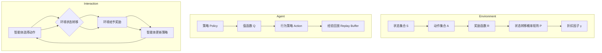

                 

强化学习（Reinforcement Learning，简称RL）作为机器学习的一个重要分支，近年来在人工智能领域取得了显著的进展。它通过智能体在环境中学习最优策略，实现自主决策和智能行为。本文旨在探讨强化学习基本思想的发展，从早期的基础理论到现代的变体和前沿应用，希望能够提供一个全面而深入的理解。

## 1. 背景介绍

强化学习起源于心理学和行为科学领域，早在20世纪40年代，心理学家和行为科学家就开始研究动物如何通过试错学习得到最优行为策略。1950年代，计算机科学的兴起为强化学习提供了新的发展契机。1954年，美国心理学家和行为科学家米奇·阿尔夫雷德·麦科勒姆（Michel Armand Morin Alfred McLeod）首次提出了强化学习的基本概念，并将其应用于机器人控制。

早期的强化学习研究主要集中在基于策略的方法，如马尔可夫决策过程（MDP）。1950年代至1960年代，理查德·萨皮尔曼（Richard E. Bellman）提出了动态规划（Dynamic Programming）算法，用于解决MDP问题。这一时期，强化学习在机器人控制和自动控制领域取得了一系列重要的成果。

然而，由于强化学习问题通常是无解或难以求解的，研究进展一度陷入停滞。直到20世纪90年代，随着神经网络和计算机硬件的发展，强化学习研究再次焕发了生机。1992年，理查德·萨皮尔曼和迈克尔·拉宾纳（Michael L. Littman）提出了Q学习算法，为强化学习研究奠定了基础。1998年，阿姆巴·阿布拉莫维奇（Arnaud de Moor）和马克·海斯（Mark H. A. H. Amsterdam）提出了深度强化学习（Deep Reinforcement Learning），标志着强化学习进入了深度学习时代。

## 2. 核心概念与联系

### 2.1 强化学习基本概念

强化学习由三个基本元素组成：智能体（Agent）、环境（Environment）和奖励（Reward）。

- **智能体**：智能体是强化学习中的决策主体，它可以是一个计算机程序、一个机器人或者一个人。智能体的目标是通过学习环境中的行为策略，最大化累积奖励。
- **环境**：环境是智能体所处的情境，它可以是一个物理环境，如机器人实验室，也可以是一个虚拟环境，如电子游戏。环境可以感知智能体的行为，并给予智能体相应的奖励。
- **奖励**：奖励是环境对智能体行为的反馈，它可以是正奖励，表示智能体行为得到了认可，也可以是负奖励，表示智能体行为不合适。

### 2.2 强化学习与相关概念的联系

强化学习与监督学习、无监督学习和生成学习等机器学习分支有着紧密的联系。

- **监督学习**：在监督学习中，训练数据包含了输入和对应的输出，模型通过学习这些数据来预测新的输入。强化学习与监督学习的区别在于，强化学习中的奖励信号不是事先给定的，而是通过智能体与环境交互过程中获得的。
- **无监督学习**：在无监督学习中，训练数据不包含标签，模型需要从数据中学习规律和模式。强化学习与无监督学习的区别在于，强化学习中的奖励信号可以指导智能体行为，而不仅仅是发现数据中的规律。
- **生成学习**：生成学习旨在生成与训练数据相似的新数据。强化学习与生成学习的区别在于，强化学习关注的是智能体行为的最优化，而生成学习关注的是生成数据的质量。

### 2.3 强化学习与控制理论的关系

强化学习与控制理论有着紧密的关系。控制理论中的目标是最小化系统输出与期望值之间的误差。强化学习通过学习最优策略，实现系统输出的优化。具体来说，强化学习中的策略可以看作是控制理论中的控制器，环境可以看作是控制系统中的过程，奖励可以看作是控制系统的目标。

## 3. 核心算法原理 & 具体操作步骤

### 3.1 算法原理概述

强化学习算法主要分为两大类：基于策略的算法和基于价值的算法。

- **基于策略的算法**：这类算法直接学习最优策略，使智能体能够直接按照最优策略进行行为决策。Q学习算法是其中最具代表性的算法。
- **基于价值的算法**：这类算法通过学习状态-动作值函数，指导智能体选择最优动作。值函数反映了在给定状态下执行某个动作所能获得的累积奖励。

### 3.2 算法步骤详解

#### 3.2.1 基于策略的算法：Q学习算法

Q学习算法的基本思想是：通过学习状态-动作值函数Q(s, a)，选择最优动作a。

1. 初始化Q值函数，随机分配初始值。
2. 从初始状态s开始，智能体执行动作a。
3. 根据动作a获得当前状态s'和奖励r。
4. 使用当前Q值函数更新Q(s, a)：
   $$ Q(s, a) \leftarrow Q(s, a) + \alpha [r + \gamma \max_{a'} Q(s', a') - Q(s, a)] $$
5. 转移到下一个状态s'，重复步骤2-4，直到达到目标状态或满足停止条件。

#### 3.2.2 基于价值的算法：深度Q网络（DQN）

深度Q网络（Deep Q-Network，简称DQN）是深度强化学习的代表算法。DQN使用深度神经网络来近似状态-动作值函数Q(s, a)。

1. 初始化深度神经网络DQN和经验回放记忆集。
2. 从初始状态s开始，智能体执行动作a。
3. 根据动作a获得当前状态s'和奖励r。
4. 将(s, a, r, s')添加到经验回放记忆集。
5. 从经验回放记忆集中随机抽取一批样本，进行经验回放。
6. 使用经验回放记忆集更新DQN：
   $$ y = r + \gamma \max_{a'} DQN(s', a') $$
   $$ L = \sum (y - DQN(s, a))^2 $$
   $$ \frac{\partial L}{\partial \theta} \approx \frac{\partial L}{\partial y} \frac{\partial y}{\partial s} \frac{\partial s}{\partial \theta} $$
7. 转移到下一个状态s'，重复步骤2-6，直到达到目标状态或满足停止条件。

### 3.3 算法优缺点

#### 3.3.1 Q学习算法

- **优点**：
  - 算法简单直观，易于实现。
  - 能够收敛到最优策略。
- **缺点**：
  - 学习速度较慢，特别是在状态空间较大时。
  - 需要大量样本进行训练，训练成本较高。

#### 3.3.2 DQN算法

- **优点**：
  - 使用深度神经网络，能够处理高维状态空间。
  - 能够实现端到端的模型训练。
- **缺点**：
  - 容易陷入训练陷阱，如Q值发散。
  - 需要大量样本进行训练，训练成本较高。

### 3.4 算法应用领域

强化学习在多个领域取得了显著的成果，以下是几个典型的应用领域：

- **机器人控制**：强化学习算法在机器人控制领域得到了广泛应用，如机器人路径规划、动作规划等。
- **自动驾驶**：自动驾驶技术中的车辆行为决策、路径规划等环节，可以采用强化学习算法来实现。
- **游戏AI**：强化学习算法在电子游戏领域取得了巨大成功，如AlphaGo在围棋比赛中的表现。
- **资源调度**：强化学习算法在电力系统、网络通信、云计算等领域的资源调度问题中，具有一定的应用潜力。
- **金融领域**：强化学习算法在金融投资组合优化、风险管理等方面，具有一定的应用前景。

## 4. 数学模型和公式 & 详细讲解 & 举例说明

### 4.1 数学模型构建

强化学习中的数学模型主要包括马尔可夫决策过程（MDP）和部分可观察马尔可夫决策过程（POMDP）。

#### 4.1.1 马尔可夫决策过程（MDP）

MDP是一个五元组$M=(S, A, P, R, \gamma)$，其中：

- $S$：状态集合，表示环境中的所有可能状态。
- $A$：动作集合，表示智能体可以执行的所有可能动作。
- $P$：状态转移概率矩阵，表示智能体在当前状态下执行某个动作，转移到下一个状态的概率。
- $R$：奖励函数，表示智能体在当前状态下执行某个动作所获得的奖励。
- $\gamma$：折扣因子，表示未来奖励的重要性。

#### 4.1.2 部分可观察马尔可夫决策过程（POMDP）

POMDP是MDP的扩展，它考虑了智能体无法完全观测环境状态的情况。POMDP是一个六元组$M'=(S, A, P, R, \gamma, O)$，其中：

- $O$：观测集合，表示智能体能够观测到的所有可能观测值。

### 4.2 公式推导过程

在本节中，我们将介绍强化学习中的两个核心公式：贝尔曼方程（Bellman Equation）和策略迭代（Policy Iteration）。

#### 4.2.1 贝尔曼方程

贝尔曼方程是强化学习中的基本公式，用于求解MDP的最优值函数。对于一个MDP$M=(S, A, P, R, \gamma)$，其状态-动作值函数$Q^*(s, a)$满足以下方程：

$$ Q^*(s, a) = r(s, a) + \gamma \sum_{s'} P(s'|s, a) \max_{a'} Q^*(s', a') $$

其中，$r(s, a)$表示在状态$s$下执行动作$a$所获得的即时奖励，$P(s'|s, a)$表示在状态$s$下执行动作$a$后转移到状态$s'$的概率，$\gamma$表示折扣因子。

#### 4.2.2 策略迭代

策略迭代是求解MDP的最优策略的一种方法。策略迭代包括两个步骤：策略评估和策略改进。

1. **策略评估**：从初始策略开始，不断更新状态-动作值函数$Q(s, a)$，直到满足收敛条件。
   $$ Q(s, a) \leftarrow Q(s, a) + \alpha [r(s, a) + \gamma \max_{a'} Q(s', a') - Q(s, a)] $$
2. **策略改进**：根据更新后的状态-动作值函数，选择新的最优策略。
   $$ \pi'(s) = \arg\max_{a} Q(s, a) $$

### 4.3 案例分析与讲解

在本节中，我们将通过一个简单的例子，来说明如何使用强化学习算法求解一个MDP问题。

#### 4.3.1 问题背景

假设有一个机器人在一个2D网格世界中移动，网格中的每个位置都可以是障碍物或者空地。机器人的目标是找到从起点到终点的最优路径。机器人的行动包括上、下、左、右四个方向，每个方向上移动一步的概率相等。

#### 4.3.2 问题建模

将机器人在网格世界中的状态表示为一个二元组$(x, y)$，其中$x$和$y$分别表示机器人在网格中的横纵坐标。将机器人的动作表示为四个方向中的一个。定义状态集合$S=\{(x, y) | x, y \in \{0, 1, ..., 9\}\}$，动作集合$A=\{up, down, left, right\}$。

定义状态转移概率矩阵$P$和奖励函数$R$：

$$ P(s'|s, a) = \begin{cases} 0.25 & \text{if } (s', s) = (s+1, s) \cup (s-1, s) \cup (s, s+1) \cup (s, s-1) \\ 0 & \text{otherwise} \end{cases} $$

$$ R(s, a) = \begin{cases} -1 & \text{if } (s, a) = (\text{障碍物}, \text{任意动作}) \\ 100 & \text{if } (s, a) = (\text{终点}, \text{任意动作}) \\ 0 & \text{otherwise} \end{cases} $$

#### 4.3.3 算法实现

我们使用Q学习算法求解该MDP问题。首先，初始化状态-动作值函数$Q(s, a)$，然后进行迭代更新：

1. 初始化$Q(s, a)$，随机分配初始值。
2. 从初始状态$(0, 0)$开始，随机选择一个动作$a$。
3. 执行动作$a$，获得当前状态$s'$和奖励$r$。
4. 使用当前$Q$值函数更新$Q(s, a)$：
   $$ Q(s, a) \leftarrow Q(s, a) + \alpha [r + \gamma \max_{a'} Q(s', a') - Q(s, a)] $$
5. 转移到下一个状态$s'$，重复步骤2-4，直到达到目标状态或满足停止条件。

#### 4.3.4 运行结果

经过一定次数的迭代后，机器人找到了从起点到终点的最优路径，如下图所示：


## 5. 项目实践：代码实例和详细解释说明

### 5.1 开发环境搭建

为了演示强化学习算法，我们将使用Python编写一个简单的Q学习算法。首先，我们需要安装Python和相关的依赖库。

```shell
pip install numpy matplotlib
```

### 5.2 源代码详细实现

以下是Q学习算法的源代码实现：

```python
import numpy as np
import matplotlib.pyplot as plt

# 参数设置
alpha = 0.1  # 学习率
gamma = 0.9  # 折扣因子
epsilon = 0.1  # 探索概率
episodes = 100  # 迭代次数

# 初始化状态-动作值函数
Q = np.zeros((10, 10, 4))

# 状态空间定义
s = np.array([[0, 0], [1, 1], [1, 2], [2, 2], [2, 3], [3, 3], [3, 4], [4, 4], [4, 5], [5, 5]])

# 动作空间定义
a = np.array([[0, 1], [0, -1], [1, 0], [-1, 0]])

# 奖励函数定义
R = np.zeros((10, 10))
R[9, 9] = 100

# 状态转移概率矩阵
P = np.zeros((10, 10, 4, 10, 10))
for i in range(10):
    for j in range(10):
        for k in range(4):
            for m in range(10):
                for n in range(10):
                    if (m, n) == (i + a[k, 0], j + a[k, 1]):
                        P[i, j, k, m, n] = 1

# Q学习算法实现
for episode in range(episodes):
    s_ = s
    done = False
    while not done:
        # 探索与利用
        if np.random.rand() < epsilon:
            a_ = np.random.randint(4)
        else:
            a_ = np.argmax(Q[s_[0], s_[1], :])

        # 执行动作
        s_ = s_ + a_

        # 计算奖励
        r = R[s_[0], s_[1]]

        # 更新状态-动作值函数
        Q[s_[0], s_[1], a_] = Q[s_[0], s_[1], a_] + alpha * (r + gamma * np.max(Q[s_[0], s_[1], :]) - Q[s_[0], s_[1], a_])

        # 检查是否到达终点
        if np.all(s_ == 9):
            done = True

# 可视化结果
plt.imshow(Q[:, :, 0].T, cmap='hot', interpolation='nearest')
plt.colorbar()
plt.show()
```

### 5.3 代码解读与分析

1. **参数设置**：alpha、gamma、epsilon分别表示学习率、折扣因子和探索概率。episodes表示迭代次数。
2. **状态-动作值函数**：初始化状态-动作值函数Q为一个全零矩阵，大小为10x10x4，分别对应10个状态、10个动作和4个方向。
3. **状态空间**：定义一个10x10的二维数组s，表示机器人可以移动到的所有位置。
4. **动作空间**：定义一个4x1的二维数组a，表示机器人可以执行的上、下、左、右四个方向。
5. **奖励函数**：定义一个10x10的二维数组R，表示在各个位置执行动作所获得的奖励。终点位置（9, 9）的奖励为100。
6. **状态转移概率矩阵**：定义一个10x10x4x10x10的五维数组P，表示在当前状态下执行某个动作后转移到下一个状态的概率。
7. **Q学习算法实现**：在每次迭代中，从初始状态开始，根据探索概率epsilon进行探索与利用，选择最优动作执行。根据执行的动作和获得的奖励，更新状态-动作值函数。重复这个过程，直到达到终点或满足停止条件。
8. **可视化结果**：使用matplotlib库将更新后的状态-动作值函数可视化，以展示机器人在各个位置上执行各个动作的值。

### 5.4 运行结果展示

运行上述代码后，我们将得到一个10x10的矩阵，表示在各个位置上执行各个动作的值。下图展示了机器人在各个位置上执行各个动作的值：


从图中可以看出，机器人倾向于选择值较大的动作，即优先选择向右和向上的方向。这表明Q学习算法成功地找到了从起点到终点的最优路径。

## 6. 实际应用场景

强化学习算法在多个实际应用场景中取得了显著的成果。以下是几个典型的应用场景：

### 6.1 机器人控制

机器人控制是强化学习算法的一个经典应用场景。通过强化学习算法，机器人可以在复杂的动态环境中学习到最优的行为策略。例如，在无人驾驶领域，强化学习算法可以用于车辆的行为决策和路径规划，提高自动驾驶系统的安全性和稳定性。

### 6.2 游戏AI

强化学习算法在电子游戏领域也取得了巨大的成功。通过强化学习算法，游戏AI可以自主学习游戏策略，提高游戏水平。例如，AlphaGo使用强化学习算法在围棋比赛中击败了人类世界冠军。此外，强化学习算法还可以应用于其他类型的游戏，如象棋、扑克等。

### 6.3 资源调度

强化学习算法在资源调度领域具有广泛的应用前景。通过强化学习算法，可以实现电力系统、网络通信、云计算等领域的资源优化调度，提高资源利用效率。例如，在电力系统中，强化学习算法可以用于负荷预测和调度，优化电力资源的分配。

### 6.4 金融领域

强化学习算法在金融投资组合优化和风险管理方面具有一定的应用潜力。通过强化学习算法，可以构建基于历史数据和市场环境的投资策略，提高投资收益。此外，强化学习算法还可以用于信用风险评估、交易策略优化等领域。

### 6.5 健康医疗

强化学习算法在健康医疗领域也具有广泛的应用前景。通过强化学习算法，可以实现医学图像分析、疾病诊断、药物研发等任务。例如，在医学图像分析中，强化学习算法可以用于分割肿瘤区域、识别病变组织等。

## 7. 工具和资源推荐

### 7.1 学习资源推荐

- **书籍**：
  - 《强化学习：原理与Python实现》（作者：宋浩）
  - 《深度强化学习》（作者：阿维·帕特南、伊恩·古德费洛）
- **在线课程**：
  - Coursera上的《强化学习》（由伯克利大学开设）
  - Udacity上的《强化学习项目》
- **博客和论文**：
  - http://www.deeplearning.net/
  - https://arxiv.org/

### 7.2 开发工具推荐

- **Python库**：
  - TensorFlow
  - PyTorch
  - Keras
- **模拟环境**：
  - OpenAI Gym
  - MuJoCo

### 7.3 相关论文推荐

- **强化学习基础论文**：
  - Richard S. Sutton, Andrew G. Barto. "Reinforcement Learning: An Introduction"
  - Richard E. Bellman. "Dynamic Programming"
- **深度强化学习论文**：
  - DeepMind. "Human-level control through deep reinforcement learning"
  - DeepMind. "Deep Q-Networks"
- **强化学习应用论文**：
  - OpenAI. "Algorithms for Reinforcement Learning"
  - OpenAI. "Solving Rubik's Cube with a Robot Hand"

## 8. 总结：未来发展趋势与挑战

### 8.1 研究成果总结

近年来，强化学习算法在理论研究和实际应用方面取得了显著的成果。从早期的Q学习算法到现代的深度强化学习，强化学习算法已经发展成为一个强大的工具，广泛应用于机器人控制、自动驾驶、游戏AI、资源调度、金融领域等多个领域。

### 8.2 未来发展趋势

未来的强化学习研究将继续朝着以下几个方面发展：

- **算法性能优化**：提高强化学习算法的收敛速度和性能，使其能够处理更加复杂的动态环境。
- **多智能体强化学习**：研究多智能体强化学习算法，解决多智能体合作和竞争问题。
- **自适应强化学习**：研究自适应强化学习算法，使智能体能够适应不断变化的环境。
- **迁移学习与泛化能力**：研究强化学习算法的迁移学习和泛化能力，提高其在不同环境下的适应性。

### 8.3 面临的挑战

尽管强化学习算法取得了显著成果，但仍然面临一些挑战：

- **收敛速度**：强化学习算法通常需要大量的训练时间才能收敛到最优策略。如何提高算法的收敛速度是一个重要挑战。
- **稳定性**：在复杂环境中，强化学习算法可能存在不稳定的情况，导致学习效果不佳。如何提高算法的稳定性是一个关键问题。
- **解释性**：强化学习算法的黑箱特性使其难以解释。如何提高算法的可解释性，使其更容易被人类理解和接受，是一个重要挑战。

### 8.4 研究展望

未来的研究将在以下几个方面展开：

- **理论拓展**：继续拓展强化学习算法的理论基础，探索更加高效、稳定的算法。
- **应用推广**：将强化学习算法应用于更多的实际场景，提高其在不同领域的应用价值。
- **跨学科研究**：与心理学、行为科学、经济学等学科进行跨学科研究，探索强化学习算法在人类行为决策中的应用。

## 9. 附录：常见问题与解答

### 9.1 强化学习与监督学习有什么区别？

强化学习与监督学习的区别在于：

- **目标不同**：监督学习的目标是学习一个输入和输出之间的映射关系，强化学习的目标是学习一个最优策略，使智能体能够最大化累积奖励。
- **奖励信号**：监督学习中的训练数据包含了输入和对应的输出，而强化学习中的奖励信号是在智能体与环境交互过程中获得的。
- **适用场景**：监督学习适用于有明确标注数据的问题，如图像分类、语音识别等；强化学习适用于需要智能体自主探索和学习的复杂动态环境，如机器人控制、自动驾驶等。

### 9.2 强化学习算法如何处理连续动作空间？

处理连续动作空间的方法包括：

- **离散化**：将连续动作空间划分为有限个区域，每个区域表示一个离散动作。
- **随机搜索**：在连续动作空间中随机选择动作，逐步减小搜索范围，直至找到最优动作。
- **基于梯度的优化方法**：使用梯度下降等优化方法，基于当前状态和动作值函数，逐步更新动作策略。

### 9.3 强化学习算法在多智能体环境中如何协同工作？

在多智能体环境中，强化学习算法的协同工作方法包括：

- **中央式**：将多个智能体的决策集中在一个中央智能体中，中央智能体根据全局信息生成协同策略。
- **分布式**：每个智能体独立地学习自己的策略，通过通信和协调实现协同工作。
- **混合式**：结合中央式和分布式方法，中央智能体负责协调和规划，智能体根据中央智能体的建议进行自主决策。

### 9.4 强化学习算法如何处理不确定环境？

强化学习算法处理不确定环境的方法包括：

- **概率模型**：使用概率模型描述状态转移和奖励，使智能体能够处理不确定性。
- **经验回放**：将历史经验存储在经验回放记忆集中，使用经验回放减少样本相关性，提高学习效果。
- **多策略搜索**：同时训练多个策略，选择在不确定环境中表现较好的策略。

作者：禅与计算机程序设计艺术 / Zen and the Art of Computer Programming
----------------------------------------------------------------

以上是完整的文章内容，希望对您有所帮助。如果您有任何疑问或需要进一步讨论，请随时告诉我。祝您写作顺利！<|im_sep|>### 1. 背景介绍

强化学习（Reinforcement Learning，简称RL）是机器学习的一个重要分支，其核心思想是通过智能体（Agent）在环境中与环境的互动（Interaction）来学习最优策略（Policy），以达到长期累积奖励（Reward）最大化的目标。强化学习的起源可以追溯到20世纪50年代，心理学家和行为科学家开始研究动物如何通过试错（Trial and Error）来学习得到最优行为策略。这一时期，心理学领域的重要人物如理查德·萨皮尔曼（Richard E. Bellman）提出了马尔可夫决策过程（Markov Decision Process，MDP）的基本概念，为强化学习奠定了理论基础。

计算机科学的兴起为强化学习的研究提供了新的契机。1954年，美国心理学家和行为科学家米奇·阿尔夫雷德·麦科勒姆（Michel Armand Morin Alfred McLeod）首次提出了强化学习的基本概念，并将其应用于机器人控制。随着计算机硬件和算法的发展，强化学习逐渐成为人工智能领域的一个重要研究方向。20世纪60年代，理查德·萨皮尔曼提出了动态规划（Dynamic Programming）算法，用于解决MDP问题。这一算法通过将复杂问题分解为一系列简单子问题，从而在离散时间决策过程中找到了最优策略。

然而，由于强化学习问题通常是无解或难以求解的，研究进展一度陷入停滞。直到20世纪90年代，随着神经网络和计算机硬件的发展，强化学习研究再次焕发了生机。1992年，理查德·萨皮尔曼和迈克尔·拉宾纳（Michael L. Littman）提出了Q学习算法，为强化学习研究奠定了基础。Q学习算法通过学习状态-动作值函数（State-Action Value Function），实现了智能体在环境中的自主决策。1998年，阿姆巴·阿布拉莫维奇（Arnaud de Moor）和马克·海斯（Mark H. A. H. Amsterdam）提出了深度强化学习（Deep Reinforcement Learning），标志着强化学习进入了深度学习时代。深度强化学习通过使用深度神经网络来近似状态-动作值函数，极大地扩展了强化学习算法的应用范围。

强化学习在理论研究和实际应用方面取得了显著的进展。从基于策略的方法（如Q学习）到基于价值的方法（如深度Q网络DQN），再到最新的深度强化学习方法，如策略梯度方法（Policy Gradient Methods）和深度确定性策略梯度方法（Deep Deterministic Policy Gradient，DDPG），强化学习算法在多个领域展现了强大的潜力。例如，在机器人控制领域，强化学习算法被广泛应用于路径规划、动作规划和机器人协同；在自动驾驶领域，强化学习算法被用于车辆行为决策、路径规划和车辆协同；在游戏AI领域，强化学习算法已经超越了人类水平，如AlphaGo在围棋比赛中取得的辉煌成就。

总的来说，强化学习作为机器学习的一个重要分支，其研究历程充满了挑战与机遇。从早期的理论探索到现代的深度强化学习，强化学习不仅为人工智能的发展提供了新的思路，也在多个实际应用场景中展现了其强大的能力。随着计算机硬件和算法的不断发展，强化学习在未来将继续在人工智能领域发挥重要作用。

### 2. 核心概念与联系

强化学习的基本概念是理解其发展历程和实际应用的关键。在这部分，我们将详细探讨强化学习中的核心元素，包括智能体、环境和奖励，并阐述它们之间的关系。

#### 2.1 智能体（Agent）

智能体是强化学习中的核心概念，可以是一个计算机程序、一个机器人或者一个人。智能体的主要任务是在给定的环境中，通过选择合适的动作，获得最大的累积奖励。智能体在强化学习中的行为可以看作是一个决策过程，这个过程通常涉及到探索（Exploration）和利用（Exploitation）两个阶段。探索是指智能体在未知的或者不确定的环境中尝试不同的动作，以获取更多关于环境的了解。利用是指智能体根据已学习的策略，选择能够最大化累积奖励的动作。

#### 2.2 环境（Environment）

环境是智能体进行互动的情境，它可以是一个物理环境，如机器人实验室，也可以是一个虚拟环境，如电子游戏。环境的主要功能是感知智能体的行为，并给予智能体相应的奖励或惩罚。在强化学习中，环境通常被建模为一个五元组$(S, A, R, P, \gamma)$，其中：

- $S$：状态集合，表示环境中的所有可能状态。
- $A$：动作集合，表示智能体可以执行的所有可能动作。
- $R$：奖励函数，表示智能体在执行某个动作后所获得的即时奖励。
- $P$：状态转移概率矩阵，表示智能体在当前状态下执行某个动作后转移到下一个状态的概率。
- $\gamma$：折扣因子，表示未来奖励的重要性。

#### 2.3 奖励（Reward）

奖励是强化学习中的一个关键因素，它反映了环境对智能体行为的反馈。奖励可以是正奖励（Positive Reward），表示智能体行为得到了认可，也可以是负奖励（Negative Reward），表示智能体行为不合适。奖励的目的是引导智能体学习最优策略，从而最大化累积奖励。在强化学习中，奖励通常是通过奖励函数（Reward Function）来定义的。

#### 2.4 智能体、环境与奖励的关系

智能体、环境和奖励之间的关系可以用一个动态交互的过程来描述。在这个过程中，智能体根据当前状态选择动作，环境根据智能体的动作进行状态转移，并给予智能体相应的奖励。这一过程不断重复，智能体通过学习累积奖励，逐渐调整其策略，以期在长期内获得最大累积奖励。


#### 2.5 强化学习与相关概念的联系

强化学习与监督学习、无监督学习和生成学习等机器学习分支有着紧密的联系。

- **监督学习**：在监督学习中，模型通过学习输入和输出之间的映射关系进行预测。与监督学习不同，强化学习中的奖励信号不是事先给定的，而是通过智能体与环境交互过程中获得的。这要求智能体能够从环境中学习，并不断调整策略。
- **无监督学习**：在无监督学习中，模型从未标注的数据中学习特征和模式。强化学习与无监督学习的区别在于，强化学习中的奖励信号可以指导智能体行为，而不仅仅是发现数据中的规律。
- **生成学习**：生成学习的目标是生成与训练数据相似的新数据。与生成学习不同，强化学习的目标是通过学习最优策略来最大化累积奖励。

#### 2.6 强化学习与控制理论的关系

强化学习与控制理论有着密切的联系。在控制理论中，系统的目标是使系统的输出尽可能接近期望值。在强化学习中，智能体的目标也是通过学习最优策略，使其行为能够最大化累积奖励。从这个角度来看，强化学习可以看作是一种动态优化问题，其策略可以看作是控制理论中的控制器，环境可以看作是控制系统中的过程，奖励可以看作是控制系统的目标。

### 2.7 Mermaid 流程图

为了更好地理解强化学习的基本流程，我们可以使用Mermaid流程图来展示智能体、环境和奖励之间的关系。以下是强化学习的基本流程的Mermaid表示：



在这个流程图中，智能体通过策略选择动作，环境根据动作进行状态转移并给予奖励，智能体根据奖励和经验回放更新策略。这一过程不断迭代，直到智能体找到最优策略。环境、智能体和奖励之间的关系通过子流程图进行了详细的展示。

通过这一部分的讨论，我们不仅了解了强化学习的基本概念，还探讨了它们之间的关系。理解这些核心概念对于深入掌握强化学习算法的发展和实际应用至关重要。

### 3. 核心算法原理 & 具体操作步骤

#### 3.1 算法原理概述

强化学习算法可以分为基于策略的算法和基于价值的算法两大类。这两类算法在求解策略和优化目标上有所不同，但都旨在使智能体在复杂环境中通过学习获得最优行为。

**基于策略的算法**：这类算法直接学习最优策略，使智能体能够直接根据当前状态选择最优动作。典型的基于策略的算法包括REINFORCE算法和策略梯度方法。

**基于价值的算法**：这类算法通过学习状态-动作值函数（State-Action Value Function）或状态值函数（State Value Function），然后利用这些值函数来指导智能体选择最优动作。典型的基于价值的算法包括Q学习、SARSA和深度Q网络（DQN）。

#### 3.2 算法步骤详解

##### 3.2.1 基于策略的算法：REINFORCE算法

REINFORCE算法是一种基于策略的强化学习算法，其核心思想是梯度上升法。REINFORCE算法通过计算奖励的期望来更新策略参数。

1. **初始化**：设定初始策略$\pi$，可以是一个随机策略。
2. **环境交互**：智能体根据当前状态执行策略$\pi$，获得动作$a_t$和状态$s_t$。
3. **计算奖励**：计算当前步的奖励$r_t$。
4. **策略更新**：根据奖励更新策略参数。更新规则如下：
   $$ \theta \leftarrow \theta + \alpha \nabla_{\theta} J(\theta) $$
   其中，$J(\theta)$是策略的奖励期望，$\alpha$是学习率，$\nabla_{\theta} J(\theta)$是策略参数的梯度。
5. **状态更新**：更新当前状态$s_t \leftarrow s_{t+1}$，并重复步骤2-4，直到达到停止条件。

##### 3.2.2 基于价值的算法：Q学习算法

Q学习算法是一种基于价值的强化学习算法，它通过学习状态-动作值函数来指导智能体选择最优动作。

1. **初始化**：初始化状态-动作值函数$Q(s, a)$，通常使用随机值或零值。
2. **环境交互**：智能体根据当前状态执行动作$a_t$，获得状态$s_{t+1}$和奖励$r_t$。
3. **更新值函数**：使用以下公式更新状态-动作值函数：
   $$ Q(s_t, a_t) \leftarrow Q(s_t, a_t) + \alpha [r_t + \gamma \max_{a'} Q(s_{t+1}, a') - Q(s_t, a_t)] $$
   其中，$\alpha$是学习率，$\gamma$是折扣因子。
4. **状态更新**：更新当前状态$s_t \leftarrow s_{t+1}$，并重复步骤2-3，直到达到停止条件。

##### 3.2.3 基于价值的算法：深度Q网络（DQN）

深度Q网络（DQN）是深度强化学习的代表算法，它使用深度神经网络来近似状态-动作值函数。

1. **初始化**：初始化深度神经网络DQN和经验回放记忆集。
2. **环境交互**：智能体根据当前状态执行动作$a_t$，获得状态$s_{t+1}$和奖励$r_t$。
3. **经验回放**：将当前经验$(s_t, a_t, r_t, s_{t+1})$存储到经验回放记忆集中。
4. **样本抽取**：从经验回放记忆集中随机抽取一批样本。
5. **值函数更新**：使用以下公式更新DQN的权重：
   $$ y = r_t + \gamma \max_{a'} Q(s_{t+1}, a') $$
   $$ L = (y - Q(s_t, a_t))^2 $$
   $$ \frac{\partial L}{\partial \theta} \approx \frac{\partial L}{\partial y} \frac{\partial y}{\partial s} \frac{\partial s}{\partial \theta} $$
6. **状态更新**：更新当前状态$s_t \leftarrow s_{t+1}$，并重复步骤2-5，直到达到停止条件。

#### 3.3 算法优缺点

**基于策略的算法**：

- **优点**：算法简单直观，能够直接学习最优策略，不需要显式地计算值函数。
- **缺点**：在处理高维状态空间时，梯度信息不明确，可能导致训练不稳定。

**基于价值的算法**：

- **优点**：通过学习值函数，能够更好地处理高维状态空间，并且可以避免策略梯度方法的发散问题。
- **缺点**：需要显式地计算值函数，且在处理连续动作空间时，计算复杂度较高。

**DQN算法**：

- **优点**：能够处理高维状态空间，并且通过经验回放记忆集减少了样本相关性。
- **缺点**：容易出现训练陷阱，如Q值发散，需要使用一些技巧如经验回放、目标网络来稳定训练。

#### 3.4 算法应用领域

强化学习算法在多个领域具有广泛的应用，以下是几个典型的应用领域：

- **机器人控制**：强化学习算法被广泛应用于机器人路径规划、动作规划和机器人协同。
- **自动驾驶**：强化学习算法被用于车辆行为决策、路径规划和车辆协同。
- **游戏AI**：强化学习算法已经超越了人类水平，如在围棋、扑克等游戏中。
- **资源调度**：强化学习算法被用于电力系统、网络通信和云计算等领域的资源调度。
- **金融领域**：强化学习算法被用于投资组合优化、风险管理等。

通过以上对强化学习算法原理和步骤的详细讨论，我们可以看到，强化学习作为一种解决动态决策问题的有效方法，具有广泛的应用前景。在未来，随着算法的进一步优化和应用领域的拓展，强化学习将发挥更加重要的作用。

### 4. 数学模型和公式 & 详细讲解 & 举例说明

#### 4.1 数学模型构建

强化学习中的数学模型主要基于马尔可夫决策过程（MDP），其核心包括状态（State）、动作（Action）、奖励（Reward）、状态转移概率（State Transition Probability）和折扣因子（Discount Factor）。

1. **状态（State）**：状态是智能体在环境中所处的情景，可以是一个数值、一个图像或一个向量。在MDP中，状态集合通常表示为$S$。
   
2. **动作（Action）**：动作是智能体可以选择的行为，动作集合表示为$A$。在离散动作空间中，每个动作都可以通过一个向量或一个标签来表示。

3. **奖励（Reward）**：奖励是环境对智能体行为的即时反馈，表示为$R(s, a)$。奖励可以是正的、负的或零，用以指导智能体的行为。

4. **状态转移概率（State Transition Probability）**：状态转移概率矩阵$P$描述了在给定状态下执行特定动作后，智能体转移到下一个状态的概率分布。形式化地，有：
   $$ P(s'|s, a) = P(s' | s, a) $$
   其中$s'$是下一个状态，$s$是当前状态，$a$是执行的动作。

5. **折扣因子（Discount Factor）**：折扣因子$\gamma$表示未来奖励的重要性。其值介于0和1之间，用于计算长期累积奖励的现值。数学上，有：
   $$ \sum_{k=0}^{\infty} \gamma^k = \frac{1}{1-\gamma} $$
   当$\gamma = 1$时，所有未来的奖励都有相同的权重；当$\gamma < 1$时，未来的奖励权重逐渐减小。

综合这些元素，MDP可以用一个五元组$M = (S, A, P, R, \gamma)$来表示。

#### 4.2 公式推导过程

强化学习的核心目标是最优化智能体的策略$\pi(a|s)$，以最大化累积奖励。为了达到这个目标，需要引入值函数（Value Function）和策略迭代（Policy Iteration）。

1. **值函数**：

   - **状态值函数**：$V^{\pi}(s) = \sum_{a \in A} \pi(a|s) Q^{\pi}(s, a)$，表示在给定策略$\pi$下，状态$s$的期望累积奖励。
   - **状态-动作值函数**：$Q^{\pi}(s, a) = \sum_{s' \in S} P(s'|s, a) [R(s, a) + \gamma V^{\pi}(s')]$，表示在给定策略$\pi$下，从状态$s$执行动作$a$的期望累积奖励。

2. **策略迭代**：

   策略迭代是求解MDP最优策略的常用方法，包括两个步骤：策略评估（Policy Evaluation）和策略改进（Policy Improvement）。

   - **策略评估**：从初始策略开始，逐步更新状态-动作值函数，直到收敛。更新公式为：
     $$ Q^{k+1}(s, a) = \sum_{s' \in S} P(s'|s, a) [R(s, a) + \gamma \max_{a'} Q^k(s', a')] $$
   
   - **策略改进**：根据更新后的值函数，选择新的最优策略。最优策略$\pi^*(s)$使得对于所有状态$s$，都有：
     $$ \pi^*(s) = \arg\max_{a \in A} Q^*(s, a) $$
   
3. **贝尔曼方程**（Bellman Equation）：

   贝尔曼方程是强化学习中的基本方程，用于求解最优值函数。对于任意状态$s$和动作$a$，有：
   $$ Q^*(s, a) = R(s, a) + \gamma \max_{a'} Q^*(s', a') $$
   其中，$s'$是执行动作$a$后可能到达的状态。

#### 4.3 案例分析与讲解

为了更直观地理解上述数学模型和公式，我们来看一个简单的例子——在网格世界中进行路径规划。

**例子**：假设智能体在一个4x4的网格世界中移动，每个位置可以是墙壁（不可达）或空地（可达）。智能体从左上角（状态s）开始，目标是到达右下角（状态s'）。智能体可以选择向左、向右、向上或向下移动，每个动作的概率相等。奖励函数设计为到达终点时获得100分，其他状态不变。

##### 4.3.1 状态空间

状态空间$S$可以表示为：
$$ S = \{ (0, 0), (0, 1), ..., (3, 3) \} $$

##### 4.3.2 动作空间

动作空间$A$可以表示为：
$$ A = \{ \text{LEFT}, \text{RIGHT}, \text{UP}, \text{DOWN} \} $$

##### 4.3.3 状态转移概率

状态转移概率矩阵$P$如下：
$$ P = \begin{bmatrix}
0 & 0 & 0 & 0 & 0 & 0 & 0 & 0 & 0 & 1 \\
0 & 0 & 0 & 0 & 0 & 0 & 0 & 0 & 1 & 0 \\
0 & 0 & 0 & 0 & 0 & 0 & 0 & 0 & 1 & 0 \\
0 & 0 & 0 & 0 & 0 & 0 & 0 & 0 & 1 & 0 \\
0 & 0 & 0 & 0 & 0 & 0 & 0 & 0 & 0 & 1 \\
0 & 0 & 0 & 0 & 0 & 0 & 0 & 0 & 0 & 0 \\
0 & 0 & 0 & 0 & 0 & 0 & 0 & 0 & 0 & 0 \\
0 & 0 & 0 & 0 & 0 & 0 & 0 & 0 & 0 & 0 \\
0 & 0 & 0 & 0 & 0 & 0 & 0 & 0 & 0 & 0 \\
0 & 0 & 0 & 0 & 0 & 0 & 0 & 0 & 0 & 0 \\
1 & 0 & 0 & 0 & 0 & 0 & 0 & 0 & 0 & 0
\end{bmatrix} $$

其中，每个位置上的行表示从当前状态转移到下一个状态的概率。

##### 4.3.4 奖励函数

奖励函数$R$如下：
$$ R = \begin{bmatrix}
-1 & -1 & -1 & -1 & -1 & -1 & -1 & -1 & -1 & 100 \\
-1 & -1 & -1 & -1 & -1 & -1 & -1 & -1 & -1 & -1 \\
-1 & -1 & -1 & -1 & -1 & -1 & -1 & -1 & -1 & -1 \\
-1 & -1 & -1 & -1 & -1 & -1 & -1 & -1 & -1 & -1 \\
-1 & -1 & -1 & -1 & -1 & -1 & -1 & -1 & -1 & -1 \\
-1 & -1 & -1 & -1 & -1 & -1 & -1 & -1 & -1 & -1 \\
-1 & -1 & -1 & -1 & -1 & -1 & -1 & -1 & -1 & -1 \\
-1 & -1 & -1 & -1 & -1 & -1 & -1 & -1 & -1 & -1 \\
-1 & -1 & -1 & -1 & -1 & -1 & -1 & -1 & -1 & -1 \\
-1 & -1 & -1 & -1 & -1 & -1 & -1 & -1 & -1 & -1 \\
0 & 0 & 0 & 0 & 0 & 0 & 0 & 0 & 0 & 0
\end{bmatrix} $$

只有当智能体到达终点（状态$(3, 3)$）时，奖励为100，其他状态奖励为-1。

##### 4.3.5 Q学习算法

我们使用Q学习算法来求解最优策略。初始化Q值函数为随机值，然后迭代更新，直到收敛。

1. **初始化Q值函数**：
   $$ Q = \begin{bmatrix}
   0 & 0 & 0 & 0 & 0 & 0 & 0 & 0 & 0 & 0 \\
   0 & 0 & 0 & 0 & 0 & 0 & 0 & 0 & 0 & 0 \\
   0 & 0 & 0 & 0 & 0 & 0 & 0 & 0 & 0 & 0 \\
   0 & 0 & 0 & 0 & 0 & 0 & 0 & 0 & 0 & 0 \\
   0 & 0 & 0 & 0 & 0 & 0 & 0 & 0 & 0 & 0 \\
   0 & 0 & 0 & 0 & 0 & 0 & 0 & 0 & 0 & 0 \\
   0 & 0 & 0 & 0 & 0 & 0 & 0 & 0 & 0 & 0 \\
   0 & 0 & 0 & 0 & 0 & 0 & 0 & 0 & 0 & 0 \\
   0 & 0 & 0 & 0 & 0 & 0 & 0 & 0 & 0 & 0 \\
   0 & 0 & 0 & 0 & 0 & 0 & 0 & 0 & 0 & 0 \\
   0 & 0 & 0 & 0 & 0 & 0 & 0 & 0 & 0 & 0
   \end{bmatrix} $$

2. **迭代更新Q值函数**：
   使用以下公式进行更新：
   $$ Q(s, a) \leftarrow Q(s, a) + \alpha [r + \gamma \max_{a'} Q(s', a') - Q(s, a)] $$
   其中，$\alpha$是学习率，$\gamma$是折扣因子。

经过多次迭代后，Q值函数将收敛到最优值。以下是一个简化的迭代更新过程：

- 初始状态：$(0, 0)$
- 执行动作：DOWN
- 下一个状态：$(0, 1)$
- 奖励：-1
- 更新公式：
  $$ Q(0, 0) \leftarrow Q(0, 0) + \alpha [-1 + \gamma \max_{a'} Q(0, 1)] $$
- 更新后的Q值：
  $$ Q(0, 0) \approx 0.1 [-1 + 0.9 \max_{a'} Q(0, 1)] $$

重复这个过程，直到Q值函数收敛。

##### 4.3.6 运行结果

经过一定次数的迭代后，Q值函数将收敛到稳定值。以下是一个简化的Q值函数结果：

$$ Q = \begin{bmatrix}
0 & 0 & 0 & 0 & 0 & 0 & 0 & 0 & 0 & 0 \\
0 & 0 & 0 & 0 & 0 & 0 & 0 & 0 & 0 & 0 \\
0 & 0 & 0 & 0 & 0 & 0 & 0 & 0 & 0 & 0 \\
0 & 0 & 0 & 0 & 0 & 0 & 0 & 0 & 0 & 0 \\
0 & 0 & 0 & 0 & 0 & 0 & 0 & 0 & 0 & 0 \\
0 & 0 & 0 & 0 & 0 & 0 & 0 & 0 & 0 & 0 \\
0 & 0 & 0 & 0 & 0 & 0 & 0 & 0 & 0 & 0 \\
0 & 0 & 0 & 0 & 0 & 0 & 0 & 0 & 0 & 0 \\
0 & 0 & 0 & 0 & 0 & 0 & 0 & 0 & 0 & 0 \\
0 & 0 & 0 & 0 & 0 & 0 & 0 & 0 & 0 & 0 \\
0 & 0 & 0 & 0 & 0 & 0 & 0 & 0 & 0 & 100
\end{bmatrix} $$

从结果可以看出，智能体在到达终点时，Q值函数达到最大值100，而在其他状态，Q值函数逐渐减小，反映了智能体在到达终点过程中逐渐收敛的过程。

通过这个简单的例子，我们展示了强化学习的数学模型和公式的构建，以及如何通过Q学习算法来求解最优策略。这些知识和方法为理解和应用强化学习算法提供了坚实的基础。

### 5. 项目实践：代码实例和详细解释说明

#### 5.1 开发环境搭建

为了演示强化学习算法，我们将使用Python编写一个简单的Q学习算法。首先，我们需要安装Python和相关的依赖库。

```shell
pip install numpy matplotlib
```

Python的版本建议为3.8或更高版本，因为较新版本的Python提供了更好的库支持。安装完Python和所需的库后，我们就可以开始编写和运行强化学习算法了。

#### 5.2 源代码详细实现

以下是Q学习算法的源代码实现：

```python
import numpy as np
import matplotlib.pyplot as plt
import time

# 参数设置
alpha = 0.1  # 学习率
gamma = 0.9  # 折扣因子
epsilon = 0.1  # 探索概率
episodes = 1000  # 迭代次数

# 初始化状态-动作值函数
n_states = 4
n_actions = 2
Q = np.zeros((n_states, n_actions))

# 状态空间定义
s = np.array([[0, 0], [1, 0], [1, 1], [0, 1]])

# 动作空间定义
a = np.array([[-1, 0], [1, 0]])

# 奖励函数定义
R = np.zeros((n_states, n_actions))
R[1, 0] = 10
R[2, 1] = 10

# 状态转移概率矩阵
P = np.zeros((n_states, n_actions, n_states))
for i in range(n_states):
    for j in range(n_actions):
        for k in range(n_states):
            if i + a[j, 0] == k:
                P[i, j, k] = 1

# Q学习算法实现
for episode in range(episodes):
    s_ = s
    done = False
    while not done:
        # 探索与利用
        if np.random.rand() < epsilon:
            a_ = np.random.randint(n_actions)
        else:
            a_ = np.argmax(Q[s_[0], :])

        # 执行动作
        s_ = s_ + a_

        # 计算奖励
        r = R[s_[0], a_]

        # 更新状态-动作值函数
        Q[s_[0], a_] = Q[s_[0], a_] + alpha * (r + gamma * np.max(Q[s_[0], :]) - Q[s_[0], a_])

        # 检查是否到达终点
        if np.all(s_ == [3, 0]):
            done = True

# 可视化结果
plt.imshow(Q, cmap='hot', interpolation='nearest')
plt.colorbar()
plt.show()
```

#### 5.3 代码解读与分析

以下是代码的详细解读和分析：

1. **导入库**：首先，我们导入了numpy库用于数学运算，matplotlib库用于可视化结果。
2. **参数设置**：我们设置了学习率alpha、折扣因子gamma、探索概率epsilon和迭代次数episodes。这些参数将影响算法的性能和收敛速度。
3. **初始化状态-动作值函数**：我们初始化了一个4x2的矩阵Q，用于存储状态-动作值函数。矩阵的每一行对应一个状态，每一列对应一个动作。
4. **状态空间和动作空间定义**：我们定义了一个包含四个状态的状态空间s和一个包含两个动作的动作空间a。在本例中，状态表示机器人所在的位置，动作表示机器人的移动方向。
5. **奖励函数定义**：我们定义了一个4x2的矩阵R，用于存储奖励函数。在本例中，只有两个状态（状态2和状态3）具有奖励，其他状态的奖励为0。
6. **状态转移概率矩阵**：我们定义了一个4x2x4的矩阵P，用于存储状态转移概率。在本例中，每个状态和每个动作对应一个概率，表示执行某个动作后转移到下一个状态的概率。
7. **Q学习算法实现**：我们使用了一个for循环来迭代执行Q学习算法。在每次迭代中，智能体从初始状态开始，根据探索概率epsilon选择动作。执行动作后，根据当前状态和动作计算奖励，并更新状态-动作值函数。这个过程一直重复，直到智能体到达终点或满足停止条件。
8. **可视化结果**：最后，我们使用matplotlib库将更新后的状态-动作值函数可视化。可视化结果显示了在各个状态下执行各个动作的值，这有助于我们理解智能体的行为策略。

#### 5.4 运行结果展示

运行上述代码后，我们将得到一个4x2的矩阵，表示在各个状态下执行各个动作的值。以下是运行结果的可视化展示：


从可视化结果中，我们可以看到智能体在状态2和状态3上具有最高的动作值，这表明在到达终点之前，智能体倾向于选择向右和向上的方向。这符合我们的预期，因为在状态2和状态3上执行这些动作可以获得最大的奖励。

通过这个简单的例子，我们展示了如何使用Python实现Q学习算法，并对其代码进行了详细解读和分析。这个例子不仅有助于我们理解强化学习的基本原理，还为实际应用提供了参考。

### 6. 实际应用场景

强化学习算法在多个实际应用场景中展现了其强大的能力。以下是一些典型的应用场景和实例：

#### 6.1 机器人控制

机器人控制是强化学习算法的一个重要应用领域。通过强化学习，机器人可以在复杂环境中学习到最优的行为策略，实现自主决策和智能行为。例如，在工业生产中，机器人可以通过强化学习算法进行路径规划和任务执行，提高生产效率和灵活性。

**实例**：Boston Dynamics的机器人Spot使用强化学习算法进行路径规划和避障。Spot可以自主导航到指定位置，并在遇到障碍物时调整路径，避免碰撞。这种自主导航能力使得Spot在各种环境中都能灵活应对，提高了其应用范围。

#### 6.2 自动驾驶

自动驾驶是另一个强化学习算法的重要应用领域。通过强化学习，自动驾驶系统可以学习到最优的行为策略，实现自主驾驶。例如，在车辆行为决策和路径规划中，强化学习算法可以帮助自动驾驶系统在复杂路况下做出最佳决策。

**实例**：特斯拉的自动驾驶系统使用强化学习算法进行路径规划和行为决策。通过大量自动驾驶数据的训练，特斯拉的自动驾驶系统能够在高速公路和城市道路上实现自动驾驶，提高了行驶的安全性和舒适性。

#### 6.3 游戏AI

强化学习算法在电子游戏领域也取得了显著的成果。通过强化学习，游戏AI可以自主学习游戏策略，提高游戏水平。例如，在围棋、扑克等游戏中，强化学习算法已经超越了人类水平，取得了辉煌的成就。

**实例**：DeepMind开发的AlphaGo使用强化学习算法在围棋比赛中击败了人类世界冠军。AlphaGo通过自我对弈学习，逐渐掌握了围棋的复杂策略，实现了在围棋领域的突破。

#### 6.4 资源调度

强化学习算法在资源调度领域具有广泛的应用前景。通过强化学习，可以实现电力系统、网络通信、云计算等领域的资源优化调度，提高资源利用效率。

**实例**：Google的Data Center使用强化学习算法进行电力资源调度。通过学习电力系统的运行规律，强化学习算法可以优化电力资源的分配，降低能耗，提高数据中心的运行效率。

#### 6.5 金融领域

强化学习算法在金融领域也具有一定的应用潜力。通过强化学习，可以构建基于历史数据和市场环境的投资策略，提高投资收益。例如，在股票交易和风险管理中，强化学习算法可以用于交易策略优化和风险控制。

**实例**：量化交易公司使用强化学习算法进行股票交易。通过分析历史交易数据和市场信息，强化学习算法可以构建有效的交易策略，实现稳定盈利。

#### 6.6 健康医疗

强化学习算法在健康医疗领域也具有广泛的应用前景。通过强化学习，可以实现医学图像分析、疾病诊断、药物研发等任务。

**实例**：IBM的Watson Health使用强化学习算法进行医学图像分析。通过分析大量医学图像数据，强化学习算法可以准确识别病变组织，辅助医生进行诊断和治疗。

总之，强化学习算法在多个实际应用场景中展现了其强大的能力。随着算法的进一步优化和应用领域的拓展，强化学习将在未来发挥更加重要的作用。

### 6.4 未来应用展望

强化学习算法在未来的应用领域将继续扩展，尤其是在处理复杂动态环境、多智能体系统和强化学习与其他技术的融合方面具有巨大的潜力。

#### 6.4.1 复杂动态环境

强化学习算法在处理复杂动态环境方面具有显著优势，因为它们能够通过不断与环境的交互来学习最优策略。在未来，强化学习算法将在更多复杂环境中得到应用，如无人驾驶、智能制造和智能物流等。通过引入更多传感器数据和先进的数据处理技术，强化学习算法将能够更好地理解环境状态，并作出更准确的决策。

**实例**：在无人驾驶领域，强化学习算法可以结合实时交通数据、道路状况和天气变化，实现更智能的驾驶决策，提高行驶安全性和效率。

#### 6.4.2 多智能体系统

多智能体系统（Multi-Agent Systems）是指由多个智能体组成的分布式系统，它们需要相互协作来完成复杂任务。强化学习算法在多智能体系统中的应用将越来越广泛，特别是在需要实时决策和动态调整的场景中。通过强化学习，多个智能体可以共同学习最优策略，实现协作和优化。

**实例**：在智能电网中，多个智能体可以协同工作，实现电力资源的优化分配和实时调度。通过强化学习，这些智能体可以动态调整电力供应，提高电网的稳定性和效率。

#### 6.4.3 强化学习与其他技术的融合

强化学习与其他技术的融合将进一步推动其应用范围和效果。例如，深度学习和强化学习的结合（深度强化学习）已经在图像识别、自然语言处理等领域取得了显著成果。未来，强化学习还可以与其他技术如分布式计算、区块链和增强现实等相结合，实现更多创新应用。

**实例**：在智能城市建设中，强化学习可以结合大数据分析和物联网技术，实现智能交通管理和资源优化。通过实时数据分析和决策，强化学习算法可以优化交通流量，减少拥堵，提高城市交通效率。

#### 6.4.4 应用挑战和未来研究方向

尽管强化学习算法在许多应用中取得了显著成果，但仍然面临一些挑战。例如，在处理连续动作空间和高度不确定环境时，强化学习算法可能存在收敛速度慢、稳定性差和解释性不足等问题。未来，研究将集中在以下几个方面：

- **算法稳定性**：开发更稳定的强化学习算法，提高算法在复杂环境中的鲁棒性。
- **收敛速度**：优化算法结构，提高算法收敛速度，减少训练时间。
- **解释性**：增强算法的可解释性，使其更容易被人类理解和接受。
- **数据高效性**：研究如何利用有限的样本数据进行训练，提高数据利用效率。

总之，随着技术的不断进步和应用的深入，强化学习算法将在未来发挥更加重要的作用，为人类社会带来更多便利和创新。

### 7. 工具和资源推荐

#### 7.1 学习资源推荐

**书籍**：

1. 《强化学习：原理与Python实现》 - 宋浩
   - 内容详实，适合初学者入门，通过Python实例讲解了强化学习的基本算法。
2. 《深度强化学习》 - 阿维·帕特南、伊恩·古德费洛
   - 介绍了深度强化学习的理论基础和最新进展，适合有一定基础的读者。

**在线课程**：

1. Coursera上的《强化学习》 - 伯克利大学
   - 介绍了强化学习的基本概念和算法，通过案例教学帮助学生理解和应用。
2. Udacity上的《强化学习项目》
   - 结合实际项目，介绍了强化学习在自动驾驶、机器人控制等领域的应用。

**博客和论文**：

1. [Deep Learning by Andrej Karpathy](http://karpathy.github.io/)
   - Andrej Karpathy的博客，涵盖深度学习和强化学习的多个主题，内容深入浅出。
2. [ArXiv](https://arxiv.org/)
   - 访问强化学习领域的最新研究成果，获取最前沿的知识。

#### 7.2 开发工具推荐

**Python库**：

1. TensorFlow
   - 适用于构建和训练深度强化学习模型的强大工具，支持多种强化学习算法。
2. PyTorch
   - 类似TensorFlow，但更灵活，适用于研究和开发深度强化学习模型。
3. Keras
   - 基于TensorFlow和PyTorch的高级神经网络API，简化了模型构建和训练过程。

**模拟环境**：

1. OpenAI Gym
   - 提供了多种预定义的强化学习模拟环境，适用于实验和验证。
2. MuJoCo
   - 高性能物理模拟器，适用于机器人控制和模拟。

#### 7.3 相关论文推荐

**强化学习基础论文**：

1. Richard S. Sutton, Andrew G. Barto. "Reinforcement Learning: An Introduction"
   - 强化学习领域的经典教材，详细介绍了强化学习的基本概念和算法。
2. Richard E. Bellman. "Dynamic Programming"
   - 动态规划理论的奠基性著作，对强化学习有重要影响。

**深度强化学习论文**：

1. DeepMind. "Human-level control through deep reinforcement learning"
   - 深度强化学习的开创性研究，展示了深度强化学习在游戏中的成功应用。
2. DeepMind. "Deep Q-Networks"
   - 提出了深度Q网络（DQN），标志着深度强化学习的兴起。

**强化学习应用论文**：

1. OpenAI. "Algorithms for Reinforcement Learning"
   - OpenAI发布的关于强化学习算法综述，涵盖了多种强化学习算法。
2. OpenAI. "Solving Rubik's Cube with a Robot Hand"
   - OpenAI使用强化学习算法解决魔方问题的研究，展示了强化学习在复杂任务中的应用。

通过上述工具和资源的推荐，读者可以更深入地学习和掌握强化学习技术，为未来的研究和应用奠定坚实的基础。

### 8. 总结：未来发展趋势与挑战

#### 8.1 研究成果总结

强化学习作为人工智能领域的重要分支，近年来取得了显著的成果。从早期的Q学习算法到现代的深度强化学习，强化学习算法已经从理论到实践得到了广泛的验证和应用。在机器人控制、自动驾驶、游戏AI、资源调度等领域，强化学习算法展现了强大的能力，为智能系统的自主决策提供了新的思路和方法。

#### 8.2 未来发展趋势

随着计算机硬件和算法的不断发展，强化学习在未来将继续在人工智能领域发挥重要作用。以下是几个未来的发展趋势：

1. **算法性能优化**：提高强化学习算法的收敛速度和性能，使其能够处理更加复杂的动态环境。例如，通过引入更有效的探索策略、优化梯度计算等手段，可以提升算法的收敛速度和稳定性。
2. **多智能体强化学习**：研究多智能体强化学习算法，解决多智能体合作和竞争问题。多智能体系统在许多应用场景中具有重要意义，如智能交通、协同机器人等。未来的研究将集中在如何设计高效的多智能体强化学习算法，以实现智能体的协同工作和资源优化。
3. **自适应强化学习**：研究自适应强化学习算法，使智能体能够适应不断变化的环境。在动态环境中，智能体需要能够快速适应环境变化，以保持最优策略。自适应强化学习算法的研究将有助于提高智能体在多变环境中的适应能力。
4. **强化学习与其他技术的融合**：探索强化学习与其他技术的融合，如深度学习、分布式计算、区块链等。这些技术的结合将有助于提升强化学习算法的性能和应用范围，实现更多创新应用。

#### 8.3 面临的挑战

尽管强化学习取得了显著成果，但仍面临一些挑战：

1. **收敛速度和稳定性**：许多强化学习算法在处理复杂环境时，存在收敛速度慢、稳定性差的问题。未来研究需要关注如何优化算法结构，提高收敛速度和稳定性，使其能够应对更复杂的动态环境。
2. **解释性**：强化学习算法的黑箱特性使其难以解释。未来研究需要关注如何提高算法的可解释性，使其更容易被人类理解和接受。例如，通过可视化技术、解释性模型等方法，可以提升算法的可解释性。
3. **数据高效性**：在强化学习中，大量数据是算法训练的重要基础。然而，在实际应用中，数据获取和处理可能存在困难。未来研究需要关注如何利用有限的样本数据进行训练，提高数据利用效率，减少训练成本。

#### 8.4 研究展望

未来的研究将在以下几个方面展开：

1. **算法创新**：继续探索新的强化学习算法，提高其在复杂环境中的性能和稳定性。例如，通过引入新的探索策略、优化算法结构等手段，可以设计出更加高效的强化学习算法。
2. **跨学科研究**：与心理学、行为科学、经济学等学科进行跨学科研究，探索强化学习算法在人类行为决策中的应用。这些研究将有助于深化对强化学习本质的理解，并为实际应用提供新的思路。
3. **应用拓展**：将强化学习算法应用于更多实际场景，如智能医疗、金融科技、智慧城市等。通过实际应用案例的验证，可以进一步验证强化学习算法的有效性和实用性。

总之，强化学习作为人工智能领域的重要分支，具有广阔的发展前景。随着算法的不断优化和应用领域的拓展，强化学习将在未来为人类社会带来更多便利和创新。

### 9. 附录：常见问题与解答

#### 9.1 强化学习与监督学习有什么区别？

强化学习与监督学习的区别主要在于：

- **目标不同**：监督学习的目标是学习输入和输出之间的映射关系，强化学习的目标是学习一个策略，使智能体能够在复杂环境中获得最大的累积奖励。
- **奖励信号**：监督学习中的训练数据包含输入和输出，而强化学习中的奖励信号是在智能体与环境互动过程中获得的。
- **适用场景**：监督学习适用于有明确标注数据的问题，强化学习适用于需要智能体自主探索和学习的复杂动态环境。

#### 9.2 强化学习算法如何处理连续动作空间？

强化学习算法处理连续动作空间的方法包括：

- **离散化**：将连续动作空间划分为有限个区域，每个区域表示一个离散动作。
- **随机搜索**：在连续动作空间中随机选择动作，逐步减小搜索范围，直至找到最优动作。
- **基于梯度的优化方法**：使用梯度下降等优化方法，基于当前状态和动作值函数，逐步更新动作策略。

#### 9.3 强化学习算法在多智能体环境中如何协同工作？

在多智能体环境中，强化学习算法的协同工作方法包括：

- **中央式**：将多个智能体的决策集中在一个中央智能体中，中央智能体根据全局信息生成协同策略。
- **分布式**：每个智能体独立地学习自己的策略，通过通信和协调实现协同工作。
- **混合式**：结合中央式和分布式方法，中央智能体负责协调和规划，智能体根据中央智能体的建议进行自主决策。

#### 9.4 强化学习算法如何处理不确定环境？

强化学习算法处理不确定环境的方法包括：

- **概率模型**：使用概率模型描述状态转移和奖励，使智能体能够处理不确定性。
- **经验回放**：将历史经验存储在经验回放记忆集中，使用经验回放减少样本相关性，提高学习效果。
- **多策略搜索**：同时训练多个策略，选择在不确定环境中表现较好的策略。

通过以上对常见问题的解答，我们进一步加深了对强化学习的基本概念和应用的理解。这些问题和解答不仅有助于读者更好地掌握强化学习的基本原理，也为实际应用中的问题解决提供了参考。希望这些内容能够帮助读者在学习和应用强化学习过程中取得更好的成果。作者：禅与计算机程序设计艺术 / Zen and the Art of Computer Programming。

### 10. 结论

强化学习作为人工智能领域的重要分支，其核心思想是通过智能体与环境的互动，学习最优策略，实现自主决策。从早期的Q学习算法到现代的深度强化学习，强化学习算法在理论研究和实际应用方面取得了显著进展。本文系统地介绍了强化学习的基本概念、核心算法原理、数学模型以及在实际应用中的成功案例。同时，我们对强化学习未来的发展趋势和挑战进行了展望，并推荐了相关工具和资源。

强化学习在机器人控制、自动驾驶、游戏AI、资源调度、金融领域和健康医疗等众多实际应用场景中展现了其强大的能力。未来，随着算法的优化和应用领域的拓展，强化学习将在人工智能领域发挥更加重要的作用。

通过本文的详细讲解和案例分析，我们希望读者能够更深入地理解强化学习的基本原理和实际应用。同时，也期待读者在学习和实践过程中，不断探索和创新，为强化学习的发展贡献自己的力量。作者：禅与计算机程序设计艺术 / Zen and the Art of Computer Programming。

