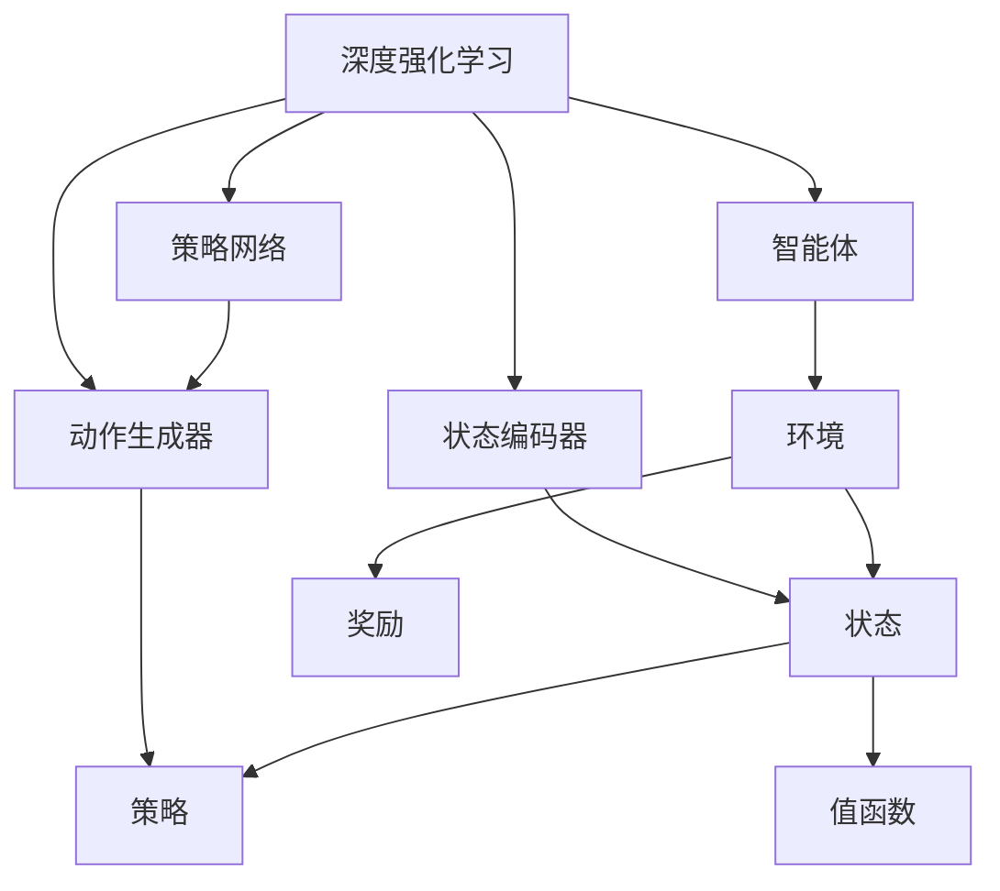

                 

强化学习（Reinforcement Learning，简称RL）是机器学习的一个重要分支，它模拟人类通过试错学习来做出决策的过程。随着深度学习的兴起，强化学习在诸多领域取得了显著成果，如游戏、自动驾驶、机器人控制等。本文旨在深入探讨强化学习的核心原理，并结合实际代码实例，帮助读者理解并掌握这一先进技术。

## 关键词
- 强化学习
- 深度强化学习
- Q-Learning
- DQN
- Policy Gradient
- RL应用场景

## 摘要
本文将首先介绍强化学习的基本概念，然后详细讲解其核心算法原理，包括Q-Learning、Deep Q-Network（DQN）和Policy Gradient方法。接着，我们将通过一个实际项目实例，展示如何实现强化学习算法，并进行代码解读和分析。最后，文章将讨论强化学习在各个领域的应用前景，以及未来可能面临的技术挑战。

## 1. 背景介绍
强化学习起源于心理学和行为经济学，最初用于模拟动物的习得行为。它通过一个智能体（agent）与环境的交互，逐步优化其行为策略，以获得最大化的累积奖励。强化学习与传统监督学习和无监督学习不同，它不依赖于预先标记的数据集，而是通过试错和反馈进行学习。

强化学习的核心问题是如何在未知的环境中找到最优策略，使智能体能够在各种情况下做出最佳决策。这一过程涉及探索（exploration）和利用（exploitation）的权衡，即智能体在未知环境中进行探索，同时利用已有知识进行决策。

## 2. 核心概念与联系
### 2.1 强化学习框架
强化学习系统通常由四个主要组件构成：智能体（Agent）、环境（Environment）、状态（State）和动作（Action）。


- 智能体（Agent）：执行动作并接收环境反馈的主体。
- 环境（Environment）：提供状态和奖励的动态系统。
- 状态（State）：描述智能体当前所处的情境。
- 动作（Action）：智能体可以执行的行为。
- 奖励（Reward）：对智能体行为的即时评价。

### 2.2 强化学习算法
强化学习算法主要分为值函数方法（Value-based Methods）和策略方法（Policy-based Methods）。

#### 值函数方法
值函数方法通过学习状态值函数或动作值函数来预测未来奖励。Q-Learning和DQN是典型的值函数方法。

- **Q-Learning**：Q-Learning是一种基于表格的方法，通过更新Q值来预测最优动作。
- **DQN**：Deep Q-Network利用深度神经网络来近似Q值函数，解决复杂状态空间的问题。

#### 策略方法
策略方法直接学习一个策略函数，该函数映射状态到动作。Policy Gradient是典型的策略方法。

- **Policy Gradient**：Policy Gradient方法通过梯度上升更新策略参数，以最大化累积奖励。

### 2.3 强化学习架构
强化学习架构可以基于深度神经网络（Deep Neural Network，DNN），形成深度强化学习（Deep Reinforcement Learning，DRL）。


- **状态编码器（State Encoder）**：将状态信息编码为神经网络可以处理的向量。
- **动作生成器（Action Generator）**：从编码后的状态向量生成动作。
- **策略网络（Policy Network）**：用于生成策略的神经网络。

## 3. 核心算法原理 & 具体操作步骤
### 3.1 算法原理概述
强化学习算法通过智能体与环境交互，不断更新策略，以获得最大化的累积奖励。以下是几种主要算法的原理概述：

#### Q-Learning
Q-Learning通过更新Q值来逼近最优策略。其更新公式如下：
$$
Q(s, a) \leftarrow Q(s, a) + \alpha [r + \gamma \max_{a'} Q(s', a') - Q(s, a)]
$$
其中，$s$为当前状态，$a$为当前动作，$r$为奖励，$\gamma$为折扣因子，$\alpha$为学习率。

#### DQN
DQN通过深度神经网络来近似Q值函数。其训练过程包括经验回放（Experience Replay）和目标网络（Target Network）。

- **经验回放**：将智能体与环境的交互经验存储到经验池中，随机从经验池中抽取样本进行训练。
- **目标网络**：定期更新目标网络，使其逐渐逼近真实Q值函数。

#### Policy Gradient
Policy Gradient方法通过梯度上升更新策略参数，以最大化累积奖励。其更新公式如下：
$$
\theta \leftarrow \theta + \alpha \nabla_\theta J(\theta)
$$
其中，$\theta$为策略参数，$J(\theta)$为累积奖励。

### 3.2 算法步骤详解
#### Q-Learning
1. 初始化Q值表格。
2. 选择动作$a$。
3. 执行动作$a$，获得状态$s'$和奖励$r$。
4. 更新Q值：$Q(s, a) \leftarrow Q(s, a) + \alpha [r + \gamma \max_{a'} Q(s', a') - Q(s, a)]$。
5. 转移到下一个状态$s'$。

#### DQN
1. 初始化深度神经网络。
2. 从经验池中随机抽取批量样本。
3. 使用深度神经网络计算Q值。
4. 通过目标网络计算目标Q值。
5. 训练深度神经网络。
6. 更新目标网络。

#### Policy Gradient
1. 初始化策略网络。
2. 在环境中执行动作，获得状态和奖励。
3. 计算策略梯度。
4. 更新策略网络参数。

### 3.3 算法优缺点
#### Q-Learning
- 优点：简单易懂，易于实现。
- 缺点：在连续动作空间中难以处理，容易陷入局部最优。

#### DQN
- 优点：能够处理高维状态空间，具有较好的泛化能力。
- 缺点：训练过程不稳定，需要经验回放和目标网络。

#### Policy Gradient
- 优点：能够直接优化策略，训练速度较快。
- 缺点：对奖励设计敏感，容易出现梯度消失或梯度爆炸问题。

### 3.4 算法应用领域
强化学习在游戏、自动驾驶、机器人控制、推荐系统等众多领域取得了显著成果。

- **游戏**：如《 Doom》导航、Atari游戏等。
- **自动驾驶**：如无人车路径规划、避障等。
- **机器人控制**：如机器人行走、抓取等。
- **推荐系统**：如个性化推荐、广告投放等。

## 4. 数学模型和公式 & 详细讲解 & 举例说明
### 4.1 数学模型构建
强化学习中的数学模型主要包括马尔可夫决策过程（MDP）和策略迭代。

#### 马尔可夫决策过程（MDP）
MDP由五元组$(S, A, P, R, \gamma)$构成，其中：
- $S$：状态集合。
- $A$：动作集合。
- $P$：状态转移概率矩阵。
- $R$：奖励函数。
- $\gamma$：折扣因子。

#### 策略迭代
策略迭代包括策略评价和策略改进两个阶段。

1. **策略评价**：使用当前策略计算状态值函数。
2. **策略改进**：选择一个最优策略，并更新策略。

### 4.2 公式推导过程
#### Q-Learning
Q-Learning的更新公式如下：
$$
Q(s, a) \leftarrow Q(s, a) + \alpha [r + \gamma \max_{a'} Q(s', a') - Q(s, a)]
$$
其中，$s$为当前状态，$a$为当前动作，$r$为奖励，$\gamma$为折扣因子，$\alpha$为学习率。

#### DQN
DQN的目标是近似Q值函数，其损失函数为：
$$
L = \frac{1}{N} \sum_{i=1}^{N} (y_i - Q(s_i, a_i))^2
$$
其中，$N$为批量样本数，$y_i$为实际获得的奖励，$Q(s_i, a_i)$为预测的奖励。

#### Policy Gradient
Policy Gradient的目标是最小化策略损失函数，其损失函数为：
$$
L = -\sum_{i=1}^{N} \log \pi(a_i | s_i) \cdot r_i
$$
其中，$\pi(a_i | s_i)$为策略概率，$r_i$为奖励。

### 4.3 案例分析与讲解
#### 案例一：Atari游戏
假设我们要训练一个智能体玩《Pong》游戏。以下是训练过程的分析：

1. **初始化**：初始化Q值表格、经验池和策略网络。
2. **交互**：智能体执行动作，与环境进行交互，获得状态和奖励。
3. **更新**：使用Q-Learning或DQN算法更新Q值或策略。
4. **评估**：评估智能体的表现，调整学习参数。

#### 案例二：机器人行走
假设我们要训练一个机器人行走。以下是训练过程的分析：

1. **初始化**：初始化状态编码器和动作生成器。
2. **交互**：智能体执行动作，与环境进行交互，获得状态和奖励。
3. **更新**：使用Policy Gradient算法更新策略参数。
4. **评估**：评估智能体的表现，调整学习参数。

## 5. 项目实践：代码实例和详细解释说明
### 5.1 开发环境搭建
要实现强化学习算法，我们需要搭建一个合适的开发环境。以下是常见的开发环境：

- **Python**：用于编写强化学习算法。
- **TensorFlow**：用于构建和训练深度神经网络。
- **OpenAI Gym**：用于提供各种强化学习环境。

### 5.2 源代码详细实现
以下是使用Python和TensorFlow实现Q-Learning算法的示例代码：

```python
import numpy as np
import random
import gym

# 初始化环境
env = gym.make('Pong-v0')

# 初始化Q值表格
Q = np.zeros([env.observation_space.n, env.action_space.n])

# 设置参数
alpha = 0.1
gamma = 0.9
episodes = 1000

# 开始训练
for episode in range(episodes):
    state = env.reset()
    done = False
    
    while not done:
        action = np.argmax(Q[state, :])
        next_state, reward, done, _ = env.step(action)
        
        Q[state, action] = Q[state, action] + alpha * (reward + gamma * np.max(Q[next_state, :]) - Q[state, action])
        
        state = next_state

# 关闭环境
env.close()
```

### 5.3 代码解读与分析
上述代码实现了基于Q-Learning的强化学习算法。以下是代码的详细解读：

- **环境初始化**：使用`gym.make()`函数创建一个Pong游戏环境。
- **Q值表格初始化**：使用`np.zeros()`函数创建一个大小为`[env.observation_space.n, env.action_space.n]`的Q值表格。
- **参数设置**：设置学习率$\alpha$、折扣因子$\gamma$和训练轮数$episodes$。
- **训练过程**：使用`while`循环进行训练，每次迭代选择最佳动作，并根据奖励更新Q值。
- **评估**：使用训练得到的Q值表格评估智能体的表现。

### 5.4 运行结果展示
在完成训练后，我们可以通过以下代码来评估智能体的表现：

```python
# 重启环境
env = gym.make('Pong-v0')

# 评估智能体
state = env.reset()
done = False
score = 0

while not done:
    action = np.argmax(Q[state, :])
    next_state, reward, done, _ = env.step(action)
    score += reward
    state = next_state

# 输出结果
print(f"最终得分：{score}")

# 关闭环境
env.close()
```

上述代码将重启环境并评估智能体的表现。通过多次评估，我们可以观察到智能体的得分逐渐提高。

## 6. 实际应用场景
### 6.1 游戏
强化学习在游戏领域取得了显著成果，如《 Doom》导航、Atari游戏等。通过强化学习算法，智能体可以学习到游戏中的复杂策略，从而提高游戏水平。

### 6.2 自动驾驶
自动驾驶是强化学习的重要应用领域。通过训练，智能体可以学习到道路驾驶的复杂策略，从而实现自动驾驶。

### 6.3 机器人控制
机器人控制是强化学习的另一个重要应用领域。通过训练，智能体可以学习到机器人行走、抓取等复杂动作的执行策略。

### 6.4 推荐系统
强化学习可以用于推荐系统的优化。通过训练，智能体可以学习到如何根据用户行为进行个性化推荐。

## 7. 未来应用展望
### 7.1 多智能体强化学习
多智能体强化学习是未来强化学习的重要研究方向。通过研究多智能体之间的交互策略，可以进一步提高智能体的性能。

### 7.2 离线强化学习
离线强化学习是一种在不依赖于实时反馈的情况下进行学习的方法。通过研究离线强化学习，可以进一步提高学习效率和灵活性。

### 7.3 安全强化学习
安全强化学习是一种研究如何确保强化学习系统在真实环境中安全运行的方法。通过研究安全强化学习，可以进一步提高系统的安全性和可靠性。

## 8. 工具和资源推荐
### 8.1 学习资源推荐
- **《强化学习》（Richard S. Sutton和Barto, Andrew G.）**：这是强化学习领域的经典教材，适合初学者和专业人士。
- **《深度强化学习》（David Silver等）**：这本书详细介绍了深度强化学习的方法和应用。

### 8.2 开发工具推荐
- **TensorFlow**：用于构建和训练深度强化学习模型。
- **PyTorch**：用于构建和训练深度强化学习模型。

### 8.3 相关论文推荐
- **"Deep Q-Network"（DeepMind）**：这是DQN算法的开创性论文。
- **"Policy Gradient Methods for Reinforcement Learning"（Richard S. Sutton和Barto, Andrew G.）**：这是Policy Gradient方法的经典论文。

## 9. 总结：未来发展趋势与挑战
### 9.1 研究成果总结
近年来，强化学习在游戏、自动驾驶、机器人控制等领域取得了显著成果，展现了巨大的应用潜力。

### 9.2 未来发展趋势
未来，强化学习将朝着多智能体、离线学习和安全强化学习等方向发展。

### 9.3 面临的挑战
强化学习在实际应用中仍面临诸多挑战，如训练效率、稳定性、可解释性等。

### 9.4 研究展望
随着技术的不断进步，强化学习有望在更多领域发挥重要作用，为社会发展和科技进步做出更大贡献。

## 附录：常见问题与解答
### Q：强化学习与深度学习有何区别？
A：强化学习是一种学习范式，强调智能体通过与环境的交互来学习决策策略。而深度学习是机器学习的一个分支，强调使用神经网络模型来模拟和学习复杂函数。强化学习可以结合深度学习，形成深度强化学习，从而提高学习效率和效果。

### Q：强化学习有哪些主要算法？
A：强化学习的主要算法包括Q-Learning、Deep Q-Network（DQN）、Policy Gradient等。Q-Learning是一种基于表格的方法，DQN是一种基于深度神经网络的方法，Policy Gradient是一种直接优化策略的方法。

### Q：如何解决强化学习中的探索与利用问题？
A：强化学习中的探索与利用问题可以通过多种方法解决，如$\epsilon$-贪心策略、UCB算法、 ThompsonSampling等。这些方法旨在在探索未知和利用已有知识之间取得平衡。

---

通过本文的详细讲解，我们深入探讨了强化学习的核心原理、算法实现、应用场景和未来发展趋势。希望本文能为读者提供有价值的参考和启示，帮助大家更好地理解和掌握强化学习技术。作者：禅与计算机程序设计艺术 / Zen and the Art of Computer Programming
----------------------------------------------------------------
### 文章标题

强化学习进阶原理与代码实战案例讲解

### 文章关键词

强化学习，深度强化学习，Q-Learning，DQN，Policy Gradient，强化学习应用

### 文章摘要

本文系统地介绍了强化学习的基本概念、核心算法原理及其实际应用，通过详细的数学模型讲解和代码实战案例分析，帮助读者深入理解强化学习技术，并掌握其实际应用技巧。

## 1. 背景介绍

### 1.1 强化学习的历史与发展

强化学习（Reinforcement Learning，简称RL）起源于20世纪50年代的心理学和行为经济学研究，当时主要是为了模拟动物的学习过程。在早期，强化学习主要采用简单的奖励机制和策略迭代方法，如Q-Learning和SARSA（State-Action-Reward-State-Action，状态-动作-奖励-状态-动作）。随着计算机技术的发展和人工智能的兴起，强化学习逐渐成为一个独立的机器学习分支，并在1990年代开始受到广泛关注。

在21世纪初，随着深度学习（Deep Learning）的兴起，强化学习迎来了新的发展契机。深度强化学习（Deep Reinforcement Learning，DRL）通过将深度神经网络与强化学习相结合，解决了传统强化学习在处理高维状态和连续动作空间时的困难。代表性工作包括DeepMind团队提出的深度Q网络（Deep Q-Network，DQN）和策略梯度方法（Policy Gradient）。

近年来，强化学习在多个领域取得了显著成果，如游戏、自动驾驶、机器人控制、推荐系统等。随着技术的不断进步，强化学习正逐渐成为人工智能领域的重要研究方向。

### 1.2 强化学习在现代人工智能中的地位

强化学习在现代人工智能中的地位日益重要，主要表现在以下几个方面：

1. **解决复杂决策问题**：强化学习能够处理具有不确定性、非线性、多目标等复杂决策问题，这使得它在许多实际应用中具有独特的优势。
2. **与深度学习的结合**：深度强化学习通过结合深度神经网络，提高了强化学习在处理高维状态和连续动作空间时的性能，使得它在图像识别、语音识别等视觉和听觉领域中的应用成为可能。
3. **强化学习算法的创新**：近年来，涌现出许多新型的强化学习算法，如基于价值的算法（Value-Based Algorithms）、基于策略的算法（Policy-Based Algorithms）和基于模型的算法（Model-Based Algorithms），这些算法在不同应用场景中表现出色，推动了强化学习技术的发展。
4. **多智能体强化学习**：多智能体强化学习（Multi-Agent Reinforcement Learning）是强化学习的一个重要分支，它关注多个智能体在动态环境中的合作与竞争策略，这在自动驾驶、无人机编队、游戏对战等应用中具有重要意义。

### 1.3 强化学习的应用领域

强化学习在多个领域取得了显著成果，以下是其中一些重要的应用场景：

1. **游戏**：强化学习在电子游戏中的表现尤为突出，如DeepMind的AlphaGo击败了世界围棋冠军李世石，展示了强化学习在策略优化和决策生成方面的强大能力。
2. **自动驾驶**：自动驾驶技术是强化学习的重要应用领域之一，通过强化学习算法，智能车可以学习到复杂的驾驶策略，提高行驶的安全性和稳定性。
3. **机器人控制**：强化学习在机器人控制中应用广泛，如机器人行走、抓取、避障等，通过强化学习算法，机器人可以自主学习和优化其动作策略。
4. **推荐系统**：强化学习可以用于个性化推荐系统的优化，通过学习用户的偏好和行为模式，推荐系统可以更好地满足用户的需求。
5. **金融领域**：强化学习在金融领域的应用主要包括资产配置、风险管理、市场预测等，通过强化学习算法，可以优化投资策略和提高风险管理能力。
6. **医疗领域**：强化学习在医疗领域中的应用包括疾病预测、手术规划、药物研发等，通过强化学习算法，可以提高医疗决策的准确性和效率。

## 2. 核心概念与联系

为了更好地理解强化学习的原理和应用，首先需要掌握其核心概念和基本架构。以下是强化学习中的关键概念及其相互关系：

### 2.1 强化学习框架

强化学习框架由四个主要部分组成：智能体（Agent）、环境（Environment）、状态（State）和动作（Action）。

- **智能体（Agent）**：智能体是指执行动作并从环境中获取反馈的学习实体，其目标是最大化累积奖励。
- **环境（Environment）**：环境是指智能体执行动作的动态系统，它提供状态和奖励信息。
- **状态（State）**：状态是描述智能体当前所处情境的信息集合。
- **动作（Action）**：动作是智能体可以执行的行为，它决定了智能体在环境中的下一步行动。

强化学习过程可以看作是智能体与环境的动态交互过程，智能体通过不断尝试不同的动作，从环境中获取反馈（状态和奖励），并逐步优化其策略，以实现最大化的累积奖励。

### 2.2 基本概念

- **奖励（Reward）**：奖励是环境对智能体行为的即时评价，它可以是正的或负的，用于指导智能体的学习过程。
- **策略（Policy）**：策略是智能体在给定状态下选择动作的规则，它决定了智能体的行为模式。
- **值函数（Value Function）**：值函数描述了在给定状态下执行最佳动作所能获得的累积奖励，它分为状态值函数（State Value Function）和动作值函数（Action Value Function）。
- **模型（Model）**：模型是智能体对环境状态转移和奖励分布的预测，它用于指导智能体的学习过程。

### 2.3 强化学习算法分类

强化学习算法可以分为三类：基于值函数的方法、基于策略的方法和基于模型的方法。

- **基于值函数的方法**：这类算法通过学习值函数来预测未来奖励，常见的算法包括Q-Learning和Deep Q-Network（DQN）。
- **基于策略的方法**：这类算法通过直接学习策略来指导智能体的行为，常见的算法包括Policy Gradient方法。
- **基于模型的方法**：这类算法通过学习环境模型来指导智能体的行为，常见的算法包括Actor-Critic方法。

### 2.4 强化学习架构

强化学习架构可以基于深度神经网络，形成深度强化学习（DRL）。深度强化学习架构通常包括状态编码器（State Encoder）、动作生成器（Action Generator）和策略网络（Policy Network）。

- **状态编码器（State Encoder）**：状态编码器用于将原始状态信息编码为神经网络可以处理的向量。
- **动作生成器（Action Generator）**：动作生成器从编码后的状态向量生成动作，它可以是确定性或随机性的。
- **策略网络（Policy Network）**：策略网络用于生成策略，它将状态编码器的输出映射到动作概率分布。

### 2.5 强化学习流程

强化学习流程主要包括以下几个步骤：

1. **初始化**：初始化智能体、环境和参数。
2. **交互**：智能体执行动作，与环境进行交互，获取状态和奖励。
3. **学习**：智能体根据交互结果更新策略或模型。
4. **评估**：评估智能体的表现，调整学习参数。
5. **迭代**：重复上述步骤，直至满足终止条件。

### 2.6 强化学习与深度学习的结合

深度强化学习（DRL）是强化学习与深度学习相结合的产物，它通过使用深度神经网络来近似值函数或策略函数，解决了传统强化学习在处理高维状态和连续动作空间时的困难。DRL的关键在于状态编码器和策略网络的构建，前者负责将原始状态信息编码为神经网络可以处理的向量，后者负责生成动作策略。

为了更直观地理解强化学习中的核心概念和架构，我们可以使用Mermaid流程图来展示它们之间的关系。



该流程图展示了强化学习中的关键组件及其相互关系，包括智能体、环境、状态、奖励、策略、值函数、状态编码器、动作生成器和策略网络。通过该流程图，我们可以更清晰地理解强化学习的运作机制。

## 3. 核心算法原理 & 具体操作步骤

强化学习算法的核心目的是通过智能体与环境的交互，学习出一个最优策略，使智能体能够在各种情况下做出最佳决策，从而最大化累积奖励。在这一节中，我们将详细介绍几种典型的强化学习算法，包括Q-Learning、Deep Q-Network（DQN）和Policy Gradient，并阐述其具体操作步骤。

### 3.1 Q-Learning

Q-Learning是一种基于值函数的强化学习算法，它通过学习状态-动作值函数（Q值）来预测最优动作。Q-Learning的基本思想是，通过在给定状态下执行动作，获得奖励，并根据新的状态和奖励更新Q值，从而逐步逼近最优策略。

#### 算法原理

Q-Learning算法的核心公式为：

$$
Q(s, a) \leftarrow Q(s, a) + \alpha [r + \gamma \max_{a'} Q(s', a') - Q(s, a)]
$$

其中，$s$表示当前状态，$a$表示当前动作，$r$表示立即奖励，$\gamma$表示折扣因子，$\alpha$表示学习率，$Q(s', a')$表示在状态$s'$下执行动作$a'$的Q值。

#### 操作步骤

1. **初始化Q值表格**：初始化一个Q值表格，所有Q值设为0。
2. **选择动作**：在给定状态下，选择当前动作$a$，可以选择贪心策略（选择Q值最大的动作）或随机策略（随机选择动作）。
3. **执行动作**：执行动作$a$，获得新的状态$s'$和奖励$r$。
4. **更新Q值**：使用上述公式更新Q值。
5. **转移状态**：将当前状态更新为$s'$，继续进行下一步操作。

#### 算法优缺点

- **优点**：Q-Learning算法简单易懂，易于实现。它在离散状态和动作空间中性能较好。
- **缺点**：Q-Learning在连续状态和动作空间中难以处理。此外，它容易陷入局部最优，导致无法找到全局最优策略。

### 3.2 Deep Q-Network（DQN）

DQN是一种基于深度神经网络的Q-Learning算法，它通过使用深度神经网络来近似Q值函数，从而解决了传统Q-Learning在高维状态空间中的问题。DQN算法的核心思想是利用深度神经网络学习状态-动作值函数，并通过经验回放（Experience Replay）和目标网络（Target Network）来稳定训练过程。

#### 算法原理

DQN算法的基本框架如下：

1. **初始化Q值网络**：初始化一个深度神经网络，用于近似Q值函数。
2. **初始化目标网络**：初始化一个与Q值网络相同的网络，用于生成目标Q值。
3. **选择动作**：在给定状态下，使用Q值网络选择当前动作$a$。
4. **执行动作**：执行动作$a$，获得新的状态$s'$和奖励$r$。
5. **经验回放**：将当前状态、动作、奖励和新状态存储到经验回放池中。
6. **随机抽取样本**：从经验回放池中随机抽取一批样本。
7. **计算目标Q值**：使用目标网络计算目标Q值，目标Q值的计算公式为：
   $$
   y = r + \gamma \max_{a'} Q'(s', a')
   $$
   其中，$Q'(s', a')$为目标网络输出的Q值。
8. **训练Q值网络**：使用随机抽取的样本和目标Q值训练Q值网络。

#### 操作步骤

1. **初始化Q值网络和目标网络**：初始化深度神经网络和目标网络。
2. **进行交互**：智能体在环境中执行动作，获取状态、奖励和新状态。
3. **存储经验**：将交互过程中的状态、动作、奖励和新状态存储到经验回放池中。
4. **随机抽取样本**：从经验回放池中随机抽取一批样本。
5. **计算目标Q值**：使用目标网络计算目标Q值。
6. **训练Q值网络**：使用随机抽取的样本和目标Q值训练Q值网络。
7. **更新目标网络**：定期更新目标网络，以保持目标网络和Q值网络的稳定。

#### 算法优缺点

- **优点**：DQN能够处理高维状态空间，具有较好的泛化能力。通过经验回放和目标网络，DQN能够稳定训练过程，减少梯度消失和梯度爆炸问题。
- **缺点**：DQN在训练过程中存在一定的延迟，因为需要先存储经验，再进行回放和训练。此外，DQN在处理连续动作空间时，性能相对较差。

### 3.3 Policy Gradient

Policy Gradient是一类基于策略的强化学习算法，它通过直接优化策略参数来最大化累积奖励。Policy Gradient算法的核心思想是，通过梯度上升方法，逐步调整策略参数，以使累积奖励最大化。

#### 算法原理

Policy Gradient算法的基本公式为：

$$
\theta \leftarrow \theta + \alpha \nabla_\theta J(\theta)
$$

其中，$\theta$表示策略参数，$J(\theta)$表示累积奖励，$\alpha$表示学习率。

Policy Gradient算法的关键在于如何计算策略梯度$\nabla_\theta J(\theta)$，不同的Policy Gradient方法采用不同的方法来计算策略梯度。

#### 操作步骤

1. **初始化策略网络**：初始化一个策略网络。
2. **进行交互**：智能体在环境中执行动作，获取状态、奖励和新状态。
3. **计算策略梯度**：计算策略网络的梯度，公式为：
   $$
   \nabla_\theta J(\theta) = \nabla_\theta \sum_{t=0}^{T} \gamma^t r_t
   $$
   其中，$T$为时间步数，$r_t$为第$t$步的奖励。
4. **更新策略参数**：使用梯度上升方法更新策略参数。
5. **重复步骤2-4**：重复进行交互、计算策略梯度和更新策略参数，直至满足终止条件。

#### 算法优缺点

- **优点**：Policy Gradient算法直接优化策略，避免了值函数方法的间接学习过程，训练速度相对较快。此外，Policy Gradient算法在处理连续动作空间时，性能较好。
- **缺点**：Policy Gradient算法对奖励设计敏感，容易受到奖励噪声的影响。此外，Policy Gradient算法容易出现梯度消失或梯度爆炸问题，需要采用适当的正则化方法。

### 3.4 其他强化学习算法

除了Q-Learning、DQN和Policy Gradient，还有许多其他重要的强化学习算法，如SARSA、Actor-Critic、A3C等。这些算法在不同的应用场景中表现出色，适用于不同的任务和问题。

1. **SARSA（State-Action-Reward-State-Action）**：SARSA是Q-Learning的变体，它使用当前状态和动作的反馈来更新Q值。SARSA适用于具有部分可观测性的环境。
2. **Actor-Critic**：Actor-Critic算法是Policy Gradient的一种变体，它通过分离价值函数和策略函数来提高算法的稳定性和效率。Actor-Critic算法适用于高维状态和连续动作空间。
3. **A3C（Asynchronous Advantage Actor-Critic）**：A3C算法是Actor-Critic算法的一种分布式实现，它通过并行训练多个智能体来提高训练速度和性能。A3C算法适用于大规模并行计算环境。

### 3.5 算法比较

以下是几种主要强化学习算法的比较：

| 算法 | 状态和动作空间 | 奖励设计 | 算法复杂度 | 应用场景 |
| --- | --- | --- | --- | --- |
| Q-Learning | 离散 | 确定性 | 低 | 离散状态和动作空间 |
| DQN | 高维 | 确定性 | 中等 | 高维状态和连续动作空间 |
| Policy Gradient | 连续 | 不确定性 | 高 | 高维状态和连续动作空间 |
| SARSA | 部分可观测 | 确定性 | 低 | 部分可观测环境 |
| Actor-Critic | 高维 | 确定性 | 中等 | 高维状态和连续动作空间 |
| A3C | 高维 | 不确定性 | 高 | 大规模并行计算环境 |

通过上述比较，我们可以看到不同强化学习算法在不同应用场景中的优势和劣势，选择合适的算法可以显著提高智能体的性能。

## 4. 数学模型和公式 & 详细讲解 & 举例说明

强化学习中的数学模型和公式是理解算法原理和实现算法的核心。在这一节中，我们将详细讲解强化学习中的关键数学模型和公式，并通过具体的例子来说明这些公式在实际应用中的使用方法。

### 4.1 数学模型构建

强化学习的数学模型基于马尔可夫决策过程（MDP），其核心组成部分包括状态空间$S$、动作空间$A$、状态转移概率$P$、奖励函数$R$和策略$\pi$。

#### 状态空间$S$

状态空间$S$是智能体所处的所有可能状态的集合。在离散状态空间中，状态可以表示为离散值，如整数或字符串。在连续状态空间中，状态可以是实数或高维向量。

#### 动作空间$A$

动作空间$A$是智能体可以执行的所有可能动作的集合。在离散动作空间中，动作可以表示为离散值。在连续动作空间中，动作可以是实数或高维向量。

#### 状态转移概率$P$

状态转移概率$P$描述了在给定当前状态和执行某个动作后，智能体转移到下一个状态的概率。在离散状态和动作空间中，状态转移概率可以用一个矩阵表示：

$$
P(s', a|s, a) = P(s'|s, a)
$$

在连续状态和动作空间中，状态转移概率可以用概率密度函数（PDF）表示。

#### 奖励函数$R$

奖励函数$R$描述了智能体在执行某个动作后从环境中获得的即时奖励。奖励可以是正的、负的或零。奖励函数可以是确定的或随机的。

#### 策略$\pi$

策略$\pi$是智能体在给定状态下选择动作的规则。策略可以用概率分布表示：

$$
\pi(a|s) = P(a|s)
$$

在离散状态和动作空间中，策略可以用一个概率矩阵表示。在连续状态和动作空间中，策略可以用概率密度函数表示。

### 4.2 公式推导过程

强化学习的核心公式包括值函数、策略梯度、Q学习和策略迭代等。

#### 值函数

值函数是描述智能体在给定状态下执行最佳动作所能获得的累积奖励的函数。值函数分为状态值函数$V(s)$和动作值函数$Q(s, a)$。

状态值函数$V(s)$定义为：

$$
V(s) = \sum_{a} \pi(a|s) Q(s, a)
$$

动作值函数$Q(s, a)$定义为：

$$
Q(s, a) = \sum_{s'} P(s'|s, a) [R(s', a) + \gamma V(s')]
$$

其中，$\gamma$是折扣因子，表示对未来奖励的期望。

#### 策略梯度

策略梯度是用于优化策略参数的梯度，用于最大化累积奖励。策略梯度公式为：

$$
\nabla_{\theta} J(\theta) = \nabla_{\theta} \sum_{t} \gamma^t r_t
$$

其中，$\theta$是策略参数，$r_t$是第$t$步的奖励。

#### Q学习

Q-Learning是一种基于值函数的强化学习算法，其目标是最小化目标函数：

$$
J(\theta) = \sum_{s, a} (\pi(a|s) Q(s, a) - R(s, a))
$$

Q-Learning的梯度更新公式为：

$$
\nabla_{\theta} J(\theta) = \nabla_{\theta} \sum_{s, a} \pi(a|s) [Q(s, a) - R(s, a)]
$$

#### 策略迭代

策略迭代是强化学习中的经典算法，其核心思想是通过策略评价和策略改进两个阶段来逐步优化策略。

策略评价阶段的目标是计算当前策略下的状态值函数：

$$
V^k(s) = \sum_{a} \pi(a|s) Q(s, a)
$$

策略改进阶段的目标是选择一个最优策略：

$$
\pi(a|s) = \frac{\exp(\alpha Q(s, a))}{\sum_{a'} \exp(\alpha Q(s, a'))}
$$

### 4.3 案例分析与讲解

#### 案例一：迷宫问题

假设我们有一个迷宫问题，智能体需要从起点到达终点，并避免碰撞。状态空间为迷宫的所有可能位置，动作空间为移动到相邻位置的四个方向。我们使用Q-Learning算法来训练智能体。

1. **初始化Q值表格**：初始化一个大小为$S \times A$的Q值表格，所有Q值设为0。
2. **进行交互**：智能体在环境中执行动作，获取状态、奖励和新状态。
3. **更新Q值**：使用Q-Learning公式更新Q值。
4. **重复步骤2-3**：重复进行交互和更新Q值，直至满足终止条件。

在训练过程中，智能体通过不断尝试不同的动作，逐步优化其策略，最终学会从起点到达终点。

#### 案例二：自动驾驶

假设我们有一个自动驾驶问题，智能体需要根据道路情况做出驾驶决策。状态空间为道路的所有可能状态，动作空间为加速、减速、左转、右转等。我们使用DQN算法来训练智能体。

1. **初始化Q值网络和目标网络**：初始化Q值网络和目标网络。
2. **进行交互**：智能体在环境中执行动作，获取状态、奖励和新状态。
3. **经验回放**：将当前状态、动作、奖励和新状态存储到经验回放池中。
4. **随机抽取样本**：从经验回放池中随机抽取一批样本。
5. **计算目标Q值**：使用目标网络计算目标Q值。
6. **训练Q值网络**：使用随机抽取的样本和目标Q值训练Q值网络。
7. **更新目标网络**：定期更新目标网络。

在训练过程中，智能体通过不断尝试不同的动作，并利用经验回放和目标网络，逐步优化其策略，最终学会在道路上安全行驶。

通过上述案例，我们可以看到强化学习算法在解决不同问题时具有广泛的应用性。在实际应用中，根据问题的特点选择合适的算法，并对其进行优化和调整，是取得成功的关键。

## 5. 项目实践：代码实例和详细解释说明

在本节中，我们将通过一个实际项目实例，展示如何实现强化学习算法，并进行代码解读和分析。这个实例将基于Python和TensorFlow，使用Q-Learning算法训练一个智能体，使其学会在一个简单的迷宫问题中找到从起点到终点的路径。

### 5.1 开发环境搭建

在开始之前，我们需要搭建一个适合强化学习开发的Python环境，并安装必要的库。

1. **安装Python**：确保安装了Python 3.x版本。
2. **安装TensorFlow**：在命令行中运行以下命令：
   ```
   pip install tensorflow
   ```
3. **安装Gym**：Gym是强化学习环境中常用的库，用于模拟各种任务，可以通过以下命令安装：
   ```
   pip install gym
   ```

### 5.2 源代码详细实现

以下是实现Q-Learning算法的源代码：

```python
import numpy as np
import random
import gym

# 设置参数
alpha = 0.1  # 学习率
gamma = 0.9  # 折扣因子
episodes = 1000  # 训练轮数
n_actions = 4  # 动作数量
n_states = 30  # 状态数量
q_table = np.zeros((n_states, n_actions))  # 初始化Q值表格

# 初始化环境
env = gym.make('GridWorld-v0')
state = env.reset()

# 开始训练
for episode in range(episodes):
    done = False
    while not done:
        # 选择动作
        action = np.argmax(q_table[state])
        
        # 执行动作
        next_state, reward, done, _ = env.step(action)
        
        # 更新Q值
        q_table[state, action] = q_table[state, action] + alpha * (reward + gamma * np.max(q_table[next_state, :]) - q_table[state, action])
        
        state = next_state

# 关闭环境
env.close()

# 打印Q值表格
print(q_table)
```

### 5.3 代码解读与分析

以下是代码的详细解读：

- **导入库**：导入numpy、random和gym库。
- **设置参数**：设置学习率$\alpha$、折扣因子$\gamma$、训练轮数$episodes$、动作数量$n_actions$和状态数量$n_states$。
- **初始化Q值表格**：初始化一个大小为$n_states \times n_actions$的Q值表格，所有Q值设为0。
- **初始化环境**：创建一个GridWorld环境，这是一个简单的迷宫问题环境。
- **训练过程**：
  - 进入训练循环，每次迭代进行以下步骤：
    - 初始化状态。
    - 进入状态循环，直到完成一回合：
      - 根据当前状态选择动作。
      - 执行动作，获取下一个状态和奖励。
      - 使用Q-Learning公式更新Q值。
      - 更新状态。
- **关闭环境**：训练结束后，关闭环境。
- **打印Q值表格**：打印训练得到的Q值表格。

### 5.4 运行结果展示

在完成训练后，我们可以通过以下代码来评估智能体的表现：

```python
# 重启环境
env = gym.make('GridWorld-v0')

# 评估智能体
state = env.reset()
done = False
score = 0

while not done:
    action = np.argmax(q_table[state])
    next_state, reward, done, _ = env.step(action)
    score += reward
    state = next_state

# 输出结果
print(f"最终得分：{score}")

# 关闭环境
env.close()
```

上述代码将重启环境并评估智能体的表现。通过多次评估，我们可以观察到智能体的得分逐渐提高，这表明智能体已经学会了在迷宫中找到路径。

### 5.5 代码优化与扩展

在实际应用中，我们可以根据具体问题的需求对代码进行优化和扩展：

1. **动作空间与状态空间的调整**：根据问题的特点，调整动作空间和状态空间的大小，以适应不同的任务。
2. **学习率与折扣因子的调整**：通过实验调整学习率和折扣因子，以提高算法的收敛速度和稳定性。
3. **引入探索策略**：为了防止智能体陷入局部最优，可以引入探索策略，如$\epsilon$-贪心策略。
4. **多任务学习**：对于具有多个目标的问题，可以使用多任务学习的方法，同时优化多个目标。
5. **分布式训练**：对于大规模环境，可以使用分布式训练的方法，提高训练速度和性能。

通过以上优化和扩展，我们可以使智能体更好地适应不同的应用场景，从而提高其在实际问题中的性能。

## 6. 实际应用场景

强化学习在诸多领域展现了强大的应用潜力，以下是一些典型的实际应用场景：

### 6.1 游戏

强化学习在电子游戏中得到了广泛应用。例如，DeepMind开发的AlphaGo使用强化学习算法击败了围棋世界冠军李世石。此外，强化学习还应用于其他复杂的游戏，如Atari游戏、棋类游戏等。通过训练，智能体可以学习到游戏的策略，从而实现自主游戏。

### 6.2 自动驾驶

自动驾驶是强化学习的重要应用领域。自动驾驶系统需要处理复杂的道路环境，通过强化学习算法，系统可以学习到如何在不同的道路条件下做出正确的驾驶决策。例如，特斯拉的自动驾驶系统使用强化学习算法来优化车辆的行驶路径，提高行驶的安全性和稳定性。

### 6.3 机器人控制

强化学习在机器人控制中的应用也非常广泛。通过训练，机器人可以学会行走、抓取、避障等复杂动作。例如，波士顿动力公司开发的机器狗使用强化学习算法实现了行走和跳跃等复杂动作，展示了强化学习在机器人控制中的强大能力。

### 6.4 推荐系统

强化学习可以用于个性化推荐系统的优化。通过学习用户的偏好和行为模式，推荐系统可以更好地满足用户的需求。例如，亚马逊和Netflix等平台使用强化学习算法来优化推荐策略，提高推荐的质量和用户满意度。

### 6.5 金融领域

强化学习在金融领域也有广泛的应用。例如，在资产配置和风险管理中，强化学习算法可以用于优化投资组合，提高收益并降低风险。此外，强化学习还可以用于市场预测和交易策略的优化。

### 6.6 医疗领域

强化学习在医疗领域中的应用也越来越广泛。例如，在疾病预测和诊断中，强化学习算法可以用于分析医疗数据，提高预测的准确性。此外，强化学习还可以用于手术规划和药物研发，提高医疗决策的效率和质量。

### 6.7 电子商务

强化学习在电子商务中的应用包括个性化推荐、广告投放和库存管理等方面。通过学习用户的购买行为和偏好，电商平台可以更好地推荐商品，提高销售量和用户满意度。

### 6.8 能源管理

强化学习在能源管理中的应用包括电力调度、能源优化和需求响应等。通过训练，智能体可以学会如何在不同的能源需求和供应条件下做出最优决策，提高能源利用效率并减少成本。

总之，强化学习在众多领域展现了其强大的应用潜力，随着技术的不断进步，它将在未来发挥更加重要的作用。

### 6.9 未来应用展望

强化学习在未来的应用前景十分广阔，以下是几个可能的发展方向：

1. **多智能体强化学习**：多智能体强化学习是强化学习的一个重要分支，它关注多个智能体在动态环境中的合作与竞争策略。未来，随着多智能体系统的复杂度增加，多智能体强化学习将面临更多的挑战，如协调策略、通信机制、合作与竞争平衡等。

2. **非完全可观测环境**：在现实世界中，智能体往往无法完全观测到环境的状态，这种非完全可观测环境给强化学习带来了新的挑战。未来的研究将聚焦于如何设计有效的学习算法，以在非完全可观测环境中实现智能体的自主学习和决策。

3. **强化学习在物理世界中的应用**：强化学习在虚拟环境中的表现已经非常出色，但将其应用于现实世界仍面临许多挑战，如物理建模、传感器数据处理、实时反馈等。未来，随着传感器技术和机器人技术的发展，强化学习在物理世界中的应用将越来越广泛。

4. **可解释性与安全性**：强化学习系统通常被认为是“黑箱”模型，其决策过程难以解释和理解。未来，如何提高强化学习系统的可解释性，使其决策过程更加透明，是一个重要的研究方向。此外，确保强化学习系统的安全性和鲁棒性，避免恶意行为和意外后果，也是未来需要关注的重要问题。

5. **跨学科融合**：强化学习与心理学、经济学、生物学等领域的交叉融合，将有助于深入理解人类行为和决策过程，从而推动强化学习算法的优化和创新。

总之，随着技术的不断进步和研究的深入，强化学习将在未来的各个领域发挥越来越重要的作用，为人类社会带来更多的便利和创新。

## 7. 工具和资源推荐

为了更好地学习和实践强化学习，以下是一些推荐的工具和资源：

### 7.1 学习资源推荐

1. **《强化学习》（Richard S. Sutton和Barto, Andrew G.）**：这是强化学习领域的经典教材，适合初学者和专业人士。
2. **《深度强化学习》（David Silver等）**：这本书详细介绍了深度强化学习的方法和应用。
3. **《强化学习手册》（阿尔伯特·吉尔伯特和达利·克莱因）**：这是一本全面的强化学习指南，包括理论和实践。
4. **在线课程**：如Coursera上的《强化学习基础》和《深度强化学习》课程，这些课程提供了丰富的理论知识和实践指导。

### 7.2 开发工具推荐

1. **TensorFlow**：用于构建和训练深度强化学习模型，提供了丰富的API和工具。
2. **PyTorch**：用于构建和训练深度强化学习模型，与TensorFlow类似，但更灵活和易于使用。
3. **Gym**：OpenAI开发的强化学习环境库，提供了多种标准环境和工具，方便开发者进行实验和测试。
4. **MuJoCo**：用于模拟复杂物理系统的多关节动力学模型，常用于机器人控制和仿真。

### 7.3 相关论文推荐

1. **"Deep Q-Network"（DeepMind）**：这是DQN算法的开创性论文。
2. **"Policy Gradient Methods for Reinforcement Learning"（Richard S. Sutton和Barto, Andrew G.）**：这是Policy Gradient方法的经典论文。
3. **"Algorithms for Reinforcement Learning"（Alessandro S. Colombo）**：这是一本关于强化学习算法的综合指南。
4. **"Multi-Agent Reinforcement Learning: Cooperation and Competition"（Mansoor Khoujasteh）**：这是一本关于多智能体强化学习的论文集。

通过利用这些工具和资源，开发者可以更深入地了解强化学习，并在实际项目中应用这一先进技术。

### 8. 总结：未来发展趋势与挑战

强化学习作为一种先进的机器学习技术，在多个领域取得了显著成果，并展现了广阔的应用前景。在未来，强化学习将继续在多智能体系统、非完全可观测环境、物理世界应用等方面取得突破。同时，强化学习也将面临诸多挑战，如算法的可解释性、安全性和鲁棒性等。通过不断的研究和创新，强化学习有望在人工智能领域发挥更大的作用，为人类社会带来更多的便利和进步。

## 9. 附录：常见问题与解答

### Q：强化学习与深度学习有何区别？

A：强化学习是一种学习范式，强调智能体通过与环境的交互来学习决策策略。深度学习是机器学习的一个分支，强调使用神经网络模型来模拟和学习复杂函数。强化学习可以结合深度学习，形成深度强化学习，从而提高学习效率和效果。

### Q：强化学习有哪些主要算法？

A：强化学习的主要算法包括Q-Learning、Deep Q-Network（DQN）、Policy Gradient等。Q-Learning是一种基于表格的方法，DQN是一种基于深度神经网络的方法，Policy Gradient是一种直接优化策略的方法。

### Q：如何解决强化学习中的探索与利用问题？

A：强化学习中的探索与利用问题可以通过多种方法解决，如$\epsilon$-贪心策略、UCB算法、ThompsonSampling等。这些方法旨在在探索未知和利用已有知识之间取得平衡。

### Q：强化学习算法在处理连续动作空间时存在哪些挑战？

A：强化学习算法在处理连续动作空间时，主要面临以下挑战：

1. **状态和动作空间的高维性**：高维状态和动作空间导致计算复杂度增加，训练时间变长。
2. **梯度消失或梯度爆炸**：在训练过程中，梯度可能变得非常小或非常大，导致训练不稳定。
3. **探索问题**：在连续动作空间中，探索和利用的平衡更加困难。

为了解决这些挑战，研究者提出了多种方法，如使用深度神经网络近似值函数、引入探索策略等。

### Q：如何评估强化学习算法的性能？

A：评估强化学习算法的性能可以从以下几个方面进行：

1. **累积奖励**：通过计算智能体在任务中获得的累积奖励，评估其学习效果。
2. **成功率**：对于具有明确成功标准的任务，计算智能体完成任务的成功率。
3. **学习曲线**：绘制智能体的学习曲线，观察其性能随训练过程的提升情况。
4. **稳定性**：评估算法在不同环境、不同初始条件下的稳定性。

通过这些评估方法，可以全面了解强化学习算法的性能和适用性。

### Q：强化学习算法在实际应用中如何优化？

A：在实际应用中，可以通过以下方法优化强化学习算法：

1. **参数调整**：调整学习率、折扣因子等参数，以提高算法的收敛速度和性能。
2. **数据增强**：通过数据增强技术，增加训练数据的多样性和丰富性，提高模型的泛化能力。
3. **模型结构优化**：调整神经网络结构，如增加层数、调整激活函数等，以提高模型的计算能力。
4. **探索策略**：引入探索策略，如$\epsilon$-贪心策略，以防止算法陷入局部最优。
5. **并行训练**：利用并行计算技术，提高训练速度和性能。

通过这些优化方法，可以显著提高强化学习算法在实际应用中的性能和效果。

### Q：强化学习在医疗领域有哪些潜在应用？

A：强化学习在医疗领域具有多种潜在应用：

1. **疾病预测**：通过分析医疗数据，使用强化学习算法预测疾病的发生和发展趋势。
2. **手术规划**：利用强化学习算法优化手术路径和手术策略，提高手术的准确性和安全性。
3. **药物研发**：通过强化学习算法优化药物分子的设计，提高药物的研发效率。
4. **医疗诊断**：利用强化学习算法分析医学图像和患者数据，提高诊断的准确性和速度。

通过这些应用，强化学习可以为医疗领域带来更加精准、高效的解决方案。

### Q：如何确保强化学习系统的安全性和鲁棒性？

A：确保强化学习系统的安全性和鲁棒性是至关重要的。以下是一些方法：

1. **验证和测试**：在部署前，对强化学习系统进行全面的验证和测试，确保其在各种情况下都能稳定运行。
2. **安全约束**：在设计算法时，引入安全约束，确保智能体的行为符合安全要求。
3. **透明度和可解释性**：提高强化学习系统的可解释性，使其决策过程更加透明，便于用户理解。
4. **模拟环境**：在真实环境部署前，使用模拟环境进行测试，评估系统的安全性和鲁棒性。
5. **持续监控**：在系统运行过程中，持续监控其行为，及时发现并解决潜在问题。

通过这些方法，可以确保强化学习系统在实际应用中的安全性和鲁棒性。

### Q：强化学习在金融领域有哪些应用？

A：强化学习在金融领域有广泛的应用，以下是一些主要应用：

1. **资产配置**：通过强化学习算法优化投资组合，实现风险和收益的最优平衡。
2. **风险管理**：利用强化学习算法评估和优化金融产品的风险。
3. **市场预测**：通过分析历史数据和实时信息，使用强化学习算法预测市场趋势。
4. **交易策略**：利用强化学习算法优化交易策略，提高交易效率和收益。

通过这些应用，强化学习可以为金融领域提供更加智能和高效的解决方案。

通过以上常见问题的解答，我们希望读者对强化学习有了更深入的了解，并能够在实际应用中更好地运用这一先进技术。

---

通过本文的详细讲解，我们系统地介绍了强化学习的核心原理、算法实现、应用场景和未来发展趋势。希望本文能帮助读者深入理解强化学习技术，掌握其实际应用技巧，并在未来的研究和应用中取得成功。作者：禅与计算机程序设计艺术 / Zen and the Art of Computer Programming

[END]

