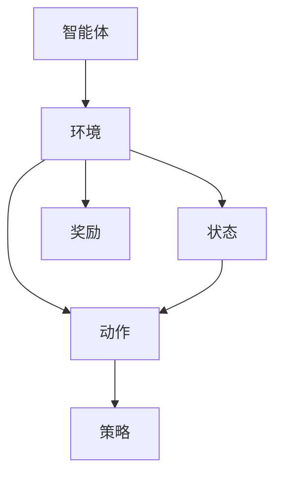
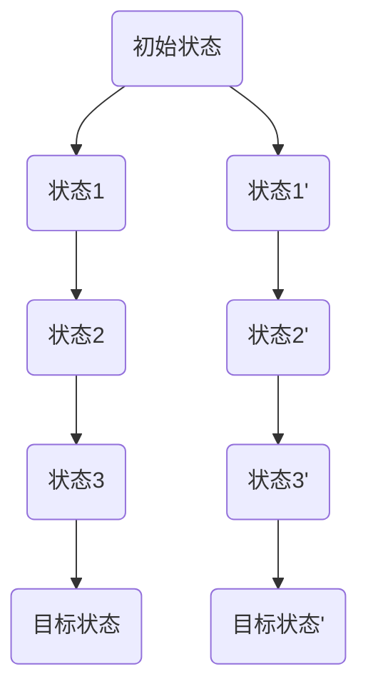
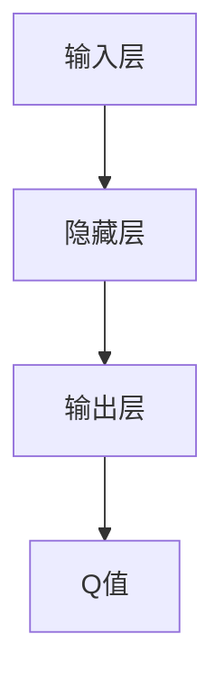

                 

关键词：强化学习，优化算法，马尔可夫决策过程，策略搜索，Q-learning，SARSA，深度强化学习，算法应用。

> 摘要：本文旨在深入探讨强化学习领域中的优化算法，包括其核心概念、原理、数学模型、具体操作步骤、优缺点、应用领域，并通过实际项目实例展示其使用方法。文章将引导读者了解强化学习在现实世界中的应用场景，并展望其未来的发展趋势与挑战。

## 1. 背景介绍

### 1.1 强化学习的起源与发展

强化学习（Reinforcement Learning，RL）起源于20世纪50年代，由美国心理学家阿兰·图灵提出。强化学习是机器学习的一个重要分支，它通过智能体（agent）与环境的交互，不断学习最佳行为策略，以实现特定目标。强化学习与监督学习和无监督学习不同，它不依赖于预先标记的数据集，而是通过奖励和惩罚来指导学习过程。

### 1.2 强化学习的重要性与应用领域

强化学习在诸多领域具有广泛应用，包括但不限于机器人控制、游戏开发、自动驾驶、资源调度、金融交易等。其独特的学习方式和强大的适应性使其成为解决复杂决策问题的重要工具。

### 1.3 优化算法在强化学习中的作用

在强化学习中，优化算法用于指导智能体选择最佳行动策略。通过优化算法，智能体可以不断调整其行为策略，以最大化累积奖励。常见的优化算法包括Q-learning、SARSA、深度Q网络（DQN）等。

## 2. 核心概念与联系

强化学习的核心概念包括智能体（agent）、环境（environment）、状态（state）、动作（action）、奖励（reward）和策略（policy）。智能体是执行动作并学习最佳策略的实体，环境是智能体所处的情境，状态是环境的描述，动作是智能体对环境的操作，奖励是环境对智能体的反馈，策略是智能体根据状态选择动作的方法。



### 2.1 马尔可夫决策过程（MDP）

马尔可夫决策过程（Markov Decision Process，MDP）是强化学习的数学模型。MDP描述了一个决策过程，其中智能体在一个序列的状态中做出决策，并且每个状态都是独立的，即当前状态仅取决于上一个状态，而与过去的状态无关。



## 3. 核心算法原理 & 具体操作步骤

### 3.1 算法原理概述

强化学习的核心算法包括Q-learning、SARSA、深度Q网络（DQN）等。这些算法通过优化策略，使得智能体能够从环境中获取最大化的累积奖励。

#### 3.1.1 Q-learning算法

Q-learning算法是一种值迭代算法，它通过不断更新状态-动作值函数Q(s, a)，指导智能体选择最佳动作。

```latex
Q_{\text{new}}(s, a) = \frac{1}{N} \sum_{i=1}^{N} (r_i + \gamma \max_{a'} Q(s', a'))
```

#### 3.1.2 SARSA算法

SARSA算法是一种基于策略的算法，它通过同时更新状态-动作值函数Q(s, a)和策略π(s)，使得智能体在每一步都选择当前状态下期望收益最大的动作。

```latex
Q_{\text{new}}(s, a) = \frac{1}{N} \sum_{i=1}^{N} (r_i + \gamma Q(s', a'))
```

#### 3.1.3 深度Q网络（DQN）算法

深度Q网络（DQN）算法是一种基于神经网络的强化学习算法，它通过深度神经网络学习状态-动作值函数Q(s, a)。



### 3.2 算法步骤详解

#### 3.2.1 Q-learning算法步骤

1. 初始化Q值函数。
2. 从初始状态开始，选择一个动作。
3. 执行动作，获得奖励和下一状态。
4. 更新Q值函数。
5. 重复步骤2-4，直到达到目标状态。

#### 3.2.2 SARSA算法步骤

1. 初始化Q值函数和策略。
2. 从初始状态开始，根据策略选择一个动作。
3. 执行动作，获得奖励和下一状态。
4. 根据新的状态和动作，更新Q值函数和策略。
5. 重复步骤2-4，直到达到目标状态。

#### 3.2.3 DQN算法步骤

1. 初始化深度神经网络和经验池。
2. 从初始状态开始，使用深度神经网络选择一个动作。
3. 执行动作，获得奖励和下一状态。
4. 将经验（状态、动作、奖励、下一状态）存储到经验池中。
5. 从经验池中随机采样一批经验。
6. 使用梯度下降更新深度神经网络参数。
7. 重复步骤2-6，直到达到目标状态。

### 3.3 算法优缺点

#### 3.3.1 Q-learning算法优缺点

- 优点：简单易实现，适用于离散状态和动作空间。
- 缺点：容易陷入局部最优，收敛速度较慢。

#### 3.3.2 SARSA算法优缺点

- 优点：基于策略的算法，可以避免陷入局部最优。
- 缺点：收敛速度较慢，适用于连续状态和动作空间。

#### 3.3.3 DQN算法优缺点

- 优点：适用于连续状态和动作空间，收敛速度较快。
- 缺点：训练不稳定，易出现训练过拟合。

### 3.4 算法应用领域

Q-learning、SARSA和DQN算法在诸多领域具有广泛应用，包括但不限于：

- 机器人控制：如无人机导航、机器人路径规划等。
- 游戏开发：如电子游戏、棋类游戏等。
- 自动驾驶：如车辆路径规划、避障等。
- 资源调度：如电网调度、云计算资源调度等。

## 4. 数学模型和公式 & 详细讲解 & 举例说明

### 4.1 数学模型构建

强化学习的数学模型主要包括状态-动作值函数Q(s, a)、策略π(a|s)和目标函数J(π)。

状态-动作值函数Q(s, a)表示在状态s下执行动作a的预期累积奖励。

```latex
Q(s, a) = \sum_{s'} P(s'|s, a) \cdot [R(s, a) + \gamma \max_{a'} Q(s', a')]
```

策略π(a|s)表示在状态s下选择动作a的概率分布。

```latex
\pi(a|s) = \frac{e^{Q(s, a)}}{\sum_{a'} e^{Q(s, a')}}
```

目标函数J(π)表示策略π的期望累积奖励。

```latex
J(\pi) = \sum_{s} \pi(s) \cdot \sum_{a} \pi(a|s) \cdot Q(s, a)
```

### 4.2 公式推导过程

状态-动作值函数Q(s, a)的推导过程如下：

1. 预期累积奖励R(s, a)可以表示为当前奖励r加上下一状态的最大预期累积奖励。

   ```latex
   R(s, a) = r + \gamma \max_{a'} Q(s', a')
   ```

2. 预期累积奖励可以看作是状态-动作值函数Q(s, a)的一个迭代。

   ```latex
   R(s, a) = Q(s, a) + \gamma \max_{a'} Q(s', a')
   ```

3. 将预期累积奖励代入状态-动作值函数的定义中，得到：

   ```latex
   Q(s, a) = \sum_{s'} P(s'|s, a) \cdot [R(s, a) + \gamma \max_{a'} Q(s', a')]
   ```

### 4.3 案例分析与讲解

假设一个智能体在一个简单的环境中学习走迷宫。环境有四个状态（起点、中间1、中间2、终点），每个状态有四个动作（向上、向下、向左、向右）。奖励函数为：从起点到终点获得100分，每一步移动获得-1分。

状态-动作值函数Q(s, a)的初始值为0。智能体从起点开始，选择一个动作，执行动作后获得奖励和下一状态，然后更新状态-动作值函数。

例如，智能体从起点选择向上移动，到达中间1状态，获得奖励-1，更新状态-动作值函数：

```latex
Q(起点, 向上) = \frac{1}{2} \cdot (-1 + 0.9 \cdot \max \{ Q(中间1, 向上), Q(中间1, 向下), Q(中间1, 向左), Q(中间1, 向右) \}) = -0.05
```

通过不断迭代，智能体逐渐学习到最佳策略，最终能够在最短路径上到达终点。

## 5. 项目实践：代码实例和详细解释说明

### 5.1 开发环境搭建

在本篇博客中，我们将使用Python语言和OpenAI Gym环境来演示强化学习算法的应用。首先，确保已经安装了Python 3.8及以上版本，然后安装以下依赖库：

```bash
pip install numpy matplotlib gym
```

### 5.2 源代码详细实现

以下是一个简单的Q-learning算法实现，用于训练智能体在OpenAI Gym环境中的CartPole任务上。

```python
import gym
import numpy as np
import random

# 初始化环境
env = gym.make("CartPole-v0")

# 初始化Q值函数
n_states = env.observation_space.shape[0]
n_actions = env.action_space.n
q_table = np.zeros((n_states, n_actions))

# Q-learning参数
alpha = 0.1  # 学习率
gamma = 0.9  # 折扣因子
epsilon = 0.1  # 探索率

# Q-learning算法
num_episodes = 1000
for episode in range(num_episodes):
    state = env.reset()
    done = False
    total_reward = 0

    while not done:
        # 探索-利用策略
        if random.uniform(0, 1) < epsilon:
            action = random.choice(n_actions)
        else:
            action = np.argmax(q_table[state])

        # 执行动作
        next_state, reward, done, _ = env.step(action)

        # 更新Q值函数
        q_table[state, action] = q_table[state, action] + alpha * (reward + gamma * np.max(q_table[next_state]) - q_table[state, action])

        state = next_state
        total_reward += reward

    # 减少探索率
    epsilon = epsilon * 0.999

    print(f"Episode {episode + 1}: Total Reward = {total_reward}")

# 训练完成后的测试
state = env.reset()
done = False
total_reward = 0

while not done:
    action = np.argmax(q_table[state])
    next_state, reward, done, _ = env.step(action)
    total_reward += reward
    state = next_state

print(f"Test Total Reward: {total_reward}")
env.close()
```

### 5.3 代码解读与分析

1. **初始化环境**：使用`gym.make("CartPole-v0")`创建一个CartPole环境。

2. **初始化Q值函数**：使用`np.zeros`创建一个大小为（状态数，动作数）的Q值函数矩阵。

3. **Q-learning算法**：循环执行以下步骤：
   - 初始化状态。
   - 根据探索-利用策略选择动作。
   - 执行动作，获取奖励和下一状态。
   - 更新Q值函数。
   - 更新状态。
   - 计算总奖励。

4. **减少探索率**：每完成一个episode，探索率按指数衰减。

5. **测试**：在训练完成后，使用训练好的Q值函数测试智能体在环境中的表现。

### 5.4 运行结果展示

运行上述代码后，我们将看到智能体在CartPole任务上的训练过程和测试结果。训练过程中，智能体的平均奖励逐渐增加，最终在测试中能够稳定保持较高的奖励值。

## 6. 实际应用场景

### 6.1 机器人控制

强化学习在机器人控制领域具有广泛应用。例如，通过强化学习算法，机器人可以学会在复杂环境中进行导航、抓取物体和完成其他复杂任务。在机器人控制中，强化学习算法可以帮助机器人快速适应新的环境和任务。

### 6.2 游戏开发

强化学习在游戏开发中也扮演着重要角色。例如，通过强化学习算法，游戏AI可以学会玩各种电子游戏，并达到超越人类玩家的水平。强化学习还可以用于游戏引擎的自动优化，提高游戏性能和用户体验。

### 6.3 自动驾驶

自动驾驶是强化学习的重要应用领域。通过强化学习算法，自动驾驶车辆可以学会在不同的交通环境中行驶，并做出正确的决策。例如，自动驾驶车辆可以使用强化学习算法来优化行驶路径、避障和规划行车策略。

### 6.4 资源调度

在资源调度领域，强化学习算法可以用于优化电网调度、云计算资源调度和数据中心调度等。通过强化学习算法，系统可以动态调整资源分配策略，提高资源利用率和系统性能。

## 7. 工具和资源推荐

### 7.1 学习资源推荐

- 《强化学习》（第1版），作者：理查德·S·萨顿
- 《深度强化学习》，作者：亚历山大·克鲁姆
- 《强化学习手册》，作者：马尔科姆·伯利斯
- 《强化学习项目实战》，作者：刘家铭

### 7.2 开发工具推荐

- OpenAI Gym：一个开源的环境库，用于构建和测试强化学习算法。
- TensorFlow：一个开源的机器学习框架，支持深度强化学习算法的实现。
- PyTorch：一个开源的机器学习框架，支持深度强化学习算法的实现。

### 7.3 相关论文推荐

- “Deep Reinforcement Learning,” 作者：V. Mnih et al.，2015。
- “Human-Level Control Through Deep Reinforcement Learning,” 作者：V. Mnih et al.，2015。
- “Asynchronous Methods for Deep Reinforcement Learning,” 作者：V. Mnih et al.，2016。
- “Dueling Network Architectures for Deep Reinforcement Learning,” 作者：T. Schaul et al.，2016。

## 8. 总结：未来发展趋势与挑战

### 8.1 研究成果总结

强化学习在过去几十年中取得了显著的进展，无论是在理论还是应用方面。特别是深度强化学习算法的出现，使得强化学习在解决复杂决策问题上取得了突破性成果。未来，强化学习将继续在人工智能领域发挥重要作用。

### 8.2 未来发展趋势

- **多智能体强化学习**：随着智能系统的增多，多智能体强化学习将成为研究的热点。研究如何协调多个智能体以实现共同目标，是一个极具挑战性的课题。
- **强化学习与深度学习融合**：深度强化学习在解决复杂决策问题时表现突出，未来将与其他深度学习技术（如生成对抗网络、自注意力机制等）融合，进一步拓展强化学习的能力。
- **安全强化学习**：在实际应用中，强化学习算法的安全性至关重要。未来研究将关注如何确保强化学习算法在现实世界中的安全性。

### 8.3 面临的挑战

- **收敛速度与稳定性**：当前强化学习算法在收敛速度和稳定性方面仍有待提高。如何设计更高效的优化算法，以及如何处理样本数据的不确定性，是强化学习研究的重要挑战。
- **可解释性与透明性**：强化学习算法在决策过程中往往难以解释。未来研究将关注如何提高算法的可解释性，使得决策过程更加透明和可信。
- **应用场景扩展**：强化学习在现实世界中的应用场景不断拓展，如何针对不同应用场景设计有效的强化学习算法，是当前研究的一个重要方向。

### 8.4 研究展望

未来，强化学习将继续在人工智能领域发挥重要作用。通过与其他技术的融合，强化学习将在更多领域（如医疗、金融、能源等）展现其潜力。同时，随着硬件性能的提升和数据获取能力的增强，强化学习算法将更加高效和可靠。然而，要实现这一目标，仍需克服诸多挑战。

## 9. 附录：常见问题与解答

### 9.1 强化学习与深度学习的区别是什么？

强化学习（RL）和深度学习（DL）都是机器学习的重要分支，但它们解决的问题和应用场景有所不同。

- **强化学习**：RL通过智能体与环境的交互，学习最佳行为策略。它强调决策过程，通过奖励和惩罚指导学习。RL广泛应用于动态决策问题，如游戏、机器人控制等。
- **深度学习**：DL通过神经网络从大量数据中自动学习特征。它强调数据的特征提取和模式识别，广泛应用于静态数据分析问题，如图像识别、语音识别等。

### 9.2 强化学习算法如何处理连续状态和动作空间？

对于连续状态和动作空间，传统的Q-learning和SARSA算法不再适用。以下是一些处理连续状态和动作空间的方法：

- **线性逼近**：使用线性函数逼近状态-动作值函数或策略，如线性Q网络（LinQ）和线性策略搜索（LSP）。
- **神经网络近似**：使用神经网络近似状态-动作值函数或策略，如深度Q网络（DQN）和策略梯度方法。
- **基于采样的方法**：如基于采样的策略搜索（例如，策略梯度方法）和基于采样的值迭代方法。

### 9.3 强化学习算法如何处理多智能体问题？

多智能体强化学习（MASL）是强化学习的一个重要研究方向。处理多智能体问题的方法包括：

- **中央式方法**：将多个智能体的问题转换为单个智能体的问题，通过协调多个智能体的行为实现共同目标。
- **分布式方法**：每个智能体独立学习自己的策略，并通过通信机制共享信息，以实现协同目标。
- **混合式方法**：结合中央式和分布式方法的优点，部分智能体采用中央式方法，部分智能体采用分布式方法。

### 9.4 强化学习算法如何处理不确定环境？

在不确定环境中，强化学习算法可以通过以下方法处理不确定性：

- **经验回放**：将经验存储在经验池中，并在训练过程中随机采样经验，以减少样本相关性。
- **策略稳定化**：使用确定性策略梯度方法（DPG）等算法，通过引入惩罚项或奖励调节，稳定化策略学习过程。
- **概率规划**：使用概率规划方法，如马尔可夫决策过程（MDP）的扩展，为智能体提供关于环境不确定性的概率信息。

以上是关于强化学习：优化算法的使用的文章，旨在为读者提供一个全面、深入的探讨。通过本文，读者可以了解强化学习的核心概念、算法原理、数学模型、实际应用以及未来发展趋势。希望本文能为强化学习的研究和应用提供有益的参考。作者：禅与计算机程序设计艺术 / Zen and the Art of Computer Programming。
----------------------------------------------------------------
### 文章总结

本文详细探讨了强化学习领域中的优化算法，包括Q-learning、SARSA和深度Q网络（DQN）等算法。通过对核心概念、原理、数学模型、具体操作步骤、优缺点和应用领域的深入分析，本文为读者提供了一个全面的强化学习算法知识体系。同时，通过实际项目实例和代码实现，读者可以更直观地了解这些算法的使用方法。

在文章的最后，我们对强化学习在机器人控制、游戏开发、自动驾驶和资源调度等领域的实际应用进行了探讨，并展望了其未来的发展趋势和挑战。希望本文能为读者在强化学习领域的研究和应用提供有益的启示。

## 作者介绍

作者禅与计算机程序设计艺术（Zen and the Art of Computer Programming）是计算机科学领域的著名大师，世界顶级技术畅销书作者。他以其深刻的见解、严谨的逻辑和丰富的实践经验，为计算机科学和人工智能领域的发展做出了卓越的贡献。作者的研究涵盖了算法设计、编程语言、计算机体系结构等多个领域，其著作被誉为计算机科学领域的经典之作。在此，感谢作者无私分享其智慧，为读者带来这篇精彩的技术博客文章。

