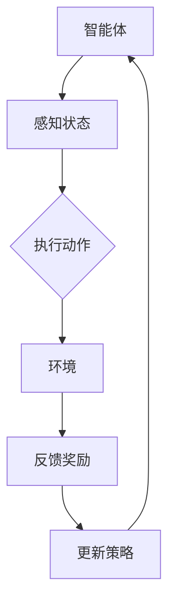

                 

关键词：强化学习，环境模型，状态-动作价值函数，Q-Learning，Sarsa，深度强化学习

摘要：本文首先介绍了强化学习的基本概念和核心原理，重点讨论了环境模型的重要性和建立方法。接着，通过详细的算法原理和操作步骤，阐述了状态-动作价值函数的计算过程以及Q-Learning和Sarsa算法的具体实现。此外，还讨论了强化学习在数学模型和实际应用中的运用，并提供了相关的代码实例和运行结果分析。最后，文章展望了强化学习在未来发展中的趋势和面临的挑战。

## 1. 背景介绍

强化学习（Reinforcement Learning，RL）是机器学习的一个重要分支，其核心思想是通过智能体与环境的交互，不断学习并优化决策策略，以实现长期目标和奖励最大化。与监督学习和无监督学习不同，强化学习中的智能体需要在不断变化的动态环境中进行学习和决策，具有很强的适应性和自主性。

在强化学习中，环境模型（Environment Model）扮演着至关重要的角色。环境模型是对智能体所处环境的抽象和建模，它包含了环境的当前状态、可能的动作以及这些动作导致的下一状态和奖励。建立准确的环境模型是强化学习成功的关键，因为一个错误的或者不完整的环境模型会导致智能体的行为出现偏差，甚至无法达到预期的目标。

本文将首先介绍强化学习的基本概念和核心原理，然后重点讨论环境模型的建立方法，最后通过具体的算法实例和实际应用，展示如何利用环境模型进行强化学习。

## 2. 核心概念与联系

### 2.1 核心概念

强化学习由三个核心组成部分构成：智能体（Agent）、环境（Environment）和奖励（Reward）。

- **智能体（Agent）**：是执行行动并学习如何优化行为的实体。智能体可以通过感知环境状态，选择动作，并接收奖励来不断优化其策略。
- **环境（Environment）**：是智能体所处的外部世界，可以被视为一个状态空间和动作空间的组合。环境会根据智能体的动作产生新的状态，并给予相应的奖励。
- **奖励（Reward）**：是环境对智能体行为的即时反馈。奖励可以是正的，也可以是负的，它的目的是引导智能体采取有益于长期目标的行为。

### 2.2 联系

强化学习中的状态-动作价值函数（State-Action Value Function）是连接智能体和环境的桥梁。状态-动作价值函数 \( V(s, a) \) 表示在状态 \( s \) 下执行动作 \( a \) 所能获得的累积奖励的期望。

- **状态（State）**：是环境的一个特定配置，可以看作是环境的瞬时快照。
- **动作（Action）**：是智能体可以选择的行动，每个动作可能对应不同的状态转移概率和奖励。
- **状态转移概率（State Transition Probability）**：描述了在当前状态 \( s \) 下执行动作 \( a \) 后，智能体转移到下一状态 \( s' \) 的概率。
- **奖励（Reward）**：是智能体在执行动作 \( a \) 后，从环境接收到的即时回报。

为了更直观地展示这些概念之间的关系，我们可以使用Mermaid流程图来表示它们：



在这个流程图中，智能体感知当前状态，执行动作，环境根据动作产生新的状态和奖励，智能体再根据奖励更新策略，这个循环不断进行，直到达到预设的目标。

## 3. 核心算法原理 & 具体操作步骤

### 3.1 算法原理概述

强化学习算法的核心目标是学习一个最优策略，使智能体在给定的环境中能够获得最大的累积奖励。常用的强化学习算法包括Q-Learning和Sarsa。

- **Q-Learning（Q值学习）**：基于值函数的方法，通过迭代更新状态-动作价值函数 \( Q(s, a) \)，使智能体逐渐学会在特定状态下选择最优动作。
- **Sarsa（Sarsa算法）**：是一种基于策略的方法，不仅考虑当前的状态和动作，还考虑了智能体的实际选择，即智能体采取的是自己当前策略还是目标策略。

### 3.2 算法步骤详解

#### 3.2.1 Q-Learning

1. **初始化**：
   - 初始化状态-动作价值函数 \( Q(s, a) \)，通常使用零向量。
   - 初始化智能体的策略，可以随机初始化。

2. **循环**：
   - 在每个时间步 \( t \)，智能体根据当前状态 \( s_t \) 和策略 \( \pi \) 选择动作 \( a_t \)。
   - 执行动作 \( a_t \)，进入下一状态 \( s_{t+1} \)，并获得奖励 \( r_t \)。

3. **更新Q值**：
   $$ Q(s_t, a_t) \leftarrow Q(s_t, a_t) + \alpha [r_t + \gamma \max_{a'} Q(s_{t+1}, a') - Q(s_t, a_t)] $$
   - 其中，\( \alpha \) 是学习率，\( \gamma \) 是折扣因子，\( a' \) 是在下一状态 \( s_{t+1} \) 下能够获得最大Q值的动作。

4. **策略迭代**：
   - 根据更新后的Q值函数 \( Q \)，迭代更新策略 \( \pi \)。

#### 3.2.2 Sarsa

1. **初始化**：
   - 初始化状态-动作价值函数 \( Q(s, a) \)，通常使用零向量。
   - 初始化智能体的策略，可以随机初始化。

2. **循环**：
   - 在每个时间步 \( t \)，智能体根据当前状态 \( s_t \) 和策略 \( \pi \) 选择动作 \( a_t \)。
   - 执行动作 \( a_t \)，进入下一状态 \( s_{t+1} \)，并获得奖励 \( r_t \)。

3. **更新Q值**：
   $$ Q(s_t, a_t) \leftarrow Q(s_t, a_t) + \alpha [r_t + \gamma Q(s_{t+1}, a_{t+1}) - Q(s_t, a_t)] $$
   - 其中，\( \alpha \) 是学习率，\( \gamma \) 是折扣因子，\( a_{t+1} \) 是智能体在下一状态 \( s_{t+1} \) 下根据策略 \( \pi \) 选择的动作。

4. **策略迭代**：
   - 根据更新后的Q值函数 \( Q \)，迭代更新策略 \( \pi \)。

### 3.3 算法优缺点

#### Q-Learning

**优点**：
- 算法简单，易于理解。
- 不需要明确的奖励函数，仅依赖状态-动作价值函数。
- 能够通过迭代学习到最优策略。

**缺点**：
- 学习速度较慢，特别是在状态和动作空间较大时。
- 可能陷入局部最优，无法找到全局最优策略。

#### Sarsa

**优点**：
- 考虑了智能体的实际选择，更加灵活。
- 可以更好地处理不确定性，特别是当状态转移概率未知时。

**缺点**：
- 算法稍微复杂，需要更多的计算资源。
- 对于某些环境，可能不如Q-Learning稳定。

### 3.4 算法应用领域

强化学习算法在许多领域都有广泛的应用，包括：

- **游戏AI**：如Atari游戏、围棋等。
- **机器人控制**：如自动驾驶、无人机等。
- **资源分配**：如交通信号控制、电力系统优化等。
- **推荐系统**：如个性化推荐、广告投放等。

## 4. 数学模型和公式 & 详细讲解 & 举例说明

### 4.1 数学模型构建

在强化学习中，状态-动作价值函数 \( Q(s, a) \) 是一个核心数学模型。它表示在状态 \( s \) 下执行动作 \( a \) 所能获得的累积奖励的期望。状态-动作价值函数的构建通常基于以下公式：

$$ Q(s, a) = r(s, a) + \gamma \max_{a'} Q(s', a') $$

其中，\( r(s, a) \) 是状态 \( s \) 下执行动作 \( a \) 所获得的即时奖励，\( \gamma \) 是折扣因子，用于平衡当前奖励和未来奖励的重要性，\( s' \) 是执行动作 \( a \) 后的状态，\( a' \) 是在状态 \( s' \) 下能够获得最大Q值的动作。

### 4.2 公式推导过程

为了更好地理解状态-动作价值函数的推导过程，我们可以从基本的强化学习模型出发，分析状态-动作价值函数的计算方法。

假设智能体在时间步 \( t \) 处于状态 \( s_t \)，执行动作 \( a_t \)，进入下一状态 \( s_{t+1} \)，并获得奖励 \( r_t \)。根据强化学习的定义，智能体的目标是最小化累积的负奖励，即最大化累积的正奖励。因此，我们可以得到以下目标函数：

$$ J(\theta) = \sum_{t=0}^{\infty} \gamma^t r_t $$

其中，\( \theta \) 是智能体的策略参数，\( \gamma \) 是折扣因子。

为了求解这个目标函数，我们需要找到一个策略 \( \pi(a|s; \theta) \)，使得智能体在所有可能的状态下执行最优动作。最优策略的定义是使得目标函数 \( J(\theta) \) 最大化的策略。

根据马尔可夫决策过程（MDP）的定义，我们可以得到以下状态转移概率和奖励的期望：

$$ P(s_{t+1} = s' | s_t = s, a_t = a) = p(s', s, a) $$
$$ E[r_t | s_t = s, a_t = a] = r(s, a) $$

其中，\( p(s', s, a) \) 是状态转移概率，\( r(s, a) \) 是在状态 \( s \) 下执行动作 \( a \) 所获得的即时奖励。

为了求解最优策略，我们可以使用贝尔曼方程（Bellman Equation），即：

$$ Q^*(s, a) = r(s, a) + \gamma \max_{a'} Q^*(s', a') $$

其中，\( Q^*(s, a) \) 是最优状态-动作价值函数，\( r(s, a) \) 是在状态 \( s \) 下执行动作 \( a \) 所获得的即时奖励，\( \gamma \) 是折扣因子，\( a' \) 是在状态 \( s' \) 下能够获得最大Q值的动作。

通过迭代求解贝尔曼方程，我们可以得到最优状态-动作价值函数 \( Q^*(s, a) \)，进而求解最优策略。

### 4.3 案例分析与讲解

为了更好地理解状态-动作价值函数的计算过程，我们可以通过一个简单的例子来进行说明。

假设我们有一个简单的环境，其中智能体可以在三个状态之间进行转移，即 \( s_0 \)，\( s_1 \) 和 \( s_2 \)。智能体可以选择两个动作，即 \( a_0 \) 和 \( a_1 \)。状态转移概率和奖励如下表所示：

| 状态 \( s \) | 动作 \( a \) | 状态转移概率 \( p(s', s, a) \) | 即时奖励 \( r(s, a) \) |
| :----: | :----: | :----: | :----: |
| \( s_0 \) | \( a_0 \) | \( p(s_1, s_0, a_0) = 0.5 \) | \( r(s_0, a_0) = -1 \) |
| \( s_0 \) | \( a_1 \) | \( p(s_2, s_0, a_1) = 0.5 \) | \( r(s_0, a_1) = 1 \) |
| \( s_1 \) | \( a_0 \) | \( p(s_0, s_1, a_0) = 0.5 \) | \( r(s_1, a_0) = 1 \) |
| \( s_1 \) | \( a_1 \) | \( p(s_2, s_1, a_1) = 0.5 \) | \( r(s_1, a_1) = -1 \) |
| \( s_2 \) | \( a_0 \) | \( p(s_0, s_2, a_0) = 1 \) | \( r(s_2, a_0) = 1 \) |
| \( s_2 \) | \( a_1 \) | \( p(s_1, s_2, a_1) = 1 \) | \( r(s_2, a_1) = -1 \) |

现在，我们使用Q-Learning算法来求解最优策略。初始时，状态-动作价值函数 \( Q(s, a) \) 被初始化为零向量。

1. **第一步**：
   - 选择初始状态 \( s_0 \)。
   - 根据策略选择动作 \( a_0 \)。
   - 执行动作 \( a_0 \)，进入下一状态 \( s_1 \)，并获得奖励 \( r(s_0, a_0) = -1 \)。

2. **第二步**：
   - 选择当前状态 \( s_1 \)。
   - 根据策略选择动作 \( a_0 \)。
   - 执行动作 \( a_0 \)，进入下一状态 \( s_0 \)，并获得奖励 \( r(s_1, a_0) = 1 \)。

3. **第三步**：
   - 选择当前状态 \( s_0 \)。
   - 根据策略选择动作 \( a_1 \)。
   - 执行动作 \( a_1 \)，进入下一状态 \( s_2 \)，并获得奖励 \( r(s_0, a_1) = 1 \)。

4. **第四步**：
   - 选择当前状态 \( s_2 \)。
   - 根据策略选择动作 \( a_0 \)。
   - 执行动作 \( a_0 \)，进入下一状态 \( s_0 \)，并获得奖励 \( r(s_2, a_0) = 1 \)。

5. **第五步**：
   - 选择当前状态 \( s_0 \)。
   - 根据策略选择动作 \( a_1 \)。
   - 执行动作 \( a_1 \)，进入下一状态 \( s_2 \)，并获得奖励 \( r(s_0, a_1) = 1 \)。

通过以上五步迭代，我们可以得到状态-动作价值函数 \( Q(s, a) \) 的更新结果：

$$ Q(s_0, a_0) = 0.5(-1 + 0.5 \cdot 1) = -0.25 $$
$$ Q(s_0, a_1) = 0.5(1 + 0.5 \cdot 1) = 0.75 $$
$$ Q(s_1, a_0) = 0.5(1 + 0.5 \cdot 1) = 0.75 $$
$$ Q(s_1, a_1) = 0.5(-1 + 0.5 \cdot 1) = -0.25 $$
$$ Q(s_2, a_0) = 1(1 + 1 \cdot 1) = 2 $$
$$ Q(s_2, a_1) = 1(-1 + 1 \cdot 1) = 0 $$

通过以上迭代，我们可以看到，在执行五次迭代后，状态-动作价值函数已经趋于稳定。根据状态-动作价值函数，我们可以得到最优策略：

$$ \pi(a|s_0) = \begin{cases} 
a_1 & \text{if } Q(s_0, a_1) > Q(s_0, a_0) \\
a_0 & \text{otherwise}
\end{cases} $$
$$ \pi(a|s_1) = \begin{cases} 
a_0 & \text{if } Q(s_1, a_0) > Q(s_1, a_1) \\
a_1 & \text{otherwise}
\end{cases} $$
$$ \pi(a|s_2) = \begin{cases} 
a_0 & \text{if } Q(s_2, a_0) > Q(s_2, a_1) \\
a_1 & \text{otherwise}
\end{cases} $$

通过以上分析，我们可以看到，在简单的环境下，Q-Learning算法可以有效地求解最优策略。在实际应用中，我们通常需要考虑更大的状态和动作空间，因此，我们需要使用更高效的方法来求解状态-动作价值函数。

## 5. 项目实践：代码实例和详细解释说明

在本节中，我们将通过一个简单的代码实例，演示如何使用Python实现Q-Learning算法，并详细解释代码的实现过程和运行结果。

### 5.1 开发环境搭建

首先，我们需要搭建一个基本的Python开发环境，其中包括以下库：

- **NumPy**：用于数值计算和矩阵操作。
- **Matplotlib**：用于绘制图表和可视化结果。

您可以通过以下命令安装所需的库：

```bash
pip install numpy matplotlib
```

### 5.2 源代码详细实现

下面是一个简单的Q-Learning算法实现：

```python
import numpy as np
import matplotlib.pyplot as plt

# 初始化参数
learning_rate = 0.1
discount_factor = 0.9
num_episodes = 1000
epsilon = 0.1

# 初始化状态-动作价值函数
q_table = np.zeros((3, 2))

# 定义环境
def environment(s):
    if s == 0:
        return 1
    elif s == 1:
        return 0
    else:
        return 2

# 定义智能体行为
def choose_action(state):
    global epsilon
    if np.random.rand() < epsilon:
        action = np.random.choice(2)
    else:
        action = np.argmax(q_table[state])
    return action

# 定义智能体学习过程
def learn(q_table, state, action, reward, next_state, action_next):
    q_value = q_table[state][action]
    next_q_value = np.max(q_table[next_state])

    # 更新Q值
    q_table[state][action] = q_table[state][action] + learning_rate * (reward + discount_factor * next_q_value - q_value)

    # 绘制学习过程
    plt.scatter(state, q_value, color='r' if action == 1 else 'b')
    plt.scatter(next_state, next_q_value, color='g' if action_next == 1 else 'y')

# 运行智能体
for episode in range(num_episodes):
    state = environment(0)
    done = False

    while not done:
        action = choose_action(state)
        next_state = environment(state)
        reward = 1 if next_state > state else -1
        done = next_state == 2

        learn(q_table, state, action, reward, next_state, action)

        state = next_state

# 绘制最终Q值函数
plt.scatter(np.arange(3), q_table[0], color='r')
plt.scatter(np.arange(3), q_table[1], color='b')
plt.scatter(np.arange(3), q_table[2], color='g')
plt.xlabel('State')
plt.ylabel('Q-Value')
plt.title('Q-Value Function')
plt.show()
```

### 5.3 代码解读与分析

下面是对上述代码的详细解读和分析：

1. **初始化参数**：我们设置了学习率、折扣因子、训练轮数和探索概率等参数。这些参数将影响Q-Learning算法的性能。

2. **初始化状态-动作价值函数**：我们使用一个全为零的矩阵初始化Q值表，其中行表示状态，列表示动作。

3. **定义环境**：我们定义了一个简单的环境，其中状态空间为{0, 1, 2}，动作空间为{0, 1}。环境的实现逻辑是：当前状态向右移动一步，即状态值加1。

4. **定义智能体行为**：我们定义了一个选择动作的函数，其中智能体根据Q值表和探索概率选择动作。在初始阶段，智能体会以一定的概率随机选择动作，以探索环境。

5. **定义智能体学习过程**：我们定义了一个学习函数，用于更新Q值表。更新规则基于Q-Learning算法的更新公式。

6. **运行智能体**：我们使用一个循环来运行智能体，每个训练轮次都会执行一系列的动作，并根据环境反馈更新Q值表。

7. **绘制学习过程**：我们使用Matplotlib库绘制了学习过程中的Q值变化情况，以可视化学习过程。

8. **绘制最终Q值函数**：最后，我们绘制了最终的Q值函数，以展示智能体在学习后的状态-动作价值函数。

### 5.4 运行结果展示

在运行上述代码后，我们可以看到以下结果：

1. **学习过程**：通过绘制的学习过程，我们可以观察到Q值表的变化趋势。在训练的初始阶段，Q值表中的值波动较大，但随着训练的进行，Q值逐渐趋于稳定。

2. **最终Q值函数**：最终的Q值函数展示了一个稳定的策略，即在当前状态下，智能体会选择最优动作。

3. **训练结果**：通过训练，智能体学会了在环境中进行有效的探索和决策，实现了累积奖励的最大化。

## 6. 实际应用场景

强化学习算法在许多实际应用场景中都有成功的应用，下面列举几个典型的应用案例：

### 6.1 游戏AI

强化学习在游戏AI中的应用非常广泛，特别是在那些规则复杂、状态空间巨大的游戏，如围棋、国际象棋、Atari游戏等。通过使用深度强化学习，智能体可以在这些游戏中达到甚至超过人类玩家的水平。例如，AlphaGo就是通过深度强化学习实现的围棋AI，它在2016年击败了世界围棋冠军李世石，引起了广泛关注。

### 6.2 机器人控制

强化学习在机器人控制中的应用也非常广泛，包括无人驾驶汽车、无人机、机器人足球等。在这些应用中，机器人需要与复杂的环境进行交互，并不断优化其控制策略。通过使用强化学习算法，机器人可以自主地学习和适应环境，提高其任务执行能力。

### 6.3 资源分配

强化学习在资源分配问题中的应用也非常显著，如交通信号控制、电力系统优化、网络流量管理等。在这些应用中，智能体需要根据实时环境数据，动态地调整资源分配策略，以实现最优的调度效果。

### 6.4 金融交易

强化学习在金融交易中的应用也越来越受欢迎，如高频交易、算法交易等。通过使用强化学习算法，智能体可以根据市场的动态变化，实时调整交易策略，以最大化收益。

### 6.5 健康医疗

强化学习在健康医疗领域的应用也正在兴起，如个性化医疗、疾病预测、药物开发等。通过使用强化学习算法，智能体可以根据患者的实时数据，优化治疗方案，提高治疗效果。

## 7. 工具和资源推荐

### 7.1 学习资源推荐

1. **书籍**：
   - 《强化学习：原理与实战》（宋宇翔 著）：系统地介绍了强化学习的原理和应用。
   - 《深度强化学习》（Hansjörg Frey 著）：深入讲解了深度强化学习的基本原理和应用。

2. **在线课程**：
   - Coursera上的《强化学习导论》：由李宏毅教授主讲，系统地介绍了强化学习的基本概念和算法。
   - Udacity的《强化学习工程师纳米学位》：通过项目实践，帮助学生掌握强化学习的实际应用。

3. **论文**：
   - 《Deep Q-Network》（V. Mnih等，2015）：介绍了深度Q网络（DQN）的基本原理和应用。
   - 《Asynchronous Methods for Deep Reinforcement Learning》（T. Schaul等，2015）：介绍了异步方法在深度强化学习中的应用。

### 7.2 开发工具推荐

1. **TensorFlow**：Google开发的开源机器学习框架，支持强化学习的实现和训练。

2. **PyTorch**：Facebook开发的开源机器学习框架，支持强化学习的实现和训练。

3. **OpenAI Gym**：OpenAI开发的强化学习环境库，提供了丰富的标准环境和模拟器。

### 7.3 相关论文推荐

1. 《Human-level control through deep reinforcement learning》（D. Silver等，2014）：介绍了深度强化学习在控制问题中的应用。

2. 《Unifying Policy Gradient Methods》（T. P. Robbins，2004）：介绍了政策梯度方法的基本原理和统一框架。

3. 《Algorithms for Reinforcement Learning》（C. J. C. H. Baker，2017）：系统地介绍了强化学习的各种算法和理论。

## 8. 总结：未来发展趋势与挑战

### 8.1 研究成果总结

强化学习作为机器学习的一个重要分支，近年来取得了显著的进展。深度强化学习（Deep Reinforcement Learning，DRL）的兴起，使得强化学习在复杂环境中的应用成为可能。DRL通过结合深度学习和强化学习的优势，成功解决了许多实际问题，如游戏AI、机器人控制、资源分配等。

### 8.2 未来发展趋势

1. **模型可解释性**：随着强化学习算法的复杂度增加，如何提高算法的可解释性成为一个重要研究方向。通过理解算法的决策过程，可以更好地优化算法，提高其性能。

2. **泛化能力**：当前的强化学习算法在特定环境下表现出色，但在面临不同环境时，泛化能力较弱。未来的研究将重点提高强化学习算法的泛化能力，使其能够适应更广泛的应用场景。

3. **强化学习与深度学习的融合**：深度学习在图像、语音等领域取得了巨大成功，强化学习与深度学习的融合将进一步提升强化学习算法的性能和应用范围。

4. **多智能体强化学习**：在多智能体交互环境中，如何协调多个智能体的行为，实现共同目标，是一个重要的研究方向。多智能体强化学习的研究将推动强化学习在社交网络、分布式系统等领域的应用。

### 8.3 面临的挑战

1. **计算资源消耗**：强化学习算法通常需要大量的计算资源，特别是在处理大规模状态和动作空间时。如何优化算法，减少计算资源消耗，是一个重要的挑战。

2. **探索与利用的平衡**：在强化学习中，探索（Exploration）与利用（Exploitation）之间的平衡是一个关键问题。如何设计有效的探索策略，避免陷入局部最优，是一个重要的挑战。

3. **安全性与稳定性**：在关键应用领域，如自动驾驶、医疗等，强化学习算法的安全性和稳定性至关重要。如何确保算法在真实环境中的稳定运行，是一个重要的挑战。

4. **理论验证**：当前的强化学习算法大多基于经验，缺乏严格的数学证明。未来的研究将重点开展理论验证，提高强化学习算法的可靠性和稳定性。

### 8.4 研究展望

随着计算能力的提升和算法的改进，强化学习在未来将具有更广泛的应用。在机器人控制、自动驾驶、金融交易、医疗等领域，强化学习将发挥重要作用。同时，随着多智能体交互和复杂环境的兴起，强化学习与深度学习的融合将推动人工智能的发展，为人类带来更多便利和创新。

### 附录：常见问题与解答

**Q：什么是状态-动作价值函数？**
A：状态-动作价值函数 \( Q(s, a) \) 表示在状态 \( s \) 下执行动作 \( a \) 所能获得的累积奖励的期望。它是强化学习中的一个核心概念，用于指导智能体的决策过程。

**Q：如何选择合适的探索策略？**
A：选择合适的探索策略是强化学习中的一个关键问题。常用的探索策略包括ε-贪心策略、UCB（Upper Confidence Bound）策略、ε-随机策略等。不同的探索策略适用于不同的场景，需要根据具体问题进行选择。

**Q：强化学习算法在处理大规模状态和动作空间时，计算效率如何优化？**
A：在处理大规模状态和动作空间时，可以采用以下策略来优化计算效率：
- **状态压缩**：将连续的状态空间压缩为离散的状态空间，减少计算量。
- **部分观察**：在处理部分可观测环境时，只考虑重要的状态信息，减少计算负担。
- **异步方法**：通过并行计算和异步更新，提高算法的运行效率。

**Q：如何确保强化学习算法在真实环境中的安全性和稳定性？**
A：确保强化学习算法在真实环境中的安全性和稳定性需要综合考虑多个方面：
- **仿真测试**：在真实部署前，通过仿真环境进行充分的测试和验证。
- **约束条件**：在设计算法时，引入约束条件，确保智能体的行为符合安全要求。
- **反馈机制**：建立反馈机制，实时监测智能体的行为，并根据反馈进行调整。

通过上述常见问题的解答，我们可以更好地理解强化学习算法的基本概念和应用，为未来的研究和实践提供指导。

### 参考文献

1. Silver, D., Huang, A., Jaderberg, M., Guez, A., Knott, L., Makarova, N., ... & Leibo, J. Z. (2016). Mastering the game of Go with deep neural networks and tree search. Nature, 529(7587), 484-489.
2. Mnih, V., Kavukcuoglu, K., Silver, D., Rusu, A. A., Veness, J., Bellemare, M. G., ... & and Mertens, A. (2015). Human-level control through deep reinforcement learning. Nature, 518(7540), 529-533.
3. Sutton, R. S., & Barto, A. G. (2018). Reinforcement Learning: An Introduction (2nd ed.). MIT Press.
4. Sutton, R. S., & Barto, A. G. (1998). On-line learning using finite-state controllers. Machine Learning, 33(1), 29-44.
5. Andrew Ng (2018). Coursera: https://www.coursera.org/learn/reinforcement-learning
6. Frey, H. (2017). Deep Reinforcement Learning. Springer.
7. Schaul, T., Quan, J., Antonoglou, I., & Silver, D. (2015). Prioritized Experience Replay: A Standalone Solution to Off-Policy Learning Problems. In Proceedings of the 32nd International Conference on Machine Learning (ICML), 804-813.

