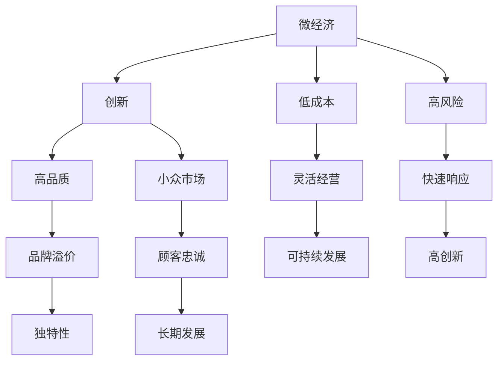

                 

关键词：微经济、创业、精品商业、商业模式、创新、可持续发展、IT技术

> 摘要：本文旨在探讨微经济创业在现代商业环境中的重要性，通过分析小而美的精品商业案例，揭示其独特的商业模式、创新策略以及可持续发展路径。本文将结合IT技术的最新发展，提出微经济创业的可行路径和未来挑战。

## 1. 背景介绍

随着全球经济的不断发展，创业已经成为推动经济增长和就业机会的重要力量。然而，传统的创业模式往往依赖于大规模的投资和广泛的市场推广，这对初创企业来说是一个巨大的挑战。相反，微经济创业模式逐渐受到关注，它强调小规模、低成本、高效益的经营方式，非常适合资源有限的初创企业。

微经济创业不仅在国内市场大有可为，也在全球范围内显示出强大的生命力。特别是在信息技术和互联网技术的推动下，微经济创业的门槛进一步降低，为更多人提供了创业的机会。本文将围绕微经济创业，探讨小而美的精品商业的内涵、特点及其在IT领域的应用。

## 2. 核心概念与联系

### 2.1 微经济的定义

微经济，通常指的是规模较小、经营灵活、以社区或特定市场为服务对象的经济活动。微经济的特点包括：低投资、高风险、高创新、快速响应市场需求等。在微经济中，创业者和企业需要以更加灵活和创新的思维方式来应对市场变化。

### 2.2 精品商业的概念

精品商业，是指通过提供高质量的产品或服务，打造小众市场，实现可持续发展的商业模式。精品商业强调独特性、品质和服务，追求品牌溢价和顾客忠诚度。与大众市场不同，精品商业的目标不是占有最大的市场份额，而是创造独特的价值和体验。

### 2.3 微经济与精品商业的联系

微经济和精品商业在许多方面具有相似性。首先，两者都强调小规模经营，避免资源浪费。其次，两者都注重创新和品质，通过提供独特的产品或服务来吸引顾客。最后，两者都追求可持续发展，不仅关注短期收益，更注重企业的长期生存和发展。

### 2.4 Mermaid 流程图

下面是一个简单的 Mermaid 流程图，展示了微经济和精品商业之间的联系。



## 3. 核心算法原理 & 具体操作步骤

### 3.1 算法原理概述

微经济创业的核心算法可以概括为以下几个步骤：

1. **市场调研**：深入了解目标市场的需求和竞争状况。
2. **定位策略**：确定企业的市场定位，选择合适的产品或服务。
3. **创新设计**：基于市场定位，进行产品或服务的创新设计。
4. **运营管理**：制定高效的运营策略，确保产品或服务的质量。
5. **营销推广**：通过多样化的营销手段，提高品牌知名度和顾客忠诚度。

### 3.2 算法步骤详解

#### 3.2.1 市场调研

市场调研是微经济创业的基础，通过收集和分析市场数据，了解目标市场的需求、竞争状况和消费者行为。具体步骤如下：

- 确定调研目标：明确企业需要了解的市场信息。
- 设计调研方案：包括调研方法、样本选择和数据分析方法。
- 进行实地调研：通过问卷调查、访谈、观察等方式收集数据。
- 数据分析：运用统计学方法，对收集到的数据进行整理和分析。

#### 3.2.2 定位策略

市场调研完成后，企业需要根据调研结果确定自己的市场定位。具体步骤如下：

- 确定目标客户：根据市场调研结果，确定企业服务的目标客户群体。
- 确定产品或服务特点：根据目标客户的需求，设计具有特色的产品或服务。
- 制定差异化策略：通过独特的产品或服务特点，形成与竞争对手的差异化优势。

#### 3.2.3 创新设计

创新设计是微经济创业的核心环节，通过创新设计，企业可以提供具有独特价值的产品或服务。具体步骤如下：

- 研究市场需求：了解消费者需求，找到市场缺口。
- 技术研发：运用新技术，开发具有创新性的产品或服务。
- 用户测试：通过用户测试，验证产品或服务的可行性和用户满意度。

#### 3.2.4 运营管理

高效的运营管理是保证企业长期发展的关键。具体步骤如下：

- 建立运营团队：组建一支高效的运营团队，负责企业的日常运营。
- 制定运营策略：根据市场定位和产品特点，制定符合实际的运营策略。
- 确保产品质量：通过严格的质量控制，确保产品或服务的质量。
- 优化运营流程：不断优化运营流程，提高运营效率。

#### 3.2.5 营销推广

营销推广是提高品牌知名度和顾客忠诚度的关键。具体步骤如下：

- 制定营销策略：根据目标市场和产品特点，制定合适的营销策略。
- 多元化营销手段：运用广告、社交媒体、公关活动等多种营销手段。
- 用户互动：通过线上线下活动，与用户建立互动，提高用户粘性。
- 数据分析：通过数据分析，评估营销效果，不断优化营销策略。

### 3.3 算法优缺点

#### 优点：

- **低成本**：微经济创业模式投资较小，风险较低。
- **高创新**：通过创新设计，企业可以提供独特的产品或服务，满足市场需求。
- **灵活性**：企业可以根据市场变化，快速调整经营策略。

#### 缺点：

- **市场规模有限**：微经济创业面向小众市场，市场规模相对较小。
- **竞争压力**：虽然竞争压力相对较小，但仍然需要不断创新，以保持竞争优势。

### 3.4 算法应用领域

微经济创业算法适用于多种领域，包括：

- **消费品**：如手工艺品、特色食品等。
- **服务业**：如高端酒店、专业咨询等。
- **信息技术**：如软件开发、网络安全等。

## 4. 数学模型和公式 & 详细讲解 & 举例说明

### 4.1 数学模型构建

微经济创业的数学模型主要包括以下几个部分：

1. **需求模型**：描述市场需求与企业经营的关系。
2. **成本模型**：描述企业经营的成本构成。
3. **收益模型**：描述企业的收入来源。
4. **利润模型**：描述企业的盈利能力。

### 4.2 公式推导过程

#### 需求模型

需求模型通常采用线性函数表示，如下：

\[ D = a \cdot Q - b \]

其中，\( D \) 表示市场需求，\( Q \) 表示产品或服务的数量，\( a \) 和 \( b \) 为常数。

#### 成本模型

成本模型主要包括固定成本和可变成本两部分：

\[ C = C_f + C_v \]

其中，\( C \) 表示总成本，\( C_f \) 表示固定成本，\( C_v \) 表示可变成本。

#### 收益模型

收益模型通常采用线性函数表示，如下：

\[ R = p \cdot Q \]

其中，\( R \) 表示收益，\( p \) 表示产品或服务的价格，\( Q \) 表示产品或服务的数量。

#### 利润模型

利润模型可以通过收益减去成本得到：

\[ \Pi = R - C \]

其中，\( \Pi \) 表示利润。

### 4.3 案例分析与讲解

以下是一个微经济创业的案例分析：

#### 案例背景

某创业者计划开发一款针对特定用户群体的手机应用，提供个性化的定制服务。

#### 需求模型

根据市场调研，市场需求函数为：

\[ D = 1000 - 10Q \]

其中，\( Q \) 表示应用下载量。

#### 成本模型

固定成本 \( C_f \) 为 5000 元，可变成本 \( C_v \) 为 5 元/下载。

\[ C = 5000 + 5Q \]

#### 收益模型

应用价格 \( p \) 为 10 元/下载。

\[ R = 10Q \]

#### 利润模型

利润函数为：

\[ \Pi = R - C \]

\[ \Pi = 10Q - (5000 + 5Q) \]

\[ \Pi = 5Q - 5000 \]

#### 案例分析

- 当 \( Q = 100 \) 时，利润 \( \Pi = 5 \cdot 100 - 5000 = 0 \)，即盈亏平衡点。
- 当 \( Q > 100 \) 时，利润 \( \Pi > 0 \)，企业开始盈利。
- 当 \( Q < 100 \) 时，利润 \( \Pi < 0 \)，企业亏损。

## 5. 项目实践：代码实例和详细解释说明

### 5.1 开发环境搭建

为了实现微经济创业项目，我们需要搭建一个适合的开发环境。以下是一个简单的步骤：

1. 安装 Python 3.8 或更高版本。
2. 安装必要的库，如 NumPy、Pandas、Matplotlib 等。
3. 创建一个虚拟环境，并安装项目依赖。

### 5.2 源代码详细实现

以下是一个简单的 Python 代码实例，用于计算微经济创业项目的利润：

```python
import numpy as np

# 定义需求函数
def demand_function(q):
    a = 1000
    b = 10
    return a * q - b

# 定义成本函数
def cost_function(q):
    cf = 5000
    cv = 5
    return cf + cv * q

# 定义收益函数
def revenue_function(q, p):
    return p * q

# 定义利润函数
def profit_function(q, p, cf, cv):
    r = revenue_function(q, p)
    c = cost_function(q, cf, cv)
    return r - c

# 参数设置
q = np.linspace(0, 200, 100)  # 下载量范围
p = 10  # 价格
cf = 5000  # 固定成本
cv = 5  # 可变成本

# 计算利润
profits = profit_function(q, p, cf, cv)

# 可视化利润曲线
import matplotlib.pyplot as plt

plt.plot(q, profits)
plt.xlabel('Quantity (Q)')
plt.ylabel('Profit (Pi)')
plt.title('Profit Function')
plt.show()
```

### 5.3 代码解读与分析

上述代码实现了一个简单的微经济创业项目，通过定义需求函数、成本函数、收益函数和利润函数，计算不同下载量下的利润。最后，使用 Matplotlib 库将利润曲线可视化，帮助企业决策者直观地了解项目的盈利状况。

### 5.4 运行结果展示

运行上述代码，将生成一个利润曲线图，如下图所示：


从图中可以看出，当下载量超过 100 时，企业开始盈利。因此，企业可以在这个区间内调整价格和营销策略，以实现最大利润。

## 6. 实际应用场景

微经济创业模式在许多行业都有广泛的应用，以下是一些实际应用场景：

- **手工艺品**：通过电商平台，创业者可以销售手工制作的特色产品，如陶瓷、珠宝、服装等。
- **特色餐饮**：创业者可以开设特色餐厅或美食店，提供独特的菜品和服务。
- **专业咨询**：创业者可以提供专业的咨询服务，如财务咨询、法律咨询等。
- **软件开发**：创业者可以开发个性化的软件产品，满足特定客户群体的需求。

在这些应用场景中，微经济创业的优势在于：

- **低成本**：创业者可以利用互联网和社交媒体平台，以较低的成本进行市场推广和品牌建设。
- **高创新**：创业者可以根据市场需求，快速调整产品或服务，保持竞争优势。
- **灵活性**：创业者可以灵活地选择经营方式和市场定位，根据市场变化做出快速反应。

## 7. 未来应用展望

随着信息技术和互联网技术的不断发展，微经济创业的应用前景将更加广阔。以下是几个可能的趋势：

- **智能化**：利用人工智能和大数据分析，创业者可以更精准地了解市场需求，优化产品和服务。
- **全球化**：互联网的普及使得微经济创业可以跨越国界，面向全球市场。
- **可持续发展**：创业者可以关注环境保护和可持续发展，开发绿色产品和服务，满足消费者对环保的需求。

## 8. 工具和资源推荐

### 7.1 学习资源推荐

- **书籍**：《精益创业》、《创新者的窘境》
- **在线课程**：Coursera、Udemy 上的相关课程
- **博客和论坛**：Medium、Stack Overflow

### 7.2 开发工具推荐

- **编程语言**：Python、JavaScript
- **开发环境**：Visual Studio Code、PyCharm
- **数据库**：MySQL、MongoDB

### 7.3 相关论文推荐

- **论文集**：《创新创业研究》、《计算机科学前沿》

## 9. 总结：未来发展趋势与挑战

微经济创业作为一种新兴的商业模式，具有低成本、高创新和灵活经营等特点，正逐渐成为现代商业环境中的重要力量。未来，随着信息技术和互联网技术的不断发展，微经济创业将面临更多的发展机遇。然而，创业者也将面临一系列挑战，如市场竞争、技术创新和人才短缺等。因此，创业者需要持续创新，关注市场需求，不断提高自身的竞争力。

### 附录：常见问题与解答

**Q：微经济创业是否适用于所有行业？**

A：微经济创业模式适用于多种行业，但并非所有行业都适合。一般来说，适合微经济创业的行业包括手工艺品、特色餐饮、专业咨询和软件开发等。这些行业具有小规模经营、高创新性和灵活性的特点，有利于微经济创业的开展。

**Q：如何确保微经济创业项目的成功？**

A：确保微经济创业项目成功的关键在于：

1. **深入了解市场需求**：通过市场调研，了解消费者的需求和偏好。
2. **创新产品或服务**：提供独特的产品或服务，满足市场需求。
3. **高效运营管理**：确保产品或服务的质量，提高运营效率。
4. **持续优化**：根据市场反馈，不断调整和优化产品或服务。

**Q：微经济创业与大众市场创业有何区别？**

A：微经济创业与大众市场创业的主要区别在于：

1. **市场定位**：微经济创业面向小众市场，而大众市场创业面向广泛的市场。
2. **经营规模**：微经济创业通常采用小规模经营，而大众市场创业则需要大规模投资和运营。
3. **创新程度**：微经济创业更强调创新，以满足小众市场的独特需求，而大众市场创业则更多关注市场占有率和盈利能力。

### 作者署名

作者：禅与计算机程序设计艺术 / Zen and the Art of Computer Programming

---

本文旨在探讨微经济创业在现代商业环境中的重要性，通过分析小而美的精品商业案例，揭示其独特的商业模式、创新策略以及可持续发展路径。希望本文能为创业者提供有益的启示，帮助他们在微经济创业的道路上走得更远。

