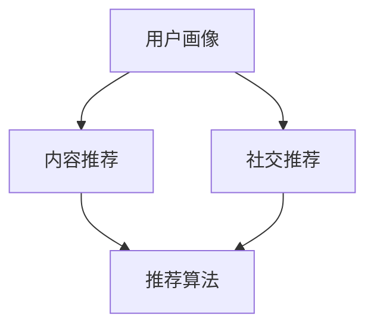

                 

关键词：快手游戏、校招、游戏推荐算法、面试题、算法解析、技术博客

> 摘要：本文旨在深入解析快手游戏2024校招中涉及的游戏推荐算法面试题，通过对其核心概念、算法原理、数学模型、项目实践等方面的详细阐述，帮助读者更好地理解和掌握相关技术，为在校招中取得优异成绩打下坚实基础。

## 1. 背景介绍

随着互联网技术的快速发展，游戏推荐算法在游戏行业中扮演着越来越重要的角色。快手游戏作为国内领先的短视频社交平台，其游戏推荐算法的质量直接影响到用户的留存率和活跃度。因此，在2024年校招中，快手游戏公司特别关注候选人对游戏推荐算法的理解和应用能力。本文将针对快手游戏校招中可能出现的游戏推荐算法面试题进行详细解析。

## 2. 核心概念与联系

在讨论游戏推荐算法之前，我们需要了解一些核心概念，这些概念构成了推荐系统的基石。

### 2.1. 用户画像

用户画像是指根据用户在平台上的行为数据、兴趣爱好、社交关系等构建的数字模型。它为推荐算法提供了关键的用户信息，帮助系统理解每个用户的特点和偏好。

### 2.2. 内容推荐

内容推荐是指根据用户的兴趣和行为模式，为用户推荐感兴趣的内容。在游戏中，这通常包括推荐用户可能喜欢的游戏、游戏中的角色、装备等。

### 2.3. 社交推荐

社交推荐是指根据用户的社交关系网，为用户推荐与其关系密切的其他用户正在玩的游戏、分享的内容等。

### 2.4. 推荐算法

推荐算法是实现个性化推荐的核心，常见的算法有基于内容的推荐、协同过滤推荐、基于模型的推荐等。

以下是游戏推荐算法的Mermaid流程图，展示了各个核心概念之间的联系：



## 3. 核心算法原理 & 具体操作步骤

### 3.1 算法原理概述

游戏推荐算法的原理通常基于用户行为数据，通过分析用户的历史行为、社交网络和其他相关特征，预测用户对某一游戏的潜在兴趣，从而进行个性化推荐。

### 3.2 算法步骤详解

#### 步骤1：数据收集

收集用户在平台上的行为数据，如游戏开始时间、游戏时长、游戏内购买行为、好友互动等。

#### 步骤2：特征工程

对收集到的数据进行处理，提取用户画像和游戏特征，如用户年龄、性别、游戏类型偏好、购买能力等。

#### 步骤3：模型训练

使用机器学习算法，如协同过滤、矩阵分解、深度学习等，训练推荐模型。模型训练的目标是学习用户和游戏之间的潜在关系。

#### 步骤4：模型评估

通过交叉验证等方法评估模型的性能，包括准确率、召回率、F1值等指标。

#### 步骤5：推荐生成

将训练好的模型应用于新用户或新游戏，生成个性化的游戏推荐列表。

### 3.3 算法优缺点

#### 优点

- 提高用户留存率和活跃度。
- 增加用户对游戏的满意度。
- 减少游戏推广成本。

#### 缺点

- 需要大量用户行为数据进行训练。
- 模型训练时间较长。
- 可能存在冷启动问题，即新用户或新游戏难以获得足够的推荐。

### 3.4 算法应用领域

游戏推荐算法广泛应用于各类游戏平台，如手游、端游、网页游戏等。此外，还可以应用于电子竞技、虚拟现实等领域。

## 4. 数学模型和公式 & 详细讲解 & 举例说明

### 4.1 数学模型构建

游戏推荐算法中的数学模型通常基于用户和游戏的相似度计算。假设有用户集U和游戏集G，用户u对游戏g的评分可以表示为：

$$
r_{ug} = \text{similarity}(u, g) \cdot \text{rating}(u, g)
$$

其中，$\text{similarity}(u, g)$表示用户u和游戏g的相似度，$\text{rating}(u, g)$表示用户u对游戏g的评分。

### 4.2 公式推导过程

相似度计算通常基于用户和游戏的共同特征。一种常见的相似度计算方法是余弦相似度：

$$
\text{similarity}(u, g) = \frac{\sum_{i \in C} w_i \cdot r_{ui} \cdot r_{gi}}{\sqrt{\sum_{i \in C} w_i^2 \cdot r_{ui}^2} \cdot \sqrt{\sum_{i \in C} w_i^2 \cdot r_{gi}^2}}
$$

其中，$C$表示用户u和游戏g的共同特征集合，$w_i$表示特征i的权重，$r_{ui}$和$r_{gi}$分别表示用户u对特征i的评分和游戏g对特征i的评分。

### 4.3 案例分析与讲解

假设用户u1对游戏g1的评分为4星，对游戏g2的评分为5星，对游戏g3的评分为3星。游戏g1、g2和g3的共同特征集合为{角色、关卡、游戏类型}，权重分别为0.6、0.3和0.1。用户u2对游戏g1的评分为5星，对游戏g2的评分为4星，对游戏g3的评分为5星。计算用户u1和u2的相似度。

首先，计算共同特征集合的权重：

$$
\text{similarity}(u1, u2) = \frac{0.6 \cdot 4 \cdot 5 + 0.3 \cdot 5 \cdot 4 + 0.1 \cdot 3 \cdot 5}{\sqrt{0.6^2 \cdot 4^2 + 0.3^2 \cdot 5^2 + 0.1^2 \cdot 3^2} \cdot \sqrt{0.6^2 \cdot 5^2 + 0.3^2 \cdot 4^2 + 0.1^2 \cdot 5^2}}
$$

$$
\text{similarity}(u1, u2) = \frac{12 + 6 + 1.5}{\sqrt{0.36 \cdot 16 + 0.09 \cdot 25 + 0.01 \cdot 9} \cdot \sqrt{0.36 \cdot 25 + 0.09 \cdot 16 + 0.01 \cdot 25}}
$$

$$
\text{similarity}(u1, u2) = \frac{19.5}{\sqrt{5.76 + 2.25 + 0.09} \cdot \sqrt{9 + 1.44 + 0.25}}
$$

$$
\text{similarity}(u1, u2) = \frac{19.5}{\sqrt{8} \cdot \sqrt{10.69}}
$$

$$
\text{similarity}(u1, u2) \approx 0.876
$$

根据相似度计算结果，用户u1和u2具有较高的相似度，因此可以为用户u2推荐用户u1喜欢的游戏g1。

## 5. 项目实践：代码实例和详细解释说明

### 5.1 开发环境搭建

本文使用的开发环境为Python 3.8，所需库包括NumPy、Pandas、Scikit-learn等。

### 5.2 源代码详细实现

以下是一个简单的基于余弦相似度的游戏推荐算法的Python代码示例：

```python
import numpy as np
import pandas as pd
from sklearn.metrics.pairwise import cosine_similarity

# 加载数据
data = pd.read_csv('game_data.csv')

# 计算用户-游戏矩阵
user_game_matrix = data.pivot(index='user_id', columns='game_id', values='rating').fillna(0)

# 计算用户-游戏矩阵的余弦相似度
cosine_sim = cosine_similarity(user_game_matrix, user_game_matrix)

# 查找指定用户喜欢的游戏
user_id = 1
user_ratings = user_game_matrix[user_id]

# 计算相似度最高的10个游戏
most_similar_games = np.argsort(cosine_sim[user_id])[-10:]

# 输出推荐结果
recommended_games = data['game_id'].iloc[most_similar_games]
print("Recommended Games:", recommended_games)
```

### 5.3 代码解读与分析

- 加载数据：使用Pandas读取游戏数据，数据包括用户ID、游戏ID和用户对游戏的评分。
- 计算用户-游戏矩阵：使用Pandas的`pivot`函数将数据转换为用户-游戏矩阵，其中缺失值用0填充。
- 计算余弦相似度：使用Scikit-learn的`cosine_similarity`函数计算用户-游戏矩阵的余弦相似度。
- 查找指定用户喜欢的游戏：选择指定用户（如user_id=1）的用户-游戏矩阵。
- 计算相似度最高的10个游戏：使用NumPy的`argsort`函数获取相似度最高的10个游戏索引。
- 输出推荐结果：输出相似度最高的10个游戏ID。

## 6. 实际应用场景

游戏推荐算法在实际应用中具有广泛的应用场景，以下列举几个典型案例：

- **手游平台**：通过游戏推荐算法，为用户推荐感兴趣的游戏，提高用户留存率和活跃度。
- **电竞平台**：为电竞爱好者推荐合适的比赛和队伍，提升用户体验。
- **虚拟现实（VR）**：为VR用户提供个性化的游戏推荐，增强沉浸感和互动性。

## 6.4 未来应用展望

随着人工智能技术的不断发展，游戏推荐算法在未来有望实现以下突破：

- **个性化推荐**：基于用户行为数据和个性化偏好，实现更加精准的游戏推荐。
- **实时推荐**：利用实时数据分析技术，为用户提供即时的游戏推荐。
- **跨平台推荐**：将不同平台的游戏数据进行整合，实现跨平台的个性化推荐。

## 7. 工具和资源推荐

### 7.1 学习资源推荐

- 《推荐系统实践》
- 《机器学习实战》
- 《Python游戏开发实战》

### 7.2 开发工具推荐

- Jupyter Notebook：便于编写和调试代码。
- TensorFlow：用于构建深度学习模型。
- PyTorch：用于构建深度学习模型。

### 7.3 相关论文推荐

- "Item-Based Top-N Recommendation Algorithms"
- "Collaborative Filtering for the Web"
- "Deep Learning for Personalized Recommendation"

## 8. 总结：未来发展趋势与挑战

游戏推荐算法在未来将继续发展，面临的主要挑战包括数据隐私保护、算法透明度和解释性等。通过不断优化算法和提升用户体验，游戏推荐算法将在游戏行业中发挥更加重要的作用。

## 9. 附录：常见问题与解答

### Q：游戏推荐算法需要哪些数据？

A：游戏推荐算法通常需要用户行为数据（如游戏时长、购买行为等）、用户画像数据（如年龄、性别等）和游戏特征数据（如游戏类型、难度等）。

### Q：如何评估游戏推荐算法的性能？

A：可以使用准确率、召回率、F1值等指标评估推荐算法的性能。此外，还可以使用交叉验证等方法进行模型评估。

### Q：游戏推荐算法有哪些优缺点？

A：优点包括提高用户留存率和活跃度、增加用户满意度、降低推广成本等。缺点包括需要大量用户行为数据进行训练、模型训练时间较长、可能存在冷启动问题等。

作者：禅与计算机程序设计艺术 / Zen and the Art of Computer Programming
----------------------------------------------------------------

