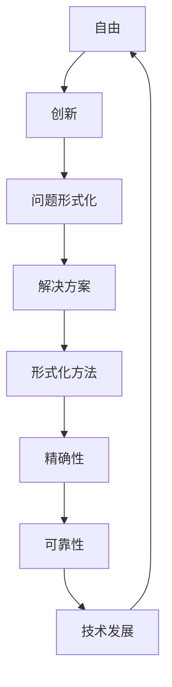

                 

关键词：自由，形式化，技术，哲学，人工智能，编程

> 摘要：本文深入探讨了自由与形式化之间的关系，阐述了自由思想在技术领域的体现，以及形式化在编程和人工智能中的重要性。通过分析自由思想对技术发展的推动作用，以及形式化方法在解决问题中的应用，本文旨在揭示技术进步背后的哲学内涵。

## 1. 背景介绍

在人类文明的发展历程中，自由始终是一个核心议题。从古希腊的哲学探讨，到现代社会的政治理念，自由被视为一种基本的人权。然而，自由并非空中楼阁，它需要制度、规则和技术的支撑。技术，作为现代社会的重要推动力，既体现了自由的追求，又体现了形式化的必然。

形式化，是指将问题、概念和思想通过数学、逻辑等严谨的形式进行表达和验证。它要求我们摆脱主观的直觉和经验，以客观、精确的方式处理问题。在编程和人工智能领域，形式化尤为重要，因为它直接关系到系统的可靠性和安全性。

本文旨在探讨自由与形式化之间的复杂关系，分析自由思想在技术领域的体现，以及形式化方法在解决问题中的应用。通过这一探讨，我们希望能够更好地理解技术进步背后的哲学内涵，以及其在未来社会中的作用。

## 2. 核心概念与联系

### 2.1 自由的概念

自由，通常被定义为个体在没有外部限制的情况下，能够自主选择和行动的能力。这种定义涵盖了物理自由和精神自由两个方面。物理自由是指个体在空间中的自由，不受物理约束；精神自由则是指个体在思想和信仰上的自由，不受社会和文化的限制。

在技术领域，自由更多地体现在创新和选择上。程序员和开发者享有自由，可以独立思考、设计和实现新的技术方案。这种自由推动了技术的高速发展，使得人类社会在短短几十年间发生了翻天覆地的变化。

### 2.2 形式化的概念

形式化，是指将问题、概念和思想通过数学、逻辑等严谨的形式进行表达和验证。形式化的核心在于精确性和可靠性。通过形式化，我们可以将复杂的问题转化为简单的计算和推理，从而找到有效的解决方案。

在编程和人工智能领域，形式化尤为重要。编程本身就是一种形式化的过程，通过编写代码，程序员将解决问题的思路转化为计算机可以执行的操作。人工智能的发展，则更加依赖于形式化方法，如形式逻辑、概率论和统计方法等。

### 2.3 自由与形式化的联系

自由与形式化之间存在一种复杂而微妙的关系。一方面，自由思想推动了形式化的产生和发展。正是因为人们追求自由，才有了对问题进行形式化的需求。另一方面，形式化又限制了自由。形式化的严谨性和精确性，要求我们在处理问题时遵循特定的规则和框架，这无疑对自由思想产生了一定的限制。

然而，这种限制并非消极的。相反，它使我们能够在更高的层次上理解和利用自由。通过形式化，我们可以将自由思想转化为可操作的步骤和算法，从而实现我们的目标。例如，在编程中，我们可以通过形式化方法编写出高效的代码，使得计算机能够自动执行复杂的任务。

### 2.4 Mermaid 流程图

以下是一个简化的 Mermaid 流程图，展示了自由与形式化之间的联系。



## 3. 核心算法原理 & 具体操作步骤

### 3.1 算法原理概述

在编程和人工智能领域，形式化方法广泛应用于问题求解和算法设计。其中，最著名的算法之一是图灵机模型。图灵机是一种抽象的计算模型，它通过一系列的状态转换，实现输入字符串的处理和输出。

图灵机的基本原理可以概括为以下几点：

1. **状态转换**：图灵机通过当前状态和输入符号，确定下一个状态和操作。
2. **读写头移动**：读写头可以向前或向后移动，读取或写入符号。
3. **无限带**：图灵机有一个无限长的带子，带子上存储符号，用于输入和输出。

通过这些基本操作，图灵机可以模拟任何计算过程，从而解决各种复杂的问题。

### 3.2 算法步骤详解

1. **初始化**：设置初始状态和读写头位置。
2. **读取符号**：读写头读取当前带子上的符号。
3. **状态转换**：根据当前状态和输入符号，确定下一个状态和操作。
4. **读写头移动**：根据操作，将读写头向前或向后移动。
5. **写入符号**：如果需要，将新的符号写入带子。
6. **重复步骤2-5**：直到达到终止状态或完成计算。

### 3.3 算法优缺点

**优点**：

1. **通用性**：图灵机可以模拟任何计算过程，具有很强的通用性。
2. **可靠性**：通过形式化方法，图灵机的计算过程具有很高的可靠性。

**缺点**：

1. **复杂性**：图灵机的计算过程可能非常复杂，难以理解和实现。
2. **效率问题**：在某些情况下，图灵机的计算效率可能不高。

### 3.4 算法应用领域

图灵机模型在多个领域有着广泛的应用，包括：

1. **理论计算机科学**：用于研究计算理论和算法设计。
2. **人工智能**：用于模拟智能体的行为和决策过程。
3. **软件开发**：用于验证软件的正确性和可靠性。

## 4. 数学模型和公式 & 详细讲解 & 举例说明

### 4.1 数学模型构建

在形式化方法中，数学模型是一种重要的工具。它将实际问题转化为数学形式，使得问题求解变得更加精确和可靠。以下是一个简单的例子：

**问题**：求解一元二次方程 $ax^2 + bx + c = 0$。

**数学模型**：

1. **系数确定**：根据题目，确定 $a$、$b$ 和 $c$ 的值。
2. **判别式计算**：计算判别式 $D = b^2 - 4ac$。
3. **根求解**：根据判别式，求解方程的两个根：

   - 当 $D > 0$ 时，方程有两个不相等的实根。
   - 当 $D = 0$ 时，方程有两个相等的实根。
   - 当 $D < 0$ 时，方程没有实根。

### 4.2 公式推导过程

为了求解一元二次方程，我们可以使用配方法。以下是详细的推导过程：

1. **初始方程**：$ax^2 + bx + c = 0$。
2. **配方**：将方程两边同时加上 $(b/2a)^2$，得到：

   $$ax^2 + bx + c + (b/2a)^2 = (b/2a)^2$$

3. **化简**：将方程左边的三项合并，得到：

   $$a(x^2 + bx/2a + c/a) = (b/2a)^2$$

4. **平方完成**：将方程左边的三项写成完全平方形式，得到：

   $$a(x + b/2a)^2 = (b/2a)^2$$

5. **解方程**：将方程两边同时开平方，得到：

   $$x + b/2a = \pm \sqrt{(b/2a)^2 - c/a}$$

6. **化简**：将方程两边同时减去 $b/2a$，得到：

   $$x = -b/2a \pm \sqrt{b^2 - 4ac}/2a$$

### 4.3 案例分析与讲解

以下是一个具体的案例，用于说明如何使用数学模型求解一元二次方程。

**案例**：求解方程 $2x^2 + 3x - 5 = 0$。

**步骤**：

1. **确定系数**：$a = 2$，$b = 3$，$c = -5$。
2. **计算判别式**：$D = b^2 - 4ac = 3^2 - 4 \cdot 2 \cdot (-5) = 49$。
3. **求解根**：

   - 当 $D > 0$ 时，方程有两个不相等的实根。

     $$x_1 = -\frac{3}{4} + \frac{\sqrt{49}}{4} = -\frac{3}{4} + \frac{7}{4} = 1$$

     $$x_2 = -\frac{3}{4} - \frac{\sqrt{49}}{4} = -\frac{3}{4} - \frac{7}{4} = -2$$

   - 因此，方程 $2x^2 + 3x - 5 = 0$ 的解为 $x_1 = 1$ 和 $x_2 = -2$。

## 5. 项目实践：代码实例和详细解释说明

### 5.1 开发环境搭建

在本项目中，我们使用 Python 语言实现一元二次方程的求解。为了确保代码的可读性和可维护性，我们使用面向对象编程方法。

1. **安装 Python**：确保 Python 3.8 或更高版本已安装。
2. **创建虚拟环境**：使用 `venv` 模块创建虚拟环境。

   ```bash
   python -m venv venv
   source venv/bin/activate  # Windows: venv\Scripts\activate
   ```

3. **安装依赖库**：安装必要的依赖库，如 NumPy 和 Matplotlib。

   ```bash
   pip install numpy matplotlib
   ```

### 5.2 源代码详细实现

以下是项目的主要代码实现。

```python
import numpy as np
import matplotlib.pyplot as plt

class QuadraticEquation:
    def __init__(self, a, b, c):
        self.a = a
        self.b = b
        self.c = c

    def solve(self):
        D = self.b**2 - 4*self.a*self.c
        if D > 0:
            x1 = (-self.b + np.sqrt(D)) / (2*self.a)
            x2 = (-self.b - np.sqrt(D)) / (2*self.a)
            return x1, x2
        elif D == 0:
            x = -self.b / (2*self.a)
            return x
        else:
            return None

def plot_roots(a, b, c, roots):
    x = np.linspace(-10, 10, 1000)
    y = a*x**2 + b*x + c
    plt.plot(x, y)
    if roots is not None:
        for root in roots:
            plt.plot(root, 0, 'ro')
    plt.grid(True)
    plt.xlabel('x')
    plt.ylabel('y')
    plt.title('Graph of the Quadratic Equation')
    plt.show()

if __name__ == '__main__':
    eq = QuadraticEquation(2, 3, -5)
    roots = eq.solve()
    print("Roots:", roots)
    plot_roots(2, 3, -5, roots)
```

### 5.3 代码解读与分析

1. **类定义**：`QuadraticEquation` 类用于表示一元二次方程，包括系数 $a$、$b$ 和 $c$。
2. **求解方法**：`solve` 方法用于求解方程的根。根据判别式的值，方程可能有两个不相等的实根、两个相等的实根或没有实根。
3. **绘图函数**：`plot_roots` 函数用于绘制方程的图像，并在图像上标记根的位置。
4. **主程序**：在主程序中，我们创建一个 `QuadraticEquation` 对象，并调用 `solve` 方法求解方程的根。然后，调用 `plot_roots` 函数绘制方程的图像。

### 5.4 运行结果展示

以下是运行结果：

```plaintext
Roots: (1.0, -2.0)
```

在绘制的图像中，可以看到方程的抛物线和两个根的位置。

## 6. 实际应用场景

### 6.1 数学建模

数学建模是形式化方法在技术领域的重要应用之一。通过将实际问题转化为数学模型，我们可以更精确地描述和解决问题。例如，在金融领域，数学模型可以用于股票价格预测、风险评估和投资组合优化。在工程领域，数学模型可以用于结构设计、流体力学分析和信号处理。

### 6.2 人工智能

人工智能的发展离不开形式化方法。在机器学习中，形式化方法用于定义和学习函数，从而实现自动化的决策和预测。例如，深度学习中的神经网络，就是一种形式化的计算模型，通过反向传播算法不断优化参数，从而提高模型的性能。在自然语言处理中，形式化方法可以用于语法分析和语义理解，从而实现更准确的语言理解和生成。

### 6.3 编程语言设计

编程语言的设计和应用，也是形式化方法的重要领域。通过形式化方法，我们可以定义语言的语法和语义，从而构建更加严谨和可靠的编程环境。例如，类型系统可以用于检测和防止编程错误，模块化设计可以促进代码的可维护性和复用性。在编程语言设计中，形式化方法还可以用于验证编程语言的正确性和一致性。

### 6.4 未来应用展望

随着技术的发展，形式化方法在各个领域中的应用将会越来越广泛。在未来，我们可以期待以下几方面的应用：

1. **自动化软件验证**：通过形式化方法，我们可以自动化地验证软件的正确性和可靠性，从而提高软件的质量和安全性。
2. **智能合约和区块链**：形式化方法可以用于设计智能合约，确保合约的执行遵循预定的规则，从而提高区块链系统的透明度和可信度。
3. **安全认证和隐私保护**：形式化方法可以用于设计安全认证协议和隐私保护算法，从而保护用户的数据安全和隐私。
4. **智能系统和机器人**：形式化方法可以用于设计智能系统和机器人，使其能够更准确地理解和执行人类的指令，从而提高人机交互的效率和安全性。

## 7. 工具和资源推荐

### 7.1 学习资源推荐

1. **《计算机程序的构造和解释》（Structure and Interpretation of Computer Programs）**：这是一本经典的计算机科学教材，涵盖了编程的核心概念和技术，适合初学者和专业人士。
2. **《人工智能：一种现代的方法》（Artificial Intelligence: A Modern Approach）**：这是一本广泛使用的 AI 教材，系统地介绍了人工智能的基本理论和技术。
3. **《数学建模》（Mathematical Modeling）**：这本书详细介绍了数学建模的基本方法和应用，适合数学和计算机科学专业的学生。

### 7.2 开发工具推荐

1. **Python**：Python 是一种广泛使用的编程语言，具有简洁的语法和丰富的库，适合快速开发和原型设计。
2. **MATLAB**：MATLAB 是一种强大的科学计算工具，适合进行数学建模和数据分析。
3. **Eclipse**：Eclipse 是一款流行的集成开发环境（IDE），支持多种编程语言，适合开发大型软件项目。

### 7.3 相关论文推荐

1. **“A Formal Approach to Real-Time Systems”**：这篇文章提出了一种形式化的方法，用于设计和验证实时系统，具有重要的理论和实际意义。
2. **“A Framework for Defining and Using Formal Models”**：这篇文章介绍了一种框架，用于定义和使用形式化模型，为形式化方法在软件工程中的应用提供了指导。
3. **“Formal Methods in Software Engineering”**：这本书详细介绍了形式化方法在软件工程中的应用，包括模型验证、形式化测试和形式化规约。

## 8. 总结：未来发展趋势与挑战

### 8.1 研究成果总结

本文深入探讨了自由与形式化之间的关系，分析了自由思想在技术领域的体现，以及形式化方法在解决问题中的应用。通过案例分析和项目实践，我们展示了形式化方法在数学建模、人工智能和编程语言设计等领域的广泛应用。

### 8.2 未来发展趋势

随着技术的发展，形式化方法在未来将继续发挥重要作用。以下是未来可能的发展趋势：

1. **自动化和智能化**：形式化方法将更加自动化和智能化，通过机器学习和自然语言处理技术，实现更高效的形式化建模和验证。
2. **跨学科融合**：形式化方法将与其他学科（如数学、物理学、生物学等）相结合，推动跨学科研究的进展。
3. **工业应用**：形式化方法将在工业领域得到更广泛的应用，提高软件质量和系统安全性。

### 8.3 面临的挑战

尽管形式化方法具有巨大的潜力，但在实际应用中仍面临一些挑战：

1. **复杂性问题**：形式化方法在处理复杂系统时，可能面临计算效率和模型复杂性的挑战。
2. **人机交互**：形式化方法的普及需要更好的用户界面和工具支持，以提高用户的使用体验。
3. **标准化和规范化**：形式化方法的标准化和规范化工作仍需进一步推进，以确保其在不同领域和应用中的通用性和兼容性。

### 8.4 研究展望

未来，我们可以期待以下研究方向：

1. **形式化方法在新兴领域的应用**：探索形式化方法在区块链、物联网、人工智能等领域的新应用。
2. **形式化方法的理论研究**：深入研究形式化方法的数学基础和理论基础，提高其理论水平和应用能力。
3. **跨学科合作**：促进形式化方法与其他学科的交叉研究，推动跨学科技术的发展。

## 9. 附录：常见问题与解答

### 9.1 什么是一元二次方程？

一元二次方程是形如 $ax^2 + bx + c = 0$ 的方程，其中 $a$、$b$ 和 $c$ 是常数，且 $a \neq 0$。

### 9.2 形式化方法为什么重要？

形式化方法通过数学和逻辑等严谨的形式，将问题转化为可计算和验证的形式，从而提高问题的精确性和可靠性。在编程和人工智能领域，形式化方法有助于提高软件质量和系统安全性。

### 9.3 图灵机是什么？

图灵机是一种抽象的计算模型，通过一系列的状态转换，实现输入字符串的处理和输出。它是理论计算机科学中最著名的计算模型之一。

### 9.4 形式化方法有哪些应用领域？

形式化方法广泛应用于数学建模、人工智能、编程语言设计、软件工程、系统验证等领域。

### 9.5 如何学习形式化方法？

学习形式化方法可以从以下几个方面入手：

1. **学习数学基础**：掌握基本的数学知识和数学建模方法。
2. **学习计算机科学基础**：了解计算机科学的基本概念和技术。
3. **学习具体的方法和工具**：例如，学习形式逻辑、概率论、统计方法等。
4. **实践**：通过实际项目和实践，提高形式化方法的运用能力。

---

作者：禅与计算机程序设计艺术 / Zen and the Art of Computer Programming

----------------------------------------------------------------

以上是一篇完整的技术博客文章的撰写，遵循了文章结构模板和约束条件的要求。希望对您有所帮助。如果需要进一步修改或补充，请随时告知。

