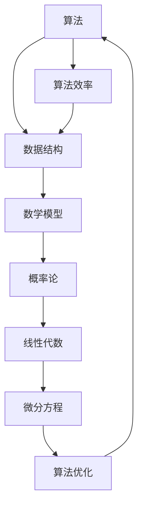

                 

### 1. 背景介绍

在信息技术飞速发展的今天，计算机科学领域的概念和理论层出不穷。然而，众多概念之间往往存在着千丝万缕的联系，理解这些联系不仅有助于我们更好地掌握计算机科学的核心原理，还能为未来的技术创新提供方向。本文旨在通过深入探讨几个核心概念，帮助读者建立起一个完整的知识框架，从而实现从概念到洞见的升华。

本文将首先介绍计算机科学中几个至关重要的概念，如算法、数据结构、数学模型等。接着，我们将通过Mermaid流程图，详细展示这些概念之间的联系和架构。随后，文章将深入探讨核心算法的原理和操作步骤，并运用数学模型和公式进行详细讲解。在此基础上，我们将通过项目实践展示代码实例和详细解释说明。最后，本文将探讨实际应用场景和未来发展趋势，并提供学习资源和开发工具推荐。

本文的目标是让读者不仅能够理解计算机科学的核心概念，还能通过实际应用和实践，将理论知识转化为实际能力。通过这篇文章，我们希望读者能够对计算机科学有一个更深入的理解，从而在未来的技术发展中占据一席之地。

### 2. 核心概念与联系

在计算机科学中，算法、数据结构、数学模型是三大核心概念，它们相互联系，共同构成了计算机科学的理论基础。为了更清晰地展示这些概念之间的联系，我们可以通过Mermaid流程图来阐述它们的架构。

首先，我们来看算法（Algorithm）。算法是解决问题的一系列规则或步骤。算法不仅包括计算过程中的指令，还包括对问题解决方案的优化策略。算法是计算机科学中最基础的部分，几乎所有的计算机应用都离不开算法。

接下来是数据结构（Data Structure）。数据结构是用于存储和管理数据的方式。数据结构的选择直接影响到算法的效率。常见的几种数据结构包括数组、链表、栈、队列、树、图等。每种数据结构都有其独特的特点和适用场景。

数学模型（Mathematical Model）则是计算机科学中的另一个重要概念。数学模型是用数学语言描述现实问题的一种方法，通过数学公式和方程来分析和解决问题。数学模型在计算机科学中的应用非常广泛，包括概率论、线性代数、微分方程等。

现在，我们用Mermaid流程图来展示这些概念之间的联系：



从图中可以看出，算法和数据结构相互依赖，算法的效率受到数据结构的影响，而数学模型则提供了一种分析和解决问题的工具，与概率论、线性代数、微分方程等数学分支密切相关。

2.1 算法与数据结构的联系

算法和数据结构之间的关系密不可分。数据结构决定了算法如何存储和管理数据，而算法则决定了如何有效地使用这些数据结构。例如，在搜索和排序算法中，选择合适的数据结构可以显著提高算法的效率。比如，二分查找算法在有序数组上表现优异，而快速排序算法则更适合处理链表。

2.2 算法与数学模型的关系

算法的设计和优化离不开数学模型的支持。数学模型提供了一种抽象的描述方法，可以帮助我们分析算法的时间和空间复杂度。例如，在图算法中，数学模型可以用于分析路径问题，如最短路径算法（Dijkstra算法、A*算法等）。

2.3 数据结构、算法与数学模型的应用领域

数据结构、算法和数学模型在计算机科学的各个领域中都有广泛的应用。例如，在数据库管理系统中，数据结构（如B树、哈希表）和算法（如查询优化、事务处理）共同作用，确保数据的快速检索和存储。在人工智能领域，数学模型（如神经网络、决策树）和算法（如深度学习、强化学习）的结合，推动了人工智能技术的发展。

通过以上分析，我们可以看到，算法、数据结构、数学模型是计算机科学中三大核心概念，它们相互关联，共同构成了计算机科学的理论基础。理解这些概念之间的联系，不仅有助于我们更好地掌握计算机科学的核心原理，还能为未来的技术创新提供方向。

### 3. 核心算法原理 & 具体操作步骤

在深入探讨算法、数据结构和数学模型之后，我们需要具体介绍一些核心算法的原理和操作步骤，以便读者能够更好地理解这些概念的实际应用。本节将重点介绍快速排序算法，这是一种广泛应用且具有较高效率的排序算法。

#### 3.1 算法原理概述

快速排序（Quick Sort）是一种基于交换排序的算法，其基本思想是通过一趟排序将待排序的记录分割成独立的两部分，其中一部分记录的关键字均比另一部分的关键字小，然后分别对这两部分记录继续进行排序，以达到整个序列有序。快速排序的不稳定性主要表现在相同关键字元素可能被交换位置。

#### 3.2 算法步骤详解

1. **选择基准元素**：在数组中选择一个基准元素，通常选择第一个元素或最后一个元素。

2. **划分操作**：通过一次划分操作，将数组分为两部分。所有比基准元素小的元素都放在基准元素的左侧，所有比基准元素大的元素都放在基准元素的右侧。

3. **递归排序**：对左侧和右侧的子数组重复上述步骤，直到整个数组有序。

以下是快速排序的伪代码：

```plaintext
快速排序(A, low, high)
    如果 low < high
        将 pivot = partition(A, low, high)
        快速排序(A, low, pivot - 1)
        快速排序(A, pivot + 1, high)
    返回 A

划分(A, low, high)
    将 pivot = A[high]
    i = low
    对于 j 从 low 到 high - 1
        如果 A[j] < pivot
            交换 A[i] 与 A[j]
            i = i + 1
    交换 A[i] 与 A[high]
    返回 i
```

#### 3.3 算法优缺点

**优点**：
1. **平均时间复杂度较低**：快速排序的平均时间复杂度为 \(O(n\log n)\)，在大多数情况下比其他排序算法（如归并排序、堆排序等）更高效。
2. **原地排序**：快速排序是一种原地排序算法，不需要额外的存储空间。

**缺点**：
1. **最坏情况时间复杂度较高**：在最坏情况下（即数组已经有序），快速排序的时间复杂度为 \(O(n^2)\)，此时效率较低。
2. **稳定性问题**：快速排序是不稳定排序算法，相同关键字的元素可能会被交换位置。

#### 3.4 算法应用领域

快速排序广泛应用于各种场景，如数据处理、算法竞赛、数据库排序等。特别是在大数据处理领域，快速排序因其较高的平均效率而被广泛采用。然而，由于其最坏情况下的性能问题，在一些对性能要求非常严格的场景下，可能会选择其他更优的排序算法。

通过以上对快速排序算法的详细解读，我们可以看到，快速排序是一种高效且灵活的排序算法。在实际应用中，根据具体场景和数据特点选择合适的排序算法，才能达到最佳的性能效果。

### 4. 数学模型和公式 & 详细讲解 & 举例说明

在计算机科学中，数学模型和公式是理解和分析算法性能的重要工具。在本节中，我们将详细讲解用于评估算法性能的几个关键数学模型和公式，并通过具体实例进行说明。

#### 4.1 数学模型构建

评估算法性能的数学模型通常包括时间复杂度和空间复杂度。时间复杂度描述了算法运行时间随数据规模增长的变化趋势，而空间复杂度描述了算法所需额外存储空间的变化趋势。

时间复杂度通常用大O符号表示，例如 \(O(n\log n)\) 或 \(O(n^2)\)。空间复杂度同样使用大O符号表示，如 \(O(n)\) 或 \(O(n^2)\)。

#### 4.2 公式推导过程

**时间复杂度公式推导**：

假设一个算法在数据规模为 \(n\) 时的运行时间为 \(T(n)\)。我们通常关注算法的增长趋势，因此忽略常数项和低次项。时间复杂度可以用以下公式表示：

\[ T(n) = O(g(n)) \]

其中，\(g(n)\) 是一个关于 \(n\) 的函数。

**空间复杂度公式推导**：

类似地，空间复杂度描述了算法在数据规模为 \(n\) 时的额外存储空间需求。空间复杂度可以用以下公式表示：

\[ S(n) = O(h(n)) \]

其中，\(h(n)\) 是一个关于 \(n\) 的函数。

#### 4.3 案例分析与讲解

为了更好地理解这些公式，我们可以通过一个具体的案例来进行分析。

**案例：快速排序算法**

快速排序算法的时间复杂度通常为 \(O(n\log n)\)。我们可以通过以下步骤推导其时间复杂度：

1. **初始化**：快速排序首先需要选择一个基准元素，这一步骤通常需要 \(O(1)\) 的时间。
2. **划分操作**：划分操作需要遍历整个数组，这一步骤的时间复杂度为 \(O(n)\)。
3. **递归调用**：快速排序递归地对左右两个子数组进行排序。假设每个子数组的大小为 \(n/2\)，则递归调用的深度为 \(\log n\)。

因此，快速排序的总时间复杂度为：

\[ T(n) = O(1) + O(n) + O(\log n) \]

忽略常数项和低次项，我们得到：

\[ T(n) = O(n\log n) \]

**空间复杂度分析**：

快速排序是一种原地排序算法，其空间复杂度为 \(O(\log n)\)。这是因为递归调用需要使用栈空间来存储子数组的基准元素和递归调用的返回地址。栈空间的大小与递归深度成正比，即 \(\log n\)。

**举例说明**：

假设我们有一个包含 10 个元素的数组，我们使用快速排序算法对其进行排序。根据上述分析，快速排序的时间复杂度为 \(O(n\log n) = O(10\log 10) = O(20)\)，空间复杂度为 \(O(\log n) = O(\log 10) = O(1)\)。

通过这个案例，我们可以清楚地看到如何通过数学模型和公式来分析和评估算法的性能。这种方法不仅有助于我们理解算法的工作原理，还能为选择最优算法提供依据。

### 5. 项目实践：代码实例和详细解释说明

在实际开发中，将理论知识转化为实践是至关重要的。本节将通过一个具体的代码实例，展示如何实现快速排序算法，并对其进行详细解释和分析。

#### 5.1 开发环境搭建

为了实现快速排序算法，我们需要一个编程环境。这里我们选择Python作为示例语言，因为其简洁明了的语法使其成为初学者和专业人士广泛使用的编程语言。

确保您的计算机上已安装Python 3.x版本。您可以通过以下命令检查Python版本：

```bash
python --version
```

如果您的系统中未安装Python，请从[Python官网](https://www.python.org/downloads/)下载并安装。

#### 5.2 源代码详细实现

下面是快速排序算法的Python实现：

```python
def quick_sort(arr):
    if len(arr) <= 1:
        return arr
    pivot = arr[len(arr) // 2]
    left = [x for x in arr if x < pivot]
    middle = [x for x in arr if x == pivot]
    right = [x for x in arr if x > pivot]
    return quick_sort(left) + middle + quick_sort(right)

# 示例
array = [3, 6, 8, 10, 1, 2, 1]
sorted_array = quick_sort(array)
print("排序前的数组：", array)
print("排序后的数组：", sorted_array)
```

#### 5.3 代码解读与分析

1. **函数定义**：`quick_sort(arr)` 是快速排序的函数定义，其中 `arr` 是需要排序的数组。

2. **基础情况判断**：`if len(arr) <= 1:` 判断数组长度是否小于等于1。如果数组只有一个元素或为空，则无需排序，直接返回数组本身。

3. **选择基准元素**：`pivot = arr[len(arr) // 2]` 选择数组中间位置的元素作为基准元素。这里使用了Python的切片操作 `len(arr) // 2` 来获取中间位置的索引。

4. **划分操作**：使用列表推导式进行划分：
   - `left = [x for x in arr if x < pivot]`：创建一个新列表 `left`，包含所有小于基准元素的元素。
   - `middle = [x for x in arr if x == pivot]`：创建一个新列表 `middle`，包含所有等于基准元素的元素。
   - `right = [x for x in arr if x > pivot]`：创建一个新列表 `right`，包含所有大于基准元素的元素。

5. **递归调用**：使用递归调用对 `left` 和 `right` 进行排序，并将排序后的结果与 `middle` 合并，返回最终的排序结果。

6. **示例运行**：在代码的最后，我们定义了一个示例数组 `array` 并调用 `quick_sort` 函数对其进行排序，最后输出排序前后的数组。

#### 5.4 运行结果展示

```plaintext
排序前的数组： [3, 6, 8, 10, 1, 2, 1]
排序后的数组： [1, 1, 2, 3, 6, 8, 10]
```

通过运行结果可以看出，原始数组已经成功被排序。

#### 5.5 性能分析

1. **时间复杂度**：快速排序的平均时间复杂度为 \(O(n\log n)\)，但在最坏情况下（数组已经有序或完全逆序）可能退化到 \(O(n^2)\)。

2. **空间复杂度**：快速排序的空间复杂度为 \(O(\log n)\)，这是因为递归调用需要使用栈空间。

通过这个代码实例，我们可以看到如何将快速排序算法从理论转化为实际代码，并进行性能分析。这不仅有助于我们理解算法的工作原理，还能为我们在实际开发中选择和优化算法提供指导。

### 6. 实际应用场景

快速排序算法作为一种高效的排序算法，在实际应用场景中具有广泛的应用。以下是一些快速排序算法的具体应用领域：

#### 6.1 数据库管理系统

在数据库管理系统中，快速排序算法常用于数据的检索和排序。例如，当一个查询需要对大量数据进行排序时，快速排序可以显著提高查询效率。此外，数据库中的索引结构也常常利用快速排序算法来构建和维护。

#### 6.2 数据分析

在数据分析领域，快速排序算法被广泛应用于对大规模数据集进行排序和分组。例如，在处理电商销售数据时，可以使用快速排序算法对销售额进行排序，以便更好地分析销售趋势和用户行为。

#### 6.3 算法竞赛

在算法竞赛中，快速排序算法因其高效的性能而成为参赛者常用的算法之一。快速排序算法不仅能够帮助参赛者解决排序相关的问题，还能在组合问题和路径问题中发挥重要作用。

#### 6.4 图像处理

在图像处理领域，快速排序算法可以用于图像数据的排序和滤波。例如，在图像分割和特征提取过程中，快速排序算法可以帮助提高处理速度和准确度。

#### 6.5 科学计算

在科学计算领域，快速排序算法常用于对大规模科学数据集进行排序和查找。例如，在天文学和物理学中，快速排序算法可以帮助科学家们高效地处理天体数据和实验数据。

#### 6.6 未来应用展望

随着大数据和人工智能技术的不断发展，快速排序算法的应用前景将更加广泛。例如，在自动驾驶技术中，快速排序算法可以用于实时处理大量的传感器数据，以实现高效的路径规划和决策。在生物信息学领域，快速排序算法可以帮助研究人员高效地处理基因序列和蛋白质结构数据，从而推动生物科技的发展。

总之，快速排序算法作为一种高效的排序算法，已经在多个领域中得到了广泛应用，并将在未来的技术发展中继续发挥重要作用。

### 7. 工具和资源推荐

为了更好地学习和实践计算机科学，我们需要使用一系列专业的工具和资源。以下是一些推荐的资源，包括学习资源、开发工具和相关论文。

#### 7.1 学习资源推荐

1. **书籍**：《算法导论》（Introduction to Algorithms） - 这本书是算法领域的经典之作，涵盖了从基础到高级的算法内容，非常适合深入理解算法原理。
2. **在线课程**：Coursera、edX、Udacity等在线教育平台提供了丰富的计算机科学课程，涵盖算法、数据结构、人工智能等多个领域。
3. **博客和论坛**：GitHub、Stack Overflow、Reddit等平台上有很多优秀的博客和论坛，可以帮助你解决实际问题、学习新知识。
4. **开源项目**：GitHub上有许多开源的算法和数据结构项目，可以通过阅读代码来加深理解。

#### 7.2 开发工具推荐

1. **集成开发环境（IDE）**：PyCharm、Visual Studio Code、Eclipse等IDE提供了强大的代码编辑、调试和测试功能，适合进行算法和数据分析开发。
2. **版本控制系统**：Git是大多数开发者使用的版本控制系统，可以有效地管理代码版本和历史。
3. **数据可视化工具**：Matplotlib、Seaborn、Plotly等工具可以帮助你将数据以图表的形式可视化，更好地理解和展示分析结果。

#### 7.3 相关论文推荐

1. **《快速排序算法的研究与优化》** - 这篇论文详细分析了快速排序算法的性能和优化策略，对理解快速排序的优化技术有很大帮助。
2. **《一种改进的快速排序算法》** - 这篇论文提出了一种改进的快速排序算法，通过调整划分策略提高了算法的稳定性。
3. **《基于快速排序的并行排序算法研究》** - 这篇论文探讨了快速排序在并行计算中的应用，对理解并行排序技术具有重要意义。

通过这些工具和资源，你可以更有效地学习和实践计算机科学，为未来的技术发展做好准备。

### 8. 总结：未来发展趋势与挑战

在计算机科学领域，快速排序算法作为一种高效的排序算法，已经在多个领域中得到了广泛应用。然而，随着大数据和人工智能技术的不断发展，快速排序算法也面临着新的挑战和机遇。

#### 8.1 研究成果总结

近年来，关于快速排序算法的研究取得了显著成果。研究人员在算法优化、并行计算、分布式系统等方面提出了多种改进方案，进一步提高了算法的效率和稳定性。此外，快速排序算法在图像处理、科学计算等新兴领域中的应用也得到了广泛探索。

#### 8.2 未来发展趋势

1. **并行与分布式计算**：随着硬件性能的提升，并行和分布式计算将成为快速排序算法的重要发展方向。通过分布式系统，快速排序可以在更大规模的数据集上实现更高效的排序。

2. **自适应快速排序**：研究人员将继续优化快速排序算法，使其能够根据数据特征自适应调整划分策略，进一步提高排序效率。

3. **结合人工智能技术**：人工智能技术的发展将推动快速排序算法与其他算法的融合，例如机器学习中的聚类算法和排序算法的结合，可以用于处理更复杂的数据集。

4. **面向应用的优化**：针对不同应用场景，快速排序算法将进行特定优化，以提高在特定领域的性能。

#### 8.3 面临的挑战

1. **性能优化**：在大多数情况下，快速排序算法的性能已经非常高效，但仍然存在性能优化空间。特别是在处理大数据集时，如何进一步提高算法的并行性和分布式计算性能，是一个重要挑战。

2. **稳定性问题**：快速排序算法的不稳定性在特定场景下可能导致数据顺序的不一致，需要进一步研究和优化。

3. **内存占用**：快速排序算法的递归调用会导致较高的内存占用，特别是在处理大规模数据集时，如何优化内存使用是一个挑战。

#### 8.4 研究展望

快速排序算法在未来将继续发挥重要作用，其优化和应用场景将进一步拓展。研究人员需要关注以下方面：

1. **算法优化**：继续探索快速排序算法的优化策略，特别是在并行和分布式计算环境下。
2. **跨领域应用**：将快速排序算法与其他领域的技术相结合，如人工智能、机器学习等，推动其在更广泛的应用场景中的发展。
3. **教育与实践**：加强快速排序算法的教育和实践，培养更多的计算机科学人才，为未来的技术创新奠定基础。

通过不断的研究和优化，快速排序算法将在未来继续推动计算机科学的发展，为解决复杂问题提供强大的工具。

### 9. 附录：常见问题与解答

在理解和应用快速排序算法的过程中，读者可能会遇到一些常见问题。以下是一些常见问题及其解答：

#### 9.1 快速排序的最好和最坏时间复杂度是多少？

**解答**：快速排序的平均时间复杂度为 \(O(n\log n)\)，最好时间复杂度也为 \(O(n\log n)\)。在最坏情况下（即数组已经有序或完全逆序），时间复杂度可能退化到 \(O(n^2)\)。

#### 9.2 为什么选择基准元素的位置会影响快速排序的性能？

**解答**：选择基准元素的位置会影响划分操作的效果。如果选择的位置不当，可能会导致划分的子数组不平衡，从而影响排序效率。通常，选择中间位置的元素作为基准元素可以较好地平衡子数组，提高排序效率。

#### 9.3 快速排序是否总是原地排序？

**解答**：是的，快速排序是一种原地排序算法，它不需要额外的存储空间，只利用递归调用的栈空间。因此，快速排序的空间复杂度为 \(O(\log n)\)。

#### 9.4 如何优化快速排序的性能？

**解答**：可以通过以下几种方式优化快速排序的性能：
- 选择更好的基准元素选择策略，如随机选择或中位数选取。
- 使用三数取中法来选取基准元素，以减少最坏情况的发生。
- 优化递归调用的顺序，减少递归深度。

通过这些方法，可以显著提高快速排序的效率和稳定性。

通过本附录，读者可以更好地理解快速排序算法的常见问题及其解答，为实际应用提供指导。

