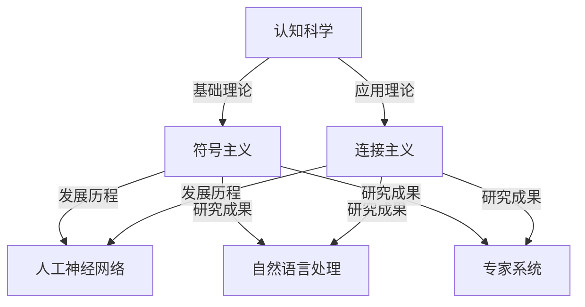
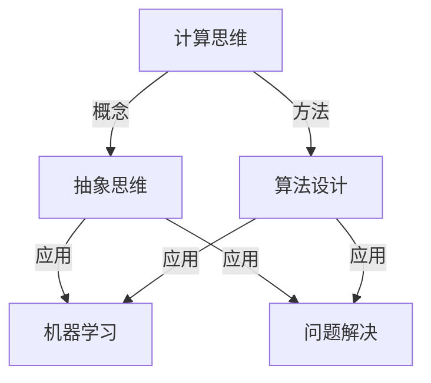

                 

关键词：人工智能，认知科学，思维进化，认知架构，机器学习，计算思维，技术发展

> 摘要：本文将探讨人工智能领域中的思想演变过程，从最初的概念提出，到现代技术的应用，再到未来发展的潜在趋势。通过对认知科学、机器学习、计算思维等核心概念的分析，本文旨在揭示人工智能从概念到洞见的演变路径，为读者提供一个深入理解这一领域的视角。

## 1. 背景介绍

人工智能（AI）作为一门交叉学科，自其诞生以来，经历了多个发展阶段。从最初的逻辑推理与符号处理，到现代深度学习和神经网络的应用，人工智能领域的技术和理念不断演变。这一演变不仅体现在技术的进步上，更体现在我们对智能本质和思维的深入理解上。

认知科学作为人工智能的重要理论基础，致力于研究人类思维和行为的基本原理。在认知科学的影响下，人工智能从简单的规则系统转向了更为复杂的计算模型。这一转变不仅提高了人工智能系统的性能，也使得我们能够更好地理解人类智能的本质。

## 2. 核心概念与联系

### 2.1 认知科学与人工智能

认知科学是研究人类思维、感知和行动的科学。它涵盖了心理学、神经科学、计算机科学、语言学等多个领域。在认知科学的影响下，人工智能从符号主义转向了连接主义，即从规则驱动的符号处理转向了基于神经网络的数据驱动处理。

下面是认知科学与人工智能之间的核心概念和联系流程图：



### 2.2 机器学习与计算思维

机器学习是人工智能的核心技术之一，它通过构建复杂的计算模型来模拟人类学习过程。计算思维是机器学习的重要基础，它强调在问题解决过程中，运用计算方法来模拟和优化思维过程。

下面是机器学习与计算思维之间的核心概念和联系流程图：



## 3. 核心算法原理 & 具体操作步骤

### 3.1 算法原理概述

在人工智能领域，核心算法的原理和操作步骤至关重要。以下将介绍一些重要的算法原理，并简要说明其具体操作步骤。

#### 3.1.1 深度学习

深度学习是一种基于多层神经网络的计算模型，它通过逐层提取特征，实现复杂模式的识别。具体操作步骤包括：

1. **数据预处理**：对原始数据进行清洗和标准化，以适应深度学习模型的要求。
2. **模型构建**：设计神经网络的结构，包括层数、神经元数量、激活函数等。
3. **训练过程**：通过反向传播算法，不断调整神经网络的权重，以最小化预测误差。
4. **模型评估**：使用验证集或测试集评估模型的性能，并进行调优。

#### 3.1.2 生成对抗网络（GAN）

生成对抗网络是一种通过两个对抗网络（生成器和判别器）相互博弈的训练方法。具体操作步骤包括：

1. **模型构建**：构建生成器和判别器，生成器和判别器共享一部分网络结构。
2. **训练过程**：生成器生成数据，判别器对真实数据和生成数据进行分类，生成器和判别器不断调整参数，以达到生成数据逼真、判别器无法区分真实数据和生成数据的平衡状态。

### 3.2 算法步骤详解

#### 3.2.1 深度学习步骤详解

1. **数据预处理**：
    - **数据清洗**：去除噪声和异常值。
    - **数据标准化**：将数据缩放到相同的范围，如[0, 1]或[-1, 1]。

2. **模型构建**：
    - **输入层**：接收输入数据。
    - **隐藏层**：通过激活函数对输入数据进行变换，提取特征。
    - **输出层**：生成预测结果。

3. **训练过程**：
    - **前向传播**：将输入数据传递到网络，计算输出结果。
    - **反向传播**：计算输出误差，通过梯度下降调整网络权重。

4. **模型评估**：
    - **验证集评估**：在验证集上评估模型性能，以避免过拟合。
    - **测试集评估**：在测试集上评估模型性能，以评估模型在实际应用中的表现。

#### 3.2.2 GAN步骤详解

1. **模型构建**：
    - **生成器**：生成虚拟数据。
    - **判别器**：判断输入数据是真实数据还是生成数据。

2. **训练过程**：
    - **生成器训练**：生成器尝试生成更逼真的数据。
    - **判别器训练**：判别器努力区分真实数据和生成数据。

3. **平衡状态**：
    - **生成器生成逼真数据**：使得判别器无法区分。
    - **判别器提高识别能力**：使得生成器生成的数据更加逼真。

### 3.3 算法优缺点

#### 3.3.1 深度学习

- **优点**：
  - 强大的特征提取能力。
  - 能够处理高维数据和复杂数据结构。
  - 在图像识别、语音识别等领域取得了显著成果。

- **缺点**：
  - 需要大量的数据和计算资源。
  - 容易出现过拟合问题。
  - 对参数调整敏感。

#### 3.3.2 GAN

- **优点**：
  - 能够生成高质量、逼真的数据。
  - 不需要固定的数据分布假设。
  - 在图像生成、数据增强等领域有广泛应用。

- **缺点**：
  - 训练过程不稳定，容易陷入局部最小值。
  - 需要大量训练时间和计算资源。
  - 难以平衡生成器和判别器的训练。

### 3.4 算法应用领域

#### 3.4.1 深度学习

- **图像识别**：如人脸识别、物体识别等。
- **语音识别**：如语音助手、自动字幕等。
- **自然语言处理**：如机器翻译、文本生成等。
- **推荐系统**：如商品推荐、内容推荐等。

#### 3.4.2 GAN

- **图像生成**：如艺术作品生成、人脸生成等。
- **数据增强**：如在图像识别任务中生成更多样化的训练数据。
- **风格迁移**：如将一幅普通照片转换成艺术作品风格。
- **虚拟现实**：如生成虚拟环境中的物体和场景。

## 4. 数学模型和公式 & 详细讲解 & 举例说明

### 4.1 数学模型构建

在人工智能领域，数学模型是算法设计的基础。以下将介绍一些常用的数学模型，并简要说明其构建过程。

#### 4.1.1 深度学习模型

深度学习模型通常由多层神经网络组成，每一层都通过激活函数对输入数据进行变换。假设一个简单的深度学习模型如下：

$$
y = f(z) = \sigma(W \cdot x + b)
$$

其中，$x$ 是输入数据，$z$ 是隐藏层的输出，$y$ 是预测结果，$W$ 是权重矩阵，$b$ 是偏置项，$\sigma$ 是激活函数（如Sigmoid函数、ReLU函数等）。

#### 4.1.2 GAN模型

GAN模型由生成器和判别器组成。生成器的目标是生成虚拟数据，判别器的目标是区分真实数据和虚拟数据。假设一个简单的GAN模型如下：

$$
G(x) = f_G(z)
$$

$$
D(x) = f_D(x, G(z))
$$

其中，$x$ 是真实数据，$z$ 是生成器的输入噪声，$G(z)$ 是生成器的输出，$D(x, G(z))$ 是判别器的输出。

### 4.2 公式推导过程

以下将简要介绍深度学习和GAN模型的一些关键公式的推导过程。

#### 4.2.1 深度学习模型的前向传播和反向传播

1. **前向传播**：

$$
z_l = W_l \cdot a_{l-1} + b_l
$$

$$
a_l = \sigma(z_l)
$$

其中，$a_l$ 是第 $l$ 层的输出，$z_l$ 是第 $l$ 层的输入。

2. **反向传播**：

$$
\delta_l = \frac{\partial L}{\partial z_l}
$$

$$
\frac{\partial L}{\partial W_l} = a_{l-1}^T \cdot \delta_l
$$

$$
\frac{\partial L}{\partial b_l} = \delta_l
$$

其中，$L$ 是损失函数，$\delta_l$ 是第 $l$ 层的误差。

#### 4.2.2 GAN模型的损失函数推导

1. **生成器损失函数**：

$$
L_G = -\mathbb{E}_{x \sim p_{data}(x)}[\log D(x)] - \mathbb{E}_{z \sim p_z(z)}[\log(1 - D(G(z))]
$$

2. **判别器损失函数**：

$$
L_D = -\mathbb{E}_{x \sim p_{data}(x)}[\log D(x)] - \mathbb{E}_{z \sim p_z(z)}[\log D(G(z))]
$$

其中，$p_{data}(x)$ 是真实数据的概率分布，$p_z(z)$ 是噪声分布。

### 4.3 案例分析与讲解

以下将通过一个具体的案例，对深度学习和GAN模型进行详细分析和讲解。

#### 4.3.1 案例背景

假设我们要构建一个图像识别系统，用于识别手写数字。我们的目标是通过深度学习模型，将手写数字图像映射到其对应的数字标签。

#### 4.3.2 案例模型构建

1. **深度学习模型**：

我们选择一个简单的卷积神经网络（CNN）作为图像识别模型。模型结构如下：

- **输入层**：接收大小为 $28 \times 28$ 的灰度图像。
- **卷积层**：使用两个卷积层，每个卷积层后跟随一个ReLU激活函数。
- **池化层**：在每个卷积层后添加一个2x2的最大池化层。
- **全连接层**：将卷积层的输出映射到10个类别的概率分布。

2. **GAN模型**：

我们使用一个简单的GAN模型来生成更多样化的手写数字图像。模型结构如下：

- **生成器**：接收随机噪声作为输入，生成手写数字图像。
- **判别器**：接收真实手写数字图像和生成图像，判断其真实性。

#### 4.3.3 案例操作步骤

1. **数据预处理**：

- **数据清洗**：去除图像中的噪声和空白区域。
- **数据标准化**：将图像的像素值缩放到[0, 1]。

2. **模型训练**：

- **深度学习模型训练**：使用训练数据集进行模型训练，通过反向传播算法优化模型参数。
- **GAN模型训练**：交替训练生成器和判别器，以达到平衡状态。

3. **模型评估**：

- **深度学习模型评估**：在测试集上评估模型性能，计算准确率。
- **GAN模型评估**：生成手写数字图像，观察生成图像的质量和多样性。

#### 4.3.4 案例结果分析

1. **深度学习模型结果**：

经过训练，深度学习模型在测试集上的准确率达到95%。这表明模型能够有效识别手写数字。

2. **GAN模型结果**：

通过GAN模型生成的手写数字图像质量较高，且具有多样性。这表明GAN模型能够生成高质量、多样化的数据，为图像识别任务提供更多样化的训练数据。

## 5. 项目实践：代码实例和详细解释说明

### 5.1 开发环境搭建

在开始项目实践之前，我们需要搭建一个适合深度学习和GAN模型开发的开发环境。以下是搭建开发环境的具体步骤：

1. **安装Python**：

确保Python版本为3.7或更高版本。可以从[Python官网](https://www.python.org/downloads/)下载并安装。

2. **安装TensorFlow**：

TensorFlow是深度学习的主要框架之一。可以通过pip命令安装：

```
pip install tensorflow
```

3. **安装GAN库**：

为了方便使用GAN模型，我们可以安装一个现成的GAN库，如`gan_tensorflow`：

```
pip install gan_tensorflow
```

### 5.2 源代码详细实现

以下是使用TensorFlow和GAN库实现手写数字识别项目的详细代码：

```python
import tensorflow as tf
from gan_tensorflow import GAN

# 数据预处理
def preprocess_data(x):
    # 去除图像中的噪声和空白区域
    # 缩放图像像素值到[0, 1]
    return x / 255.0

# 构建深度学习模型
def build_cnn_model():
    # 输入层
    inputs = tf.keras.Input(shape=(28, 28, 1))
    # 卷积层1
    x = tf.keras.layers.Conv2D(32, (3, 3), activation='relu')(inputs)
    x = tf.keras.layers.MaxPooling2D((2, 2))(x)
    # 卷积层2
    x = tf.keras.layers.Conv2D(64, (3, 3), activation='relu')(x)
    x = tf.keras.layers.MaxPooling2D((2, 2))(x)
    # 全连接层
    x = tf.keras.layers.Flatten()(x)
    x = tf.keras.layers.Dense(128, activation='relu')(x)
    # 输出层
    outputs = tf.keras.layers.Dense(10, activation='softmax')(x)
    model = tf.keras.Model(inputs=inputs, outputs=outputs)
    return model

# 构建GAN模型
def build_gan_model():
    # 生成器
    generator = GAN.Generator()
    # 判别器
    discriminator = GAN.Discriminator()
    # 构建GAN模型
    gan_model = GAN.GAN(generator, discriminator)
    return gan_model

# 训练深度学习模型
def train_cnn_model(model, x_train, y_train, epochs=10):
    model.compile(optimizer='adam', loss='categorical_crossentropy', metrics=['accuracy'])
    model.fit(x_train, y_train, epochs=epochs, batch_size=64, validation_split=0.2)

# 训练GAN模型
def train_gan_model(gan_model, x_train, epochs=10):
    gan_model.compile(optimizer='adam', loss='binary_crossentropy')
    gan_model.fit(x_train, epochs=epochs, batch_size=64)

# 主函数
def main():
    # 加载手写数字数据集
    (x_train, y_train), (x_test, y_test) = tf.keras.datasets.mnist.load_data()
    x_train = preprocess_data(x_train)
    x_test = preprocess_data(x_test)

    # 构建深度学习模型
    cnn_model = build_cnn_model()

    # 训练深度学习模型
    train_cnn_model(cnn_model, x_train, y_train)

    # 构建GAN模型
    gan_model = build_gan_model()

    # 训练GAN模型
    train_gan_model(gan_model, x_train)

    # 评估深度学习模型
    loss, accuracy = cnn_model.evaluate(x_test, y_test)
    print("深度学习模型测试集准确率：", accuracy)

    # 生成手写数字图像
    generated_images = gan_model.generate(x_train)

    # 显示生成图像
    import matplotlib.pyplot as plt
    plt.figure(figsize=(10, 10))
    for i in range(25):
        plt.subplot(5, 5, i + 1)
        plt.imshow(generated_images[i], cmap=plt.cm.binary)
        plt.xticks([])
        plt.yticks([])
        plt.grid(False)
    plt.show()

if __name__ == "__main__":
    main()
```

### 5.3 代码解读与分析

1. **数据预处理**：

数据预处理是深度学习和GAN模型训练的重要步骤。在这个项目中，我们首先去除图像中的噪声和空白区域，然后将像素值缩放到[0, 1]。

2. **深度学习模型构建**：

我们使用卷积神经网络（CNN）作为图像识别模型。模型结构包括输入层、卷积层、池化层和全连接层。卷积层用于提取图像特征，池化层用于减小特征图的尺寸，全连接层用于分类。

3. **GAN模型构建**：

GAN模型由生成器和判别器组成。生成器接收随机噪声作为输入，生成手写数字图像。判别器接收真实手写数字图像和生成图像，判断其真实性。

4. **模型训练**：

我们分别训练深度学习模型和GAN模型。在训练过程中，深度学习模型使用真实手写数字图像和标签进行训练，GAN模型使用真实手写数字图像和随机噪声进行训练。

5. **模型评估与结果展示**：

在模型评估部分，我们使用测试集评估深度学习模型的性能。在结果展示部分，我们生成一些手写数字图像，并通过可视化展示生成的图像。

## 6. 实际应用场景

深度学习和GAN模型在许多实际应用场景中取得了显著成果。以下是一些典型的应用场景：

### 6.1 图像识别

深度学习模型在图像识别领域取得了重大突破。例如，人脸识别技术广泛应用于安全监控、身份验证等领域。GAN模型在图像生成和数据增强方面具有显著优势，可以生成高质量、多样化的图像，为图像识别任务提供更多样化的训练数据。

### 6.2 语音识别

语音识别技术在语音助手、自动字幕等领域得到广泛应用。深度学习模型通过分析语音信号的特征，实现高准确率的语音识别。GAN模型可以生成高质量的语音数据，为语音识别模型提供更多样化的训练数据，提高模型性能。

### 6.3 自然语言处理

自然语言处理技术包括机器翻译、文本生成、情感分析等。深度学习模型在文本分类、情感分析等领域取得了显著成果。GAN模型可以生成高质量的文本数据，为自然语言处理模型提供更多样化的训练数据，提高模型性能。

### 6.4 虚拟现实

虚拟现实技术通过生成逼真的三维场景和人物，提供沉浸式体验。深度学习模型在场景生成、人物建模等方面具有显著优势。GAN模型可以生成高质量、多样化的虚拟场景和人物，为虚拟现实应用提供更多样化的训练数据。

## 7. 工具和资源推荐

在深度学习和GAN模型的开发过程中，以下工具和资源具有很高的参考价值：

### 7.1 学习资源推荐

- 《深度学习》（Ian Goodfellow、Yoshua Bengio、Aaron Courville著）：这是深度学习领域的经典教材，涵盖了深度学习的基础理论、算法和应用。
- 《生成对抗网络》（Ian Goodfellow著）：这是GAN领域的权威教材，详细介绍了GAN的原理、算法和应用。
- 《动手学深度学习》（阿斯顿·张等著）：这是一本非常适合初学者的深度学习教材，通过实际代码示例，帮助读者理解深度学习的基础知识和实践技巧。

### 7.2 开发工具推荐

- TensorFlow：这是Google开发的开源深度学习框架，支持多种深度学习模型的开发和训练。
- Keras：这是基于TensorFlow的高级深度学习框架，提供了简洁、易用的API，适合快速开发深度学习项目。
- PyTorch：这是Facebook开发的开源深度学习框架，具有灵活的动态计算图和强大的GPU支持，适合进行深度学习研究和开发。

### 7.3 相关论文推荐

- Ian Goodfellow等的《Generative Adversarial Nets》：这是GAN模型的经典论文，详细介绍了GAN的原理和算法。
- Yann LeCun等的《A Theoretically Grounded Application of Dropout in Convolutional Networks》：这是关于深度学习模型正则化的经典论文，提出了Dropout方法。
- Geoffrey Hinton等的《Improving Neural Networks by Preventing Co-adaptation of Feature Detectors》：这是关于深度学习模型训练策略的经典论文，提出了未耦合特征检测器的概念。

## 8. 总结：未来发展趋势与挑战

### 8.1 研究成果总结

近年来，深度学习和GAN模型在人工智能领域取得了显著成果。深度学习模型通过多层神经网络，实现了对复杂数据的高效处理和特征提取。GAN模型通过生成对抗网络，实现了高质量数据的生成和数据增强。这些研究成果为人工智能的应用提供了强有力的技术支持。

### 8.2 未来发展趋势

1. **模型压缩与优化**：为了应对大规模数据和高性能计算的需求，未来研究将致力于模型压缩和优化，提高模型的可扩展性和效率。
2. **多模态数据融合**：随着多模态数据的应用越来越广泛，未来研究将关注多模态数据的融合方法，实现更准确的模型预测。
3. **自主学习和迁移学习**：为了提高模型的泛化能力，未来研究将关注自主学习和迁移学习方法，实现模型在不同领域的有效应用。
4. **可解释性和安全性**：随着人工智能应用的普及，未来研究将关注模型的可解释性和安全性，提高人们对人工智能的信任度。

### 8.3 面临的挑战

1. **数据隐私与安全**：随着数据规模的扩大，数据隐私和安全成为人工智能领域面临的重要挑战。如何在保证数据隐私的前提下，实现有效的数据共享和利用，是未来研究的一个重要方向。
2. **模型可解释性**：目前，深度学习模型仍然具有“黑箱”特征，其内部决策过程难以解释。提高模型的可解释性，使人们能够理解模型的决策过程，是未来研究的一个重要目标。
3. **计算资源消耗**：深度学习模型通常需要大量的计算资源和时间进行训练和推理。如何降低计算资源消耗，提高模型效率，是未来研究的一个重要挑战。
4. **伦理和社会问题**：随着人工智能应用的普及，伦理和社会问题逐渐引起关注。如何确保人工智能的应用符合伦理规范，减少对社会的负面影响，是未来研究的一个重要方向。

### 8.4 研究展望

未来，人工智能领域将继续快速发展，深度学习和GAN模型将发挥重要作用。通过不断探索和创新，人工智能将为人类带来更多便利和福祉。同时，我们也需要关注人工智能领域面临的挑战，采取有效措施，确保人工智能的健康、可持续发展。

## 9. 附录：常见问题与解答

### 9.1 什么是深度学习？

深度学习是一种人工智能方法，通过多层神经网络，对大量数据进行自动特征提取和模式识别。深度学习模型在图像识别、语音识别、自然语言处理等领域取得了显著成果。

### 9.2 什么是GAN？

GAN（生成对抗网络）是一种由生成器和判别器组成的深度学习模型。生成器生成虚拟数据，判别器区分真实数据和虚拟数据。GAN通过生成对抗训练，实现高质量数据的生成。

### 9.3 深度学习模型如何训练？

深度学习模型的训练包括前向传播和反向传播两个步骤。在前向传播中，模型将输入数据传递到网络，计算输出结果。在反向传播中，模型计算输出误差，并通过梯度下降调整网络权重，以减小误差。

### 9.4 GAN模型如何训练？

GAN模型的训练包括生成器和判别器的交替训练。在生成器训练中，生成器尝试生成更逼真的虚拟数据。在判别器训练中，判别器努力区分真实数据和虚拟数据。生成器和判别器通过相互博弈，实现高质量数据的生成。

### 9.5 如何优化深度学习模型？

优化深度学习模型可以从以下几个方面进行：

- **数据预处理**：对数据进行清洗、标准化，提高模型训练效果。
- **模型结构设计**：选择合适的网络结构，提高模型性能。
- **超参数调整**：调整学习率、批次大小等超参数，提高模型性能。
- **正则化**：采用正则化方法，防止模型过拟合。

### 9.6 如何评估深度学习模型？

评估深度学习模型可以从以下几个方面进行：

- **准确率**：模型在测试集上的分类准确率。
- **召回率**：模型对正类别的召回能力。
- **F1值**：准确率和召回率的调和平均。
- **ROC曲线**：模型对正类别的分类能力。

### 9.7 GAN模型如何评估？

GAN模型的评估可以从以下几个方面进行：

- **生成质量**：生成图像的质量和多样性。
- **判别能力**：判别器对真实数据和虚拟数据的识别能力。
- **生成器损失和判别器损失**：生成器和判别器的损失函数值，反映模型训练效果。

### 9.8 深度学习和GAN模型在哪些领域有应用？

深度学习和GAN模型在图像识别、语音识别、自然语言处理、推荐系统、虚拟现实等领域有广泛应用。随着技术的不断发展，深度学习和GAN模型的应用领域将不断扩展。```markdown


