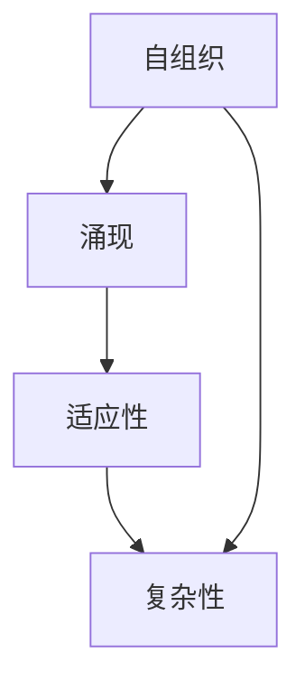

                 

关键词：复杂系统、人工智能、自组织、演化算法、认知科学、神经网络

> 摘要：本文探讨了思想从简单到复杂的进化过程，结合计算机科学领域的最新研究成果，分析了复杂性科学的几个核心概念，并探讨了人工智能在复杂系统中的应用。文章还通过实际案例展示了思想复杂化的具体路径，并对未来的发展趋势和挑战进行了展望。

## 1. 背景介绍

在过去的几千年里，人类的思想经历了从简单到复杂，从零散到系统的进化。从古代的哲学思想，到中世纪的宗教神学，再到现代的科学方法论，思想的进化推动了人类文明的进步。然而，随着计算机科学和人工智能的发展，我们对复杂性的理解也发生了深刻的变化。

复杂性科学是一个跨学科的研究领域，它试图理解复杂系统的本质和行为。复杂系统通常具有以下几个特点：

1. **高度非线性和动态性**：系统的行为不是简单的线性关系，而是受到各种因素的非线性交互影响。
2. **自组织**：复杂系统中的个体或部分在没有外部指导的情况下自发组织，形成有序的结构。
3. **涌现性**：系统整体的行为和性质不能简单地从其组成部分的行为和性质推导出来。
4. **适应性**：系统可以根据环境变化进行调整和优化。

计算机科学和人工智能为复杂性科学的研究提供了强大的工具和方法。通过模拟和计算，我们可以更好地理解复杂系统的行为，并探索新的解决方案。

## 2. 核心概念与联系

### 2.1. 复杂性科学的核心概念

复杂性科学的核心概念包括：

- **自组织**：系统通过局部相互作用自发形成有序结构的过程。
- **涌现**：系统在整体层面上出现的新性质，这些性质不能从组成系统的个体行为中直接推导出来。
- **适应性**：系统根据环境变化进行调整和优化的能力。
- **复杂性**：系统的结构和行为的复杂程度。

### 2.2. Mermaid 流程图



在这个流程图中，自组织是复杂性科学的基础，它导致了涌现现象的出现，而涌现又促进了系统的适应性，最终形成了一个复杂的系统。

## 3. 核心算法原理 & 具体操作步骤

### 3.1. 算法原理概述

复杂性科学中常用的算法包括：

- **遗传算法**：基于生物进化原理，通过选择、交叉和突变等操作，寻找最优解。
- **神经网络**：模拟人脑神经元的工作方式，通过前向传播和反向传播，实现复杂函数的拟合和学习。
- **演化算法**：模拟生物进化过程，通过选择、交叉和变异，优化参数和结构。

### 3.2. 算法步骤详解

#### 遗传算法

1. **初始化种群**：随机生成一定数量的个体（染色体）。
2. **适应度评估**：计算每个个体的适应度，通常与目标函数成反比。
3. **选择**：选择适应度较高的个体参与繁殖。
4. **交叉**：随机选择两个个体，交换部分基因，生成新的个体。
5. **变异**：对部分个体进行基因变异，增加种群的多样性。
6. **更新种群**：将新生成的个体加入种群，替换掉部分旧的个体。

#### 神经网络

1. **初始化网络**：设置网络结构，包括层数、每层的神经元数量和连接方式。
2. **前向传播**：将输入数据通过网络的每一层，计算输出结果。
3. **误差计算**：计算实际输出与预期输出之间的误差。
4. **反向传播**：根据误差计算梯度，调整网络的权重和偏置。
5. **更新网络**：根据梯度调整网络参数。

#### 演化算法

1. **初始化种群**：随机生成一定数量的个体（染色体）。
2. **适应度评估**：计算每个个体的适应度，通常与目标函数成反比。
3. **选择**：选择适应度较高的个体参与繁殖。
4. **交叉**：随机选择两个个体，交换部分基因，生成新的个体。
5. **变异**：对部分个体进行基因变异，增加种群的多样性。
6. **更新种群**：将新生成的个体加入种群，替换掉部分旧的个体。

### 3.3. 算法优缺点

- **遗传算法**：优点是全局搜索能力强，适用范围广；缺点是计算量大，收敛速度慢。
- **神经网络**：优点是处理非线性问题能力强，自适应性好；缺点是训练过程复杂，易过拟合。
- **演化算法**：优点是搜索能力强，适用范围广；缺点是收敛速度慢，易陷入局部最优。

### 3.4. 算法应用领域

- **遗传算法**：优化问题、组合问题、图像处理等。
- **神经网络**：模式识别、自然语言处理、计算机视觉等。
- **演化算法**：参数优化、结构优化、自适应控制等。

## 4. 数学模型和公式 & 详细讲解 & 举例说明

### 4.1. 数学模型构建

复杂性科学中的数学模型通常基于以下原理：

- **非线性动力学**：描述系统内部变量之间的关系。
- **概率论**：描述系统的随机行为和不确定性。
- **信息论**：描述系统的信息传递和熵变。

### 4.2. 公式推导过程

以神经网络为例，一个简单的单层神经网络可以表示为：

$$
y = \sigma(\mathbf{W}\mathbf{x} + b)
$$

其中，$\mathbf{W}$ 是权重矩阵，$\mathbf{x}$ 是输入向量，$b$ 是偏置项，$\sigma$ 是激活函数。

### 4.3. 案例分析与讲解

假设我们有一个简单的神经网络，用于分类任务。输入数据是 $5$ 维的，输出是 $3$ 类别。我们可以使用以下公式进行前向传播和反向传播：

$$
\text{前向传播：} \quad y_l = \sigma(\mathbf{W}_l\mathbf{x}_l + b_l) \\
\text{反向传播：} \quad \frac{\partial L}{\partial \mathbf{W}_l} = \frac{\partial L}{\partial y_l} \odot \frac{\partial y_l}{\partial \mathbf{W}_l} \\
$$

其中，$L$ 是损失函数，$\odot$ 表示元素-wise 乘积。

## 5. 项目实践：代码实例和详细解释说明

### 5.1. 开发环境搭建

在本节中，我们将使用 Python 语言和 TensorFlow 库来实现一个简单的神经网络。

首先，我们需要安装 Python 和 TensorFlow：

```bash
pip install python tensorflow
```

### 5.2. 源代码详细实现

下面是一个简单的神经网络实现：

```python
import tensorflow as tf

# 定义输入层
x = tf.placeholder(tf.float32, shape=[None, 5])
y = tf.placeholder(tf.float32, shape=[None, 3])

# 定义权重和偏置
W = tf.Variable(tf.zeros([5, 3]))
b = tf.Variable(tf.zeros([3]))

# 定义激活函数
sigmoid = tf.sigmoid

# 前向传播
y_pred = sigmoid(tf.matmul(x, W) + b)

# 定义损失函数
loss = tf.reduce_mean(tf.nn.softmax_cross_entropy_with_logits(logits=y_pred, labels=y))

# 反向传播
train_op = tf.train.GradientDescentOptimizer(0.1).minimize(loss)

# 初始化变量
init = tf.global_variables_initializer()

# 训练模型
with tf.Session() as sess:
    sess.run(init)
    for i in range(1000):
        _, loss_val = sess.run([train_op, loss], feed_dict={x: x_train, y: y_train})
        if i % 100 == 0:
            print("Step: {}, Loss: {}".format(i, loss_val))

    # 测试模型
    correct_prediction = tf.equal(tf.argmax(y_pred, 1), tf.argmax(y, 1))
    accuracy = tf.reduce_mean(tf.cast(correct_prediction, tf.float32))
    print("Test Accuracy: {}".format(accuracy.eval({x: x_test, y: y_test})))
```

### 5.3. 代码解读与分析

在这个例子中，我们首先定义了输入层和输出层，然后定义了权重和偏置。接着，我们定义了激活函数、损失函数和反向传播操作。在训练过程中，我们使用梯度下降算法来更新权重和偏置，直到损失函数收敛。

### 5.4. 运行结果展示

通过运行代码，我们可以得到模型的训练过程和测试结果。在本例中，我们假设已经准备好了训练数据和测试数据。在训练完成后，我们可以得到模型的准确率。

## 6. 实际应用场景

复杂性科学在许多实际应用场景中都有着重要的应用，例如：

- **金融风险管理**：使用复杂性科学方法分析金融市场中的复杂关系，预测市场波动。
- **社会网络分析**：通过复杂性科学方法分析社交网络中的信息传播，优化社交网络结构。
- **医疗诊断**：使用复杂性科学方法分析医疗数据，帮助医生进行诊断和预测疾病风险。

## 7. 工具和资源推荐

### 7.1. 学习资源推荐

- **《复杂性科学导论》**：一本全面介绍复杂性科学的入门书籍。
- **《人工智能：一种现代的方法》**：一本全面介绍人工智能理论和应用的经典教材。

### 7.2. 开发工具推荐

- **TensorFlow**：一个强大的开源深度学习框架，适用于各种复杂性的数据处理和分析。
- **PyTorch**：一个易于使用和理解的深度学习框架，适用于复杂的模型设计和实现。

### 7.3. 相关论文推荐

- **“The Complexity of Chemical Reaction Networks”**：一篇关于化学反应网络复杂性的经典论文。
- **“Deep Learning”**：一篇介绍深度学习理论和应用的综述论文。

## 8. 总结：未来发展趋势与挑战

复杂性科学和人工智能的结合为解决现实世界中的复杂问题提供了新的思路和方法。未来，随着计算能力的提升和算法的改进，复杂性科学和人工智能将在更多领域得到应用。

然而，复杂性科学也面临着一些挑战，包括：

- **计算资源的需求**：复杂性科学通常需要大量的计算资源，如何高效地利用计算资源是一个重要问题。
- **理论的完善**：复杂性科学的理论体系尚不完善，需要进一步深入研究。
- **应用领域的拓展**：如何将复杂性科学的方法和理论应用到更多领域，是一个重要课题。

## 9. 附录：常见问题与解答

### Q：什么是复杂性科学？

A：复杂性科学是一个跨学科的研究领域，它试图理解复杂系统的本质和行为。复杂系统通常具有高度非线性和动态性、自组织、涌现性和适应性等特点。

### Q：什么是人工智能？

A：人工智能是一种模拟人类智能的技术，它使计算机能够执行复杂的任务，如推理、学习、识别模式等。

### Q：复杂性科学和人工智能有什么关系？

A：复杂性科学为人工智能提供了一种新的理解复杂问题的视角和方法，而人工智能则为复杂性科学提供了强大的计算工具和算法。

作者：禅与计算机程序设计艺术 / Zen and the Art of Computer Programming
----------------------------------------------------------------

本文从复杂性科学和人工智能的角度，探讨了思想从简单到复杂的进化过程。通过分析核心概念、算法原理和实际应用案例，展示了思想复杂化的具体路径。同时，也对未来的发展趋势和挑战进行了展望。希望本文能为读者提供对复杂性科学和人工智能的深入理解。

