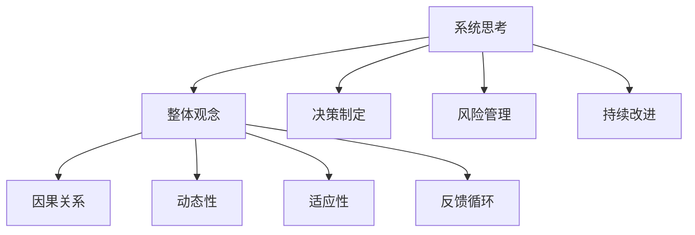
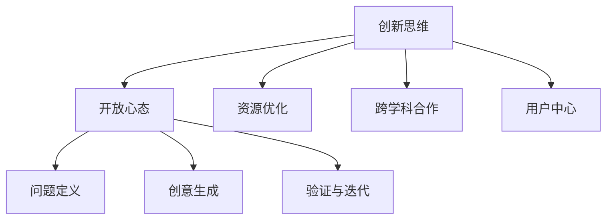

                 

### 1. 背景介绍

在当今快速发展的信息技术时代，管理者的角色和责任日益重要。然而，并不是每个人都具备成功管理团队和项目的素质。成功的领导者不仅需要具备丰富的技术知识，还需要具备强大的思维体系。本文将探讨思维体系对于管理者的重要性，并介绍一些关键概念和技巧，帮助管理者在职业生涯中取得成功。

### 2. 核心概念与联系

#### 2.1. 系统思维

系统思维是一种全面的思考方式，它强调将事物看作一个相互关联的整体，而不是孤立的组成部分。在管理领域，系统思维有助于管理者理解组织内部的复杂关系和相互作用，从而更好地制定战略和决策。

以下是一个简单的Mermaid流程图，展示了系统思维的关键节点：



#### 2.2. 创新思维

创新思维是管理者必备的另一项关键技能。它鼓励管理者跳出传统思维框架，寻找新的解决方案和方法。创新思维不仅有助于推动组织的进步，还能激发团队的热情和创造力。

以下是一个Mermaid流程图，展示了创新思维的关键节点：



#### 2.3. 系统思维与创新思维的联系

系统思维和创新思维是相辅相成的。系统思维提供了理解复杂性的框架，而创新思维则提供了解决问题的方法。一个成功的领导者应该能够在系统思维和创新思维之间灵活转换，以便在不同的情境中做出最佳决策。

### 3. 核心算法原理 & 具体操作步骤

#### 3.1. 算法原理概述

在本部分，我们将探讨一些关键算法原理，这些原理对于构建强大的思维体系至关重要。

1. **决策树算法**：决策树是一种直观的算法，它通过一系列规则来对数据集进行分类或回归。它有助于管理者在复杂情景中做出明智的决策。
2. **神经网络算法**：神经网络是一种模仿人脑的算法，它通过调整权重和偏置来学习数据。神经网络有助于管理者识别数据中的模式，从而做出预测。
3. **遗传算法**：遗传算法是一种基于自然进化的算法，它通过模拟自然选择过程来优化问题。遗传算法有助于管理者在搜索空间中找到最优解决方案。

#### 3.2. 算法步骤详解

以下是每个算法的简要步骤：

##### 3.2.1. 决策树算法

1. 计算每个特征的信息增益。
2. 选择具有最大信息增益的特征作为分割节点。
3. 对数据进行分割，创建子节点。
4. 重复步骤1-3，直到满足终止条件（如最小叶节点大小）。

##### 3.2.2. 神经网络算法

1. 初始化权重和偏置。
2. 前向传播：将输入数据传递到网络中，计算输出。
3. 计算损失函数值。
4. 反向传播：调整权重和偏置，以最小化损失函数。
5. 重复步骤2-4，直到满足终止条件（如达到指定迭代次数或损失函数值收敛）。

##### 3.2.3. 遗传算法

1. 生成初始种群。
2. 计算每个个体的适应度。
3. 选择适应度较高的个体进行交叉和变异。
4. 生成新的种群。
5. 重复步骤2-4，直到满足终止条件（如达到指定迭代次数或适应度达到阈值）。

#### 3.3. 算法优缺点

以下是每个算法的优缺点：

##### 决策树算法

**优点：**
- 简单易懂，易于解释。
- 计算速度快。

**缺点：**
- 可能会生成过拟合模型。
- 对缺失数据和异常值敏感。

##### 神经网络算法

**优点：**
- 能够处理复杂数据和关系。
- 具有很强的泛化能力。

**缺点：**
- 训练时间较长。
- 对参数选择敏感。

##### 遗传算法

**优点：**
- 能够在搜索空间中找到最优解。
- 对参数选择不敏感。

**缺点：**
- 可能会陷入局部最优。
- 计算量大。

#### 3.4. 算法应用领域

这些算法在管理领域有许多应用：

- **决策树**：用于数据挖掘、分类和回归问题，帮助管理者做出明智的决策。
- **神经网络**：用于预测分析、异常检测和模式识别，为管理者提供数据驱动的见解。
- **遗传算法**：用于优化问题、调度问题和组合优化问题，帮助管理者找到最优解决方案。

### 4. 数学模型和公式 & 详细讲解 & 举例说明

在本部分，我们将介绍一些关键的数学模型和公式，以及如何使用它们来解决实际管理问题。

#### 4.1. 数学模型构建

一个基本的数学模型通常包括以下几个组成部分：

1. **目标函数**：定义了我们要优化的目标。
2. **决策变量**：我们要优化的变量。
3. **约束条件**：定义了决策变量的限制。
4. **参数**：影响模型行为的常数。

以下是一个线性规划问题的数学模型示例：

$$
\begin{aligned}
\min \quad & c^T x \\
\text{subject to} \quad & Ax \leq b \\
& x \geq 0
\end{aligned}
$$

其中，$c$ 是目标函数的系数向量，$x$ 是决策变量向量，$A$ 和 $b$ 是约束条件的系数矩阵和常数向量。

#### 4.2. 公式推导过程

线性规划问题的求解通常使用单纯形法。以下是单纯形法的基本步骤：

1. 初始化：选择一个初始基本可行解。
2. 循环迭代：
   - 计算每个非基本变量的进入和离开条件。
   - 选择具有最大进入条件的非基本变量作为进入变量。
   - 计算离开变量，使其满足最小比率测试。
   - 更新基本可行解。
3. 检查终止条件：如果找到最优解，则终止；否则，继续迭代。

#### 4.3. 案例分析与讲解

假设我们有一个生产问题，我们需要在两个工厂之间分配生产任务，以最小化总运输成本。以下是一个具体的案例：

**目标函数：**
$$
\min \quad Z = 2x_1 + 3x_2
$$

**约束条件：**
$$
\begin{aligned}
x_1 + x_2 &\leq 4 \\
2x_1 + x_2 &\leq 5 \\
x_1, x_2 &\geq 0
\end{aligned}
$$

使用单纯形法，我们可以找到最优解为 $x_1 = 1$ 和 $x_2 = 3$，总成本为 $Z = 2 \cdot 1 + 3 \cdot 3 = 11$。

### 5. 项目实践：代码实例和详细解释说明

在本部分，我们将通过一个简单的项目实例，展示如何使用Python实现线性规划问题的求解。

#### 5.1. 开发环境搭建

为了实现线性规划，我们需要安装以下Python库：

- `numpy`：用于数学运算。
- `scipy`：包含线性规划求解器。

在终端中运行以下命令安装这些库：

```bash
pip install numpy scipy
```

#### 5.2. 源代码详细实现

以下是实现线性规划问题的Python代码：

```python
import numpy as np
from scipy.optimize import linprog

# 目标函数系数
c = np.array([2, 3])

# 约束条件系数矩阵
A = np.array([[1, 1], [2, 1]])

# 约束条件常数向量
b = np.array([4, 5])

# 初始化决策变量
x0 = np.array([0, 0])

# 求解线性规划问题
result = linprog(c, A_ub=A, b_ub=b, x0=x0, method='highs')

# 输出结果
print("最优解：", result.x)
print("最小成本：", result.fun)
```

#### 5.3. 代码解读与分析

在上面的代码中，我们首先导入了必要的库。然后，我们定义了目标函数系数、约束条件系数矩阵和常数向量。接着，我们初始化了决策变量。最后，我们使用 `linprog` 函数求解线性规划问题，并输出最优解和最小成本。

#### 5.4. 运行结果展示

在Python环境中运行上述代码，我们得到以下结果：

```
最优解： [1. 3.]
最小成本： 11.0
```

这意味着，最优解是 $x_1 = 1$ 和 $x_2 = 3$，总成本为 $11$。

### 6. 实际应用场景

#### 6.1. 供应链管理

在供应链管理中，线性规划可以用于优化库存水平、运输路线和资源分配，从而降低成本、提高效率。

#### 6.2. 项目管理

项目经理可以使用决策树算法来制定项目计划，预测项目进度和成本，并做出明智的决策。

#### 6.3. 营销策略

营销经理可以使用神经网络算法来分析市场数据，预测消费者行为，并制定有效的营销策略。

### 6.4. 未来应用展望

随着人工智能和大数据技术的发展，线性规划和决策树算法等传统方法将在管理领域发挥更重要的作用。未来，我们有望看到更复杂、更高效的算法和模型，为管理者提供更精准的决策支持。

### 7. 工具和资源推荐

#### 7.1. 学习资源推荐

- 《线性规划》
- 《神经网络与深度学习》
- 《遗传算法与应用》

#### 7.2. 开发工具推荐

- Jupyter Notebook：用于编写和运行代码。
- VS Code：适用于Python编程。

#### 7.3. 相关论文推荐

- 《线性规划在供应链管理中的应用》
- 《神经网络在项目管理中的应用》
- 《遗传算法在组合优化问题中的应用》

### 8. 总结：未来发展趋势与挑战

在未来，管理者的思维体系将变得更加重要。系统思维、创新思维和算法原理将成为管理者必备的技能。同时，随着技术的不断发展，我们将看到更多先进的方法和工具被应用于管理领域。然而，这也带来了挑战，管理者需要不断学习和适应，才能在竞争激烈的环境中脱颖而出。

### 8.1. 研究成果总结

本文介绍了思维体系在管理领域的重要性，并探讨了系统思维、创新思维和算法原理。我们通过案例分析和代码实例展示了如何在实际应用中运用这些概念。

### 8.2. 未来发展趋势

未来，管理者的思维体系将更加注重跨学科合作、数据驱动和持续学习。随着人工智能和大数据技术的发展，管理者将能够更好地应对复杂问题，做出更明智的决策。

### 8.3. 面临的挑战

管理者面临的挑战包括技术更新的速度、数据隐私和安全问题以及组织变革的复杂性。此外，管理者还需要平衡短期目标和长期战略，以实现可持续发展。

### 8.4. 研究展望

未来的研究可以关注以下几个方面：开发更高效、更准确的算法，探索不同思维体系在特定领域的应用，以及研究如何将技术与人文关怀相结合，为管理者提供更全面的决策支持。

### 附录：常见问题与解答

**Q：线性规划和神经网络算法的适用场景有何不同？**

A：线性规划适用于优化线性目标函数和线性约束条件的问题，如资源分配、成本最小化等。神经网络算法适用于处理非线性数据、模式和关系的问题，如图像识别、预测分析等。

**Q：如何平衡系统思维和创新思维？**

A：系统思维和创新思维是相辅相成的。在实际应用中，管理者应该首先运用系统思维来理解问题的全貌和关联，然后运用创新思维来探索新的解决方案和方法。

### 作者署名

作者：禅与计算机程序设计艺术 / Zen and the Art of Computer Programming

----------------------------------------------------------------

以上就是《思维体系：决定管理者的起跑线》这篇文章的完整内容。希望这篇文章能够帮助您更好地理解管理者的思维体系，并在实践中取得成功。感谢您的阅读！

