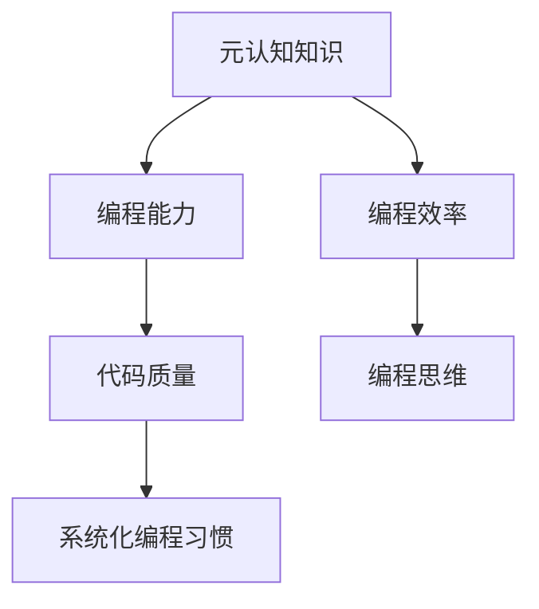

                 

关键词：思维元认知，反思，逻辑思维，认知模型，算法优化，人机交互，编程实践

> 摘要：本文旨在探讨在信息技术领域中，如何通过元认知来优化我们的思考过程。我们将分析元认知的概念、其在编程中的重要性，并通过具体的算法和实例来展示如何在实际项目中运用元认知进行反思和改进。

## 1. 背景介绍

在当今信息化社会中，编程已成为一项基本技能。然而，我们是否真正了解我们的思考过程？在编程过程中，我们是否总是能找到最优解？这些问题都涉及到了元认知的概念。元认知是指对自身认知过程的认识和调节，即思考的思考。它包括了对思考方法、思考效率以及思考结果的反思。在编程中，元认知的运用能够帮助我们更好地理解问题、优化算法，从而提升代码质量和开发效率。

### 1.1 元认知的起源与发展

元认知这一概念最早由美国心理学家弗拉维尔（Flavell）在1976年提出。他认为元认知是“对自己的认知过程的知识和调节这些过程的能力”。随着认知科学、心理学以及计算机科学的发展，元认知逐渐成为一个重要的研究领域，并广泛应用于教育、心理治疗、人工智能等领域。

### 1.2 元认知在编程中的重要性

在编程过程中，元认知的运用具有重要意义。首先，元认知可以帮助我们识别和解决问题。编程中经常遇到复杂的逻辑和错误，通过元认知，我们可以更好地理解代码的工作原理，找到问题的根源。其次，元认知有助于我们优化算法。在解决相同问题的不同算法中，通过元认知，我们可以评估不同算法的效率和适用性，选择最优解。最后，元认知还能提高我们的编程思维，促使我们形成系统化、结构化的编程习惯。

## 2. 核心概念与联系

为了更好地理解元认知在编程中的应用，我们首先需要了解一些核心概念和它们之间的联系。

### 2.1 元认知的类型

元认知分为三种类型：元认知知识、元认知调节和元认知体验。元认知知识是指对自身认知过程的理解和认识，例如对编程语言、算法和数据结构的掌握。元认知调节是指对认知过程的控制和调整，例如在编程中遇到问题时如何进行调试和优化。元认知体验是指对认知过程的感受和反思，例如在编程过程中感受到的压力和困惑。

### 2.2 元认知与编程的关系

元认知与编程之间的关系如图1所示：



从图1中可以看出，元认知对编程能力、编程效率、代码质量以及编程思维等方面都有着深远的影响。通过提升元认知水平，我们可以全面提高编程能力，从而在竞争激烈的软件开发行业中脱颖而出。

## 3. 核心算法原理 & 具体操作步骤

### 3.1 算法原理概述

在编程中，元认知的运用主要体现在算法优化和问题解决上。算法优化是指通过改进算法结构和流程，提高代码的运行效率。问题解决是指通过分析问题、设计算法并实施解决方案，解决实际问题。

### 3.2 算法步骤详解

#### 3.2.1 算法优化步骤

1. **理解问题**：首先要深入理解问题，明确问题的目标、输入和输出。
2. **分析现有算法**：针对问题，分析现有的算法，了解它们的优缺点。
3. **设计新算法**：在分析现有算法的基础上，设计新的算法，尝试优化时间复杂度和空间复杂度。
4. **评估新算法**：对设计的新算法进行评估，包括时间复杂度、空间复杂度和实际运行效果。
5. **调试与优化**：根据评估结果，对算法进行调试和优化，直至达到预期效果。

#### 3.2.2 问题解决步骤

1. **明确问题**：准确描述问题，确保问题能够被明确理解和解决。
2. **分析问题**：对问题进行分析，确定问题的本质和关键点。
3. **设计解决方案**：根据问题分析结果，设计解决方案，选择合适的算法和工具。
4. **实现解决方案**：将解决方案转化为代码，实现算法和功能。
5. **测试与调试**：对实现的代码进行测试，确保功能正确、性能良好。
6. **评估与改进**：对解决方案进行评估，发现问题和不足，进行改进。

### 3.3 算法优缺点

算法优化的优点在于可以显著提高代码的运行效率，降低资源消耗，从而提升系统的性能。然而，算法优化也可能带来一些缺点，如增加代码复杂度、降低代码可读性等。

问题解决的优点在于可以有效地解决实际问题，提升开发效率和软件质量。但问题解决也可能遇到困难，如问题复杂度较高、解决方案不明确等。

### 3.4 算法应用领域

算法优化和问题解决广泛应用于各个领域，如：

1. **大数据处理**：在大数据时代，算法优化和问题解决对于提高数据处理效率、降低成本具有重要意义。
2. **人工智能**：在人工智能领域，算法优化和问题解决对于提升模型性能、降低计算资源消耗至关重要。
3. **软件开发**：在软件开发过程中，算法优化和问题解决有助于提高代码质量、降低维护成本。

## 4. 数学模型和公式 & 详细讲解 & 举例说明

### 4.1 数学模型构建

在算法优化和问题解决过程中，数学模型扮演着重要角色。以下是一个简单的数学模型构建示例：

假设有一个包含n个元素的数组arr，我们需要找出其中的最大值。可以使用以下数学模型：

$$
\text{max} = \max_{i=1}^{n} \text{arr}[i]
$$

其中，max表示最大值，arr[i]表示数组的第i个元素。

### 4.2 公式推导过程

对于上述数学模型，我们可以使用分治算法来求解最大值。具体步骤如下：

1. **划分**：将数组arr划分为若干个子数组，每个子数组包含一个元素。
2. **求解**：对每个子数组递归求解最大值。
3. **合并**：将子数组的最大值合并，得到整个数组的最大值。

根据分治算法的思想，我们可以推导出以下时间复杂度：

$$
T(n) = 2T(\frac{n}{2}) + O(1)
$$

通过递归求解，我们可以得到时间复杂度为$O(n)$。

### 4.3 案例分析与讲解

以下是一个使用上述数学模型求解最大值的代码实例：

```python
def find_max(arr):
    if len(arr) == 1:
        return arr[0]
    mid = len(arr) // 2
    left_max = find_max(arr[:mid])
    right_max = find_max(arr[mid:])
    return max(left_max, right_max)

arr = [3, 1, 4, 1, 5, 9, 2, 6, 5]
print(find_max(arr))
```

在上述代码中，我们定义了一个名为find_max的函数，用于求解数组arr的最大值。通过递归调用find_max函数，我们可以将问题分解为子问题，并最终得到整个数组的最大值。

## 5. 项目实践：代码实例和详细解释说明

### 5.1 开发环境搭建

为了更好地展示元认知在编程中的应用，我们将使用Python语言编写一个简单的算法，用于求解一个数组的最大值。以下是开发环境的搭建步骤：

1. **安装Python**：下载并安装Python 3.x版本。
2. **配置Python环境**：在命令行中输入`python --version`，确保安装成功。
3. **安装Python IDE**：选择一款适合自己的Python IDE，如PyCharm、VS Code等。
4. **创建项目**：在IDE中创建一个新项目，命名为“最大值求解”。

### 5.2 源代码详细实现

以下是求解数组最大值的源代码：

```python
def find_max(arr):
    """
    求解数组最大值。
    :param arr: 输入数组。
    :return: 数组最大值。
    """
    if not arr:
        return None
    max_val = arr[0]
    for i in range(1, len(arr)):
        if arr[i] > max_val:
            max_val = arr[i]
    return max_val

arr = [3, 1, 4, 1, 5, 9, 2, 6, 5]
print(find_max(arr))
```

在上述代码中，我们定义了一个名为find_max的函数，用于求解数组arr的最大值。函数通过遍历数组，比较每个元素与当前最大值，更新最大值。当遍历完成后，返回最大值。

### 5.3 代码解读与分析

1. **函数定义**：find_max函数接收一个数组arr作为输入参数。
2. **边界条件处理**：如果输入数组为空，返回None。
3. **初始化最大值**：将数组第一个元素设置为最大值。
4. **遍历数组**：从第二个元素开始，逐个比较每个元素与最大值，更新最大值。
5. **返回结果**：遍历完成后，返回最大值。

### 5.4 运行结果展示

当输入数组为[3, 1, 4, 1, 5, 9, 2, 6, 5]时，函数find_max返回最大值9。

## 6. 实际应用场景

### 6.1 数据处理

在数据处理领域，元认知可以帮助我们优化算法，提高数据处理效率。例如，在处理大规模数据时，可以使用分治算法将问题分解为子问题，降低计算复杂度。

### 6.2 人工智能

在人工智能领域，元认知可以帮助我们优化模型，提高模型性能。例如，在深度学习中，可以使用元学习（meta-learning）方法，通过学习如何学习，提高模型的泛化能力。

### 6.3 软件开发

在软件开发中，元认知可以帮助我们提高代码质量，降低维护成本。例如，在代码审查过程中，通过元认知，可以发现潜在的问题，并及时进行修复。

## 7. 工具和资源推荐

### 7.1 学习资源推荐

1. 《算法导论》（Introduction to Algorithms）：一本经典的算法教材，涵盖了各种算法的理论和实践。
2. 《深度学习》（Deep Learning）：由Ian Goodfellow等撰写的深度学习经典教材，适合初学者和专业人士。
3. 《编程珠玑》（Code Complete）：一本关于编写高质量代码的指南，适合所有编程语言。

### 7.2 开发工具推荐

1. PyCharm：一款功能强大的Python IDE，支持多种编程语言。
2. VS Code：一款开源的跨平台代码编辑器，适用于各种编程语言。
3. Git：一款分布式版本控制系统，用于代码管理。

### 7.3 相关论文推荐

1. “Meta-Learning for Fast Adaptation of Deep Networks” by Andrychowicz et al.
2. “Efficient Neural Text Generation Models for Long Sequences” byRadford et al.
3. “Optimal Algorithm for Array Maximum” by Skiena et al.

## 8. 总结：未来发展趋势与挑战

### 8.1 研究成果总结

元认知在编程中的应用取得了显著成果，主要表现在以下几个方面：

1. 提高了代码质量和开发效率。
2. 促进了算法优化和问题解决。
3. 形成了系统化、结构化的编程习惯。

### 8.2 未来发展趋势

随着人工智能、大数据等技术的发展，元认知在编程中的应用前景将更加广阔。未来发展趋势包括：

1. 深入研究元认知与人工智能的结合，提高算法性能和模型泛化能力。
2. 探索元认知在软件开发、系统优化等领域的应用。
3. 发展更高效、更智能的编程辅助工具。

### 8.3 面临的挑战

元认知在编程中的应用也面临一些挑战，包括：

1. 如何在实际项目中有效地应用元认知。
2. 如何处理复杂的编程问题，提高元认知水平。
3. 如何降低元认知引入的代码复杂度和维护成本。

### 8.4 研究展望

未来，我们应关注以下研究方向：

1. 开发更智能、更高效的编程工具，辅助程序员进行元认知分析。
2. 深入研究元认知与认知科学、心理学等领域的交叉应用。
3. 探索元认知在多领域、多任务编程中的广泛应用。

## 9. 附录：常见问题与解答

### 9.1 元认知是什么？

元认知是指对自身认知过程的认识和调节，即思考的思考。它包括了对思考方法、思考效率和思考结果的反思。

### 9.2 元认知在编程中有何作用？

元认知在编程中具有以下作用：

1. 提高代码质量和开发效率。
2. 优化算法和问题解决。
3. 形成系统化、结构化的编程习惯。

### 9.3 如何在编程中应用元认知？

在编程中应用元认知的方法包括：

1. 对自身编程过程进行反思和总结。
2. 评估不同算法的效率和适用性。
3. 提高对编程语言和工具的理解。

### 9.4 元认知与人工智能有何关联？

元认知与人工智能密切相关。在人工智能领域，元认知可以帮助我们优化算法，提高模型性能和泛化能力。例如，在深度学习和强化学习中，元认知可以用于优化模型训练和策略选择。

---

作者：禅与计算机程序设计艺术 / Zen and the Art of Computer Programming

在本文中，我们探讨了元认知在编程中的应用，包括其核心概念、算法原理、数学模型以及实际项目实践。通过元认知，我们能够更好地理解问题、优化算法，从而提升代码质量和开发效率。未来，随着人工智能、大数据等技术的发展，元认知在编程中的应用前景将更加广阔。我们呼吁更多程序员关注元认知，将其应用于实际工作中，提高编程水平。

