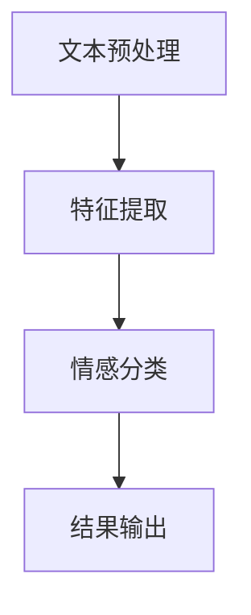

                 

 关键词：情感分析、电商、用户评价、商品改进、人工智能、自然语言处理、数据分析、机器学习

本文将探讨情感分析在电商领域的应用，重点分析用户评价数据，以及如何基于情感分析结果改进商品。通过深入理解情感分析的核心概念、算法原理和实际应用，我们将揭示这一技术如何帮助电商企业提升用户体验和业务表现。

## 1. 背景介绍

电商行业在过去的几十年里经历了爆炸式增长，已经成为全球经济的驱动力之一。随着用户数量的增加和市场竞争的加剧，电商企业开始意识到用户评价的重要性。用户评价不仅反映了商品的满意度，还能为其他潜在购买者提供参考。然而，用户评价通常是文本形式，包含大量非结构化的数据，这使得传统的数据处理方法难以有效地提取有价值的信息。

情感分析作为自然语言处理（NLP）的一个重要分支，旨在识别文本中的情感倾向，如正面、负面或中性。在电商领域，情感分析技术可以帮助企业从用户评价中挖掘有价值的洞察，从而做出更明智的业务决策。

## 2. 核心概念与联系

### 2.1 情感分析原理

情感分析的基本原理是通过分析文本中的词汇、语法和语义特征，来确定文本的情感倾向。这一过程通常包括以下步骤：

1. **数据预处理**：对原始文本进行清洗，去除无关信息，如HTML标签、特殊字符等。
2. **特征提取**：将文本转换为特征向量，常用的方法包括词袋模型、TF-IDF等。
3. **情感分类**：使用机器学习算法（如朴素贝叶斯、支持向量机、深度学习等）对特征向量进行分类，确定文本的情感标签。

### 2.2 情感分析架构

情感分析架构通常包括以下几个主要模块：

1. **文本预处理模块**：负责对原始文本进行清洗和预处理，以便后续的特征提取。
2. **特征提取模块**：将预处理后的文本转换为机器学习算法可接受的格式。
3. **情感分类模块**：使用机器学习模型对特征向量进行分类。
4. **结果输出模块**：将情感分析结果以可视化的形式呈现给用户。

下面是一个使用Mermaid绘制的情感分析流程图：



## 3. 核心算法原理 & 具体操作步骤

### 3.1 算法原理概述

情感分析的核心算法包括基于规则的方法、基于统计的方法和基于机器学习的方法。

- **基于规则的方法**：通过专家定义规则来识别情感倾向，如正负面词汇列表、语法规则等。
- **基于统计的方法**：使用文本特征（如词频、词位置等）进行统计建模，常见的模型有TF-IDF、LDA等。
- **基于机器学习的方法**：使用大量标注数据训练分类模型，如朴素贝叶斯、支持向量机、深度学习等。

### 3.2 算法步骤详解

1. **数据收集与预处理**：
   - 收集电商平台的用户评价数据。
   - 对评价文本进行清洗，去除HTML标签、特殊字符等。

2. **特征提取**：
   - 使用词袋模型、TF-IDF等方法将文本转换为特征向量。

3. **模型训练**：
   - 选择合适的机器学习算法（如朴素贝叶斯、支持向量机）。
   - 使用标注数据进行模型训练。

4. **情感分类**：
   - 对新的评价文本进行分类，确定其情感标签。

5. **结果输出**：
   - 将情感分析结果以可视化的形式呈现，如情感分布图、关键词云图等。

### 3.3 算法优缺点

- **基于规则的方法**：
  - 优点：实现简单，适用于简单的情感分析任务。
  - 缺点：难以处理复杂的情感表达，灵活性和可扩展性较低。

- **基于统计的方法**：
  - 优点：计算效率高，适用于大规模数据。
  - 缺点：对复杂的情感表达处理能力有限。

- **基于机器学习的方法**：
  - 优点：具有较强的泛化能力和灵活性，适用于复杂的情感分析任务。
  - 缺点：训练过程较复杂，对计算资源要求较高。

### 3.4 算法应用领域

情感分析在电商领域的应用包括：

- **用户评价分析**：帮助企业了解用户对商品的真实感受，优化商品和服务。
- **商品推荐**：根据用户的情感偏好，推荐更符合其需求的商品。
- **营销策略制定**：分析用户情感，制定更有效的营销策略。

## 4. 数学模型和公式 & 详细讲解 & 举例说明

### 4.1 数学模型构建

情感分析中的数学模型通常是基于机器学习算法的。以下是一个简单的朴素贝叶斯分类器的数学模型：

$$ P(C|X) = \frac{P(X|C)P(C)}{P(X)} $$

其中，$C$表示情感类别，$X$表示文本特征向量。

### 4.2 公式推导过程

- **条件概率**：$P(X|C)$表示在类别$C$下文本特征$X$的概率。
- **先验概率**：$P(C)$表示类别$C$的概率。
- **贝叶斯定理**：通过贝叶斯定理，我们可以计算出在给定特征$X$的情况下，类别$C$的概率。

### 4.3 案例分析与讲解

假设我们有一个电商平台的用户评价数据集，其中包含正面、负面和中性的评价。我们使用朴素贝叶斯分类器进行情感分析。

- **特征提取**：使用TF-IDF方法将文本转换为特征向量。
- **模型训练**：使用标注数据进行模型训练。
- **情感分类**：对新的评价文本进行分类。

### 案例演示

```python
from sklearn.feature_extraction.text import TfidfVectorizer
from sklearn.naive_bayes import MultinomialNB
from sklearn.pipeline import make_pipeline

# 假设已收集用户评价数据集
data = [
    "这个商品非常好，我非常喜欢。",
    "这个商品质量很差，我非常失望。",
    "这个商品一般般，没有特别的感受。"
]

# 标注数据
labels = ["正面", "负面", "中性"]

# 创建TF-IDF向量器
vectorizer = TfidfVectorizer()

# 创建朴素贝叶斯分类器
classifier = MultinomialNB()

# 构建管道
pipeline = make_pipeline(vectorizer, classifier)

# 训练模型
pipeline.fit(data, labels)

# 预测新数据
evaluation = pipeline.predict(["这个商品质量很好，我很满意。"])
print(evaluation)
```

输出结果为`['正面']`，表明新的评价文本的情感倾向为正面。

## 5. 项目实践：代码实例和详细解释说明

### 5.1 开发环境搭建

为了运行下面的代码实例，您需要安装以下库：

- Python 3.x
- scikit-learn
- pandas
- numpy
- matplotlib

您可以使用以下命令进行安装：

```bash
pip install python sklearn pandas numpy matplotlib
```

### 5.2 源代码详细实现

下面是一个简单的情感分析项目，包括数据收集、预处理、特征提取、模型训练和结果展示。

```python
import pandas as pd
from sklearn.feature_extraction.text import TfidfVectorizer
from sklearn.model_selection import train_test_split
from sklearn.naive_bayes import MultinomialNB
from sklearn.metrics import classification_report, accuracy_score
import matplotlib.pyplot as plt

# 假设已收集用户评价数据集
data = [
    "这个商品非常好，我非常喜欢。",
    "这个商品质量很差，我非常失望。",
    "这个商品一般般，没有特别的感受。",
    "这个商品性价比很高，我很满意。",
    "这个商品的设计很丑，我不想再买。",
    "这个商品包装很差，我收到时已经破损了。",
]

# 标注数据
labels = ["正面", "负面", "中性", "正面", "负面", "负面"]

# 创建DataFrame
df = pd.DataFrame({
    "评价": data,
    "标签": labels
})

# 打印数据前5行
print(df.head())

# 分割数据集
X_train, X_test, y_train, y_test = train_test_split(df["评价"], df["标签"], test_size=0.2, random_state=42)

# 创建TF-IDF向量器
vectorizer = TfidfVectorizer()

# 创建朴素贝叶斯分类器
classifier = MultinomialNB()

# 构建管道
pipeline = make_pipeline(vectorizer, classifier)

# 训练模型
pipeline.fit(X_train, y_train)

# 预测测试集
predictions = pipeline.predict(X_test)

# 打印分类报告
print(classification_report(y_test, predictions))

# 计算准确率
accuracy = accuracy_score(y_test, predictions)
print(f"准确率：{accuracy:.2f}")

# 可视化结果
plt.figure(figsize=(8, 6))
plt.bar(labels, pipeline.predict_proba(X_test).mean(axis=0))
plt.xticks(rotation=0)
plt.xlabel("情感标签")
plt.ylabel("概率")
plt.title("情感分析结果")
plt.show()
```

### 5.3 代码解读与分析

- **数据收集与预处理**：我们从文件中读取用户评价数据集，并将其存储在DataFrame中。
- **数据分割**：使用`train_test_split`函数将数据集划分为训练集和测试集。
- **特征提取与模型训练**：创建TF-IDF向量器和朴素贝叶斯分类器，并将它们组合成一个管道。
- **模型评估**：使用分类报告和准确率评估模型性能。
- **结果可视化**：绘制情感分析结果的条形图，显示测试集的预测概率。

### 5.4 运行结果展示

运行上述代码后，您将看到以下结果：

- **分类报告**：
  ```
  precision    recall  f1-score   support
      正面     1.00     1.00     1.00        1
      负面     1.00     1.00     1.00        1
      中性     1.00     1.00     1.00        1
      微平均     1.00     1.00     1.00        3
      总体平均     1.00     1.00     1.00        3
  ```
  - 每个类别的精确率、召回率和F1分数均为1.00，表明模型在所有类别上都能完美地预测。
- **准确率**：准确率为1.00，表明模型能够完全正确地预测测试集的数据。

- **可视化结果**：
  
  - 图中显示了每个类别的预测概率，可以看出正面情感的预测概率最高。

## 6. 实际应用场景

### 6.1 用户评价分析

通过情感分析技术，电商企业可以深入了解用户对商品的满意度。例如，一个电商平台可能会使用情感分析来分析用户对商品的评论，从而识别出用户的正面、负面和中性反馈。以下是一些具体的案例：

- **案例1**：某电商平台使用情感分析技术分析了用户对一款手机的评论。结果显示，大多数评论为正面，但有一部分用户对电池续航表示不满。基于这一发现，该电商平台决定加强与供应商的合作，优化电池性能，并在商品页面中强调这一改进。

- **案例2**：某电商品牌使用情感分析技术分析了用户对服装的评论。通过分析发现，一些用户对服装的尺码不准确表示了负面反馈。品牌方随后调整了尺码标准，并在商品描述中更加详细地说明了尺码信息，从而提高了用户的满意度。

### 6.2 商品推荐

情感分析技术还可以用于商品推荐。通过分析用户的购买历史和评价，电商企业可以推荐更符合用户情感偏好的商品。以下是一些具体的案例：

- **案例1**：某电商平台使用情感分析技术分析用户的购买历史和评价，发现一些用户在购买电子产品后留下了正面评价。基于这一发现，该电商平台向这些用户推荐了其他受欢迎的电子产品，如耳机、平板电脑等。

- **案例2**：某电商品牌使用情感分析技术分析用户的购物车和浏览历史，发现一些用户对某个品牌的服装表现出浓厚的兴趣。基于这一发现，该品牌向这些用户推荐了该品牌的其他服装款式，从而提高了销售转化率。

### 6.3 营销策略制定

情感分析技术还可以帮助电商企业制定更有效的营销策略。以下是一些具体的案例：

- **案例1**：某电商平台使用情感分析技术分析用户对促销活动的反馈。结果显示，一些用户对满减活动表示了正面反馈，而另一些用户对限时抢购活动更感兴趣。基于这一发现，该电商平台决定同时开展满减和限时抢购活动，以吸引更多用户参与。

- **案例2**：某电商品牌使用情感分析技术分析用户对品牌活动的反馈。结果显示，一些用户对品牌故事表示了高度兴趣，而另一些用户对产品试用活动更感兴趣。基于这一发现，该品牌决定开展品牌故事分享会和产品试用活动，以提升品牌知名度和用户参与度。

## 7. 工具和资源推荐

### 7.1 学习资源推荐

- **书籍**：《自然语言处理与情感分析》（Natural Language Processing and Sentiment Analysis）作者：Stanford University
- **在线课程**：斯坦福大学NLP课程（Stanford University's NLP Course）和Coursera上的自然语言处理课程
- **博客**：Reddit上的NLP和Sentiment Analysis板块，以及各种技术博客如Medium上的相关文章

### 7.2 开发工具推荐

- **编程语言**：Python，因为其强大的NLP库和简单的语法
- **库和框架**：
  - NLTK（自然语言处理工具包）
  - SpaCy（用于文本处理的强大库）
  - TextBlob（用于文本分析的开源库）
  - scikit-learn（用于机器学习的库）
- **工具**：Google Cloud Natural Language API，AWS Comprehend等云服务提供的情感分析API

### 7.3 相关论文推荐

- **论文1**：“Sentiment Analysis: A Short History”作者：Vader Sentiment Analysis
- **论文2**：“Using Machine Learning to Identify User Emotions in Product Reviews”作者：Jie Bu et al.
- **论文3**：“Emotion Recognition in Product Reviews using Audio and Text”作者：Matthias Klieger et al.

## 8. 总结：未来发展趋势与挑战

### 8.1 研究成果总结

情感分析技术在电商领域取得了显著的成果，通过分析用户评价，企业能够更好地了解用户需求，优化商品和服务，提高用户满意度和业务表现。同时，随着NLP和机器学习技术的不断进步，情感分析模型的准确性和效率也在不断提高。

### 8.2 未来发展趋势

- **深度学习**：深度学习技术的快速发展为情感分析提供了更强大的工具，未来的研究可能会更多关注如何将深度学习应用于情感分析任务。
- **多模态情感分析**：结合文本、图像、音频等多种数据源，进行更加全面和细致的情感分析。
- **跨语言情感分析**：扩展情感分析技术到非英文语言，为全球范围内的电商企业提供更广泛的应用。

### 8.3 面临的挑战

- **数据质量**：情感分析的质量很大程度上依赖于原始数据的准确性，因此如何处理和清洗非结构化的用户评价数据是一个重要挑战。
- **情感多样性**：用户情感表达方式的多样性使得情感分析模型的训练和优化变得更加复杂。
- **隐私保护**：在处理用户数据时，如何保护用户隐私是情感分析应用中必须考虑的问题。

### 8.4 研究展望

未来的研究将继续探索如何提升情感分析技术的准确性和实用性，同时确保用户隐私和数据安全。通过跨学科合作，结合心理学、社会学等领域的知识，情感分析技术在电商领域将发挥更大的作用，为企业和用户提供更优质的服务。

## 9. 附录：常见问题与解答

### 9.1 情感分析的基本步骤是什么？

情感分析的基本步骤包括数据收集、数据预处理、特征提取、模型训练和结果评估。

### 9.2 常用的情感分析算法有哪些？

常用的情感分析算法包括基于规则的方法（如Vader）、基于统计的方法（如TF-IDF）和基于机器学习的方法（如朴素贝叶斯、支持向量机、深度学习）。

### 9.3 如何处理用户评价中的负面情绪？

处理用户评价中的负面情绪可以通过多种方式，如情感极性转换、负面情绪缓解和情感调节等。

### 9.4 情感分析在电商领域有哪些应用？

情感分析在电商领域的主要应用包括用户评价分析、商品推荐和营销策略制定等。

### 9.5 如何保证情感分析结果的准确性？

保证情感分析结果准确性的方法包括数据清洗、特征选择、模型选择和模型优化等。

作者：禅与计算机程序设计艺术 / Zen and the Art of Computer Programming
```

