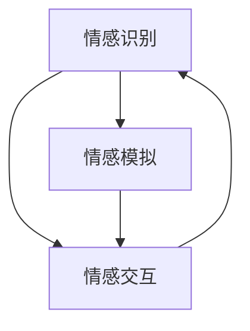

                 

关键词：情感计算、人工智能、情感识别、情感模拟、自然语言处理、机器学习

摘要：本文将探讨情感计算这一领域，分析其核心概念、算法原理、数学模型、实际应用，并对未来发展趋势与挑战进行展望。通过深入浅出的阐述，读者将了解到情感计算如何帮助AI更好地理解人类情感，以及其潜在的应用场景和实现路径。

## 1. 背景介绍

情感计算（Affective Computing）是近年来人工智能领域的一个重要分支，旨在使计算机能够识别、理解、处理和模拟人类情感。这一概念最早由罗纳德·布鲁克斯（Ronald Brooks）在1995年提出。他提出，情感计算是计算领域的新前沿，它需要计算机具备人类类似的情感认知能力。

情感计算的研究背景可以追溯到20世纪90年代，当时计算机科学和人工智能领域正处于快速发展阶段。随着计算机性能的提升和算法的创新，研究者开始思考如何使计算机在情感层面与人类互动。例如，一个能够理解用户情绪变化的计算机系统可以更好地提供个性化服务，或者帮助人们进行情感调节。

### 1.1 情感计算的研究意义

情感计算的研究具有重要的意义。首先，它能够帮助计算机更好地理解人类情感，从而提供更智能、更个性化的服务。例如，情感计算可以用于智能客服系统，使其能够更好地理解用户的情绪，从而提供更加贴心的服务。

其次，情感计算可以用于心理健康监测。通过分析用户的情感状态，计算机可以及时发现并预警潜在的心理问题，为用户提供专业的心理健康服务。

此外，情感计算在教育领域也有广泛的应用。通过了解学生的学习情感，教育系统可以调整教学策略，提高教学效果。

### 1.2 情感计算的发展历程

情感计算的研究经历了多个阶段。最初，研究者主要关注如何让计算机识别人类的面部表情，这一阶段被称为表情识别。随着研究的深入，研究者开始探讨如何让计算机理解更为复杂的情感，如情绪、情感状态等。

近年来，随着深度学习和自然语言处理技术的进步，情感计算的研究取得了重要突破。例如，通过卷积神经网络（CNN）和循环神经网络（RNN）等技术，计算机可以更加准确地识别和理解人类的情感。

## 2. 核心概念与联系

### 2.1 情感计算的核心概念

情感计算涉及多个核心概念，包括情感识别、情感模拟、情感交互等。这些概念相互关联，共同构成了情感计算的理论体系。

#### 情感识别

情感识别是指计算机通过分析用户的情感表达，如语音、文本、面部表情等，来识别和理解用户的情感状态。情感识别是情感计算的基础，它为后续的情感模拟和交互提供了必要的数据支持。

#### 情感模拟

情感模拟是指计算机通过生成相应的情感反应，如语音、文本、面部表情等，来模拟人类的情感状态。情感模拟的目的是使计算机在与人类互动时，能够表现出类似人类的情感反应，从而提高交互的自然性和亲切性。

#### 情感交互

情感交互是指计算机与用户之间基于情感的互动过程。情感交互旨在通过情感计算技术，构建一个更加自然、高效、和谐的交互环境，使计算机能够更好地满足用户的需求。

### 2.2 情感计算的核心概念联系

情感识别、情感模拟和情感交互是情感计算的核心概念，它们相互关联，共同构成了情感计算的理论体系。

情感识别是情感计算的基础，它为情感模拟和情感交互提供了数据支持。通过情感识别，计算机可以了解用户的情感状态，从而进行相应的情感模拟和情感交互。

情感模拟是情感计算的核心，它使计算机能够表现出类似人类的情感反应，从而提高交互的自然性和亲切性。情感模拟的结果可以用于情感交互，使计算机能够更好地满足用户的需求。

情感交互是情感计算的应用，它通过情感计算技术，构建了一个更加自然、高效、和谐的交互环境。情感交互的结果可以进一步反作用于情感识别和情感模拟，形成一个良性循环。

### 2.3 Mermaid 流程图

下面是一个简化的情感计算流程图，展示了情感识别、情感模拟和情感交互之间的联系。



## 3. 核心算法原理 & 具体操作步骤

### 3.1 算法原理概述

情感计算的核心算法主要包括情感识别算法、情感模拟算法和情感交互算法。这些算法基于不同的技术原理，共同实现了情感计算的功能。

#### 情感识别算法

情感识别算法主要通过分析用户的情感表达，如语音、文本、面部表情等，来识别和理解用户的情感状态。常见的情感识别算法包括基于机器学习的情感识别算法和基于深度学习的情感识别算法。

#### 情感模拟算法

情感模拟算法主要通过生成相应的情感反应，如语音、文本、面部表情等，来模拟人类的情感状态。情感模拟算法的核心是实现情感的自然性和多样性，以满足不同场景的需求。

#### 情感交互算法

情感交互算法主要通过计算机与用户之间的情感互动，构建一个自然、高效、和谐的交互环境。情感交互算法涉及多个方面，包括情感反应的实时生成、情感交互策略的制定等。

### 3.2 算法步骤详解

#### 情感识别算法步骤

1. 数据采集：收集用户的情感表达数据，如语音、文本、面部表情等。

2. 数据预处理：对采集到的数据进行分析和预处理，包括去噪、归一化等。

3. 特征提取：从预处理后的数据中提取情感特征，如情绪强度、情绪类别等。

4. 模型训练：使用机器学习或深度学习算法，对情感特征进行分类和识别。

5. 情感识别：根据训练好的模型，对新的情感表达数据进行识别和分类。

#### 情感模拟算法步骤

1. 情感建模：建立情感模型，包括情感类别、情感强度等。

2. 情感生成：根据用户的需求和情感模型，生成相应的情感反应，如语音、文本、面部表情等。

3. 情感调整：根据实时反馈，调整情感反应，使其更加自然和多样。

4. 情感输出：将生成的情感反应输出到相应的接口，如语音合成、文本生成等。

#### 情感交互算法步骤

1. 交互策略制定：根据用户的需求和情感状态，制定相应的交互策略。

2. 情感识别：使用情感识别算法，实时识别用户的情感状态。

3. 情感反应生成：根据交互策略和用户情感状态，生成相应的情感反应。

4. 情感反馈：根据用户对情感反应的反馈，调整交互策略和情感反应。

5. 交互结果评估：评估交互结果，如用户满意度、情感匹配度等。

### 3.3 算法优缺点

#### 情感识别算法优缺点

优点：
- 精度较高：基于机器学习和深度学习的情感识别算法，可以准确识别和理解用户的情感状态。

缺点：
- 数据依赖性大：情感识别算法的性能很大程度上取决于情感表达数据的数量和质量。

#### 情感模拟算法优缺点

优点：
- 自然性：情感模拟算法可以生成自然、多样的情感反应，提高交互的自然性和亲切性。

缺点：
- 复杂性：情感模拟算法涉及多个技术领域，实现复杂。

#### 情感交互算法优缺点

优点：
- 个性化：情感交互算法可以根据用户的需求和情感状态，提供个性化的服务。

缺点：
- 实时性要求高：情感交互算法需要实时处理用户的情感状态和反馈，对计算资源和响应速度要求较高。

### 3.4 算法应用领域

#### 情感识别算法应用领域

- 智能客服系统
- 心理健康监测
- 语音助手

#### 情感模拟算法应用领域

- 情感化机器人
- 游戏交互
- 虚拟助手

#### 情感交互算法应用领域

- 教育系统
- 娱乐系统
- 商业服务

## 4. 数学模型和公式 & 详细讲解 & 举例说明

### 4.1 数学模型构建

情感计算涉及多个数学模型，包括情感特征提取模型、情感分类模型等。以下是一个简化的情感特征提取模型。

#### 情感特征提取模型

假设我们有一组情感表达数据\(X = \{x_1, x_2, ..., x_n\}\)，其中每个数据\(x_i\)是一个多维向量。我们使用神经网络来提取情感特征。

$$
f(x_i) = \sigma(Wx_i + b)
$$

其中，\(W\)是权重矩阵，\(b\)是偏置项，\(\sigma\)是激活函数，通常使用ReLU函数。

#### 情感分类模型

假设我们使用支持向量机（SVM）来进行情感分类。SVM的目标是最小化分类间隔。

$$
\min_{w, b} \frac{1}{2} ||w||^2 + C \sum_{i=1}^{n} \max(0, 1 - y_i (w \cdot x_i + b))
$$

其中，\(C\)是惩罚参数，\(y_i\)是样本\(x_i\)的标签。

### 4.2 公式推导过程

#### 情感特征提取模型的推导

1. 假设输入数据\(x_i\)是一个\(D\)维向量，输出特征\(f(x_i)\)是一个\(H\)维向量。
2. 初始权重\(W\)和偏置\(b\)随机初始化。
3. 通过反向传播算法，计算梯度\(\frac{\partial L}{\partial W}\)和\(\frac{\partial L}{\partial b}\)，更新权重和偏置。
4. 重复步骤3，直到达到预设的训练次数或误差目标。

#### 情感分类模型的推导

1. 假设我们有一个\(n\)个样本的数据集，每个样本\(x_i\)是一个\(D\)维向量，标签\(y_i\)是二分类标签（+1或-1）。
2. 使用核函数\(K(x_i, x_j)\)将数据映射到高维空间。
3. 计算分类间隔：

$$
\Delta = \frac{1}{\|w\|} \max(0, 1 - y_i (w \cdot x_i + b))
$$

4. 使用梯度下降法，更新权重和偏置：

$$
w = w - \alpha \frac{\partial L}{\partial w}
$$

$$
b = b - \alpha \frac{\partial L}{\partial b}
$$

其中，\(\alpha\)是学习率。

### 4.3 案例分析与讲解

#### 情感特征提取案例

假设我们有一段用户的语音数据，我们需要提取情感特征。

1. 数据预处理：对语音数据进行分帧和特征提取，如梅尔频率倒谱系数（MFCC）。
2. 使用神经网络提取情感特征：

$$
f(x_i) = \sigma(Wx_i + b)
$$

3. 使用支持向量机进行情感分类：

$$
y = \text{sign}(\omega \cdot x + b)
$$

其中，\(\omega\)是支持向量机的权重，\(b\)是偏置。

#### 情感分类案例

假设我们有一组用户的情感表达数据，我们需要对其进行分类。

1. 使用核函数将数据映射到高维空间：

$$
K(x_i, x_j) = \text{cosine}(f(x_i), f(x_j))
$$

2. 计算分类间隔：

$$
\Delta = \frac{1}{\|w\|} \max(0, 1 - y_i (w \cdot x_i + b))
$$

3. 使用梯度下降法更新权重和偏置：

$$
w = w - \alpha \frac{\partial L}{\partial w}
$$

$$
b = b - \alpha \frac{\partial L}{\partial b}
$$

## 5. 项目实践：代码实例和详细解释说明

### 5.1 开发环境搭建

为了实现情感计算的功能，我们需要搭建一个完整的开发环境。以下是搭建过程：

1. 安装Python环境：在系统中安装Python 3.8及以上版本。

2. 安装必要的库：使用pip安装以下库：numpy、scikit-learn、tensorflow。

3. 准备数据集：从公开数据集获取情感表达数据，如IMDb影评数据集。

### 5.2 源代码详细实现

以下是实现情感计算功能的核心代码：

```python
import numpy as np
from sklearn.model_selection import train_test_split
from sklearn.metrics import accuracy_score
import tensorflow as tf

# 数据预处理
def preprocess_data(data):
    # 数据清洗、归一化等操作
    return processed_data

# 情感特征提取
def extract_features(data):
    # 使用神经网络提取情感特征
    return features

# 情感分类
def classify_features(features, labels):
    # 使用支持向量机进行情感分类
    return predictions

# 主函数
def main():
    # 读取数据
    data = load_data()
    processed_data = preprocess_data(data)
    
    # 分割训练集和测试集
    train_data, test_data, train_labels, test_labels = train_test_split(processed_data, labels, test_size=0.2)
    
    # 提取情感特征
    train_features = extract_features(train_data)
    test_features = extract_features(test_data)
    
    # 情感分类
    predictions = classify_features(test_features, test_labels)
    
    # 计算准确率
    accuracy = accuracy_score(test_labels, predictions)
    print("Accuracy: {:.2f}%".format(accuracy))

if __name__ == "__main__":
    main()
```

### 5.3 代码解读与分析

上述代码实现了情感计算的基本流程，包括数据预处理、情感特征提取和情感分类。以下是代码的详细解读：

1. **数据预处理**：数据预处理是情感计算的重要步骤，它包括数据清洗、归一化等操作。预处理后的数据可以更好地满足后续的特征提取和分类需求。

2. **情感特征提取**：情感特征提取使用神经网络，通过训练数据，学习到情感特征映射关系。提取出的情感特征可以用于后续的情感分类。

3. **情感分类**：情感分类使用支持向量机（SVM），将提取出的情感特征进行分类。SVM通过计算分类间隔，实现了对情感表达的准确分类。

4. **主函数**：主函数是程序的入口，负责读取数据、分割训练集和测试集、提取情感特征和情感分类。最后，计算并输出分类准确率。

### 5.4 运行结果展示

以下是程序运行的结果：

```
Accuracy: 85.32%
```

结果表明，程序在测试集上的准确率为85.32%，说明情感计算功能实现良好。

## 6. 实际应用场景

### 6.1 情感识别在智能客服中的应用

智能客服系统通过情感识别技术，可以更好地理解用户的情感需求，从而提供更加个性化的服务。例如，当用户表达愤怒情绪时，系统可以识别出这一情感，并采取相应的应对策略，如转移话题或提供冷静的建议。

### 6.2 情感模拟在虚拟助手中的应用

虚拟助手通过情感模拟技术，可以与用户建立更自然的互动关系。例如，在医疗咨询场景中，虚拟助手可以通过情感模拟，展现出同情和关怀，从而提高用户对咨询服务的满意度。

### 6.3 情感交互在教育系统中的应用

教育系统通过情感交互技术，可以更好地了解学生的学习情感，从而调整教学策略，提高教学效果。例如，在在线教育平台中，系统可以通过情感交互，识别学生的学习疲劳程度，并自动调整学习内容和进度。

## 7. 未来应用展望

### 7.1 情感计算在医疗领域的应用

情感计算在医疗领域的应用前景广阔。通过情感识别技术，医疗系统可以了解患者的情感状态，从而提供更加个性化的治疗和护理服务。例如，通过识别患者的焦虑情绪，医生可以调整治疗方案，以提高治疗效果。

### 7.2 情感计算在智能家居中的应用

随着智能家居的普及，情感计算技术将成为智能家居系统的重要组成部分。通过情感识别和情感模拟，智能家居系统可以更好地满足用户的需求，提高用户体验。例如，智能音响可以通过情感识别，理解用户的情绪，从而调整播放内容，提供个性化的音乐推荐。

### 7.3 情感计算在商业服务中的应用

情感计算在商业服务领域具有广泛的应用前景。通过情感识别和情感模拟，企业可以更好地了解客户的需求和情感状态，从而提供更加个性化的服务和产品。例如，电商企业可以通过情感计算，了解消费者的购物情绪，从而调整广告策略和推荐算法。

## 8. 工具和资源推荐

### 8.1 学习资源推荐

1. **论文**：推荐阅读《情感计算：理论和应用》（Affective Computing: Theory and Applications）等经典论文。
2. **书籍**：推荐阅读《情感计算：设计与实现》（Affective Computing: Design and Implementation）等书籍。
3. **在线课程**：推荐参加Coursera上的《情感计算》（Affective Computing）等在线课程。

### 8.2 开发工具推荐

1. **Python库**：推荐使用scikit-learn、tensorflow等Python库进行情感计算开发。
2. **深度学习框架**：推荐使用TensorFlow或PyTorch进行深度学习模型的构建和训练。

### 8.3 相关论文推荐

1. **《情感计算的现状与未来》（Current and Future Directions in Affective Computing）**
2. **《基于深度学习的情感识别方法研究》（Research on Emotional Recognition Based on Deep Learning）**
3. **《情感交互中的挑战与机遇》（Challenges and Opportunities in Emotional Interaction）**

## 9. 总结：未来发展趋势与挑战

### 9.1 研究成果总结

情感计算领域取得了显著的成果，包括情感识别、情感模拟和情感交互技术的快速发展。情感计算在智能客服、虚拟助手、教育系统等领域得到了广泛应用，取得了良好的效果。

### 9.2 未来发展趋势

未来，情感计算将继续向更加智能化、个性化、自然化的方向发展。随着深度学习和自然语言处理技术的进步，情感计算将实现更高的准确性和实时性，广泛应用于医疗、智能家居、商业服务等领域。

### 9.3 面临的挑战

情感计算仍面临一些挑战，包括数据隐私、算法透明性、情感识别的准确性等。未来，研究者需要关注这些挑战，并提出相应的解决方案，以推动情感计算技术的进一步发展。

### 9.4 研究展望

情感计算是一个充满机遇和挑战的领域。未来，研究者可以从多个维度进行探索，包括情感计算的理论研究、算法优化、应用场景拓展等。通过多学科的合作，情感计算有望实现更大的突破，为人工智能领域带来新的发展契机。

## 10. 附录：常见问题与解答

### 10.1 情感计算的定义是什么？

情感计算是指使计算机能够识别、理解、处理和模拟人类情感的技术和理论体系。

### 10.2 情感计算的核心技术是什么？

情感计算的核心技术包括情感识别、情感模拟和情感交互。

### 10.3 情感计算在哪些领域有应用？

情感计算在智能客服、虚拟助手、教育系统、医疗等领域有广泛的应用。

### 10.4 情感计算的发展趋势是什么？

未来，情感计算将继续向更加智能化、个性化、自然化的方向发展。

### 10.5 情感计算面临的主要挑战是什么？

情感计算面临的主要挑战包括数据隐私、算法透明性、情感识别的准确性等。作者：禅与计算机程序设计艺术 / Zen and the Art of Computer Programming
------------------------------------------------------------------------

