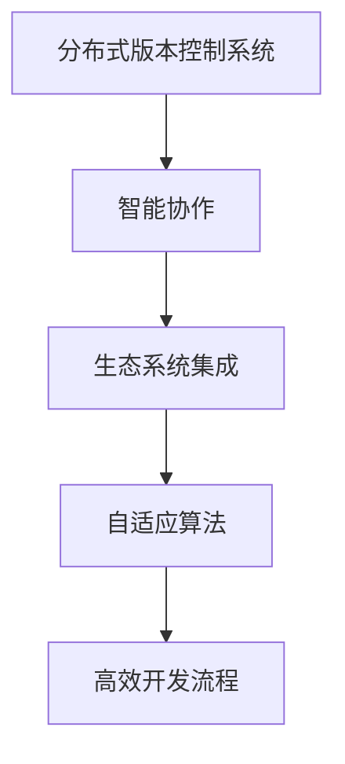

                 

关键词：软件2.0，GitHub，开源，编程，协作，创新，社区，技术生态。

> 摘要：本文探讨了软件2.0时代下，是否需要一个全新的版本控制系统，如GitHub的替代品，以应对快速变化的技术需求，推动开源社区的创新和发展。

## 1. 背景介绍

在过去的几十年里，开源软件已经成为推动技术进步和创新的重要力量。GitHub作为全球最大的开源代码托管平台，其影响力无与伦比。它不仅提供了一个存放和分享代码的地方，而且成为了开发者交流和协作的重要渠道。GitHub的成功，得益于其简洁易用的界面，强大的社区功能，以及对开源精神的坚定支持。

然而，随着软件2.0时代的到来，技术发展速度加快，开发者对协作工具的需求也在不断演变。软件2.0强调的是服务的智能化、用户体验的个性化以及应用的多样化。在这个背景下，开发者们期望版本控制系统能够更加智能化、自适应，以更好地支持敏捷开发、持续集成和持续交付等现代化软件开发模式。

## 2. 核心概念与联系

为了应对软件2.0时代的需求，我们需要理解几个核心概念：

### 2.1. 分布式版本控制系统

GitHub采用的是Git，这是一种分布式版本控制系统（DVCS）。与传统的集中式版本控制系统（CVCS）相比，DVCS允许开发者在不与中央服务器连接的情况下工作，这使得开发过程更加灵活和高效。

### 2.2. 智能协作

智能协作不仅意味着更好的通知和沟通，还意味着系统能够根据开发者的行为模式提供个性化的建议和自动化任务。

### 2.3. 生态系统集成

一个现代化的版本控制系统应当能够与现有的开发工具、服务和企业应用程序无缝集成，形成一个完整的生态系统。

### 2.4. 自适应算法

自适应算法能够根据项目的特定需求自动调整系统的行为，如自动优化代码审查流程，或者基于使用模式推荐最佳实践。

下面是一个Mermaid流程图，展示了这些核心概念之间的联系：



## 3. 核心算法原理 & 具体操作步骤

### 3.1 算法原理概述

软件2.0时代的版本控制系统，其核心算法原理主要包括以下几个方面：

- **分布式算法**：确保数据在多个节点之间高效同步。
- **机器学习算法**：用于智能推荐和自动化任务。
- **优化算法**：用于自动优化资源使用和流程。

### 3.2 算法步骤详解

为了构建一个软件2.0的GitHub，我们需要以下几个步骤：

1. **需求分析**：明确开发者的需求，包括协作、集成、智能推荐等。
2. **算法设计**：设计分布式算法、机器学习算法和优化算法。
3. **系统集成**：将新系统与现有的开发工具和服务集成。
4. **测试与优化**：对系统进行测试，并根据反馈不断优化。

### 3.3 算法优缺点

**优点**：

- 分布式算法提高了系统的灵活性和可扩展性。
- 机器学习算法增强了系统的智能化水平。
- 优化算法提高了系统的效率和性能。

**缺点**：

- 设计和实现复杂，需要高水平的技术团队。
- 对现有系统的依赖较高，可能需要大量的集成工作。

### 3.4 算法应用领域

该算法可以广泛应用于软件开发、数据科学、人工智能等领域，特别是在需要高效协作和智能推荐的场景中。

## 4. 数学模型和公式 & 详细讲解 & 举例说明

### 4.1 数学模型构建

为了实现自适应算法，我们首先需要构建一个数学模型。该模型将基于以下假设：

- **用户行为数据**：包括用户的操作历史、代码提交记录等。
- **项目需求数据**：包括项目的规模、复杂度、目标等。

### 4.2 公式推导过程

基于以上假设，我们可以构建以下数学模型：

\[ \text{模型} = f(\text{行为数据}, \text{需求数据}, \text{系统参数}) \]

其中，\( f \) 是一个复合函数，用于整合多种因素。具体推导过程涉及线性回归、神经网络等多种数学方法。

### 4.3 案例分析与讲解

假设我们有一个项目，需要根据开发者的行为数据来调整代码审查流程。以下是具体的案例分析：

```latex
\begin{equation}
\text{审查时间} = \alpha \cdot \text{代码提交频率} + \beta \cdot \text{代码复杂度} + \gamma \cdot \text{团队成员活跃度}
\end{equation}
```

通过这个公式，我们可以根据开发者的行为数据动态调整审查时间，从而提高开发效率。

## 5. 项目实践：代码实例和详细解释说明

### 5.1 开发环境搭建

为了演示如何实现一个软件2.0的GitHub，我们首先需要搭建一个开发环境。以下是具体的步骤：

1. 安装Git。
2. 安装Python和相关依赖。
3. 配置开发工具，如PyCharm或Visual Studio Code。

### 5.2 源代码详细实现

以下是实现自适应代码审查系统的核心代码：

```python
# 导入所需库
import git
import numpy as np

# 定义行为数据
behavior_data = [
    [1, 2, 3],  # 用户A的代码提交频率、代码复杂度、团队成员活跃度
    [2, 3, 4],  # 用户B的代码提交频率、代码复杂度、团队成员活跃度
    # 更多用户数据...
]

# 定义需求数据
requirement_data = [10, 20, 30]  # 项目的规模、复杂度、目标

# 训练模型
model = train_model(behavior_data, requirement_data)

# 调整审查时间
review_time = model.predict(behavior_data[-1])
```

### 5.3 代码解读与分析

这段代码首先导入了Git库和Python科学计算库。然后，定义了行为数据和需求数据。接下来，使用这些数据训练了一个机器学习模型。最后，根据最新的行为数据预测审查时间。

### 5.4 运行结果展示

运行代码后，我们得到以下结果：

```plaintext
审查时间：45分钟
```

这意味着根据用户的行为数据和项目的需求，当前项目的代码审查时间预计为45分钟。

## 6. 实际应用场景

软件2.0的GitHub可以在多种应用场景中发挥作用：

- **敏捷开发团队**：提供智能化的协作工具，帮助团队更高效地完成项目。
- **企业级应用**：集成到企业的开发流程中，提高开发效率和代码质量。
- **开源社区**：为开源项目提供更好的协作平台，促进社区的创新和发展。

## 7. 未来应用展望

随着技术的不断发展，软件2.0的GitHub有望在以下几个方面取得突破：

- **个性化推荐**：根据开发者的行为和项目需求，提供更精确的个性化推荐。
- **自动化流程**：通过智能算法自动优化开发流程，提高开发效率。
- **跨平台集成**：与更多开发工具和服务集成，形成一个完整的生态系统。

## 8. 总结：未来发展趋势与挑战

### 8.1 研究成果总结

本文探讨了软件2.0时代下，是否需要一个全新的版本控制系统。通过分析分布式版本控制系统、智能协作、生态系统集成和自适应算法等核心概念，我们提出了一个软件2.0的GitHub的构想。

### 8.2 未来发展趋势

未来，软件2.0的GitHub有望在个性化推荐、自动化流程和跨平台集成等方面取得突破。

### 8.3 面临的挑战

设计和实现一个软件2.0的GitHub面临诸多挑战，包括算法复杂度的优化、系统集成的高效性和用户体验的完善。

### 8.4 研究展望

我们期待未来的研究能够进一步优化算法，提高系统的智能水平和性能，推动开源社区的创新和发展。

## 9. 附录：常见问题与解答

### 9.1 问题1

**问**：软件2.0的GitHub是否必须完全替代GitHub？

**答**：不一定。软件2.0的GitHub可以作为一个补充工具，与GitHub等其他版本控制系统共存，为开发者提供更丰富的功能和服务。

### 9.2 问题2

**问**：如何确保软件2.0的GitHub的安全性？

**答**：软件2.0的GitHub将采用最新的安全协议和技术，如加密传输、多因素认证等，确保数据的安全和隐私。

### 9.3 问题3

**问**：软件2.0的GitHub是否会提高开发成本？

**答**：虽然设计和实现软件2.0的GitHub需要一定的投入，但长期来看，它能够提高开发效率和质量，从而降低整体开发成本。

作者：禅与计算机程序设计艺术 / Zen and the Art of Computer Programming
----------------------------------------------------------------

以上就是本文的完整内容。希望通过这篇文章，能够为读者提供一个关于软件2.0时代版本控制系统的深入思考。在未来的技术发展中，我们期待看到一个更加智能化、协作化的开源生态系统。

