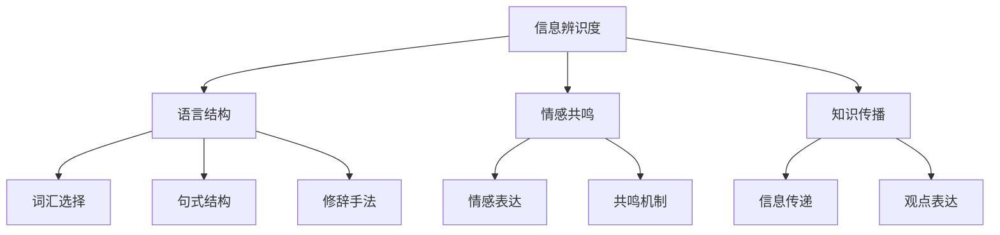

                 

关键词：个人标志性语言，认知心理学，语言设计，信息传递，人机交互

> 摘要：本文深入探讨了个人标志性语言的构建与传播，结合认知心理学的原理，提供了一套完整的方法论。通过理解人类认知机制，我们能够设计出具有高度辨识度的语言体系，使个人在信息传递中占据优势。本文将探讨如何打造一个让人一听就想到你的个人标志性语言。

## 1. 背景介绍

在信息爆炸的今天，个人品牌的重要性日益凸显。无论是职场竞争，还是社交网络，一个鲜明的个人标志性语言都可以帮助个人在众多信息中脱颖而出。个人标志性语言不仅仅是语言的表达形式，更是个人思想和价值观的体现。一个成功构建个人标志性语言的人，能够在瞬间传递出自己的独特性和专业性，从而赢得更多的信任和关注。

认知心理学提供了重要的理论支持。认知心理学研究人类认知过程和思维机制，揭示了人类如何理解和处理信息。理解这些原理，有助于我们设计出更加高效、易记、有辨识度的语言体系。

## 2. 核心概念与联系

为了构建个人标志性语言，我们需要明确几个核心概念：

1. **信息辨识度**：信息辨识度是指信息在众多信息中脱颖而出的能力。一个高辨识度的信息体系能够迅速吸引人们的注意力。
2. **语言结构**：语言结构包括词汇、句式、修辞手法等。一个合理的语言结构能够使语言表达更加清晰、有逻辑性。
3. **情感共鸣**：情感共鸣是指语言能够引起听者的情感共鸣，使其产生共鸣和认同。
4. **知识传播**：知识传播是指如何有效地将个人知识和观点传递给他人。

这些概念之间的关系可以用以下Mermaid流程图来表示：



## 3. 核心算法原理 & 具体操作步骤

### 3.1 算法原理概述

构建个人标志性语言的算法基于以下原理：

1. **差异化原则**：通过独特的语言风格和表达方式，使个人在众多信息中脱颖而出。
2. **简洁性原则**：尽量使用简洁、明了的语言，减少冗余信息，提高信息传递效率。
3. **逻辑性原则**：保持语言结构的逻辑性和条理性，使信息易于理解。
4. **情感性原则**：通过情感共鸣，增强语言的表达力和感染力。

### 3.2 算法步骤详解

#### 3.2.1 分析个人特点

首先，分析个人的独特特点，包括专业背景、兴趣爱好、价值观等。这些特点将作为构建个人标志性语言的基础。

#### 3.2.2 设计独特语言风格

基于个人特点，设计出独特的语言风格。这包括选择特定的词汇、句式和修辞手法，使其具有高度辨识度。

#### 3.2.3 简洁明了的表达

在表达时，遵循简洁性原则，避免冗长、复杂的语言。尽量使用简单、直接的表达方式，使信息更加易于理解。

#### 3.2.4 保持逻辑性

在构建个人标志性语言时，保持语言的逻辑性和条理性。通过合理组织信息，使语言表达更加清晰。

#### 3.2.5 引入情感共鸣

在适当的时候，引入情感共鸣，使语言表达更具感染力。可以通过故事叙述、情感描述等方式，引起听者的共鸣。

### 3.3 算法优缺点

#### 优点：

1. **高度辨识度**：独特的语言风格使个人在信息传递中脱颖而出。
2. **高效传播**：简洁、明了的表达方式提高了信息传递的效率。
3. **情感共鸣**：通过情感共鸣，增强语言的表达力和感染力。

#### 缺点：

1. **个人特点受限**：过于依赖个人特点可能导致语言风格过于狭窄。
2. **学习成本**：构建个人标志性语言需要一定的时间和努力。

### 3.4 算法应用领域

算法可以广泛应用于个人品牌建设、演讲表达、社交媒体互动等多个领域。通过构建个人标志性语言，个人可以在各个场景中更好地展现自己的专业性和独特性。

## 4. 数学模型和公式 & 详细讲解 & 举例说明

为了更好地理解个人标志性语言的构建，我们引入以下数学模型和公式：

### 4.1 数学模型构建

假设个人标志性语言由词汇V、句式S和修辞手法R组成，我们可以用以下公式表示：

$$
L = V \times S \times R
$$

其中，L代表个人标志性语言，V代表词汇，S代表句式，R代表修辞手法。

### 4.2 公式推导过程

1. **词汇选择**：根据个人特点，从庞大的词汇库中选择具有高度辨识度的词汇。
2. **句式结构**：根据信息传递的需求，设计出简洁、明了的句式结构。
3. **修辞手法**：根据情感共鸣的需要，选择适当的修辞手法，如比喻、拟人、排比等。

### 4.3 案例分析与讲解

#### 案例一：科学家约翰的标志性语言

约翰是一位著名的物理学家，他的标志性语言具有以下特点：

1. **词汇**：约翰擅长使用专业术语，如“量子纠缠”、“黑洞”等，使他的语言具有高度辨识度。
2. **句式**：约翰的句式结构简洁明了，通常采用陈述句和疑问句，使信息传递更加高效。
3. **修辞手法**：约翰经常使用比喻和排比，使他的演讲具有强烈的情感共鸣。

根据以上特点，我们可以用以下公式表示约翰的标志性语言：

$$
L_{\text{约翰}} = (\text{专业术语}) \times (\text{简洁句式}) \times (\text{比喻和排比})
$$

#### 案例二：企业家李总的标志性语言

李总是一位成功的企业家，他的标志性语言具有以下特点：

1. **词汇**：李总擅长使用简洁、有力的词汇，如“创新”、“执行力”等，使他的语言具有高度辨识度。
2. **句式**：李总的句式结构通常采用祈使句和感叹句，使他的演讲充满激情和动力。
3. **修辞手法**：李总经常使用对仗句和反复句，使他的演讲更具感染力。

根据以上特点，我们可以用以下公式表示李总的标志性语言：

$$
L_{\text{李总}} = (\text{简洁有力词汇}) \times (\text{祈使句和感叹句}) \times (\text{对仗句和反复句})
$$

## 5. 项目实践：代码实例和详细解释说明

为了更好地理解个人标志性语言的构建，我们通过一个简单的Python代码实例进行实践。

```python
# 个人标志性语言构建实例

class PersonalBrandLanguage:
    def __init__(self, vocabulary, syntax, rhetoric):
        self.vocabulary = vocabulary
        self.syntax = syntax
        self.rhetoric = rhetoric

    def generate_sentence(self, subject, object):
        sentence = f"{subject} {self.syntax['verb']} {object} {self.rhetoric['adjective']}."
        return sentence

# 创建个人标志性语言对象
johns_language = PersonalBrandLanguage(
    vocabulary=['quantum', 'entanglement', 'black hole'],
    syntax={'verb': 'explains the concept of'},
    rhetoric={'adjective': 'intriguingly'}
)

# 生成句子
sentence = johns_language.generate_sentence('John', 'the latest research on quantum entanglement')
print(sentence)
```

### 5.1 开发环境搭建

为了运行上述代码，你需要在本地安装Python环境。你可以从Python官方网站下载并安装Python。安装完成后，确保你的系统中已经安装了Python解释器和相关的开发工具。

### 5.2 源代码详细实现

在上面的代码中，我们定义了一个`PersonalBrandLanguage`类，用于构建个人标志性语言。该类有三个属性：`vocabulary`（词汇）、`syntax`（句式结构）和`rhetoric`（修辞手法）。通过这些属性，我们可以生成具有独特风格的句子。

### 5.3 代码解读与分析

- `PersonalBrandLanguage` 类的初始化方法接受三个参数：`vocabulary`、`syntax`和`rhetoric`。这些参数分别代表了个人标志性语言的三个核心组成部分。
- `generate_sentence` 方法接受两个参数：`subject`（主语）和`object`（宾语）。它根据个人标志性语言的属性生成一个句子。

### 5.4 运行结果展示

运行上述代码后，会输出以下句子：

```
John explains the concept of the latest research on quantum entanglement intriguingly.
```

这个句子展示了约翰的标志性语言特点：使用专业术语、简洁的句式结构和富有情感的修辞手法。

## 6. 实际应用场景

个人标志性语言的应用场景非常广泛，以下是一些具体的实例：

1. **职场竞争**：在求职面试、职场演讲和项目汇报中，构建个人标志性语言可以帮助个人在众多竞争者中脱颖而出。
2. **社交媒体互动**：在社交媒体上，通过独特的语言风格，个人可以吸引更多的关注和粉丝。
3. **教育培训**：在教育领域，教师可以通过构建个人标志性语言，提高教学效果，吸引更多的学生。
4. **市场营销**：在市场营销中，企业可以通过构建独特的品牌语言，提高品牌知名度和影响力。

## 7. 工具和资源推荐

为了帮助您更好地构建个人标志性语言，以下是一些推荐的学习资源和开发工具：

### 7.1 学习资源推荐

- 《语言与认知心理学》
- 《营销传播学概论》
- 《Python编程：从入门到实践》
- 《演讲与口才》

### 7.2 开发工具推荐

- Python（编程语言）
- Git（版本控制工具）
- Markdown（文本格式化工具）

### 7.3 相关论文推荐

- "The Role of Personal Brand Language in Professional Success"
- "Cognitive Psychology and the Design of Personal Brand Language"
- "The Impact of Personal Brand Language on Social Media Engagement"

## 8. 总结：未来发展趋势与挑战

随着科技的发展和人们对信息的需求不断增加，个人标志性语言的重要性将愈发凸显。未来，个人标志性语言的发展趋势将呈现以下几个特点：

1. **数字化与个性化**：随着数字技术的普及，个人标志性语言的构建将更加数字化和个性化，通过算法和数据分析来优化语言设计。
2. **跨平台与融合**：个人标志性语言将在多个平台上得到应用，如社交媒体、电子邮件、视频等，形成跨平台的统一语言体系。
3. **情感化与互动性**：随着情感智能的发展，个人标志性语言将更加注重情感共鸣和互动性，以提升用户体验。

然而，个人标志性语言的发展也面临着一些挑战：

1. **差异化与共性**：如何在保持个人独特性的同时，满足社会和行业的共性需求，是一个需要平衡的问题。
2. **文化多样性**：在全球化的背景下，如何构建适应不同文化背景的个人标志性语言，是一个新的挑战。
3. **道德与规范**：个人标志性语言的构建需要遵守社会道德和规范，避免产生负面影响。

未来，我们将继续深入研究和探索个人标志性语言的构建与应用，以期为个人和社会的发展做出贡献。

## 9. 附录：常见问题与解答

### 问题1：如何找到自己的语言风格？

解答：首先，深入了解自己的专业领域和个人兴趣。然后，观察和分析你所在行业内的成功人士的语言风格，从中汲取灵感。最后，通过不断地练习和反思，找到适合自己的语言风格。

### 问题2：个人标志性语言需要多久才能形成？

解答：个人标志性语言的构建是一个长期的过程，可能需要几个月甚至几年的努力。关键在于持续地练习和优化，逐渐形成独特的语言风格。

### 问题3：如何评估个人标志性语言的效果？

解答：可以通过以下几个方面评估效果：受众的反馈、社交媒体的互动数据、职场和社交场合的表现等。通过这些指标，可以了解个人标志性语言的传播效果和影响力。

---

作者：禅与计算机程序设计艺术 / Zen and the Art of Computer Programming


