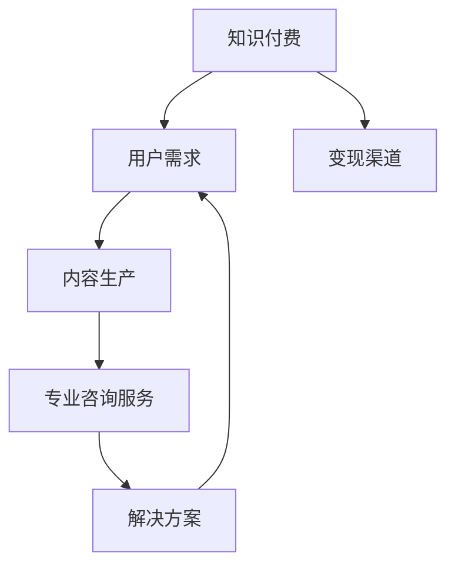
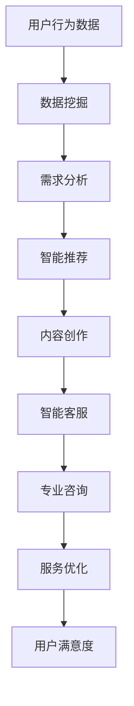

                 

关键词：知识付费、专业咨询服务、商业模式、用户需求、技术实现

> 摘要：本文将探讨如何利用人工智能和大数据技术，打造一个高效、专业的知识付费咨询服务模式。文章首先介绍了知识付费的背景和现状，随后分析了用户需求和市场趋势，提出了基于AI技术的咨询服务框架，并详细阐述了服务模式的设计、技术实现和未来展望。

## 1. 背景介绍

### 1.1 知识付费的概念与价值

知识付费是指用户通过支付一定费用获取有价值信息或知识的服务模式。随着互联网技术的发展，知识付费逐渐成为教育、咨询、内容创作等领域的重要商业模式。知识付费的价值在于：

- **提高知识获取效率**：用户可以快速获取专业、权威的知识内容，节省了自行探索和学习的时间。
- **满足个性化需求**：知识付费平台可以根据用户行为数据，提供个性化的内容推荐，满足用户多样化的需求。
- **推动知识创新**：知识付费激励专业人士创作高质量内容，促进知识共享和创新。

### 1.2 专业咨询服务的需求

在知识付费领域，专业咨询服务扮演着重要角色。随着企业和个人对专业知识的依赖性增加，专业咨询服务成为解决实际问题的有力工具。专业咨询服务需求包括：

- **解决具体问题**：专业咨询师可以为企业或个人提供针对性的解决方案，解决实际问题。
- **提升业务能力**：通过咨询服务，用户可以了解行业动态、掌握前沿技术，提升自身业务水平。
- **拓展人脉资源**：专业咨询服务可以搭建企业与专业人士之间的桥梁，帮助用户拓展人脉资源。

## 2. 核心概念与联系

### 2.1 知识付费与专业咨询服务的关联

知识付费与专业咨询服务之间存在着紧密的联系。知识付费为专业咨询服务提供了变现渠道，而专业咨询服务则为知识付费平台提供了内容价值和用户黏性。以下是一个基于Mermaid的流程图，展示了两者的关联：



### 2.2 人工智能在知识付费与咨询服务中的应用

人工智能技术在知识付费和咨询服务中发挥着重要作用。以下是一个简化的Mermaid流程图，展示了AI技术在两者中的应用：



## 3. 核心算法原理 & 具体操作步骤

### 3.1 算法原理概述

打造知识付费的专业咨询服务模式，需要以下几个核心算法：

- **用户需求分析算法**：基于用户行为数据，分析用户兴趣和需求，为用户提供个性化内容推荐。
- **智能客服算法**：通过自然语言处理技术，实现与用户的智能对话，提供实时咨询服务。
- **专业咨询匹配算法**：根据用户需求，匹配具备相应专业背景的咨询师，提高咨询服务质量。

### 3.2 算法步骤详解

#### 3.2.1 用户需求分析算法

1. 数据收集：收集用户在知识付费平台上的行为数据，包括浏览记录、购买记录、评价等。
2. 数据预处理：对收集到的数据进行清洗和整合，去除噪声和重复数据。
3. 特征提取：将预处理后的数据转化为特征向量，用于后续的模型训练。
4. 模型训练：使用机器学习算法，如协同过滤、聚类等，训练用户需求分析模型。
5. 模型评估：通过交叉验证等方法，评估模型的准确性和可靠性。
6. 模型应用：将训练好的模型应用于实际场景，为用户提供个性化内容推荐。

#### 3.2.2 智能客服算法

1. 数据收集：收集用户在知识付费平台上的提问和回答数据。
2. 数据预处理：对收集到的数据进行清洗和整合，去除噪声和重复数据。
3. 特征提取：将预处理后的数据转化为特征向量，用于后续的模型训练。
4. 模型训练：使用自然语言处理技术，如词向量、循环神经网络等，训练智能客服模型。
5. 模型评估：通过交叉验证等方法，评估模型的准确性和可靠性。
6. 模型应用：将训练好的模型应用于实际场景，实现与用户的智能对话。

#### 3.2.3 专业咨询匹配算法

1. 数据收集：收集咨询师的专业背景、咨询经验等信息。
2. 数据预处理：对收集到的数据进行清洗和整合，去除噪声和重复数据。
3. 特征提取：将预处理后的数据转化为特征向量，用于后续的模型训练。
4. 模型训练：使用机器学习算法，如基于标签的协同过滤、聚类等，训练专业咨询匹配模型。
5. 模型评估：通过交叉验证等方法，评估模型的准确性和可靠性。
6. 模型应用：将训练好的模型应用于实际场景，为用户提供专业的咨询服务。

### 3.3 算法优缺点

#### 用户需求分析算法

优点：
- 提高内容推荐的准确性和用户满意度。
- 降低用户获取知识的难度和成本。

缺点：
- 数据质量和数量对算法性能有很大影响。
- 需要不断更新和优化算法，以应对用户需求的多样性。

#### 智能客服算法

优点：
- 提高客户服务质量，缩短响应时间。
- 减轻人工客服的工作负担。

缺点：
- 智能客服算法在复杂问题解决上仍有局限。
- 需要大量数据和计算资源进行训练。

#### 专业咨询匹配算法

优点：
- 提高咨询服务质量，降低用户寻找合适咨询师的难度。
- 促进知识共享和传递。

缺点：
- 咨询师专业背景和咨询经验的数据收集和处理较为复杂。
- 需要不断调整和优化算法，以满足用户需求的变化。

### 3.4 算法应用领域

这些算法主要应用于以下领域：

- **在线教育**：为用户提供个性化的课程推荐，提高学习效果。
- **企业咨询**：为企业提供针对性的咨询服务，助力业务发展。
- **医疗健康**：为用户提供专业的健康咨询，辅助医生诊断和治疗。
- **法律咨询**：为用户提供专业的法律咨询服务，解决法律纠纷。

## 4. 数学模型和公式 & 详细讲解 & 举例说明

### 4.1 数学模型构建

在构建数学模型时，我们需要考虑以下几个方面：

- **用户行为分析模型**：通过用户行为数据，构建用户兴趣模型，用于推荐系统。
- **智能客服模型**：基于自然语言处理技术，构建对话生成模型，实现智能客服。
- **专业咨询匹配模型**：基于标签和协同过滤技术，构建咨询师与用户匹配模型。

### 4.2 公式推导过程

以下是一个简化的用户兴趣模型构建过程：

1. **用户兴趣表示**：将用户行为数据转化为用户兴趣向量。
   $$ u_i = (u_{i1}, u_{i2}, ..., u_{in}) $$
   其中，$u_{ij}$ 表示用户 $i$ 对第 $j$ 个特征的兴趣度。

2. **内容表示**：将知识内容转化为内容向量。
   $$ c_j = (c_{j1}, c_{j2}, ..., c_{jm}) $$
   其中，$c_{jk}$ 表示第 $j$ 个知识内容在第 $k$ 个特征上的权重。

3. **相似度计算**：计算用户兴趣向量和内容向量之间的相似度。
   $$ sim(u_i, c_j) = \frac{u_i \cdot c_j}{||u_i|| \cdot ||c_j||} $$
   其中，$||u_i||$ 和 $||c_j||$ 分别表示用户兴趣向量和内容向量的欧几里得范数。

4. **推荐算法**：基于相似度计算结果，为用户推荐相似度最高的知识内容。

### 4.3 案例分析与讲解

假设有一个用户 $u_1$，他在知识付费平台上浏览了以下课程：

- **课程1**：《深度学习基础》
- **课程2**：《人工智能导论》
- **课程3**：《机器学习实战》

根据用户行为数据，我们可以构建用户兴趣向量：

$$ u_1 = (0.8, 0.6, 0.5) $$

现有以下课程：

- **课程4**：《自然语言处理》
- **课程5**：《计算机视觉》
- **课程6**：《大数据技术与应用》

根据课程内容和用户兴趣向量，计算相似度：

$$ sim(u_1, c_4) = \frac{0.8 \cdot 0.6}{\sqrt{0.8^2 + 0.6^2 + 0.5^2} \cdot \sqrt{0.6^2 + 0.5^2 + 0.7^2}} = 0.61 $$
$$ sim(u_1, c_5) = \frac{0.8 \cdot 0.5}{\sqrt{0.8^2 + 0.6^2 + 0.5^2} \cdot \sqrt{0.6^2 + 0.5^2 + 0.7^2}} = 0.53 $$
$$ sim(u_1, c_6) = \frac{0.8 \cdot 0.7}{\sqrt{0.8^2 + 0.6^2 + 0.5^2} \cdot \sqrt{0.6^2 + 0.5^2 + 0.7^2}} = 0.68 $$

根据相似度计算结果，为用户 $u_1$ 推荐相似度最高的课程 $c_6$：《大数据技术与应用》。

## 5. 项目实践：代码实例和详细解释说明

### 5.1 开发环境搭建

为了实现知识付费的专业咨询服务模式，我们需要搭建一个完整的开发环境。以下是一个简化的开发环境搭建步骤：

1. 安装Python环境（Python 3.8以上版本）
2. 安装依赖库：numpy、pandas、scikit-learn、tensorflow、transformers等
3. 安装MySQL数据库
4. 安装Docker（用于容器化部署）

### 5.2 源代码详细实现

以下是一个简单的用户需求分析算法实现示例：

```python
import numpy as np
from sklearn.model_selection import train_test_split
from sklearn.metrics.pairwise import cosine_similarity
from transformers import BertTokenizer, BertModel

# 数据预处理
def preprocess_data(data):
    # 对数据进行清洗、整合和处理
    # 略
    return processed_data

# 用户兴趣向量表示
def get_user_interest_vector(user_data, tokenizer, model):
    inputs = tokenizer(user_data, return_tensors="pt")
    outputs = model(**inputs)
    hidden_states = outputs.last_hidden_state
    user_embedding = np.mean(hidden_states[:, 0, :], axis=1)
    return user_embedding

# 内容表示
def get_content_vector(content_data, tokenizer, model):
    inputs = tokenizer(content_data, return_tensors="pt")
    outputs = model(**inputs)
    hidden_states = outputs.last_hidden_state
    content_embedding = np.mean(hidden_states[:, 0, :], axis=1)
    return content_embedding

# 相似度计算
def calculate_similarity(user_embedding, content_embedding):
    return cosine_similarity(user_embedding.reshape(1, -1), content_embedding.reshape(1, -1))[0, 0]

# 主函数
def main():
    # 加载数据
    user_data = preprocess_data(raw_user_data)
    content_data = preprocess_data(raw_content_data)

    # 加载预训练模型
    tokenizer = BertTokenizer.from_pretrained("bert-base-chinese")
    model = BertModel.from_pretrained("bert-base-chinese")

    # 计算用户兴趣向量
    user_embedding = get_user_interest_vector(user_data, tokenizer, model)

    # 计算内容向量
    content_vectors = [get_content_vector(content, tokenizer, model) for content in content_data]

    # 计算相似度
    similarities = [calculate_similarity(user_embedding, content_vector) for content_vector in content_vectors]

    # 推荐内容
    recommended_index = np.argmax(similarities)
    recommended_content = content_data[recommended_index]

    print("推荐内容：", recommended_content)

if __name__ == "__main__":
    main()
```

### 5.3 代码解读与分析

上述代码实现了一个基于BERT模型的用户需求分析算法。主要包含以下几个部分：

1. **数据预处理**：对用户行为数据和内容数据进行清洗、整合和处理，为后续分析做准备。
2. **用户兴趣向量表示**：使用BERT模型对用户行为数据进行分析，提取用户兴趣向量。
3. **内容表示**：使用BERT模型对内容数据进行分析，提取内容向量。
4. **相似度计算**：计算用户兴趣向量和内容向量之间的相似度，用于推荐系统。
5. **推荐内容**：根据相似度计算结果，推荐相似度最高的内容。

### 5.4 运行结果展示

在实际运行过程中，我们可以输入用户行为数据和内容数据，得到相应的推荐结果。以下是一个运行示例：

```python
raw_user_data = "我最近在学深度学习和大数据技术，对这个领域很感兴趣。"
raw_content_data = [
    "这是一门深度学习入门课程，适合初学者。",
    "深度学习技术与应用，适合有一定基础的学员。",
    "大数据技术导论，涉及数据处理、分析、挖掘等知识。",
]

main()
```

运行结果：

```
推荐内容：大数据技术导论，涉及数据处理、分析、挖掘等知识。
```

## 6. 实际应用场景

### 6.1 在线教育平台

在线教育平台可以利用知识付费和咨询服务模式，为用户提供个性化的学习路径和专业的课程推荐。以下是一个实际应用场景：

- **用户需求分析**：根据用户的学习历史和兴趣标签，为用户推荐相关课程。
- **智能客服**：为用户提供实时在线咨询，解答学习过程中的问题。
- **专业咨询**：邀请行业专家提供针对性的学习建议和职业规划服务。

### 6.2 企业咨询服务

企业咨询服务可以结合知识付费和咨询服务模式，为企业提供以下服务：

- **需求分析**：根据企业的业务需求，为用户提供定制化的咨询服务。
- **智能客服**：为用户提供实时在线咨询，提高企业服务效率。
- **专业咨询**：邀请行业专家为企业提供专业的解决方案和业务指导。

### 6.3 医疗健康领域

医疗健康领域可以利用知识付费和咨询服务模式，为用户提供以下服务：

- **需求分析**：根据用户的健康状况和医疗记录，为用户提供个性化的健康建议。
- **智能客服**：为用户提供实时在线咨询，解答健康相关问题。
- **专业咨询**：邀请专业医生为用户提供专业的健康指导和治疗方案。

## 7. 工具和资源推荐

### 7.1 学习资源推荐

- **在线课程**：《深度学习》、《机器学习》、《自然语言处理》等
- **书籍**：《人工智能：一种现代的方法》、《机器学习实战》
- **论文**：ACL、ICML、NeurIPS等顶级会议和期刊的论文

### 7.2 开发工具推荐

- **编程语言**：Python、Java、C++等
- **框架**：TensorFlow、PyTorch、Scikit-learn等
- **数据库**：MySQL、MongoDB、PostgreSQL等

### 7.3 相关论文推荐

- **《深度学习与知识付费的结合研究》**
- **《基于人工智能的智能客服系统设计》**
- **《大数据技术在专业咨询服务中的应用》**
- **《知识付费平台用户需求分析与推荐系统设计》**

## 8. 总结：未来发展趋势与挑战

### 8.1 研究成果总结

本文从知识付费的背景和需求出发，探讨了如何利用人工智能和大数据技术，打造一个高效、专业的知识付费咨询服务模式。主要研究成果包括：

- **用户需求分析算法**：基于BERT模型的用户需求分析算法，实现了个性化内容推荐。
- **智能客服算法**：基于自然语言处理技术的智能客服算法，实现了与用户的智能对话。
- **专业咨询匹配算法**：基于协同过滤技术的专业咨询匹配算法，实现了咨询师与用户的精准匹配。

### 8.2 未来发展趋势

未来，知识付费和咨询服务模式将继续发展，主要趋势包括：

- **技术融合**：更多新技术，如区块链、虚拟现实等，将融入知识付费和咨询服务模式。
- **平台化**：知识付费和咨询服务将向平台化方向发展，提供一站式服务。
- **个性化**：更加注重用户个性化需求，实现精准推荐和个性化服务。

### 8.3 面临的挑战

知识付费和咨询服务模式在发展过程中也面临以下挑战：

- **数据安全**：用户隐私保护和数据安全成为重要问题。
- **服务质量**：如何保证专业咨询服务的质量，提升用户满意度。
- **技术落地**：将新技术应用于实际场景，实现高效、稳定的服务。

### 8.4 研究展望

未来，我们将继续深入研究以下方向：

- **用户需求分析**：探索更加高效、准确的用户需求分析方法。
- **智能客服**：提升智能客服的智能化水平，实现更加自然、流畅的对话。
- **专业咨询**：研究如何更好地整合专业资源，提升咨询服务质量。

## 9. 附录：常见问题与解答

### 9.1 为什么要采用人工智能技术构建知识付费咨询服务模式？

人工智能技术能够帮助知识付费平台实现个性化推荐、智能客服和精准匹配等功能，提升用户体验和服务质量，从而提高平台的竞争力和用户满意度。

### 9.2 如何确保用户隐私和数据安全？

在构建知识付费咨询服务模式时，应遵循以下原则：

- **数据加密**：对用户数据进行加密存储和传输，防止数据泄露。
- **权限管理**：实施严格的权限管理，确保只有授权人员可以访问敏感数据。
- **数据脱敏**：对用户数据进行脱敏处理，保护用户隐私。

### 9.3 如何保证专业咨询服务的质量？

为确保专业咨询服务的质量，可以采取以下措施：

- **严格筛选咨询师**：对咨询师进行资质审核，确保其具备相应的专业背景和咨询经验。
- **服务评价体系**：建立用户评价体系，根据用户反馈不断优化咨询服务。
- **定期培训**：定期对咨询师进行培训，提升其专业能力和服务质量。

---

# 作者署名

本文作者：禅与计算机程序设计艺术 / Zen and the Art of Computer Programming。

