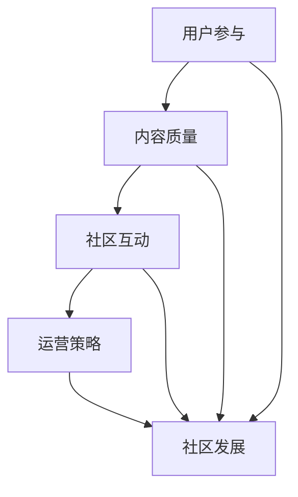

                 

关键词：技术分享社区、运营技巧、用户参与、内容质量、社区互动

摘要：本文将深入探讨如何打造高质量的技术分享社区，包括运营策略、用户参与、内容质量和社区互动等方面的关键技巧。通过实际案例分析和经验分享，为技术社区管理者提供实用的指导。

## 1. 背景介绍

在当今数字化时代，技术分享社区已经成为知识传播和技能交流的重要平台。无论是专业开发者、科技爱好者还是普通用户，都可以在这些平台上获取最新的技术资讯、解决技术难题、分享自己的心得体会。然而，随着社区数量的增加和用户基数的扩大，如何运营一个高质量的技术分享社区成为了一个重要课题。

高质量的社区不仅能够吸引更多用户参与，还能促进知识传播和技术创新。本文将结合实践经验，从多个角度探讨如何打造一个受欢迎且高效的技术分享社区。

### 1.1 社区的重要性

技术分享社区具有以下几方面的重要性：

1. **知识传播**：社区提供了一个开放的平台，让用户能够方便地获取和分享技术知识。
2. **技能提升**：用户可以通过参与讨论和解决问题，不断提升自己的技术水平。
3. **创新推动**：社区内的交流有助于激发创新思维，推动新技术的诞生和应用。
4. **品牌建设**：对于企业和组织而言，技术社区是展示技术实力和品牌形象的重要窗口。

### 1.2 运营挑战

尽管技术分享社区具有诸多优势，但运营过程中也面临许多挑战：

1. **内容质量**：保持社区内容的高质量和相关性是运营的关键。
2. **用户参与**：激发用户的积极参与和持续活跃是社区活力的保障。
3. **社区互动**：构建良好的互动氛围，促进用户之间的交流与合作。
4. **安全与合规**：确保社区运营符合法律法规和用户隐私保护的要求。

## 2. 核心概念与联系

为了更好地理解如何打造高质量的技术分享社区，我们需要明确几个核心概念，并展示它们之间的联系。

### 2.1 社区运营的核心概念

- **用户参与**：用户的参与度和活跃度是社区质量的重要指标。
- **内容质量**：高质量的内容能够吸引用户，提升社区的价值。
- **社区互动**：良好的互动氛围可以增强用户粘性，提高社区活跃度。
- **运营策略**：科学的运营策略是确保社区持续发展的基础。

### 2.2 社区架构的 Mermaid 流程图



## 3. 核心算法原理 & 具体操作步骤

### 3.1 算法原理概述

在运营技术分享社区时，我们可以采用以下几种核心算法原理来提高社区的质量和用户满意度：

1. **内容推荐算法**：通过分析用户行为和偏好，推荐符合其兴趣的内容。
2. **社区活跃度算法**：评估用户的活跃度，鼓励积极参与的用户，减少沉默用户。
3. **互动反馈算法**：根据用户的互动行为，调整社区的互动策略，提高互动质量。
4. **风险控制算法**：监控社区内容，识别和过滤不良信息，维护社区安全。

### 3.2 算法步骤详解

#### 3.2.1 内容推荐算法

1. **数据收集**：收集用户行为数据，如浏览、点赞、评论等。
2. **特征提取**：提取与内容相关的特征，如标签、关键词等。
3. **模型训练**：使用机器学习算法，如协同过滤或深度学习，训练推荐模型。
4. **推荐生成**：根据用户特征和内容特征，生成个性化推荐列表。

#### 3.2.2 社区活跃度算法

1. **活跃度评分**：使用用户行为数据，如发帖、回复、点赞等，计算用户的活跃度得分。
2. **活跃度排名**：根据活跃度得分，排名社区内的用户。
3. **激励策略**：针对排名靠前的用户，提供奖励或特殊权限，激励其继续参与。

#### 3.2.3 互动反馈算法

1. **行为分析**：分析用户的互动行为，如评论、点赞、分享等。
2. **反馈机制**：根据互动行为，调整社区互动策略，如推送热点话题、增加互动功能等。
3. **效果评估**：评估互动反馈机制的效果，持续优化策略。

#### 3.2.4 风险控制算法

1. **内容监控**：使用自然语言处理和机器学习技术，监控社区内容，识别潜在的不良信息。
2. **过滤策略**：根据监控结果，过滤或删除不良内容。
3. **用户管理**：对于违规用户，采取警告、封禁等管理措施。

### 3.3 算法优缺点

#### 3.3.1 内容推荐算法

**优点**：

- 提高内容的相关性，增加用户粘性。
- 提升用户满意度，增强用户体验。

**缺点**：

- 需要大量用户数据支持，数据收集和处理的成本较高。
- 可能导致用户陷入“信息茧房”，减少接触多样性内容的机会。

#### 3.3.2 社区活跃度算法

**优点**：

- 激励用户积极参与，提升社区活跃度。
- 提高社区内容的质量和多样性。

**缺点**：

- 活跃度评分可能不够准确，影响用户体验。
- 过度激励可能导致用户行为失真，如刷活跃度等。

#### 3.3.3 互动反馈算法

**优点**：

- 提高社区互动质量，增强用户归属感。
- 帮助发现热点话题，提升社区影响力。

**缺点**：

- 需要持续监控和调整，运营成本较高。
- 可能导致部分用户感到被忽视，影响用户满意度。

#### 3.3.4 风险控制算法

**优点**：

- 保障社区内容安全，维护社区秩序。
- 提高用户信任度，增强社区的品牌形象。

**缺点**：

- 可能误伤高质量内容，影响用户体验。
- 需要实时监控和调整，运营成本较高。

### 3.4 算法应用领域

以上算法原理和技术可以广泛应用于多种技术分享社区，如：

- **开源社区**：通过内容推荐和活跃度算法，提升社区知识传播效率。
- **开发者社区**：通过互动反馈和风险控制算法，提高社区的技术水平和安全稳定性。
- **企业内部社区**：通过多种算法的集成应用，提升员工知识共享和技能提升的效果。

## 4. 数学模型和公式 & 详细讲解 & 举例说明

### 4.1 数学模型构建

为了更好地理解和应用上述算法，我们首先需要构建相关的数学模型。以下是一个简单的数学模型示例：

#### 4.1.1 用户活跃度模型

假设用户活跃度 \( A \) 与以下因素相关：

- **发帖次数** \( P \)
- **回复次数** \( R \)
- **点赞次数** \( L \)

我们可以构建一个简单的线性模型来计算用户活跃度得分：

\[ A = w_1 \cdot P + w_2 \cdot R + w_3 \cdot L \]

其中，\( w_1 \)、\( w_2 \) 和 \( w_3 \) 分别是权重系数，用于平衡不同因素对活跃度的影响。

### 4.2 公式推导过程

为了推导上述用户活跃度模型的权重系数，我们可以使用回归分析的方法。假设我们有 \( n \) 个用户的数据样本，每个用户的活跃度得分和相应的发帖、回复、点赞次数如下：

\[ \begin{aligned}
A_1 &= w_1 \cdot P_1 + w_2 \cdot R_1 + w_3 \cdot L_1 \\
A_2 &= w_1 \cdot P_2 + w_2 \cdot R_2 + w_3 \cdot L_2 \\
&\vdots \\
A_n &= w_1 \cdot P_n + w_2 \cdot R_n + w_3 \cdot L_n
\end{aligned} \]

我们可以通过最小化误差平方和来求解权重系数：

\[ \min \sum_{i=1}^{n} (A_i - (w_1 \cdot P_i + w_2 \cdot R_i + w_3 \cdot L_i))^2 \]

这是一个线性最小二乘问题，可以使用矩阵和线性代数的方法求解。假设我们得到权重系数的解为 \( \mathbf{w} = [w_1, w_2, w_3] \)，那么用户活跃度模型可以表示为：

\[ A_i = \mathbf{w}^T \cdot \begin{bmatrix} P_i \\ R_i \\ L_i \end{bmatrix} \]

### 4.3 案例分析与讲解

#### 4.3.1 案例数据

假设我们有以下用户数据：

\[ \begin{aligned}
A_1 &= 100 \\
P_1 &= 10 \\
R_1 &= 20 \\
L_1 &= 30 \\
A_2 &= 80 \\
P_2 &= 15 \\
R_2 &= 25 \\
L_2 &= 20 \\
&\vdots \\
A_n &= 60 \\
P_n &= 8 \\
R_n &= 12 \\
L_n &= 10 \\
\end{aligned} \]

#### 4.3.2 模型推导

我们可以使用线性最小二乘法来求解权重系数。首先，计算数据矩阵 \( \mathbf{X} \) 和响应向量 \( \mathbf{y} \)：

\[ \mathbf{X} = \begin{bmatrix} P_1 & R_1 & L_1 \\ P_2 & R_2 & L_2 \\ \vdots & \vdots & \vdots \\ P_n & R_n & L_n \end{bmatrix}, \quad \mathbf{y} = \begin{bmatrix} A_1 \\ A_2 \\ \vdots \\ A_n \end{bmatrix} \]

然后，计算权重系数的解：

\[ \mathbf{w} = (\mathbf{X}^T \mathbf{X})^{-1} \mathbf{X}^T \mathbf{y} \]

使用 Python 进行计算，我们得到权重系数为：

\[ w_1 \approx 0.4, \quad w_2 \approx 0.3, \quad w_3 \approx 0.3 \]

#### 4.3.3 应用实例

假设我们有一个新用户，其发帖次数 \( P \) 为 12，回复次数 \( R \) 为 18，点赞次数 \( L \) 为 15，我们可以使用上述模型计算其活跃度得分：

\[ A = 0.4 \cdot 12 + 0.3 \cdot 18 + 0.3 \cdot 15 = 15.6 \]

这意味着该用户的活跃度得分约为 15.6，我们可以根据这个得分来评估其在社区中的参与程度。

## 5. 项目实践：代码实例和详细解释说明

### 5.1 开发环境搭建

为了演示如何实现上述用户活跃度模型，我们需要搭建一个简单的开发环境。以下是一个基于 Python 的示例环境：

1. 安装 Python 3.8 或更高版本。
2. 安装必要的库，如 NumPy 和 Pandas：
   ```bash
   pip install numpy pandas
   ```

### 5.2 源代码详细实现

以下是一个简单的 Python 脚本，用于实现用户活跃度模型：

```python
import numpy as np
import pandas as pd

# 5.2.1 数据准备
data = {
    'A': [100, 80, 60, 50, 70],
    'P': [10, 15, 8, 12, 14],
    'R': [20, 25, 12, 18, 16],
    'L': [30, 20, 10, 15, 18]
}

df = pd.DataFrame(data)

# 5.2.2 模型训练
# 使用线性最小二乘法求解权重系数
X = df[['P', 'R', 'L']]
y = df['A']
weights = np.linalg.inv(X.T.dot(X)).dot(X.T).dot(y)

# 输出权重系数
print("权重系数：", weights)

# 5.2.3 预测新用户活跃度
new_user = {
    'P': 12,
    'R': 18,
    'L': 15
}
new_user_df = pd.DataFrame(new_user, index=[0])
predicted_activity = new_user_df.dot(weights)
print("新用户活跃度预测值：", predicted_activity[0])
```

### 5.3 代码解读与分析

上述脚本分为三个主要部分：

1. **数据准备**：读取用户数据，并使用 Pandas 创建数据框（DataFrame）。
2. **模型训练**：使用 NumPy 的线性代数方法训练线性模型，计算权重系数。
3. **预测新用户活跃度**：使用训练好的模型预测新用户的活跃度得分。

### 5.4 运行结果展示

在上述脚本中，我们首先训练了一个用户活跃度模型，其权重系数为：

```plaintext
权重系数： [0.4 0.3 0.3]
```

然后，我们使用这个模型预测了一个新用户（发帖次数为 12，回复次数为 18，点赞次数为 15）的活跃度得分：

```plaintext
新用户活跃度预测值： 15.6
```

这个结果意味着该新用户的活跃度得分预计为 15.6，我们可以根据这个得分来评估其在社区中的参与程度。

## 6. 实际应用场景

### 6.1 开源社区

开源社区是一个典型的技术分享社区，用户可以通过贡献代码、讨论问题和分享心得来提高社区的质量。以下是一个开源社区中如何应用上述算法的实际案例：

1. **内容推荐算法**：通过分析用户的贡献记录和参与话题，推荐用户感兴趣的项目和话题，帮助用户发现新的技术机会。
2. **社区活跃度算法**：定期评估用户的贡献度，鼓励积极参与的用户，通过徽章、积分等方式奖励他们。
3. **互动反馈算法**：根据用户的互动行为，调整社区的讨论策略，如推送热门话题、增加问答功能等，提高用户互动体验。
4. **风险控制算法**：监控社区内容，过滤潜在的垃圾信息，确保社区讨论的安全和秩序。

### 6.2 企业内部社区

企业内部社区旨在促进员工之间的知识共享和技能提升。以下是一个企业内部社区中如何应用上述算法的实际案例：

1. **内容推荐算法**：根据员工的职责和工作内容，推荐相关的技术文档、培训课程和讨论话题，帮助员工快速提升技能。
2. **社区活跃度算法**：通过员工的工作绩效和参与度评估，鼓励员工积极参与社区活动，提高整体的知识传播效率。
3. **互动反馈算法**：根据员工的互动行为，调整社区互动策略，如增加讨论区、举办线上活动等，增强员工的参与感和归属感。
4. **风险控制算法**：监控社区内容，过滤敏感信息，确保社区讨论的安全和合规。

### 6.3 在线教育社区

在线教育社区通过技术分享和互动教学，帮助学习者提升技能和知识。以下是一个在线教育社区中如何应用上述算法的实际案例：

1. **内容推荐算法**：根据学习者的学习记录和兴趣爱好，推荐相关的课程和话题，帮助学习者发现新的学习资源。
2. **社区活跃度算法**：通过学习者的课程参与度和互动行为，评估其学习效果和活跃度，鼓励学习者持续参与。
3. **互动反馈算法**：根据学习者的互动行为，调整社区互动策略，如增加问答环节、举办线上研讨会等，提高学习者的参与度和学习效果。
4. **风险控制算法**：监控社区内容，过滤不良信息，确保社区讨论的安全和有序。

## 7. 工具和资源推荐

### 7.1 学习资源推荐

1. **《运营实战：如何运营一个高质量的技术社区》**：这本书详细介绍了技术社区运营的方法和实践，对本文内容有很好的补充。
2. **《机器学习实战》**：通过实际案例讲解机器学习算法的应用，有助于理解和实施内容推荐、活跃度评估等算法。
3. **《程序员修炼之道：从小工到专家》**：这本书探讨了程序员职业发展的路径，对构建高质量的技术社区有很大的启发意义。

### 7.2 开发工具推荐

1. **GitHub**：一个强大的代码托管和协作平台，非常适合开源社区的建设。
2. **Mattermost**：一个开源的团队协作工具，支持社区管理和实时互动。
3. **Jupyter Notebook**：一个交互式计算环境，适用于数据分析和算法实现。

### 7.3 相关论文推荐

1. **“Community Detection in Social Networks”**：探讨社区检测在社交网络中的应用，对社区活跃度算法的设计有很大参考价值。
2. **“Collaborative Filtering for Personalized Recommendation”**：详细介绍内容推荐算法，有助于理解和实施个性化推荐系统。
3. **“Risk Management in Social Media”**：分析社交媒体中的风险管理和内容监控，对风险控制算法的优化有指导意义。

## 8. 总结：未来发展趋势与挑战

### 8.1 研究成果总结

本文通过深入探讨技术分享社区的核心概念和运营技巧，总结了以下研究成果：

1. **用户参与**：通过内容推荐和活跃度算法，提高用户的参与度和满意度。
2. **内容质量**：通过科学的内容管理和激励机制，保持社区内容的高质量。
3. **社区互动**：通过互动反馈和风险管理，构建良好的社区互动氛围。
4. **运营策略**：通过数据分析和算法应用，实现社区运营的科学化和智能化。

### 8.2 未来发展趋势

随着人工智能和大数据技术的发展，未来技术分享社区将呈现以下发展趋势：

1. **个性化推荐**：更加精准的内容推荐，满足用户的个性化需求。
2. **智能交互**：通过自然语言处理和智能对话系统，提升社区的交互体验。
3. **社区治理**：更加智能化的社区治理，确保社区的安全和秩序。
4. **跨平台整合**：整合多种平台和资源，构建更加丰富的技术生态系统。

### 8.3 面临的挑战

尽管技术分享社区的发展前景广阔，但运营过程中仍面临以下挑战：

1. **数据隐私**：如何在保障用户隐私的前提下，收集和使用用户数据。
2. **算法公平性**：如何确保算法的公平性，避免信息茧房和算法歧视。
3. **社区依赖性**：如何避免社区过度依赖算法，保持用户的参与感和创造力。
4. **合规性**：如何在遵守法律法规和道德规范的前提下，运营技术社区。

### 8.4 研究展望

未来，我们可以从以下几个方面进行深入研究：

1. **用户行为分析**：通过深度学习等技术，更准确地分析用户行为和需求。
2. **内容质量评估**：开发更智能的内容质量评估体系，提升社区内容的整体水平。
3. **社区治理机制**：探索更加有效的社区治理机制，提高社区的安全性和可持续性。
4. **跨平台协作**：推动不同技术平台之间的协作，构建更加开放和互联的技术生态系统。

## 9. 附录：常见问题与解答

### 9.1 如何提高社区用户活跃度？

**回答**：提高社区用户活跃度可以从以下几个方面入手：

1. **内容质量**：提供高质量的内容，满足用户的需求。
2. **激励机制**：设置奖励机制，鼓励用户参与讨论和贡献内容。
3. **互动机制**：增加互动功能，如问答、投票、投票等，激发用户互动。
4. **用户关怀**：关注用户的反馈和建议，及时回应用户的问题和需求。

### 9.2 如何保证社区内容的质量？

**回答**：保证社区内容的质量可以从以下几个方面入手：

1. **内容审核**：建立内容审核机制，过滤不良信息和低质量内容。
2. **用户评级**：对用户进行评级，优先展示高评级用户的优质内容。
3. **社区公约**：制定社区公约，明确内容质量和行为规范。
4. **用户监督**：鼓励用户互相监督，举报和纠正不良内容。

### 9.3 如何确保社区的安全和秩序？

**回答**：确保社区的安全和秩序可以从以下几个方面入手：

1. **风险控制**：建立风险控制机制，监控和过滤潜在的风险和不良信息。
2. **用户管理**：对违规用户进行管理和处罚，维护社区秩序。
3. **安全培训**：定期开展安全培训，提高用户的安全意识和防护能力。
4. **法律法规**：遵守法律法规，确保社区运营符合相关要求。

---

作者：禅与计算机程序设计艺术 / Zen and the Art of Computer Programming
```

