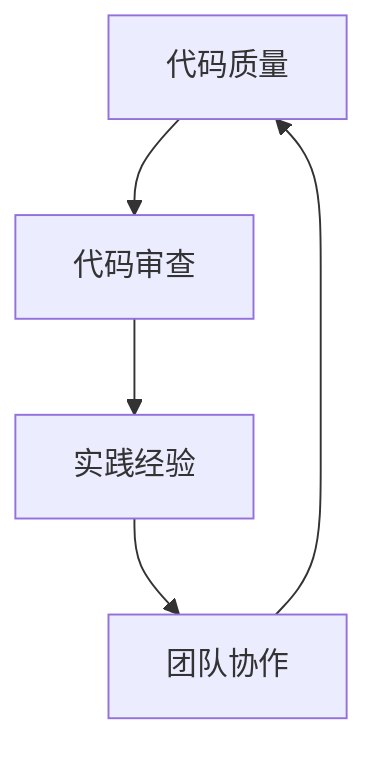

                 

在当今快速发展的技术世界中，程序员的专业成长成为了关键因素。如何有效地加速程序员的学习过程，提高他们的技术水平，成为了企业和个人都面临的挑战。本文将探讨如何通过构建技术mentoring项目，实现程序员的快速成长。

## 文章关键词

- 技术mentoring
- 程序员成长
- 教学方法
- 代码质量
- 代码审查
- 实践经验
- 技术社区

## 文章摘要

本文将讨论如何通过技术mentoring项目，帮助程序员提升技能、优化代码、加强团队合作和提升问题解决能力。通过详细的分析和案例分析，本文旨在为企业和个人提供一套实用的成长加速方案。

## 1. 背景介绍

随着云计算、人工智能、大数据等技术的蓬勃发展，编程技能的需求不断增加。然而，程序员在快速变化的技术环境中如何保持竞争力，成为了亟需解决的问题。传统教学方法往往侧重于理论知识传授，而忽视了实践能力的培养。因此，构建一个以实践为核心的技术mentoring项目，显得尤为重要。

### 1.1 技术mentoring的概念

技术mentoring是指通过导师与学徒之间的互动，帮助学徒掌握技术知识和实践经验，提升解决问题的能力。在编程领域，技术mentoring不仅仅包括代码的编写，还包括代码审查、团队协作、项目管理等多个方面。

### 1.2 程序员成长的重要性

程序员的专业成长不仅仅是为了适应新技术，更是为了提高个人的市场竞争力。一个优秀的程序员不仅能够编写高质量的代码，还能有效地与他人合作，解决复杂的问题，这对企业和个人来说都是至关重要的。

## 2. 核心概念与联系

在构建技术mentoring项目时，我们需要关注几个核心概念，包括代码质量、代码审查、实践经验和团队协作。以下是一个简化的Mermaid流程图，展示了这些概念之间的联系。



### 2.1 代码质量

代码质量是程序员成长的基础。高质量的代码不仅易于维护，还能提高开发效率。代码质量包括代码的可读性、可靠性、可扩展性等多个方面。

### 2.2 代码审查

代码审查是提高代码质量的重要手段。通过代码审查，导师可以指导学徒发现并改正代码中的问题，提高代码的整体质量。

### 2.3 实践经验

实践经验是程序员成长的必经之路。通过实际项目的开发，程序员可以积累经验，提高解决问题的能力。

### 2.4 团队协作

团队协作是现代软件开发的核心。通过团队合作，程序员可以学习如何与他人沟通、协调，提高项目开发效率。

## 3. 核心算法原理 & 具体操作步骤

### 3.1 算法原理概述

在技术mentoring项目中，我们可以采用一些经典的算法原理来指导学徒的学习。例如，动态规划、贪心算法、分治算法等。这些算法不仅有助于提升编程技能，还能培养问题解决能力。

### 3.2 算法步骤详解

以动态规划为例，以下是基本的算法步骤：

1. 确定问题的状态。
2. 确定状态的转移方程。
3. 确定初始状态和边界条件。
4. 利用状态转移方程求解问题。

### 3.3 算法优缺点

动态规划算法的优点在于能够将复杂的问题分解为更简单的子问题，从而降低计算的复杂度。然而，其缺点在于有时需要大量的存储空间，且编写代码较为复杂。

### 3.4 算法应用领域

动态规划算法广泛应用于字符串处理、背包问题、最长公共子序列等。在实际开发中，掌握动态规划算法对于解决复杂问题具有重要意义。

## 4. 数学模型和公式 & 详细讲解 & 举例说明

在技术mentoring项目中，数学模型和公式是解决问题的重要工具。以下是一个简单的数学模型和公式的示例。

### 4.1 数学模型构建

假设我们有一个背包问题，其中物品有价值和重量两个属性，背包有一个总容量。我们需要找出如何选择物品，使得总价值最大化，同时不超过背包的总容量。

### 4.2 公式推导过程

我们可以使用动态规划方法来解决这个问题。状态转移方程如下：

$$
f(i, j) = \begin{cases}
v_i & \text{if } i = 0 \text{ or } j = 0 \\
\max(f(i-1, j), f(i-1, j-w_i) + v_i) & \text{otherwise}
\end{cases}
$$

其中，$f(i, j)$ 表示背包容量为 $j$，选择前 $i$ 个物品的最大总价值。

### 4.3 案例分析与讲解

以下是一个背包问题的实例：

| 物品 | 价值 | 重量 |
| --- | --- | --- |
| 1 | 60 | 10 |
| 2 | 100 | 20 |
| 3 | 120 | 30 |
| 4 | 70 | 10 |

背包容量为 50。我们可以使用动态规划算法求解这个问题。

1. 确定状态：物品编号 $i$ 和背包容量 $j$。
2. 确定状态转移方程：根据上述公式。
3. 初始化边界条件：$f(0, 0) = 0$，$f(i, 0) = 0$，$f(0, j) = 0$。
4. 求解：根据状态转移方程，我们可以计算出所有可能的组合，并找出总价值最大的组合。

最终，我们得到最优解为选择物品 1、2 和 3，总价值为 280。

## 5. 项目实践：代码实例和详细解释说明

### 5.1 开发环境搭建

为了实践技术mentoring项目，我们首先需要搭建一个合适的开发环境。这里我们选择 Python 作为编程语言，并使用 PyCharm 作为开发工具。

### 5.2 源代码详细实现

以下是一个简单的背包问题求解器的源代码：

```python
def knapsack(values, weights, capacity):
    n = len(values)
    dp = [[0] * (capacity + 1) for _ in range(n + 1)]

    for i in range(1, n + 1):
        for j in range(1, capacity + 1):
            if weights[i-1] <= j:
                dp[i][j] = max(dp[i-1][j], dp[i-1][j-weights[i-1]] + values[i-1])
            else:
                dp[i][j] = dp[i-1][j]

    return dp[n][capacity]

values = [60, 100, 120, 70]
weights = [10, 20, 30, 10]
capacity = 50

print(knapsack(values, weights, capacity))
```

### 5.3 代码解读与分析

这段代码实现了一个简单的背包问题求解器。我们使用动态规划算法来计算最优解。代码的核心是状态转移方程的求解，以及边界条件的初始化。

### 5.4 运行结果展示

运行上述代码，我们得到最优解为 280。这意味着选择物品 1、2 和 3，总价值最大，同时不超过背包的总容量。

## 6. 实际应用场景

技术mentoring项目在实际应用中具有广泛的应用场景。以下是一些典型的应用场景：

- **企业内部培训**：企业可以通过技术mentoring项目，提升员工的编程技能和团队合作能力，从而提高整体竞争力。
- **个人成长计划**：个人可以通过技术mentoring项目，系统地学习编程知识，提升自己的技术水平，实现职业发展目标。
- **开源社区贡献**：开源社区可以通过技术mentoring项目，吸引更多新手参与，共同推动项目的发展。

## 7. 工具和资源推荐

为了更好地实施技术mentoring项目，以下是一些推荐的工具和资源：

- **开发工具**：PyCharm、Visual Studio Code、Git
- **学习资源**：Coursera、Udemy、edX
- **代码审查工具**：GitHub、GitLab、Bitbucket

## 8. 总结：未来发展趋势与挑战

技术mentoring项目在未来的发展中将面临以下几个挑战：

- **技术更新速度加快**：如何快速适应新技术，成为技术导师的重要任务。
- **个性化培训需求**：每个程序员的成长路径不同，如何提供个性化的培训方案，是技术mentoring项目需要考虑的问题。
- **团队协作挑战**：在远程工作越来越普遍的背景下，如何有效地进行团队协作，提高项目开发效率，是技术mentoring项目需要解决的问题。

然而，随着技术的不断进步和人们对于编程技能需求的增加，技术mentoring项目将越来越受到重视。通过有效的技术mentoring项目，程序员可以更快地成长，企业可以培养更多优秀的工程师，共同推动技术的发展。

## 9. 附录：常见问题与解答

### Q：技术mentoring项目需要哪些条件才能成功？

A：技术mentoring项目的成功取决于多个因素，包括导师的经验、学徒的学习热情、良好的沟通渠道和合适的培训材料。

### Q：如何评估学徒的学习效果？

A：通过定期的代码审查、项目报告和技能测试，导师可以评估学徒的学习效果。同时，学徒的自我反思和同伴之间的互评也是评估的重要手段。

### Q：技术mentoring项目对企业有哪些益处？

A：技术mentoring项目可以提高员工的技术水平，增强团队的凝聚力，提高项目开发效率，从而为企业带来实际的经济效益。

### Q：如何平衡导师的工作与指导任务？

A：企业可以通过合理的时间安排和任务分配，确保导师能够兼顾工作与指导任务。此外，建立一支导师团队，分担指导任务，也是一种有效的解决方案。

### Q：技术mentoring项目需要多长时间才能看到效果？

A：技术mentoring项目的效果因人而异，通常需要几个月到一年的周期。然而，通过持续的指导和支持，学徒可以逐步提升自己的技能水平。

---

作者：禅与计算机程序设计艺术 / Zen and the Art of Computer Programming

通过构建技术mentoring项目，我们可以有效地加速程序员的成长，提高他们的技术水平和解决问题的能力。本文探讨了技术mentoring项目的核心概念、算法原理、数学模型、项目实践和实际应用场景，并为读者提供了详细的指导和建议。希望本文能够为读者在技术成长的道路上提供一些启示和帮助。

