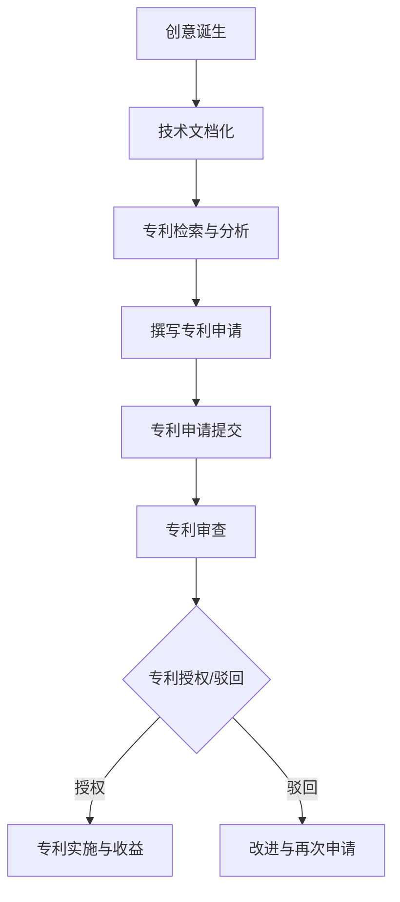

                 

 关键词：技术专利、程序员、创新、知识产权、经济价值

> 摘要：本文旨在探讨技术专利在程序员职业生涯中的重要性，分析其作为程序员隐藏财富的潜力，并通过具体案例展示如何利用专利挖掘和申请过程来提升个人价值和职业发展。

## 1. 背景介绍

随着信息技术的迅猛发展，软件开发和编程已经成为现代社会不可或缺的一部分。程序员群体在社会中的地位和影响力日益提升，他们的创造力和专业知识成为企业竞争力的核心要素。然而，除了代码本身，程序员在职业生涯中往往忽视了另一个重要方面——技术专利。

技术专利是一种知识产权，它赋予发明者在一定时间内对一项技术创新的独占权。在技术领域，专利不仅是一种法律保护，更是创造者智力成果和经济利益的象征。对于程序员来说，拥有专利意味着他们不仅能够保护自己的创新成果，还能够通过专利转让或授权获取额外的收入，从而实现个人财富的增值。

## 2. 核心概念与联系

### 2.1 技术专利的定义与特征

技术专利通常包括发明专利、实用新型专利和外观设计专利三种类型。其中，发明专利是最常见的一种，它保护的是技术方案，可以是一项新的方法、产品或改进。

### 2.2 程序员与专利的联系

程序员在软件开发过程中，可能会无意中创造出独特的算法、工具或方法。这些创新如果能够形成专利，将极大地提升程序员的个人价值和市场竞争力。

### 2.3 Mermaid 流程图

以下是一个简化的Mermaid流程图，展示了程序员如何从创新到专利申请的流程：



## 3. 核心算法原理 & 具体操作步骤

### 3.1 算法原理概述

技术专利的核心在于其创新性和实用性。程序员需要理解专利的基本原则，包括新颖性、创造性和实用性。新颖性指的是该技术在世界范围内未曾公开过；创造性是指该技术具有非显而易见性；实用性则要求该技术能够在产业中应用。

### 3.2 算法步骤详解

#### 3.2.1 专利检索与分析

在撰写专利申请之前，程序员需要进行专利检索，以了解现有技术的状况。这可以通过专利数据库进行，如Google Patents、美国专利商标局（USPTO）等。

#### 3.2.2 撰写专利申请

撰写专利申请文档需要详细描述技术创新点、技术背景、具体实施方式等。这里可以借助专业的专利撰写工具或寻求专利律师的帮助。

#### 3.2.3 专利申请提交

提交专利申请后，需要经过审查过程。审查包括形式审查和实质审查，审查员会评估专利申请的创新性和实用性。

#### 3.2.4 专利审查

审查过程可能涉及与审查员的沟通和修改，以使专利申请满足审查要求。

### 3.3 算法优缺点

#### 优点：

- 保护创新成果
- 增加知识产权价值
- 提升个人和企业的市场竞争力

#### 缺点：

- 申请过程复杂且耗时长
- 需要专业知识和资源支持

### 3.4 算法应用领域

技术专利广泛应用于软件开发、硬件设计、数据处理、人工智能等众多领域。特别是在快速发展的领域，如物联网、区块链和云计算，专利的重要性更加突出。

## 4. 数学模型和公式 & 详细讲解 & 举例说明

### 4.1 数学模型构建

技术专利的创新性通常可以通过数学模型来量化。例如，可以使用新颖性指数（IN）来衡量专利的创新程度：

$$
IN = \frac{N - D}{N + D}
$$

其中，N代表该专利公开的技术特征数量，D代表现有技术中相同特征的数量。

### 4.2 公式推导过程

新颖性指数的推导过程如下：

- N：该专利公开的技术特征数量
- D：现有技术中相同特征的数量
- 当N > D时，IN趋近于1，表示专利具有高度创新性；
- 当N < D时，IN趋近于-1，表示专利的创新性较低；
- 当N = D时，IN为0，表示专利与现有技术相当。

### 4.3 案例分析与讲解

以下是一个具体案例：

假设某程序员发明了一种新的加密算法，该算法在公开的专利数据库中未发现类似的技术。经过检索，该算法包含5个独特的特征，而现有技术中只有2个。则其新颖性指数为：

$$
IN = \frac{5 - 2}{5 + 2} = \frac{3}{7} \approx 0.429
$$

这表明该加密算法具有一定的创新性，但仍有改进的空间。

## 5. 项目实践：代码实例和详细解释说明

### 5.1 开发环境搭建

在撰写专利申请之前，程序员需要在合适的开发环境中实现技术创新。例如，可以选择Python或Java等编程语言，并使用相关的开发工具和框架。

### 5.2 源代码详细实现

以下是一个简化的Python示例，展示了如何实现一种新的加密算法：

```python
def encrypt(message, key):
    encrypted_message = ""
    for i in range(len(message)):
        encrypted_message += chr(ord(message[i]) + key)
    return encrypted_message

def decrypt(encrypted_message, key):
    message = ""
    for i in range(len(encrypted_message)):
        message += chr(ord(encrypted_message[i]) - key)
    return message
```

### 5.3 代码解读与分析

上述代码定义了两个函数：`encrypt` 和 `decrypt`。`encrypt` 函数使用给定的密钥将明文消息加密为密文，而 `decrypt` 函数则使用相同的密钥将密文解密为明文。

### 5.4 运行结果展示

以下是一个运行示例：

```python
message = "Hello, World!"
key = 3
encrypted_message = encrypt(message, key)
print(f"Encrypted Message: {encrypted_message}")
decrypted_message = decrypt(encrypted_message, key)
print(f"Decrypted Message: {decrypted_message}")
```

输出结果：

```
Encrypted Message: Khoor, Zruog!
Decrypted Message: Hello, World!
```

这表明加密和解密过程是成功的。

## 6. 实际应用场景

### 6.1 软件开发公司

软件开发公司在产品开发过程中，可以通过专利保护其核心技术，从而提升市场竞争力和商业价值。

### 6.2 创业公司

对于创业公司来说，拥有专利可以吸引投资，并为公司的知识产权估值提供支持。

### 6.3 个人开发者

个人开发者可以通过专利保护其创新成果，从而在求职或创业过程中增加竞争力。

### 6.4 未来应用展望

随着人工智能和物联网等技术的快速发展，技术专利将在未来发挥越来越重要的作用。程序员需要紧跟技术趋势，不断挖掘和申请专利，以实现个人价值和财富增值。

## 7. 工具和资源推荐

### 7.1 学习资源推荐

- 《专利法》
- 《专利申请实务》
- 《程序员知识产权保护指南》

### 7.2 开发工具推荐

- IntelliJ IDEA
- Eclipse
- PyCharm

### 7.3 相关论文推荐

- “专利分析在软件开发中的应用”
- “程序员如何撰写专利申请”
- “技术专利与软件开发实践”

## 8. 总结：未来发展趋势与挑战

### 8.1 研究成果总结

本文探讨了技术专利在程序员职业生涯中的重要性，分析了其作为程序员隐藏财富的潜力，并通过具体案例展示了如何利用专利挖掘和申请过程来提升个人价值和职业发展。

### 8.2 未来发展趋势

随着技术的不断进步，技术专利将在软件开发和编程领域发挥更加重要的作用。程序员需要关注新技术趋势，积极申请专利，以保护自己的创新成果。

### 8.3 面临的挑战

专利申请过程复杂且耗时长，程序员需要投入大量时间和精力。此外，专利保护的法律环境和国际竞争也日益激烈，程序员需要不断提高自己的专业素养和应对能力。

### 8.4 研究展望

未来，技术专利的研究将更加注重跨学科合作，结合人工智能和大数据分析等新技术，以提高专利挖掘和申请的效率。同时，程序员也需要加强自身的学习和创新能力，以应对不断变化的市场和技术环境。

## 9. 附录：常见问题与解答

### 9.1 专利申请流程是怎样的？

专利申请流程主要包括专利检索、撰写专利申请文件、提交申请、审查和授权等步骤。

### 9.2 专利申请需要哪些材料？

专利申请需要提供技术方案说明书、权利要求书、说明书附图等材料。

### 9.3 如何判断一个技术是否具有专利性？

判断技术是否具有专利性主要考虑新颖性、创造性和实用性。新颖性要求技术在世界范围内未曾公开过；创造性要求技术具有非显而易见性；实用性要求技术能够在产业中应用。

---

作者：禅与计算机程序设计艺术 / Zen and the Art of Computer Programming


