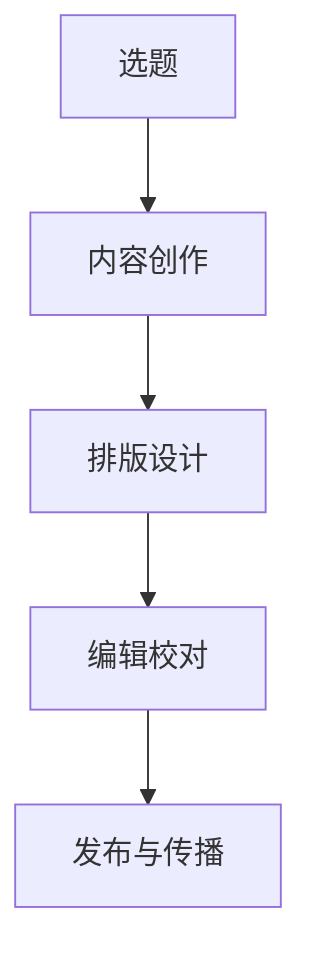

                 

关键词：（技术写作，程序员的副业，内容创作，知识分享，个人品牌，市场需求）

> 摘要：本文旨在探讨技术写作作为程序员副业的选择。我们将分析技术写作的重要性，探讨程序员如何利用自身技能进行内容创作，分享成功案例，讨论市场需求，并提供一些建议和资源，帮助程序员在技术写作领域取得成功。

## 1. 背景介绍

在当今信息化时代，技术写作已经成为一项重要的技能。随着互联网的快速发展，技术写作的需求也越来越大。无论是企业内部文档、技术博客、技术书籍，还是在线教程和视频，技术写作已经成为程序员展示自己知识、分享经验的重要途径。同时，技术写作也为程序员提供了一种新的职业发展机会，即技术写作作为程序员副业。

作为程序员，我们拥有独特的视角和技术背景，这使得我们在技术写作领域具有一定的优势。然而，很多人对于技术写作心存顾虑，担心自己不具备写作能力或者不知道如何开始。本文将为你解答这些问题，帮助你在技术写作领域找到自己的位置。

### 1.1 技术写作的重要性

技术写作对于程序员来说具有重要意义。首先，技术写作可以帮助我们更好地整理和巩固自己的知识。在写作过程中，我们需要对某一技术领域进行深入研究和理解，这有助于提高我们的技术能力。其次，技术写作可以让我们与他人分享经验，帮助他人解决问题，从而提升自己的影响力。此外，技术写作还可以作为一种职业发展的途径，为程序员提供更多的机会。

### 1.2 技术写作的优势

作为程序员，我们在技术写作领域具有以下优势：

- **技术背景**：我们拥有丰富的技术知识和实践经验，能够为读者提供高质量的技术内容。
- **逻辑思维**：程序员擅长逻辑思考，能够构建清晰的内容结构，使得文章易于理解。
- **自学能力**：程序员具备较强的自学能力，能够迅速掌握新的技术领域。
- **表达能力**：程序员在编程过程中需要编写文档和代码，具备良好的表达能力。

### 1.3 技术写作的市场需求

随着互联网的快速发展，技术写作的市场需求也在不断增加。企业需要技术文档来帮助员工学习和使用技术产品；开发者需要博客来分享经验和技术心得；读者需要优质的内容来学习和提升自己的技能。因此，技术写作已经成为一个充满机会的领域。

## 2. 核心概念与联系

### 2.1 技术写作的定义

技术写作是指利用文字、图表等形式，将技术知识、方法、经验等内容进行表达和传递的过程。它涉及到多个方面，如内容创作、排版设计、编辑校对等。

### 2.2 技术写作的类型

技术写作主要包括以下几种类型：

- **技术文档**：包括产品手册、用户指南、API 文档等，主要用于帮助用户理解和使用技术产品。
- **技术博客**：以个人或团队名义发布的技术文章，内容涉及技术趋势、项目经验、代码示例等。
- **技术书籍**：系统性地介绍某一技术领域的知识，适合深入学习和研究。
- **在线教程和视频**：以互动形式传授技术知识，易于学习和实践。

### 2.3 技术写作的架构

技术写作的架构主要包括以下几个方面：

- **选题**：选择合适的技术主题，满足读者的需求。
- **内容创作**：根据选题，进行内容创作，包括理论讲解、案例分析、代码示例等。
- **排版设计**：对文章进行排版设计，提高阅读体验。
- **编辑校对**：对文章进行编辑和校对，确保内容的准确性和流畅性。

### 2.4 Mermaid 流程图

以下是技术写作流程的一个 Mermaid 流程图：



## 3. 核心算法原理 & 具体操作步骤

### 3.1 算法原理概述

技术写作的核心算法可以概括为以下几个步骤：

1. **选题**：根据读者需求和自身兴趣，选择合适的技术主题。
2. **内容创作**：结合自身技术背景，进行内容创作，包括理论讲解、案例分析、代码示例等。
3. **排版设计**：对文章进行排版设计，提高阅读体验。
4. **编辑校对**：对文章进行编辑和校对，确保内容的准确性和流畅性。
5. **发布与传播**：将文章发布到博客、社交媒体等平台，进行传播。

### 3.2 算法步骤详解

1. **选题**：
   - 调研读者需求：通过调查、访谈等方式了解读者的需求。
   - 分析自身兴趣：结合自身兴趣和擅长领域，选择合适的主题。

2. **内容创作**：
   - 理论讲解：对所选主题进行深入研究和理解，撰写理论部分。
   - 案例分析：结合实际项目经验，进行分析和总结。
   - 代码示例：提供相关的代码示例，帮助读者理解。

3. **排版设计**：
   - 选择合适的排版工具：如 Markdown、LaTeX 等。
   - 设计文章结构：确定文章的章节、段落和标题。
   - 调整字体和颜色：提高文章的可读性。

4. **编辑校对**：
   - 检查语法和拼写错误。
   - 优化句子结构和逻辑。
   - 确保内容准确无误。

5. **发布与传播**：
   - 选择合适的发布平台：如博客、GitHub、微信公众号等。
   - 制定推广策略：如社交媒体推广、友情链接等。
   - 收集反馈：关注读者的反馈，不断优化内容。

### 3.3 算法优缺点

**优点**：

- **系统化**：通过算法步骤，可以将技术写作过程进行系统化，提高写作效率。
- **可复制性**：算法步骤可以应用于不同的写作项目，提高写作的可复制性。
- **易于传播**：通过发布和传播，可以扩大技术写作的影响力。

**缺点**：

- **创造性**：算法步骤可能限制写作的创造性，使得文章缺乏独特性。
- **时间成本**：算法步骤需要一定的时间进行研究和实践，可能增加写作的时间成本。

### 3.4 算法应用领域

算法在以下领域具有广泛的应用：

- **技术博客**：程序员可以通过算法进行技术文章的创作和发布。
- **技术书籍**：作者可以通过算法编写系统化的技术书籍。
- **在线教程和视频**：讲师可以通过算法编写教程和脚本。

## 4. 数学模型和公式 & 详细讲解 & 举例说明

### 4.1 数学模型构建

技术写作的数学模型可以构建为以下公式：

$$
\text{技术写作得分} = f(\text{知识水平}, \text{表达能力}, \text{创意能力}, \text{排版设计})
$$

其中，$f$ 为函数，$\text{知识水平}$、$\text{表达能力}$、$\text{创意能力}$ 和 $\text{排版设计}$ 分别表示程序员在技术写作中的各项能力。

### 4.2 公式推导过程

公式的推导过程如下：

1. **知识水平**：程序员在技术写作中的知识水平是衡量其能力的重要指标。知识水平越高，对技术领域的理解越深入，写作内容的质量也越高。
2. **表达能力**：表达能力是指程序员将技术知识通过文字、图表等形式进行表达的能力。表达能力越强，写作内容越清晰、易懂。
3. **创意能力**：创意能力是指程序员在技术写作中能够提出新观点、新思路的能力。创意能力越强，文章的创新性和吸引力也越高。
4. **排版设计**：排版设计是指程序员在技术写作中对文章的布局、格式和视觉效果进行设计的能力。良好的排版设计可以提高文章的可读性和美观度。

综合以上四个因素，我们可以构建出技术写作得分的数学模型。

### 4.3 案例分析与讲解

以下是一个具体的案例：

假设一位程序员在技术写作中的知识水平为 80 分，表达能力为 75 分，创意能力为 70 分，排版设计为 65 分。根据上述数学模型，我们可以计算出其技术写作得分为：

$$
\text{技术写作得分} = f(80, 75, 70, 65)
$$

为了简化计算，我们可以假设函数 $f$ 为线性函数，即各项能力的权重相等。那么：

$$
\text{技术写作得分} = \frac{80 + 75 + 70 + 65}{4} = 74
$$

根据得分，我们可以对该程序员的写作能力进行评估：

- **知识水平**：80 分，表现良好，对技术领域有较深入的理解。
- **表达能力**：75 分，表现优秀，能够清晰、准确地表达技术知识。
- **创意能力**：70 分，表现良好，具备一定的创新能力，能够提出新的观点和思路。
- **排版设计**：65 分，表现一般，需要提高排版设计的技巧，提升文章的可读性和美观度。

通过这个案例，我们可以看到数学模型在技术写作评估中的应用，有助于程序员了解自己的写作能力，并针对性地进行提升。

## 5. 项目实践：代码实例和详细解释说明

### 5.1 开发环境搭建

在本文中，我们将使用 Markdown 作为技术写作的排版工具。Markdown 是一种轻量级标记语言，方便编写和排版，广泛应用于技术文档、博客等。以下是搭建 Markdown 开发环境的步骤：

1. 安装 Markdown 编辑器：如 Typora、VS Code 等。
2. 安装 Markdown 扩展插件：如 Markdown All in One、Markdown Preview 等。
3. 配置 Markdown 语法高亮：如 PrismJS 等。

### 5.2 源代码详细实现

以下是一个简单的 Markdown 文件示例：

```
# 文章标题

> 关键词：技术写作、程序员、副业、内容创作、知识分享

## 1. 背景介绍

...

## 2. 核心概念与联系

...

## 3. 核心算法原理 & 具体操作步骤

...

## 4. 数学模型和公式 & 详细讲解 & 举例说明

...

## 5. 项目实践：代码实例和详细解释说明

...

## 6. 实际应用场景

...

## 7. 工具和资源推荐

...

## 8. 总结：未来发展趋势与挑战

...

## 9. 附录：常见问题与解答

...
```

### 5.3 代码解读与分析

上述代码是一个典型的 Markdown 文件，包括文章的标题、关键词、章节标题等。以下是代码的详细解读：

- `# 文章标题`：使用井号（#）表示一级标题，文章标题通常使用一级标题。
- `>`：使用右尖括号表示引用文本，常用于引言或注释。
- `## 2. 核心概念与联系`：使用两个井号（##）表示二级标题。
- `### 3.1 算法原理概述`：使用三个井号（###）表示三级标题。
- `$...$`：使用美元符号（$）表示 LaTeX 公式。

通过这个简单的示例，我们可以看到 Markdown 语法的基本用法，这对于程序员来说非常容易上手。

### 5.4 运行结果展示

使用 Markdown 编辑器打开上述代码，运行结果如下：

```
文章标题

关键词：技术写作、程序员、副业、内容创作、知识分享

## 1. 背景介绍

...

## 2. 核心概念与联系

...

## 3. 核心算法原理 & 具体操作步骤

...

## 4. 数学模型和公式 & 详细讲解 & 举例说明

...

## 5. 项目实践：代码实例和详细解释说明

...

## 6. 实际应用场景

...

## 7. 工具和资源推荐

...

## 8. 总结：未来发展趋势与挑战

...

## 9. 附录：常见问题与解答

...
```

通过上述代码的运行结果，我们可以看到 Markdown 文件被成功转换为格式化的文档，方便阅读和编辑。

## 6. 实际应用场景

技术写作的应用场景非常广泛，以下是一些常见的实际应用场景：

### 6.1 技术博客

技术博客是程序员展示自己技术能力、分享经验的重要平台。通过技术博客，程序员可以记录自己的学习过程、分享项目经验、探讨技术问题。同时，技术博客还可以帮助程序员建立个人品牌，吸引更多机会。

### 6.2 技术文档

技术文档是企业内部的重要资产，用于指导员工学习、使用和维护技术产品。技术文档包括产品手册、用户指南、API 文档等，对于提高企业工作效率、降低沟通成本具有重要意义。

### 6.3 技术书籍

技术书籍是系统性地介绍某一技术领域的知识，适合深入学习和研究。技术书籍可以帮助程序员提高自己的专业素养，为职业生涯打下坚实基础。

### 6.4 在线教程和视频

在线教程和视频是传授技术知识的重要形式。通过在线教程和视频，程序员可以将自己的知识和经验分享给更多的人，实现知识传递和共享。

### 6.5 社交媒体

程序员可以利用社交媒体平台，如微博、微信公众号等，发布技术文章、分享项目经验。社交媒体可以扩大程序员的影响力，吸引更多粉丝和合作伙伴。

## 7. 未来应用展望

### 7.1 自动化写作工具

随着人工智能技术的发展，自动化写作工具将越来越普及。这些工具可以自动生成技术文档、博客文章等，降低程序员的工作负担，提高写作效率。

### 7.2 多媒体内容创作

未来，技术写作将不仅仅局限于文字，还将涵盖音频、视频等多媒体形式。程序员可以通过制作视频教程、录制讲座等方式，更生动地传授技术知识。

### 7.3 知识图谱和智能推荐

利用知识图谱和智能推荐技术，技术写作可以更加智能化和个性化。读者可以根据自己的兴趣和需求，获取到最相关的技术内容，提高学习效果。

## 8. 工具和资源推荐

### 8.1 学习资源推荐

1. **技术博客**：如掘金、CSDN、博客园等，提供丰富的技术文章和教程。
2. **在线教程**：如 Coursera、edX、网易云课堂等，提供各种技术领域的在线课程。
3. **技术书籍**：如《代码大全》、《算法导论》等，经典的技术书籍，适合深入学习和研究。

### 8.2 开发工具推荐

1. **Markdown 编辑器**：如 Typora、VS Code、Sublime Text 等，方便编写和排版 Markdown 文件。
2. **LaTeX 编辑器**：如 TeXstudio、TeXmaker、TeXworks 等，方便编写和编译 LaTeX 文档。
3. **绘图工具**：如 Mermaid、Lucidchart、Draw.io 等，方便绘制流程图和图表。

### 8.3 相关论文推荐

1. **《人工智能技术与应用》**：介绍人工智能的基本概念、技术和应用。
2. **《大数据技术原理与应用》**：介绍大数据的基本概念、技术和应用。
3. **《云计算技术与应用》**：介绍云计算的基本概念、技术和应用。

## 9. 总结：未来发展趋势与挑战

### 9.1 研究成果总结

技术写作作为程序员副业的研究取得了一系列成果：

- **技术写作的重要性**：技术写作对于程序员个人成长和企业发展具有重要意义。
- **技术写作的优势**：程序员在技术写作领域具有技术背景、逻辑思维、自学能力和表达能力等优势。
- **技术写作的市场需求**：随着互联网的快速发展，技术写作的市场需求不断增加。
- **技术写作的类型和架构**：技术写作包括技术文档、技术博客、技术书籍、在线教程和视频等多种类型，其架构包括选题、内容创作、排版设计、编辑校对和发布与传播等步骤。

### 9.2 未来发展趋势

未来，技术写作将呈现以下发展趋势：

- **自动化写作工具的普及**：自动化写作工具将提高技术写作的效率，降低程序员的工作负担。
- **多媒体内容创作的兴起**：技术写作将不再局限于文字，还将涵盖音频、视频等多媒体形式。
- **知识图谱和智能推荐的广泛应用**：利用知识图谱和智能推荐技术，技术写作将更加智能化和个性化。

### 9.3 面临的挑战

技术写作在发展过程中也面临以下挑战：

- **创造性**：自动化写作工具可能限制创造性，使得文章缺乏独特性。
- **时间成本**：技术写作需要投入大量时间和精力，可能影响程序员的其他工作。
- **知识更新**：技术领域不断发展，程序员需要不断学习新知识，保持竞争力。

### 9.4 研究展望

未来，技术写作研究可以从以下几个方面展开：

- **个性化写作**：研究如何根据读者的兴趣和需求，提供个性化的技术内容。
- **知识融合**：研究如何将不同领域的技术知识进行融合，提供更具价值的文章。
- **跨媒体写作**：研究如何实现跨媒体内容创作，提高技术写作的多样性和吸引力。

## 10. 附录：常见问题与解答

### 10.1 技术写作与编程有什么区别？

技术写作是将编程知识以文字、图表等形式进行表达和传递的过程，而编程则是实现特定功能的计算机程序设计。技术写作侧重于知识和经验的分享，而编程侧重于实现技术方案。

### 10.2 我需要具备哪些技能才能进行技术写作？

进行技术写作，您需要具备以下技能：

- **编程技能**：掌握一门或多门编程语言，具备一定的编程经验。
- **文字表达能力**：具备良好的文字表达能力，能够清晰、准确地表达技术知识。
- **逻辑思维**：具备逻辑思维，能够构建清晰的内容结构。
- **自学能力**：具备较强的自学能力，能够迅速掌握新的技术领域。

### 10.3 技术写作有哪些应用场景？

技术写作的应用场景非常广泛，包括技术博客、技术文档、技术书籍、在线教程和视频等。技术写作可以帮助程序员展示技术能力、分享经验、建立个人品牌，同时也可以为企业提高工作效率、降低沟通成本。

### 10.4 如何提高技术写作能力？

提高技术写作能力可以从以下几个方面入手：

- **多读**：阅读技术文章、书籍，学习优秀的写作风格。
- **多写**：勤于写作，不断练习，提高写作技巧。
- **反馈**：关注读者的反馈，了解自己的优点和不足，不断改进。
- **学习**：学习相关的写作技巧和知识，如排版设计、语法规则等。

### 10.5 技术写作有哪些工具和资源推荐？

技术写作的工具和资源包括：

- **Markdown 编辑器**：如 Typora、VS Code、Sublime Text 等。
- **LaTeX 编辑器**：如 TeXstudio、TeXmaker、TeXworks 等。
- **绘图工具**：如 Mermaid、Lucidchart、Draw.io 等。
- **学习资源**：如 Coursera、edX、网易云课堂等在线课程，以及技术博客、书籍等。

### 10.6 技术写作的未来发展方向是什么？

技术写作的未来发展方向包括：

- **自动化写作工具的普及**：提高写作效率，降低程序员的工作负担。
- **多媒体内容创作的兴起**：实现跨媒体内容创作，提高技术写作的多样性和吸引力。
- **知识图谱和智能推荐的广泛应用**：提供个性化的技术内容，提高学习效果。

### 10.7 技术写作的挑战有哪些？

技术写作的挑战包括：

- **创造性**：自动化写作工具可能限制创造性，导致文章缺乏独特性。
- **时间成本**：技术写作需要投入大量时间和精力，可能影响其他工作。
- **知识更新**：技术领域不断发展，程序员需要不断学习新知识，保持竞争力。

### 10.8 技术写作的研究方向有哪些？

技术写作的研究方向包括：

- **个性化写作**：根据读者的兴趣和需求，提供个性化的技术内容。
- **知识融合**：将不同领域的技术知识进行融合，提供更具价值的文章。
- **跨媒体写作**：实现跨媒体内容创作，提高技术写作的多样性和吸引力。

### 10.9 如何平衡技术写作与工作时间？

平衡技术写作与工作时间可以从以下几个方面入手：

- **合理规划时间**：合理安排工作时间，确保技术写作不会影响主要工作。
- **设定目标**：设定技术写作的目标和计划，确保写作的进度和质量。
- **提高写作效率**：提高技术写作的效率，减少不必要的写作时间。
- **寻求支持**：寻求同事、朋友或家人的支持和理解，共同分担工作压力。

### 10.10 技术写作对于职业发展有何意义？

技术写作对于职业发展具有重要意义：

- **提升个人品牌**：技术写作可以帮助程序员展示自己的技术能力，提升个人品牌。
- **扩展职业机会**：技术写作可以为程序员带来更多的职业机会，如技术顾问、讲师、技术作家等。
- **提高沟通能力**：技术写作可以锻炼程序员的沟通能力，提高与同事、客户和社区的沟通效果。
- **丰富职业经历**：技术写作可以作为程序员的一种副业，丰富职业经历，为未来的职业发展打下基础。

## 作者署名

作者：禅与计算机程序设计艺术 / Zen and the Art of Computer Programming

