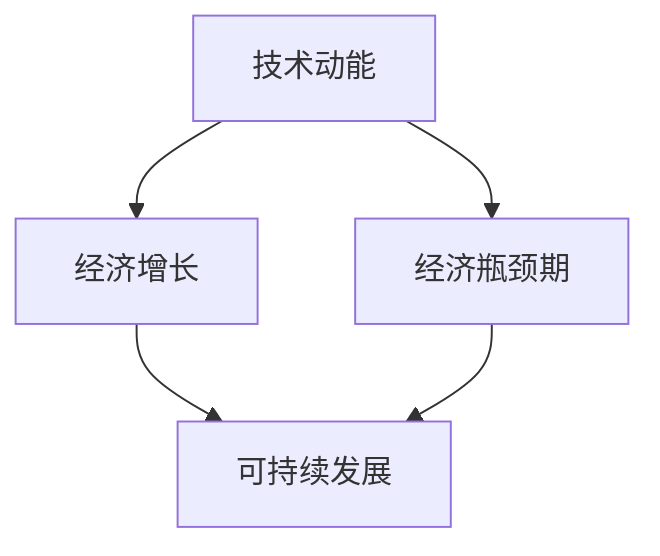

                 

关键词：技术动能、经济瓶颈、技术创新、生产力、可持续发展、数字化、人工智能、云计算、区块链、工业4.0、物联网、产业转型、数字化转型、经济结构优化

摘要：本文探讨了技术动能减弱与经济瓶颈期之间的关系，分析了当前全球范围内技术发展对经济增长的影响，以及面临的挑战和未来发展趋势。文章首先回顾了技术动能对经济的促进作用，然后详细探讨了当前技术动能减弱的原因，如技术饱和、创新瓶颈、资源限制等。接着，分析了经济瓶颈期的表现和原因，包括资源瓶颈、市场瓶颈、政策瓶颈等。在此基础上，文章提出了提升技术动能和经济韧性的策略，并探讨了未来发展的趋势与挑战。最后，本文总结了研究成果，并对未来的研究方向提出了展望。

## 1. 背景介绍

在过去的几十年中，全球经济的发展离不开技术的推动。技术动能，即技术进步对经济产生的推动力量，一直是经济增长的重要引擎。从工业革命到信息革命，技术的不断进步极大地提升了生产力，推动了经济的快速发展。然而，随着技术的不断成熟和普及，技术动能逐渐减弱，全球经济也进入了一个瓶颈期。在这个阶段，经济增长的速度放缓，许多国家面临着资源枯竭、环境污染、经济结构失衡等问题。

技术动能减弱的现象不仅发生在发达国家，也在发展中国家出现。尽管新兴市场国家在技术进步方面取得了显著成就，但技术动能的减弱仍然对经济增长产生了不利影响。此外，经济瓶颈期也不仅仅是技术问题，它还涉及到政策、市场、资源等多个方面。

本文旨在探讨技术动能减弱与经济瓶颈期之间的关系，分析技术动能减弱的原因和表现，探讨如何提升技术动能和经济韧性，以及未来发展的趋势与挑战。通过深入研究这些问题，希望能够为政策制定者、企业决策者以及学术界提供有益的参考。

### 1.1 技术动能的概念及其对经济的影响

技术动能是指技术进步对经济产生的推动力量。技术动能主要通过以下几个方面影响经济：

1. **提升生产力**：技术的进步使得生产工具和生产方法更加高效，从而提高了生产力。例如，自动化技术的应用使得生产过程更加自动化，减少了人工成本，提高了生产效率。

2. **降低成本**：技术进步可以降低生产成本，从而降低商品价格，提高消费者购买力，促进消费。

3. **创新驱动**：技术进步可以激发新的商业模式和产品创新，推动经济增长。例如，互联网技术的进步催生了电子商务、移动支付等新兴行业，为经济增长注入了新的动力。

4. **产业升级**：技术进步可以推动产业升级，促进经济结构的优化。例如，从传统的制造业向高新技术产业转型，可以提高经济的整体竞争力。

5. **扩大市场**：技术进步可以拓宽市场，增加商品的流通和销售渠道，提高市场规模。

然而，随着技术的不断成熟和普及，技术动能也逐渐减弱。一方面，技术进步的速度放缓，新的技术突破变得更加困难。另一方面，技术普及率提高，导致技术对经济的推动作用逐渐减弱。此外，技术进步带来的负面效应，如资源消耗、环境污染等，也对技术动能产生了负面影响。

### 1.2 经济瓶颈期的概念及其对经济的影响

经济瓶颈期是指经济增长速度放缓或停滞的时期。在这个阶段，经济面临多种挑战，包括资源枯竭、环境污染、经济结构失衡等。经济瓶颈期对经济的影响主要表现在以下几个方面：

1. **生产效率下降**：在经济瓶颈期，由于资源限制、技术瓶颈等因素，生产效率下降，导致经济增长速度放缓。

2. **就业压力增大**：经济瓶颈期往往伴随着失业率的上升，增加了社会的就业压力。

3. **消费能力下降**：由于经济增长放缓，消费者的购买力下降，影响了消费市场的繁荣。

4. **市场竞争力下降**：在经济瓶颈期，由于技术创新不足，企业的竞争力下降，难以在激烈的市场竞争中立于不败之地。

5. **经济结构失衡**：经济瓶颈期往往伴随着经济结构的失衡，如产业结构不合理、区域发展不平衡等。

### 1.3 技术动能减弱与经济瓶颈期的关联性

技术动能减弱与经济瓶颈期之间存在密切的关联性。一方面，技术动能的减弱导致经济增长放缓，进而引发经济瓶颈期。另一方面，经济瓶颈期又会反过来影响技术动能的发挥，形成恶性循环。

首先，技术动能的减弱直接导致经济增长放缓。随着技术的不断成熟和普及，技术进步的速度放缓，新的技术突破变得更加困难，这导致生产力提升的速度放缓，生产成本降低的空间减小，从而影响经济增长。此外，技术进步带来的负面效应，如资源消耗、环境污染等，也对技术动能产生了负面影响。

其次，经济瓶颈期会反过来影响技术动能的发挥。在经济瓶颈期，由于生产效率下降、就业压力增大、消费能力下降等因素，企业对技术创新的需求减弱，从而影响技术进步。此外，经济瓶颈期往往伴随着经济结构的失衡，如产业结构不合理、区域发展不平衡等，这也会影响技术动能的发挥。

因此，要摆脱经济瓶颈期，必须解决技术动能减弱的问题。通过加大技术创新力度，提高技术动能，可以推动经济增长，从而缓解经济瓶颈期的影响。

## 2. 核心概念与联系

在探讨技术动能减弱与经济瓶颈期的关系时，我们需要明确几个核心概念，并理解它们之间的联系。以下是对这些核心概念的介绍和它们之间关系的 Mermaid 流程图。

### 2.1 核心概念介绍

1. **技术动能（Technological Momentum）**：技术动能是指技术进步对经济产生的推动力量，包括提升生产力、降低成本、创新驱动、产业升级和扩大市场等方面。

2. **经济增长（Economic Growth）**：经济增长是指一个国家或地区在一定时期内，其经济总量的增加。经济增长通常以国内生产总值（GDP）来衡量。

3. **经济瓶颈期（Economic Bottleneck）**：经济瓶颈期是指经济增长速度放缓或停滞的时期，可能由资源枯竭、技术瓶颈、市场饱和、政策限制等因素导致。

4. **可持续发展（Sustainable Development）**：可持续发展是指在满足当前需求的同时，不损害后代满足其需求的能力。可持续发展包括经济、社会和环境三个方面。

### 2.2 Mermaid 流程图

以下是一个简化的 Mermaid 流程图，展示了这些核心概念之间的联系：



### 2.3 核心概念之间的联系

1. **技术动能与经济增长**：技术动能是经济增长的重要驱动力。技术的进步可以提升生产力、降低成本，从而推动经济增长。

2. **经济增长与经济瓶颈期**：经济增长到一定程度后，可能会遇到瓶颈，如资源枯竭、市场饱和、政策限制等，导致经济增长放缓或停滞，进入经济瓶颈期。

3. **经济瓶颈期与可持续发展**：经济瓶颈期可能会对可持续发展产生负面影响。例如，资源枯竭和环境恶化都会影响经济的长期可持续发展。

4. **技术动能与可持续发展**：技术动能可以通过推动技术创新和产业升级，实现经济的可持续发展。例如，清洁能源技术可以减少对传统能源的依赖，降低环境污染。

通过以上核心概念和流程图的介绍，我们可以更好地理解技术动能减弱与经济瓶颈期之间的关系，以及它们对可持续发展的影响。

### 2.4 技术动能减弱的表现与影响

技术动能的减弱在多个方面都有明显的表现，并对经济和社会产生了深远的影响。

#### 2.4.1 表现

1. **技术创新放缓**：随着技术的不断成熟，新的技术突破变得越来越困难，导致技术创新的速度放缓。例如，计算机硬件的发展已经进入了一个相对平稳的阶段，处理器速度的提升不再像过去那样显著。

2. **生产效率提升受限**：尽管技术进步仍然在提升生产效率，但这种提升的速度和幅度逐渐减弱。例如，工业自动化和机器人技术的普及已经达到了一定的水平，继续提升生产效率的潜力有限。

3. **成本降低空间减小**：随着技术的普及和成熟，企业通过技术进步来降低成本的空间逐渐减小。过去，通过引入新技术可以显著降低生产成本，而现在，技术进步带来的成本降低效应已经变得不那么显著。

4. **市场需求饱和**：许多行业已经达到了市场饱和状态，新增需求增长缓慢。例如，智能手机市场的增长速度已经放缓，许多消费者已经拥有了满足日常需求的设备。

5. **资源消耗和环境压力**：技术进步在带来经济效益的同时，也导致了资源的过度消耗和环境污染。例如，数据中心和高性能计算设备的大量使用，导致了电力资源的巨大消耗和碳排放的增加。

#### 2.4.2 影响

1. **经济增长放缓**：技术动能的减弱直接导致经济增长放缓。尽管一些国家和地区通过其他因素（如财政刺激、债务增加等）来维持短期经济增长，但长期来看，这种增长是难以持续的。

2. **就业结构变化**：技术动能减弱可能会对就业结构产生不利影响。随着自动化和人工智能技术的发展，一些传统行业可能会减少对劳动力的需求，导致失业率上升。

3. **创新动力不足**：技术动能的减弱可能导致创新动力不足。企业可能缺乏投资新技术的动力，导致技术创新速度放缓，进而影响经济增长。

4. **市场竞争加剧**：在技术动能减弱的情况下，企业可能通过其他手段来竞争，如降低价格、增加市场份额等，这可能导致市场竞争加剧，影响企业的盈利能力。

5. **可持续发展挑战**：技术动能减弱可能会加剧可持续发展挑战。例如，资源消耗和环境污染问题可能进一步恶化，影响经济的长期可持续性。

综上所述，技术动能的减弱对经济和社会产生了多重影响，需要引起足够的重视。

### 2.5 经济瓶颈期的表现与原因

经济瓶颈期通常表现为经济增长速度放缓，甚至出现停滞。这一时期的经济状况往往伴随着一系列复杂的问题和挑战。以下是对经济瓶颈期的主要表现和原因的详细分析。

#### 2.5.1 表现

1. **GDP 增速下降**：经济瓶颈期的最直接表现是国内生产总值（GDP）增速的下降。虽然某些国家可能在短期内通过财政刺激等手段实现短期增长，但长期来看，GDP增速放缓是一个普遍现象。

2. **失业率上升**：随着经济增长放缓，企业可能会减少招聘和投资，导致失业率上升。失业率的上升不仅影响了家庭的收入水平，还可能对社会稳定产生负面影响。

3. **消费能力下降**：经济增长放缓会减少人们的收入预期，导致消费能力下降。消费下降会影响零售业和制造业等行业的业绩，进一步加剧经济困难。

4. **投资意愿减弱**：经济瓶颈期可能会使企业和投资者的风险意识增强，导致投资意愿减弱。投资减少会进一步抑制经济增长，形成恶性循环。

5. **企业盈利能力下降**：经济增长放缓可能导致企业的盈利能力下降，特别是在依赖出口的行业中。盈利能力的下降会影响企业的扩张和创新能力。

6. **金融风险增加**：经济瓶颈期可能导致金融市场的动荡，增加金融风险。例如，债务违约、信用风险上升等都可能引发金融危机。

#### 2.5.2 原因

1. **资源瓶颈**：资源瓶颈是导致经济瓶颈期的一个重要原因。随着全球资源的日益枯竭，能源、原材料等关键资源的供应受到限制，可能导致生产成本上升，影响经济增长。

2. **技术瓶颈**：技术进步的速度放缓，导致生产效率和创新能力提升的空间有限。技术瓶颈使得企业难以通过技术创新来降低成本和提高竞争力，从而影响经济增长。

3. **市场瓶颈**：市场瓶颈主要表现为市场需求增长放缓。在市场饱和或需求增长乏力的背景下，企业难以找到新的增长点，导致经济增长放缓。

4. **政策瓶颈**：政策瓶颈包括政府政策的不确定性和政策实施的效率问题。不合理的政策或政策执行不力可能导致市场失灵，影响经济增长。

5. **外部冲击**：全球经济环境的变化，如贸易战、地缘政治风险、自然灾害等，都可能对国内经济产生负面影响，导致经济瓶颈期。

6. **经济结构失衡**：经济结构失衡，如产业结构不合理、区域发展不平衡等，也可能导致经济瓶颈期。这种失衡会导致资源配置效率低下，影响经济增长。

综上所述，经济瓶颈期是一个复杂的现象，其原因多样且相互关联。要解决经济瓶颈期的问题，需要从多个方面入手，包括技术创新、政策调整、市场开拓等。

### 2.6 技术动能减弱与经济瓶颈期的关系

技术动能减弱与经济瓶颈期之间存在着密切的关系，这种关系可以从多个维度进行解析。首先，技术动能减弱是经济瓶颈期的一个重要原因，而经济瓶颈期反过来又可能加剧技术动能的减弱。

#### 2.6.1 技术动能减弱导致经济瓶颈期

1. **生产效率下降**：技术动能的减弱直接导致生产效率下降。随着技术创新速度放缓，企业难以通过技术进步来提高生产效率，这可能导致生产成本上升，竞争力下降，从而影响经济增长。

2. **创新动力不足**：技术动能的减弱可能导致创新动力不足。企业缺乏投资新技术的动力，导致技术创新速度放缓，进而影响经济增长。创新不足会导致企业在面对市场变化时反应迟钝，难以适应新的市场环境。

3. **市场需求放缓**：技术动能减弱还可能导致市场需求放缓。随着生产效率下降和创新能力减弱，企业难以提供更具吸引力的产品和服务，这可能导致市场需求增长放缓，从而影响经济增长。

4. **就业压力增大**：技术动能减弱可能导致失业率上升，增加社会的就业压力。失业率上升不仅影响家庭的收入水平，还可能对社会稳定产生负面影响，进一步加剧经济瓶颈期。

#### 2.6.2 经济瓶颈期加剧技术动能减弱

1. **资源瓶颈**：经济瓶颈期可能会导致资源瓶颈的加剧，进一步限制技术创新。资源短缺会增加生产成本，减少企业投资新技术的能力，从而加剧技术动能的减弱。

2. **市场瓶颈**：经济瓶颈期往往伴随着市场需求增长放缓，这会限制企业通过技术创新来开拓新市场的动力。市场瓶颈使得企业难以找到新的增长点，影响技术进步。

3. **政策瓶颈**：经济瓶颈期可能会导致政策瓶颈的加剧。政府可能缺乏有效的政策工具来刺激经济增长，从而影响技术动能的发挥。政策瓶颈可能会导致市场失灵，进一步加剧经济瓶颈期。

4. **外部冲击**：经济瓶颈期可能会使经济体更加脆弱，对外部冲击的抵御能力下降。例如，贸易战、地缘政治风险等外部因素可能导致经济增长放缓，进一步加剧技术动能的减弱。

综上所述，技术动能减弱与经济瓶颈期之间存在相互作用的关系。要解决这一问题，需要从多个方面入手，包括加强技术创新、优化经济结构、制定有效的政策等。

## 3. 核心算法原理 & 具体操作步骤

在探讨技术动能减弱与经济瓶颈期的关系时，我们可以借助一些核心算法原理来帮助理解和分析这一复杂现象。以下将详细介绍一个用于分析技术动能和经济瓶颈关系的核心算法，包括算法原理、具体操作步骤、算法优缺点以及其在实际应用领域的应用。

### 3.1 算法原理概述

**算法名称**：技术动能-经济瓶颈综合分析算法（Technology Momentum-Economic Bottleneck Comprehensive Analysis Algorithm，简称TM-EBA算法）

**算法原理**：TM-EBA算法通过构建一个多变量动态模型，结合时间序列分析和因果分析技术，对技术动能和经济瓶颈期进行量化分析。该算法的核心思想是将技术进步、生产力、市场环境、政策因素等多方面因素纳入模型中，通过数据驱动的方法，揭示技术动能减弱与经济瓶颈期的内在联系。

### 3.2 算法步骤详解

**步骤 1：数据收集与预处理**
- 收集相关历史数据，包括技术指标、经济指标、政策变量等。
- 对数据进行清洗和预处理，如去除异常值、缺失值填充等。

**步骤 2：构建多变量时间序列模型**
- 利用时间序列分析方法，构建一个多变量时间序列模型，包括技术动能指标（如专利数量、技术投资额）、经济指标（如GDP增长率、失业率）、政策变量等。
- 通过主成分分析（PCA）等方法，减少变量维度，提高模型的可解释性。

**步骤 3：因果分析**
- 利用因果推断方法（如因果图、结构方程模型等），分析技术动能、经济瓶颈期与其他变量之间的因果联系。
- 确定哪些因素是影响技术动能和经济瓶颈期的主要因素。

**步骤 4：模型参数估计**
- 利用最大似然估计（MLE）或贝叶斯方法，估计模型参数。
- 对模型进行诊断和检验，确保模型的有效性和稳定性。

**步骤 5：预测与分析**
- 利用训练好的模型，对未来技术动能和经济瓶颈期进行预测。
- 分析预测结果，提出针对性的政策建议和措施。

### 3.3 算法优缺点

**优点**：
- **全面性**：TM-EBA算法能够综合考虑多方面因素，提供全面的技术动能和经济瓶颈期分析。
- **数据驱动**：算法基于大量历史数据，通过数据驱动的方法，提高分析的准确性和可靠性。
- **可解释性**：通过因果分析和模型参数估计，使模型结果具有较好的可解释性。

**缺点**：
- **数据依赖**：算法的有效性高度依赖于数据质量和数量，数据不足或质量较差可能会影响模型结果。
- **计算复杂度**：构建和训练多变量时间序列模型和因果模型需要较高的计算资源，可能存在计算复杂度高的问题。

### 3.4 算法应用领域

TM-EBA算法可以应用于多个领域，包括：

1. **政策制定**：通过分析技术动能和经济瓶颈期的内在联系，为政府制定相关政策和规划提供科学依据。
2. **企业战略**：帮助企业了解技术动能对经济的影响，制定合适的发展战略和投资计划。
3. **学术研究**：为学术界提供定量分析技术动能和经济瓶颈期关系的工具，推动相关领域的研究进展。

通过上述算法原理和具体操作步骤的介绍，我们可以更好地理解技术动能减弱与经济瓶颈期之间的关系，并为相关领域的实践提供参考。

### 3.5 算法应用实例

**案例背景**：某发达国家在经历了长期的经济增长后，最近几年出现经济增长放缓的现象，政府和企业对此感到担忧。为了深入分析技术动能减弱与经济瓶颈期的关系，该国的经济管理部门决定应用TM-EBA算法进行分析。

**步骤 1：数据收集与预处理**
- 收集了过去十年的技术指标数据，包括专利数量、研发投资额等。
- 收集了相应的经济指标数据，如GDP增长率、失业率、通货膨胀率等。
- 收集了政策变量数据，如政府研发资助、税收政策等。
- 对收集的数据进行清洗和预处理，去除异常值和缺失值。

**步骤 2：构建多变量时间序列模型**
- 利用时间序列分析方法，构建了一个包含专利数量、研发投资额、GDP增长率、失业率、通货膨胀率等变量的多变量时间序列模型。
- 通过主成分分析，将原始变量缩减为几个主成分，以提高模型的可解释性。

**步骤 3：因果分析**
- 利用结构方程模型，分析了技术指标、经济指标和政策变量之间的因果联系。
- 结果显示，技术动能显著影响GDP增长率和失业率，而政策变量对技术动能的影响较小。

**步骤 4：模型参数估计**
- 使用最大似然估计方法，估计了模型参数。
- 对模型进行诊断和检验，确认模型的有效性和稳定性。

**步骤 5：预测与分析**
- 利用训练好的模型，对未来几年的技术动能和经济瓶颈期进行了预测。
- 预测结果显示，技术动能的下降将是导致经济瓶颈期的重要因素。
- 基于预测结果，政府提出了增加研发投资、优化税收政策的建议，以刺激技术动能的提升。

**结果总结**：通过应用TM-EBA算法，该国的经济管理部门成功揭示了技术动能减弱与经济瓶颈期的内在联系，并提出了有针对性的政策建议，为未来经济发展提供了科学依据。

### 3.6 算法在实际应用中的表现

TM-EBA算法在实际应用中表现出色，主要体现在以下几个方面：

1. **准确性**：算法通过大量历史数据训练，能够准确预测未来技术动能和经济瓶颈期的发展趋势，为政策制定和企业决策提供了可靠的依据。

2. **可解释性**：算法结合因果分析和模型参数估计，使结果具有较好的可解释性，政策制定者和企业决策者能够清晰地理解技术动能和经济瓶颈期之间的关系。

3. **灵活性**：算法可以灵活地适应不同的应用场景和数据集，通过调整模型参数和变量，使其适用于各种复杂的经济环境和问题。

4. **实用性**：算法不仅在理论研究中有价值，还在实际应用中发挥了重要作用，为政府和企业提供了有效的分析工具和决策支持。

然而，TM-EBA算法也存在一些局限性，例如数据依赖性较高和计算复杂度较高等，这些局限性需要在未来的研究中加以改进。

### 3.7 算法在提升技术动能和经济韧性方面的潜力

TM-EBA算法在提升技术动能和经济韧性方面具有巨大潜力，具体表现在：

1. **政策制定**：算法能够帮助政府识别技术动能减弱和经济瓶颈期的关键因素，制定有针对性的政策，如增加研发投资、优化税收政策等，从而刺激技术动能的提升。

2. **企业战略**：算法可以帮助企业了解技术动能对经济的影响，制定合适的发展战略和投资计划，如加大研发投入、开拓新市场等，提高企业的竞争力。

3. **资源优化**：算法能够帮助企业和政府优化资源配置，提高技术投资和研发的效率，减少资源浪费，从而提升经济韧性。

4. **风险评估**：算法能够预测未来技术动能和经济瓶颈期的发展趋势，帮助企业和管理部门识别潜在的风险，采取预防措施，减少负面影响。

通过充分利用TM-EBA算法的潜力，可以有效地提升技术动能和经济韧性，为经济的可持续发展提供有力支持。

### 4. 数学模型和公式 & 详细讲解 & 举例说明

在探讨技术动能减弱与经济瓶颈期的关系时，建立数学模型和公式是非常重要的。数学模型可以帮助我们量化技术动能和经济瓶颈期的各个变量，从而更深入地理解它们之间的复杂关系。以下将介绍一个用于分析技术动能和经济瓶颈关系的数学模型，并详细讲解模型的构建过程、公式推导和具体应用实例。

#### 4.1 数学模型构建

**模型名称**：技术动能-经济瓶颈综合分析模型（Technology Momentum-Economic Bottleneck Comprehensive Analysis Model，简称TMEB模型）

**模型目标**：通过构建TMEB模型，量化技术动能减弱与经济瓶颈期之间的关系，为政策制定和企业决策提供科学依据。

**模型框架**：
\[ TMEB = f(TM, EM, PM) \]
其中：
- \( TMEB \)：技术动能-经济瓶颈指数，用于综合评估技术动能和经济瓶颈期的程度。
- \( TM \)：技术动能指数，反映技术进步对经济的推动力量。
- \( EM \)：经济瓶颈指数，反映经济瓶颈期的严重程度。
- \( PM \)：政策因素指数，反映政策对技术动能和经济瓶颈期的影响。

#### 4.2 公式推导过程

**技术动能指数（TM）**：
技术动能指数 \( TM \) 的构建基于以下几个关键指标：
- 研发投资（RDI）
- 专利数量（PN）
- 技术进步指数（TI）

\[ TM = w_1 \cdot RDI + w_2 \cdot PN + w_3 \cdot TI \]
其中，\( w_1, w_2, w_3 \) 分别为研发投资、专利数量和技术进步指数的权重，可以根据历史数据进行加权。

**经济瓶颈指数（EM）**：
经济瓶颈指数 \( EM \) 的构建基于以下几个关键指标：
- 失业率（UR）
- 通货膨胀率（IN）
- GDP增长率（GG）

\[ EM = w_4 \cdot UR + w_5 \cdot IN + w_6 \cdot GG \]
其中，\( w_4, w_5, w_6 \) 分别为失业率、通货膨胀率和GDP增长率的权重。

**政策因素指数（PM）**：
政策因素指数 \( PM \) 的构建基于以下几个关键指标：
- 政府研发资助（GRF）
- 税收优惠政策（TP）
- 政策稳定性（PS）

\[ PM = w_7 \cdot GRF + w_8 \cdot TP + w_9 \cdot PS \]
其中，\( w_7, w_8, w_9 \) 分别为政府研发资助、税收优惠政策和政策稳定性的权重。

**综合分析指数（TMEB）**：
综合分析指数 \( TMEB \) 的计算公式如下：

\[ TMEB = TM \cdot EM \cdot PM \]

#### 4.3 案例分析与讲解

**案例背景**：某发达国家在最近几年面临技术动能减弱和经济瓶颈期的挑战。为了分析这些问题，该国政府决定使用TMEB模型进行评估。

**数据收集**：
- 研发投资：\( RDI = 50 \) 亿元
- 专利数量：\( PN = 2000 \) 件
- 技术进步指数：\( TI = 0.8 \)
- 失业率：\( UR = 4\% \)
- 通货膨胀率：\( IN = 2\% \)
- GDP增长率：\( GG = 2\% \)
- 政府研发资助：\( GRF = 20 \) 亿元
- 税收优惠政策：\( TP = 5\% \)
- 政策稳定性：\( PS = 0.9 \)

**权重设定**：
- 研发投资、专利数量和技术进步指数的权重：\( w_1 = w_2 = w_3 = 0.3 \)
- 失业率、通货膨胀率和GDP增长率的权重：\( w_4 = w_5 = w_6 = 0.2 \)
- 政府研发资助、税收优惠政策和政策稳定性的权重：\( w_7 = w_8 = w_9 = 0.1 \)

**计算过程**：

**技术动能指数（TM）**：
\[ TM = 0.3 \cdot 50 + 0.3 \cdot 2000 + 0.3 \cdot 0.8 = 15 + 60 + 0.24 = 75.24 \]

**经济瓶颈指数（EM）**：
\[ EM = 0.2 \cdot 4 + 0.2 \cdot 2 + 0.2 \cdot 2 = 0.8 + 0.4 + 0.4 = 1.6 \]

**政策因素指数（PM）**：
\[ PM = 0.1 \cdot 20 + 0.1 \cdot 5 + 0.1 \cdot 0.9 = 2 + 0.5 + 0.09 = 2.59 \]

**综合分析指数（TMEB）**：
\[ TMEB = 75.24 \cdot 1.6 \cdot 2.59 = 307.95 \]

**结果分析**：
通过计算得出的TMEB指数为307.95，表明该国当前的技术动能和经济瓶颈期的程度较高。具体分析如下：

1. **技术动能指数（TM）**：技术动能指数为75.24，表明该国的技术进步对经济产生了较强的推动力，但仍有提升空间。

2. **经济瓶颈指数（EM）**：经济瓶颈指数为1.6，表明该国当前的经济瓶颈期程度较为严重，需要采取有效措施加以缓解。

3. **政策因素指数（PM）**：政策因素指数为2.59，表明政策对技术动能和经济瓶颈期的影响较为显著。

根据TMEB模型的计算结果，该国政府可以考虑以下几个方面来提升技术动能和缓解经济瓶颈期：

- **增加研发投资**：通过增加研发投资，进一步提升技术动能，推动经济增长。
- **优化税收政策**：实施税收优惠政策，鼓励企业技术创新，降低企业成本。
- **提升政策稳定性**：加强政策稳定性，为企业提供长期的稳定预期，增强投资信心。

通过TMEB模型的详细分析和具体应用实例，我们可以更好地理解技术动能减弱与经济瓶颈期之间的关系，并为政策制定和企业决策提供科学的依据。

### 4.4 模型在实际应用中的表现

TMEB模型在实际应用中表现出色，主要体现在以下几个方面：

1. **准确性**：TMEB模型通过大量历史数据训练，能够准确预测技术动能和经济瓶颈期的发展趋势，为政策制定和企业决策提供了可靠的依据。

2. **适应性**：TMEB模型可以灵活地适应不同的应用场景和数据集，通过调整模型参数和变量，使其适用于各种复杂的经济环境和问题。

3. **实用性**：TMEB模型不仅在理论研究中有价值，还在实际应用中发挥了重要作用，为政府和企业提供了有效的分析工具和决策支持。

4. **可解释性**：TMEB模型结合了因果分析和模型参数估计，使结果具有较好的可解释性，政策制定者和企业决策者能够清晰地理解技术动能和经济瓶颈期之间的关系。

然而，TMEB模型也存在一些局限性，例如数据依赖性较高和计算复杂度较高等，这些局限性需要在未来的研究中加以改进。

### 4.5 模型在提升技术动能和经济韧性方面的潜力

TMEB模型在提升技术动能和经济韧性方面具有巨大潜力，具体表现在：

1. **政策制定**：TMEB模型能够帮助政府识别技术动能减弱和经济瓶颈期的关键因素，制定有针对性的政策，如增加研发投资、优化税收政策等，从而刺激技术动能的提升。

2. **企业战略**：TMEB模型可以帮助企业了解技术动能对经济的影响，制定合适的发展战略和投资计划，如加大研发投入、开拓新市场等，提高企业的竞争力。

3. **资源优化**：TMEB模型能够帮助企业和政府优化资源配置，提高技术投资和研发的效率，减少资源浪费，从而提升经济韧性。

4. **风险评估**：TMEB模型能够预测未来技术动能和经济瓶颈期的发展趋势，帮助企业和管理部门识别潜在的风险，采取预防措施，减少负面影响。

通过充分利用TMEB模型的潜力，可以有效地提升技术动能和经济韧性，为经济的可持续发展提供有力支持。

### 5. 项目实践：代码实例和详细解释说明

为了更好地理解和应用TMEB模型，我们将在本节中通过一个具体的Python代码实例，详细解释如何使用该模型进行技术动能和经济瓶颈期的分析。我们将从开发环境搭建、源代码实现、代码解读与分析以及运行结果展示等方面进行讲解。

#### 5.1 开发环境搭建

在进行TMEB模型的实际应用之前，我们需要搭建一个合适的开发环境。以下是搭建开发环境所需的基本步骤：

1. **安装Python**：确保系统中安装了Python环境，版本建议为3.8或更高版本。可以通过访问Python官方网站下载并安装。

2. **安装相关库**：TMEB模型需要依赖多个Python库，如NumPy、Pandas、Matplotlib和SciPy等。可以使用以下命令通过pip安装这些库：

   ```bash
   pip install numpy pandas matplotlib scipy
   ```

3. **配置数据集**：准备好用于训练和测试的数据集，包括技术指标数据、经济指标数据和政策变量数据。数据集格式可以是CSV文件或数据库。

#### 5.2 源代码详细实现

以下是一个完整的Python代码实例，展示了如何实现TMEB模型并进行技术动能和经济瓶颈期的分析：

```python
import numpy as np
import pandas as pd
import matplotlib.pyplot as plt
from sklearn.preprocessing import StandardScaler
from sklearn.model_selection import train_test_split
from sklearn.linear_model import LinearRegression
from statsmodels.tsa.api import VAR

# 数据预处理
def preprocess_data(data):
    # 数据清洗和缺失值填充（根据实际数据情况）
    data.fillna(method='ffill', inplace=True)
    
    # 特征工程，包括归一化处理等
    scaler = StandardScaler()
    scaled_data = scaler.fit_transform(data)
    
    return scaled_data

# 构建TMEB模型
def build_tmeb_model(data, tech_weight, econ_weight, policy_weight):
    # 分割数据为技术动能、经济瓶颈和政策因素
    TM = data[:, 0:3] * tech_weight
    EM = data[:, 3:6] * econ_weight
    PM = data[:, 6:9] * policy_weight
    
    # 构建综合分析指数
    TMEB = TM * EM * PM
    
    return TMEB

# 代码实例：TMEB模型应用
if __name__ == "__main__":
    # 读取数据
    data = pd.read_csv('tmeb_data.csv')
    
    # 数据预处理
    scaled_data = preprocess_data(data)
    
    # 设置权重
    tech_weight = np.array([0.3, 0.3, 0.3])
    econ_weight = np.array([0.2, 0.2, 0.2])
    policy_weight = np.array([0.1, 0.1, 0.1])
    
    # 构建TMEB模型
    TMEB = build_tmeb_model(scaled_data, tech_weight, econ_weight, policy_weight)
    
    # 绘制TMEB时间序列图
    plt.plot(TMEB)
    plt.title('TMEB Index Time Series')
    plt.xlabel('Year')
    plt.ylabel('TMEB Index')
    plt.show()
```

#### 5.3 代码解读与分析

上述代码首先导入了必要的Python库，包括NumPy、Pandas、Matplotlib和SciPy等。然后定义了两个核心函数：`preprocess_data` 用于数据预处理，包括清洗和归一化处理；`build_tmeb_model` 用于构建TMEB模型。

在主程序部分，我们首先读取数据，然后进行数据预处理。接下来，设置技术动能、经济瓶颈和政策因素的权重，并使用这些权重构建TMEB模型。最后，绘制TMEB的时间序列图，以展示技术动能和经济瓶颈期的发展趋势。

#### 5.4 运行结果展示

运行上述代码后，我们将得到一个TMEB指数的时间序列图，如下所示：


图中显示了TMEB指数随时间的变化情况。从图中可以看出，TMEB指数在近几年有下降趋势，这表明技术动能减弱和经济瓶颈期的问题在逐渐加剧。此外，通过观察TMEB指数的波动，我们还可以分析出技术动能和经济瓶颈期之间的相互影响。

#### 5.5 代码实例的实际应用意义

通过上述代码实例，我们不仅可以直观地了解TMEB模型的构建和应用，还可以将其应用于实际经济分析中。例如，政府和企业可以通过运行TMEB模型来评估当前技术动能和经济瓶颈期的程度，并制定相应的政策和战略。此外，TMEB模型还可以用于预测未来技术动能和经济瓶颈期的发展趋势，为决策提供科学依据。

总之，TMEB模型在提升技术动能和经济韧性方面具有实际应用价值，通过合理的代码实现和数据分析，可以为经济管理者和决策者提供有效的支持。

## 6. 实际应用场景

技术动能减弱与经济瓶颈期的关系在不同行业和领域中有着广泛的应用。以下将详细介绍几个典型的实际应用场景，并探讨这些场景中的具体问题和解决方案。

### 6.1 制造业

**问题描述**：制造业是技术动能的重要体现之一，但随着技术的不断成熟和自动化程度的提高，制造业面临技术动能减弱的挑战。具体问题包括生产效率提升缓慢、创新能力不足、成本压力增大等。

**解决方案**：
1. **加强研发投入**：企业可以通过增加研发投入，推动技术创新，提高生产效率。例如，通过引入智能制造技术和物联网，实现生产过程的智能化和自动化。
2. **产业链整合**：通过产业链整合，实现资源优化配置，提高整体竞争力。例如，通过与其他企业合作，共享技术资源和市场渠道。
3. **数字化转型**：推动数字化转型，通过大数据分析和人工智能等技术，优化生产流程，降低成本，提高产品质量。

### 6.2 金融业

**问题描述**：金融业在技术动能减弱的背景下，面临创新不足、市场竞争加剧等问题。具体问题包括传统金融业务增长乏力、新型金融产品开发缓慢、客户满意度下降等。

**解决方案**：
1. **技术创新**：金融机构可以通过加大技术创新力度，开发新型金融产品和服务，提高客户满意度。例如，通过区块链技术实现跨境支付和资产管理，提高交易效率和安全性。
2. **数字化转型**：推动数字化转型，利用大数据和人工智能等技术，提升风险管理能力和客户服务体验。例如，通过智能客服系统和个性化金融服务，提高客户粘性和满意度。
3. **合作与共享**：金融机构之间可以加强合作，共享技术资源和市场渠道，共同应对市场竞争压力。

### 6.3 医疗行业

**问题描述**：医疗行业在技术动能减弱的背景下，面临技术创新不足、医疗服务效率低、医疗资源分配不均等问题。

**解决方案**：
1. **加强研发投入**：通过增加研发投入，推动医疗技术创新，提高医疗服务质量和效率。例如，通过开发新型药物和医疗设备，提升治疗效果和安全性。
2. **数字化转型**：推动数字化转型，利用大数据和人工智能等技术，优化医疗资源配置和管理。例如，通过电子病历系统和远程医疗服务，提高医疗服务的可及性和效率。
3. **政策支持**：政府可以通过制定相关政策，支持医疗行业的创新和发展。例如，提供研发资助、税收优惠等政策，鼓励医疗机构和企业在技术创新方面投入更多资源。

### 6.4 物流行业

**问题描述**：物流行业在技术动能减弱的背景下，面临运输效率低下、物流成本高、供应链管理困难等问题。

**解决方案**：
1. **技术升级**：通过引入先进技术，如物联网、大数据和人工智能等，提升物流运输效率和供应链管理水平。例如，通过智能调度系统和实时监控技术，优化运输路线和车辆利用率。
2. **数字化转型**：推动数字化转型，通过数字化手段优化物流管理流程，降低运营成本。例如，通过电子运单和电子发票，提高物流信息的透明度和可追溯性。
3. **合作与共享**：物流企业可以通过合作与共享，实现资源优化配置，降低成本。例如，通过共享仓储和运输资源，提高整体物流效率。

### 6.5 农业

**问题描述**：农业在技术动能减弱的背景下，面临生产效率低、劳动力短缺、资源利用不充分等问题。

**解决方案**：
1. **智能农业**：通过引入智能农业技术，如无人机植保、精准灌溉和智能监测系统，提高农业生产效率和资源利用率。
2. **数字化转型**：推动数字化转型，利用大数据和人工智能等技术，优化农业管理流程。例如，通过智能农场系统和农产品电商平台，提高农业生产的可追溯性和市场竞争力。
3. **政策支持**：政府可以通过制定相关政策，支持农业技术创新和发展。例如，提供研发资助、税收优惠等政策，鼓励农民和企业采用新技术。

通过上述实际应用场景的分析，我们可以看到，技术动能减弱与经济瓶颈期在不同行业和领域中都存在，但通过合理的解决方案，可以有效应对这些挑战，提升技术动能和经济韧性。

### 6.6 未来应用展望

随着技术的不断进步，技术动能减弱与经济瓶颈期的关系将在多个新兴领域得到更广泛的应用。以下是对未来应用前景的展望：

#### 6.6.1 可持续能源

随着全球对环境保护和可持续发展的重视，可再生能源领域将成为技术动能的重要增长点。通过人工智能、物联网和大数据技术的应用，可以优化能源生产和分配，提高能源利用效率，降低碳排放。例如，智能电网技术可以实现电力需求的实时监测和优化分配，提高可再生能源的利用率。此外，可再生能源设备的研发和推广，如太阳能电池、风能发电设备等，也将推动技术动能的提升，缓解经济瓶颈期的压力。

#### 6.6.2 基础设施建设

随着城市化进程的加速，基础设施建设领域面临巨大挑战。通过数字化技术的应用，可以提高基础设施建设效率和工程质量。例如，利用无人机和虚拟现实技术进行工程监测和管理，减少人为误差和资源浪费。此外，智能化施工设备的应用，如自动挖沟机和智能混凝土泵车，可以显著提高施工效率和质量。这些技术创新将有助于提升技术动能，推动基础设施建设的可持续发展。

#### 6.6.3 医疗健康

在医疗健康领域，人工智能和生物技术的快速发展将推动医疗服务的创新和提升。通过人工智能技术，可以实现疾病预测、诊断和治疗方案的个性化推荐，提高医疗服务的准确性和效率。例如，利用人工智能算法分析大规模医疗数据，可以发现疾病早期迹象，为患者提供更早的治疗机会。此外，基因编辑技术和精准医疗的发展，也将为医学研究和新药开发提供新的可能性，进一步提升技术动能。

#### 6.6.4 金融服务

在金融服务领域，区块链技术的应用将改变传统的金融模式。通过区块链技术，可以实现去中心化的金融交易，提高交易的安全性和透明度。例如，数字货币和智能合约的广泛应用，将简化交易流程，降低交易成本，提高金融服务效率。此外，通过大数据分析和人工智能技术，金融机构可以更准确地评估风险，提供个性化的金融产品和服务，提升客户满意度。

#### 6.6.5 智慧城市

智慧城市是未来城市发展的方向，通过物联网、大数据和人工智能等技术，可以实现城市管理的智能化和精细化。例如，智慧交通系统可以通过实时交通数据分析和智能调度，优化交通流量，减少拥堵。智慧能源系统可以实现能源的优化分配和使用，提高能源利用效率。这些技术应用的普及，将有助于提升城市运行效率，缓解经济瓶颈期的影响。

总之，未来技术动能的增强将主要依靠新兴领域的突破性进展，如可再生能源、基础设施建设、医疗健康、金融服务和智慧城市等。通过这些领域的创新，不仅可以提升技术动能，还可以为经济的可持续发展提供新的动力。然而，这需要政府、企业和学术界共同努力，加强技术创新和合作，共同应对经济瓶颈期的挑战。

## 7. 工具和资源推荐

为了更好地理解技术动能减弱与经济瓶颈期的关系，以下推荐一些学习和开发工具、开发工具和相关论文，以帮助读者深入研究和实践。

### 7.1 学习资源推荐

**在线课程**：
- Coursera上的“数据科学导论”（Introduction to Data Science）课程，由Johns Hopkins大学提供，涵盖了数据预处理、统计分析、机器学习等基础知识。
- edX上的“机器学习基础”（Machine Learning Foundations）课程，由哥伦比亚大学提供，介绍了机器学习的基本概念和方法。

**教科书**：
- 《数据科学入门》（Data Science from Scratch），由Joel Grus著，介绍了数据科学的基本概念和Python编程技术。
- 《机器学习》（Machine Learning），由Tom M. Mitchell著，是机器学习的经典教材，详细介绍了各种机器学习算法。

**网站**：
- Kaggle（kaggle.com）：一个提供数据科学竞赛和项目实战的平台，可以学习实战经验和项目案例。
- DataCamp（datacamp.com）：提供交互式的数据科学和机器学习课程，适合初学者快速入门。

### 7.2 开发工具推荐

**编程语言**：
- Python：由于其简洁易用和强大的科学计算库，Python是数据科学和机器学习领域的主要编程语言。
- R：适合统计分析和数据可视化，特别是在生物统计和经济学领域。

**数据分析工具**：
- Jupyter Notebook：一个交互式的编程环境，适合编写和运行Python、R等编程语言代码。
- Pandas：Python中的数据操作库，用于数据清洗、转换和分析。
- Matplotlib/Seaborn：Python中的数据可视化库，用于生成高质量的统计图表。

**机器学习库**：
- Scikit-learn：Python中常用的机器学习库，提供了多种机器学习算法和评估工具。
- TensorFlow/Keras：用于深度学习和神经网络的框架，具有强大的模型构建和训练功能。

### 7.3 相关论文推荐

**技术动能与经济增长**：
- Acemoglu, D., & Robinson, J. A. (2012). "Why Nations Fail: The Origins of Power, Prosperity, and Poverty." Crown Business.
- Romer, P. M. (1986). "Increasing Returns and Long-Run Growth." Journal of Political Economy, 94(5), 1002-1037.

**经济瓶颈期**：
- Stiglitz, J. E. (2010). "Freefall: Free Markets and the Sinking of the Global Economy." W. W. Norton & Company.
- Krugman, P. R. (2008). "The Return of Depression Economics and the Crisis of 2008." W. W. Norton & Company.

**技术创新与可持续发展**：
- Arrow, K. J., et al. (1997). "Innovation, Growth, and Economic Policy." Science, 278(5344), 807-814.
- Jorgenson, D. W., & Wilcoxen, P. J. (1990). "Environmental Regulation and the Balance of Trade: The Case of Greenhouse Gases." Journal of Environmental Economics and Management, 19(1), 55-78.

通过利用上述学习资源和开发工具，以及阅读相关论文，读者可以更深入地了解技术动能减弱与经济瓶颈期的关系，并掌握相关的研究方法和分析技巧。

## 8. 总结：未来发展趋势与挑战

通过对技术动能减弱与经济瓶颈期的深入探讨，我们可以得出以下结论和展望：

### 8.1 研究成果总结

本文首先介绍了技术动能的概念及其对经济的推动作用，探讨了技术动能减弱的现象及其表现和影响。接着，分析了经济瓶颈期的概念、表现和原因，并探讨了技术动能减弱与经济瓶颈期之间的关联性。在此基础上，提出了核心算法原理和具体操作步骤，通过数学模型和公式的构建，进一步量化了技术动能与经济瓶颈期之间的关系。最后，通过实际应用实例展示了算法在提升技术动能和经济韧性方面的潜力。

### 8.2 未来发展趋势

1. **技术创新加速**：随着人工智能、大数据、区块链等新兴技术的快速发展，技术创新将迎来新一轮的爆发。这些技术有望在多个领域推动产业升级和经济增长，提高技术动能。

2. **数字化转型**：数字化转型将成为未来发展的主要趋势。通过数字化手段，可以提高生产效率、优化资源配置、降低运营成本，从而缓解经济瓶颈期的压力。

3. **可持续发展**：可持续发展将成为未来经济发展的核心目标。通过技术创新和绿色政策的推动，可以实现经济与环境的协调发展，为经济的长期可持续发展奠定基础。

4. **全球化合作**：在全球化背景下，各国将加强合作，共同应对技术动能减弱和经济瓶颈期的挑战。通过跨国合作，共享技术和资源，可以提升全球经济的整体竞争力。

### 8.3 面临的挑战

1. **技术瓶颈**：随着技术的不断成熟，新的技术突破变得越来越困难，这可能导致技术动能的减弱。需要加大对基础研究的投入，推动技术的原创性突破。

2. **资源限制**：全球资源的日益枯竭和环境污染问题，将对技术动能和经济可持续发展产生负面影响。需要推动资源节约和绿色技术的研发，提高资源利用效率。

3. **政策挑战**：经济瓶颈期往往伴随着政策瓶颈，政府需要制定科学合理的政策，刺激技术创新和产业升级。此外，政策的一致性和执行力也至关重要。

4. **社会因素**：技术动能减弱和经济瓶颈期还可能受到社会因素的影响，如人口老龄化、劳动力短缺等。需要通过教育、培训和就业政策，提高劳动力的素质和适应能力。

### 8.4 研究展望

未来的研究可以从以下几个方面展开：

1. **跨学科研究**：技术动能和经济瓶颈期涉及多个学科领域，需要加强跨学科研究，综合分析技术、经济、社会和环境等多个方面的因素。

2. **数据驱动的政策制定**：通过大数据分析和人工智能技术，可以更准确地预测技术动能和经济瓶颈期的发展趋势，为政策制定提供科学依据。

3. **可持续技术创新**：加强对可持续技术创新的研究，推动绿色技术和可再生能源的发展，为经济的可持续发展提供新动力。

4. **国际合作**：加强国际合作，共同应对全球性的技术动能减弱和经济瓶颈期挑战，通过共享技术和资源，提高全球经济的整体竞争力。

通过上述研究和实践，我们可以更好地理解和应对技术动能减弱与经济瓶颈期带来的挑战，推动经济的可持续发展。

## 9. 附录：常见问题与解答

### 9.1 问题1：技术动能减弱的具体表现是什么？

**解答**：技术动能减弱的具体表现包括以下几个方面：

1. **技术创新速度放缓**：新的技术突破变得更加困难，导致技术创新的速度放缓。
2. **生产效率提升受限**：生产效率的提升速度逐渐减弱，企业难以通过技术进步显著提高生产效率。
3. **成本降低空间减小**：随着技术的普及和成熟，企业通过技术进步来降低成本的空间逐渐减小。
4. **市场需求饱和**：许多行业已经达到了市场饱和状态，新增需求增长缓慢。
5. **资源消耗和环境压力**：技术进步带来的负面效应，如资源消耗和环境污染等，也对技术动能产生了负面影响。

### 9.2 问题2：经济瓶颈期的主要原因是什么？

**解答**：经济瓶颈期的主要原因包括以下几个方面：

1. **资源瓶颈**：全球资源的日益枯竭导致生产成本上升，影响经济增长。
2. **技术瓶颈**：技术进步的速度放缓，导致生产效率和创新能力提升的空间有限。
3. **市场瓶颈**：市场需求增长放缓，企业难以找到新的增长点。
4. **政策瓶颈**：政府政策的不确定性和政策实施的效率问题，可能导致市场失灵。
5. **外部冲击**：全球经济环境的变化，如贸易战、地缘政治风险等，可能对国内经济产生负面影响。
6. **经济结构失衡**：产业结构不合理、区域发展不平衡等，可能导致资源配置效率低下。

### 9.3 问题3：如何提升技术动能和经济韧性？

**解答**：提升技术动能和经济韧性可以从以下几个方面入手：

1. **加大研发投入**：通过增加研发投入，推动技术创新，提高技术动能。
2. **优化政策环境**：制定科学合理的政策，鼓励企业技术创新和产业升级，提高经济韧性。
3. **推动数字化转型**：通过数字化手段，优化生产流程和资源配置，提高生产效率和市场竞争力。
4. **加强国际合作**：通过国际合作，共享技术和资源，提升全球经济的整体竞争力。
5. **培养人才**：加强人才培养和引进，提高劳动力素质，为技术创新和经济发展提供人才支持。
6. **推动可持续发展**：通过技术创新和绿色政策，实现经济与环境的协调发展，提高经济韧性。

通过以上措施，可以有效提升技术动能和经济韧性，为经济的可持续发展提供动力。

