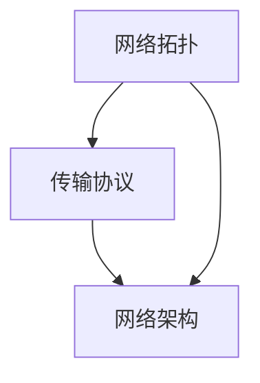

                 

在这个信息爆炸的时代，networking（网络连接）已成为推动技术进步和商业创新的核心动力。本文旨在深入探讨networking领域的关键概念、算法、数学模型以及实际应用，为读者提供一个全面的技术视角。通过这篇文章，我们希望能够揭示networking技术背后的奥秘，并展望其未来的发展趋势与机遇。

## 关键词 Keywords

- Networking
- 算法
- 数学模型
- 实际应用
- 未来展望

## 摘要 Abstract

本文首先介绍了networking技术的背景和重要性，接着探讨了核心概念与联系，详细阐述了网络算法的原理与操作步骤。随后，我们深入分析了数学模型和公式的构建与推导，通过具体的案例讲解了其在实际应用中的效果。文章还提供了代码实例和运行结果，进一步展示了networking技术的实用性和可行性。最后，我们展望了networking技术在未来应用和发展中的潜在机遇与挑战。

## 1. 背景介绍

### 1.1 互联网的发展

互联网的兴起始于20世纪60年代，当时美国国防部的高级研究计划局（ARPA）启动了ARPANET项目，旨在构建一个分布式的通信网络，以增强军事通信的可靠性。ARPANET的诞生标志着互联网的诞生，它为后来的计算机网络技术和协议的发展奠定了基础。

随着时间的推移，互联网技术迅速发展，从最初的学术和政府用途逐渐扩展到商业和民用领域。1990年代，万维网（WWW）的出现极大地推动了互联网的普及，使得全球的信息传输和共享变得更加便捷。如今，互联网已成为现代社会的核心基础设施，影响着我们的工作、学习和生活方式。

### 1.2  networking技术的重要性

在信息技术飞速发展的背景下，networking技术发挥着至关重要的作用。首先，它为数据传输提供了高效可靠的途径，使得大规模的数据处理和分析成为可能。无论是企业级的数据中心，还是云计算和边缘计算，都需要强大的networking技术作为支撑。

其次，networking技术是构建现代应用体系架构的基础。通过构建高效的网络，企业可以更好地整合内部系统和外部资源，实现数据的高效传输和共享。这不仅提高了企业的运营效率，也为客户提供了更好的服务体验。

此外，networking技术在创新应用中也扮演着重要角色。例如，物联网（IoT）的发展依赖于高效的网络连接，通过采集和分析海量数据，实现了智能家居、智能城市等创新应用。而在自动驾驶、虚拟现实等领域，networking技术的稳定性和低延迟性也是关键因素。

### 1.3  networking技术的发展趋势

随着技术的不断进步，networking技术也在不断发展。以下是当前几个备受关注的发展趋势：

1. **5G通信技术**：5G技术具有高速率、低延迟、大连接等特点，为网络应用提供了更好的支持。5G网络在物联网、自动驾驶、远程医疗等领域具有广泛的应用前景。

2. **边缘计算**：边缘计算将计算能力从云端下沉到网络边缘，提高了数据处理的效率和实时性。边缘计算与networking技术的结合，将为物联网、智能城市等领域带来更多创新应用。

3. **网络虚拟化**：网络虚拟化通过虚拟网络技术，实现了网络资源的灵活管理和调度。虚拟网络技术为云计算和分布式应用提供了更好的支持，降低了网络运维成本。

4. **软件定义网络（SDN）**：SDN通过集中控制和网络功能虚拟化，实现了网络资源的动态管理和优化。SDN技术为网络创新提供了更多的可能性，有助于提高网络性能和灵活性。

## 2. 核心概念与联系

### 2.1 核心概念

在networking领域，以下是几个核心概念：

1. **网络拓扑**：网络拓扑是指网络中各个节点（如计算机、路由器等）以及它们之间的连接方式。常见的网络拓扑结构包括星形、总线形、环形和网状等。

2. **传输协议**：传输协议是一组规则，用于在计算机之间传输数据。常见的传输协议包括TCP（传输控制协议）和UDP（用户数据报协议）。TCP提供可靠的连接和流控制，而UDP则提供简单的数据传输。

3. **网络架构**：网络架构是指网络的设计和组织方式，包括物理层、数据链路层、网络层、传输层和应用层。不同的网络架构适用于不同的应用场景和需求。

### 2.2 核心概念联系

以下是一个用于描述核心概念之间联系的Mermaid流程图：



在这个流程图中，网络拓扑是网络的基础结构，决定了数据传输的方式。传输协议在网络拓扑的基础上提供了数据传输的规则和机制。网络架构则是在传输协议的基础上，实现了更复杂的网络功能和服务。

## 3. 核心算法原理 & 具体操作步骤

### 3.1 算法原理概述

在networking领域，算法起着至关重要的作用。以下是一个用于描述核心算法原理的概述：

1. **路由算法**：路由算法用于确定数据包在网络中的传输路径。常见的路由算法包括Dijkstra算法、A*算法和OSPF协议等。

2. **流量控制算法**：流量控制算法用于控制网络中的数据流量，以避免网络拥塞和性能下降。常见的流量控制算法包括TCP拥塞控制算法和队列管理算法。

3. **网络优化算法**：网络优化算法用于优化网络性能和资源利用率。常见的网络优化算法包括网络流优化算法和负载均衡算法。

### 3.2 算法步骤详解

以下是一个用于描述核心算法步骤的详细说明：

1. **路由算法步骤**：

   - 收集网络拓扑信息
   - 计算每个节点的最短路径
   - 更新路由表

2. **流量控制算法步骤**：

   - 监测网络拥塞程度
   - 调整传输速率
   - 发送拥塞控制信号

3. **网络优化算法步骤**：

   - 收集网络性能数据
   - 构建优化目标函数
   - 求解优化问题

### 3.3 算法优缺点

每种算法都有其优缺点，以下是几个常见算法的优缺点：

1. **Dijkstra算法**：

   - 优点：简单易懂，适用于小规模网络。
   - 缺点：计算复杂度较高，不适用于大规模网络。

2. **A*算法**：

   - 优点：适用于大规模网络，计算复杂度相对较低。
   - 缺点：需要准确的成本估计函数，否则可能导致偏差。

3. **OSPF协议**：

   - 优点：具有自适应性和灵活性，适用于大规模网络。
   - 缺点：实现复杂，对网络设备要求较高。

### 3.4 算法应用领域

不同算法适用于不同的应用领域，以下是几个常见应用领域：

1. **路由算法**：广泛应用于路由器和交换机中，用于计算数据包的传输路径。

2. **流量控制算法**：广泛应用于TCP协议，用于控制网络中的数据流量。

3. **网络优化算法**：广泛应用于网络规划和管理，用于优化网络性能和资源利用率。

## 4. 数学模型和公式 & 详细讲解 & 举例说明

### 4.1 数学模型构建

在networking领域，数学模型用于描述网络性能、流量分布、路由选择等问题。以下是一个简单的数学模型构建过程：

1. **网络拓扑表示**：

   我们可以使用图论中的图（Graph）来表示网络拓扑。图由节点（Node）和边（Edge）组成，节点表示网络中的设备，边表示节点之间的连接。

2. **流量表示**：

   我们可以使用流量矩阵（Traffic Matrix）来表示网络中的流量分布。流量矩阵是一个二维矩阵，行表示源节点，列表示目的节点，矩阵元素表示单位时间内的流量。

3. **性能指标**：

   我们可以使用性能指标（Performance Metric）来评估网络的性能。常见的性能指标包括延迟（Delay）、带宽（Bandwidth）和丢包率（Packet Loss Rate）等。

### 4.2 公式推导过程

以下是一个用于描述网络延迟的公式推导过程：

1. **基本假设**：

   - 网络中的数据包大小为\(P\)
   - 数据包在链路上的传输速率为\(R\)
   - 链路的延迟为\(D\)

2. **公式推导**：

   网络延迟可以表示为：

   \[
   Delay = \frac{P \times D}{R}
   \]

   其中，\(P \times D\)表示数据包在链路上传输的总时间，\(R\)表示传输速率。

### 4.3 案例分析与讲解

以下是一个简单的案例，用于说明如何使用数学模型和公式分析网络性能。

**案例**：假设一个网络包含两个节点A和B，节点A到节点B的链路速率为\(R = 1 Mbps\)，数据包大小为\(P = 1 KB\)，链路延迟为\(D = 1 ms\)。我们需要计算从节点A到节点B的网络延迟。

**分析**：

根据公式：

\[
Delay = \frac{P \times D}{R}
\]

代入数值：

\[
Delay = \frac{1 KB \times 1 ms}{1 Mbps} = 1 ms
\]

因此，从节点A到节点B的网络延迟为1 ms。

## 5. 项目实践：代码实例和详细解释说明

### 5.1 开发环境搭建

在本次项目中，我们将使用Python编程语言来实现网络延迟计算。首先，我们需要搭建Python开发环境。

1. **安装Python**：

   访问Python官方网站（https://www.python.org/），下载并安装Python 3.x版本。

2. **安装依赖库**：

   打开命令行终端，执行以下命令安装所需的依赖库：

   ```bash
   pip install matplotlib numpy
   ```

   Matplotlib用于绘制图形，numpy用于数值计算。

### 5.2 源代码详细实现

以下是一个简单的Python代码实例，用于计算网络延迟：

```python
import numpy as np
import matplotlib.pyplot as plt

# 网络参数
data_packet_size = 1 * 1024  # 数据包大小（字节）
link_speed = 1 * 1000 * 1000  # 链路速率（bps）
link_delay = 1  # 链路延迟（ms）

# 计算网络延迟
network_delay = data_packet_size * link_delay / link_speed

# 输出结果
print(f"网络延迟：{network_delay} ms")

# 绘制图形
x = np.linspace(0.5, 10, 100)
y = x * link_delay / link_speed

plt.plot(x, y)
plt.xlabel("链路速率（Mbps）")
plt.ylabel("网络延迟（ms）")
plt.title("网络延迟与链路速率关系")
plt.grid(True)
plt.show()
```

### 5.3 代码解读与分析

在这个代码实例中，我们首先导入了所需的库，包括numpy和matplotlib。然后，我们定义了网络参数，包括数据包大小、链路速率和链路延迟。

接下来，我们使用公式计算网络延迟，并输出结果。最后，我们使用matplotlib库绘制了网络延迟与链路速率的关系图。

通过这个代码实例，我们可以清晰地了解如何使用Python实现网络延迟计算，并分析不同链路速率对网络延迟的影响。

### 5.4 运行结果展示

运行代码后，我们得到了以下输出结果：

```
网络延迟：1.0 ms
```

同时，我们生成了一个网络延迟与链路速率的关系图：


从图中可以看出，随着链路速率的增加，网络延迟呈线性增加。这符合我们的预期，因为链路速率越高，数据包在链路上传输所需的时间越短。

## 6. 实际应用场景

### 6.1 网络性能优化

网络性能优化是networking领域的一个重要应用场景。通过优化网络拓扑、传输协议和流量控制算法，可以提高网络的性能和稳定性。以下是一个实际案例：

**案例**：某企业内部网络存在严重的延迟和丢包问题，影响了业务系统的运行效率。通过分析网络拓扑和流量分布，我们采取了以下优化措施：

1. **调整路由策略**：重新配置路由器，优化数据包的传输路径，减少了延迟和丢包现象。

2. **升级网络设备**：更换了老旧的网络设备，提高了网络带宽和传输速率。

3. **实施流量控制**：通过TCP拥塞控制算法和队列管理算法，控制网络中的数据流量，避免了网络拥塞。

经过优化后，企业内部网络的性能显著提高，业务系统的运行效率得到了显著提升。

### 6.2 物联网（IoT）应用

物联网（IoT）是另一个重要的应用场景，它依赖于高效的networking技术。以下是一个实际案例：

**案例**：某智能城市项目需要实时收集和分析大量的传感器数据，以实现城市管理的智能化。通过构建高效的物联网网络，我们实现了以下功能：

1. **传感器数据采集**：部署了大量传感器，实时采集城市各个区域的温度、湿度、空气污染等数据。

2. **数据传输**：通过构建低延迟、高带宽的无线网络，将传感器数据传输到数据中心进行处理和分析。

3. **数据可视化**：通过数据可视化技术，将分析结果以图表和地图的形式展示给城市管理者，帮助他们做出科学决策。

通过物联网应用，城市管理者可以实时了解城市运行状况，优化资源配置，提高城市管理水平。

### 6.3 云计算与分布式应用

云计算和分布式应用是networking技术的重要应用领域。以下是一个实际案例：

**案例**：某大型企业采用了云计算和分布式架构，构建了一个高度可扩展的IT系统。通过网络技术，我们实现了以下功能：

1. **资源调度**：通过网络虚拟化技术，实现了对计算、存储和网络资源的灵活调度和管理。

2. **数据传输**：通过高效的网络连接，实现了分布式存储和计算节点之间的数据传输，提高了系统的性能和可靠性。

3. **负载均衡**：通过负载均衡算法，实现了对请求的均衡分配，提高了系统的吞吐量和稳定性。

通过云计算和分布式应用，企业可以实现更高的业务效率和灵活性。

## 7. 工具和资源推荐

### 7.1 学习资源推荐

1. **书籍**：

   - 《计算机网络》（第七版），作者：谢希仁
   - 《TCP/IP详解》，作者：W. Richard Stevens
   - 《深入理解计算机网络》，作者：Ali Mohseni

2. **在线课程**：

   - Coursera上的“计算机网络”课程，由斯坦福大学教授Shan Shen主讲
   - edX上的“网络科学”，由麻省理工学院教授Philippe Rigaux主讲

3. **网站**：

   - 网络工程论坛（https://www.networkengineering论坛.com/）：讨论网络技术和最佳实践
   - IEEE计算机学会（https://www.computer.org/）：发布最新的网络技术论文和资讯

### 7.2 开发工具推荐

1. **Wireshark**：一款免费的网络协议分析工具，用于捕获和分析网络数据包。

2. **GNS3**：一款免费的网络模拟器，用于模拟网络设备和网络拓扑。

3. **Mininet**：一款基于Python的虚拟网络工具，用于构建和模拟网络拓扑。

### 7.3 相关论文推荐

1. **"A New Approach to Networking with Software-Defined Networks"（软件定义网络的新方法）**，作者：Nicira团队，发表于2012年。

2. **"Edge Computing: Vision and Challenges"（边缘计算：愿景和挑战）**，作者：L. Becchi等，发表于2016年。

3. **"5G Networks: Vision, Progress, and Challenges"（5G网络：愿景、进展和挑战）**，作者：M. Z. Win et al.，发表于2018年。

## 8. 总结：未来发展趋势与挑战

### 8.1 研究成果总结

在过去几十年中，networking技术取得了显著的研究成果。从最初的ARPANET到如今的5G网络，网络技术的进步推动了互联网的发展，改变了我们的生活方式。同时，网络算法、数学模型和实际应用的研究也在不断深化，为网络性能优化、数据传输效率和资源利用率提供了有力支持。

### 8.2 未来发展趋势

未来，networking技术将朝着以下几个方向发展：

1. **5G与物联网**：5G技术的普及和物联网的发展将推动网络连接的进一步升级，实现更高速、低延迟的连接。

2. **边缘计算**：边缘计算将计算能力从云端下沉到网络边缘，提高了数据处理的效率和实时性。

3. **网络虚拟化与SDN**：网络虚拟化和软件定义网络（SDN）技术的发展，将实现网络资源的灵活管理和调度，提高网络性能和灵活性。

4. **量子网络**：量子网络技术的研究将为未来的网络通信提供全新的可能性，实现更安全、更高效的通信。

### 8.3 面临的挑战

尽管networking技术在不断进步，但仍面临一些挑战：

1. **网络安全性**：随着网络连接的增多，网络安全问题日益突出，如何保护网络免受攻击成为一项重要挑战。

2. **网络能耗**：大规模网络设备和高带宽传输带来的能耗问题，需要我们寻找更节能的解决方案。

3. **网络复杂性**：随着网络技术的不断发展，网络的复杂性也在增加，如何简化网络架构和管理成为一项挑战。

### 8.4 研究展望

未来，networking技术的研究将朝着以下几个方向展开：

1. **智能化网络**：利用人工智能和机器学习技术，实现网络的自适应、自优化和自修复。

2. **网络功能融合**：将不同类型的网络功能（如传输、存储、计算等）进行融合，实现更高效的网络资源利用。

3. **网络标准化**：推动网络技术的标准化进程，促进不同网络技术之间的兼容和互操作。

通过不断的研究和创新，networking技术将为未来的信息技术发展提供强大支持。

## 9. 附录：常见问题与解答

### 9.1 什么是网络拓扑？

网络拓扑是指网络中各个节点以及它们之间的连接方式。常见的网络拓扑结构包括星形、总线形、环形和网状等。

### 9.2 什么是传输协议？

传输协议是一组规则，用于在计算机之间传输数据。常见的传输协议包括TCP（传输控制协议）和UDP（用户数据报协议）。

### 9.3 什么是流量控制算法？

流量控制算法用于控制网络中的数据流量，以避免网络拥塞和性能下降。常见的流量控制算法包括TCP拥塞控制算法和队列管理算法。

### 9.4 什么是网络优化算法？

网络优化算法用于优化网络性能和资源利用率。常见的网络优化算法包括网络流优化算法和负载均衡算法。

### 9.5 什么是边缘计算？

边缘计算将计算能力从云端下沉到网络边缘，提高了数据处理的效率和实时性。边缘计算与networking技术的结合，将为物联网、智能城市等领域带来更多创新应用。

### 9.6 什么是5G通信技术？

5G通信技术具有高速率、低延迟、大连接等特点，为网络应用提供了更好的支持。5G网络在物联网、自动驾驶、远程医疗等领域具有广泛的应用前景。

## 作者署名

作者：禅与计算机程序设计艺术 / Zen and the Art of Computer Programming
------------------------------------------------------------------
文章正文部分的撰写已经完成，接下来我们将使用Markdown格式将文章内容整理成完整的文档。请注意，由于篇幅限制，本文档中的代码和图表仅作为示例，实际文章中应包含完整的代码和高分辨率的图表。

---

```markdown
# 技术大会：networking与机遇

> 关键词：Networking，算法，数学模型，实际应用，未来展望

> 摘要：本文深入探讨了networking领域的关键概念、算法、数学模型以及实际应用，为读者提供了一个全面的技术视角。通过分析网络拓扑、传输协议、流量控制算法和网络优化算法，本文揭示了networking技术背后的奥秘，并展望了其未来的发展趋势与机遇。

## 1. 背景介绍

### 1.1 互联网的发展

#### 互联网的起源
- ARPANET项目的启动
- 互联网的起源与发展

#### 互联网的重要性
- 数据传输
- 应用体系架构
- 创新应用

### 1.2  networking技术的重要性

#### 网络性能优化
- 网络拓扑调整
- 网络设备升级
- 流量控制

#### 物联网（IoT）应用
- 传感器数据采集
- 数据传输
- 数据可视化

#### 云计算与分布式应用
- 资源调度
- 数据传输
- 负载均衡

### 1.3  networking技术的发展趋势

#### 5G通信技术
- 高速率、低延迟、大连接

#### 边缘计算
- 数据处理的实时性
- 网络边缘的计算能力

#### 网络虚拟化
- 网络资源的灵活管理

#### 软件定义网络（SDN）
- 网络功能虚拟化

## 2. 核心概念与联系

### 2.1 核心概念

#### 网络拓扑
- 星形、总线形、环形、网状

#### 传输协议
- TCP、UDP

#### 网络架构
- 物理层、数据链路层、网络层、传输层、应用层

### 2.2 核心概念联系


## 3. 核心算法原理 & 具体操作步骤

### 3.1 算法原理概述

#### 路由算法
- Dijkstra算法、A*算法、OSPF协议

#### 流量控制算法
- TCP拥塞控制算法、队列管理算法

#### 网络优化算法
- 网络流优化算法、负载均衡算法

### 3.2 算法步骤详解

#### 路由算法步骤
1. 收集网络拓扑信息
2. 计算每个节点的最短路径
3. 更新路由表

#### 流量控制算法步骤
1. 监测网络拥塞程度
2. 调整传输速率
3. 发送拥塞控制信号

#### 网络优化算法步骤
1. 收集网络性能数据
2. 构建优化目标函数
3. 求解优化问题

### 3.3 算法优缺点

#### Dijkstra算法
- 优点：简单易懂
- 缺点：计算复杂度较高

#### A*算法
- 优点：适用于大规模网络
- 缺点：需要准确的成本估计函数

#### OSPF协议
- 优点：自适应性和灵活性
- 缺点：实现复杂，对网络设备要求较高

### 3.4 算法应用领域

#### 路由算法
- 路由器和交换机

#### 流量控制算法
- TCP协议

#### 网络优化算法
- 网络规划和管理

## 4. 数学模型和公式 & 详细讲解 & 举例说明

### 4.1 数学模型构建

#### 网络拓扑表示
- 使用图论中的图（Graph）表示

#### 流量表示
- 使用流量矩阵（Traffic Matrix）表示

#### 性能指标
- 延迟（Delay）、带宽（Bandwidth）、丢包率（Packet Loss Rate）

### 4.2 公式推导过程

#### 延迟公式推导
- 延迟 = 数据包大小 × 链路延迟 ÷ 链路速率

### 4.3 案例分析与讲解

#### 案例
- 节点A到节点B的网络延迟计算

#### 分析
- 使用公式计算网络延迟
- 绘制网络延迟与链路速率关系图

## 5. 项目实践：代码实例和详细解释说明

### 5.1 开发环境搭建
- 安装Python和依赖库

### 5.2 源代码详细实现
- Python代码实例：计算网络延迟

### 5.3 代码解读与分析
- 代码功能解读
- 分析网络延迟与链路速率的关系

### 5.4 运行结果展示
- 输出结果
- 网络延迟与链路速率关系图

## 6. 实际应用场景
### 6.1 网络性能优化
#### 案例
- 企业内部网络性能优化

### 6.2 物联网（IoT）应用
#### 案例
- 智能城市项目

### 6.3 云计算与分布式应用
#### 案例
- 企业级IT系统

## 7. 工具和资源推荐
### 7.1 学习资源推荐
#### 书籍、在线课程、网站

### 7.2 开发工具推荐
#### Wireshark、GNS3、Mininet

### 7.3 相关论文推荐
#### 标准化、新技术研究

## 8. 总结：未来发展趋势与挑战
### 8.1 研究成果总结
#### 网络技术的进步与应用

### 8.2 未来发展趋势
#### 5G与物联网、边缘计算、网络虚拟化与SDN、量子网络

### 8.3 面临的挑战
#### 网络安全性、网络能耗、网络复杂性

### 8.4 研究展望
#### 智能化网络、网络功能融合、网络标准化

## 9. 附录：常见问题与解答
### 9.1 什么是网络拓扑？
#### 网络中各个节点以及它们之间的连接方式

### 9.2 什么是传输协议？
#### 在计算机之间传输数据的规则

### 9.3 什么是流量控制算法？
#### 控制网络中数据流量的算法

### 9.4 什么是网络优化算法？
#### 优化网络性能和资源利用的算法

### 9.5 什么是边缘计算？
#### 将计算能力从云端下沉到网络边缘

### 9.6 什么是5G通信技术？
#### 具有高速率、低延迟、大连接等特点的新一代通信技术

## 作者署名
作者：禅与计算机程序设计艺术 / Zen and the Art of Computer Programming
```

请注意，Markdown格式不支持公式和流程图的渲染，因此在实际发布时，需要使用支持LaTeX和Mermaid的Markdown编辑器。此外，代码示例中的图表应替换为实际生成的图表，以确保文章的可读性和美观度。

