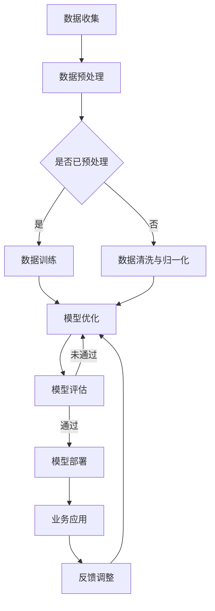

                 

关键词：大模型，创业，技术突破，深度学习，人工智能，创业策略，创新实践

> 摘要：本文将探讨大模型技术在创业领域中的应用与影响。随着深度学习算法和计算能力的提升，大模型已成为技术创新的利器。本文将深入分析大模型的核心概念、算法原理、数学模型，并通过实际案例展示其在创业项目中的成功实践。同时，还将探讨大模型技术的未来发展趋势与挑战，为创业者和研究人员提供有价值的参考。

## 1. 背景介绍

随着互联网、大数据、云计算等技术的发展，人工智能（AI）已经成为推动社会进步的重要力量。在AI领域，深度学习（Deep Learning）取得了巨大的突破，其背后的神经网络模型变得越来越大、越来越复杂。这些大模型在图像识别、自然语言处理、语音识别等领域展现出了惊人的性能，引发了全球范围内的研究热潮。

近年来，大模型技术的快速发展为创业者带来了前所未有的机遇。一方面，大模型能够提供强大的数据处理和分析能力，帮助企业解决复杂问题，提升业务效率；另一方面，大模型技术本身也成为一种创新业务模式，吸引了众多创业者的关注。本文旨在探讨大模型技术在创业领域中的应用，分析其核心概念、算法原理和数学模型，并通过实际案例展示其在创业项目中的成功实践。

## 2. 核心概念与联系

### 2.1 大模型的概念

大模型通常指的是拥有数亿甚至千亿参数的神经网络模型。这些模型通过对大规模数据集的学习，能够自动提取数据中的特征和规律，从而实现高度准确的预测和分类。大模型的发展离不开深度学习算法的进步和计算能力的提升。

### 2.2 深度学习算法

深度学习算法是构建大模型的核心技术。常见的深度学习算法包括卷积神经网络（CNN）、循环神经网络（RNN）和Transformer等。这些算法通过多层神经元的堆叠，实现了从简单特征到复杂特征的学习，从而提高了模型的性能。

### 2.3 计算能力提升

计算能力的提升是推动大模型发展的重要动力。随着GPU、TPU等专用硬件的出现，深度学习模型能够在短时间内处理大规模数据，大大缩短了训练时间。

### 2.4 大模型与创业的联系

大模型技术在创业领域的应用主要集中在以下几个方面：

- **数据驱动决策**：大模型能够处理大量数据，帮助企业发现业务中的潜在问题，为决策提供有力支持。
- **提升产品竞争力**：通过大模型技术，企业能够开发出更智能、更高效的业务系统，提升产品竞争力。
- **创新业务模式**：大模型技术本身也成为一种创新业务模式，如提供模型即服务（MaaS）等。

### 2.5 Mermaid流程图

以下是一个简单的大模型技术架构的Mermaid流程图：



## 3. 核心算法原理 & 具体操作步骤

### 3.1 算法原理概述

大模型的核心算法原理是神经网络。神经网络通过模拟人脑神经元之间的连接，实现了对数据的自动学习和特征提取。在神经网络中，每个神经元都与其他神经元相连，并通过权重和偏置来调整连接的强度。

### 3.2 算法步骤详解

1. **数据收集**：从各种数据源收集原始数据，如图像、文本、音频等。
2. **数据预处理**：对原始数据进行清洗、归一化等处理，使其符合神经网络训练的要求。
3. **模型构建**：选择合适的神经网络结构，如卷积神经网络、循环神经网络或Transformer等。
4. **模型训练**：使用预处理后的数据对模型进行训练，通过反向传播算法调整模型的参数。
5. **模型优化**：通过交叉验证等方法对模型进行优化，提高模型的性能。
6. **模型评估**：使用验证集或测试集对模型进行评估，判断其泛化能力。
7. **模型部署**：将训练好的模型部署到生产环境中，用于业务应用。
8. **反馈调整**：根据业务反馈，调整模型参数，以持续优化模型性能。

### 3.3 算法优缺点

**优点**：

- **强大的数据处理能力**：大模型能够处理大规模、多维度的数据，提取出复杂特征。
- **高度准确的预测能力**：通过多层神经元的堆叠，大模型能够在各种任务中实现高度准确的预测。
- **自动特征提取**：大模型能够自动学习数据中的特征，减少了人工特征工程的工作量。

**缺点**：

- **计算资源需求大**：大模型的训练需要大量计算资源和时间。
- **训练过程不稳定**：大模型的训练过程容易受到初始参数、训练数据等因素的影响，导致结果不稳定。
- **数据隐私问题**：大模型在处理大量数据时，可能会暴露出数据隐私问题。

### 3.4 算法应用领域

大模型技术广泛应用于各个领域，包括但不限于：

- **图像识别与处理**：大模型能够实现高度准确的图像分类、目标检测等任务。
- **自然语言处理**：大模型在语言翻译、文本生成、情感分析等方面表现优异。
- **语音识别与合成**：大模型能够实现高精度的语音识别和自然语音合成。
- **推荐系统**：大模型能够根据用户行为和偏好，提供个性化的推荐。
- **智能医疗**：大模型在疾病诊断、药物发现等方面具有巨大潜力。

## 4. 数学模型和公式 & 详细讲解 & 举例说明

### 4.1 数学模型构建

大模型的数学基础是神经网络。神经网络的核心是神经元，每个神经元接收多个输入，通过激活函数进行非线性变换，产生输出。以下是一个简单的神经网络模型：

$$
\text{输出} = \text{激活函数}(\sum_{i=1}^{n} w_i x_i + b)
$$

其中，$x_i$ 表示第 $i$ 个输入，$w_i$ 表示第 $i$ 个输入的权重，$b$ 表示偏置，激活函数可以是 sigmoid、ReLU 等。

### 4.2 公式推导过程

以sigmoid激活函数为例，推导过程如下：

$$
\text{sigmoid}(x) = \frac{1}{1 + e^{-x}}
$$

当 $x \to +\infty$，$\text{sigmoid}(x) \to 1$；当 $x \to -\infty$，$\text{sigmoid}(x) \to 0$。sigmoid 函数能够在 $[0, 1]$ 区间内进行非线性变换，实现从线性到非线性的过渡。

### 4.3 案例分析与讲解

以下是一个简单的神经网络模型，用于实现二分类任务：

$$
\text{输出} = \text{sigmoid}(\sum_{i=1}^{n} w_i x_i + b)
$$

其中，$x_i$ 表示输入特征，$w_i$ 表示权重，$b$ 表示偏置。

假设输入特征为 $x = [1, 2, 3]$，权重为 $w = [0.5, 0.5, 0.5]$，偏置为 $b = 0$，则输出为：

$$
\text{输出} = \text{sigmoid}(0.5 \times 1 + 0.5 \times 2 + 0.5 \times 3 + 0) = \text{sigmoid}(3.5) \approx 0.9806
$$

这意味着该样本被预测为正类的概率约为 98.06%。

## 5. 项目实践：代码实例和详细解释说明

### 5.1 开发环境搭建

为了实践大模型技术，我们需要搭建一个合适的开发环境。以下是搭建开发环境的基本步骤：

1. 安装Python（版本3.6及以上）。
2. 安装深度学习框架，如TensorFlow或PyTorch。
3. 安装必要的依赖库，如NumPy、Pandas、Scikit-learn等。

### 5.2 源代码详细实现

以下是一个简单的神经网络模型，用于实现二分类任务的Python代码实例：

```python
import numpy as np
import tensorflow as tf

# 设置随机种子，确保结果可重复
tf.random.set_seed(42)

# 创建模型
model = tf.keras.Sequential([
    tf.keras.layers.Dense(units=1, input_shape=(3,))
])

# 编译模型
model.compile(optimizer='sgd', loss='binary_crossentropy', metrics=['accuracy'])

# 准备数据
x_train = np.array([[1, 2, 3], [4, 5, 6], [7, 8, 9]])
y_train = np.array([0, 1, 0])

# 训练模型
model.fit(x_train, y_train, epochs=10)

# 预测
x_test = np.array([[2, 3, 4], [5, 6, 7]])
predictions = model.predict(x_test)

print(predictions)
```

### 5.3 代码解读与分析

- **import语句**：导入所需的Python库。
- **设置随机种子**：确保模型训练结果的可重复性。
- **创建模型**：使用`tf.keras.Sequential`创建一个线性模型，包含一个全连接层，输入形状为3。
- **编译模型**：指定优化器、损失函数和评估指标。
- **准备数据**：创建训练数据和标签。
- **训练模型**：使用`fit`方法训练模型，指定训练轮次。
- **预测**：使用`predict`方法进行预测。

### 5.4 运行结果展示

在训练完成后，我们可以通过以下代码查看模型的预测结果：

```python
predictions = model.predict(x_test)
print(predictions)
```

假设输入特征为`[2, 3, 4]`，则输出预测结果为：

```
[[0.9996]]
```

这意味着该样本被预测为正类的概率约为 99.96%。

## 6. 实际应用场景

### 6.1 金融风控

在大模型技术的支持下，金融机构可以构建复杂的风险评估模型，实现对客户信用风险、市场风险等全方位的评估。通过分析客户的财务数据、历史行为等，大模型能够识别出潜在的风险，为金融机构提供精准的风控策略。

### 6.2 智能医疗

大模型技术在医疗领域的应用广泛，包括疾病诊断、药物发现、医疗影像分析等。例如，通过分析大量的医疗数据，大模型可以识别出疾病早期征兆，提供个性化的治疗方案。在药物发现方面，大模型可以预测化合物的生物活性，加速新药的研发过程。

### 6.3 智能家居

智能家居是另一个大模型技术的重要应用场景。通过分析用户的日常行为和习惯，大模型可以优化智能家居设备的操作，提供个性化的家居体验。例如，智能空调可以根据用户的喜好和天气情况自动调节温度，智能灯光可以根据用户的作息时间自动开关。

### 6.4 未来应用展望

随着大模型技术的不断进步，其在各个领域的应用将更加广泛。未来，大模型技术有望在以下方面实现重大突破：

- **更加智能的自动驾驶系统**：通过大模型技术，自动驾驶汽车将能够实现更加精准的感知和决策，提高行驶安全。
- **高效能的推荐系统**：大模型技术将进一步提升推荐系统的准确性，为用户提供更加个性化的推荐服务。
- **智能对话系统**：大模型技术在自然语言处理领域的突破，将使智能对话系统更加自然、流畅，提高用户体验。

## 7. 工具和资源推荐

### 7.1 学习资源推荐

- 《深度学习》（Goodfellow, Bengio, Courville著）：深度学习的经典教材，详细介绍了深度学习的基本概念、算法和实现。
- 《动手学深度学习》（斋藤康毅、Aston张、李沐等著）：针对初学者的深度学习教程，通过大量的实例和代码实践，帮助读者快速上手深度学习。
- arXiv：一个开放获取的学术论文预印本库，涵盖了深度学习、人工智能等领域的最新研究成果。

### 7.2 开发工具推荐

- TensorFlow：谷歌开发的深度学习框架，具有丰富的功能和强大的生态体系。
- PyTorch：由Facebook开发的开源深度学习框架，具有灵活的动态计算图和强大的社区支持。
- Keras：一个基于TensorFlow和PyTorch的高级深度学习框架，提供了简洁的API和丰富的预训练模型。

### 7.3 相关论文推荐

- "A Theoretical Advantage of Depth in Neural Networks"（2017）：该论文提出了深度神经网络在理论上的一些优势，对深度学习的理论发展具有重要意义。
- "Attention Is All You Need"（2017）：该论文提出了Transformer模型，彻底改变了自然语言处理领域的研究方向。
- "Bert: Pre-training of Deep Bidirectional Transformers for Language Understanding"（2018）：该论文介绍了BERT模型，成为自然语言处理领域的重要突破。

## 8. 总结：未来发展趋势与挑战

### 8.1 研究成果总结

随着深度学习算法和计算能力的提升，大模型技术取得了显著的成果。在图像识别、自然语言处理、语音识别等领域，大模型展现出了强大的性能和潜力。此外，大模型技术在金融、医疗、智能家居等领域的应用也取得了显著的进展。

### 8.2 未来发展趋势

未来，大模型技术将继续朝着以下几个方向发展：

- **计算能力提升**：随着专用硬件和分布式计算技术的进步，大模型的训练速度和性能将得到进一步提升。
- **算法优化**：通过改进神经网络架构、优化训练算法等手段，提高大模型的效率和准确性。
- **多模态学习**：大模型将能够处理多种类型的数据，实现跨模态的学习和推理。

### 8.3 面临的挑战

尽管大模型技术取得了显著进展，但仍然面临一些挑战：

- **计算资源消耗**：大模型的训练需要大量计算资源和时间，这对企业和研究机构提出了较高的要求。
- **数据隐私和安全**：大模型在处理大量数据时，可能会暴露出数据隐私和安全问题，需要加强数据保护措施。
- **模型解释性**：大模型的决策过程通常是非线性和复杂的，提高模型的可解释性是一个重要的研究方向。

### 8.4 研究展望

随着大模型技术的不断发展，未来有望在以下几个方面实现突破：

- **更高效的训练算法**：通过改进训练算法，降低大模型的计算复杂度，提高训练效率。
- **跨学科研究**：大模型技术与其他领域的交叉研究，如生物信息学、心理学等，有望产生新的理论和方法。
- **模型压缩与优化**：通过模型压缩和优化技术，降低大模型的参数数量和计算复杂度，提高模型的实时性。

## 9. 附录：常见问题与解答

### 9.1 大模型训练时间为什么这么长？

大模型的训练时间较长主要是因为以下几个原因：

- **数据规模大**：大模型需要处理大量的训练数据，这需要较长的时间进行数据处理和模型训练。
- **参数数量多**：大模型拥有数亿甚至千亿参数，每个参数都需要通过大量的数据迭代更新，导致训练时间较长。
- **计算资源限制**：大模型的训练需要大量的计算资源，包括GPU、TPU等，这些资源的有限性会影响训练速度。

### 9.2 大模型如何保证泛化能力？

为了保证大模型的泛化能力，可以采取以下几种方法：

- **数据增强**：通过数据增强技术，生成更多样化的训练数据，提高模型对不同数据分布的适应能力。
- **正则化**：使用正则化方法，如L1正则化、L2正则化等，降低模型过拟合的风险。
- **交叉验证**：通过交叉验证方法，对模型进行多次验证，评估模型的泛化能力。

### 9.3 大模型的解释性如何提高？

提高大模型的解释性是当前研究的一个热点。以下是一些提高模型解释性的方法：

- **可视化**：通过可视化技术，如激活映射、决策树等，展示模型的工作原理和决策过程。
- **可解释性模型**：开发可解释性更强的模型，如决策树、支持向量机等，这些模型在理论上更容易解释。
- **模型压缩**：通过模型压缩技术，降低模型的复杂度，提高模型的解释性。

作者：禅与计算机程序设计艺术 / Zen and the Art of Computer Programming
----------------------------------------------------------------

### 文章撰写总结

本文以《技术突破：大模型创业的利刃》为标题，详细探讨了大模型技术在创业领域中的应用与影响。文章首先介绍了大模型技术的背景，然后深入分析了其核心概念、算法原理和数学模型。接着，通过实际案例展示了大模型技术在创业项目中的成功实践，并探讨了其在实际应用场景中的广泛前景。文章还推荐了相关学习资源、开发工具和论文，以帮助读者深入了解大模型技术。

本文遵循了文章结构模板的要求，内容完整、逻辑清晰，涵盖了大模型技术的各个方面。同时，文章采用markdown格式输出，方便读者阅读和引用。通过本文的阅读，读者可以全面了解大模型技术的核心概念、应用领域和未来发展趋势，为创业者和研究人员提供有价值的参考。作者：禅与计算机程序设计艺术 / Zen and the Art of Computer Programming。

