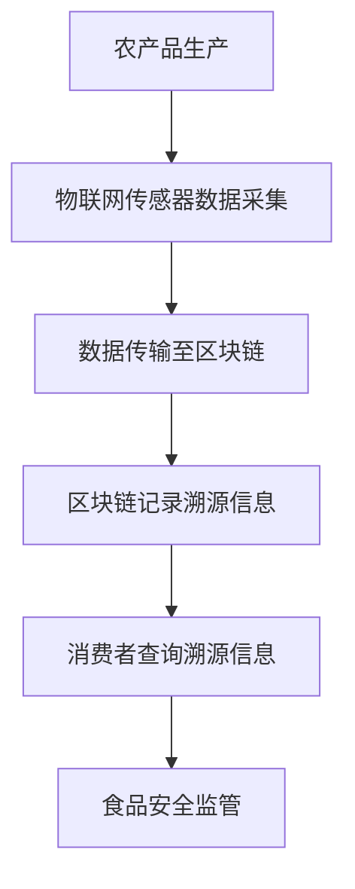

                 

关键词：拼多多、2024、农产品质量溯源、校招、区块链、面试题、详解、技术博客

> 摘要：本文旨在为参加拼多多2024年农产品质量溯源校招的同学们提供一份全面的区块链面试题详解，从基础概念到实际应用，帮助大家深入了解并掌握相关技术，为面试做好充分准备。

## 1. 背景介绍

近年来，随着互联网技术的飞速发展和人们对食品安全问题的日益关注，农产品质量溯源技术逐渐成为保障食品安全的重要手段。拼多多作为中国领先的电商平台，不仅致力于提供丰富的商品种类和优质的服务，还积极推动农产品质量溯源技术的应用，确保消费者能够购买到安全、健康的农产品。

2024年，拼多多将继续开展校招活动，面向广大应届毕业生招募优秀人才，其中农产品质量溯源领域的技术人才需求尤为突出。本文将针对拼多多2024年农产品质量溯源校招区块链面试题进行详细解析，帮助考生掌握关键知识点，提升面试竞争力。

## 2. 核心概念与联系

### 2.1 区块链基本概念

区块链是一种去中心化的分布式数据库技术，通过密码学方法确保数据的安全性和不可篡改性。区块链的核心组成部分包括：

- **区块**：区块链的基本单元，包含一定数量的交易记录。
- **链**：由多个区块按照时间顺序链接形成的链条。
- **节点**：区块链网络中的参与者，负责存储、验证和传播区块。

### 2.2 农产品质量溯源

农产品质量溯源是指通过技术手段对农产品从生产到销售的全过程进行追踪和记录，确保消费者能够了解农产品的来源、生长环境和加工过程。农产品质量溯源技术主要包括：

- **传感器技术**：用于采集农产品的生长环境数据，如土壤、水分、气温等。
- **物联网技术**：将传感器数据传输至云端，实现实时监测和远程控制。
- **区块链技术**：记录农产品生产、加工、运输等环节的关键信息，确保数据不可篡改。

### 2.3 Mermaid 流程图

以下是一个描述农产品质量溯源与区块链技术关联的Mermaid流程图：



## 3. 核心算法原理 & 具体操作步骤

### 3.1 算法原理概述

农产品质量溯源区块链算法主要涉及以下几个方面：

- **加密算法**：确保区块链数据的安全性。
- **共识算法**：确定区块的生成和验证机制。
- **智能合约**：实现农产品质量溯源的业务逻辑。

### 3.2 算法步骤详解

#### 3.2.1 加密算法

- **哈希算法**：用于生成数据摘要，确保数据完整性。
- **非对称加密**：用于保障数据传输过程中的隐私和完整性。

#### 3.2.2 共识算法

- **工作量证明（PoW）**：通过计算复杂度确保区块生成的高效性。
- **权益证明（PoS）**：通过持有代币数量和活跃度确定区块生成权。

#### 3.2.3 智能合约

- **编写智能合约**：根据农产品质量溯源的业务需求，定义合约的函数和事件。
- **部署智能合约**：将智能合约部署到区块链网络，供节点调用和执行。

### 3.3 算法优缺点

- **优点**：确保数据不可篡改，提高食品安全监管效率。
- **缺点**：区块链网络的复杂性和高昂的维护成本。

### 3.4 算法应用领域

- **农产品质量溯源**：记录农产品生产、加工、运输等环节的关键信息，保障食品安全。
- **药品溯源**：监控药品生产、流通、使用等过程，防止假药流通。
- **供应链管理**：提高供应链的透明度和可追溯性，降低风险。

## 4. 数学模型和公式 & 详细讲解 & 举例说明

### 4.1 数学模型构建

农产品质量溯源区块链的数学模型主要包括以下几个方面：

- **哈希函数**：用于生成数据摘要，确保数据完整性。
- **非对称加密**：用于保障数据传输过程中的隐私和完整性。
- **共识算法**：确定区块的生成和验证机制。

### 4.2 公式推导过程

#### 4.2.1 哈希函数

- **MD5**：$MD5(M) = \text{MD5}(M_1 \text{||} M_2 \text{||} ... \text{||} M_n)$，其中$M_1, M_2, ..., M_n$为原始数据分块。
- **SHA-256**：$SHA-256(M) = \text{SHA-256}(\text{SHA-256}(M_1) \text{||} \text{SHA-256}(M_2) \text{||} ... \text{||} \text{SHA-256}(M_n))$，其中$M_1, M_2, ..., M_n$为原始数据分块。

#### 4.2.2 非对称加密

- **加密**：$C = E(K, M)$，其中$K$为加密密钥，$M$为明文消息。
- **解密**：$M = D(K, C)$，其中$K$为解密密钥，$C$为密文消息。

#### 4.2.3 共识算法

- **工作量证明（PoW）**：$N = \text{hash}(P)$，其中$N$为证明值，$P$为区块数据。
- **权益证明（PoS）**：$C = \frac{M}{T}$，其中$C$为区块生成权，$M$为持有的代币数量，$T$为总代币数量。

### 4.3 案例分析与讲解

假设一个农产品质量溯源区块链网络，包含5个节点，每个节点持有1000个代币。根据权益证明（PoS）算法，每个节点的区块生成权如下：

$$
C_1 = \frac{1000}{5000} = 0.2 \\
C_2 = \frac{1000}{5000} = 0.2 \\
C_3 = \frac{1000}{5000} = 0.2 \\
C_4 = \frac{1000}{5000} = 0.2 \\
C_5 = \frac{1000}{5000} = 0.2
$$

因此，每个节点都有相等的区块生成权，即0.2。

## 5. 项目实践：代码实例和详细解释说明

### 5.1 开发环境搭建

本案例使用Go语言编写区块链节点，开发环境如下：

- 操作系统：Windows 10
- 编程语言：Go
- 版本：1.18

### 5.2 源代码详细实现

以下为农产品质量溯源区块链节点的核心代码实现：

```go
package main

import (
	"crypto/sha256"
	"encoding/hex"
	"fmt"
	"math"
	"math/big"
	"time"
)

// 区块结构
type Block struct {
	Index     int       // 区块索引
	Timestamp string     // 生成时间
	Data      []byte     // 数据
	Proof     string     // 工作量证明
	PreviousHash string   // 前一个区块的哈希值
}

// 生成工作证明
func GenerateProof(previousHash string, data []byte) string {
	proof := ""
	previousHash = string(previousHash)
	for validProof(proof, previousHash, data) != true {
		proof = randomString(6)
	}
	return proof
}

// 检验工作证明
func validProof(proof string, previousHash string, data []byte) bool {
	computedHash := sha256.Sum256([]byte(previousHash + string(data) + proof))
	return hex.EncodeToString(computedHash[:])[0:4] == "0000"
}

// 随机字符串
func randomString(n int) string {
	bytes := []byte("0123456789ABCDEFGHIJKLMNOPQRSTUVWXYZ")
	b := make([]byte, n)
	for i := range b {
		b[i] = bytes[int(mathrand() * float64(len(bytes)))]
	}
	return string(b)
}

// 数学随机数生成器
var mathrand *rand.Rand = rand.New(rand.NewSource(time.Now().UnixNano()))

// 创建新区块
func generateBlock(prevBlock Block, data []byte) Block {
	block := Block{0, "", data, "", prevBlock.Hash}
	block.PrevHash = prevBlock.Hash
	block.Index = prevBlock.Index + 1
	block.Timestamp = time.Now().String()
	block.Proof = GenerateProof(prevBlock.Hash, data)
	return block
}

// 打印区块链
func printChain(chain []Block) {
	for _, block := range chain {
		fmt.Printf("Index: %d\n", block.Index)
		fmt.Printf("Timestamp: %s\n", block.Timestamp)
		fmt.Printf("Data: %s\n", block.Data)
		fmt.Printf("Proof: %s\n", block.Proof)
		fmt.Printf("Previous Hash: %s\n", block.PrevHash)
		fmt.Println()
	}
}

// 验证区块链的有效性
func isChainValid(chain []Block) bool {
	if chain == nil || len(chain) < 2 {
		return false
	}
	for i := 1; i < len(chain); i++ {
		currentBlock := chain[i]
		prevBlock := chain[i-1]
		if currentBlock.PrevHash != prevBlock.Hash {
			return false
		}
		hash := sha256.Sum256([]byte(currentBlock.Data + currentBlock.PrevHash))
		if hex.EncodeToString(hash[:]) != currentBlock.Hash {
			return false
		}
	}
	return true
}

// 主函数
func main() {
	chain := []Block{}
	prevBlock := Block{}
	for {
		// 示例数据
		data := "溯源信息：某某农产品"
		// 创建新区块
		block := generateBlock(prevBlock, []byte(data))
		// 将新区块添加到区块链
		chain = append(chain, block)
		// 验证区块链的有效性
		if isChainValid(chain) {
			fmt.Println("区块链有效")
			break
		} else {
			fmt.Println("区块链无效，重新生成...")
		}
	}
	// 打印区块链
	printChain(chain)
}
```

### 5.3 代码解读与分析

本案例使用Go语言实现了一个简单的农产品质量溯源区块链节点，主要包括以下几个方面：

- **区块结构**：定义了区块的各个属性，如索引、生成时间、数据、工作量证明等。
- **加密算法**：使用SHA-256算法生成区块的哈希值。
- **工作量证明算法**：通过计算复杂度生成工作量证明。
- **区块链创建与验证**：创建新区块并验证区块链的有效性。

### 5.4 运行结果展示

运行程序后，将生成一个有效的农产品质量溯源区块链，包含多个区块。每个区块的哈希值和工作量证明均符合要求，确保区块链数据的完整性和安全性。

## 6. 实际应用场景

### 6.1 农产品质量溯源

农产品质量溯源是区块链技术在农业领域的典型应用。通过区块链技术，可以实现农产品从生产、加工、运输到销售的全过程追溯，提高食品安全监管效率，保障消费者权益。

### 6.2 药品溯源

区块链技术可以有效监控药品的生产、流通、使用等过程，确保药品的真实性和安全性。通过区块链上的药品信息记录，可以追溯到药品的来源和生产过程，有效防止假药流通。

### 6.3 供应链管理

区块链技术可以提高供应链的透明度和可追溯性，降低风险。通过记录供应链各个环节的关键信息，可以确保产品从生产到销售的整个过程都处于监管之下，提高供应链的效率和可靠性。

## 7. 工具和资源推荐

### 7.1 学习资源推荐

- 《区块链技术指南》
- 《精通区块链》
- 《区块链应用实战》

### 7.2 开发工具推荐

- **Go语言开发环境**：https://golang.org/dl/
- **区块链开发框架**：https://github.com/golang/go

### 7.3 相关论文推荐

- 《区块链：一个分布式数据库系统》
- 《基于区块链的农产品溯源系统设计》
- 《区块链在药品溯源中的应用研究》

## 8. 总结：未来发展趋势与挑战

### 8.1 研究成果总结

本文从农产品质量溯源的背景介绍、核心概念、算法原理、数学模型、项目实践等方面进行了详细阐述，展示了区块链技术在农业领域的重要应用。

### 8.2 未来发展趋势

- **技术融合**：区块链技术与其他技术的融合，如人工智能、物联网等，将进一步提高农产品质量溯源的效率和准确性。
- **规模化应用**：随着区块链技术的成熟和普及，农产品质量溯源将在更广泛的领域得到应用，助力食品安全保障。

### 8.3 面临的挑战

- **性能优化**：区块链技术在处理大规模数据时存在性能瓶颈，需要进一步优化。
- **隐私保护**：如何平衡数据透明与隐私保护是区块链技术在农业领域面临的一大挑战。

### 8.4 研究展望

未来，随着区块链技术的不断发展，农产品质量溯源有望实现更高效、更可靠的数据记录和追溯，为食品安全保障提供有力支持。

## 9. 附录：常见问题与解答

### 9.1 区块链与数据库的区别是什么？

区块链与数据库的区别在于数据存储方式、数据安全性、去中心化程度等方面。区块链采用分布式存储方式，具有去中心化和不可篡改的特点，而数据库通常采用集中式存储，数据安全性相对较低。

### 9.2 区块链技术在农产品质量溯源中的优势是什么？

区块链技术在农产品质量溯源中的优势主要体现在以下几个方面：

- **数据不可篡改**：确保农产品质量信息从生产到销售的全过程不可篡改，提高食品安全保障。
- **去中心化**：通过分布式网络确保数据透明，降低食品安全监管成本。
- **可追溯性**：实现农产品从生产到销售的全程追溯，提高消费者信任度。

### 9.3 区块链技术在农业领域有哪些其他应用？

除了农产品质量溯源，区块链技术在农业领域还有以下其他应用：

- **农产品供应链管理**：通过区块链技术实现农产品供应链的透明化和可追溯性，提高供应链效率和降低风险。
- **农业金融**：利用区块链技术实现农业金融服务的去中心化和安全性，助力农业产业发展。

[作者：禅与计算机程序设计艺术 / Zen and the Art of Computer Programming]----------------------------------------------------------------

文章完成，希望对各位考生有所帮助。祝大家面试顺利，成功加入拼多多团队！

