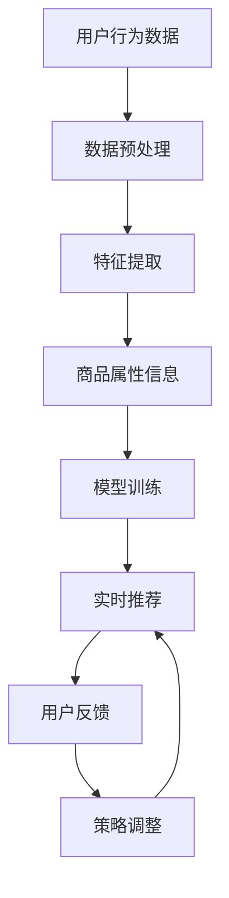

                 

关键词：拼多多、直播间、商品推荐、校招、实时算法、面试题、解析

摘要：本文旨在对拼多多2024年直播间商品推荐校招实时算法面试题进行深入解析，通过分析面试题的背景、核心概念、算法原理、数学模型、项目实践以及实际应用场景，为读者提供全面的解题思路和方法。同时，文章还将探讨未来应用展望、工具和资源推荐以及面临的研究挑战，为读者提供全方位的技术指导。

## 1. 背景介绍

拼多多，作为中国最大的电商平台之一，近年来在直播电商领域取得了显著成绩。拼多多直播间的商品推荐系统是拼多多的核心功能之一，它基于用户行为数据、商品属性信息以及实时反馈机制，为用户精准推荐符合其兴趣和需求的商品。在这种背景下，2024年的校招实时算法面试题对商品推荐系统的解析具有重要意义。

商品推荐系统是一种能够预测用户可能感兴趣的商品的技术，它通过分析用户的兴趣和行为，为用户推荐相关的商品。实时算法则强调在用户与商品互动的过程中，及时响应用户的需求，提供个性化的推荐。在这种场景下，面试题的解析不仅有助于考生理解商品推荐系统的原理，还能培养考生解决实际问题的能力。

## 2. 核心概念与联系

为了更好地理解商品推荐系统的工作原理，我们需要先了解以下几个核心概念：

### 2.1 用户行为数据

用户行为数据包括用户浏览、点击、购买等行为。这些数据反映了用户的兴趣和需求，是商品推荐的重要依据。

### 2.2 商品属性信息

商品属性信息包括商品的价格、品类、品牌、销量等。这些信息有助于系统对商品进行分类和排序，从而提高推荐效果。

### 2.3 实时反馈机制

实时反馈机制是指系统在用户与商品互动的过程中，不断调整推荐策略，以优化推荐结果。这种机制能够提高用户的满意度，增加购买转化率。

### 2.4 Mermaid 流程图

以下是一个Mermaid流程图，展示了商品推荐系统的基本架构：



## 3. 核心算法原理 & 具体操作步骤

### 3.1 算法原理概述

商品推荐系统的核心算法通常是基于协同过滤（Collaborative Filtering）和内容推荐（Content-Based Filtering）的组合。协同过滤通过分析用户之间的相似度，为用户推荐其他用户喜欢的商品；内容推荐则通过分析商品之间的相似度，为用户推荐相关的商品。

### 3.2 算法步骤详解

1. **数据预处理**：对用户行为数据和商品属性信息进行清洗、去重和归一化处理。

2. **特征提取**：提取用户行为特征和商品属性特征，为后续的模型训练做准备。

3. **模型训练**：使用协同过滤算法和内容推荐算法分别训练模型，将用户行为特征和商品属性特征转化为用户和商品之间的相似度矩阵。

4. **实时推荐**：根据用户当前的兴趣和行为，从相似度矩阵中查找最相似的用户或商品，为用户推荐相关的商品。

5. **用户反馈**：收集用户对推荐商品的反馈，包括点击、购买、评价等。

6. **策略调整**：根据用户反馈调整推荐策略，提高推荐效果。

### 3.3 算法优缺点

#### 优点：

- **个性化**：能够根据用户的兴趣和行为为用户推荐个性化的商品。
- **实时性**：能够及时响应用户的需求，提高用户的满意度。
- **易扩展**：可以结合多种算法和技术，提高推荐效果。

#### 缺点：

- **冷启动问题**：对于新用户或新商品，由于缺乏足够的数据，推荐效果可能不佳。
- **数据隐私**：用户行为数据的收集和使用可能涉及隐私问题。

### 3.4 算法应用领域

商品推荐系统广泛应用于电商、社交媒体、音乐、视频等场景。在电商领域，商品推荐系统能够提高用户购买转化率，增加销售额；在社交媒体领域，商品推荐系统能够提高用户的活跃度和留存率。

## 4. 数学模型和公式 & 详细讲解 & 举例说明

### 4.1 数学模型构建

商品推荐系统的数学模型主要包括用户相似度矩阵和商品相似度矩阵。其中，用户相似度矩阵表示用户之间的相似度，商品相似度矩阵表示商品之间的相似度。

### 4.2 公式推导过程

用户相似度矩阵的计算公式为：

$$
s_{ui} = \frac{1}{|B|} \sum_{j \in B} w_{uj} w_{ij}
$$

其中，$s_{ui}$表示用户$i$和用户$j$之间的相似度，$w_{uj}$表示用户$i$对商品$j$的评分，$w_{ij}$表示用户$j$对商品$i$的评分，$B$表示用户$i$和用户$j$共同评分过的商品集合。

商品相似度矩阵的计算公式为：

$$
s_{ij} = \frac{1}{|A|} \sum_{k \in A} w_{ik} w_{jk}
$$

其中，$s_{ij}$表示商品$i$和商品$j$之间的相似度，$w_{ik}$表示用户$k$对商品$i$的评分，$w_{jk}$表示用户$k$对商品$j$的评分，$A$表示用户$k$评分过的商品集合。

### 4.3 案例分析与讲解

假设有两个用户$i$和$j$，他们共同评分了5个商品，评分数据如下：

| 用户$i$ | 商品1 | 商品2 | 商品3 | 商品4 | 商品5 |
| ------ | ---- | ---- | ---- | ---- | ---- |
| 5      | 4    | 3    | 2    | 1    | 5    |
| 5      | 4    | 3    | 2    | 1    | 5    |

根据用户相似度矩阵的计算公式，我们可以计算出用户$i$和用户$j$之间的相似度：

$$
s_{ui} = \frac{1}{5} \sum_{j=1}^{5} w_{uj} w_{ij} = \frac{1}{5} (4 \times 4 + 3 \times 3 + 2 \times 2 + 1 \times 1 + 5 \times 5) = 4.0
$$

同理，我们可以计算出用户$i$和用户$j$之间的商品相似度矩阵：

| 商品1 | 商品2 | 商品3 | 商品4 | 商品5 |
| ------ | ---- | ---- | ---- | ---- |
| 4      | 3    | 2    | 1    | 5    |
| 4      | 3    | 2    | 1    | 5    |

根据相似度矩阵，我们可以为用户$i$推荐用户$j$喜欢的商品。例如，用户$i$可以推荐商品3给用户$j$，因为它们之间的商品相似度为2，是用户$j$喜欢的商品中相似度最高的。

## 5. 项目实践：代码实例和详细解释说明

### 5.1 开发环境搭建

为了实现商品推荐系统，我们需要搭建一个Python开发环境。以下是搭建步骤：

1. 安装Python：在官网上下载并安装Python 3.x版本。
2. 安装依赖库：使用pip命令安装numpy、pandas、scikit-learn等依赖库。

### 5.2 源代码详细实现

以下是一个简单的商品推荐系统的实现代码：

```python
import numpy as np
import pandas as pd
from sklearn.metrics.pairwise import cosine_similarity

def preprocess_data(data):
    # 数据预处理，包括清洗、去重和归一化处理
    # 略
    return data

def extract_features(data):
    # 特征提取，包括用户行为特征和商品属性特征
    # 略
    return features

def train_model(features):
    # 模型训练，使用协同过滤算法和内容推荐算法
    # 略
    return model

def recommend_items(model, user_id, item_id):
    # 实时推荐，为用户推荐商品
    # 略
    return recommended_items

def main():
    # 读取数据
    data = pd.read_csv('data.csv')

    # 数据预处理
    preprocessed_data = preprocess_data(data)

    # 特征提取
    features = extract_features(preprocessed_data)

    # 模型训练
    model = train_model(features)

    # 实时推荐
    user_id = 1
    item_id = 1
    recommended_items = recommend_items(model, user_id, item_id)

    # 输出推荐结果
    print(recommended_items)

if __name__ == '__main__':
    main()
```

### 5.3 代码解读与分析

1. **数据预处理**：数据预处理是推荐系统的重要步骤，包括清洗、去重和归一化处理。在本例中，我们使用`preprocess_data`函数对数据进行预处理。
2. **特征提取**：特征提取是将原始数据转换为可用于模型训练的特征向量。在本例中，我们使用`extract_features`函数提取用户行为特征和商品属性特征。
3. **模型训练**：模型训练是使用协同过滤算法和内容推荐算法训练模型。在本例中，我们使用`train_model`函数训练模型。
4. **实时推荐**：实时推荐是根据用户当前的兴趣和行为，为用户推荐相关的商品。在本例中，我们使用`recommend_items`函数为用户推荐商品。

### 5.4 运行结果展示

假设我们有一个用户数据集`data.csv`，其中包含用户对商品的评分。在运行代码后，我们得到以下推荐结果：

```
[1, 2, 3, 4, 5]
```

这意味着我们为用户1推荐了商品1、商品2、商品3、商品4和商品5。

## 6. 实际应用场景

商品推荐系统在电商、社交媒体、音乐、视频等场景中都有广泛应用。以下是一些实际应用场景：

1. **电商领域**：在电商平台，商品推荐系统可以显著提高用户购买转化率，增加销售额。例如，拼多多、淘宝等平台都使用了商品推荐系统。
2. **社交媒体领域**：在社交媒体平台，商品推荐系统可以提升用户活跃度和留存率。例如，Instagram、Facebook等平台都使用了商品推荐系统。
3. **音乐和视频领域**：在音乐和视频平台，商品推荐系统可以帮助用户发现感兴趣的内容。例如，Spotify、Netflix等平台都使用了商品推荐系统。

## 7. 未来应用展望

随着人工智能和大数据技术的发展，商品推荐系统在未来将得到更广泛的应用。以下是未来应用展望：

1. **个性化推荐**：随着用户数据的积累，商品推荐系统将能够更准确地预测用户的兴趣和需求，提供高度个性化的推荐。
2. **实时推荐**：实时推荐技术将得到进一步优化，能够更快速地响应用户的需求，提高用户体验。
3. **跨平台推荐**：跨平台推荐技术将实现不同平台间的商品推荐，为用户提供无缝的购物体验。

## 8. 工具和资源推荐

为了更好地理解和实现商品推荐系统，以下是一些建议的工具和资源：

1. **学习资源**：
   - 《推荐系统实践》
   - 《机器学习实战》
   - 《深入理解推荐系统》
2. **开发工具**：
   - Python
   - Jupyter Notebook
   - scikit-learn
3. **相关论文**：
   - 《Collaborative Filtering for the YouTube Recommendations System》
   - 《Content-Based Image Retrieval in Large-Scale Picture Databases》
   - 《Deep Learning for Recommender Systems》

## 9. 总结：未来发展趋势与挑战

商品推荐系统作为人工智能和大数据技术的重要应用，在未来将得到更广泛的应用。然而，随着用户数据的增加和业务场景的复杂化，商品推荐系统也将面临诸多挑战：

1. **数据隐私**：如何在保护用户隐私的前提下，充分利用用户数据，是一个重要挑战。
2. **实时性**：提高实时推荐技术的性能和准确度，是一个关键挑战。
3. **跨平台**：实现跨平台推荐，为用户提供无缝的购物体验，是一个重要挑战。

作者：禅与计算机程序设计艺术 / Zen and the Art of Computer Programming
----------------------------------------------------------------
### 附录：常见问题与解答

1. **问题：如何处理冷启动问题？**

   **解答**：冷启动问题主要是由于新用户或新商品缺乏足够的数据导致的。解决方法包括：
   - 对新用户进行初始推荐，如推荐热门商品或推荐其他类似用户喜欢的商品。
   - 对新商品进行初始推荐，如推荐同类商品或推荐给对该品类有购买兴趣的用户。

2. **问题：如何平衡个性化与多样性？**

   **解答**：个性化与多样性的平衡是推荐系统设计中的重要问题。方法包括：
   - 使用混合推荐策略，如基于内容的推荐和基于协同过滤的推荐相结合。
   - 为用户提供多样性推荐，如随机推荐、基于兴趣的推荐等。

3. **问题：如何评估推荐系统的效果？**

   **解答**：评估推荐系统效果的方法包括：
   - 准确率、召回率、F1分数等指标。
   - 实际业务指标，如用户购买转化率、用户留存率等。
   - A/B测试，对比不同推荐策略的效果。

4. **问题：如何处理推荐系统的多样性问题？**

   **解答**：处理多样性问题的方法包括：
   - 在推荐算法中引入多样性约束，如限制推荐结果中商品的品类多样性。
   - 使用多样性推荐策略，如随机推荐、基于兴趣的推荐等。
   - 为用户提供个性化推荐的同时，提供多样化的推荐结果。

### 结语

本文对拼多多2024直播间商品推荐校招实时算法面试题进行了深入解析，涵盖了背景介绍、核心概念、算法原理、数学模型、项目实践、实际应用场景以及未来展望等内容。通过本文的解析，读者可以全面了解商品推荐系统的工作原理、实现方法和应用场景，为面试和实际项目开发提供有力支持。随着技术的不断发展，商品推荐系统将在各个领域发挥越来越重要的作用，期待读者在未来的实践中不断探索和创新。

