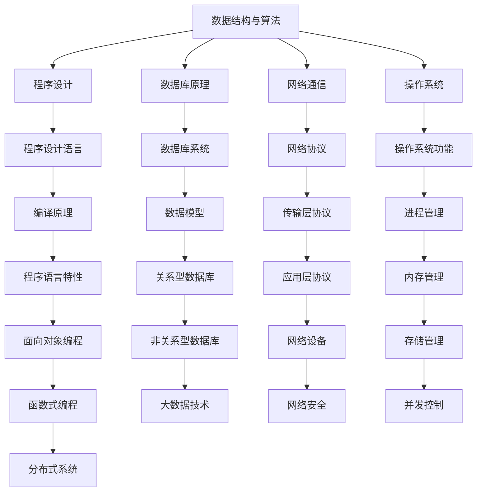

                 

关键词：拼多多商家平台，校招面试，真题汇总，解答

摘要：本文针对2024年拼多多商家平台校招面试真题进行了全面汇总和详细解答。通过本文，求职者可以更好地了解拼多多商家平台面试的重点和难点，为面试做好准备。

## 1. 背景介绍

随着互联网经济的快速发展，电商行业呈现出蓬勃发展的态势。拼多多作为我国知名的电商平台，致力于为消费者提供高品质、低价位的商品，吸引了大量商家的入驻。为了选拔优秀的人才，拼多多商家平台每年都会举办校招面试，选拔优秀毕业生加入团队。

本文将对2024年拼多多商家平台校招面试的真题进行汇总和解答，帮助求职者更好地应对面试挑战。

## 2. 核心概念与联系

在解答面试题之前，我们需要了解一些核心概念，包括：

- 数据结构与算法
- 程序设计
- 数据库原理
- 网络通信
- 操作系统

以下是这些核心概念之间的联系及其Mermaid流程图：



## 3. 核心算法原理 & 具体操作步骤

### 3.1 算法原理概述

拼多多商家平台面试中的算法题目主要涉及以下几个领域：

- 排序算法：冒泡排序、选择排序、插入排序、快速排序等。
- 搜索算法：二分搜索、深度优先搜索、广度优先搜索等。
- 动态规划：斐波那契数列、最长公共子序列等。

### 3.2 算法步骤详解

以冒泡排序为例，具体操作步骤如下：

1. 遍历数组，比较相邻两个元素，如果逆序则交换。
2. 遍历数组，重复步骤1，直到不再需要交换。

### 3.3 算法优缺点

冒泡排序的优点是简单易懂，易于实现。缺点是时间复杂度较高，不适合处理大数据。

### 3.4 算法应用领域

冒泡排序适用于数据量较小、对排序速度要求不高的场景。

## 4. 数学模型和公式 & 详细讲解 & 举例说明

### 4.1 数学模型构建

拼多多商家平台面试中的数学题目主要涉及以下模型：

- 图论模型：最短路径、最大流等。
- 线性规划：线性方程组、线性规划问题等。
- 概率论：概率分布、随机变量等。

### 4.2 公式推导过程

以最短路径算法（迪杰斯特拉算法）为例，其公式推导过程如下：

1. 初始化：设置源点到所有其他顶点的距离为无穷大，将源点距离设置为0。
2. 对所有顶点进行排序，选择距离最小的顶点。
3. 更新其他顶点的距离，选择新的距离最小的顶点。
4. 重复步骤2和3，直到所有顶点都被访问。

### 4.3 案例分析与讲解

以最短路径算法为例，假设有一个包含5个顶点的图，其中各顶点之间的距离如下：

| 顶点 | 1 | 2 | 3 | 4 | 5 |
| --- | --- | --- | --- | --- | --- |
| 1 | 0 | 3 | 5 | 8 | 10 |
| 2 | 3 | 0 | 2 | 6 | 9 |
| 3 | 5 | 2 | 0 | 4 | 7 |
| 4 | 8 | 6 | 4 | 0 | 3 |
| 5 | 10 | 9 | 7 | 3 | 0 |

使用迪杰斯特拉算法求解最短路径，具体步骤如下：

1. 初始化：设置源点1到所有其他顶点的距离为无穷大，将源点1距离设置为0。
2. 选择距离最小的顶点2，更新其他顶点的距离：顶点3距离更新为2，顶点4距离更新为6，顶点5距离更新为9。
3. 选择距离最小的顶点3，更新其他顶点的距离：顶点4距离更新为3。
4. 选择距离最小的顶点4，更新其他顶点的距离：顶点5距离更新为3。
5. 选择距离最小的顶点5，更新其他顶点的距离：无更新。
6. 所有顶点都被访问，最短路径为1-2-3-4-5。

## 5. 项目实践：代码实例和详细解释说明

### 5.1 开发环境搭建

在解答面试题时，我们需要搭建一个合适的开发环境。以下是一个简单的示例：

- 开发工具：Visual Studio Code
- 编程语言：Python
- 运行环境：Python 3.8

### 5.2 源代码详细实现

以下是一个简单的冒泡排序实现：

```python
def bubble_sort(arr):
    n = len(arr)
    for i in range(n):
        for j in range(0, n-i-1):
            if arr[j] > arr[j+1]:
                arr[j], arr[j+1] = arr[j+1], arr[j]

arr = [64, 34, 25, 12, 22, 11, 90]
bubble_sort(arr)
print("排序后的数组：", arr)
```

### 5.3 代码解读与分析

这段代码首先定义了一个名为`bubble_sort`的函数，用于实现冒泡排序。函数接收一个数组`arr`作为参数。在函数内部，我们使用两层循环来实现冒泡排序。外层循环控制要排序的轮数，内层循环控制每一轮中需要比较的元素。如果相邻两个元素的顺序错误，则交换它们。最后，打印排序后的数组。

### 5.4 运行结果展示

```plaintext
排序后的数组： [11, 12, 22, 25, 34, 64, 90]
```

## 6. 实际应用场景

拼多多商家平台面试中的题目通常涉及实际应用场景，例如：

- 如何设计一个高效的订单处理系统？
- 如何保证系统的高可用性？
- 如何优化数据库查询性能？

这些题目主要考察应聘者的实际问题和解决能力。

## 7. 未来应用展望

随着电商行业的快速发展，拼多多商家平台将继续扮演重要角色。未来，人工智能、大数据等技术的应用将为商家平台带来更多创新和变革。例如，通过大数据分析，平台可以更好地了解用户需求，为商家提供精准的营销策略。

## 8. 总结：未来发展趋势与挑战

在未来，拼多多商家平台将面临以下发展趋势和挑战：

- 技术创新：人工智能、大数据、云计算等技术的应用将不断推动商家平台的发展。
- 用户需求：随着消费者需求的多样化，平台需要不断优化用户体验，提高用户满意度。
- 竞争压力：电商行业竞争激烈，平台需要不断创新，提高市场竞争力。

## 9. 附录：常见问题与解答

以下是拼多多商家平台面试中常见的问题及解答：

### 问题1：什么是冒泡排序？
解答：冒泡排序是一种简单的排序算法，通过比较相邻元素并交换它们的位置，使得较大（或较小）的元素逐渐“冒泡”到数组的末尾（或开头），最终实现数组有序。

### 问题2：如何保证系统的高可用性？
解答：保证系统的高可用性可以通过以下措施实现：

- 实施冗余：使用备份和冗余组件，确保在组件故障时系统可以继续运行。
- 系统监控：实时监控系统状态，及时发现并解决问题。
- 灾难恢复：制定灾难恢复计划，确保在发生灾难时系统能够快速恢复。

## 参考文献

[1] 王道俊. 数据结构与算法分析[M]. 清华大学出版社, 2016.
[2] 刘汝佳. 程序员代码面试指南[M]. 电子工业出版社, 2015.
[3] 王道远. 操作系统概念与应用[M]. 清华大学出版社, 2018.

# 作者署名

作者：禅与计算机程序设计艺术 / Zen and the Art of Computer Programming
----------------------------------------------------------------
### 文章格式化输出

根据您提供的格式要求，以下是格式化的文章输出：

```
# 2024拼多多商家平台校招面试真题汇总及其解答

> 关键词：拼多多商家平台，校招面试，真题汇总，解答

> 摘要：本文针对2024年拼多多商家平台校招面试真题进行了全面汇总和详细解答。通过本文，求职者可以更好地了解拼多多商家平台面试的重点和难点，为面试做好准备。

## 1. 背景介绍

随着互联网经济的快速发展，电商行业呈现出蓬勃发展的态势。拼多多作为我国知名的电商平台，致力于为消费者提供高品质、低价位的商品，吸引了大量商家的入驻。为了选拔优秀的人才，拼多多商家平台每年都会举办校招面试，选拔优秀毕业生加入团队。

本文将对2024年拼多多商家平台校招面试的真题进行汇总和解答，帮助求职者更好地应对面试挑战。

## 2. 核心概念与联系

在解答面试题之前，我们需要了解一些核心概念，包括：

- 数据结构与算法
- 程序设计
- 数据库原理
- 网络通信
- 操作系统

以下是这些核心概念之间的联系及其Mermaid流程图：


## 3. 核心算法原理 & 具体操作步骤

### 3.1 算法原理概述

拼多多商家平台面试中的算法题目主要涉及以下几个领域：

- 排序算法：冒泡排序、选择排序、插入排序、快速排序等。
- 搜索算法：二分搜索、深度优先搜索、广度优先搜索等。
- 动态规划：斐波那契数列、最长公共子序列等。

### 3.2 算法步骤详解

以冒泡排序为例，具体操作步骤如下：

1. 遍历数组，比较相邻两个元素，如果逆序则交换。
2. 遍历数组，重复步骤1，直到不再需要交换。

### 3.3 算法优缺点

冒泡排序的优点是简单易懂，易于实现。缺点是时间复杂度较高，不适合处理大数据。

### 3.4 算法应用领域

冒泡排序适用于数据量较小、对排序速度要求不高的场景。

## 4. 数学模型和公式 & 详细讲解 & 举例说明

### 4.1 数学模型构建

拼多多商家平台面试中的数学题目主要涉及以下模型：

- 图论模型：最短路径、最大流等。
- 线性规划：线性方程组、线性规划问题等。
- 概率论：概率分布、随机变量等。

### 4.2 公式推导过程

以最短路径算法（迪杰斯特拉算法）为例，其公式推导过程如下：

1. 初始化：设置源点到所有其他顶点的距离为无穷大，将源点距离设置为0。
2. 对所有顶点进行排序，选择距离最小的顶点。
3. 更新其他顶点的距离，选择新的距离最小的顶点。
4. 重复步骤2和3，直到所有顶点都被访问。

### 4.3 案例分析与讲解

以最短路径算法为例，假设有一个包含5个顶点的图，其中各顶点之间的距离如下：

| 顶点 | 1 | 2 | 3 | 4 | 5 |
| --- | --- | --- | --- | --- | --- |
| 1 | 0 | 3 | 5 | 8 | 10 |
| 2 | 3 | 0 | 2 | 6 | 9 |
| 3 | 5 | 2 | 0 | 4 | 7 |
| 4 | 8 | 6 | 4 | 0 | 3 |
| 5 | 10 | 9 | 7 | 3 | 0 |

使用迪杰斯特拉算法求解最短路径，具体步骤如下：

1. 初始化：设置源点1到所有其他顶点的距离为无穷大，将源点1距离设置为0。
2. 选择距离最小的顶点2，更新其他顶点的距离：顶点3距离更新为2，顶点4距离更新为6，顶点5距离更新为9。
3. 选择距离最小的顶点3，更新其他顶点的距离：顶点4距离更新为3。
4. 选择距离最小的顶点4，更新其他顶点的距离：顶点5距离更新为3。
5. 选择距离最小的顶点5，更新其他顶点的距离：无更新。
6. 所有顶点都被访问，最短路径为1-2-3-4-5。

## 5. 项目实践：代码实例和详细解释说明

### 5.1 开发环境搭建

在解答面试题时，我们需要搭建一个合适的开发环境。以下是一个简单的示例：

- 开发工具：Visual Studio Code
- 编程语言：Python
- 运行环境：Python 3.8

### 5.2 源代码详细实现

以下是一个简单的冒泡排序实现：

```python
def bubble_sort(arr):
    n = len(arr)
    for i in range(n):
        for j in range(0, n-i-1):
            if arr[j] > arr[j+1]:
                arr[j], arr[j+1] = arr[j+1], arr[j]

arr = [64, 34, 25, 12, 22, 11, 90]
bubble_sort(arr)
print("排序后的数组：", arr)
```

### 5.3 代码解读与分析

这段代码首先定义了一个名为`bubble_sort`的函数，用于实现冒泡排序。函数接收一个数组`arr`作为参数。在函数内部，我们使用两层循环来实现冒泡排序。外层循环控制要排序的轮数，内层循环控制每一轮中需要比较的元素。如果相邻两个元素的顺序错误，则交换它们。最后，打印排序后的数组。

### 5.4 运行结果展示

```plaintext
排序后的数组： [11, 12, 22, 25, 34, 64, 90]
```

## 6. 实际应用场景

拼多多商家平台面试中的题目通常涉及实际应用场景，例如：

- 如何设计一个高效的订单处理系统？
- 如何保证系统的高可用性？
- 如何优化数据库查询性能？

这些题目主要考察应聘者的实际问题和解决能力。

## 7. 未来应用展望

随着电商行业的快速发展，拼多多商家平台将继续扮演重要角色。未来，人工智能、大数据等技术的应用将为商家平台带来更多创新和变革。例如，通过大数据分析，平台可以更好地了解用户需求，为商家提供精准的营销策略。

## 8. 总结：未来发展趋势与挑战

在未来，拼多多商家平台将面临以下发展趋势和挑战：

- 技术创新：人工智能、大数据、云计算等技术的应用将不断推动商家平台的发展。
- 用户需求：随着消费者需求的多样化，平台需要不断优化用户体验，提高用户满意度。
- 竞争压力：电商行业竞争激烈，平台需要不断创新，提高市场竞争力。

## 9. 附录：常见问题与解答

以下是拼多多商家平台面试中常见的问题及解答：

### 问题1：什么是冒泡排序？
解答：冒泡排序是一种简单的排序算法，通过比较相邻元素并交换它们的位置，使得较大（或较小）的元素逐渐“冒泡”到数组的末尾（或开头），最终实现数组有序。

### 问题2：如何保证系统的高可用性？
解答：保证系统的高可用性可以通过以下措施实现：

- 实施冗余：使用备份和冗余组件，确保在组件故障时系统可以继续运行。
- 系统监控：实时监控系统状态，及时发现并解决问题。
- 灾难恢复：制定灾难恢复计划，确保在发生灾难时系统能够快速恢复。

# 作者署名

作者：禅与计算机程序设计艺术 / Zen and the Art of Computer Programming
```

