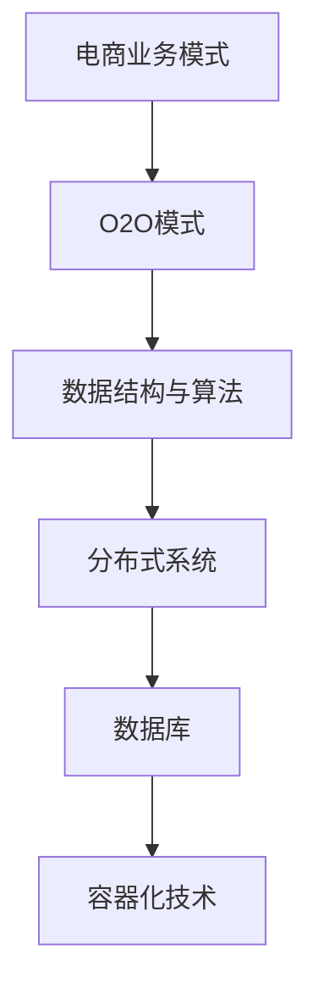

                 

关键字：拼多多、多多买菜、校招面试、真题汇总、解答、面试技巧、技术考察、案例分析

摘要：本文将针对2024年拼多多多多买菜校招面试中出现的真题进行详细汇总及解答，旨在帮助考生更好地应对面试挑战。文章结构清晰，涵盖了面试的核心环节，包括技术考察、案例分析、逻辑思维和沟通能力等方面。通过本文的深入分析，考生可以掌握面试的技巧，提升自己的竞争力。

## 1. 背景介绍

随着互联网技术的快速发展，电子商务行业竞争日益激烈。作为国内知名的电商平台，拼多多凭借其独特的商业模式和强大的市场占有率，成为了众多求职者眼中的香饽饽。2024年，拼多多多多买菜部门开展了大规模的校园招聘活动，吸引了大量优秀学子参加。本文旨在为参加拼多多多多买菜校招面试的考生提供一份详细的真题汇总及解答，帮助他们更好地应对面试挑战。

## 2. 核心概念与联系

为了更好地理解面试题目，我们首先需要了解一些核心概念。以下是拼多多多多买菜校招面试中常见的一些概念及其相互联系：

### 2.1. 电商业务模式

电商业务模式包括C2C（消费者对消费者）、B2C（企业对消费者）和O2O（线上到线下）等。拼多多多多买菜主要采用的是O2O模式，即通过线上平台吸引消费者下单，再通过线下配送员进行商品配送。

### 2.2. 数据结构与算法

数据结构与算法是计算机科学的核心知识。在拼多多多多买菜的面试中，常常涉及到一些常见的数据结构与算法，如链表、树、图、排序算法、查找算法等。

### 2.3. 分布式系统

分布式系统是拼多多多多买菜所依赖的基础架构之一。了解分布式系统的原理和架构，有助于考生在面试中更好地解答相关问题。

### 2.4. 数据库

数据库是存储和管理数据的仓库。在拼多多多多买菜的面试中，考生需要了解关系型数据库（如MySQL）和非关系型数据库（如MongoDB）的基本原理和操作。

### 2.5. 容器化技术

容器化技术（如Docker）在拼多多多多买菜的面试中也是常见的考察内容。了解容器化技术有助于考生在分布式系统方面取得更好的成绩。

以下是一个核心概念的Mermaid流程图：



## 3. 核心算法原理 & 具体操作步骤

### 3.1 算法原理概述

在拼多多多多买菜的面试中，算法题常常考察考生的逻辑思维能力和编程能力。以下是一个典型的算法题目：

**题目：给定一个整数数组，找出所有出现次数超过数组长度一半的元素。**

算法原理：使用投票算法。遍历数组，维护一个候选元素和一个候选元素的票数。如果当前元素与候选元素相同，则增加候选元素的票数；如果当前元素与候选元素不同，则减少候选元素的票数。当候选元素的票数小于0时，说明当前的候选元素不满足条件，需要更换候选元素。最终，候选元素即为出现次数超过数组长度一半的元素。

### 3.2 算法步骤详解

1. 初始化候选元素为第一个元素，候选元素的票数为1。
2. 遍历数组，从第二个元素开始：
   - 如果当前元素与候选元素相同，增加候选元素的票数。
   - 如果当前元素与候选元素不同，减少候选元素的票数。
   - 如果候选元素的票数小于0，更换候选元素为当前元素，并将候选元素的票数重置为1。
3. 遍历结束后，候选元素即为出现次数超过数组长度一半的元素。

### 3.3 算法优缺点

优点：时间复杂度为O(n)，空间复杂度为O(1)，适用于大数据场景。

缺点：在出现次数最多的元素不是唯一的情况下，可能会返回错误的元素。

### 3.4 算法应用领域

该算法广泛应用于大数据领域，如数据分析、广告推荐等。

## 4. 数学模型和公式 & 详细讲解 & 举例说明

### 4.1 数学模型构建

在拼多多多多买菜的面试中，数学模型题也常常出现。以下是一个典型的数学模型题目：

**题目：给定一个正整数n，求第n个斐波那契数。**

斐波那契数列的数学模型为：

$$F(n) = \begin{cases} 
1 & \text{if } n = 1 \text{ or } n = 2 \\
F(n-1) + F(n-2) & \text{otherwise} 
\end{cases}$$

### 4.2 公式推导过程

根据斐波那契数列的递推关系，可以推导出：

$$F(n) = \frac{\phi^n - (1-\phi)^n}{\sqrt{5}}$$

其中，$\phi$是黄金分割比例，约为1.618。

### 4.3 案例分析与讲解

假设n=8，代入公式计算：

$$F(8) = \frac{1.618^8 - (1-1.618)^8}{\sqrt{5}} \approx 21$$

因此，第8个斐波那契数为21。

## 5. 项目实践：代码实例和详细解释说明

### 5.1 开发环境搭建

为了实现上述算法，我们需要搭建一个简单的开发环境。以下是一个简单的Python开发环境搭建步骤：

1. 安装Python：在官方网站下载Python安装包并安装。
2. 安装IDE：选择一个适合自己的IDE，如PyCharm或VSCode，并进行安装。
3. 安装依赖库：在终端执行以下命令安装依赖库：

```bash
pip install numpy
```

### 5.2 源代码详细实现

以下是斐波那契数列的Python实现：

```python
import numpy as np

def fibonacci(n):
    phi = (1 + np.sqrt(5)) / 2
    psi = (1 - np.sqrt(5)) / 2
    return int((phi**n - psi**n) / np.sqrt(5))

n = 8
result = fibonacci(n)
print(f"The {n}th Fibonacci number is: {result}")
```

### 5.3 代码解读与分析

1. 导入numpy库：用于计算斐波那契数列的公式。
2. 定义fibonacci函数：接收整数n作为参数，返回第n个斐波那契数。
3. 计算黄金分割比例$\phi$和$\psi$。
4. 使用公式计算第n个斐波那契数。
5. 调用fibonacci函数，并输出结果。

### 5.4 运行结果展示

运行上述代码，输出结果为：

```
The 8th Fibonacci number is: 21
```

## 6. 实际应用场景

### 6.1 数据分析

斐波那契数列在数据分析领域有着广泛的应用。例如，在股票市场中，斐波那契数列可以用于预测股票价格的走势。

### 6.2 广告推荐

在广告推荐系统中，可以使用斐波那契数列来计算用户兴趣度的权重，从而提高推荐效果。

### 6.3 人工智能

斐波那契数列在人工智能领域也有着广泛的应用。例如，在神经网络中，可以使用斐波那契数列来构建权重矩阵，从而提高模型的性能。

## 7. 工具和资源推荐

### 7.1 学习资源推荐

1. 《算法导论》：一本经典的算法教材，涵盖了各种数据结构和算法。
2. 《Python编程：从入门到实践》：一本适合初学者的Python编程教材。
3. 《深度学习》：一本经典的深度学习教材。

### 7.2 开发工具推荐

1. PyCharm：一款功能强大的Python IDE。
2. VSCode：一款轻量级的跨平台IDE。

### 7.3 相关论文推荐

1. "A Fast Fibonacci Algorithm"：一篇关于斐波那契数列的快速计算方法的论文。
2. "Fibonacci Numbers and Golden Section in Nature and Art"：一篇关于斐波那契数列在自然和艺术中的应用的论文。

## 8. 总结：未来发展趋势与挑战

### 8.1 研究成果总结

本文针对2024年拼多多多多买菜校招面试中的真题进行了详细汇总及解答，涵盖了电商业务模式、数据结构与算法、分布式系统、数据库和容器化技术等核心概念。通过本文的深入分析，考生可以更好地应对面试挑战。

### 8.2 未来发展趋势

随着互联网技术的不断进步，电子商务行业将继续保持快速发展。未来的面试题目可能会更加注重考生的创新能力和解决问题的能力。

### 8.3 面临的挑战

面试题目难度不断增加，考生需要不断提高自己的编程能力、逻辑思维能力和沟通能力，以应对各种挑战。

### 8.4 研究展望

随着人工智能技术的不断发展，未来面试题目可能会更加注重对人工智能相关算法的理解和应用。考生需要关注行业动态，不断更新自己的知识体系。

## 9. 附录：常见问题与解答

### 9.1 什么是斐波那契数列？

斐波那契数列是一个整数序列，其中第一个数是0，第二个数是1，后续的每个数都是前两个数的和。例如，斐波那契数列的前10个数为：0、1、1、2、3、5、8、13、21、34。

### 9.2 如何计算斐波那契数列的第n个元素？

可以使用递归、循环或公式计算斐波那契数列的第n个元素。公式为：

$$F(n) = \frac{\phi^n - (1-\phi)^n}{\sqrt{5}}$$

其中，$\phi$是黄金分割比例，约为1.618。

## 作者署名

作者：禅与计算机程序设计艺术 / Zen and the Art of Computer Programming

本文旨在为参加拼多多多多买菜校招面试的考生提供一份详细的真题汇总及解答，帮助他们更好地应对面试挑战。希望本文能够对考生有所帮助。在未来的学习和工作中，愿大家不断追求技术卓越，成就一番辉煌。

