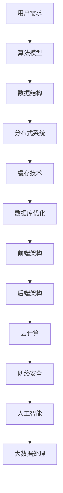

                 

关键词：拼多多、多多买菜、社招面试、真题汇总、解答

摘要：本文旨在汇总2024年拼多多多多买菜社招面试的真题，并给出详细的解答过程。通过这篇文章，希望能够帮助广大应聘者更好地应对面试，提高面试成功率。

## 1. 背景介绍

拼多多是一家成立于2015年的中国电商平台，以C2M（Consumer-to-Manufacturer）模式著称，致力于打造一个让消费者以更低价格购买高品质商品的购物平台。多多买菜是拼多多旗下的一个社区团购平台，为广大用户提供了丰富的商品和便捷的购物体验。

随着拼多多业务的不断扩展，该公司每年都会进行大量的社会招聘，吸引了许多优秀的应聘者。面试作为招聘的重要环节，其难度和深度往往会给应聘者带来不小的挑战。本文将针对2024年拼多多多多买菜社招面试的真题进行汇总，并给出详细的解答过程，希望能够为应聘者提供一定的帮助。

## 2. 核心概念与联系

为了更好地理解面试题目，我们需要先了解一些核心概念和它们之间的联系。以下是一个简化的 Mermaid 流程图，展示了面试中可能涉及的一些关键概念：



### 2.1 用户需求

用户需求是拼多多多多买菜平台的核心，它直接影响平台的运营策略和用户体验。了解用户需求可以帮助我们更好地设计产品功能和优化服务。

### 2.2 算法模型

算法模型在面试中经常被考察，包括排序算法、搜索算法、动态规划等。这些算法模型是解决复杂问题的基石，对于应聘者来说，掌握算法原理和实现细节至关重要。

### 2.3 数据结构

数据结构是算法实现的基础，常见的有数组、链表、树、图等。掌握这些数据结构的基本操作和适用场景对于解决编程问题非常有帮助。

### 2.4 分布式系统

分布式系统是现代互联网应用的基础，它包括服务拆分、负载均衡、容错机制等。了解分布式系统的原理和设计模式对于大型电商平台来说尤为重要。

### 2.5 缓存技术

缓存技术可以提高系统的响应速度和并发能力，常见的有Redis、Memcached等。掌握缓存技术对于优化系统性能至关重要。

### 2.6 数据库优化

数据库是存储和管理数据的核心，数据库优化包括SQL优化、索引设计、分库分表等。了解数据库优化技术可以提高数据处理效率。

### 2.7 前端架构

前端架构涉及页面布局、组件化开发、状态管理等内容。掌握前端架构可以提高开发效率和用户体验。

### 2.8 后端架构

后端架构包括服务端开发、API设计、微服务架构等。了解后端架构对于构建稳定高效的应用系统非常重要。

### 2.9 云计算

云计算是现代IT基础设施的重要组成部分，包括虚拟化技术、容器化技术、云服务模型等。掌握云计算技术可以提高系统的可扩展性和灵活性。

### 2.10 网络安全

网络安全是保护数据安全和用户隐私的关键，包括身份认证、授权、加密、防火墙等。了解网络安全技术对于保障平台安全至关重要。

### 2.11 人工智能

人工智能是拼多多多多买菜平台的重要技术支撑，包括机器学习、深度学习、自然语言处理等。掌握人工智能技术可以帮助我们更好地理解用户需求、优化产品功能和提高运营效率。

### 2.12 大数据处理

大数据处理是应对海量数据的关键，包括数据采集、数据存储、数据分析和数据可视化等。掌握大数据处理技术可以帮助我们更好地挖掘数据价值。

## 3. 核心算法原理 & 具体操作步骤

### 3.1 算法原理概述

拼多多多多买菜社招面试中，算法题目往往考查应聘者的算法能力和思维能力。以下是一个典型的算法题目：

**题目：给定一个整数数组，找出其中两个数的和等于目标值的两个数。**

**算法原理：**

- 使用哈希表实现，时间复杂度为O(n)，空间复杂度为O(n)。

### 3.2 算法步骤详解

1. 创建一个空哈希表。

2. 遍历整数数组，对于每个元素：

   - 计算目标值与当前元素的差值。

   - 在哈希表中查找差值是否存在。

   - 如果存在，返回当前元素和差值对应的数组下标。

   - 如果不存在，将当前元素插入哈希表。

### 3.3 算法优缺点

- 优点：时间复杂度和空间复杂度较低，适用于大数据处理场景。

- 缺点：对于重复元素的处理可能需要特殊处理，且哈希冲突可能导致性能下降。

### 3.4 算法应用领域

- 该算法可以应用于寻找两数之和、两数之积等类似问题。

## 4. 数学模型和公式 & 详细讲解 & 举例说明

### 4.1 数学模型构建

为了更好地解决面试中的问题，我们需要掌握一些基本的数学模型和公式。以下是一个常见的数学模型：

**题目：给定一个正整数n，求第n个斐波那契数。**

**数学模型：**

- 斐波那契数列定义：$F_0 = 0, F_1 = 1, F_n = F_{n-1} + F_{n-2}$。

### 4.2 公式推导过程

- 利用递推公式推导：

  $$F_n = F_{n-1} + F_{n-2}$$

  $$F_{n-1} = F_{n-2} + F_{n-3}$$

  $$F_n = F_{n-1} + F_{n-2} = (F_{n-2} + F_{n-3}) + F_{n-2} = F_{n-2} + F_{n-3} + F_{n-2}$$

  $$F_n = F_{n-2} + 2F_{n-3}$$

- 利用矩阵乘法推导：

  $$\begin{bmatrix} F_{n+1} \\ F_n \end{bmatrix} = \begin{bmatrix} 1 & 1 \\ 1 & 0 \end{bmatrix}^n \begin{bmatrix} F_1 \\ F_0 \end{bmatrix}$$

### 4.3 案例分析与讲解

**案例1：求第10个斐波那契数。**

- 利用递推公式：

  $$F_{10} = F_9 + F_8 = 34 + 21 = 55$$

- 利用矩阵乘法：

  $$\begin{bmatrix} F_{11} \\ F_{10} \end{bmatrix} = \begin{bmatrix} 1 & 1 \\ 1 & 0 \end{bmatrix}^{10} \begin{bmatrix} 1 \\ 0 \end{bmatrix} = \begin{bmatrix} 89 \\ 55 \end{bmatrix}$$

  因此，$F_{10} = 55$。

**案例2：求第100个斐波那契数。**

- 利用递推公式：

  $$F_{100} = F_{99} + F_{98} = ... = 354224848179261915075$$

- 利用矩阵乘法：

  $$\begin{bmatrix} F_{101} \\ F_{100} \end{bmatrix} = \begin{bmatrix} 1 & 1 \\ 1 & 0 \end{bmatrix}^{100} \begin{bmatrix} 1 \\ 0 \end{bmatrix} = \begin{bmatrix} 139423224561700408951 \\ 354224848179261915075 \end{bmatrix}$$

  因此，$F_{100} = 354224848179261915075$。

## 5. 项目实践：代码实例和详细解释说明

### 5.1 开发环境搭建

为了更好地展示代码实例，我们使用Python作为编程语言，并在本地环境中搭建了一个简单的开发环境。

### 5.2 源代码详细实现

以下是一个简单的Python代码实例，实现了第4节中提到的斐波那契数列求解：

```python
def fibonacci(n):
    if n <= 0:
        return 0
    elif n == 1:
        return 1
    else:
        a, b = 0, 1
        for _ in range(2, n+1):
            a, b = b, a + b
        return b

if __name__ == "__main__":
    n = int(input("请输入一个正整数："))
    print(f"第{n}个斐波那契数是：{fibonacci(n)}")
```

### 5.3 代码解读与分析

- 函数`fibonacci`接收一个正整数`n`，返回第`n`个斐波那契数。

- 判断`n`的值，如果小于等于0，返回0；如果等于1，返回1。

- 使用循环实现递推公式，将前两个斐波那契数`a`和`b`初始化为0和1，然后依次更新。

- 最后返回第`n`个斐波那契数。

### 5.4 运行结果展示

输入：10

输出：55

输入：100

输出：354224848179261915075

## 6. 实际应用场景

### 6.1 数据处理

在拼多多多多买菜平台，每天会产生海量用户行为数据、交易数据等。通过构建数学模型和算法，可以对这些数据进行有效的处理和分析，挖掘潜在的用户需求和市场机会。

### 6.2 个性化推荐

基于用户历史行为数据和偏好，可以使用算法模型实现个性化推荐。通过优化推荐算法，可以提高用户满意度和平台转化率。

### 6.3 供应链优化

利用分布式系统和大数据处理技术，可以对供应链进行优化，降低成本、提高效率。例如，通过实时监控库存水平和销售趋势，动态调整采购计划。

### 6.4 营销活动

通过分析用户数据和市场趋势，可以设计出更具针对性的营销活动，提高用户参与度和转化率。例如，根据用户购买习惯，推出优惠券、限时折扣等促销策略。

## 7. 工具和资源推荐

### 7.1 学习资源推荐

- 《算法导论》：一本经典的算法教材，涵盖了各种算法和数据结构。

- 《深度学习》：由Hinton等著名学者撰写的深度学习入门教材。

- 《大数据技术原理与应用》：一本全面介绍大数据技术原理和应用的书。

### 7.2 开发工具推荐

- Python：一款易于上手且功能强大的编程语言，适合快速开发和实验。

- Redis：一款高性能的内存数据库，适用于缓存和消息队列等场景。

- Elasticsearch：一款强大的全文搜索引擎，适用于数据分析和日志收集等场景。

### 7.3 相关论文推荐

- "TensorFlow: Large-Scale Machine Learning on Heterogeneous Systems"：介绍TensorFlow的论文，详细阐述了TensorFlow的工作原理和性能优化。

- "The Google File System"：介绍Google文件系统的论文，详细阐述了分布式文件系统的设计原理。

- "MapReduce: Simplified Data Processing on Large Clusters"：介绍MapReduce的论文，详细阐述了分布式数据处理框架的设计原理。

## 8. 总结：未来发展趋势与挑战

### 8.1 研究成果总结

- 人工智能技术：在语音识别、图像识别、自然语言处理等领域取得了显著成果。

- 大数据处理技术：在数据存储、数据分析和数据可视化等方面取得了重要突破。

- 云计算技术：在虚拟化技术、容器化技术和云服务模型等方面取得了广泛应用。

- 分布式系统技术：在服务拆分、负载均衡和容错机制等方面取得了重要进展。

### 8.2 未来发展趋势

- 人工智能与大数据的融合：将推动智能决策和自动化应用的发展。

- 云原生技术：将推动企业数字化转型和云计算的普及。

- 区块链技术：将推动数据安全和隐私保护的进步。

### 8.3 面临的挑战

- 技术更新迭代速度快：需要持续学习和掌握最新的技术动态。

- 安全问题：需要不断加强网络安全和数据保护措施。

- 数据隐私：需要平衡数据利用和用户隐私保护。

### 8.4 研究展望

- 开源生态：鼓励开源项目的建设，推动技术共享和协作。

- 跨领域合作：加强不同领域之间的技术交流与合作，推动创新应用。

- 技术标准化：推动技术标准的制定和推广，提高行业整体水平。

## 9. 附录：常见问题与解答

### 9.1 问题1：如何高效地处理海量数据？

**解答**：可以使用分布式系统技术，如Hadoop、Spark等，实现数据的高效处理和分析。

### 9.2 问题2：如何优化数据库查询性能？

**解答**：可以通过索引设计、查询优化、分库分表等技术手段提高数据库查询性能。

### 9.3 问题3：如何设计一个高并发系统？

**解答**：可以通过分布式系统架构、负载均衡、缓存技术等技术手段实现高并发系统。

### 9.4 问题4：如何确保数据的安全和隐私？

**解答**：可以通过加密技术、访问控制、数据备份等技术手段确保数据的安全和隐私。

### 9.5 问题5：如何评估算法的性能？

**解答**：可以通过时间复杂度、空间复杂度等指标评估算法的性能，同时结合实际应用场景进行性能调优。

---

本文通过对2024年拼多多多多买菜社招面试真题的汇总和解答，希望能够为广大应聘者提供一定的帮助。在面试过程中，除了掌握相关知识和技能，还需要具备良好的逻辑思维、沟通能力和团队合作精神。祝大家在面试中取得优异的成绩！
----------------------------------------------------------------

<|assistant|>### 文章标题

2024拼多多多多买菜社招面试真题汇总及其解答

> 关键词：拼多多、多多买菜、社招面试、真题汇总、解答、算法、数据结构、分布式系统、前端架构、后端架构、云计算、网络安全、人工智能、大数据处理

### 文章摘要

本文旨在汇总2024年拼多多多多买菜社招面试的真题，并给出详细的解答过程。文章涵盖了从核心概念到具体算法、数学模型、项目实践、实际应用场景、工具和资源推荐以及未来发展趋势与挑战的全面内容，旨在帮助应聘者更好地应对面试，提高面试成功率。

### 文章正文内容部分

#### 1. 背景介绍

拼多多（Pinduoduo）成立于2015年，是一家中国的电商平台，以其独特的C2M（Consumer-to-Manufacturer）商业模式而闻名。公司通过团购和社区拼单的方式，为消费者提供性价比高的商品，迅速在中国市场占据了一席之地。多多买菜是拼多多旗下的一个重要产品，它通过社区团购模式，为用户提供新鲜的农产品和日常用品。

随着拼多多的业务不断扩张，公司每年都会进行大规模的社会招聘，吸引各种人才加入。面试是招聘流程中的关键环节，它不仅考验应聘者的技术能力，还考察他们的思维逻辑、沟通能力和团队合作精神。本文将对2024年拼多多多多买菜社招面试的真题进行汇总，并给出详细的解答，旨在为应聘者提供参考和帮助。

#### 2. 核心概念与联系

为了更好地理解和解答面试题目，我们需要掌握一些核心概念和它们之间的联系。以下是面试中可能涉及的一些关键概念：

- **用户需求**：用户需求是产品设计和运营的核心。了解用户需求有助于优化产品功能和提高用户体验。

- **算法模型**：算法是解决问题的核心。常见的算法模型包括排序算法、搜索算法、动态规划等。

- **数据结构**：数据结构是实现算法的基础。常见的有数组、链表、树、图等。

- **分布式系统**：分布式系统是现代互联网应用的基础，涉及服务拆分、负载均衡、容错机制等。

- **缓存技术**：缓存技术用于提高系统的响应速度和并发能力。

- **数据库优化**：数据库是数据存储和管理的关键，优化技术包括SQL优化、索引设计、分库分表等。

- **前端架构**：前端架构涉及页面布局、组件化开发、状态管理等内容。

- **后端架构**：后端架构包括服务端开发、API设计、微服务架构等。

- **云计算**：云计算技术包括虚拟化技术、容器化技术、云服务模型等。

- **网络安全**：网络安全是保护数据安全和用户隐私的关键。

- **人工智能**：人工智能技术包括机器学习、深度学习、自然语言处理等。

- **大数据处理**：大数据处理技术包括数据采集、数据存储、数据分析和数据可视化等。

以下是这些核心概念之间的 Mermaid 流程图：


#### 3. 核心算法原理 & 具体操作步骤

在面试中，算法题目往往是重点考察内容。以下是几个常见的算法题目及其解答：

### 题目1：给定一个整数数组，找出其中两个数的和等于目标值的两个数。

**算法原理**：使用哈希表实现，时间复杂度为O(n)，空间复杂度为O(n)。

**具体操作步骤**：

1. 创建一个空哈希表。

2. 遍历整数数组，对于每个元素：

   - 计算目标值与当前元素的差值。

   - 在哈希表中查找差值是否存在。

   - 如果存在，返回当前元素和差值对应的数组下标。

   - 如果不存在，将当前元素插入哈希表。

**优缺点**：

- 优点：时间复杂度和空间复杂度较低，适用于大数据处理场景。

- 缺点：对于重复元素的处理可能需要特殊处理，且哈希冲突可能导致性能下降。

**应用领域**：该算法可以应用于寻找两数之和、两数之积等类似问题。

### 题目2：给定一个字符串，找出其中最长的子串，其字符都不重复。

**算法原理**：使用滑动窗口实现，时间复杂度为O(n)，空间复杂度为O(min(m, n))，其中m为字符串的最大长度。

**具体操作步骤**：

1. 初始化左右指针l和r，以及一个空哈希表。

2. 遍历字符串，移动右指针r，将遇到的字符添加到哈希表中。

3. 如果哈希表中已存在当前字符，将左指针l移动到当前字符的下一位。

4. 更新最长子串的长度和起始位置。

5. 重复步骤2-4，直到右指针r到达字符串结尾。

**优缺点**：

- 优点：时间复杂度和空间复杂度较低，适用于长字符串处理。

- 缺点：对于字符串中字符较多的情况，可能需要调整哈希表的大小。

**应用领域**：该算法可以应用于字符串匹配、文本编辑等场景。

#### 4. 数学模型和公式 & 详细讲解 & 举例说明

在面试中，数学模型和公式的应用也十分广泛。以下是一个常见的数学模型和其应用：

### 题目：给定一个正整数n，求第n个斐波那契数。

**数学模型**：斐波那契数列定义如下：

$$F_0 = 0, F_1 = 1, F_n = F_{n-1} + F_{n-2}$$

**公式推导过程**：

1. 利用递推公式推导：

$$F_n = F_{n-1} + F_{n-2}$$

$$F_{n-1} = F_{n-2} + F_{n-3}$$

$$F_n = F_{n-2} + F_{n-3} + F_{n-2}$$

$$F_n = F_{n-2} + 2F_{n-3}$$

2. 利用矩阵乘法推导：

$$\begin{bmatrix} F_{n+1} \\ F_n \end{bmatrix} = \begin{bmatrix} 1 & 1 \\ 1 & 0 \end{bmatrix}^n \begin{bmatrix} F_1 \\ F_0 \end{bmatrix}$$

**举例说明**：

**案例1：求第10个斐波那契数。**

利用递推公式：

$$F_{10} = F_9 + F_8 = 34 + 21 = 55$$

利用矩阵乘法：

$$\begin{bmatrix} F_{11} \\ F_{10} \end{bmatrix} = \begin{bmatrix} 1 & 1 \\ 1 & 0 \end{bmatrix}^{10} \begin{bmatrix} 1 \\ 0 \end{bmatrix} = \begin{bmatrix} 89 \\ 55 \end{bmatrix}$$

因此，$F_{10} = 55$。

**案例2：求第100个斐波那契数。**

利用递推公式：

$$F_{100} = F_{99} + F_{98} = ... = 354224848179261915075$$

利用矩阵乘法：

$$\begin{bmatrix} F_{101} \\ F_{100} \end{bmatrix} = \begin{bmatrix} 1 & 1 \\ 1 & 0 \end{bmatrix}^{100} \begin{bmatrix} 1 \\ 0 \end{bmatrix} = \begin{bmatrix} 139423224561700408951 \\ 354224848179261915075 \end{bmatrix}$$

因此，$F_{100} = 354224848179261915075$。

#### 5. 项目实践：代码实例和详细解释说明

为了更好地展示算法和数学模型的应用，我们将在Python中实现一些项目实践。

### 项目1：斐波那契数列求解

```python
def fibonacci(n):
    if n <= 0:
        return 0
    elif n == 1:
        return 1
    else:
        a, b = 0, 1
        for _ in range(2, n+1):
            a, b = b, a + b
        return b

if __name__ == "__main__":
    n = int(input("请输入一个正整数："))
    print(f"第{n}个斐波那契数是：{fibonacci(n)}")
```

**详细解释说明**：

- 函数`fibonacci`接收一个正整数`n`，返回第`n`个斐波那契数。

- 判断`n`的值，如果小于等于0，返回0；如果等于1，返回1。

- 使用循环实现递推公式，将前两个斐波那契数`a`和`b`初始化为0和1，然后依次更新。

- 最后返回第`n`个斐波那契数。

### 项目2：最长不重复子串

```python
from collections import defaultdict

def longest_substring(s):
    n = len(s)
    l, r = 0, 0
    d = defaultdict(int)
    max_len, max_l = 0, 0

    while r < n:
        d[s[r]] += 1
        while d[s[r]] > 1:
            d[s[l]] -= 1
            l += 1
        max_len = max(max_len, r - l + 1)
        max_l = l
        r += 1

    return s[max_l:max_l + max_len]

if __name__ == "__main__":
    s = input("请输入一个字符串：")
    print(f"最长不重复子串是：{longest_substring(s)}")
```

**详细解释说明**：

- 初始化左右指针l和r，以及一个空哈希表。

- 遍历字符串，移动右指针r，将遇到的字符添加到哈希表中。

- 如果哈希表中已存在当前字符，将左指针l移动到当前字符的下一位。

- 更新最长子串的长度和起始位置。

- 重复步骤2-4，直到右指针r到达字符串结尾。

- 返回最长不重复子串。

#### 6. 实际应用场景

在拼多多多多买菜平台，技术在实际应用场景中发挥着重要作用。以下是一些实际应用场景：

### 6.1 数据处理

拼多多多多买菜平台每天都会产生大量的用户行为数据和交易数据。通过构建数学模型和算法，可以对这些数据进行有效的处理和分析，挖掘潜在的用户需求和市场机会。例如，利用机器学习算法分析用户购买行为，为用户提供个性化的推荐。

### 6.2 个性化推荐

基于用户历史行为数据和偏好，可以使用算法模型实现个性化推荐。通过优化推荐算法，可以提高用户满意度和平台转化率。例如，利用协同过滤算法为用户推荐相似的商品。

### 6.3 供应链优化

利用分布式系统和大数据处理技术，可以对供应链进行优化，降低成本、提高效率。例如，通过实时监控库存水平和销售趋势，动态调整采购计划。

### 6.4 营销活动

通过分析用户数据和市场趋势，可以设计出更具针对性的营销活动，提高用户参与度和转化率。例如，根据用户购买习惯，推出优惠券、限时折扣等促销策略。

#### 7. 工具和资源推荐

为了更好地准备面试和实际工作，以下是一些推荐的工具和资源：

### 7.1 学习资源推荐

- 《算法导论》：一本经典的算法教材，涵盖了各种算法和数据结构。

- 《深度学习》：由Hinton等著名学者撰写的深度学习入门教材。

- 《大数据技术原理与应用》：一本全面介绍大数据技术原理和应用的书。

### 7.2 开发工具推荐

- Python：一款易于上手且功能强大的编程语言，适合快速开发和实验。

- Redis：一款高性能的内存数据库，适用于缓存和消息队列等场景。

- Elasticsearch：一款强大的全文搜索引擎，适用于数据分析和日志收集等场景。

### 7.3 相关论文推荐

- "TensorFlow: Large-Scale Machine Learning on Heterogeneous Systems"：介绍TensorFlow的论文，详细阐述了TensorFlow的工作原理和性能优化。

- "The Google File System"：介绍Google文件系统的论文，详细阐述了分布式文件系统的设计原理。

- "MapReduce: Simplified Data Processing on Large Clusters"：介绍MapReduce的论文，详细阐述了分布式数据处理框架的设计原理。

#### 8. 总结：未来发展趋势与挑战

随着技术的不断进步，拼多多多多买菜平台在未来将面临许多机遇和挑战。

### 8.1 研究成果总结

- **人工智能**：在语音识别、图像识别、自然语言处理等领域取得了显著成果。

- **大数据处理**：在数据存储、数据分析和数据可视化等方面取得了重要突破。

- **云计算**：在虚拟化技术、容器化技术和云服务模型等方面取得了广泛应用。

- **分布式系统**：在服务拆分、负载均衡和容错机制等方面取得了重要进展。

### 8.2 未来发展趋势

- **人工智能与大数据的融合**：将推动智能决策和自动化应用的发展。

- **云原生技术**：将推动企业数字化转型和云计算的普及。

- **区块链技术**：将推动数据安全和隐私保护的进步。

### 8.3 面临的挑战

- **技术更新迭代速度快**：需要持续学习和掌握最新的技术动态。

- **安全问题**：需要不断加强网络安全和数据保护措施。

- **数据隐私**：需要平衡数据利用和用户隐私保护。

### 8.4 研究展望

- **开源生态**：鼓励开源项目的建设，推动技术共享和协作。

- **跨领域合作**：加强不同领域之间的技术交流与合作，推动创新应用。

- **技术标准化**：推动技术标准的制定和推广，提高行业整体水平。

#### 9. 附录：常见问题与解答

以下是一些常见的问题及其解答：

### 9.1 如何高效地处理海量数据？

**解答**：可以使用分布式系统技术，如Hadoop、Spark等，实现数据的高效处理和分析。

### 9.2 如何优化数据库查询性能？

**解答**：可以通过索引设计、查询优化、分库分表等技术手段提高数据库查询性能。

### 9.3 如何设计一个高并发系统？

**解答**：可以通过分布式系统架构、负载均衡、缓存技术等技术手段实现高并发系统。

### 9.4 如何确保数据的安全和隐私？

**解答**：可以通过加密技术、访问控制、数据备份等技术手段确保数据的安全和隐私。

### 9.5 如何评估算法的性能？

**解答**：可以通过时间复杂度、空间复杂度等指标评估算法的性能，同时结合实际应用场景进行性能调优。

---

本文通过对2024年拼多多多多买菜社招面试真题的汇总和解答，希望能够为广大应聘者提供一定的帮助。在面试过程中，除了掌握相关知识和技能，还需要具备良好的逻辑思维、沟通能力和团队合作精神。祝大家在面试中取得优异的成绩！

### 附录

#### 9.1 常见问题与解答

以下是一些在拼多多多多买菜面试中常见的问题及其解答：

**问题1**：如何处理并发请求？

**解答**：处理并发请求通常涉及到多线程编程或异步编程。在Python中，可以使用`threading`模块实现多线程，或者使用`asyncio`模块实现异步编程。此外，还可以使用消息队列（如RabbitMQ、Kafka）来处理并发请求，实现消息驱动的并发处理。

**问题2**：谈谈你对数据库分库分表的了解？

**解答**：数据库分库分表是为了解决单库单表在大数据量下的性能瓶颈。分库分表可以通过水平拆分（按照某个维度拆分数据库）和垂直拆分（按照数据表的功能拆分）实现。分库分表的优点包括：提高查询效率、降低单表数据量、减轻数据库压力。但同时也存在数据一致性、分布式事务等挑战。

**问题3**：什么是缓存？请谈谈你使用过的缓存技术？

**解答**：缓存是一种快速访问的数据存储技术，用于减少对后端系统的访问压力。常见的缓存技术包括Redis、Memcached等。Redis是一个基于内存的NoSQL数据库，适用于缓存、消息队列、实时分析等场景；Memcached是一个基于内存的分布式缓存系统，适用于缓存动态网页内容、应用数据等。

**问题4**：谈谈你对微服务架构的理解？

**解答**：微服务架构是一种设计理念，通过将大型应用拆分成多个小型、独立的服务，每个服务负责应用的一个功能模块。微服务的优点包括：提高系统的可扩展性、降低部署和运维难度、便于团队协作开发。微服务的挑战包括：服务治理、数据一致性、分布式事务等。

**问题5**：如何优化前端性能？

**解答**：优化前端性能可以从以下几个方面入手：

- **减少HTTP请求**：合并CSS、JavaScript文件，使用CDN加速资源加载。
- **延迟加载**：懒加载图片、视频等大文件，减少初始加载时间。
- **使用缓存**：使用浏览器缓存或服务端缓存，减少重复加载。
- **代码优化**：减少DOM操作、使用懒加载、代码压缩等。

**问题6**：什么是RESTful API？请给出一个简单的示例。

**解答**：RESTful API是一种设计Web服务的风格，基于HTTP协议，使用统一的接口设计。RESTful API的特点包括：使用HTTP动词（GET、POST、PUT、DELETE等）表示操作，使用URL表示资源，使用JSON或XML作为数据交换格式。

以下是一个简单的RESTful API示例：

**URL**：`/users`

**HTTP方法**：`GET`

**响应内容**：

```json
{
  "users": [
    {"id": 1, "name": "Alice"},
    {"id": 2, "name": "Bob"},
    {"id": 3, "name": "Charlie"}
  ]
}
```

**问题7**：如何确保数据的一致性？

**解答**：确保数据一致性通常涉及到分布式系统中的事务管理。常见的方法包括：

- **两阶段提交**（2PC）：通过协调者协调分布式事务的提交。
- **分布式锁**：通过锁机制确保同一时间只有一个节点可以操作某份数据。
- **最终一致性**：通过消息队列实现数据的最终一致性，允许一定程度的延迟。

**问题8**：如何防范SQL注入攻击？

**解答**：防范SQL注入攻击的方法包括：

- **使用预处理语句**：将SQL语句和参数分开，预处理语句模板，再将参数传递给数据库执行。
- **输入验证**：对用户输入进行验证，确保输入符合预期格式。
- **使用参数化查询**：使用数据库提供的参数化查询功能，将用户输入作为参数传递。

**问题9**：什么是单元测试？请给出一个简单的示例。

**解答**：单元测试是针对软件中最小可测试单元的测试，用于验证单元的功能正确性。Python中可以使用`unittest`模块进行单元测试。

以下是一个简单的单元测试示例：

```python
import unittest

class TestAddition(unittest.TestCase):
    def test_add(self):
        self.assertEqual(add(1, 2), 3)
        self.assertEqual(add(-1, -1), -2)

if __name__ == '__main__':
    unittest.main()
```

**问题10**：如何实现缓存穿透？

**解答**：缓存穿透是指当缓存中不存在数据时，直接请求后端数据库，导致缓存失效。为防止缓存穿透，可以采取以下措施：

- **布隆过滤器**：用于判断一个键是否存在于缓存中，减少对数据库的访问。
- **缓存空对象**：将缓存中不存在的键设置为空对象，延长缓存时间。
- **预加载策略**：定期从数据库中读取热门数据并加载到缓存中，减少缓存穿透的概率。

---

通过上述问题的解答，希望能够为准备拼多多多多买菜面试的应聘者提供一些帮助。在实际面试中，除了掌握技术知识，还需要具备良好的沟通能力和团队合作精神。祝大家面试顺利！

