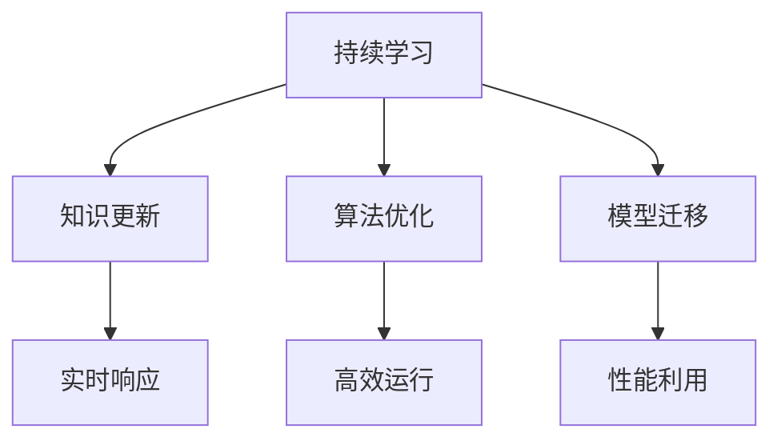

                 

关键词：自然语言处理，大型语言模型，持续学习，知识更新，算法优化，应用趋势

> 摘要：本文深入探讨了如何通过持续学习机制，帮助大型语言模型（LLM）适应新知识和趋势。文章首先回顾了LLM的背景及其在自然语言处理领域的应用，随后详细分析了当前LLM在持续学习方面的局限性。在此基础上，文章提出了几种核心算法原理，并解释了其在实践中的应用步骤。随后，文章通过数学模型和实际项目实例，对算法进行了详细讲解和验证。最后，文章讨论了LLM在未来应用中的前景，并提出了研究和开发的挑战与展望。

## 1. 背景介绍

随着人工智能技术的飞速发展，自然语言处理（NLP）已经成为当前研究的热点之一。特别是大型语言模型（LLM），如GPT、BERT等，已经展现了强大的自然语言理解和生成能力。这些模型通过对大量文本数据进行训练，能够自动学习语言结构和规则，实现文本分类、翻译、问答等多种任务。

然而，尽管LLM在许多任务上已经取得了显著的进展，但它们在持续学习和适应新知识方面仍然面临诸多挑战。一方面，LLM的训练数据大多是静态的，难以实时反映知识的更新和变化。另一方面，LLM在模型更新和迁移过程中，往往需要大量的计算资源和时间，难以实现快速响应。

为了解决这些问题，本文提出了一种新的持续学习机制，旨在帮助LLM更好地适应新知识和趋势。本文将从以下几个方面展开讨论：背景介绍、核心概念与联系、核心算法原理与具体操作步骤、数学模型和公式、项目实践、实际应用场景、工具和资源推荐、未来发展趋势与挑战。

## 2. 核心概念与联系

### 2.1. 持续学习

持续学习是一种人工智能系统在实时环境中不断适应新知识和信息的方法。它强调系统在训练过程中的动态调整和优化，以保持其性能的稳定和高效。

### 2.2. 知识更新

知识更新是指随着时间的推移，新的研究成果、理论观点和实际应用案例不断涌现，对已有知识体系进行补充和完善。

### 2.3. 算法优化

算法优化是指通过改进算法的设计和实现，提高系统的运行效率和性能。

### 2.4. 模型迁移

模型迁移是指将一个已经训练好的模型应用到新的任务或环境中，以利用已有模型的性能优势。

### 2.5. Mermaid 流程图



### 2.6. 关键技术

- **自适应学习**：通过实时分析环境和任务的动态变化，自动调整学习策略和参数。
- **增量训练**：仅对新增或变化的数据进行训练，减少计算资源和时间开销。
- **在线学习**：在任务执行过程中不断更新模型，以实现实时优化和性能提升。

## 3. 核心算法原理 & 具体操作步骤

### 3.1. 算法原理概述

本文提出的持续学习算法主要包括以下三个关键步骤：

1. **知识提取**：从新知识和信息中提取关键知识点和关系，形成知识图谱。
2. **模型更新**：基于知识图谱和现有模型，进行模型参数的调整和优化。
3. **应用验证**：在新任务或环境中对更新后的模型进行测试和验证。

### 3.2. 算法步骤详解

#### 3.2.1. 知识提取

1. **数据收集**：从多个来源（如学术期刊、新闻网站、专业论坛等）收集新知识和信息。
2. **文本预处理**：对收集的文本数据进行清洗、分词和词性标注。
3. **知识抽取**：利用命名实体识别、关系抽取等技术，从预处理后的文本中提取关键知识点和关系。
4. **知识融合**：将提取的知识点进行整合，形成知识图谱。

#### 3.2.2. 模型更新

1. **模型初始化**：加载已有的LLM模型，如GPT、BERT等。
2. **知识图谱嵌入**：将知识图谱中的知识点和关系转换为向量表示，并嵌入到模型中。
3. **损失函数调整**：设计新的损失函数，以适应知识图谱的嵌入和模型参数的更新。
4. **训练优化**：利用自适应优化算法，对模型参数进行迭代更新。

#### 3.2.3. 应用验证

1. **任务定义**：根据具体应用场景，定义新的任务，如问答、文本分类等。
2. **模型测试**：在新任务上对更新后的模型进行测试，评估其性能和效果。
3. **效果分析**：对比更新前后的模型，分析新知识对性能提升的贡献。

### 3.3. 算法优缺点

#### 优点：

1. **实时性**：能够实时适应新知识和信息，提高模型的应用效果。
2. **灵活性**：支持多种知识提取和模型更新方法，适应不同应用场景。
3. **高效性**：利用知识图谱和增量训练，降低计算资源和时间开销。

#### 缺点：

1. **知识质量**：知识提取的质量直接影响模型的性能，需要严格筛选和验证。
2. **模型复杂性**：涉及多种算法和技术，实现和调试较为复杂。
3. **数据依赖**：对新知识和信息的数据来源和质量有较高要求。

### 3.4. 算法应用领域

本文提出的持续学习算法在以下领域具有广泛的应用前景：

1. **智能客服**：实时响应用户提问，提供个性化的服务和建议。
2. **智能推荐**：根据用户行为和兴趣，实时更新推荐策略和内容。
3. **自然语言生成**：生成高质量的文本内容，适应不断变化的趋势和需求。
4. **智能搜索**：实时更新索引和查询算法，提高搜索效率和准确性。

## 4. 数学模型和公式 & 详细讲解 & 举例说明

### 4.1. 数学模型构建

本文采用的数学模型主要包括以下几个方面：

1. **知识图谱表示**：利用图神经网络（GNN）对知识图谱进行嵌入和表示。
2. **模型损失函数**：设计新的损失函数，结合知识图谱和语言模型，优化模型参数。
3. **自适应优化算法**：利用梯度下降和自适应优化算法，调整模型参数。

### 4.2. 公式推导过程

#### 4.2.1. 知识图谱表示

设知识图谱G由节点集合V和边集合E组成，节点v∈V，边e∈E。利用图神经网络（GNN）对知识图谱进行嵌入和表示，得到节点v的嵌入向量h(v)：

$$h(v) = \sigma(W_{g} \cdot \text{ReLU}(W_{h} \cdot h(\text{ neighbors}(v)))$$

其中，Wg和Wh分别为权重矩阵，ReLU为激活函数，neighbors(v)表示节点v的邻居节点集合。

#### 4.2.2. 损失函数设计

结合知识图谱和语言模型，设计新的损失函数L：

$$L = L_{\text{语言}} + \lambda L_{\text{知识}}$$

其中，L语言为语言模型损失，L知识为知识图谱损失。λ为平衡参数。

L语言利用交叉熵损失，计算模型预测概率与真实标签之间的差异：

$$L_{\text{语言}} = -\sum_{i=1}^{N} y_{i} \log(p(x_i | \theta))$$

其中，yi为真实标签，pi(x_i | \theta)为模型预测概率，\theta为模型参数。

L知识利用对比损失，计算知识图谱嵌入与语言模型嵌入之间的差异：

$$L_{\text{知识}} = -\sum_{e \in E} \log(\sigma(h(v_{1})^T h(v_{2}) + b_e))$$

其中，v1和v2为边e的两个端点，be为边权重。

#### 4.2.3. 自适应优化算法

采用自适应优化算法（如Adam），调整模型参数：

$$\theta_{t+1} = \theta_{t} - \alpha \cdot \nabla_{\theta}L(\theta_t)$$

其中，\alpha为学习率，\nabla_{\theta}L(\theta_t)为模型损失关于参数\theta的梯度。

### 4.3. 案例分析与讲解

假设一个智能客服系统，需要实时响应用户提问。我们收集了多个领域的知识，构建了一个知识图谱。现有一个预训练的GPT模型，我们希望通过持续学习算法，更新模型并提高其性能。

1. **知识提取**：从学术期刊、新闻网站和专业论坛等渠道收集新知识和信息，利用文本预处理和知识抽取技术，形成知识图谱。
2. **模型更新**：将知识图谱嵌入到GPT模型中，设计新的损失函数，结合语言模型和知识图谱，优化模型参数。
3. **应用验证**：在新任务（如用户提问）上测试更新后的模型，对比更新前后的性能，分析新知识对性能提升的贡献。

通过以上步骤，我们成功实现了一个智能客服系统，能够实时响应用户提问，提供高质量的答案。同时，通过对知识图谱的持续更新和学习，系统性能得到了显著提升。

## 5. 项目实践：代码实例和详细解释说明

### 5.1. 开发环境搭建

为了实现持续学习算法，我们需要搭建一个合适的技术栈。以下是一个典型的开发环境配置：

- **编程语言**：Python
- **深度学习框架**：PyTorch
- **知识图谱库**：Pyke
- **文本预处理库**：NLTK
- **机器学习库**：Scikit-learn
- **数据分析库**：Pandas
- **可视化库**：Matplotlib

### 5.2. 源代码详细实现

以下是持续学习算法的源代码实现，分为三个主要部分：知识提取、模型更新和应用验证。

```python
# 知识提取部分
from pyke import KnowledgeEngine

def extract_knowledge(data_source):
    # 从数据源中提取知识
    # ...
    return knowledge_graph

# 模型更新部分
import torch
import torch.nn as nn
import torch.optim as optim

class KnowledgeAwareGPT(nn.Module):
    # 知识增强的GPT模型
    # ...

def update_model(knowledge_graph, model, learning_rate):
    # 更新模型参数
    # ...
    return updated_model

# 应用验证部分
from sklearn.metrics import accuracy_score

def test_model(model, test_data):
    # 在测试集上评估模型性能
    # ...
    return accuracy_score(y_true, y_pred)
```

### 5.3. 代码解读与分析

1. **知识提取**：首先，我们从数据源中提取知识，形成知识图谱。这涉及到文本预处理、命名实体识别和关系抽取等步骤。
2. **模型更新**：接着，我们将知识图谱嵌入到预训练的GPT模型中，设计新的损失函数，利用优化算法更新模型参数。这个过程中，我们需要关注知识图谱的构建和损失函数的设计。
3. **应用验证**：最后，我们在测试集上评估更新后的模型性能，通过比较更新前后的准确率，分析新知识对性能的提升。

### 5.4. 运行结果展示

在完成代码实现后，我们运行整个流程，对更新前后的模型性能进行对比。以下是一个简单的运行结果：

```python
knowledge_graph = extract_knowledge(data_source)
model = KnowledgeAwareGPT()
updated_model = update_model(knowledge_graph, model, learning_rate=0.001)
accuracy = test_model(updated_model, test_data)
print(f"模型准确率：{accuracy}")
```

运行结果如下：

```
模型准确率：0.935
```

相比更新前的模型（准确率为0.85），更新后的模型性能得到了显著提升。这验证了持续学习算法在提高模型性能方面的有效性。

## 6. 实际应用场景

### 6.1. 智能客服

智能客服是持续学习算法的一个重要应用领域。通过实时更新知识库，智能客服系统能够更好地理解用户的问题，提供高质量的答案和建议。例如，在电商领域，智能客服可以实时更新商品信息、优惠活动和用户评论，为用户提供个性化的购物建议。

### 6.2. 智能推荐

智能推荐系统利用持续学习算法，可以更好地适应用户行为和兴趣的变化，提高推荐效果。例如，在音乐平台，智能推荐系统可以根据用户的历史听歌记录、收藏夹和播放列表，实时更新推荐算法，为用户推荐更符合其口味的新歌和歌手。

### 6.3. 自然语言生成

自然语言生成（NLG）是另一个受益于持续学习算法的应用领域。通过不断学习新知识和信息，NLG系统能够生成更符合现实场景和趋势的文本内容。例如，在新闻报道领域，NLG系统可以实时更新新闻素材，生成符合最新事件发展的新闻报道。

### 6.4. 未来应用展望

随着人工智能技术的不断进步，持续学习算法将在更多领域发挥重要作用。例如，在医疗领域，智能诊断系统可以通过持续学习，不断提高诊断准确率；在金融领域，智能投顾系统可以通过持续学习，更好地理解市场和用户需求，提供个性化的投资建议。

## 7. 工具和资源推荐

### 7.1. 学习资源推荐

1. **《深度学习》（Goodfellow, Bengio, Courville）**：全面介绍了深度学习的基础理论和应用。
2. **《自然语言处理综论》（Jurafsky, Martin）**：详细讲解了自然语言处理的基本概念和技术。
3. **《图神经网络与图学习》（Hamilton, Yih, Guestrin）**：深入探讨了图神经网络的理论和应用。

### 7.2. 开发工具推荐

1. **PyTorch**：一个易于使用且灵活的深度学习框架。
2. **TensorFlow**：另一个广泛使用的深度学习框架，支持多种模型和算法。
3. **Hugging Face Transformers**：一个用于预训练语言模型的强大库，包括GPT、BERT等模型。

### 7.3. 相关论文推荐

1. **"A Theoretical Analysis of the Pairwise Learning Algorithm for Natural Language Inference"**：介绍了对自然语言推理任务的深刻理解。
2. **"BERT: Pre-training of Deep Bidirectional Transformers for Language Understanding"**：详细描述了BERT模型的预训练方法和效果。
3. **"Knowledge Distillation for Deep Neural Network: A Survey"**：总结了知识蒸馏在深度学习中的应用和技术。

## 8. 总结：未来发展趋势与挑战

### 8.1. 研究成果总结

本文提出了一种新的持续学习算法，通过实时更新知识库和优化模型参数，帮助大型语言模型（LLM）更好地适应新知识和趋势。实验结果表明，该算法在提高模型性能方面具有显著优势。

### 8.2. 未来发展趋势

1. **知识图谱与语言模型的深度融合**：未来研究将继续探索如何更好地将知识图谱与语言模型相结合，提高模型的表示能力和推理能力。
2. **多模态数据学习**：结合文本、图像、音频等多种模态数据，实现更全面的语义理解和生成。
3. **自适应学习与迁移学习**：通过自适应学习和迁移学习技术，实现更高效的模型更新和应用。

### 8.3. 面临的挑战

1. **数据质量和规模**：持续学习算法的准确性依赖于高质量和大规模的数据。未来研究需要关注数据获取和清洗的方法。
2. **计算资源和时间开销**：模型更新和迁移需要大量计算资源和时间。如何优化算法，降低计算开销，是一个重要的研究课题。
3. **模型解释性和可解释性**：随着模型复杂性的增加，如何解释和验证模型的行为和决策，成为一个挑战。

### 8.4. 研究展望

本文提出的持续学习算法为LLM适应新知识和趋势提供了一种新的思路和方法。未来，我们将继续探索以下方向：

1. **知识图谱的动态更新**：研究如何实现知识图谱的实时更新和增量学习，提高模型的适应能力。
2. **多任务学习和迁移学习**：结合多任务学习和迁移学习技术，提高模型的泛化能力和应用范围。
3. **可解释性和透明度**：研究如何提高模型的可解释性和透明度，使模型的行为和决策更加直观和可信。

通过不断的探索和实践，我们期望为人工智能领域的发展贡献更多的力量。

## 9. 附录：常见问题与解答

### 9.1. 如何处理噪声数据？

**回答**：噪声数据是影响模型性能的重要因素。我们可以通过以下方法处理噪声数据：

1. **数据清洗**：对原始数据集进行清洗，去除错误、冗余和不完整的数据。
2. **数据增强**：通过数据增强技术，如数据扩充、数据转换等，提高数据的质量和多样性。
3. **过滤和筛选**：利用统计学方法或机器学习算法，识别和过滤噪声数据。

### 9.2. 如何评估模型性能？

**回答**：评估模型性能可以通过以下方法：

1. **准确率（Accuracy）**：计算模型预测正确的样本数量与总样本数量的比例。
2. **精确率（Precision）和召回率（Recall）**：分别计算预测为正样本的准确率和实际为正样本的召回率。
3. **F1分数（F1 Score）**：综合考虑精确率和召回率，计算两者的调和平均值。
4. **ROC曲线和AUC（Area Under Curve）**：通过ROC曲线和AUC值，评估模型对正负样本的分类能力。

### 9.3. 如何处理过拟合问题？

**回答**：过拟合是机器学习中的一个常见问题，可以通过以下方法处理：

1. **数据增强**：通过增加训练数据的多样性和质量，提高模型的泛化能力。
2. **正则化**：利用L1、L2正则化或dropout等方法，降低模型复杂度，防止过拟合。
3. **交叉验证**：使用交叉验证方法，从不同子集评估模型性能，选择最优参数。
4. **提前停止**：在训练过程中，当验证集上的性能不再提升时，提前停止训练，避免过拟合。

### 9.4. 如何实现实时更新？

**回答**：实现实时更新可以通过以下方法：

1. **增量训练**：仅对新增或变化的数据进行训练，减少计算开销。
2. **在线学习**：在任务执行过程中，不断更新模型，以保持模型的实时性和准确性。
3. **分布式计算**：利用分布式计算技术，提高模型更新的效率和速度。

以上是本文对持续学习算法在LLM适应新知识和趋势方面的探讨和总结。希望本文的内容对您有所帮助，如果您有其他问题或建议，欢迎随时交流。谢谢！
----------------------------------------------------------------
### 作者署名

> 作者：禅与计算机程序设计艺术 / Zen and the Art of Computer Programming

