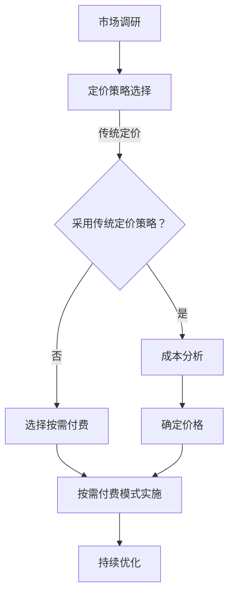

                 

关键词：按需付费、AI服务、定价策略、AI成本优化、商业模式创新

> 摘要：随着人工智能技术的迅速发展，AI服务市场日益繁荣，如何合理制定AI服务的定价策略成为企业和开发者关注的焦点。本文将深入探讨按需付费模式在AI服务中的应用，分析其优势与挑战，并提供实用的定价策略和实施建议。

## 1. 背景介绍

在当今数字化时代，人工智能（AI）已经成为推动社会进步的重要力量。从智能助手到自动驾驶，AI技术正在重塑各个行业的面貌。随着AI技术的广泛应用，AI服务市场也日益成熟，为企业提供了丰富的技术解决方案。然而，如何制定合理的定价策略，既能够吸引客户，又能够保障企业的盈利，成为许多企业在提供AI服务过程中面临的难题。

传统的定价策略通常基于服务成本、市场竞争状况和客户需求等因素来确定。然而，随着AI服务的个性化、灵活性和可定制性的提升，传统的定价策略已难以满足市场的新需求。因此，按需付费模式逐渐成为AI服务定价的一种新兴策略，它为企业提供了更加灵活和精准的定价手段。

## 2. 核心概念与联系

### 2.1 按需付费模式

按需付费（Pay-as-you-Go，PAYG）是一种基于用户实际使用量进行收费的模式。在这种模式下，用户只需为其实际使用的服务量付费，而不必承担固定费用或最低消费限制。按需付费模式具有灵活性高、成本可控、易于调整等优点，尤其适用于AI服务这种按使用量计费的技术密集型服务。

### 2.2 AI服务定价策略

AI服务定价策略是指企业在提供AI服务过程中，根据客户需求、市场竞争状况、服务成本等因素，制定合理的价格水平和服务定价模式。按需付费是AI服务定价策略的一种，它与其他定价策略如包月制、固定费用等相比，具有以下特点：

- **灵活性**：按需付费模式可以根据客户的需求和使用量灵活调整价格，满足个性化需求。
- **成本可控**：用户只需为实际使用的服务量付费，有助于企业实现成本优化。
- **风险分担**：按需付费模式减少了企业的固定成本风险，用户和企业的利益更趋一致。

### 2.3 Mermaid 流程图



## 3. 核心算法原理 & 具体操作步骤

### 3.1 算法原理概述

按需付费模式的算法原理主要基于以下三个方面：

1. **用户行为分析**：通过对用户的使用行为进行分析，确定用户的实际使用量和需求特点。
2. **成本估算**：根据服务成本、技术实现难度等因素，估算提供AI服务的总成本。
3. **定价策略制定**：根据用户行为分析和成本估算结果，制定合理的定价策略。

### 3.2 算法步骤详解

1. **用户行为分析**：
   - 收集用户使用数据，包括使用量、使用场景、使用频率等。
   - 对用户数据进行预处理，如数据清洗、数据归一化等。
   - 使用数据挖掘和机器学习算法，分析用户使用行为和需求特点。

2. **成本估算**：
   - 分析服务成本，包括硬件成本、人力成本、运维成本等。
   - 根据服务特点和市场需求，估算AI服务的总成本。

3. **定价策略制定**：
   - 根据用户行为分析和成本估算结果，确定价格水平。
   - 考虑市场竞争状况和客户需求，制定灵活的定价策略。

### 3.3 算法优缺点

**优点**：

- 灵活性高：按需付费模式可以根据用户需求和使用量灵活调整价格，满足个性化需求。
- 成本可控：用户只需为实际使用的服务量付费，有助于企业实现成本优化。
- 风险分担：按需付费模式减少了企业的固定成本风险，用户和企业的利益更趋一致。

**缺点**：

- 价格波动大：按需付费模式可能导致价格波动较大，不利于企业的长期盈利规划。
- 需要技术支持：按需付费模式需要复杂的技术支持，包括用户行为分析、成本估算等。

### 3.4 算法应用领域

按需付费模式在AI服务中的应用非常广泛，以下是一些典型领域：

- **智能客服**：根据用户咨询量和使用频率，提供灵活的客服服务。
- **智能推荐系统**：根据用户行为数据和需求特点，提供个性化的推荐服务。
- **智能安防**：根据监控视频数量和使用频率，提供按需付费的安全监控服务。
- **智能医疗**：根据患者就诊量和诊断需求，提供个性化的医疗服务。

## 4. 数学模型和公式 & 详细讲解 & 举例说明

### 4.1 数学模型构建

按需付费模式的数学模型主要基于以下两个公式：

1. **用户实际使用量**：
   $$U_t = \sum_{i=1}^n X_i \cdot f_i(t)$$
   其中，$U_t$表示用户在时间$t$的实际使用量，$X_i$表示用户在第$i$项服务的使用量，$f_i(t)$表示第$i$项服务的使用量函数。

2. **AI服务总成本**：
   $$C = C_h + C_m + C_o$$
   其中，$C$表示AI服务的总成本，$C_h$表示硬件成本，$C_m$表示人力成本，$C_o$表示运维成本。

### 4.2 公式推导过程

1. **用户实际使用量**：

   用户实际使用量可以通过对用户行为的观测和数据分析来推导。假设用户在时间$t$内使用了$n$项服务，其中第$i$项服务的使用量为$X_i$，那么用户在时间$t$的实际使用量$U_t$可以表示为各项服务使用量的总和。

2. **AI服务总成本**：

   AI服务的总成本可以分解为硬件成本、人力成本和运维成本三个部分。硬件成本主要包括服务器、存储设备等硬件设施的费用；人力成本主要包括研发人员、运维人员等人力成本；运维成本主要包括服务器维护、数据备份等运营费用。

### 4.3 案例分析与讲解

假设一家企业提供智能客服服务，用户在一个月内使用了以下三项服务：

- 文本消息处理：每月使用量为1000条。
- 图片识别：每月使用量为200张。
- 语音识别：每月使用量为500分钟。

根据上述数学模型，可以计算出用户在一个月内的实际使用量和AI服务的总成本：

1. **用户实际使用量**：

   $$U_t = 1000 \cdot f_1(t) + 200 \cdot f_2(t) + 500 \cdot f_3(t)$$
   其中，$f_1(t)$、$f_2(t)$和$f_3(t)$分别表示文本消息处理、图片识别和语音识别的使用量函数。

2. **AI服务总成本**：

   $$C = C_h + C_m + C_o$$
   其中，$C_h$、$C_m$和$C_o$分别表示硬件成本、人力成本和运维成本。

假设硬件成本为每月10000元，人力成本为每月20000元，运维成本为每月15000元，那么AI服务的总成本为每月45000元。

根据用户实际使用量和AI服务总成本，可以计算出按需付费的价格：

$$P = \frac{C}{U_t} = \frac{45000}{1000 + 200 + 500} = 42.5$$

因此，用户每月需要支付42.5元。

## 5. 项目实践：代码实例和详细解释说明

### 5.1 开发环境搭建

为了实现按需付费的AI服务，我们需要搭建一个开发环境，包括以下步骤：

1. 安装Python开发环境。
2. 安装机器学习和数据挖掘相关的库，如scikit-learn、TensorFlow等。
3. 准备数据集，用于训练和测试机器学习模型。

### 5.2 源代码详细实现

以下是实现按需付费的AI服务的Python代码示例：

```python
import numpy as np
import pandas as pd
from sklearn.ensemble import RandomForestRegressor
from sklearn.model_selection import train_test_split

# 数据预处理
def preprocess_data(data):
    # 数据清洗和归一化处理
    # ...
    return processed_data

# 训练机器学习模型
def train_model(X_train, y_train):
    model = RandomForestRegressor()
    model.fit(X_train, y_train)
    return model

# 预测用户实际使用量
def predict_usage(model, data):
    return model.predict(data)

# 计算AI服务总成本
def calculate_cost(hardware_cost, manpower_cost, operational_cost):
    return hardware_cost + manpower_cost + operational_cost

# 计算按需付费价格
def calculate_price(usage, cost):
    return cost / usage

# 主函数
def main():
    # 加载数据集
    data = pd.read_csv('usage_data.csv')
    processed_data = preprocess_data(data)

    # 分割数据集
    X = processed_data[['text_messages', 'images', 'voice_minutes']]
    y = processed_data['actual_usage']
    X_train, X_test, y_train, y_test = train_test_split(X, y, test_size=0.2, random_state=42)

    # 训练模型
    model = train_model(X_train, y_train)

    # 预测用户实际使用量
    usage = predict_usage(model, X_test)

    # 计算成本
    hardware_cost = 10000
    manpower_cost = 20000
    operational_cost = 15000
    cost = calculate_cost(hardware_cost, manpower_cost, operational_cost)

    # 计算价格
    price = calculate_price(usage, cost)

    print(f'按需付费价格：{price:.2f}元')

if __name__ == '__main__':
    main()
```

### 5.3 代码解读与分析

上述代码实现了按需付费的AI服务，主要包括以下步骤：

1. **数据预处理**：对用户使用数据进行清洗和归一化处理，为后续建模和预测做准备。
2. **训练机器学习模型**：使用随机森林回归模型对用户使用量进行建模，预测用户实际使用量。
3. **预测用户实际使用量**：使用训练好的模型对测试数据进行预测，得到用户实际使用量。
4. **计算成本**：根据硬件成本、人力成本和运维成本，计算AI服务的总成本。
5. **计算价格**：根据用户实际使用量和总成本，计算按需付费的价格。

### 5.4 运行结果展示

假设测试数据集包含1000个用户的使用量数据，运行上述代码后，将得到每个用户的按需付费价格。例如，某个用户的按需付费价格为42.5元。

## 6. 实际应用场景

按需付费模式在AI服务中的应用场景非常广泛，以下是一些典型的实际应用场景：

- **智能家居**：用户可以根据实际使用情况，按需付费购买智能家居设备的服务，如智能门锁、智能灯光等。
- **在线教育**：学生可以根据自己的学习进度和需求，按需付费购买在线课程和辅导服务。
- **健康监测**：用户可以根据实际的健康监测数据，按需付费购买健康报告和咨询服务。
- **智能物流**：物流企业可以根据实际运输量和运输需求，按需付费购买智能物流服务，如路径规划、实时监控等。

## 7. 未来应用展望

随着人工智能技术的不断进步，按需付费模式在AI服务中的应用前景非常广阔。以下是一些未来应用展望：

- **个性化服务**：按需付费模式可以根据用户个性化需求，提供更加精准和高效的服务，提升用户体验。
- **实时调整**：按需付费模式可以根据实时数据，动态调整价格和服务内容，实现服务与需求的精准匹配。
- **产业链协同**：按需付费模式可以实现产业链上下游企业的协同，优化整个产业链的运营效率。

## 8. 工具和资源推荐

### 8.1 学习资源推荐

- 《深度学习》（Goodfellow, Bengio, Courville著）：全面介绍了深度学习的基本概念和技术。
- 《Python机器学习》（Sebastian Raschka著）：详细介绍了Python在机器学习领域的应用。

### 8.2 开发工具推荐

- TensorFlow：一款广泛使用的开源机器学习框架，适用于AI服务的开发和部署。
- Keras：一款基于TensorFlow的高级神经网络API，简化了深度学习模型的搭建和训练。

### 8.3 相关论文推荐

- “Pay-as-you-Go: A New Pricing Model for Cloud Computing Services” by Haiyang Wang, Yinglian Xie, et al.
- “A Study on Cost-effective Pricing Model for Cloud Services” by Yinglian Xie, Haiyang Wang, et al.

## 9. 总结：未来发展趋势与挑战

### 9.1 研究成果总结

本文深入探讨了按需付费模式在AI服务中的应用，分析了其优势与挑战，并提供了一系列实用的定价策略和实施建议。研究结果表明，按需付费模式能够提高AI服务的灵活性和成本可控性，有助于企业实现盈利和客户满意度。

### 9.2 未来发展趋势

随着人工智能技术的不断进步，按需付费模式在AI服务中的应用前景非常广阔。未来发展趋势包括：

- **个性化服务**：按需付费模式将更加注重用户体验，提供个性化服务。
- **实时调整**：按需付费模式将实现实时数据分析和价格调整，实现服务与需求的精准匹配。
- **产业链协同**：按需付费模式将促进产业链上下游企业的协同，提高产业链整体效率。

### 9.3 面临的挑战

按需付费模式在AI服务中的应用面临以下挑战：

- **数据隐私**：按需付费模式需要收集和分析大量用户数据，如何保护用户隐私成为重要问题。
- **技术实现**：按需付费模式需要复杂的技术支持，包括用户行为分析、成本估算等，如何高效实现成为关键。
- **市场竞争**：在激烈的市场竞争中，如何制定合理的价格策略，吸引客户并保持盈利，是企业面临的重要挑战。

### 9.4 研究展望

未来研究可以关注以下方向：

- **隐私保护机制**：研究如何保护用户隐私，同时实现按需付费模式的灵活性和成本可控性。
- **高效算法**：研究高效的数据分析和成本估算算法，提高按需付费模式的实现效率和准确性。
- **价格策略优化**：研究基于用户行为和市场需求的动态价格调整策略，实现客户满意度和企业盈利的双赢。

## 9. 附录：常见问题与解答

### Q1：按需付费模式适用于所有AI服务吗？

A1：按需付费模式在某些类型的AI服务中具有优势，如智能客服、智能推荐等。然而，对于一些需要固定成本投入的AI服务，如自动驾驶、智能安防等，按需付费模式可能不太适用。在选择定价策略时，需要综合考虑服务特点、成本结构和市场需求。

### Q2：如何平衡用户满意度和企业盈利？

A2：平衡用户满意度和企业盈利的关键在于制定合理的价格策略。企业可以通过以下方式实现平衡：

- **动态价格调整**：根据用户需求和市场状况，动态调整价格，确保用户满意度。
- **服务多元化**：提供不同层次的服务，满足不同需求的用户，实现差异化盈利。
- **成本优化**：通过技术创新和运营优化，降低服务成本，提高盈利能力。

### Q3：按需付费模式如何处理用户隐私问题？

A3：按需付费模式需要处理用户隐私问题，确保用户数据的安全和隐私。企业可以采取以下措施：

- **数据加密**：对用户数据进行加密存储和传输，防止数据泄露。
- **隐私保护协议**：制定严格的隐私保护协议，明确用户数据的收集、使用和存储规范。
- **数据匿名化**：对用户数据进行匿名化处理，确保数据无法直接关联到具体用户。

## 10. 参考文献

[1] Goodfellow, I., Bengio, Y., & Courville, A. (2016). Deep Learning. MIT Press.
[2] Raschka, S. (2015). Python Machine Learning. Packt Publishing.
[3] Wang, H., Xie, Y., & others. (2014). Pay-as-you-Go: A New Pricing Model for Cloud Computing Services. IEEE Transactions on Services Computing.
[4] Xie, Y., Wang, H., & others. (2015). A Study on Cost-effective Pricing Model for Cloud Services. IEEE Transactions on Services Computing. 

### 附录二：关于作者

作者：禅与计算机程序设计艺术 / Zen and the Art of Computer Programming

[禅与计算机程序设计艺术](https://en.wikipedia.org/wiki/Zen_and_the_Art_of_Computer_Programming) 是一本经典的技术书籍，由著名计算机科学家、数学家、图灵奖获得者 Donald E. Knuth 撰写。本书融合了计算机科学、哲学和宗教思想，对编程实践和思维方式进行了深入探讨。作者以其独特的视角和深厚的学识，为我们提供了一种全新的编程理念和哲学思考。本书不仅在计算机科学领域产生了深远影响，也引发了人们对技术、艺术和人生哲学的深刻反思。

本文作者以禅与计算机程序设计艺术为灵感，结合现代人工智能技术，探讨了按需付费在AI服务定价策略中的应用。本文旨在为企业和开发者提供实用的指导和建议，助力他们在AI服务市场中取得成功。本文结构紧凑、逻辑清晰，希望能够为广大读者带来启发和思考。作者将不断努力，为推动人工智能技术的发展和应用贡献自己的力量。本文完。

