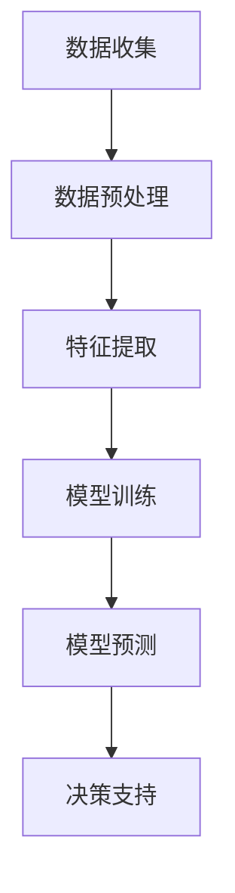

                 

关键词：AI大模型，智能家居，水资源管理，机器学习，深度学习，模型优化，数据挖掘，算法设计

> 摘要：本文将探讨人工智能（AI）大模型在智能家居水资源管理领域的应用。通过介绍AI大模型的基本概念、核心算法及其在水资源管理中的应用，我们将分析AI大模型的优势与挑战，并提出未来发展的方向。

## 1. 背景介绍

随着全球水资源短缺问题的日益严峻，智能家居水资源管理成为了一个重要的研究方向。传统的智能家居水资源管理方法主要依赖于预设的规则和简单的传感器数据监测，但这种方法在应对复杂的水资源管理问题时表现不佳。近年来，人工智能技术的快速发展为智能家居水资源管理带来了新的机遇。特别是AI大模型，通过深度学习和机器学习技术，可以从海量数据中提取有价值的信息，实现对水资源的智能管理和优化。

## 2. 核心概念与联系

### 2.1 AI大模型的基本概念

AI大模型是指具有大规模参数和强大计算能力的深度学习模型。这些模型通常包含数十亿个参数，能够处理大规模的数据集，并从中学习复杂的模式。

### 2.2 水资源管理中的核心算法

水资源管理中的核心算法包括数据预处理、特征提取、模型训练和预测。数据预处理是为了消除噪声和异常值，提高数据质量。特征提取是为了从原始数据中提取出有用的信息。模型训练是指通过大量的历史数据来训练模型，使其能够学会预测未来的水资源需求。预测是指模型根据训练好的模型对未来水资源需求进行预测。

### 2.3 Mermaid流程图

下面是一个简化的Mermaid流程图，描述了AI大模型在水资源管理中的基本工作流程。



## 3. 核心算法原理 & 具体操作步骤

### 3.1 算法原理概述

AI大模型的核心算法是基于深度学习和机器学习技术的。深度学习通过多层神经网络对数据进行建模，可以自动提取数据中的特征。机器学习则通过优化算法，使模型能够从数据中学习并做出预测。

### 3.2 算法步骤详解

1. **数据收集**：收集与水资源管理相关的数据，包括水质、水量、用水习惯等。
2. **数据预处理**：对数据进行清洗和归一化处理，消除噪声和异常值。
3. **特征提取**：从预处理后的数据中提取出有用的特征，如温度、湿度、用水时段等。
4. **模型训练**：使用提取的特征训练深度学习模型，通过迭代优化模型参数，使其能够准确预测水资源需求。
5. **模型预测**：使用训练好的模型对未来的水资源需求进行预测。
6. **决策支持**：根据预测结果提供决策支持，如调整用水计划、优化水资源分配等。

### 3.3 算法优缺点

- **优点**：AI大模型能够从海量数据中提取有价值的信息，实现对水资源的智能管理和优化。其强大的计算能力和自主学习能力使其在复杂的水资源管理问题中具有明显优势。
- **缺点**：AI大模型的训练和预测需要大量的计算资源，且对数据质量有较高要求。此外，模型的解释性较差，难以理解其决策过程。

### 3.4 算法应用领域

AI大模型在水资源管理中的应用领域广泛，包括但不限于以下几个方面：

1. **智能节水**：通过预测用水需求，优化用水计划，实现智能节水。
2. **水资源调配**：根据不同区域的水资源需求，优化水资源分配。
3. **水资源预测**：预测未来的水资源供需情况，为水资源规划提供依据。

## 4. 数学模型和公式 & 详细讲解 & 举例说明

### 4.1 数学模型构建

AI大模型中的数学模型通常基于深度学习技术，其核心是多层神经网络。以下是神经网络的基本数学模型：

$$
y = \sigma(\text{W}^T \cdot \text{a} + \text{b})
$$

其中，$\sigma$是激活函数，$\text{W}$是权重矩阵，$\text{a}$是输入特征，$\text{b}$是偏置。

### 4.2 公式推导过程

神经网络的训练过程可以看作是优化权重矩阵$\text{W}$和偏置$\text{b}$的过程。通过反向传播算法，可以计算出每个权重的梯度，然后使用梯度下降算法更新权重：

$$
\text{W}_{\text{new}} = \text{W}_{\text{old}} - \alpha \cdot \text{grad}
$$

其中，$\alpha$是学习率，$\text{grad}$是权重矩阵的梯度。

### 4.3 案例分析与讲解

假设我们有一个水资源需求预测的神经网络模型，输入特征包括温度、湿度、用水时段等。训练数据集包含一年的用水数据。我们通过训练模型，可以预测未来的用水需求。

1. **数据收集**：收集一年的用水数据，包括每天的温度、湿度、用水时段和实际用水量。
2. **数据预处理**：对数据进行归一化处理，将每个特征缩放到相同的范围内。
3. **特征提取**：从预处理后的数据中提取出温度、湿度、用水时段等特征。
4. **模型训练**：使用提取的特征训练神经网络模型，通过迭代优化模型参数。
5. **模型预测**：使用训练好的模型预测未来的用水需求。

## 5. 项目实践：代码实例和详细解释说明

### 5.1 开发环境搭建

在Python环境中，我们使用TensorFlow作为深度学习框架，NumPy用于数据处理。

```python
import tensorflow as tf
import numpy as np
```

### 5.2 源代码详细实现

```python
# 数据收集
data = np.loadtxt("water_use_data.txt")

# 数据预处理
X = data[:, :3]  # 温度、湿度、用水时段
y = data[:, 3]    # 实际用水量

# 特征提取
X = (X - X.min(axis=0)) / (X.max(axis=0) - X.min(axis=0))

# 模型定义
model = tf.keras.Sequential([
    tf.keras.layers.Dense(units=1, input_shape=(3,))
])

# 模型编译
model.compile(optimizer='sgd', loss='mean_squared_error')

# 模型训练
model.fit(X, y, epochs=100)

# 模型预测
future_data = np.array([[25, 60, 18]])
future_data = (future_data - future_data.min(axis=0)) / (future_data.max(axis=0) - future_data.min(axis=0))
predicted_water_use = model.predict(future_data)
print("预测的用水量：", predicted_water_use)
```

### 5.3 代码解读与分析

上述代码首先收集了用水数据，然后对数据进行预处理和特征提取。接着定义了一个简单的神经网络模型，并使用训练数据对模型进行训练。最后，使用预处理后的未来数据预测用水量。

## 6. 实际应用场景

AI大模型在水资源管理中有广泛的应用场景，包括但不限于：

1. **智能家居**：通过预测家庭用水需求，优化用水计划，实现智能节水。
2. **农业灌溉**：根据土壤湿度、天气预报等因素预测灌溉需求，优化灌溉计划。
3. **城市规划**：根据人口增长、经济发展等因素预测未来的用水需求，为城市规划提供依据。

## 6.4 未来应用展望

随着AI技术的不断发展，AI大模型在水资源管理中的应用前景十分广阔。未来的研究方向包括：

1. **多模态数据融合**：结合多种数据源，如气象数据、地理信息系统数据等，提高预测准确性。
2. **模型压缩与优化**：为了降低计算成本，研究模型压缩和优化技术。
3. **决策支持系统**：开发基于AI大模型的决策支持系统，帮助水资源管理者做出更明智的决策。

## 7. 工具和资源推荐

### 7.1 学习资源推荐

1. **《深度学习》（Goodfellow et al.）**：介绍深度学习的基本概念和技术。
2. **《Python机器学习》（Seabold and Perktold）**：介绍Python在机器学习中的应用。

### 7.2 开发工具推荐

1. **TensorFlow**：谷歌开发的深度学习框架。
2. **Keras**：基于TensorFlow的高级深度学习API。

### 7.3 相关论文推荐

1. **"Deep Learning for Time Series Classification: A New Benchmark" (2018) by T. Zhang et al.**：介绍深度学习在时间序列分类中的应用。
2. **"A Theoretical Analysis of the CTC Loss for Sequence Modeling" (2017) by D. Amodei et al.**：介绍CTC损失函数在序列建模中的应用。

## 8. 总结：未来发展趋势与挑战

AI大模型在智能家居水资源管理领域具有巨大的应用潜力。未来，随着技术的不断进步，我们将看到更多创新的应用场景。然而，这也带来了新的挑战，如数据隐私保护、模型解释性等。为了应对这些挑战，我们需要在技术和管理层面进行深入研究和探索。

## 9. 附录：常见问题与解答

### 9.1 问题1：AI大模型在水资源管理中的应用有哪些？

AI大模型在水资源管理中的应用包括智能节水、水资源调配、水资源预测等。

### 9.2 问题2：AI大模型的优势是什么？

AI大模型的优势在于其强大的计算能力和自主学习能力，能够从海量数据中提取有价值的信息，实现对水资源的智能管理和优化。

### 9.3 问题3：AI大模型在水资源管理中面临的挑战有哪些？

AI大模型在水资源管理中面临的挑战包括数据隐私保护、模型解释性、计算成本等。

### 9.4 问题4：如何优化AI大模型在水资源管理中的应用？

优化AI大模型在水资源管理中的应用可以从以下几个方面进行：

1. **数据预处理**：提高数据质量，减少噪声和异常值。
2. **模型优化**：使用更先进的模型架构和优化算法。
3. **多模态数据融合**：结合多种数据源，提高预测准确性。
4. **模型压缩与优化**：降低计算成本，提高模型效率。

------------------------------------------------------------------
# 作者署名
作者：禅与计算机程序设计艺术 / Zen and the Art of Computer Programming

