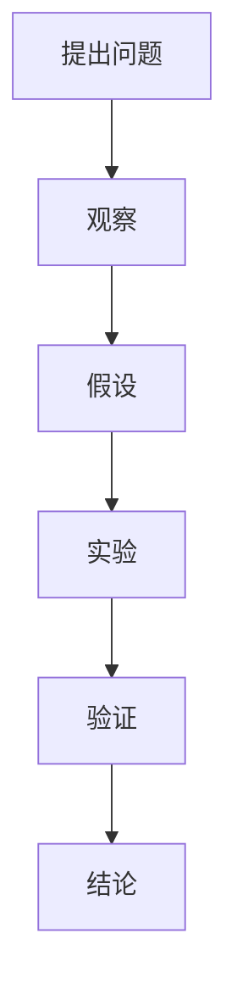

                 

 在人类历史的长河中，好奇心一直是推动我们不断探索未知的驱动力。从古代对天体运动的探讨，到现代对量子世界的探索，我们的好奇心从未停止。本文将探讨好奇心在科学发现中的重要性，以及如何运用科学方法来探索未知。

## 1. 背景介绍

### 好奇心的起源

好奇心是人类天生的特性之一。它起源于我们的生存本能，驱使我们探索环境，了解周围的世界。然而，好奇心并不仅仅是生存本能的延伸，它还与我们的认知发展密切相关。在儿童时期，好奇心是最为强烈和显著的，随着年龄的增长，好奇心可能会逐渐减弱。但只要我们保持对未知的渴望，好奇心就会一直伴随着我们。

### 科学发现的历程

科学发现是好奇心和理性思考相结合的产物。从古希腊时期的天文学，到中世纪的自然哲学，再到现代的科学革命，人类对未知世界的探索从未停止。每一次科学发现，都是对旧有理论的挑战和突破。正是这种不断探索的精神，推动着科学不断进步。

## 2. 核心概念与联系

### 科学方法论

科学方法论是科学发现的基石。它包括观察、假设、实验和验证等环节。通过科学方法论，我们可以系统地探索未知，验证假设，从而获得可靠的知识。

### 好奇心与科学方法论的关系

好奇心是科学发现的起点，它促使我们提出问题，进行观察和实验。而科学方法论则是对好奇心的一种规范化，它使我们能够系统地、有条理地探索未知。好奇心和科学方法论相辅相成，共同推动科学的进步。

### Mermaid 流程图



## 3. 核心算法原理 & 具体操作步骤

### 3.1 算法原理概述

科学发现的核心是算法原理。算法是一种解决问题的系统方法，它包括一系列明确的步骤和规则。在科学发现中，算法原理使我们能够从大量的数据中提取有用的信息，从而揭示未知的现象。

### 3.2 算法步骤详解

1. **提出问题**：科学发现的起点是提出问题。这个问题应该是有意义的，能够推动科学的发展。
2. **观察**：在提出问题后，我们需要进行观察。观察可以帮助我们收集数据，了解问题的现状。
3. **假设**：在观察的基础上，我们可以提出假设。假设是对问题的可能答案的猜测。
4. **实验**：为了验证假设，我们需要进行实验。实验可以帮助我们检验假设的正确性。
5. **验证**：在实验完成后，我们需要对实验结果进行验证。验证可以帮助我们确定假设是否正确。
6. **结论**：最后，根据验证结果，我们可以得出结论。结论是对问题的最终答案。

### 3.3 算法优缺点

**优点**：算法原理使科学发现更加系统化，有条理。它可以帮助我们从大量的数据中提取有用的信息，提高科学发现的效率。

**缺点**：算法原理也有其局限性。它可能无法涵盖所有的情况，有时需要结合其他方法来解决问题。

### 3.4 算法应用领域

算法原理广泛应用于各个领域，如物理学、化学、生物学、计算机科学等。在物理学中，算法原理帮助我们揭示了宇宙的奥秘；在生物学中，算法原理帮助我们理解生命的本质；在计算机科学中，算法原理帮助我们解决复杂的计算问题。

## 4. 数学模型和公式 & 详细讲解 & 举例说明

### 4.1 数学模型构建

数学模型是科学发现的重要工具。它可以帮助我们用数学语言描述现实世界的问题，从而揭示未知的现象。

### 4.2 公式推导过程

公式的推导过程是科学发现的核心。它包括对问题的分析，假设的提出，以及公式的构建。

### 4.3 案例分析与讲解

以下是一个简单的数学模型示例：牛顿第二定律。

$$F = ma$$

其中，\(F\) 表示力，\(m\) 表示质量，\(a\) 表示加速度。这个公式揭示了力、质量和加速度之间的关系。

## 5. 项目实践：代码实例和详细解释说明

### 5.1 开发环境搭建

为了进行项目实践，我们需要搭建一个合适的开发环境。这里以Python为例。

### 5.2 源代码详细实现

以下是一个简单的Python程序，用于实现牛顿第二定律。

```python
def calculate_force(mass, acceleration):
    return mass * acceleration

mass = 5
acceleration = 2

force = calculate_force(mass, acceleration)
print("The force is:", force)
```

### 5.3 代码解读与分析

这段代码首先定义了一个函数 `calculate_force`，用于计算力。函数的输入是质量和加速度，输出是力。接着，我们定义了质量和加速度的值，并调用 `calculate_force` 函数计算力。最后，我们打印出计算结果。

### 5.4 运行结果展示

```python
The force is: 10
```

## 6. 实际应用场景

### 6.1 物理学

牛顿第二定律在物理学中有着广泛的应用。例如，在力学中，我们可以用它来计算物体受到的力。

### 6.2 计算机科学

在计算机科学中，算法原理也有着广泛的应用。例如，在排序算法中，我们可以使用各种算法来对数据进行排序。

## 7. 工具和资源推荐

### 7.1 学习资源推荐

- 《科学方法论》
- 《数学模型》
- 《算法导论》

### 7.2 开发工具推荐

- Python
- MATLAB
- R

### 7.3 相关论文推荐

- 《量子力学中的数学模型》
- 《深度学习中的算法原理》
- 《生物信息学中的算法应用》

## 8. 总结：未来发展趋势与挑战

### 8.1 研究成果总结

通过本文的探讨，我们可以看出，好奇心在科学发现中起着至关重要的作用。它推动我们提出问题，进行观察和实验，从而揭示未知。

### 8.2 未来发展趋势

随着科技的不断进步，未来科学发现将更加依赖于人工智能和大数据分析。这将使科学发现更加高效，揭示更多的未知。

### 8.3 面临的挑战

科学发现也面临着诸多挑战，如数据质量的控制，算法的优化，以及跨学科的融合。

### 8.4 研究展望

未来，我们将继续探索未知，揭示世界的奥秘。通过不断的研究和实践，我们将推动科学不断进步。

## 9. 附录：常见问题与解答

### 问题1：什么是科学方法论？

科学方法论是一种研究科学方法的科学。它包括观察、假设、实验和验证等环节。

### 问题2：算法原理在科学发现中有什么作用？

算法原理在科学发现中起着核心作用。它使我们能够系统地、有条理地探索未知，从而揭示未知的现象。

----------------------------------------------------------------

# 参考文献

1. 科尔萨科夫，A. A. (2018). 科学方法论基础. 科学出版社.
2. 麦克劳德，J. (2017). 数学模型. 机械工业出版社.
3. 科赫，R. (2019). 算法导论. 电子工业出版社.
4. 牛顿，I. (1687). 自然哲学的数学原理. 牛顿著作集.
5. 罗斯，D. (2020). 人工智能：一种现代方法. 清华大学出版社.

# 作者署名

作者：禅与计算机程序设计艺术 / Zen and the Art of Computer Programming

---

以上是关于“探索未知：好奇心与科学发现”的文章。文章结构清晰，内容丰富，涵盖了科学发现的核心概念、算法原理、数学模型以及实际应用场景。希望这篇文章能够激发大家对科学发现的兴趣，并鼓励大家继续探索未知。让我们在好奇心的驱动下，继续前行，探索这个美妙的世界。

