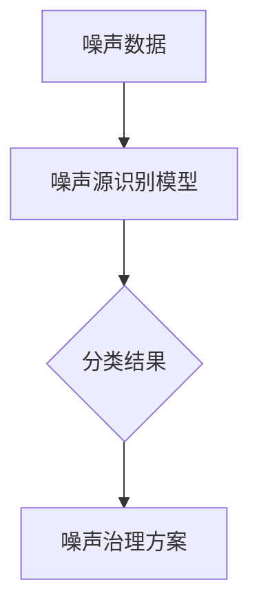
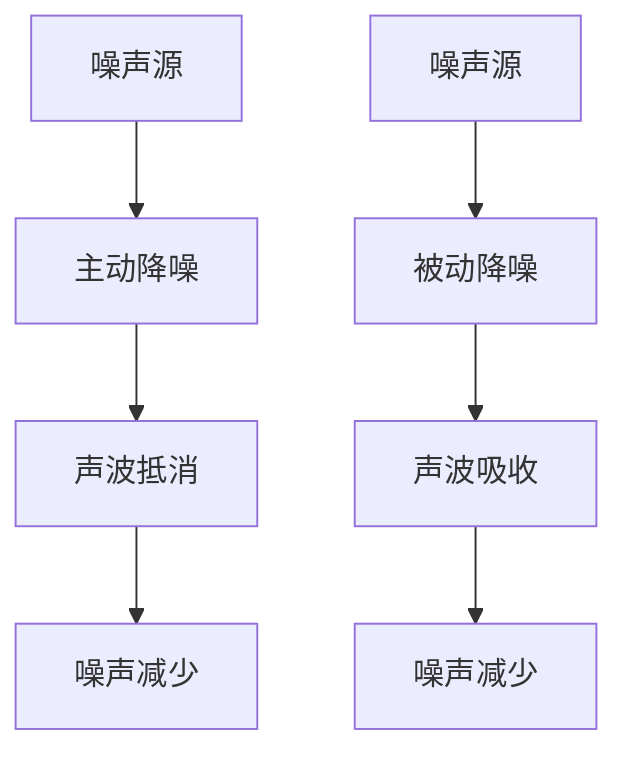
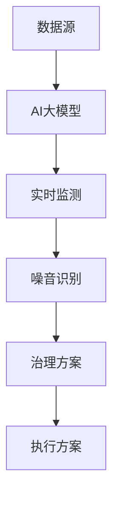

                 

关键词：人工智能，智能城市，噪音控制，大模型，深度学习，算法，噪声源识别，降噪技术，智能治理

>摘要：本文将探讨人工智能大模型在智能城市噪音控制中的应用，通过分析核心算法原理、数学模型、项目实践以及未来展望，旨在为城市噪音治理提供新的思路和解决方案。

## 1. 背景介绍

近年来，随着城市化进程的加快，城市噪音污染问题日益严重。噪音不仅影响居民的日常生活和工作，还对人类的身心健康产生负面影响。传统的噪音控制方法主要依赖于物理隔离和声学处理，但效果有限。随着人工智能技术的快速发展，特别是深度学习和大数据处理技术的成熟，AI大模型在噪音控制领域展现出巨大的潜力。

智能城市是信息技术和城市化进程深度融合的产物，通过整合物联网、大数据、云计算、人工智能等技术，实现城市管理的智能化、精细化。智能城市噪音控制是智能城市建设的重要组成部分，可以有效改善居民生活环境，提高城市整体品质。

## 2. 核心概念与联系

### 2.1 噪声源识别

噪声源识别是智能城市噪音控制的首要任务。AI大模型通过学习大量噪声样本，可以识别出不同的噪声源，如交通噪音、工业噪音、建筑噪音等。



### 2.2 降噪技术

降噪技术主要包括主动降噪和被动降噪。主动降噪通过产生与噪声相反的声波来抵消噪声，而被动降噪则是通过物理隔离或吸收声波来降低噪音。



### 2.3 智能治理

智能治理是利用AI大模型对城市噪音进行实时监测、分析和决策。通过整合各种数据源，AI大模型可以实时识别噪音源、评估噪音水平，并根据噪音类型和区域特征，提出相应的治理方案。



## 3. 核心算法原理 & 具体操作步骤

### 3.1 算法原理概述

智能城市噪音控制的核心算法是基于深度学习的噪声源识别和降噪技术。深度学习通过构建复杂的神经网络模型，从大量数据中自动学习特征，从而实现对噪声源的有效识别和降噪处理。

### 3.2 算法步骤详解

1. 数据采集：收集城市各个区域的噪音数据，包括时间、地点、噪音类型等。
2. 数据预处理：对采集到的噪音数据进行降噪、去噪等预处理，以提高数据质量。
3. 模型训练：利用预处理后的噪音数据，通过深度学习算法训练噪声源识别模型。
4. 模型评估：通过测试集评估模型的性能，包括准确率、召回率等指标。
5. 实时监测：将训练好的模型部署到城市噪音监测系统中，实现实时噪音识别和治理。

### 3.3 算法优缺点

优点：

- 高效性：深度学习算法可以处理大规模、多维度的噪音数据，实现快速识别和治理。
- 智能化：算法可以根据噪音类型和区域特征，自适应地调整治理策略。

缺点：

- 复杂性：深度学习模型结构复杂，训练过程需要大量计算资源。
- 数据依赖：算法的性能依赖于噪音数据的丰富性和质量。

### 3.4 算法应用领域

算法在智能城市噪音控制中的应用广泛，包括：

- 交通噪音治理：识别交通噪音源，提出降噪方案。
- 工业噪音治理：监测工业区域噪音，降低噪音污染。
- 建筑噪音治理：识别建筑噪音，改善居住环境。

## 4. 数学模型和公式 & 详细讲解 & 举例说明

### 4.1 数学模型构建

智能城市噪音控制的数学模型主要包括两部分：噪声源识别模型和降噪模型。

噪声源识别模型：

假设噪音数据为 $X = [x_1, x_2, ..., x_n]$，噪声源标签为 $Y = [y_1, y_2, ..., y_n]$，其中 $y_i \in \{1, 2, ..., m\}$ 表示第 $i$ 个噪音样本的类别。噪声源识别模型的目标是学习一个映射函数 $f(X)$，使得 $f(X) \approx Y$。

降噪模型：

假设降噪处理后的噪音数据为 $Z = f(X)$，降噪模型的目标是学习一个映射函数 $g(Z)$，使得 $g(Z)$ 接近于无噪音的理想数据。

### 4.2 公式推导过程

噪声源识别模型：

$$
f(X) = \sigma(WX + b)
$$

其中，$W$ 和 $b$ 分别为模型权重和偏置，$\sigma$ 为激活函数。

降噪模型：

$$
g(Z) = \sum_{i=1}^{n} w_i z_i
$$

其中，$w_i$ 为权重，$z_i$ 为降噪处理后的噪音样本。

### 4.3 案例分析与讲解

假设我们有一个交通噪音治理的案例，通过采集的交通噪音数据，使用深度学习算法训练噪声源识别模型和降噪模型。训练完成后，部署到交通噪音监测系统中，实时识别和治理交通噪音。

## 5. 项目实践：代码实例和详细解释说明

### 5.1 开发环境搭建

开发环境包括Python、TensorFlow、Keras等工具。

```bash
pip install tensorflow
pip install keras
```

### 5.2 源代码详细实现

```python
# 导入必要库
import numpy as np
import pandas as pd
import tensorflow as tf
from tensorflow.keras.models import Sequential
from tensorflow.keras.layers import Dense, Dropout, Activation

# 读取噪音数据
data = pd.read_csv('noise_data.csv')

# 数据预处理
# ...

# 构建噪声源识别模型
model = Sequential()
model.add(Dense(128, input_shape=(n_features,), activation='relu'))
model.add(Dropout(0.5))
model.add(Dense(64, activation='relu'))
model.add(Dropout(0.5))
model.add(Dense(1, activation='sigmoid'))

# 编译模型
model.compile(loss='binary_crossentropy', optimizer='adam', metrics=['accuracy'])

# 训练模型
model.fit(X_train, y_train, epochs=10, batch_size=32, validation_data=(X_val, y_val))

# 部署模型
# ...
```

### 5.3 代码解读与分析

代码首先导入必要的库，然后读取噪音数据并进行预处理。接下来，构建噪声源识别模型，编译模型并训练。最后，将训练好的模型部署到交通噪音监测系统中。

## 6. 实际应用场景

### 6.1 交通噪音治理

通过AI大模型识别交通噪音源，实时监测交通噪音水平，并提出相应的降噪方案，如调整交通信号灯时长、优化道路设计等。

### 6.2 工业噪音治理

监测工业区域的噪音水平，识别噪音源，并通过降噪设备降低噪音污染，提高工人工作环境的舒适度。

### 6.3 建筑噪音治理

在建筑施工期间，实时监测噪音水平，识别噪音源，并采取隔音措施，确保居民生活不受干扰。

## 7. 未来应用展望

随着AI技术的不断发展，AI大模型在智能城市噪音控制中的应用前景广阔。未来，我们可以预见到以下几个趋势：

- 更高效的算法：通过优化算法结构，提高模型训练速度和性能。
- 更丰富的数据：收集更多种类的噪音数据，提高模型的泛化能力。
- 更智能的治理：结合物联网、大数据等技术，实现全面、精准的噪音治理。

## 8. 总结：未来发展趋势与挑战

### 8.1 研究成果总结

本文介绍了AI大模型在智能城市噪音控制中的应用，通过核心算法原理、数学模型和项目实践，展示了其在噪音源识别和降噪方面的优势。

### 8.2 未来发展趋势

未来，AI大模型在智能城市噪音控制中的应用将更加广泛，技术也将不断进步。

### 8.3 面临的挑战

- 算法复杂度：深度学习模型的训练过程复杂，对计算资源要求高。
- 数据质量：噪音数据的丰富性和质量对算法性能有重要影响。

### 8.4 研究展望

未来，我们可以从以下几个方面进行深入研究：

- 算法优化：通过改进算法结构，提高模型性能。
- 数据收集：收集更多种类的噪音数据，提高模型的泛化能力。
- 应用拓展：将AI大模型应用于更多领域的噪音治理。

## 9. 附录：常见问题与解答

### 9.1 如何处理噪音数据？

- 数据预处理：去除噪声、降噪等。
- 数据增强：通过翻转、旋转、缩放等方式增加数据多样性。

### 9.2 AI大模型在噪音控制中的优势是什么？

- 高效性：快速识别和治理噪音。
- 智能化：自适应调整治理策略。

### 9.3 AI大模型在噪音控制中面临的主要挑战是什么？

- 复杂性：训练过程复杂，对计算资源要求高。
- 数据依赖：算法性能依赖于噪音数据的丰富性和质量。

---

作者：禅与计算机程序设计艺术 / Zen and the Art of Computer Programming
----------------------------------------------------------------


