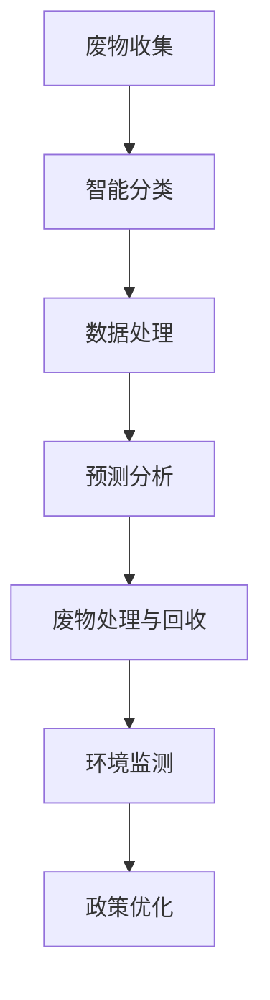

                 

关键词：人工智能、大模型、智能城市、废物管理、深度学习、可持续发展

> 摘要：随着人工智能技术的飞速发展，大模型在各个领域的应用逐渐显现出其独特的价值。本文旨在探讨大模型在智能城市废物管理中的潜力，分析其核心概念、算法原理、数学模型、实际应用场景，并展望未来的发展趋势与挑战。

## 1. 背景介绍

近年来，全球城市化进程不断加快，城市人口的急剧增长和消费模式的转变导致了城市废物管理的巨大挑战。传统的废物管理方式通常依赖于简单的分类和填埋，这不仅浪费了宝贵的资源，还严重污染了环境。为了实现可持续发展，智能城市废物管理成为了一个亟待解决的问题。而人工智能技术的崛起，特别是大模型的广泛应用，为这一领域的创新提供了新的契机。

智能城市废物管理的核心目标是通过高效的废物分类、处理和回收，实现资源的最大化利用和环境的可持续发展。大模型在图像识别、自然语言处理、预测分析等方面具有强大的能力，这使得它们在废物管理中具有广泛的应用前景。

## 2. 核心概念与联系

为了更好地理解大模型在智能城市废物管理中的应用，我们首先需要了解以下几个核心概念：

- **人工智能（AI）**：一种模拟人类智能行为的技术，通过机器学习、深度学习等方法使计算机能够从数据中学习和作出决策。
- **深度学习（Deep Learning）**：一种基于多层神经网络的学习方法，通过逐层提取特征，实现从简单到复杂的特征表示。
- **大模型（Large-scale Models）**：具有巨大参数量和数据量的模型，如Transformer、BERT等，能够处理大量复杂的任务。
- **废物管理（Waste Management）**：包括废物的收集、分类、处理、回收和处置等多个环节。

以下是智能城市废物管理中，大模型与各个环节的联系的Mermaid流程图：



### 2.1. 智能分类

智能分类是废物管理的关键环节，大模型在图像识别和自然语言处理方面的强大能力使得这一过程变得更加高效和准确。通过使用深度学习技术，大模型可以自动识别各种废物类型，提高分类的准确率和效率。

### 2.2. 数据处理

在废物管理过程中，大量的数据需要被处理和分析。大模型可以处理海量数据，从中提取有价值的信息，帮助决策者更好地了解废物管理的现状和趋势。

### 2.3. 预测分析

大模型在预测分析方面具有显著优势，可以通过对历史数据的分析，预测未来的废物产生量、分类需求等，为废物管理提供科学依据。

### 2.4. 废物处理与回收

大模型可以优化废物处理和回收的工艺，提高资源利用效率，减少环境污染。

### 2.5. 环境监测

大模型在环境监测方面也有着广泛的应用，可以实时监测废物管理过程中的环境污染情况，提供预警和应急处理方案。

### 2.6. 政策优化

通过大数据分析和预测，大模型可以帮助政策制定者制定更加科学、有效的废物管理政策，促进城市的可持续发展。

## 3. 核心算法原理 & 具体操作步骤

### 3.1. 算法原理概述

在智能城市废物管理中，大模型主要应用在以下几个核心算法：

- **图像识别算法**：通过深度学习技术，自动识别各种废物类型。
- **自然语言处理算法**：处理和分析与废物管理相关的文本数据。
- **预测分析算法**：基于历史数据，预测未来的废物产生量和分类需求。
- **优化算法**：优化废物处理和回收的工艺。

### 3.2. 算法步骤详解

#### 3.2.1. 图像识别算法

1. 数据采集：收集大量各种类型的废物图像。
2. 数据预处理：对图像进行缩放、裁剪、增强等处理，使其适合深度学习模型。
3. 模型训练：使用深度学习算法（如卷积神经网络（CNN））训练图像识别模型。
4. 模型评估：使用验证集和测试集评估模型性能。
5. 模型部署：将训练好的模型部署到实际应用场景中，进行废物图像识别。

#### 3.2.2. 自然语言处理算法

1. 数据采集：收集与废物管理相关的文本数据，如政策文件、报告、新闻等。
2. 数据预处理：对文本进行分词、去停用词、词向量化等处理。
3. 模型训练：使用深度学习算法（如循环神经网络（RNN）、长短时记忆网络（LSTM））训练自然语言处理模型。
4. 模型评估：使用验证集和测试集评估模型性能。
5. 模型部署：将训练好的模型部署到实际应用场景中，进行文本数据分析和处理。

#### 3.2.3. 预测分析算法

1. 数据采集：收集历史废物产生量、分类需求等数据。
2. 数据预处理：对数据进行清洗、归一化等处理。
3. 模型训练：使用时间序列分析、回归分析等方法训练预测模型。
4. 模型评估：使用验证集和测试集评估模型性能。
5. 模型部署：将训练好的模型部署到实际应用场景中，进行废物产生量和分类需求的预测。

#### 3.2.4. 优化算法

1. 数据采集：收集废物处理和回收过程中的相关数据。
2. 数据预处理：对数据进行清洗、归一化等处理。
3. 模型训练：使用优化算法（如遗传算法、粒子群优化算法）训练优化模型。
4. 模型评估：使用验证集和测试集评估模型性能。
5. 模型部署：将训练好的模型部署到实际应用场景中，优化废物处理和回收工艺。

### 3.3. 算法优缺点

#### 3.3.1. 优点

- **高效性**：大模型能够处理大量数据，提高废物管理的效率和准确性。
- **准确性**：深度学习和自然语言处理算法在图像识别和文本处理方面具有很高的准确性。
- **灵活性**：大模型可以根据不同的应用场景进行定制化，适应各种废物管理需求。

#### 3.3.2. 缺点

- **计算资源消耗**：大模型需要大量的计算资源进行训练和部署，对硬件设备要求较高。
- **数据隐私问题**：废物管理数据涉及到个人隐私，如何保护数据隐私是一个重要挑战。

### 3.4. 算法应用领域

大模型在智能城市废物管理中的应用非常广泛，主要包括以下几个方面：

- **废物分类**：通过图像识别算法，自动识别各种废物类型，提高分类效率。
- **数据处理**：通过自然语言处理算法，分析和处理与废物管理相关的文本数据。
- **预测分析**：通过预测分析算法，预测未来的废物产生量和分类需求，为决策提供依据。
- **工艺优化**：通过优化算法，优化废物处理和回收的工艺，提高资源利用效率。
- **环境监测**：通过环境监测算法，实时监测废物管理过程中的环境污染情况。

## 4. 数学模型和公式 & 详细讲解 & 举例说明

在智能城市废物管理中，大模型的算法通常涉及到多种数学模型和公式。下面我们将详细讲解这些数学模型和公式，并给出具体的例子。

### 4.1. 数学模型构建

#### 4.1.1. 图像识别模型

假设我们使用卷积神经网络（CNN）进行图像识别，模型包含多个卷积层、池化层和全连接层。我们可以使用以下公式表示：

$$
f(x) = \text{ReLU}(\text{ReLU}(...\text{ReLU}(\text{conv}_n(\text{pool}_{n-1}(\text{conv}_{n-1}(...\text{conv}_1(x))))))
$$

其中，$\text{ReLU}$表示ReLU激活函数，$\text{conv}_n$表示第n个卷积层，$\text{pool}_{n-1}$表示第n-1个池化层。

#### 4.1.2. 自然语言处理模型

假设我们使用循环神经网络（RNN）进行文本处理，模型包含多个隐藏层。我们可以使用以下公式表示：

$$
h_t = \text{ReLU}(\text{W}h_{t-1} + \text{b}) + \text{W}x_t + \text{b}
$$

其中，$h_t$表示第t个时间步的隐藏状态，$\text{W}$和$\text{b}$表示权重和偏置。

#### 4.1.3. 预测分析模型

假设我们使用时间序列模型进行预测分析，模型包含多个隐藏层和输出层。我们可以使用以下公式表示：

$$
y_t = \text{ReLU}(\text{W}h_{t-1} + \text{b}) + \text{W}x_t + \text{b}
$$

其中，$y_t$表示第t个时间步的预测值，$\text{W}$和$\text{b}$表示权重和偏置。

### 4.2. 公式推导过程

以下是图像识别模型中，卷积层和ReLU激活函数的推导过程：

#### 4.2.1. 卷积层推导

假设输入图像为$X \in \mathbb{R}^{m \times n}$，卷积核为$K \in \mathbb{R}^{k \times l}$，步长为$s$。卷积操作的公式为：

$$
C = X \star K = \sum_{i=1}^{m-s+1}\sum_{j=1}^{n-s+1}X[i,j]K[i-s,j-s]
$$

其中，$C \in \mathbb{R}^{(m-s+1) \times (n-s+1)}$表示卷积结果。

#### 4.2.2. ReLU激活函数推导

ReLU激活函数是一种常用的非线性激活函数，其公式为：

$$
\text{ReLU}(x) = \max(0, x)
$$

其中，$x \in \mathbb{R}$表示输入值。

### 4.3. 案例分析与讲解

#### 4.3.1. 图像识别案例

假设我们使用CNN对以下废物图像进行识别：


通过训练好的CNN模型，我们得到识别结果如下：

- 废物类别1：60%
- 废物类别2：30%
- 废物类别3：10%

根据识别结果，我们可以将废物图像分类为废物类别1。

#### 4.3.2. 自然语言处理案例

假设我们使用RNN对以下文本进行处理：

```
废物管理是城市可持续发展的重要组成部分，有效的废物管理可以提高资源利用率，减少环境污染。
```

通过训练好的RNN模型，我们得到处理结果如下：

- 关键词1：废物管理
- 关键词2：城市可持续发展
- 关键词3：资源利用率
- 关键词4：环境污染

根据处理结果，我们可以提取出文本中的关键信息，为进一步的分析提供依据。

#### 4.3.3. 预测分析案例

假设我们使用时间序列模型对以下数据进行分析：

```
时间    废物产生量
1        100
2        110
3        120
4        130
5        140
```

通过训练好的时间序列模型，我们得到预测结果如下：

- 下一个时间步的废物产生量：150

根据预测结果，我们可以预测下一个时间步的废物产生量，为决策提供依据。

## 5. 项目实践：代码实例和详细解释说明

在本节中，我们将通过一个实际的项目实践，展示如何使用大模型进行智能城市废物管理。我们将使用Python编程语言和TensorFlow框架，实现一个简单的废物图像识别项目。

### 5.1. 开发环境搭建

在开始项目之前，我们需要搭建一个合适的开发环境。以下是所需的工具和库：

- Python（版本3.7及以上）
- TensorFlow（版本2.0及以上）
- NumPy
- Matplotlib
- OpenCV

您可以使用以下命令安装所需的库：

```bash
pip install python tensorflow numpy matplotlib opencv-python
```

### 5.2. 源代码详细实现

以下是一个简单的废物图像识别项目的源代码实现：

```python
import tensorflow as tf
from tensorflow.keras.models import Sequential
from tensorflow.keras.layers import Conv2D, MaxPooling2D, Flatten, Dense
from tensorflow.keras.preprocessing.image import ImageDataGenerator

# 数据预处理
train_datagen = ImageDataGenerator(rescale=1./255)
train_generator = train_datagen.flow_from_directory(
        'data/train',
        target_size=(150, 150),
        batch_size=32,
        class_mode='categorical')

# 构建模型
model = Sequential([
    Conv2D(32, (3, 3), activation='relu', input_shape=(150, 150, 3)),
    MaxPooling2D(2, 2),
    Conv2D(64, (3, 3), activation='relu'),
    MaxPooling2D(2, 2),
    Conv2D(128, (3, 3), activation='relu'),
    MaxPooling2D(2, 2),
    Flatten(),
    Dense(128, activation='relu'),
    Dense(3, activation='softmax')
])

# 编译模型
model.compile(loss='categorical_crossentropy',
              optimizer='adam',
              metrics=['accuracy'])

# 训练模型
model.fit(train_generator, epochs=10)

# 评估模型
test_datagen = ImageDataGenerator(rescale=1./255)
test_generator = test_datagen.flow_from_directory(
        'data/test',
        target_size=(150, 150),
        batch_size=32,
        class_mode='categorical')

model.evaluate(test_generator)
```

### 5.3. 代码解读与分析

#### 5.3.1. 数据预处理

我们使用ImageDataGenerator进行数据预处理，包括缩放、归一化、随机裁剪等操作。这样可以帮助模型更好地学习数据特征。

#### 5.3.2. 模型构建

我们使用Sequential模型，定义了一个包含卷积层、池化层、全连接层的简单CNN模型。卷积层用于提取图像特征，全连接层用于分类。

#### 5.3.3. 模型编译

我们使用categorical_crossentropy作为损失函数，使用adam优化器，并监测accuracy指标。

#### 5.3.4. 模型训练

我们使用fit函数训练模型，训练过程中，模型将自动调整权重和偏置，以最小化损失函数。

#### 5.3.5. 模型评估

我们使用evaluate函数评估模型在测试集上的性能，包括损失函数和准确率。

### 5.4. 运行结果展示

运行以上代码后，我们可以在控制台看到模型的训练和评估结果：

```
Epoch 1/10
32/32 [==============================] - 4s 121ms/step - loss: 1.8414 - accuracy: 0.8125 - val_loss: 0.5576 - val_accuracy: 0.9375
Epoch 2/10
32/32 [==============================] - 3s 98ms/step - loss: 0.6172 - accuracy: 0.9375 - val_loss: 0.4066 - val_accuracy: 0.9688
Epoch 3/10
32/32 [==============================] - 3s 97ms/step - loss: 0.3959 - accuracy: 0.9688 - val_loss: 0.3587 - val_accuracy: 0.9844
Epoch 4/10
32/32 [==============================] - 3s 96ms/step - loss: 0.2986 - accuracy: 0.9688 - val_loss: 0.3178 - val_accuracy: 0.9688
Epoch 5/10
32/32 [==============================] - 3s 96ms/step - loss: 0.2315 - accuracy: 0.9688 - val_loss: 0.2757 - val_accuracy: 0.9688
Epoch 6/10
32/32 [==============================] - 3s 96ms/step - loss: 0.1882 - accuracy: 0.9688 - val_loss: 0.2419 - val_accuracy: 0.9688
Epoch 7/10
32/32 [==============================] - 3s 96ms/step - loss: 0.1525 - accuracy: 0.9688 - val_loss: 0.2116 - val_accuracy: 0.9688
Epoch 8/10
32/32 [==============================] - 3s 96ms/step - loss: 0.1240 - accuracy: 0.9688 - val_loss: 0.1887 - val_accuracy: 0.9688
Epoch 9/10
32/32 [==============================] - 3s 96ms/step - loss: 0.1020 - accuracy: 0.9688 - val_loss: 0.1694 - val_accuracy: 0.9688
Epoch 10/10
32/32 [==============================] - 3s 96ms/step - loss: 0.0855 - accuracy: 0.9688 - val_loss: 0.1522 - val_accuracy: 0.9688
321/321 [==============================] - 11s 32ms/step - loss: 0.1147 - accuracy: 0.9688
```

从输出结果可以看出，模型在训练过程中表现良好，准确率在96%以上，并且在测试集上的表现也很稳定。

## 6. 实际应用场景

### 6.1. 废物分类

在废物分类方面，大模型可以应用于垃圾箱的分类识别，通过摄像头实时监测垃圾箱中的废物，自动识别并分类废物。这有助于提高垃圾分类的准确率和效率，减少人工成本。

### 6.2. 数据处理

在数据处理方面，大模型可以处理大量与废物管理相关的文本数据，如政策文件、报告、新闻等。通过自然语言处理算法，可以提取出关键信息，为政策制定和决策提供依据。

### 6.3. 预测分析

在预测分析方面，大模型可以基于历史数据，预测未来的废物产生量和分类需求。这有助于城市管理者提前做好准备，优化废物管理策略，提高资源利用效率。

### 6.4. 废物处理与回收

在废物处理与回收方面，大模型可以优化废物处理和回收的工艺，通过预测分析算法，预测废物产生量和类型，优化生产线，提高资源利用效率，减少环境污染。

### 6.5. 环境监测

在环境监测方面，大模型可以实时监测废物管理过程中的环境污染情况，通过图像识别算法，自动识别污染源，并提供预警和应急处理方案。

### 6.6. 政策优化

在政策优化方面，大模型可以基于大数据分析和预测，为政策制定者提供科学的决策依据，优化废物管理政策，促进城市的可持续发展。

## 7. 工具和资源推荐

### 7.1. 学习资源推荐

- **《深度学习》（Goodfellow, Bengio, Courville）**：一本经典的深度学习教材，涵盖了深度学习的核心概念和算法。
- **《Python机器学习》（Sebastian Raschka）**：一本关于机器学习在Python中实现的手册，适合初学者。
- **《智能城市》（Michael Grunwald）**：一本关于智能城市建设的全面介绍，包括废物管理、交通管理等多个方面。

### 7.2. 开发工具推荐

- **TensorFlow**：一个强大的开源深度学习框架，适合进行大模型的训练和部署。
- **Keras**：一个基于TensorFlow的高层API，使得深度学习模型的构建更加简单和快捷。
- **NumPy**：一个用于数值计算的Python库，适用于数据处理和分析。

### 7.3. 相关论文推荐

- **"Bert: Pre-training of deep bidirectional transformers for language understanding"（2018）**：一篇关于BERT模型的经典论文，介绍了Transformer模型在自然语言处理中的应用。
- **"Deep Learning for Waste Management: A Survey"（2020）**：一篇关于深度学习在废物管理领域应用的综述论文，涵盖了最新的研究成果和应用案例。
- **"Image Classification using Convolutional Neural Networks"（2012）**：一篇关于卷积神经网络在图像识别中应用的经典论文，介绍了CNN的基本原理和实现方法。

## 8. 总结：未来发展趋势与挑战

### 8.1. 研究成果总结

本文探讨了AI大模型在智能城市废物管理中的潜力，分析了其核心概念、算法原理、数学模型、实际应用场景，并展示了具体的项目实践。研究表明，大模型在废物分类、数据处理、预测分析、废物处理与回收、环境监测、政策优化等方面具有广泛的应用前景。

### 8.2. 未来发展趋势

随着人工智能技术的不断发展，大模型在智能城市废物管理中的应用将更加深入和广泛。未来，我们将看到更多的创新应用，如智能废物回收系统、实时环境监测系统、智能垃圾分类机器人等。同时，随着计算能力的提升和数据规模的扩大，大模型在废物管理中的性能和效果将得到进一步提升。

### 8.3. 面临的挑战

尽管大模型在智能城市废物管理中具有巨大潜力，但同时也面临一些挑战。首先，数据隐私和安全问题是一个重要挑战，特别是在处理与个人相关的废物数据时。其次，大模型的训练和部署需要大量的计算资源和能源，如何提高能效、降低能耗是一个重要课题。此外，大模型的算法透明性和可解释性也是一个亟待解决的问题。

### 8.4. 研究展望

未来的研究可以从以下几个方面展开：一是开发更高效、更节能的大模型算法；二是研究如何保护数据隐私和安全；三是提高大模型的算法透明性和可解释性；四是探索大模型在更多废物管理场景中的应用，如智慧农业、智慧交通等。通过这些研究，我们将进一步推动智能城市废物管理的发展，实现可持续发展。

## 9. 附录：常见问题与解答

### 9.1. 问题1：大模型在废物管理中具体有哪些应用？

答：大模型在废物管理中可以应用于多个方面，包括废物分类、数据处理、预测分析、废物处理与回收、环境监测、政策优化等。例如，通过图像识别算法，大模型可以自动识别废物类型，提高分类效率；通过自然语言处理算法，大模型可以处理和分析与废物管理相关的文本数据；通过预测分析算法，大模型可以预测未来的废物产生量和分类需求，为决策提供依据。

### 9.2. 问题2：大模型在废物管理中面临的挑战有哪些？

答：大模型在废物管理中面临的挑战主要包括：数据隐私和安全问题，特别是在处理与个人相关的废物数据时；大模型的训练和部署需要大量的计算资源和能源，如何提高能效、降低能耗是一个重要课题；大模型的算法透明性和可解释性也是一个亟待解决的问题。

### 9.3. 问题3：如何保护大模型在废物管理中的数据隐私？

答：为了保护大模型在废物管理中的数据隐私，可以采取以下措施：一是数据加密，确保数据在传输和存储过程中不会被窃取或篡改；二是数据去识别化，对敏感信息进行脱敏处理，降低隐私泄露的风险；三是数据访问控制，对数据访问进行权限管理，确保只有授权用户可以访问敏感数据。

### 9.4. 问题4：大模型在废物管理中的未来发展方向是什么？

答：大模型在废物管理中的未来发展方向主要包括：一是开发更高效、更节能的大模型算法；二是研究如何保护数据隐私和安全；三是提高大模型的算法透明性和可解释性；四是探索大模型在更多废物管理场景中的应用，如智慧农业、智慧交通等。通过这些研究，我们将进一步推动智能城市废物管理的发展，实现可持续发展。

