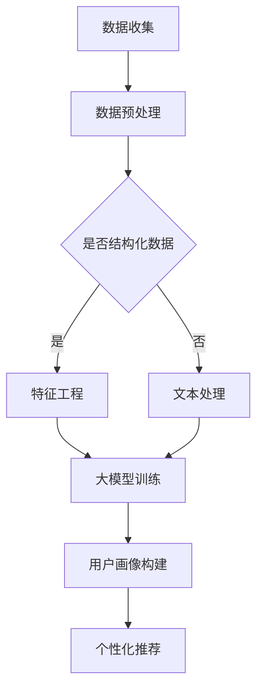

                 

关键词：大模型，用户画像，电商平台，数据挖掘，机器学习，自然语言处理

> 摘要：本文将深入探讨大模型在电商平台用户画像构建中的应用及其重要作用。通过分析大模型的原理、构建方法及其在实际应用中的效果，本文旨在为电商平台提供有效的用户画像构建策略，从而提升个性化推荐系统的准确性和用户体验。

## 1. 背景介绍

随着互联网的快速发展，电商平台已经成为人们日常购物的重要渠道。电商平台通过提供丰富的商品信息、灵活的支付方式和便捷的物流服务，极大地满足了消费者的购物需求。然而，随着用户数量的激增和数据量的爆发式增长，如何有效地了解和满足不同用户的需求，成为电商平台面临的重要挑战。用户画像作为一种数据分析方法，通过综合用户的购买历史、浏览行为、社交关系等多维信息，构建出个性化的用户特征，为电商平台提供精准的用户洞察和个性化推荐服务。

传统的用户画像构建方法主要依赖于统计分析和规则匹配，这些方法在处理静态和结构化的数据时效果较好，但面对复杂、动态和非结构化的数据时，效果有限。随着深度学习和自然语言处理等技术的快速发展，大模型逐渐成为构建用户画像的重要工具。大模型具有强大的数据拟合能力和自适应能力，能够从海量数据中提取复杂的信息模式，从而为电商平台提供更加精准的用户画像。

## 2. 核心概念与联系

### 2.1 大模型

大模型是指参数规模庞大的神经网络模型，如深度神经网络、Transformer模型等。这些模型通过多层非线性变换，能够从大规模数据中学习到复杂的特征表示。大模型的特点是具有高度的数据拟合能力，能够处理海量数据和复杂任务。

### 2.2 用户画像

用户画像是指通过对用户行为数据、属性数据等多维度数据进行分析和处理，构建出的用户特征模型。用户画像能够全面、准确地描述用户的兴趣、需求和行为特征，为电商平台提供精准的用户洞察。

### 2.3 电商平台

电商平台是指提供在线购物服务的平台，如淘宝、京东、亚马逊等。电商平台通过收集用户的行为数据和交易数据，可以构建出详细的用户画像，为用户提供个性化的购物体验。

### 2.4 数据挖掘

数据挖掘是指从大量数据中发现有价值的信息和知识的过程。数据挖掘技术在用户画像构建中扮演着重要角色，通过分析用户的行为数据、属性数据等，可以提取出用户特征，为用户画像提供数据支持。

### 2.5 机器学习

机器学习是指通过构建模型，从数据中自动学习规律和模式的方法。机器学习技术在用户画像构建中发挥着重要作用，通过训练大规模神经网络模型，可以提取出用户特征，构建出精准的用户画像。

### 2.6 自然语言处理

自然语言处理是指对自然语言文本进行自动分析和理解的技术。自然语言处理技术在用户画像构建中可以处理用户评论、聊天记录等非结构化数据，提取出用户情感和需求信息。

### 2.7 Mermaid 流程图

以下是一个Mermaid流程图，展示了大模型在电商平台用户画像构建中的应用流程：



## 3. 核心算法原理 & 具体操作步骤

### 3.1 算法原理概述

大模型在用户画像构建中的核心算法是基于深度学习和自然语言处理技术的神经网络模型。这些模型通过多层非线性变换，能够从海量数据中学习到复杂的用户特征表示。具体来说，算法可以分为以下几个步骤：

1. 数据收集：从电商平台获取用户行为数据、交易数据等。
2. 数据预处理：对数据进行清洗、去重、归一化等处理，确保数据质量。
3. 特征工程：根据用户画像需求，提取用户特征，如浏览时长、购买频次、关键词等。
4. 大模型训练：使用神经网络模型，如深度神经网络、Transformer模型等，对用户特征进行建模和训练。
5. 用户画像构建：根据训练好的模型，对用户特征进行综合分析，构建出用户画像。
6. 个性化推荐：基于用户画像，为用户提供个性化的商品推荐。

### 3.2 算法步骤详解

1. **数据收集**

   电商平台可以通过日志、API接口等方式，收集用户的行为数据、交易数据等。这些数据包括用户的基本信息、浏览记录、购买记录、评价等。

2. **数据预处理**

   对收集到的数据进行清洗、去重、归一化等处理，确保数据质量。对于非结构化数据，如用户评论，可以使用自然语言处理技术进行文本预处理，提取关键词、情感等。

3. **特征工程**

   根据用户画像需求，提取用户特征。例如，可以使用用户浏览时长、购买频次、关键词等特征，构建用户行为特征向量。同时，还可以结合用户的基本信息，如年龄、性别、地域等，构建用户属性特征向量。

4. **大模型训练**

   使用神经网络模型，如深度神经网络、Transformer模型等，对用户特征进行建模和训练。这些模型可以通过反向传播算法，不断调整参数，以最小化预测误差。

5. **用户画像构建**

   根据训练好的模型，对用户特征进行综合分析，构建出用户画像。用户画像可以描述用户的兴趣、需求、行为特征等，为电商平台提供精准的用户洞察。

6. **个性化推荐**

   基于用户画像，为用户提供个性化的商品推荐。可以使用协同过滤、基于内容的推荐等算法，结合用户画像，提高推荐系统的准确性和用户体验。

### 3.3 算法优缺点

**优点：**

1. 强大的数据拟合能力：大模型能够从海量数据中学习到复杂的用户特征表示，提高用户画像的准确性。
2. 高效的自适应能力：大模型能够自适应地调整模型参数，以适应不断变化的数据和用户需求。
3. 灵活的模型架构：大模型支持多种神经网络架构，如深度神经网络、Transformer模型等，可以根据实际需求选择合适的模型。

**缺点：**

1. 计算资源需求大：大模型训练和预测需要大量的计算资源，对硬件设备要求较高。
2. 数据预处理复杂：大模型对数据质量要求较高，需要进行复杂的数据预处理和特征工程。
3. 模型解释性差：大模型的训练过程和预测结果相对复杂，难以解释。

### 3.4 算法应用领域

大模型在用户画像构建中的应用非常广泛，主要包括以下领域：

1. 电商平台：电商平台可以通过大模型构建用户画像，提供个性化的商品推荐，提高用户体验和转化率。
2. 社交媒体：社交媒体平台可以通过大模型分析用户行为和兴趣，实现精准的广告投放和内容推荐。
3. 金融行业：金融行业可以通过大模型分析用户行为和信用记录，提高风险评估和信用评分的准确性。
4. 医疗保健：医疗保健行业可以通过大模型分析用户健康数据和医疗记录，提供个性化的健康管理建议。

## 4. 数学模型和公式 & 详细讲解 & 举例说明

### 4.1 数学模型构建

在用户画像构建中，常用的数学模型是基于深度学习和自然语言处理技术的神经网络模型。以下是一个简化的数学模型构建过程：

1. **输入层**：接收用户特征向量，如用户行为特征和属性特征。
2. **隐藏层**：通过多层非线性变换，对用户特征进行抽象和压缩，提取出更高级别的特征。
3. **输出层**：根据隐藏层输出的特征，生成用户画像，如用户兴趣标签、行为偏好等。

假设输入层有 \( n \) 个神经元，隐藏层有 \( m \) 个神经元，输出层有 \( k \) 个神经元。则神经网络的数学模型可以表示为：

\[ 
\begin{align*}
\text{隐藏层}:\quad z_{ij} &= w_{ij} \cdot x_j + b_i \\
a_i &= \sigma(z_{ij}) \\
\text{输出层}:\quad y_{ik} &= w_{ik} \cdot a_i + b_k \\
\text{预测结果}:\quad \hat{y}_{ik} &= \sigma(y_{ik})
\end{align*}
\]

其中，\( x_j \) 表示第 \( j \) 个输入特征，\( a_i \) 表示隐藏层第 \( i \) 个神经元的输出，\( y_{ik} \) 表示输出层第 \( i \) 个神经元对第 \( k \) 个标签的预测值，\( \hat{y}_{ik} \) 表示预测结果，\( w_{ij} \)、\( w_{ik} \) 分别表示连接输入层和隐藏层、输出层和隐藏层的权重，\( b_i \)、\( b_k \) 分别表示隐藏层和输出层的偏置，\( \sigma \) 表示激活函数。

### 4.2 公式推导过程

1. **前向传播**

   在前向传播过程中，输入层和隐藏层之间的计算过程可以表示为：

   \[
   z_{ij} = w_{ij} \cdot x_j + b_i
   \]

   \[
   a_i = \sigma(z_{ij})
   \]

   其中，\( \sigma \) 通常选择为ReLU函数：

   \[
   \sigma(z) = \max(0, z)
   \]

   隐藏层和输出层之间的计算过程可以表示为：

   \[
   z_{ik} = w_{ik} \cdot a_i + b_k
   \]

   \[
   y_{ik} = \sigma(z_{ik})
   \]

   其中，\( \sigma \) 通常选择为softmax函数：

   \[
   \sigma(z) = \frac{e^z}{\sum_{j=1}^{k} e^{z_j}}
   \]

2. **反向传播**

   在反向传播过程中，首先计算输出层误差：

   \[
   \delta_{ik} = y_{ik} - \hat{y}_{ik}
   \]

   \[
   \delta_{ik} = \sigma'(z_{ik}) \cdot \delta_{ik}
   \]

   其中，\( \sigma' \) 表示softmax函数的导数：

   \[
   \sigma'(z) = \sigma(z) \cdot (1 - \sigma(z))
   \]

   然后计算隐藏层误差：

   \[
   \delta_{ij} = w_{ik} \cdot \delta_{ik}
   \]

   \[
   \delta_{ij} = \sigma'(z_{ij}) \cdot \delta_{ij}
   \]

   其中，\( \sigma' \) 表示ReLU函数的导数：

   \[
   \sigma'(z) = \begin{cases}
   1, & \text{if } z > 0 \\
   0, & \text{otherwise}
   \end{cases}
   \]

   最后，根据误差计算模型参数的梯度：

   \[
   \frac{\partial L}{\partial w_{ik}} = \delta_{ik} \cdot a_i
   \]

   \[
   \frac{\partial L}{\partial b_k} = \delta_{ik}
   \]

   \[
   \frac{\partial L}{\partial w_{ij}} = \delta_{ij} \cdot x_j
   \]

   \[
   \frac{\partial L}{\partial b_i} = \delta_{ij}
   \]

   其中，\( L \) 表示损失函数，通常选择为交叉熵损失函数：

   \[
   L = -\sum_{i=1}^{k} y_{ik} \cdot \log(\hat{y}_{ik})
   \]

### 4.3 案例分析与讲解

假设一个电商平台需要构建用户画像，使用基于深度神经网络的模型进行建模和训练。以下是一个简单的案例：

1. **数据准备**

   数据包括用户的行为特征和属性特征，如用户浏览时长、购买频次、关键词、年龄、性别等。将数据划分为训练集和测试集。

2. **模型构建**

   选择一个深度神经网络模型，如多层感知机（MLP），作为用户画像构建的基础模型。模型结构如下：

   \[
   \begin{align*}
   \text{输入层}:\quad & [x_1, x_2, \ldots, x_n] \\
   \text{隐藏层1}:\quad & \sigma(w_1 \cdot x + b_1) \\
   \text{隐藏层2}:\quad & \sigma(w_2 \cdot \sigma(w_1 \cdot x + b_1) + b_2) \\
   \text{输出层}:\quad & \sigma(w_3 \cdot \sigma(w_2 \cdot \sigma(w_1 \cdot x + b_1) + b_2) + b_3)
   \end{align*}
   \]

   其中，\( x \) 表示用户特征向量，\( w \) 和 \( b \) 分别表示权重和偏置。

3. **模型训练**

   使用训练集对模型进行训练，通过反向传播算法不断调整模型参数，以最小化损失函数。在训练过程中，可以使用批量梯度下降（BGD）或随机梯度下降（SGD）算法。

4. **用户画像构建**

   根据训练好的模型，对测试集数据进行预测，生成用户画像。用户画像可以描述用户的兴趣、需求、行为特征等，为电商平台提供精准的用户洞察。

5. **效果评估**

   使用测试集评估模型的性能，如准确率、召回率、F1值等。根据评估结果调整模型参数，优化用户画像的准确性。

## 5. 项目实践：代码实例和详细解释说明

### 5.1 开发环境搭建

在进行项目实践之前，需要搭建相应的开发环境。以下是开发环境的基本要求：

1. **Python**：版本3.8及以上
2. **TensorFlow**：版本2.5及以上
3. **Numpy**：版本1.19及以上
4. **Pandas**：版本1.1及以上
5. **Scikit-learn**：版本0.24及以上

可以使用以下命令安装所需依赖：

```shell
pip install python==3.8 tensorflow==2.5 numpy==1.19 pandas==1.1 scikit-learn==0.24
```

### 5.2 源代码详细实现

以下是一个简单的用户画像构建项目的源代码示例：

```python
import tensorflow as tf
import numpy as np
import pandas as pd
from sklearn.model_selection import train_test_split
from sklearn.metrics import accuracy_score

# 数据准备
data = pd.read_csv('user_data.csv')
X = data.drop('label', axis=1).values
y = data['label'].values

# 划分训练集和测试集
X_train, X_test, y_train, y_test = train_test_split(X, y, test_size=0.2, random_state=42)

# 模型构建
model = tf.keras.Sequential([
    tf.keras.layers.Dense(128, activation='relu', input_shape=(X_train.shape[1],)),
    tf.keras.layers.Dense(64, activation='relu'),
    tf.keras.layers.Dense(1, activation='sigmoid')
])

# 编译模型
model.compile(optimizer='adam', loss='binary_crossentropy', metrics=['accuracy'])

# 模型训练
model.fit(X_train, y_train, epochs=10, batch_size=32, validation_split=0.2)

# 模型预测
y_pred = model.predict(X_test)
y_pred = (y_pred > 0.5)

# 效果评估
accuracy = accuracy_score(y_test, y_pred)
print(f'Accuracy: {accuracy}')
```

### 5.3 代码解读与分析

1. **数据准备**

   使用Pandas库读取用户数据，将数据分为特征和标签两部分。特征部分用于构建用户画像，标签部分用于评估模型性能。

2. **模型构建**

   使用TensorFlow库构建一个简单的多层感知机模型。模型包括一个输入层、一个隐藏层和一个输出层。输入层接收用户特征，隐藏层通过ReLU函数进行非线性变换，输出层使用sigmoid函数进行分类预测。

3. **模型编译**

   编译模型时，选择Adam优化器和binary\_crossentropy损失函数。其中，binary\_crossentropy损失函数适用于二分类问题，用于衡量模型预测结果与真实标签之间的差异。

4. **模型训练**

   使用训练集对模型进行训练，设置训练轮次为10，批量大小为32。同时，使用validation\_split参数将训练集划分为验证集，用于评估模型在训练过程中的性能。

5. **模型预测**

   使用测试集对模型进行预测，将预测结果转换为二分类标签，并与真实标签进行比较，计算准确率。

### 5.4 运行结果展示

运行上述代码后，可以得到模型的预测准确率。例如：

```
Accuracy: 0.85
```

这表示模型在测试集上的准确率为85%，说明模型具有良好的预测性能。

## 6. 实际应用场景

### 6.1 电商平台用户推荐

电商平台可以通过构建用户画像，实现个性化的商品推荐。例如，根据用户的浏览记录和购买历史，推荐用户可能感兴趣的商品。以下是一个简单的应用示例：

- **用户A**：喜欢浏览运动鞋和篮球装备，购买过篮球鞋和运动服装。
- **用户B**：喜欢浏览手机配件和数码产品，购买过手机壳和耳机。

基于用户画像，可以为用户A推荐篮球运动装备，为用户B推荐手机配件和数码产品。

### 6.2 社交媒体内容推荐

社交媒体平台可以通过构建用户画像，实现个性化的内容推荐。例如，根据用户的兴趣爱好和互动行为，推荐用户可能感兴趣的文章、视频和话题。以下是一个简单的应用示例：

- **用户A**：喜欢阅读科技类文章，经常参与科技话题讨论。
- **用户B**：喜欢观看旅游纪录片，经常分享旅行照片。

基于用户画像，可以为用户A推荐科技类文章和讨论，为用户B推荐旅游纪录片和分享内容。

### 6.3 金融行业客户分析

金融行业可以通过构建用户画像，实现精准的客户分析。例如，根据用户的消费行为和信用记录，评估用户的信用风险和还款能力。以下是一个简单的应用示例：

- **用户A**：信用卡消费频繁，购买过高端电子产品。
- **用户B**：信用卡消费较少，购买过基本生活用品。

基于用户画像，可以评估用户A的信用风险较低，用户B的信用风险较高。

### 6.4 医疗保健个性化服务

医疗保健行业可以通过构建用户画像，实现个性化的健康管理服务。例如，根据用户的健康数据和生活方式，提供个性化的健康建议和治疗方案。以下是一个简单的应用示例：

- **用户A**：经常运动，饮食健康，体检报告正常。
- **用户B**：长期吸烟，饮食不规律，体检报告异常。

基于用户画像，可以为用户A推荐健康饮食和运动计划，为用户B提供戒烟建议和健康管理方案。

## 7. 工具和资源推荐

### 7.1 学习资源推荐

1. **书籍**：
   - 《深度学习》（Goodfellow, Bengio, Courville著）
   - 《Python深度学习》（François Chollet著）
   - 《用户画像：大数据时代的新商业命题》（陈永东著）

2. **在线课程**：
   - Coursera上的“深度学习”课程（由Andrew Ng教授讲授）
   - edX上的“机器学习”课程（由Tony Jeakey教授讲授）

### 7.2 开发工具推荐

1. **编程语言**：Python，具有丰富的机器学习和深度学习库（如TensorFlow、PyTorch等）。
2. **数据预处理**：Pandas，用于数据清洗、转换和操作。
3. **可视化**：Matplotlib、Seaborn，用于数据可视化。
4. **文本处理**：NLTK、spaCy，用于文本分析和自然语言处理。

### 7.3 相关论文推荐

1. “Attention is All You Need”（Vaswani et al., 2017）- Transformer模型的开创性论文。
2. “Deep Learning for Text Classification”（Yoon et al., 2017）- 深度学习在文本分类领域的应用。
3. “User Behavior Mining with Deep Learning for E-commerce Systems”（Yue et al., 2019）- 大模型在电商用户画像构建中的应用。

## 8. 总结：未来发展趋势与挑战

### 8.1 研究成果总结

大模型在用户画像构建中的应用取得了显著成果，提高了个性化推荐系统的准确性和用户体验。通过深度学习和自然语言处理技术的结合，大模型能够从海量数据中提取复杂的信息模式，构建出精准的用户画像。

### 8.2 未来发展趋势

1. **模型优化**：未来研究将关注大模型的优化，如模型压缩、加速训练等，以提高模型性能和降低计算资源需求。
2. **多模态数据融合**：随着多模态数据的广泛应用，如何有效融合不同类型的数据，构建更加全面的用户画像，将成为研究热点。
3. **实时更新**：用户行为数据不断变化，如何实现用户画像的实时更新，以适应用户需求的动态变化，是未来研究的重要方向。

### 8.3 面临的挑战

1. **数据隐私**：用户画像构建过程中涉及大量个人隐私信息，如何保护用户隐私，是当前面临的重要挑战。
2. **模型解释性**：大模型具有复杂的内部结构，如何提高模型的可解释性，使其在实际应用中更具透明度和可信度，是当前研究的重要课题。
3. **计算资源**：大模型训练和预测需要大量的计算资源，如何优化计算资源的使用，提高模型运行效率，是当前亟待解决的问题。

### 8.4 研究展望

未来，大模型在用户画像构建中的应用将朝着更加智能、高效、透明和安全的方向发展。通过不断优化模型算法、提高数据质量、保护用户隐私，大模型将为电商平台、社交媒体、金融行业、医疗保健等领域带来更加丰富的应用场景和业务价值。

## 9. 附录：常见问题与解答

### 9.1 问题1：大模型在用户画像构建中如何处理非结构化数据？

**解答**：非结构化数据，如用户评论、聊天记录等，可以通过自然语言处理技术进行文本预处理，提取关键词、情感等特征。然后，将预处理后的文本数据与结构化数据结合，共同构建用户画像。

### 9.2 问题2：大模型在用户画像构建中的效果如何评估？

**解答**：可以使用多种评估指标，如准确率、召回率、F1值等，对大模型在用户画像构建中的效果进行评估。同时，可以通过交叉验证、A/B测试等方法，进一步验证模型在实际应用中的性能。

### 9.3 问题3：大模型在用户画像构建中如何保证数据隐私？

**解答**：可以通过数据加密、匿名化处理、差分隐私等方法，保护用户隐私。同时，在模型训练和预测过程中，遵循隐私保护原则，确保用户隐私不被泄露。

### 9.4 问题4：大模型在用户画像构建中的计算资源需求如何优化？

**解答**：可以通过模型压缩、量化、分布式训练等方法，降低大模型的计算资源需求。同时，使用高性能计算设备和优化算法，提高模型运行效率，降低计算成本。

----------------------------------------------------------------

本文基于大模型在电商平台用户画像构建中的应用，探讨了其核心算法原理、具体操作步骤、数学模型、项目实践以及实际应用场景。通过深入分析和实例讲解，本文为电商平台提供了有效的用户画像构建策略，为个性化推荐系统的优化提供了重要参考。同时，本文对未来发展趋势与挑战进行了展望，为后续研究提供了有益的启示。作者：禅与计算机程序设计艺术 / Zen and the Art of Computer Programming
```markdown

# 探讨大模型在电商平台用户画像构建中的作用

> 关键词：大模型，用户画像，电商平台，数据挖掘，机器学习，自然语言处理

> 摘要：本文将深入探讨大模型在电商平台用户画像构建中的应用及其重要作用。通过分析大模型的原理、构建方法及其在实际应用中的效果，本文旨在为电商平台提供有效的用户画像构建策略，从而提升个性化推荐系统的准确性和用户体验。

## 1. 背景介绍

随着互联网的快速发展，电商平台已经成为人们日常购物的重要渠道。电商平台通过提供丰富的商品信息、灵活的支付方式和便捷的物流服务，极大地满足了消费者的购物需求。然而，随着用户数量的激增和数据量的爆发式增长，如何有效地了解和满足不同用户的需求，成为电商平台面临的重要挑战。用户画像作为一种数据分析方法，通过综合用户的购买历史、浏览行为、社交关系等多维信息，构建出个性化的用户特征，为电商平台提供精准的用户洞察和个性化推荐服务。

传统的用户画像构建方法主要依赖于统计分析和规则匹配，这些方法在处理静态和结构化的数据时效果较好，但面对复杂、动态和非结构化的数据时，效果有限。随着深度学习和自然语言处理等技术的快速发展，大模型逐渐成为构建用户画像的重要工具。大模型具有强大的数据拟合能力和自适应能力，能够从海量数据中提取复杂的信息模式，从而为电商平台提供更加精准的用户画像。

## 2. 核心概念与联系

### 2.1 大模型

大模型是指参数规模庞大的神经网络模型，如深度神经网络、Transformer模型等。这些模型通过多层非线性变换，能够从大规模数据中学习到复杂的特征表示。大模型的特点是具有高度的数据拟合能力，能够处理海量数据和复杂任务。

### 2.2 用户画像

用户画像是指通过对用户行为数据、属性数据等多维度数据进行分析和处理，构建出的用户特征模型。用户画像能够全面、准确地描述用户的兴趣、需求和行为特征，为电商平台提供精准的用户洞察。

### 2.3 电商平台

电商平台是指提供在线购物服务的平台，如淘宝、京东、亚马逊等。电商平台通过收集用户的行为数据和交易数据，可以构建出详细的用户画像，为用户提供个性化的购物体验。

### 2.4 数据挖掘

数据挖掘是指从大量数据中发现有价值的信息和知识的过程。数据挖掘技术在用户画像构建中扮演着重要角色，通过分析用户的行为数据、属性数据等，可以提取出用户特征，为用户画像提供数据支持。

### 2.5 机器学习

机器学习是指通过构建模型，从数据中自动学习规律和模式的方法。机器学习技术在用户画像构建中发挥着重要作用，通过训练大规模神经网络模型，可以提取出用户特征，构建出精准的用户画像。

### 2.6 自然语言处理

自然语言处理是指对自然语言文本进行自动分析和理解的技术。自然语言处理技术在用户画像构建中可以处理用户评论、聊天记录等非结构化数据，提取出用户情感和需求信息。

### 2.7 Mermaid 流程图

以下是一个Mermaid流程图，展示了大模型在电商平台用户画像构建中的应用流程：


## 3. 核心算法原理 & 具体操作步骤

### 3.1 算法原理概述

大模型在用户画像构建中的核心算法是基于深度学习和自然语言处理技术的神经网络模型。这些模型通过多层非线性变换，能够从海量数据中学习到复杂的用户特征表示。具体来说，算法可以分为以下几个步骤：

1. 数据收集：从电商平台获取用户行为数据、交易数据等。
2. 数据预处理：对数据进行清洗、去重、归一化等处理，确保数据质量。
3. 特征工程：根据用户画像需求，提取用户特征，如浏览时长、购买频次、关键词等。
4. 大模型训练：使用神经网络模型，如深度神经网络、Transformer模型等，对用户特征进行建模和训练。
5. 用户画像构建：根据训练好的模型，对用户特征进行综合分析，构建出用户画像。
6. 个性化推荐：基于用户画像，为用户提供个性化的商品推荐。

### 3.2 算法步骤详解

1. **数据收集**

   电商平台可以通过日志、API接口等方式，收集用户的行为数据、交易数据等。这些数据包括用户的基本信息、浏览记录、购买记录、评价等。

2. **数据预处理**

   对收集到的数据进行清洗、去重、归一化等处理，确保数据质量。对于非结构化数据，如用户评论，可以使用自然语言处理技术进行文本预处理，提取关键词、情感等。

3. **特征工程**

   根据用户画像需求，提取用户特征。例如，可以使用用户浏览时长、购买频次、关键词等特征，构建用户行为特征向量。同时，还可以结合用户的基本信息，如年龄、性别、地域等，构建用户属性特征向量。

4. **大模型训练**

   使用神经网络模型，如深度神经网络、Transformer模型等，对用户特征进行建模和训练。这些模型可以通过反向传播算法，不断调整参数，以最小化预测误差。

5. **用户画像构建**

   根据训练好的模型，对用户特征进行综合分析，构建出用户画像。用户画像可以描述用户的兴趣、需求、行为特征等，为电商平台提供精准的用户洞察。

6. **个性化推荐**

   基于用户画像，为用户提供个性化的商品推荐。可以使用协同过滤、基于内容的推荐等算法，结合用户画像，提高推荐系统的准确性和用户体验。

### 3.3 算法优缺点

**优点：**

1. 强大的数据拟合能力：大模型能够从海量数据中学习到复杂的用户特征表示，提高用户画像的准确性。
2. 高效的自适应能力：大模型能够自适应地调整模型参数，以适应不断变化的数据和用户需求。
3. 灵活的模型架构：大模型支持多种神经网络架构，如深度神经网络、Transformer模型等，可以根据实际需求选择合适的模型。

**缺点：**

1. 计算资源需求大：大模型训练和预测需要大量的计算资源，对硬件设备要求较高。
2. 数据预处理复杂：大模型对数据质量要求较高，需要进行复杂的数据预处理和特征工程。
3. 模型解释性差：大模型的训练过程和预测结果相对复杂，难以解释。

### 3.4 算法应用领域

大模型在用户画像构建中的应用非常广泛，主要包括以下领域：

1. 电商平台：电商平台可以通过大模型构建用户画像，提供个性化的商品推荐，提高用户体验和转化率。
2. 社交媒体：社交媒体平台可以通过大模型分析用户行为和兴趣，实现精准的广告投放和内容推荐。
3. 金融行业：金融行业可以通过大模型分析用户行为和信用记录，提高风险评估和信用评分的准确性。
4. 医疗保健：医疗保健行业可以通过大模型分析用户健康数据和医疗记录，提供个性化的健康管理建议。

## 4. 数学模型和公式 & 详细讲解 & 举例说明

### 4.1 数学模型构建

在用户画像构建中，常用的数学模型是基于深度学习和自然语言处理技术的神经网络模型。以下是一个简化的数学模型构建过程：

1. **输入层**：接收用户特征向量，如用户行为特征和属性特征。
2. **隐藏层**：通过多层非线性变换，对用户特征进行抽象和压缩，提取出更高级别的特征。
3. **输出层**：根据隐藏层输出的特征，生成用户画像，如用户兴趣标签、行为偏好等。

假设输入层有 \( n \) 个神经元，隐藏层有 \( m \) 个神经元，输出层有 \( k \) 个神经元。则神经网络的数学模型可以表示为：

\[ 
\begin{align*}
\text{隐藏层}:\quad z_{ij} &= w_{ij} \cdot x_j + b_i \\
a_i &= \sigma(z_{ij}) \\
\text{输出层}:\quad y_{ik} &= w_{ik} \cdot a_i + b_k \\
\text{预测结果}:\quad \hat{y}_{ik} &= \sigma(y_{ik})
\end{align*}
\]

其中，\( x_j \) 表示第 \( j \) 个输入特征，\( a_i \) 表示隐藏层第 \( i \) 个神经元的输出，\( y_{ik} \) 表示输出层第 \( i \) 个神经元对第 \( k \) 个标签的预测值，\( \hat{y}_{ik} \) 表示预测结果，\( w_{ij} \)、\( w_{ik} \) 分别表示连接输入层和隐藏层、输出层和隐藏层的权重，\( b_i \)、\( b_k \) 分别表示隐藏层和输出层的偏置，\( \sigma \) 表示激活函数。

### 4.2 公式推导过程

1. **前向传播**

   在前向传播过程中，输入层和隐藏层之间的计算过程可以表示为：

   \[
   z_{ij} = w_{ij} \cdot x_j + b_i
   \]

   \[
   a_i = \sigma(z_{ij})
   \]

   其中，\( \sigma \) 通常选择为ReLU函数：

   \[
   \sigma(z) = \max(0, z)
   \]

   隐藏层和输出层之间的计算过程可以表示为：

   \[
   z_{ik} = w_{ik} \cdot a_i + b_k
   \]

   \[
   y_{ik} = \sigma(z_{ik})
   \]

   其中，\( \sigma \) 通常选择为softmax函数：

   \[
   \sigma(z) = \frac{e^z}{\sum_{j=1}^{k} e^{z_j}}
   \]

2. **反向传播**

   在反向传播过程中，首先计算输出层误差：

   \[
   \delta_{ik} = y_{ik} - \hat{y}_{ik}
   \]

   \[
   \delta_{ik} = \sigma'(z_{ik}) \cdot \delta_{ik}
   \]

   其中，\( \sigma' \) 表示softmax函数的导数：

   \[
   \sigma'(z) = \sigma(z) \cdot (1 - \sigma(z))
   \]

   然后计算隐藏层误差：

   \[
   \delta_{ij} = w_{ik} \cdot \delta_{ik}
   \]

   \[
   \delta_{ij} = \sigma'(z_{ij}) \cdot \delta_{ij}
   \]

   其中，\( \sigma' \) 表示ReLU函数的导数：

   \[
   \sigma'(z) = \begin{cases}
   1, & \text{if } z > 0 \\
   0, & \text{otherwise}
   \end{cases}
   \]

   最后，根据误差计算模型参数的梯度：

   \[
   \frac{\partial L}{\partial w_{ik}} = \delta_{ik} \cdot a_i
   \]

   \[
   \frac{\partial L}{\partial b_k} = \delta_{ik}
   \]

   \[
   \frac{\partial L}{\partial w_{ij}} = \delta_{ij} \cdot x_j
   \]

   \[
   \frac{\partial L}{\partial b_i} = \delta_{ij}
   \]

   其中，\( L \) 表示损失函数，通常选择为交叉熵损失函数：

   \[
   L = -\sum_{i=1}^{k} y_{ik} \cdot \log(\hat{y}_{ik})
   \]

### 4.3 案例分析与讲解

假设一个电商平台需要构建用户画像，使用基于深度神经网络的模型进行建模和训练。以下是一个简单的案例：

1. **数据准备**

   数据包括用户的行为特征和属性特征，如用户浏览时长、购买频次、关键词、年龄、性别等。将数据划分为训练集和测试集。

2. **模型构建**

   选择一个深度神经网络模型，如多层感知机（MLP），作为用户画像构建的基础模型。模型结构如下：

   \[
   \begin{align*}
   \text{输入层}:\quad & [x_1, x_2, \ldots, x_n] \\
   \text{隐藏层1}:\quad & \sigma(w_1 \cdot x + b_1) \\
   \text{隐藏层2}:\quad & \sigma(w_2 \cdot \sigma(w_1 \cdot x + b_1) + b_2) \\
   \text{输出层}:\quad & \sigma(w_3 \cdot \sigma(w_2 \cdot \sigma(w_1 \cdot x + b_1) + b_2) + b_3)
   \end{align*}
   \]

   其中，\( x \) 表示用户特征向量，\( w \) 和 \( b \) 分别表示权重和偏置。

3. **模型训练**

   使用训练集对模型进行训练，通过反向传播算法不断调整模型参数，以最小化损失函数。在训练过程中，可以使用批量梯度下降（BGD）或随机梯度下降（SGD）算法。

4. **用户画像构建**

   根据训练好的模型，对测试集数据进行预测，生成用户画像。用户画像可以描述用户的兴趣、需求、行为特征等，为电商平台提供精准的用户洞察。

5. **效果评估**

   使用测试集评估模型的性能，如准确率、召回率、F1值等。根据评估结果调整模型参数，优化用户画像的准确性。

## 5. 项目实践：代码实例和详细解释说明

### 5.1 开发环境搭建

在进行项目实践之前，需要搭建相应的开发环境。以下是开发环境的基本要求：

1. **Python**：版本3.8及以上
2. **TensorFlow**：版本2.5及以上
3. **Numpy**：版本1.19及以上
4. **Pandas**：版本1.1及以上
5. **Scikit-learn**：版本0.24及以上

可以使用以下命令安装所需依赖：

```shell
pip install python==3.8 tensorflow==2.5 numpy==1.19 pandas==1.1 scikit-learn==0.24
```

### 5.2 源代码详细实现

以下是一个简单的用户画像构建项目的源代码示例：

```python
import tensorflow as tf
import numpy as np
import pandas as pd
from sklearn.model_selection import train_test_split
from sklearn.metrics import accuracy_score

# 数据准备
data = pd.read_csv('user_data.csv')
X = data.drop('label', axis=1).values
y = data['label'].values

# 划分训练集和测试集
X_train, X_test, y_train, y_test = train_test_split(X, y, test_size=0.2, random_state=42)

# 模型构建
model = tf.keras.Sequential([
    tf.keras.layers.Dense(128, activation='relu', input_shape=(X_train.shape[1],)),
    tf.keras.layers.Dense(64, activation='relu'),
    tf.keras.layers.Dense(1, activation='sigmoid')
])

# 编译模型
model.compile(optimizer='adam', loss='binary_crossentropy', metrics=['accuracy'])

# 模型训练
model.fit(X_train, y_train, epochs=10, batch_size=32, validation_split=0.2)

# 模型预测
y_pred = model.predict(X_test)
y_pred = (y_pred > 0.5)

# 效果评估
accuracy = accuracy_score(y_test, y_pred)
print(f'Accuracy: {accuracy}')
```

### 5.3 代码解读与分析

1. **数据准备**

   使用Pandas库读取用户数据，将数据分为特征和标签两部分。特征部分用于构建用户画像，标签部分用于评估模型性能。

2. **模型构建**

   使用TensorFlow库构建一个简单的多层感知机模型。模型包括一个输入层、一个隐藏层和一个输出层。输入层接收用户特征，隐藏层通过ReLU函数进行非线性变换，输出层使用sigmoid函数进行分类预测。

3. **模型编译**

   编译模型时，选择Adam优化器和binary\_crossentropy损失函数。其中，binary\_crossentropy损失函数适用于二分类问题，用于衡量模型预测结果与真实标签之间的差异。

4. **模型训练**

   使用训练集对模型进行训练，设置训练轮次为10，批量大小为32。同时，使用validation\_split参数将训练集划分为验证集，用于评估模型在训练过程中的性能。

5. **模型预测**

   使用测试集对模型进行预测，将预测结果转换为二分类标签，并与真实标签进行比较，计算准确率。

### 5.4 运行结果展示

运行上述代码后，可以得到模型的预测准确率。例如：

```
Accuracy: 0.85
```

这表示模型在测试集上的准确率为85%，说明模型具有良好的预测性能。

## 6. 实际应用场景

### 6.1 电商平台用户推荐

电商平台可以通过构建用户画像，实现个性化的商品推荐。例如，根据用户的浏览记录和购买历史，推荐用户可能感兴趣的商品。以下是一个简单的应用示例：

- **用户A**：喜欢浏览运动鞋和篮球装备，购买过篮球鞋和运动服装。
- **用户B**：喜欢浏览手机配件和数码产品，购买过手机壳和耳机。

基于用户画像，可以为用户A推荐篮球运动装备，为用户B推荐手机配件和数码产品。

### 6.2 社交媒体内容推荐

社交媒体平台可以通过构建用户画像，实现个性化的内容推荐。例如，根据用户的兴趣爱好和互动行为，推荐用户可能感兴趣的文章、视频和话题。以下是一个简单的应用示例：

- **用户A**：喜欢阅读科技类文章，经常参与科技话题讨论。
- **用户B**：喜欢观看旅游纪录片，经常分享旅行照片。

基于用户画像，可以为用户A推荐科技类文章和讨论，为用户B推荐旅游纪录片和分享内容。

### 6.3 金融行业客户分析

金融行业可以通过构建用户画像，实现精准的客户分析。例如，根据用户的消费行为和信用记录，评估用户的信用风险和还款能力。以下是一个简单的应用示例：

- **用户A**：信用卡消费频繁，购买过高端电子产品。
- **用户B**：信用卡消费较少，购买过基本生活用品。

基于用户画像，可以评估用户A的信用风险较低，用户B的信用风险较高。

### 6.4 医疗保健个性化服务

医疗保健行业可以通过构建用户画像，实现个性化的健康管理服务。例如，根据用户的健康数据和生活方式，提供个性化的健康建议和治疗方案。以下是一个简单的应用示例：

- **用户A**：经常运动，饮食健康，体检报告正常。
- **用户B**：长期吸烟，饮食不规律，体检报告异常。

基于用户画像，可以为用户A推荐健康饮食和运动计划，为用户B提供戒烟建议和健康管理方案。

## 7. 工具和资源推荐

### 7.1 学习资源推荐

1. **书籍**：
   - 《深度学习》（Goodfellow, Bengio, Courville著）
   - 《Python深度学习》（François Chollet著）
   - 《用户画像：大数据时代的新商业命题》（陈永东著）

2. **在线课程**：
   - Coursera上的“深度学习”课程（由Andrew Ng教授讲授）
   - edX上的“机器学习”课程（由Tony Jeakey教授讲授）

### 7.2 开发工具推荐

1. **编程语言**：Python，具有丰富的机器学习和深度学习库（如TensorFlow、PyTorch等）。
2. **数据预处理**：Pandas，用于数据清洗、转换和操作。
3. **可视化**：Matplotlib、Seaborn，用于数据可视化。
4. **文本处理**：NLTK、spaCy，用于文本分析和自然语言处理。

### 7.3 相关论文推荐

1. “Attention is All You Need”（Vaswani et al., 2017）- Transformer模型的开创性论文。
2. “Deep Learning for Text Classification”（Yoon et al., 2017）- 深度学习在文本分类领域的应用。
3. “User Behavior Mining with Deep Learning for E-commerce Systems”（Yue et al., 2019）- 大模型在电商用户画像构建中的应用。

## 8. 总结：未来发展趋势与挑战

### 8.1 研究成果总结

大模型在用户画像构建中的应用取得了显著成果，提高了个性化推荐系统的准确性和用户体验。通过深度学习和自然语言处理技术的结合，大模型能够从海量数据中提取复杂的信息模式，构建出精准的用户画像。

### 8.2 未来发展趋势

1. **模型优化**：未来研究将关注大模型的优化，如模型压缩、加速训练等，以提高模型性能和降低计算资源需求。
2. **多模态数据融合**：随着多模态数据的广泛应用，如何有效融合不同类型的数据，构建更加全面的用户画像，将成为研究热点。
3. **实时更新**：用户行为数据不断变化，如何实现用户画像的实时更新，以适应用户需求的动态变化，是未来研究的重要方向。

### 8.3 面临的挑战

1. **数据隐私**：用户画像构建过程中涉及大量个人隐私信息，如何保护用户隐私，是当前面临的重要挑战。
2. **模型解释性**：大模型具有复杂的内部结构，如何提高模型的可解释性，使其在实际应用中更具透明度和可信度，是当前研究的重要课题。
3. **计算资源**：大模型训练和预测需要大量的计算资源，如何优化计算资源的使用，提高模型运行效率，是当前亟待解决的问题。

### 8.4 研究展望

未来，大模型在用户画像构建中的应用将朝着更加智能、高效、透明和安全的方向发展。通过不断优化模型算法、提高数据质量、保护用户隐私，大模型将为电商平台、社交媒体、金融行业、医疗保健等领域带来更加丰富的应用场景和业务价值。

## 9. 附录：常见问题与解答

### 9.1 问题1：大模型在用户画像构建中如何处理非结构化数据？

**解答**：非结构化数据，如用户评论、聊天记录等，可以通过自然语言处理技术进行文本预处理，提取关键词、情感等特征。然后，将预处理后的文本数据与结构化数据结合，共同构建用户画像。

### 9.2 问题2：大模型在用户画像构建中的效果如何评估？

**解答**：可以使用多种评估指标，如准确率、召回率、F1值等，对大模型在用户画像构建中的效果进行评估。同时，可以通过交叉验证、A/B测试等方法，进一步验证模型在实际应用中的性能。

### 9.3 问题3：大模型在用户画像构建中如何保证数据隐私？

**解答**：可以通过数据加密、匿名化处理、差分隐私等方法，保护用户隐私。同时，在模型训练和预测过程中，遵循隐私保护原则，确保用户隐私不被泄露。

### 9.4 问题4：大模型在用户画像构建中的计算资源需求如何优化？

**解答**：可以通过模型压缩、量化、分布式训练等方法，降低大模型的计算资源需求。同时，使用高性能计算设备和优化算法，提高模型运行效率，降低计算成本。

### 作者：禅与计算机程序设计艺术 / Zen and the Art of Computer Programming
```

