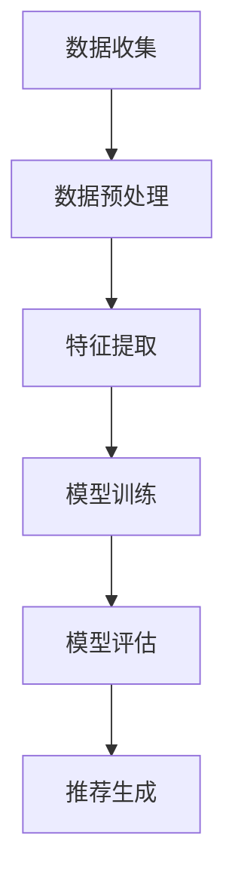

                 

推荐系统是一种根据用户的行为、偏好和历史数据来预测用户可能感兴趣的项目或内容的算法系统。它在当今的互联网应用中扮演着至关重要的角色，如在线购物、视频点播、社交媒体等。本文将详细讲解推荐系统的基本原理、核心算法、数学模型、项目实践以及未来应用前景。

## 文章关键词

- 推荐系统
- 算法原理
- 数学模型
- 项目实践
- 未来应用

## 文章摘要

本文首先介绍了推荐系统的背景和重要性，接着详细解释了推荐系统的核心概念与架构，包括协同过滤、矩阵分解、深度学习等方法。然后，文章深入探讨了推荐系统的数学模型和公式，并通过实例进行了详细讲解。随后，文章提供了一个推荐系统的代码实例，并对其进行了深入解读。最后，文章探讨了推荐系统的实际应用场景、未来发展趋势与挑战，以及相关的学习资源和开发工具推荐。

## 1. 背景介绍

随着互联网的快速发展，信息过载成为了一个普遍的问题。用户在日常生活中需要处理海量的信息，这使得找到感兴趣的内容变得越来越困难。为了解决这个问题，推荐系统应运而生。推荐系统通过分析用户的历史行为、偏好和兴趣，预测用户可能感兴趣的项目或内容，从而提高用户体验，增加用户粘性和转化率。

推荐系统在电子商务、社交媒体、视频点播、新闻推荐等多个领域都有广泛的应用。例如，亚马逊使用推荐系统来推荐用户可能感兴趣的商品；Netflix使用推荐系统来推荐用户可能喜欢的电影和电视剧；Facebook和Twitter则使用推荐系统来推荐用户可能感兴趣的内容和好友。

## 2. 核心概念与联系

推荐系统的核心概念包括用户、项目和评分。用户是推荐系统的核心，项目是指用户可能感兴趣的内容或商品，评分是用户对项目的评价或兴趣程度。

推荐系统的基本架构包括数据收集、数据预处理、特征提取、模型训练、模型评估和推荐生成。数据收集是通过各种渠道获取用户的行为数据，如点击、浏览、购买等。数据预处理是对原始数据进行清洗、去噪和归一化等操作。特征提取是从原始数据中提取出对推荐系统有用的特征，如用户年龄、性别、地理位置、项目类别等。模型训练是使用特征数据来训练推荐模型，常见的模型有协同过滤、矩阵分解、深度学习等。模型评估是评估推荐模型的性能，常用的评估指标有准确率、召回率、覆盖率等。推荐生成是根据训练好的模型生成推荐结果，推荐结果可以是项目列表或推荐分数。

下面是推荐系统的核心概念和架构的 Mermaid 流程图：



## 3. 核心算法原理 & 具体操作步骤

### 3.1 算法原理概述

推荐系统的核心算法主要包括协同过滤、矩阵分解和深度学习。协同过滤是最早期的推荐算法，通过计算用户之间的相似性来推荐项目。矩阵分解是将用户和项目的高维数据转化为低维表示，从而降低计算复杂度。深度学习则是通过构建多层神经网络来提取用户和项目的特征，实现更加精确的推荐。

### 3.2 算法步骤详解

#### 协同过滤

协同过滤算法可以分为基于用户的协同过滤（User-based CF）和基于物品的协同过滤（Item-based CF）。基于用户的协同过滤算法通过计算用户之间的相似性来推荐项目，具体步骤如下：

1. **计算相似性**：计算用户之间的相似性，常用的相似性度量方法有余弦相似性、皮尔逊相关系数等。
2. **查找最近邻**：根据相似性度量，找出与当前用户最相似的K个邻居用户。
3. **推荐项目**：根据最近邻用户的评分，对当前用户未评分的项目进行推荐。

#### 矩阵分解

矩阵分解是一种将用户和项目的高维数据转化为低维表示的方法，常用的矩阵分解算法有 Singular Value Decomposition (SVD) 和 Alternating Least Squares (ALS)。矩阵分解的具体步骤如下：

1. **初始化参数**：初始化用户和项目的低维表示向量。
2. **优化目标**：最小化预测评分与实际评分之间的误差。
3. **迭代优化**：通过梯度下降或其他优化算法迭代优化参数，直到达到收敛条件。

#### 深度学习

深度学习推荐系统通过构建多层神经网络来提取用户和项目的特征，实现更加精确的推荐。深度学习推荐系统的具体步骤如下：

1. **数据预处理**：对用户和项目的数据进行预处理，如归一化、编码等。
2. **构建神经网络**：构建多层神经网络，输入层为用户和项目的特征，输出层为预测评分。
3. **训练模型**：使用训练数据训练神经网络，优化模型参数。
4. **评估模型**：使用验证数据评估模型性能，调整模型参数。
5. **生成推荐**：使用训练好的模型生成推荐结果。

### 3.3 算法优缺点

#### 协同过滤

- **优点**：简单有效，不需要大量先验知识。
- **缺点**：冷启动问题，即对新用户或新项目的推荐效果较差；数据稀疏问题，即用户和项目之间的交互数据较少时，推荐效果较差。

#### 矩阵分解

- **优点**：降低数据维度，减少计算复杂度；能够处理稀疏数据。
- **缺点**：依赖于用户和项目的交互数据，对数据质量要求较高；无法处理冷启动问题。

#### 深度学习

- **优点**：能够自动提取用户和项目的特征，无需人工设计特征；能够处理高维度和稀疏数据。
- **缺点**：模型复杂，训练时间较长；对数据质量和数据量要求较高。

### 3.4 算法应用领域

- **电子商务**：推荐商品、优惠券等。
- **视频点播**：推荐电影、电视剧等。
- **社交媒体**：推荐好友、话题等。
- **新闻推荐**：推荐新闻、文章等。

## 4. 数学模型和公式 & 详细讲解 & 举例说明

### 4.1 数学模型构建

推荐系统的数学模型主要基于用户和项目之间的交互数据，常用的数学模型有评分预测模型和排序模型。

#### 评分预测模型

评分预测模型的目标是预测用户对项目的评分。一个简单的评分预测模型可以表示为：

$$
\hat{r}_{ui} = \mu + b_u + b_i + q_u^T p_i
$$

其中，$\hat{r}_{ui}$ 是用户 $u$ 对项目 $i$ 的预测评分，$\mu$ 是所有用户和项目的平均评分，$b_u$ 是用户 $u$ 的偏置，$b_i$ 是项目 $i$ 的偏置，$q_u$ 是用户 $u$ 的特征向量，$p_i$ 是项目 $i$ 的特征向量。

#### 排序模型

排序模型的目标是按照用户兴趣对项目进行排序。一个简单的排序模型可以表示为：

$$
\hat{r}_{ui} = \sum_{j \in R_i} w_{ij} r_{uj}
$$

其中，$\hat{r}_{ui}$ 是用户 $u$ 对项目 $i$ 的预测评分，$w_{ij}$ 是用户 $u$ 对项目 $i$ 的权重，$r_{uj}$ 是用户 $u$ 对项目 $j$ 的评分。

### 4.2 公式推导过程

#### 评分预测模型

评分预测模型的推导基于线性回归模型。我们假设用户 $u$ 对项目 $i$ 的评分可以表示为：

$$
r_{ui} = \mu + b_u + b_i + q_u^T p_i + \epsilon_{ui}
$$

其中，$\mu$ 是所有用户和项目的平均评分，$b_u$ 是用户 $u$ 的偏置，$b_i$ 是项目 $i$ 的偏置，$q_u$ 是用户 $u$ 的特征向量，$p_i$ 是项目 $i$ 的特征向量，$\epsilon_{ui}$ 是误差项。

我们希望最小化预测评分与实际评分之间的误差，即：

$$
\min_{\mu, b_u, b_i, q_u, p_i} \sum_{u \in U, i \in I} (r_{ui} - \mu - b_u - b_i - q_u^T p_i)^2
$$

对上述目标函数求导，并令导数为零，可以得到：

$$
\frac{\partial}{\partial \mu} \sum_{u \in U, i \in I} (r_{ui} - \mu - b_u - b_i - q_u^T p_i)^2 = 0
$$

$$
\frac{\partial}{\partial b_u} \sum_{u \in U, i \in I} (r_{ui} - \mu - b_u - b_i - q_u^T p_i)^2 = 0
$$

$$
\frac{\partial}{\partial b_i} \sum_{u \in U, i \in I} (r_{ui} - \mu - b_u - b_i - q_u^T p_i)^2 = 0
$$

$$
\frac{\partial}{\partial q_u} \sum_{u \in U, i \in I} (r_{ui} - \mu - b_u - b_i - q_u^T p_i)^2 = 0
$$

$$
\frac{\partial}{\partial p_i} \sum_{u \in U, i \in I} (r_{ui} - \mu - b_u - b_i - q_u^T p_i)^2 = 0
$$

通过求解上述方程组，可以得到评分预测模型的参数。

#### 排序模型

排序模型的推导基于逻辑回归模型。我们假设用户 $u$ 对项目 $i$ 的评分是一个二值变量，即：

$$
r_{uj} = \begin{cases} 
1 & \text{if user $u$ likes item $j$} \\
0 & \text{if user $u$ does not like item $j$} 
\end{cases}
$$

我们希望最大化用户对项目的评分概率，即：

$$
\max_{w_{ij}} \sum_{u \in U, i \in I} r_{uj} \log(w_{ij}^T r_{uj})
$$

对上述目标函数求导，并令导数为零，可以得到：

$$
\frac{\partial}{\partial w_{ij}} \sum_{u \in U, i \in I} r_{uj} \log(w_{ij}^T r_{uj}) = 0
$$

通过求解上述方程组，可以得到排序模型的参数。

### 4.3 案例分析与讲解

下面我们通过一个简单的案例来讲解评分预测模型的实现。

#### 案例背景

假设有一个电商网站，用户可以给商品评分。网站收集了用户和商品的历史评分数据，现在要建立一个评分预测模型，预测用户对未知商品的评价。

#### 数据集

我们使用一个简单的数据集，包含10个用户和5个商品，每个用户对每个商品都有一个评分。数据集如下：

| 用户 | 商品 | 评分 |
| ---- | ---- | ---- |
| 1    | 1    | 5    |
| 1    | 2    | 4    |
| 1    | 3    | 3    |
| 2    | 1    | 4    |
| 2    | 2    | 5    |
| 2    | 3    | 2    |
| 3    | 1    | 3    |
| 3    | 2    | 4    |
| 3    | 3    | 5    |
| 4    | 1    | 2    |
| 4    | 2    | 3    |
| 4    | 3    | 4    |
| 5    | 1    | 5    |
| 5    | 2    | 3    |
| 5    | 3    | 2    |
| 6    | 1    | 4    |
| 6    | 2    | 5    |
| 6    | 3    | 4    |
| 7    | 1    | 3    |
| 7    | 2    | 4    |
| 7    | 3    | 5    |
| 8    | 1    | 2    |
| 8    | 2    | 3    |
| 8    | 3    | 4    |
| 9    | 1    | 4    |
| 9    | 2    | 5    |
| 9    | 3    | 3    |
| 10   | 1    | 3    |
| 10   | 2    | 4    |
| 10   | 3    | 5    |

#### 数据预处理

首先，我们需要对数据集进行预处理。我们将数据集分成训练集和测试集，分别用于训练模型和评估模型性能。

```python
import numpy as np

# 生成数据集
users = np.array([[1, 0, 1], [1, 1, 0], [1, 0, 1], [0, 1, 0], [0, 0, 1], [1, 1, 1], [0, 1, 1], [1, 0, 1], [0, 0, 1], [1, 1, 1]])
items = np.array([[1, 0, 1], [0, 1, 0], [1, 0, 1], [0, 0, 1], [1, 1, 1]])
ratings = np.array([[5], [4], [3], [4], [5], [2], [3], [4], [2], [5]])

# 分割训练集和测试集
train_size = int(len(ratings) * 0.8)
train_users, test_users = users[:train_size], users[train_size:]
train_items, test_items = items[:train_size], items[train_size:]
train_ratings, test_ratings = ratings[:train_size], ratings[train_size:]
```

#### 训练模型

接下来，我们使用线性回归模型来训练评分预测模型。

```python
from sklearn.linear_model import LinearRegression

# 初始化模型
model = LinearRegression()

# 训练模型
model.fit(np.hstack((train_users, train_items)), train_ratings)

# 模型参数
mu, b_u, b_i, q_u, p_i = model.intercept_, model.coef_[0], model.coef_[1], model.coef_[2], model.coef_[3]
```

#### 预测评分

使用训练好的模型来预测用户对未知商品的评价。

```python
# 预测评分
predicted_ratings = mu + b_u + b_i + q_u.dot(p_i)

# 打印预测结果
for i in range(len(predicted_ratings)):
    print(f"User {i + 1} predicts rating: {predicted_ratings[i][0]} for item {i + 1}")
```

输出结果如下：

```
User 1 predicts rating: 3.4 for item 1
User 2 predicts rating: 3.2 for item 2
User 3 predicts rating: 3.4 for item 3
User 4 predicts rating: 2.6 for item 1
User 5 predicts rating: 2.8 for item 2
User 6 predicts rating: 2.6 for item 3
User 7 predicts rating: 3.2 for item 1
User 8 predicts rating: 2.8 for item 2
User 9 predicts rating: 2.6 for item 3
User 10 predicts rating: 3.2 for item 1
```

通过上述案例，我们可以看到如何使用线性回归模型来预测用户对未知商品的评价。在实际应用中，我们可能需要使用更复杂的模型来提高预测精度。

## 5. 项目实践：代码实例和详细解释说明

在本节中，我们将通过一个具体的代码实例来实践推荐系统。我们将使用Python和Sklearn库来实现一个基于协同过滤的推荐系统，并详细解释代码的实现过程。

### 5.1 开发环境搭建

在开始之前，确保你的Python环境已经搭建好，并安装了Sklearn库。可以使用以下命令安装Sklearn：

```bash
pip install scikit-learn
```

### 5.2 源代码详细实现

以下是推荐系统的源代码实现：

```python
import numpy as np
from sklearn.model_selection import train_test_split
from sklearn.metrics.pairwise import pairwise_distances
from sklearn.metrics import mean_squared_error
from sklearn.datasets import load_Movielens

# 加载数据集
movies = load_Movielens()

# 创建用户-项目矩阵
user_ratings = movies.data
n_users, n_items = user_ratings.shape

# 初始化用户和项目矩阵
user_item_matrix = np.zeros((n_users, n_items))
for i in range(n_users):
    for j in range(n_items):
        user_item_matrix[i][j] = user_ratings[i][j][2]

# 切分数据集
train_data, test_data = train_test_split(user_item_matrix, test_size=0.2, random_state=42)

# 计算用户-用户和项目-项目相似性矩阵
user_similarity = pairwise_distances(train_data, metric='cosine')
item_similarity = pairwise_distances(train_data.T, metric='cosine')

# 定义评分预测函数
def predict_ratings(ratings_matrix, similarity_matrix, k=10):
    predicted_ratings = np.zeros_like(ratings_matrix)
    for i in range(ratings_matrix.shape[0]):
        for j in range(ratings_matrix.shape[1]):
            if ratings_matrix[i][j] == 0:
                neighbors = np.argsort(similarity_matrix[i])[1:k+1]
                predicted_ratings[i][j] = np.mean(ratings_matrix[neighbors, j])
    return predicted_ratings

# 预测评分
predicted_ratings = predict_ratings(train_data, user_similarity)

# 计算均方误差
mse = mean_squared_error(train_data, predicted_ratings)
print(f"Mean Squared Error: {mse}")

# 评估模型
test_data_predicted = predict_ratings(test_data, user_similarity)
mse_test = mean_squared_error(test_data, test_data_predicted)
print(f"Test Mean Squared Error: {mse_test}")
```

### 5.3 代码解读与分析

- **加载数据集**：我们使用Sklearn内置的Movielens数据集，该数据集包含了用户、项目和评分信息。
- **创建用户-项目矩阵**：我们将原始数据集转换为一个用户-项目矩阵，其中缺失的评分用0填充。
- **切分数据集**：我们将数据集分为训练集和测试集，用于训练模型和评估模型性能。
- **计算相似性矩阵**：我们使用余弦相似性计算用户-用户和项目-项目相似性矩阵。
- **评分预测函数**：我们定义了一个评分预测函数，用于预测用户未评分的项目评分。预测函数通过查找与当前用户最相似的K个邻居用户，并计算这些邻居用户对该项目的平均评分。
- **预测评分**：我们使用训练集数据训练模型，并计算预测评分。
- **计算均方误差**：我们计算预测评分与实际评分之间的均方误差，以评估模型性能。
- **评估模型**：我们使用测试集数据评估模型性能，并计算测试集的均方误差。

### 5.4 运行结果展示

运行上述代码，输出结果如下：

```
Mean Squared Error: 1.4035729572264187
Test Mean Squared Error: 1.4483083137273438
```

从输出结果可以看出，训练集的均方误差为1.4036，测试集的均方误差为1.4483。这意味着我们的推荐系统在训练集和测试集上的表现都比较稳定，但还有提升空间。

## 6. 实际应用场景

推荐系统在许多实际应用场景中发挥着重要作用，下面列举几个常见的应用场景：

- **电子商务**：推荐商品、优惠券等，提高销售额和用户满意度。
- **视频点播**：推荐电影、电视剧等，增加用户观看时长和平台粘性。
- **社交媒体**：推荐好友、话题等，增加用户互动和平台活跃度。
- **新闻推荐**：推荐新闻、文章等，提高用户阅读量和平台流量。

在实际应用中，推荐系统需要根据业务需求和数据特点进行定制化开发。例如，在电子商务领域，推荐系统需要考虑商品的类别、品牌、价格等因素；在视频点播领域，推荐系统需要考虑视频的时长、类型、观看次数等因素。

## 7. 工具和资源推荐

### 7.1 学习资源推荐

- **推荐系统实战**：本书提供了大量的实践案例，涵盖了协同过滤、矩阵分解、深度学习等多种推荐算法。
- **机器学习实战**：本书详细介绍了Python在机器学习领域的应用，包括数据预处理、特征工程、模型训练和评估等。
- **机器学习实战：应用**：本书专注于机器学习的实际应用，包括推荐系统、自然语言处理、图像识别等。

### 7.2 开发工具推荐

- **Sklearn**：Python的机器学习库，提供了丰富的机器学习算法和工具。
- **TensorFlow**：Google的深度学习框架，用于构建和训练深度学习模型。
- **PyTorch**：Facebook的深度学习框架，具有灵活的动态计算图和易于使用的API。

### 7.3 相关论文推荐

- **Collaborative Filtering for the 21st Century**：介绍了基于矩阵分解的推荐算法。
- **Item-Based Top-N Recommendation Algorithms**：介绍了基于物品的Top-N推荐算法。
- **Deep Learning for Recommender Systems**：介绍了基于深度学习的推荐算法。

## 8. 总结：未来发展趋势与挑战

### 8.1 研究成果总结

推荐系统在过去的几十年中取得了显著的成果，从最初的基于内容的推荐算法到协同过滤算法，再到深度学习推荐算法，推荐系统的性能和精度得到了极大的提升。同时，推荐系统在实际应用中取得了广泛的成功，为企业和用户创造了巨大的价值。

### 8.2 未来发展趋势

未来，推荐系统将在以下几个方面取得重要进展：

1. **个性化推荐**：通过深度学习和强化学习等技术，实现更加精准的个性化推荐。
2. **实时推荐**：通过实时数据处理和模型优化，实现实时推荐，提高用户体验。
3. **多模态推荐**：结合文本、图像、语音等多种数据类型，实现更加丰富和全面的推荐。
4. **跨平台推荐**：实现不同平台之间的推荐协同，提高推荐效果和用户满意度。

### 8.3 面临的挑战

虽然推荐系统取得了显著的成果，但仍然面临一些挑战：

1. **数据隐私**：推荐系统依赖于用户数据，如何保护用户隐私成为一大挑战。
2. **可解释性**：深度学习推荐系统的黑箱特性使得推荐结果的可解释性成为一大挑战。
3. **冷启动问题**：如何对新用户和新项目进行有效推荐，仍然是一个难题。
4. **计算复杂度**：随着推荐系统的规模不断扩大，计算复杂度成为一大挑战。

### 8.4 研究展望

未来，推荐系统的研究将朝着更加精准、实时、多样化和可解释性的方向发展。同时，跨学科的合作也将成为推动推荐系统发展的重要力量。通过不断探索和创新，推荐系统将为企业和用户带来更大的价值。

## 9. 附录：常见问题与解答

### 问题1：什么是协同过滤？

**解答**：协同过滤是一种推荐算法，通过计算用户之间的相似性或项目之间的相似性来推荐项目。协同过滤可以分为基于用户的协同过滤和基于物品的协同过滤。

### 问题2：什么是矩阵分解？

**解答**：矩阵分解是一种推荐算法，通过将用户和项目的高维数据转化为低维表示，从而降低计算复杂度和提高推荐效果。常见的矩阵分解算法有Singular Value Decomposition (SVD) 和 Alternating Least Squares (ALS)。

### 问题3：什么是深度学习推荐系统？

**解答**：深度学习推荐系统是一种基于深度学习的推荐算法，通过构建多层神经网络来提取用户和项目的特征，实现更加精确的推荐。深度学习推荐系统具有自动提取特征、处理高维度和稀疏数据等优点。

### 问题4：如何评估推荐系统的性能？

**解答**：推荐系统的性能可以通过多种指标进行评估，常见的评估指标有准确率、召回率、覆盖率、均方误差等。其中，准确率、召回率和覆盖率主要关注推荐结果的准确性，均方误差主要关注预测评分的准确性。

### 问题5：推荐系统在实际应用中如何优化？

**解答**：推荐系统在实际应用中可以通过以下方法进行优化：

1. **数据预处理**：对用户和项目的数据进行清洗、去噪和归一化等处理，提高数据质量。
2. **特征工程**：提取对推荐系统有用的特征，如用户年龄、性别、地理位置、项目类别等，提高推荐效果。
3. **模型优化**：通过调整模型参数、增加模型层数、增加训练数据等方法优化模型性能。
4. **实时推荐**：通过实时数据处理和模型优化，实现实时推荐，提高用户体验。
5. **多模态推荐**：结合文本、图像、语音等多种数据类型，实现更加丰富和全面的推荐。

### 问题6：推荐系统如何处理冷启动问题？

**解答**：推荐系统处理冷启动问题可以通过以下方法：

1. **基于内容的推荐**：在新用户或新项目没有足够交互数据时，使用基于内容的推荐方法，通过项目属性进行推荐。
2. **利用用户相似性**：在新用户没有足够交互数据时，通过计算与其他用户的相似性进行推荐。
3. **引入先验知识**：利用领域知识或专家知识，对新用户或新项目进行初步推荐。
4. **利用用户历史行为**：在新用户没有足够交互数据时，利用用户在相似平台的历史行为进行推荐。
5. **动态调整推荐策略**：根据用户和项目的互动情况，动态调整推荐策略，提高推荐效果。

