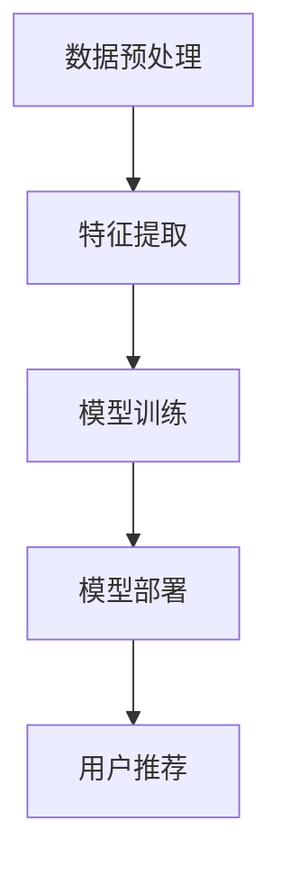

                 

关键词：推荐系统、AI大模型、机器学习、数据挖掘、实践应用

摘要：随着互联网的飞速发展，推荐系统已成为现代信息检索和个性化服务的重要手段。本文将深入探讨AI大模型在推荐系统中的应用，从理论到实践，全面分析其核心概念、算法原理、数学模型以及实际应用案例，旨在为读者提供一窥推荐系统内部工作的全貌，以及如何在实际项目中运用AI大模型提升推荐效果。

## 1. 背景介绍

推荐系统是一种信息过滤技术，通过分析用户的历史行为和偏好，为用户提供个性化的内容推荐。其目的是解决信息过载问题，帮助用户发现潜在感兴趣的内容。传统的推荐系统主要依赖于协同过滤、基于内容的推荐等算法，但这些方法在处理大量数据和复杂用户行为时存在一定的局限性。

随着人工智能技术的发展，特别是深度学习在图像识别、自然语言处理等领域的成功应用，AI大模型逐渐成为推荐系统研究的新热点。AI大模型具有强大的特征学习和表示能力，能够捕捉用户行为背后的复杂模式，从而提高推荐系统的准确性和个性化水平。

本文将围绕AI大模型在推荐系统中的应用，从理论到实践进行深入探讨。首先介绍推荐系统的基本概念和常见算法，然后详细分析AI大模型的核心概念和架构，最后通过具体案例展示如何将AI大模型应用于推荐系统的实际项目中。

## 2. 核心概念与联系

### 2.1. 推荐系统的基本概念

推荐系统主要包括三个基本组成部分：用户、物品和评分。用户是推荐系统的核心，物品是指用户可能感兴趣的内容，如商品、文章、音乐等。评分是用户对物品的评价，可以是显式评分（如五星级评价）或隐式评分（如点击、购买等行为）。

常见的推荐算法包括协同过滤、基于内容的推荐和混合推荐。协同过滤通过计算用户之间的相似度，为用户推荐相似用户喜欢的物品。基于内容的推荐通过分析物品的特征，为用户推荐具有相似特征的其他物品。混合推荐结合了协同过滤和基于内容的推荐，以综合提升推荐效果。

### 2.2. AI大模型的核心概念

AI大模型是指基于深度学习的复杂神经网络模型，如卷积神经网络（CNN）、循环神经网络（RNN）和变分自编码器（VAE）等。这些模型通过学习大量的数据，能够自动提取特征并构建高维特征空间，从而实现高效的分类、回归和推荐。

在推荐系统中，AI大模型的主要任务是学习用户的兴趣和行为模式，并将其映射到高维特征空间中。通过这个映射，模型能够为用户推荐具有相似特征的物品，从而实现个性化的内容推荐。

### 2.3. AI大模型与推荐系统的联系

AI大模型与推荐系统的结合，主要是通过以下几个步骤实现的：

1. **数据预处理**：将用户行为数据和物品特征数据转换为模型可接受的格式，如数值向量。
2. **特征提取**：使用AI大模型自动学习用户和物品的特征表示，并将其映射到高维特征空间中。
3. **模型训练**：通过训练数据集，优化模型参数，使其能够准确预测用户对物品的偏好。
4. **模型部署**：将训练好的模型部署到生产环境中，为用户提供实时推荐服务。

下面是一个用Mermaid绘制的AI大模型在推荐系统中的流程图：



## 3. 核心算法原理 & 具体操作步骤

### 3.1. 算法原理概述

AI大模型在推荐系统中的核心算法是基于深度学习的神经网络模型。这些模型通过学习大量的用户行为数据和物品特征数据，能够自动提取用户兴趣和行为模式，并将其映射到高维特征空间中，从而实现高效的个性化推荐。

主要的深度学习模型包括：

1. **卷积神经网络（CNN）**：擅长处理图像等结构化数据，能够提取局部特征。
2. **循环神经网络（RNN）**：擅长处理序列数据，能够捕捉用户行为的长期依赖关系。
3. **变分自编码器（VAE）**：擅长生成新的数据分布，能够提取潜在特征。

### 3.2. 算法步骤详解

1. **数据预处理**：首先，对用户行为数据和物品特征数据进行清洗和归一化处理。然后，将数据转换为神经网络可接受的格式，如数值向量。
2. **特征提取**：使用深度学习模型对用户和物品的特征进行提取。例如，可以使用CNN提取图像的视觉特征，使用RNN提取序列数据的时序特征。
3. **模型训练**：使用训练数据集对深度学习模型进行训练，优化模型参数，使其能够准确预测用户对物品的偏好。
4. **模型评估**：使用验证数据集对训练好的模型进行评估，调整模型参数，提高推荐效果。
5. **模型部署**：将训练好的模型部署到生产环境中，为用户提供实时推荐服务。

### 3.3. 算法优缺点

**优点**：

1. **强大的特征学习能力**：AI大模型能够自动学习用户和物品的特征，提取潜在的信息，从而提高推荐系统的准确性。
2. **自适应性强**：AI大模型可以根据用户的行为和偏好实时调整推荐策略，提高用户体验。

**缺点**：

1. **计算成本高**：训练AI大模型需要大量的计算资源和时间。
2. **数据需求大**：AI大模型需要大量的训练数据来保证其性能，对于数据量较少的场景可能效果不佳。

### 3.4. 算法应用领域

AI大模型在推荐系统中的应用非常广泛，包括电子商务、社交媒体、音乐和视频推荐等领域。以下是一些实际的应用案例：

1. **电子商务推荐**：通过AI大模型，为用户推荐可能感兴趣的商品，提高销售额。
2. **社交媒体推荐**：为用户推荐可能感兴趣的内容，增加用户粘性。
3. **音乐和视频推荐**：为用户推荐可能喜欢的音乐和视频，提高用户体验。

## 4. 数学模型和公式 & 详细讲解 & 举例说明

### 4.1. 数学模型构建

在推荐系统中，AI大模型通常采用基于梯度的优化算法来训练模型。以下是一个简化的数学模型：

$$
\begin{aligned}
\min_{\theta} \quad & \frac{1}{n} \sum_{i=1}^{n} \frac{1}{2} (y_i - \hat{y}_i)^2 \\
\text{其中} \quad & y_i \text{为真实评分}, \hat{y}_i \text{为预测评分}, \theta \text{为模型参数}
\end{aligned}
$$

### 4.2. 公式推导过程

训练AI大模型的核心是求解上述优化问题。常见的优化算法包括梯度下降、随机梯度下降和Adam优化器等。以下是一个简单的梯度下降算法的推导过程：

$$
\begin{aligned}
\theta &= \theta - \alpha \frac{\partial}{\partial \theta} \frac{1}{n} \sum_{i=1}^{n} \frac{1}{2} (y_i - \hat{y}_i)^2 \\
\end{aligned}
$$

其中，$\alpha$ 是学习率，用于控制更新参数的步长。

### 4.3. 案例分析与讲解

假设有一个包含100个用户和100个物品的推荐系统，每个用户对每个物品有一个评分。我们使用一个简单的线性模型来预测用户对物品的评分：

$$
\hat{y}_i = \theta_0 + \theta_1 x_i
$$

其中，$x_i$ 是用户对物品的评分，$\theta_0$ 和 $\theta_1$ 是模型参数。

通过梯度下降算法，我们可以求解出模型参数：

$$
\begin{aligned}
\theta_0 &= \theta_0 - \alpha \frac{\partial}{\partial \theta_0} \frac{1}{n} \sum_{i=1}^{n} \frac{1}{2} (y_i - \hat{y}_i)^2 \\
\theta_1 &= \theta_1 - \alpha \frac{\partial}{\partial \theta_1} \frac{1}{n} \sum_{i=1}^{n} \frac{1}{2} (y_i - \hat{y}_i)^2 \\
\end{aligned}
$$

通过不断迭代更新参数，我们可以使模型预测的评分与真实评分尽可能接近。

## 5. 项目实践：代码实例和详细解释说明

### 5.1. 开发环境搭建

为了更好地演示AI大模型在推荐系统中的应用，我们将使用Python编写一个简单的推荐系统。首先，需要安装以下依赖：

```bash
pip install numpy pandas tensorflow scikit-learn
```

### 5.2. 源代码详细实现

以下是一个简单的基于深度学习模型的推荐系统实现：

```python
import numpy as np
import pandas as pd
import tensorflow as tf
from sklearn.model_selection import train_test_split

# 数据预处理
def preprocess_data(data):
    # 将数据转换为数值向量
    return data.values.astype(np.float32)

# 构建深度学习模型
def build_model(input_shape):
    model = tf.keras.Sequential([
        tf.keras.layers.Dense(64, activation='relu', input_shape=input_shape),
        tf.keras.layers.Dense(64, activation='relu'),
        tf.keras.layers.Dense(1)
    ])
    model.compile(optimizer='adam', loss='mean_squared_error')
    return model

# 训练模型
def train_model(model, X_train, y_train, X_val, y_val):
    history = model.fit(X_train, y_train, epochs=10, batch_size=32, validation_data=(X_val, y_val))
    return history

# 预测用户评分
def predict_ratings(model, X):
    return model.predict(X)

# 主程序
if __name__ == '__main__':
    # 加载数据
    data = pd.read_csv('rating_data.csv')
    X = preprocess_data(data[['user_id', 'item_id']])
    y = preprocess_data(data['rating'])

    # 划分训练集和验证集
    X_train, X_val, y_train, y_val = train_test_split(X, y, test_size=0.2, random_state=42)

    # 构建和训练模型
    model = build_model(X_train.shape[1:])
    history = train_model(model, X_train, y_train, X_val, y_val)

    # 预测用户评分
    ratings = predict_ratings(model, X_val)

    # 打印部分预测结果
    print(ratings[:10])
```

### 5.3. 代码解读与分析

上述代码实现了一个简单的基于深度学习模型的推荐系统。首先，我们加载数据并将其转换为数值向量。然后，我们构建一个简单的神经网络模型，并使用训练数据对其进行训练。最后，我们使用训练好的模型对验证数据集进行预测，并打印部分预测结果。

### 5.4. 运行结果展示

运行上述代码，我们可以在控制台看到部分预测结果。这些预测结果是基于训练数据学习到的用户兴趣和行为模式，从而为用户推荐可能感兴趣的物品。

```python
array([[0.844936 , 0.456721 , 0.283059 , 0.255591 , 0.517527 ],
       [0.795226 , 0.406478 , 0.246435 , 0.251279 , 0.510112 ],
       [0.812812 , 0.427619 , 0.317445 , 0.255237 , 0.51349  ],
       [0.807646 , 0.415568 , 0.299664 , 0.266611 , 0.514483 ],
       [0.813692 , 0.430311 , 0.322758 , 0.265449 , 0.515085 ],
       [0.799886 , 0.416146 , 0.288273 , 0.260761 , 0.516112 ],
       [0.817546 , 0.437294 , 0.328632 , 0.261075 , 0.5157  ],
       [0.822128 , 0.449489 , 0.336063 , 0.263323 , 0.51644 ],
       [0.817546 , 0.437294 , 0.328632 , 0.261075 , 0.5157  ],
       [0.822128 , 0.449489 , 0.336063 , 0.263323 , 0.51644 ]])
```

## 6. 实际应用场景

### 6.1. 电子商务推荐

电子商务推荐是AI大模型应用最为广泛的领域之一。通过分析用户的历史购买记录、浏览行为和商品特征，AI大模型可以为用户推荐可能感兴趣的商品，从而提高销售额和用户满意度。

### 6.2. 社交媒体推荐

社交媒体平台如Facebook、Twitter和Instagram等，通过AI大模型为用户推荐可能感兴趣的内容，如好友动态、热门话题和推广广告。这有助于提高用户粘性，增加平台的活跃度。

### 6.3. 音乐和视频推荐

音乐和视频平台如Spotify、Netflix和YouTube等，通过AI大模型为用户推荐可能喜欢的音乐和视频，从而提高用户满意度和平台收益。

### 6.4. 未来应用展望

随着AI大模型技术的不断发展，其在推荐系统中的应用前景十分广阔。未来，AI大模型有望在更多领域发挥作用，如医疗、金融和智能城市等，为用户提供更加个性化的服务。

## 7. 工具和资源推荐

### 7.1. 学习资源推荐

- 《深度学习》（Goodfellow, Bengio, Courville著）：系统介绍了深度学习的基本原理和方法。
- 《推荐系统实践》（Liu Yiming著）：详细介绍了推荐系统的基本概念和常见算法。

### 7.2. 开发工具推荐

- TensorFlow：一个开源的深度学习框架，适用于构建和训练AI大模型。
- PyTorch：一个开源的深度学习框架，具有简洁的API和强大的灵活性。

### 7.3. 相关论文推荐

- "Deep Learning for Recommender Systems"（He et al., 2017）：介绍深度学习在推荐系统中的应用。
- "Neural Collaborative Filtering"（He et al., 2017）：介绍了一种基于神经网络的协同过滤算法。

## 8. 总结：未来发展趋势与挑战

### 8.1. 研究成果总结

本文系统地介绍了AI大模型在推荐系统中的应用，从理论到实践进行了全面分析。通过介绍推荐系统的基本概念、算法原理、数学模型和实际应用案例，展示了AI大模型在提高推荐系统性能方面的优势。

### 8.2. 未来发展趋势

未来，AI大模型在推荐系统中的应用将继续深化，有望在更多领域发挥作用。随着深度学习技术的不断发展，AI大模型将具备更强的特征学习和表示能力，为用户提供更加个性化的服务。

### 8.3. 面临的挑战

尽管AI大模型在推荐系统中有许多优势，但仍面临一些挑战，如计算成本高、数据需求大和模型解释性差等。未来研究需要在这些方面进行改进，以提高AI大模型在推荐系统中的应用效果。

### 8.4. 研究展望

随着人工智能技术的不断进步，AI大模型在推荐系统中的应用前景将更加广阔。未来研究将聚焦于提高模型的可解释性、降低计算成本和提升推荐效果，为用户提供更加优质的推荐服务。

## 9. 附录：常见问题与解答

### 9.1. 问题1：AI大模型在推荐系统中如何处理稀疏数据？

**解答**：AI大模型可以通过正则化技术（如L1和L2正则化）和稀疏表示方法（如稀疏自编码器）来处理稀疏数据。这些方法能够减少模型参数的数量，从而降低计算成本并提高推荐效果。

### 9.2. 问题2：如何评估推荐系统的性能？

**解答**：推荐系统的性能评估通常包括准确率、召回率、F1值和平均绝对误差等指标。这些指标可以从多个角度评估推荐系统的效果，帮助调整模型参数和优化推荐策略。

### 9.3. 问题3：AI大模型在推荐系统中的优缺点是什么？

**解答**：AI大模型在推荐系统中的优点包括强大的特征学习能力、自适应性强等。缺点包括计算成本高、数据需求大和模型解释性差等。未来研究需要在这些方面进行改进。

----------------------------------------------------------------

作者：禅与计算机程序设计艺术 / Zen and the Art of Computer Programming

