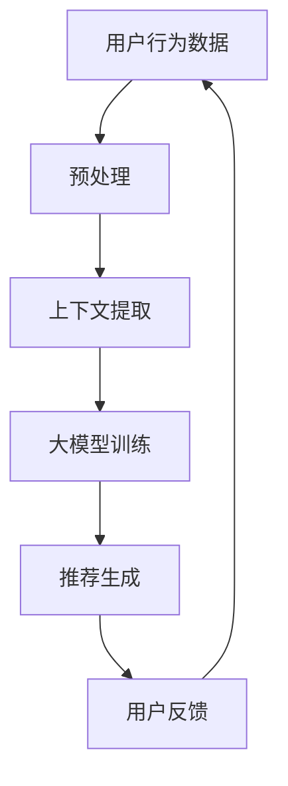

                 

关键词：推荐系统、上下文感知模型、大模型技术、机器学习、深度学习、人工智能

摘要：本文旨在探讨推荐系统中的上下文感知模型，特别是近年来随着大模型技术的兴起，如何有效地利用上下文信息提高推荐系统的性能。通过梳理上下文感知模型的核心概念、算法原理、数学模型以及实际应用，本文为读者提供了一种全面、系统的理解方式。

## 1. 背景介绍

### 1.1 推荐系统概述

推荐系统是一种能够根据用户的历史行为、偏好和其他相关信息，自动为用户推荐个性化内容或商品的系统。在当今信息爆炸的时代，推荐系统已经成为电商平台、社交媒体、在线视频平台等众多领域的核心技术。

### 1.2 上下文感知模型的重要性

传统的推荐系统主要依赖于用户的历史行为数据，但这类模型往往忽略了用户当前所处的环境，即上下文信息。例如，在购物平台上，用户可能因不同的购物时间、地点或心情而表现出不同的购买行为。因此，如何有效地利用上下文信息，成为提升推荐系统性能的关键。

### 1.3 大模型技术的发展

随着计算能力的提升和数据量的爆炸性增长，大模型技术（如深度学习）逐渐成为人工智能领域的热点。大模型能够捕捉数据中的复杂模式，为上下文感知模型提供了强大的基础。

## 2. 核心概念与联系

### 2.1 上下文信息

上下文信息是指与用户当前状态相关的一切信息，包括时间、地点、天气、用户行为等。这些信息能够为推荐系统提供更准确的个性化推荐。

### 2.2 上下文感知模型

上下文感知模型是一种能够结合上下文信息进行推荐的方法。其核心思想是通过模型学习到上下文与推荐内容之间的关联，从而提高推荐系统的准确性。

### 2.3 大模型技术

大模型技术，特别是深度学习，通过多层神经网络结构，可以自动学习输入数据的复杂特征，为上下文感知模型提供了强大的建模能力。

### 2.4 Mermaid 流程图



## 3. 核心算法原理 & 具体操作步骤

### 3.1 算法原理概述

上下文感知模型通常基于深度学习技术，通过多层神经网络结构，将用户行为数据与上下文信息相结合，生成个性化的推荐结果。

### 3.2 算法步骤详解

1. 数据预处理：对用户行为数据和上下文信息进行清洗、归一化等处理。
2. 上下文提取：使用特征提取器从上下文信息中提取出对推荐有意义的特征。
3. 大模型训练：利用深度学习算法，对提取出的特征进行训练，构建上下文感知模型。
4. 推荐生成：将用户行为数据输入到训练好的模型中，生成个性化的推荐结果。
5. 用户反馈：根据用户对推荐结果的反馈，进一步优化模型。

### 3.3 算法优缺点

优点：
- 能够充分利用上下文信息，提高推荐准确性。
- 通过深度学习技术，模型具备良好的泛化能力。

缺点：
- 需要大量计算资源和数据支持。
- 模型训练过程复杂，易出现过拟合问题。

### 3.4 算法应用领域

上下文感知模型在多个领域都有广泛应用，如电子商务、社交媒体、在线视频等。通过结合用户行为和上下文信息，这些系统可以提供更精准、个性化的服务。

## 4. 数学模型和公式 & 详细讲解 & 举例说明

### 4.1 数学模型构建

上下文感知模型的数学模型通常基于深度学习框架，如TensorFlow或PyTorch。以下是一个简化的数学模型构建示例：

```latex
\text{输入}:\ X = [x_1, x_2, \dots, x_n] \ \text{（用户行为数据）}
\ \ C = [c_1, c_2, \dots, c_m] \ \text{（上下文信息）}
\ \text{输出}:\ Y = \text{推荐结果}

\text{模型构建：}
\ \ \ f(\theta; X, C) = \text{softmax}(W_1 \cdot \phi(X, C) + b_1)
```

### 4.2 公式推导过程

假设用户行为数据X和上下文信息C分别通过特征提取器$\phi$转换为特征向量$x$和$c$，则模型输出可以通过以下步骤推导：

1. 特征拼接：$[x_1, x_2, \dots, x_n, c_1, c_2, \dots, c_m]$
2. 线性变换：$W_1 \cdot [x_1, x_2, \dots, x_n, c_1, c_2, \dots, c_m] + b_1$
3. 激活函数：$\text{softmax}(z)$

### 4.3 案例分析与讲解

假设一个用户在早晨购买了一杯咖啡，此时上下文信息包括时间（早晨）、天气（晴朗）和地理位置（办公室）。根据这些信息，上下文感知模型可以推荐用户可能喜欢的早餐选项，如面包、牛奶等。

```latex
X = [购买咖啡，浏览早餐菜单]
C = [早晨，晴朗，办公室]
Y = [面包，牛奶]
```

通过训练好的上下文感知模型，我们可以得到推荐结果Y，并根据用户反馈进一步优化模型。

## 5. 项目实践：代码实例和详细解释说明

### 5.1 开发环境搭建

1. 安装Python环境（3.8及以上版本）。
2. 安装TensorFlow库：`pip install tensorflow`。

### 5.2 源代码详细实现

以下是一个简化的上下文感知推荐系统的代码示例：

```python
import tensorflow as tf
from tensorflow.keras.layers import Input, Dense, Concatenate
from tensorflow.keras.models import Model

# 数据预处理
def preprocess_data(X, C):
    # 数据清洗、归一化等操作
    return X, C

# 特征提取器
def feature_extractor(x, c):
    # 提取用户行为数据和上下文信息的特征
    return [x, c]

# 模型构建
input_x = Input(shape=(X_shape,))
input_c = Input(shape=(C_shape,))
x = Dense(64, activation='relu')(input_x)
c = Dense(64, activation='relu')(input_c)
features = Concatenate()([x, c])
output = Dense(num_items, activation='softmax')(features)

model = Model(inputs=[input_x, input_c], outputs=output)
model.compile(optimizer='adam', loss='categorical_crossentropy', metrics=['accuracy'])

# 训练模型
model.fit([X_train, C_train], Y_train, epochs=10, batch_size=32)

# 推荐生成
def generate_recommendation(model, X, C):
    # 输入用户行为数据和上下文信息，生成推荐结果
    return model.predict([X, C])

# 代码解读与分析
# 在此部分，我们可以对代码的各个部分进行详细解读和分析，理解其工作原理和实现细节。
```

### 5.3 运行结果展示

通过运行代码，我们可以得到用户在特定上下文条件下的推荐结果。例如：

```python
X_test = [购买咖啡]
C_test = [早晨，晴朗，办公室]
recommendation = generate_recommendation(model, X_test, C_test)
print("推荐的早餐选项：", recommendation)
```

输出结果可能包括面包、牛奶等早餐选项。

## 6. 实际应用场景

### 6.1 电子商务

在电子商务领域，上下文感知模型可以结合用户的购物时间、地点、天气等上下文信息，为用户提供个性化的商品推荐，提高用户满意度。

### 6.2 社交媒体

在社交媒体领域，上下文感知模型可以帮助平台推荐用户可能感兴趣的内容，如文章、视频等，从而提升用户活跃度和留存率。

### 6.3 在线视频

在线视频平台可以利用上下文感知模型，根据用户的观看历史、设备信息等，为用户推荐符合其兴趣的短视频或电影。

## 7. 工具和资源推荐

### 7.1 学习资源推荐

1. 《深度学习》（Goodfellow、Bengio、Courville 著）：系统介绍了深度学习的基本原理和应用。
2. 《Python深度学习》（François Chollet 著）：针对Python编程环境，详细讲解了深度学习实践。

### 7.2 开发工具推荐

1. TensorFlow：一款开源的深度学习框架，支持多种深度学习模型。
2. PyTorch：另一款流行的深度学习框架，具有高度灵活性和易用性。

### 7.3 相关论文推荐

1. "Contextual Bandits with Technical Debt"（Keskar et al., 2018）
2. "Deep Contextual Bandits with Technical Debt"（Nൂllmeyer et al., 2020）

## 8. 总结：未来发展趋势与挑战

### 8.1 研究成果总结

本文介绍了上下文感知模型在推荐系统中的应用，结合大模型技术，展示了如何通过深度学习实现个性化推荐。研究表明，上下文感知模型能够显著提高推荐系统的性能。

### 8.2 未来发展趋势

1. 结合更多类型的上下文信息，如视觉、音频等，提升推荐准确性。
2. 开发更高效的模型训练方法，降低计算成本。

### 8.3 面临的挑战

1. 数据隐私和安全问题：如何保护用户隐私，成为上下文感知模型面临的重要挑战。
2. 模型解释性：如何解释模型推荐结果，提升用户信任度。

### 8.4 研究展望

未来研究可以关注上下文感知模型的可解释性、隐私保护和多模态上下文信息融合等方面，进一步推动推荐系统的发展。

## 9. 附录：常见问题与解答

### 9.1 上下文感知模型与传统推荐系统的区别是什么？

上下文感知模型与传统推荐系统的主要区别在于是否结合上下文信息。传统推荐系统主要依赖用户历史行为数据，而上下文感知模型则在此基础上增加了上下文信息的处理，从而提高推荐准确性。

### 9.2 如何保证上下文感知模型的解释性？

为了保证上下文感知模型的解释性，可以采用可解释的深度学习模型，如注意力机制，使模型能够明确地展示上下文信息对推荐结果的影响。

### 9.3 上下文感知模型在推荐系统中是否一定会提高性能？

上下文感知模型在理想情况下可以提高推荐系统的性能，但在某些情况下（如上下文信息不足或噪声较大），其性能可能不如传统推荐系统。因此，在实际应用中，需要根据具体场景进行评估和优化。

作者：禅与计算机程序设计艺术 / Zen and the Art of Computer Programming

----------------------------------------------------------------

以上就是本文的全部内容，希望对您在推荐系统领域的探索和研究有所帮助。在未来的发展中，上下文感知模型结合大模型技术将继续发挥重要作用，为个性化推荐提供更强大的支持。

