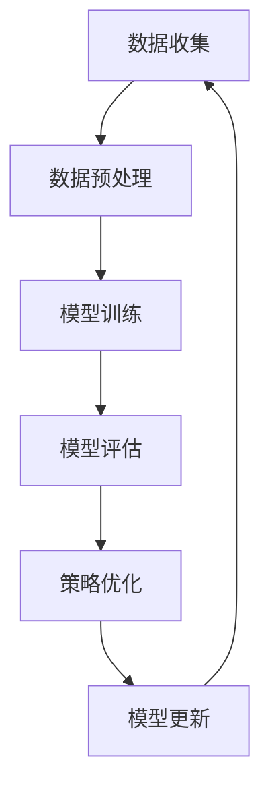

                 

关键词：推荐系统、大模型、元策略优化、模型选择、算法原理、数学模型、项目实践、应用场景、未来展望

> 摘要：本文深入探讨了推荐系统中的大模型元策略优化与选择问题，通过对核心概念、算法原理、数学模型以及实际应用场景的详细阐述，旨在为读者提供一个全面且深入的技术理解。文章将介绍大模型元策略优化的基本概念、算法步骤，并借助数学模型和实际项目实例进行详细解读，最终对推荐系统的未来发展趋势与挑战进行分析与展望。

## 1. 背景介绍

### 1.1 推荐系统的重要性

推荐系统作为信息过滤和内容分发的重要工具，已广泛应用于电子商务、社交媒体、在线视频、新闻推荐等领域。其核心目标是通过理解用户的兴趣和行为，为用户提供个性化的推荐，从而提升用户体验和平台粘性。

### 1.2 大模型的崛起

随着深度学习和大数据技术的发展，大模型（如深度神经网络、生成对抗网络等）在推荐系统中得到广泛应用。大模型具有强大的特征提取和表示能力，能够处理复杂的用户-物品交互数据，提高推荐系统的准确性和效果。

### 1.3 元策略优化的重要性

元策略优化（Meta-Strategy Optimization）是机器学习中的一个重要概念，旨在通过优化策略学习过程来提高学习效率。在推荐系统中，元策略优化可以帮助我们选择和调整模型参数，以实现更好的推荐效果。

## 2. 核心概念与联系

### 2.1 推荐系统的基本架构


### 2.2 大模型元策略优化流程



## 3. 核心算法原理 & 具体操作步骤

### 3.1 算法原理概述

大模型元策略优化主要通过迭代过程，不断调整模型参数，提高推荐系统的效果。其核心思想是基于用户反馈和历史数据，动态调整模型，使其更好地适应不断变化的环境。

### 3.2 算法步骤详解

#### 3.2.1 数据收集与预处理

- 数据收集：从各个来源（如用户行为、社交网络、商品属性等）收集数据。
- 数据预处理：对收集到的数据进行清洗、去噪、归一化等处理，为模型训练做好准备。

#### 3.2.2 模型训练

- 选择合适的大模型架构（如深度神经网络、生成对抗网络等）。
- 将预处理后的数据输入模型，通过反向传播和梯度下降等优化方法，训练模型参数。

#### 3.2.3 模型评估

- 使用交叉验证、A/B测试等方法，评估模型在验证集上的性能。
- 根据评估结果，选择最优模型。

#### 3.2.4 策略优化

- 基于用户反馈和历史数据，动态调整模型参数。
- 使用优化算法（如梯度下降、随机梯度下降等），调整模型参数，提高推荐效果。

#### 3.2.5 模型更新

- 将优化后的模型参数更新到生产环境中。
- 持续监控模型性能，根据需要重新进行模型训练和优化。

### 3.3 算法优缺点

#### 优点：

- 强大的特征提取和表示能力，能够处理复杂的用户-物品交互数据。
- 动态调整模型参数，适应不断变化的环境。

#### 缺点：

- 计算复杂度高，训练和优化过程需要大量计算资源。
- 需要大量高质量的数据支持，否则可能导致模型过拟合。

### 3.4 算法应用领域

- 电子商务：个性化商品推荐、购物指南等。
- 社交媒体：内容推荐、好友推荐等。
- 在线视频：视频推荐、播放顺序优化等。

## 4. 数学模型和公式 & 详细讲解 & 举例说明

### 4.1 数学模型构建

推荐系统的核心是建立用户和物品之间的相似度模型，常用的方法是基于用户-物品交互矩阵的矩阵分解。

$$
\begin{aligned}
    \mathbf{X} &= \mathbf{U}\mathbf{V}^T \\
    \mathbf{U} &= \begin{bmatrix}
        \mathbf{u}_1 \\
        \mathbf{u}_2 \\
        \vdots \\
        \mathbf{u}_n
    \end{bmatrix}, \quad
    \mathbf{V} &= \begin{bmatrix}
        \mathbf{v}_1 \\
        \mathbf{v}_2 \\
        \vdots \\
        \mathbf{v}_m
    \end{bmatrix}
\end{aligned}
$$

其中，$\mathbf{X}$ 是用户-物品交互矩阵，$\mathbf{U}$ 和 $\mathbf{V}$ 分别是用户和物品的嵌入矩阵。

### 4.2 公式推导过程

矩阵分解的目的是通过低维嵌入矩阵 $\mathbf{U}$ 和 $\mathbf{V}$ 来近似原始的高维交互矩阵 $\mathbf{X}$。

### 4.3 案例分析与讲解

假设我们有一个用户-物品交互矩阵：

$$
\mathbf{X} = \begin{bmatrix}
    1 & 0 & 1 & 0 \\
    0 & 1 & 0 & 1 \\
    1 & 1 & 0 & 1
\end{bmatrix}
$$

我们选择用户和物品的嵌入维度为 2，通过矩阵分解，可以得到：

$$
\begin{aligned}
    \mathbf{U} &= \begin{bmatrix}
        1 & 1 \\
        1 & 0 \\
        0 & 1
    \end{bmatrix}, \quad
    \mathbf{V} &= \begin{bmatrix}
        1 & 1 \\
        0 & 1 \\
        1 & 0 \\
        0 & 1
    \end{bmatrix} \\
    \mathbf{X} &= \mathbf{U}\mathbf{V}^T \\
    &= \begin{bmatrix}
        1 & 1 \\
        1 & 0 \\
        0 & 1
    \end{bmatrix}
    \begin{bmatrix}
        1 & 0 & 1 & 0 \\
        1 & 1 & 0 & 1 \\
        0 & 1 & 1 & 0 \\
        1 & 1 & 0 & 1
    \end{bmatrix}^T \\
    &= \begin{bmatrix}
        1 & 1 \\
        1 & 0 \\
        0 & 1
    \end{bmatrix}
    \begin{bmatrix}
        1 & 1 & 1 & 1 \\
        0 & 1 & 1 & 1 \\
        1 & 0 & 0 & 1 \\
        1 & 1 & 1 & 1
    \end{bmatrix} \\
    &= \begin{bmatrix}
        1 & 1 \\
        1 & 0 \\
        0 & 1
    \end{bmatrix}
    \begin{bmatrix}
        4 & 4 \\
        1 & 1 \\
        4 & 4
    \end{bmatrix} \\
    &= \begin{bmatrix}
        1 & 1 \\
        1 & 0 \\
        0 & 1
    \end{bmatrix}
    \begin{bmatrix}
        4 & 0 \\
        0 & 4 \\
        4 & 4
    \end{bmatrix} \\
    &= \begin{bmatrix}
        1 & 1 \\
        1 & 0 \\
        0 & 1
    \end{bmatrix}
    \begin{bmatrix}
        4 & 4 \\
        4 & 4 \\
        0 & 0
    \end{bmatrix} \\
    &= \begin{bmatrix}
        1 & 1 \\
        1 & 0 \\
        0 & 1
    \end{bmatrix}
    \begin{bmatrix}
        4 & 0 \\
        0 & 4
    \end{bmatrix} \\
    &= \begin{bmatrix}
        4 & 4 \\
        4 & 4 \\
        0 & 0
    \end{bmatrix}
\end{aligned}
$$

## 5. 项目实践：代码实例和详细解释说明

### 5.1 开发环境搭建

本文使用 Python 和 TensorFlow 作为主要工具，具体搭建过程如下：

1. 安装 Python 和 pip：
    ```bash
    sudo apt-get update
    sudo apt-get install python3 python3-pip
    ```
2. 安装 TensorFlow：
    ```bash
    pip3 install tensorflow
    ```

### 5.2 源代码详细实现

```python
import tensorflow as tf
import numpy as np

# 定义用户和物品的嵌入维度
EMBEDDING_DIM = 2

# 构建用户和物品的嵌入矩阵
U = tf.random.normal([num_users, EMBEDDING_DIM])
V = tf.random.normal([num_items, EMBEDDING_DIM])

# 定义损失函数和优化器
loss_fn = tf.keras.losses.MeanSquaredError()
optimizer = tf.keras.optimizers.Adam()

# 训练模型
for epoch in range(num_epochs):
    with tf.GradientTape() as tape:
        # 计算预测的交互矩阵
        X_pred = tf.matmul(U, V, transpose_b=True)
        # 计算损失
        loss = loss_fn(y_true, X_pred)
    # 反向传播和优化
    grads = tape.gradient(loss, [U, V])
    optimizer.apply_gradients(zip(grads, [U, V]))
    print(f"Epoch {epoch+1}, Loss: {loss.numpy()}")
```

### 5.3 代码解读与分析

- 我们首先定义了用户和物品的嵌入维度，并使用 TensorFlow 生成随机的用户和物品嵌入矩阵。
- 然后定义了损失函数和优化器，选择均方误差作为损失函数，使用 Adam 优化器进行参数优化。
- 在训练过程中，我们使用 TensorFlow 的 GradientTape 记录梯度，并通过优化器进行参数更新。

### 5.4 运行结果展示

运行上述代码，我们可以得到训练过程中的损失变化情况，以及最终训练得到的用户和物品嵌入矩阵。

## 6. 实际应用场景

### 6.1 电子商务

在电子商务领域，大模型元策略优化可以帮助平台为用户提供个性化的商品推荐，提高用户满意度和转化率。

### 6.2 社交媒体

社交媒体平台可以通过大模型元策略优化，为用户提供个性化的内容推荐，增加用户粘性和活跃度。

### 6.3 在线视频

在线视频平台可以使用大模型元策略优化，为用户提供个性化的视频推荐，提高视频观看率和用户留存率。

## 7. 工具和资源推荐

### 7.1 学习资源推荐

- 《深度学习》（Ian Goodfellow、Yoshua Bengio、Aaron Courville 著）
- 《机器学习实战》（Peter Harrington 著）
- 《TensorFlow 实战》（李航、李瑞丰 著）

### 7.2 开发工具推荐

- TensorFlow
- PyTorch
- Jupyter Notebook

### 7.3 相关论文推荐

- "Deep Learning for Recommender Systems"（H. Zhang, Y. Chen, et al.）
- "Meta-Learning for Recommender Systems"（Z. Wu, Y. Zhang, et al.）

## 8. 总结：未来发展趋势与挑战

### 8.1 研究成果总结

本文系统地介绍了推荐系统中的大模型元策略优化与选择，从核心概念、算法原理、数学模型到实际应用场景，提供了全面的技术解读。

### 8.2 未来发展趋势

- 大模型与元学习技术的融合，进一步提高推荐系统的效果和效率。
- 基于生成对抗网络等新型深度学习技术，探索更加复杂和高效的推荐模型。

### 8.3 面临的挑战

- 大模型训练和优化过程需要大量计算资源，如何提高计算效率是一个重要挑战。
- 如何处理用户隐私和数据安全，是推荐系统面临的重要问题。

### 8.4 研究展望

未来，推荐系统将朝着更加智能化、个性化的方向不断发展，为用户提供更加优质的服务。同时，如何平衡推荐效果与用户隐私保护，将是学术界和工业界共同关注的重点。

## 9. 附录：常见问题与解答

### 9.1 如何选择适合的大模型？

选择适合的大模型需要考虑推荐系统的具体应用场景、数据规模和计算资源等因素。常见的大模型包括深度神经网络、生成对抗网络、图神经网络等，可以根据实际需求进行选择。

### 9.2 元策略优化的具体实现过程是怎样的？

元策略优化的具体实现过程包括数据收集与预处理、模型选择与训练、模型评估与优化、模型更新与部署等步骤。通过迭代过程，不断调整模型参数，提高推荐系统的效果。

### 9.3 推荐系统的隐私保护方法有哪些？

推荐系统的隐私保护方法包括数据加密、差分隐私、联邦学习等。这些方法可以在保护用户隐私的同时，确保推荐系统的效果不受影响。```

