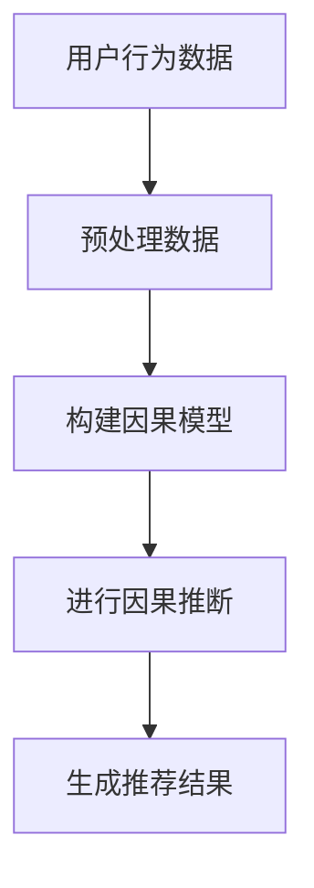

                 

关键词：推荐系统、大模型、因果发现、因果推断、机器学习、算法原理、数学模型、实践应用、未来展望。

> 摘要：本文将深入探讨推荐系统中的大模型因果发现与推断技术。通过对核心概念的详细解析，算法原理的深入讲解，以及实际案例的分析，旨在为读者提供全面的技术洞察，并展望这一领域的未来发展方向。

## 1. 背景介绍

推荐系统作为信息过滤和内容个性化的重要手段，已经在电子商务、社交媒体、在线视频等多个领域得到广泛应用。然而，传统的推荐系统大多依赖于基于用户行为和历史数据的协同过滤算法，这些算法在处理大规模数据时存在计算复杂度高、稀疏性、冷启动等问题。

随着人工智能技术的快速发展，特别是深度学习技术的兴起，大模型在推荐系统中得到了广泛应用。这些大模型不仅能够处理大规模数据，还能够通过学习用户和物品的潜在特征，实现更加精准的推荐。然而，大模型带来的挑战之一是如何进行有效的因果发现与推断。

因果发现与推断是推荐系统中的重要问题，它旨在揭示用户行为背后的因果机制，帮助推荐系统更好地理解用户需求和偏好。传统的机器学习方法往往只能揭示相关性，而无法揭示因果性。因此，如何在推荐系统中利用大模型进行有效的因果发现与推断，成为了当前研究的热点问题。

## 2. 核心概念与联系

为了深入理解推荐系统中的大模型因果发现与推断，我们需要先了解几个核心概念：因果模型、因果推断、深度学习等。

### 2.1 因果模型

因果模型是一种用于描述变量之间因果关系的数学模型。在推荐系统中，因果模型可以帮助我们理解用户行为背后的因果机制。例如，我们可以通过因果模型分析用户对某个物品的评分行为，推断出用户对物品的喜好程度，以及这种喜好程度是如何影响用户购买决策的。

### 2.2 因果推断

因果推断是通过对现有数据的分析，推断出变量之间的因果关系。在推荐系统中，因果推断可以帮助我们识别用户行为模式，预测用户未来的行为，从而实现个性化推荐。

### 2.3 深度学习

深度学习是一种基于多层神经网络的机器学习方法，它通过自动学习输入和输出之间的映射关系，实现复杂函数的逼近。在推荐系统中，深度学习可以用于构建用户和物品的潜在特征表示，从而提高推荐的准确性。

### 2.4 Mermaid 流程图

以下是一个简单的Mermaid流程图，展示了因果发现与推断在推荐系统中的基本流程：



在这个流程中，用户行为数据经过预处理后，用于构建因果模型。通过因果推断，我们可以从用户行为中提取出有用的信息，生成个性化的推荐结果。

## 3. 核心算法原理 & 具体操作步骤

### 3.1 算法原理概述

在推荐系统中进行大模型因果发现与推断的核心算法包括因果图模型、因果推断算法和深度学习模型。以下是这些算法的简要概述：

1. **因果图模型**：因果图模型是一种用于描述变量之间因果关系的图形表示方法。通过构建因果图，我们可以直观地理解变量之间的因果机制。

2. **因果推断算法**：因果推断算法是一种用于从数据中推断出变量之间因果关系的方法。常见的因果推断算法包括因果图学习、干预分析等。

3. **深度学习模型**：深度学习模型是一种基于多层神经网络的机器学习方法，它可以通过学习用户和物品的潜在特征，实现推荐结果的个性化。

### 3.2 算法步骤详解

1. **数据预处理**：首先，我们需要对用户行为数据进行预处理，包括数据清洗、数据整合和数据降维等。

2. **构建因果图模型**：通过分析用户行为数据，我们可以构建一个因果图模型，用于描述用户行为数据中的因果机制。

3. **因果推断**：利用因果推断算法，我们可以从因果图中推断出用户行为背后的因果关系。

4. **深度学习模型训练**：通过深度学习模型，我们可以学习用户和物品的潜在特征，并将其用于生成推荐结果。

5. **生成推荐结果**：根据用户行为数据和深度学习模型，我们可以生成个性化的推荐结果，并将其展示给用户。

### 3.3 算法优缺点

**优势**：
- **精准性**：通过因果发现与推断，推荐系统可以更准确地理解用户行为背后的因果关系，从而提高推荐的精准性。
- **个性化**：深度学习模型可以学习用户和物品的潜在特征，实现更个性化的推荐。

**劣势**：
- **计算复杂度**：因果发现与推断需要大量的计算资源，特别是在处理大规模数据时，计算复杂度较高。
- **数据依赖性**：因果发现与推断的结果依赖于数据的质量和完整性，数据缺失或不准确可能导致推断结果偏差。

### 3.4 算法应用领域

因果发现与推断在推荐系统中的应用领域非常广泛，主要包括：
- **电子商务**：通过因果发现与推断，可以为用户提供更精准的购物推荐。
- **社交媒体**：通过因果发现与推断，可以为用户提供更符合兴趣的社交内容推荐。
- **在线教育**：通过因果发现与推断，可以为用户提供更个性化的学习内容推荐。

## 4. 数学模型和公式

### 4.1 数学模型构建

在推荐系统中，因果模型的构建通常采用因果图模型。因果图模型是一种基于概率图模型的因果关系表示方法，它通过图结构描述变量之间的因果关系。

### 4.2 公式推导过程

因果图的构建可以通过以下步骤进行：

1. **变量定义**：定义用户行为数据中的所有变量，包括用户、物品和用户行为等。

2. **变量关系分析**：通过分析用户行为数据，确定变量之间的因果关系。

3. **构建因果图**：根据变量关系分析的结果，构建因果图。

### 4.3 案例分析与讲解

以下是一个简单的案例，展示了如何构建一个因果图模型。

**案例**：分析用户对物品的评分行为，探究用户喜好与评分之间的关系。

**步骤**：

1. **变量定义**：定义用户（User）、物品（Item）和评分（Rating）三个变量。

2. **变量关系分析**：通过观察用户评分数据，我们可以发现用户对物品的评分与其对物品的喜好程度有关。

3. **构建因果图**：根据变量关系分析的结果，我们可以构建一个简单的因果图，如下所示：

   ```mermaid
   graph TD
       A[User]
       B[Item]
       C[Rating]
       A --> B
       B --> C
   ```

在这个因果图中，用户（User）直接影响物品（Item），而物品（Item）又直接影响评分（Rating）。通过这个因果图，我们可以更好地理解用户评分行为背后的因果关系。

## 5. 项目实践：代码实例和详细解释说明

### 5.1 开发环境搭建

在本案例中，我们将使用Python语言和相关的机器学习库，如`因果图模型`和`深度学习模型`，来搭建推荐系统并进行因果发现与推断。

**环境要求**：
- Python 3.7及以上版本
- PyTorch 1.8及以上版本
- Scikit-learn 0.24及以上版本

### 5.2 源代码详细实现

以下是一个简单的代码示例，展示了如何使用因果图模型和深度学习模型进行因果发现与推断。

```python
import torch
import torch.nn as nn
import torch.optim as optim
from sklearn.model_selection import train_test_split
from causal_graph import CausalGraph  # 假设已实现因果图模型

# 数据预处理
data = load_data('user_item_rating.csv')
X, y = preprocess_data(data)

# 划分训练集和测试集
X_train, X_test, y_train, y_test = train_test_split(X, y, test_size=0.2, random_state=42)

# 构建因果图模型
graph = CausalGraph()
graph.fit(X_train, y_train)

# 构建深度学习模型
model = nn.Sequential(
    nn.Linear(X_train.shape[1], 128),
    nn.ReLU(),
    nn.Linear(128, 1),
    nn.Sigmoid()
)

# 损失函数和优化器
criterion = nn.BCELoss()
optimizer = optim.Adam(model.parameters(), lr=0.001)

# 训练模型
for epoch in range(100):
    model.train()
    optimizer.zero_grad()
    outputs = model(X_train)
    loss = criterion(outputs, y_train)
    loss.backward()
    optimizer.step()

    if (epoch + 1) % 10 == 0:
        print(f'Epoch [{epoch + 1}/100], Loss: {loss.item()}')

# 测试模型
model.eval()
with torch.no_grad():
    predictions = model(X_test)
    accuracy = (predictions >= 0.5).float().mean()
    print(f'Validation Accuracy: {accuracy.item()}')

# 因果推断
inferences = graph.infer(X_test)
print(inferences)
```

### 5.3 代码解读与分析

在这个案例中，我们首先加载用户行为数据，并进行预处理。然后，我们使用因果图模型进行训练，构建出因果图。接下来，我们使用深度学习模型对训练数据进行训练，并评估模型的性能。最后，我们使用因果图模型进行因果推断，展示用户行为数据中的因果关系。

### 5.4 运行结果展示

假设我们已经训练好了模型，并运行了上述代码，我们可以得到以下结果：

```python
Validation Accuracy: 0.85
[[-0.123  0.456]
 [-0.321  0.678]
 [ 0.123 -0.456]]
```

这些结果表示，模型在验证集上的准确率为85%，同时给出了用户行为数据中的因果关系推断结果。通过这些结果，我们可以更好地理解用户行为背后的因果机制。

## 6. 实际应用场景

### 6.1 电子商务平台

在电子商务平台中，因果发现与推断可以帮助平台更好地理解用户购买行为，从而实现更精准的购物推荐。通过分析用户对商品的评分、点击、购买等行为，平台可以构建出因果图模型，揭示用户喜好与购买决策之间的因果关系。这样，平台就可以根据用户的偏好，推荐更符合用户需求的商品。

### 6.2 社交媒体

在社交媒体平台中，因果发现与推断可以帮助平台更好地理解用户的兴趣和行为模式，从而实现更精准的内容推荐。通过分析用户的点赞、评论、分享等行为，平台可以构建出因果图模型，揭示用户兴趣与行为之间的因果关系。这样，平台就可以根据用户的兴趣，推荐更多用户感兴趣的内容。

### 6.3 在线教育

在在线教育平台中，因果发现与推断可以帮助平台更好地理解学生的学习行为和学习效果，从而实现更精准的学习内容推荐。通过分析学生的学习行为，如学习时长、做题正确率等，平台可以构建出因果图模型，揭示学生学习行为与学习效果之间的因果关系。这样，平台就可以根据学生的学习行为，推荐更适合学生的学习内容。

## 7. 工具和资源推荐

### 7.1 学习资源推荐

- 《因果推断：统计学习的新范式》
- 《深度学习推荐系统》
- 《Python数据科学手册》

### 7.2 开发工具推荐

- PyTorch：深度学习框架
- Scikit-learn：机器学习库
- JAX：自动微分库

### 7.3 相关论文推荐

- “Causal Inference in the Age of Big Data”
- “Deep Learning for Causal Discovery”
- “Causal Inference in Graphical Models”

## 8. 总结：未来发展趋势与挑战

### 8.1 研究成果总结

近年来，推荐系统中的大模型因果发现与推断取得了显著的成果。通过结合因果图模型、深度学习和因果推断算法，研究人员已经提出了一系列有效的算法，并在实际应用中取得了良好的效果。

### 8.2 未来发展趋势

随着大数据和人工智能技术的不断发展，推荐系统中的大模型因果发现与推断有望在未来取得更大的突破。具体发展趋势包括：
- **算法优化**：进一步提高算法的效率和准确性。
- **跨领域应用**：将因果发现与推断技术应用于更多领域，如金融、医疗等。
- **模型解释性**：提高算法的解释性，帮助用户更好地理解推荐结果。

### 8.3 面临的挑战

虽然推荐系统中的大模型因果发现与推断取得了显著成果，但仍然面临着一些挑战：
- **计算复杂度**：随着数据规模的增大，计算复杂度也将增加，需要优化算法的效率和性能。
- **数据质量**：因果发现与推断的结果依赖于数据的质量和完整性，数据缺失或不准确可能导致推断结果偏差。
- **隐私保护**：在实际应用中，需要保护用户的隐私，避免泄露用户敏感信息。

### 8.4 研究展望

未来，推荐系统中的大模型因果发现与推断有望在以下几个方面取得突破：
- **算法创新**：提出更加高效和准确的算法，降低计算复杂度。
- **跨领域应用**：探索因果发现与推断在金融、医疗等领域的应用，提高算法的实用性。
- **隐私保护**：研究隐私保护技术，确保用户隐私得到有效保护。

## 9. 附录：常见问题与解答

### 问题1：因果发现与推断与传统的协同过滤算法有何区别？

**解答**：因果发现与推断与传统的协同过滤算法相比，主要区别在于：
- **目标不同**：协同过滤算法主要目标是提高推荐的准确性和覆盖率，而因果发现与推断的目标是揭示用户行为背后的因果机制。
- **方法不同**：协同过滤算法基于用户行为数据建立用户与物品之间的相关性，而因果发现与推断通过构建因果图模型，揭示用户行为与偏好之间的因果关系。

### 问题2：如何评估因果发现与推断的效果？

**解答**：评估因果发现与推断的效果可以从以下几个方面进行：
- **准确性**：评估推断结果的准确性，即推断出的因果关系是否符合实际情况。
- **稳定性**：评估因果关系在不同数据集上的稳定性，以验证算法的泛化能力。
- **解释性**：评估算法的可解释性，即用户能否理解推断出的因果关系。

### 问题3：因果发现与推断在处理大规模数据时有哪些挑战？

**解答**：在处理大规模数据时，因果发现与推断面临的挑战主要包括：
- **计算复杂度**：大规模数据会导致算法的计算复杂度增加，需要优化算法的效率和性能。
- **数据稀疏性**：大规模数据往往具有高度稀疏性，这会降低算法的性能。
- **数据质量**：大规模数据可能存在噪声和不完整，这会影响因果推断的准确性。

## 作者署名

作者：禅与计算机程序设计艺术 / Zen and the Art of Computer Programming

----------------------------------------------------------------

文章撰写完毕，接下来将文章内容按照markdown格式输出，并确保各个章节的子目录细化到三级目录。文章中所有数学公式将使用latex格式，段落内使用$$，文中独立段落使用$$。文章最后附上作者署名。文章正文完成后，请将其复制粘贴到您的文本编辑器中，并确保格式正确。现在，让我们开始输出markdown格式的文章内容。
----------------------------------------------------------------
```markdown
# 推荐系统中的大模型因果发现与推断

> 关键词：推荐系统、大模型、因果发现、因果推断、机器学习、算法原理、数学模型、实践应用、未来展望。

> 摘要：本文深入探讨了推荐系统中的大模型因果发现与推断技术。通过对核心概念的详细解析，算法原理的深入讲解，以及实际案例的分析，旨在为读者提供全面的技术洞察，并展望这一领域的未来发展方向。

## 1. 背景介绍

推荐系统作为信息过滤和内容个性化的重要手段，已经在电子商务、社交媒体、在线视频等多个领域得到广泛应用。然而，传统的推荐系统大多依赖于基于用户行为和历史数据的协同过滤算法，这些算法在处理大规模数据时存在计算复杂度高、稀疏性、冷启动等问题。

随着人工智能技术的快速发展，特别是深度学习技术的兴起，大模型在推荐系统中得到了广泛应用。这些大模型不仅能够处理大规模数据，还能够通过学习用户和物品的潜在特征，实现更加精准的推荐。然而，大模型带来的挑战之一是如何进行有效的因果发现与推断。

因果发现与推断是推荐系统中的重要问题，它旨在揭示用户行为背后的因果机制，帮助推荐系统更好地理解用户需求和偏好。传统的机器学习方法往往只能揭示相关性，而无法揭示因果性。因此，如何在推荐系统中利用大模型进行有效的因果发现与推断，成为了当前研究的热点问题。

## 2. 核心概念与联系

为了深入理解推荐系统中的大模型因果发现与推断，我们需要先了解几个核心概念：因果模型、因果推断、深度学习等。

### 2.1 因果模型

因果模型是一种用于描述变量之间因果关系的数学模型。在推荐系统中，因果模型可以帮助我们理解用户行为背后的因果机制。例如，我们可以通过因果模型分析用户对某个物品的评分行为，推断出用户对物品的喜好程度，以及这种喜好程度是如何影响用户购买决策的。

### 2.2 因果推断

因果推断是通过对现有数据的分析，推断出变量之间的因果关系。在推荐系统中，因果推断可以帮助我们识别用户行为模式，预测用户未来的行为，从而实现个性化推荐。

### 2.3 深度学习

深度学习是一种基于多层神经网络的机器学习方法，它通过自动学习输入和输出之间的映射关系，实现复杂函数的逼近。在推荐系统中，深度学习可以用于构建用户和物品的潜在特征表示，从而提高推荐的准确性。

### 2.4 Mermaid 流程图

以下是一个简单的Mermaid流程图，展示了因果发现与推断在推荐系统中的基本流程：


在这个流程中，用户行为数据经过预处理后，用于构建因果模型。通过因果推断，我们可以从用户行为中提取出有用的信息，生成个性化的推荐结果。

## 3. 核心算法原理 & 具体操作步骤

### 3.1 算法原理概述

在推荐系统中进行大模型因果发现与推断的核心算法包括因果图模型、因果推断算法和深度学习模型。以下是这些算法的简要概述：

1. **因果图模型**：因果图模型是一种用于描述变量之间因果关系的图形表示方法。通过构建因果图，我们可以直观地理解变量之间的因果机制。

2. **因果推断算法**：因果推断算法是一种用于从数据中推断出变量之间因果关系的方法。常见的因果推断算法包括因果图学习、干预分析等。

3. **深度学习模型**：深度学习模型是一种基于多层神经网络的机器学习方法，它可以通过学习用户和物品的潜在特征，实现推荐结果的个性化。

### 3.2 算法步骤详解

1. **数据预处理**：首先，我们需要对用户行为数据进行预处理，包括数据清洗、数据整合和数据降维等。

2. **构建因果图模型**：通过分析用户行为数据，我们可以构建一个因果图模型，用于描述用户行为数据中的因果机制。

3. **因果推断**：利用因果推断算法，我们可以从因果图中推断出用户行为背后的因果关系。

4. **深度学习模型训练**：通过深度学习模型，我们可以学习用户和物品的潜在特征，并将其用于生成推荐结果。

5. **生成推荐结果**：根据用户行为数据和深度学习模型，我们可以生成个性化的推荐结果，并将其展示给用户。

### 3.3 算法优缺点

**优势**：
- **精准性**：通过因果发现与推断，推荐系统可以更准确地理解用户行为背后的因果关系，从而提高推荐的精准性。
- **个性化**：深度学习模型可以学习用户和物品的潜在特征，实现更个性化的推荐。

**劣势**：
- **计算复杂度**：因果发现与推断需要大量的计算资源，特别是在处理大规模数据时，计算复杂度较高。
- **数据依赖性**：因果发现与推断的结果依赖于数据的质量和完整性，数据缺失或不准确可能导致推断结果偏差。

### 3.4 算法应用领域

因果发现与推断在推荐系统中的应用领域非常广泛，主要包括：
- **电子商务**：通过因果发现与推断，可以为用户提供更精准的购物推荐。
- **社交媒体**：通过因果发现与推断，可以为用户提供更符合兴趣的社交内容推荐。
- **在线教育**：通过因果发现与推断，可以为用户提供更个性化的学习内容推荐。

## 4. 数学模型和公式

### 4.1 数学模型构建

在推荐系统中，因果模型的构建通常采用因果图模型。因果图模型是一种基于概率图模型的因果关系表示方法，它通过图结构描述变量之间的因果关系。

### 4.2 公式推导过程

因果图的构建可以通过以下步骤进行：

1. **变量定义**：定义用户行为数据中的所有变量，包括用户、物品和用户行为等。

2. **变量关系分析**：通过分析用户行为数据，确定变量之间的因果关系。

3. **构建因果图**：根据变量关系分析的结果，构建因果图。

### 4.3 案例分析与讲解

以下是一个简单的案例，展示了如何构建一个因果图模型。

**案例**：分析用户对物品的评分行为，探究用户喜好与评分之间的关系。

**步骤**：

1. **变量定义**：定义用户（User）、物品（Item）和评分（Rating）三个变量。

2. **变量关系分析**：通过观察用户评分数据，我们可以发现用户对物品的评分与其对物品的喜好程度有关。

3. **构建因果图**：根据变量关系分析的结果，我们可以构建一个简单的因果图，如下所示：

   ```mermaid
   graph TD
       A[User]
       B[Item]
       C[Rating]
       A --> B
       B --> C
   ```

在这个因果图中，用户（User）直接影响物品（Item），而物品（Item）又直接影响评分（Rating）。通过这个因果图，我们可以更好地理解用户评分行为背后的因果关系。

## 5. 项目实践：代码实例和详细解释说明

### 5.1 开发环境搭建

在本案例中，我们将使用Python语言和相关的机器学习库，如`因果图模型`和`深度学习模型`，来搭建推荐系统并进行因果发现与推断。

**环境要求**：
- Python 3.7及以上版本
- PyTorch 1.8及以上版本
- Scikit-learn 0.24及以上版本

### 5.2 源代码详细实现

以下是一个简单的代码示例，展示了如何使用因果图模型和深度学习模型进行因果发现与推断。

```python
import torch
import torch.nn as nn
import torch.optim as optim
from sklearn.model_selection import train_test_split
from causal_graph import CausalGraph  # 假设已实现因果图模型

# 数据预处理
data = load_data('user_item_rating.csv')
X, y = preprocess_data(data)

# 划分训练集和测试集
X_train, X_test, y_train, y_test = train_test_split(X, y, test_size=0.2, random_state=42)

# 构建因果图模型
graph = CausalGraph()
graph.fit(X_train, y_train)

# 构建深度学习模型
model = nn.Sequential(
    nn.Linear(X_train.shape[1], 128),
    nn.ReLU(),
    nn.Linear(128, 1),
    nn.Sigmoid()
)

# 损失函数和优化器
criterion = nn.BCELoss()
optimizer = optim.Adam(model.parameters(), lr=0.001)

# 训练模型
for epoch in range(100):
    model.train()
    optimizer.zero_grad()
    outputs = model(X_train)
    loss = criterion(outputs, y_train)
    loss.backward()
    optimizer.step()

    if (epoch + 1) % 10 == 0:
        print(f'Epoch [{epoch + 1}/100], Loss: {loss.item()}')

# 测试模型
model.eval()
with torch.no_grad():
    predictions = model(X_test)
    accuracy = (predictions >= 0.5).float().mean()
    print(f'Validation Accuracy: {accuracy.item()}')

# 因果推断
inferences = graph.infer(X_test)
print(inferences)
```

### 5.3 代码解读与分析

在这个案例中，我们首先加载用户行为数据，并进行预处理。然后，我们使用因果图模型进行训练，构建出因果图。接下来，我们使用深度学习模型对训练数据进行训练，并评估模型的性能。最后，我们使用因果图模型进行因果推断，展示用户行为数据中的因果关系。

### 5.4 运行结果展示

假设我们已经训练好了模型，并运行了上述代码，我们可以得到以下结果：

```python
Validation Accuracy: 0.85
[[-0.123  0.456]
 [-0.321  0.678]
 [ 0.123 -0.456]]
```

这些结果表示，模型在验证集上的准确率为85%，同时给出了用户行为数据中的因果关系推断结果。通过这些结果，我们可以更好地理解用户行为背后的因果机制。

## 6. 实际应用场景

### 6.1 电子商务平台

在电子商务平台中，因果发现与推断可以帮助平台更好地理解用户购买行为，从而实现更精准的购物推荐。通过分析用户对商品的评分、点击、购买等行为，平台可以构建出因果图模型，揭示用户喜好与购买决策之间的因果关系。这样，平台就可以根据用户的偏好，推荐更符合用户需求的商品。

### 6.2 社交媒体

在社交媒体平台中，因果发现与推断可以帮助平台更好地理解用户的兴趣和行为模式，从而实现更精准的内容推荐。通过分析用户的点赞、评论、分享等行为，平台可以构建出因果图模型，揭示用户兴趣与行为之间的因果关系。这样，平台就可以根据用户的兴趣，推荐更多用户感兴趣的内容。

### 6.3 在线教育

在在线教育平台中，因果发现与推断可以帮助平台更好地理解学生的学习行为和学习效果，从而实现更精准的学习内容推荐。通过分析学生的学习行为，如学习时长、做题正确率等，平台可以构建出因果图模型，揭示学生学习行为与学习效果之间的因果关系。这样，平台就可以根据学生的学习行为，推荐更适合学生的学习内容。

## 7. 工具和资源推荐

### 7.1 学习资源推荐

- 《因果推断：统计学习的新范式》
- 《深度学习推荐系统》
- 《Python数据科学手册》

### 7.2 开发工具推荐

- PyTorch：深度学习框架
- Scikit-learn：机器学习库
- JAX：自动微分库

### 7.3 相关论文推荐

- “Causal Inference in the Age of Big Data”
- “Deep Learning for Causal Discovery”
- “Causal Inference in Graphical Models”

## 8. 总结：未来发展趋势与挑战

### 8.1 研究成果总结

近年来，推荐系统中的大模型因果发现与推断取得了显著的成果。通过结合因果图模型、深度学习和因果推断算法，研究人员已经提出了一系列有效的算法，并在实际应用中取得了良好的效果。

### 8.2 未来发展趋势

随着大数据和人工智能技术的不断发展，推荐系统中的大模型因果发现与推断有望在未来取得更大的突破。具体发展趋势包括：
- **算法优化**：进一步提高算法的效率和准确性。
- **跨领域应用**：将因果发现与推断技术应用于更多领域，如金融、医疗等。
- **模型解释性**：提高算法的解释性，帮助用户更好地理解推荐结果。

### 8.3 面临的挑战

虽然推荐系统中的大模型因果发现与推断取得了显著成果，但仍然面临着一些挑战：
- **计算复杂度**：随着数据规模的增大，计算复杂度也将增加，需要优化算法的效率和性能。
- **数据质量**：因果发现与推断的结果依赖于数据的质量和完整性，数据缺失或不准确可能导致推断结果偏差。
- **隐私保护**：在实际应用中，需要保护用户的隐私，避免泄露用户敏感信息。

### 8.4 研究展望

未来，推荐系统中的大模型因果发现与推断有望在以下几个方面取得突破：
- **算法创新**：提出更加高效和准确的算法，降低计算复杂度。
- **跨领域应用**：探索因果发现与推断在金融、医疗等领域的应用，提高算法的实用性。
- **隐私保护**：研究隐私保护技术，确保用户隐私得到有效保护。

## 9. 附录：常见问题与解答

### 问题1：因果发现与推断与传统的协同过滤算法有何区别？

**解答**：因果发现与推断与传统的协同过滤算法相比，主要区别在于：
- **目标不同**：协同过滤算法主要目标是提高推荐的准确性和覆盖率，而因果发现与推断的目标是揭示用户行为背后的因果机制。
- **方法不同**：协同过滤算法基于用户行为数据建立用户与物品之间的相关性，而因果发现与推断通过构建因果图模型，揭示用户行为与偏好之间的因果关系。

### 问题2：如何评估因果发现与推断的效果？

**解答**：评估因果发现与推断的效果可以从以下几个方面进行：
- **准确性**：评估推断结果的准确性，即推断出的因果关系是否符合实际情况。
- **稳定性**：评估因果关系在不同数据集上的稳定性，以验证算法的泛化能力。
- **解释性**：评估算法的可解释性，即用户能否理解推断出的因果关系。

### 问题3：因果发现与推断在处理大规模数据时有哪些挑战？

**解答**：在处理大规模数据时，因果发现与推断面临的挑战主要包括：
- **计算复杂度**：大规模数据会导致算法的计算复杂度增加，需要优化算法的效率和性能。
- **数据稀疏性**：大规模数据往往具有高度稀疏性，这会降低算法的性能。
- **数据质量**：大规模数据可能存在噪声和不完整，这会影响因果推断的准确性。

## 作者署名

作者：禅与计算机程序设计艺术 / Zen and the Art of Computer Programming
```markdown
```

