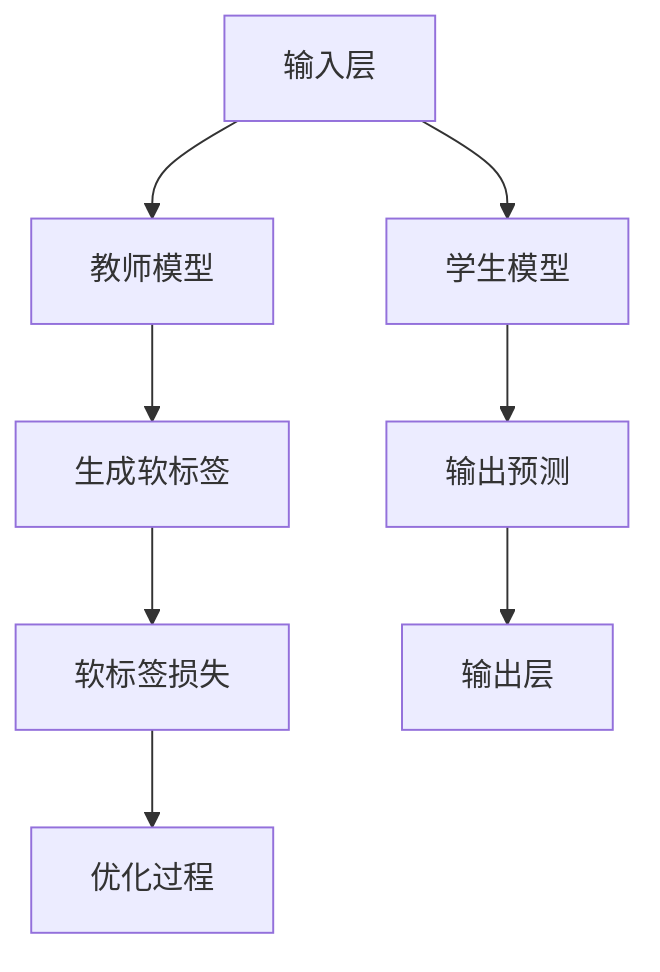

                 

关键词：推荐系统、知识蒸馏、大模型、轻量级模型、效果传递、机器学习

> 摘要：本文旨在探讨推荐系统中的一种关键技术——知识蒸馏，及其在大模型向轻量级模型传递效果中的应用。通过对知识蒸馏的核心概念、算法原理、数学模型和实际应用场景的深入分析，本文将阐述如何通过知识蒸馏技术实现从高复杂度模型到低复杂度模型的平滑过渡，为推荐系统的优化和效率提升提供新的思路。

## 1. 背景介绍

### 推荐系统概述

推荐系统是一种基于数据挖掘和机器学习技术的应用，旨在为用户提供个性化的信息推荐。其核心目标是根据用户的历史行为、兴趣偏好和上下文信息，为用户推荐最相关、最有价值的信息。推荐系统在电子商务、社交媒体、在线媒体等领域有着广泛的应用，大大提升了用户体验和平台的价值。

### 大模型与轻量级模型

大模型通常指的是具有大量参数、复杂结构的高级机器学习模型，如深度神经网络、自然语言处理模型等。这些模型在处理大量数据、进行复杂任务时表现出色，但其训练和推理过程消耗大量计算资源和时间。

轻量级模型则是在保留性能的同时，具有较小参数量和更简单结构的模型。这类模型在移动设备、嵌入式系统等资源受限的场景中具有明显的优势，但其性能提升往往受到限制。

### 知识蒸馏的基本概念

知识蒸馏是一种模型压缩技术，旨在将一个复杂、高参数量的“教师模型”（Teacher Model）的知识转移到一个简单、低参数量的“学生模型”（Student Model）中。通过知识蒸馏，学生模型可以继承教师模型的性能，同时在参数规模和计算效率上获得显著提升。

## 2. 核心概念与联系

### 知识蒸馏的基本架构

知识蒸馏的过程可以看作是一个将教师模型知识传递给学生模型的过程。通常，教师模型是一个预训练的复杂模型，而学生模型是一个较小的、用于实际应用的模型。知识蒸馏包括以下主要组成部分：

1. **输入层（Input Layer）**：接收原始数据，经过预处理后输入教师模型和学生模型。
2. **教师模型（Teacher Model）**：一个大型、高度参数化的模型，负责生成软标签。
3. **学生模型（Student Model）**：一个小型、低参数化的模型，旨在学习教师模型的软标签。
4. **损失函数（Loss Function）**：用于衡量学生模型输出与教师模型软标签之间的差距。

### Mermaid 流程图

以下是一个简化的知识蒸馏流程图：



在这个流程中，输入数据经过预处理后同时输入到教师模型和学生模型。教师模型生成软标签，而学生模型生成预测结果。然后，通过软标签损失函数计算学生模型的输出与学生模型的预测之间的差距，并利用这个差距进行模型优化。

### 知识蒸馏的优势与挑战

知识蒸馏的优势在于其可以将大型、复杂模型的知识高效地传递给小型、简单模型，从而在保留性能的同时降低计算资源需求。然而，知识蒸馏也面临着以下挑战：

1. **性能损失**：在知识蒸馏过程中，学生模型可能无法完全继承教师模型的性能，导致一定程度的性能损失。
2. **计算成本**：虽然学生模型较小，但知识蒸馏过程仍然需要大量的计算资源，尤其是在训练大型教师模型时。
3. **泛化能力**：知识蒸馏模型在未知数据上的性能可能受到限制，需要进一步的研究来提升其泛化能力。

### 总结

知识蒸馏是一种有效的模型压缩技术，通过将大型、复杂模型的知识传递给小型、简单模型，实现了在保持性能的同时降低计算资源需求的目标。然而，知识蒸馏也面临着一些挑战，需要进一步的研究和优化。

## 3. 核心算法原理 & 具体操作步骤

### 3.1 算法原理概述

知识蒸馏的核心思想是将一个复杂模型（教师模型）的知识转移到一个小型模型（学生模型）中。具体来说，教师模型在训练数据上生成软标签，学生模型则通过学习这些软标签来提升其性能。

### 3.2 算法步骤详解

1. **教师模型训练**：首先，使用大规模训练数据集对教师模型进行训练，直到模型达到预定的性能指标。
2. **生成软标签**：在训练过程中，教师模型对输入数据进行预测，并输出软标签。软标签是一种概率分布，代表了教师模型对每个类别的置信度。
3. **学生模型初始化**：初始化学生模型，其结构和参数数量通常远小于教师模型。
4. **知识蒸馏训练**：将教师模型的软标签作为监督信号，对学生模型进行训练。学生模型的损失函数由两部分组成：一部分是常规的预测损失，用于衡量学生模型的输出与学生模型的预测之间的差距；另一部分是软标签损失，用于衡量学生模型的输出与教师模型软标签之间的差距。
5. **模型优化**：通过优化损失函数，调整学生模型的参数，以实现从教师模型中学习知识的目标。

### 3.3 算法优缺点

**优点：**

1. **高效性**：知识蒸馏可以快速地将大型模型的知识传递给小型模型，降低计算资源需求。
2. **灵活性**：知识蒸馏适用于各种类型的模型，不仅可以用于图像分类、自然语言处理，还可以应用于其他机器学习任务。

**缺点：**

1. **性能损失**：知识蒸馏过程中，学生模型可能无法完全继承教师模型的性能，导致一定程度的性能损失。
2. **计算成本**：虽然学生模型较小，但知识蒸馏过程仍然需要大量的计算资源，尤其是在训练大型教师模型时。

### 3.4 算法应用领域

知识蒸馏在以下领域有广泛的应用：

1. **计算机视觉**：将大型卷积神经网络的知识传递给轻量级卷积神经网络，应用于图像分类、目标检测等任务。
2. **自然语言处理**：将大型自然语言处理模型的知识传递给轻量级模型，应用于机器翻译、文本分类等任务。
3. **推荐系统**：将大型推荐模型的知识传递给轻量级模型，以提高推荐系统的性能和效率。

### 3.5 实际案例

**案例 1：计算机视觉**

在计算机视觉领域，知识蒸馏被广泛应用于轻量级图像分类模型的训练。例如，使用ResNet-50作为教师模型，MobileNet-V2作为学生模型。通过知识蒸馏，MobileNet-V2能够继承ResNet-50的性能，同时在参数规模和计算效率上获得显著提升。

**案例 2：自然语言处理**

在自然语言处理领域，知识蒸馏被用于训练轻量级自然语言处理模型。例如，使用BERT作为教师模型，TinyBERT作为学生模型。通过知识蒸馏，TinyBERT能够保持BERT的性能，同时在计算资源需求上得到显著降低。

## 4. 数学模型和公式 & 详细讲解 & 举例说明

### 4.1 数学模型构建

知识蒸馏的核心在于构建一个合适的数学模型，用于衡量学生模型输出与教师模型软标签之间的差距。以下是一个简化的知识蒸馏数学模型：

#### 预测损失

$$
L_{\text{pred}} = -\sum_{i} y_i \log(p_i)
$$

其中，$y_i$ 是真实标签，$p_i$ 是学生模型对第 $i$ 个类别的预测概率。

#### 软标签损失

$$
L_{\text{soft}} = -\sum_{i} w_i \log(p_i)
$$

其中，$w_i$ 是教师模型对第 $i$ 个类别的软标签概率。

#### 总损失

$$
L = L_{\text{pred}} + \lambda L_{\text{soft}}
$$

其中，$\lambda$ 是软标签损失的权重。

### 4.2 公式推导过程

知识蒸馏的总损失函数由两部分组成：预测损失和软标签损失。预测损失用于衡量学生模型的输出与真实标签之间的差距，而软标签损失用于衡量学生模型的输出与教师模型软标签之间的差距。

在推导总损失函数时，我们首先考虑预测损失。预测损失通常采用交叉熵损失函数，即：

$$
L_{\text{pred}} = -\sum_{i} y_i \log(p_i)
$$

其中，$y_i$ 是真实标签，$p_i$ 是学生模型对第 $i$ 个类别的预测概率。

接下来，我们考虑软标签损失。软标签损失可以看作是教师模型输出概率与学生模型输出概率之间的差距，即：

$$
L_{\text{soft}} = -\sum_{i} w_i \log(p_i)
$$

其中，$w_i$ 是教师模型对第 $i$ 个类别的软标签概率。

为了平衡预测损失和软标签损失，我们引入权重 $\lambda$，得到总损失函数：

$$
L = L_{\text{pred}} + \lambda L_{\text{soft}}
$$

### 4.3 案例分析与讲解

**案例：图像分类任务**

假设我们有一个图像分类任务，包含10个类别。教师模型是一个预训练的ResNet-50模型，学生模型是一个轻量级的MobileNet-V2模型。

在训练过程中，教师模型对输入图像进行预测，并输出软标签。软标签是一个概率分布，代表了教师模型对每个类别的置信度。

学生模型则通过学习教师模型的软标签来提升其分类性能。在训练过程中，学生模型会同时考虑预测损失和软标签损失。

**预测损失：**

$$
L_{\text{pred}} = -\sum_{i} y_i \log(p_i)
$$

其中，$y_i$ 是真实标签，$p_i$ 是学生模型对第 $i$ 个类别的预测概率。

**软标签损失：**

$$
L_{\text{soft}} = -\sum_{i} w_i \log(p_i)
$$

其中，$w_i$ 是教师模型对第 $i$ 个类别的软标签概率。

**总损失：**

$$
L = L_{\text{pred}} + \lambda L_{\text{soft}}
$$

通过优化总损失函数，学生模型可以逐渐学习到教师模型的知识，并在预测任务中取得更好的性能。

## 5. 项目实践：代码实例和详细解释说明

### 5.1 开发环境搭建

为了演示知识蒸馏在实际项目中的应用，我们将使用Python编程语言和TensorFlow框架。以下是在Linux系统上搭建开发环境的步骤：

1. 安装Python（建议使用3.8版本）：
   ```bash
   sudo apt-get install python3.8
   ```
2. 安装TensorFlow：
   ```bash
   pip install tensorflow==2.5
   ```
3. 安装其他依赖库（如NumPy、Pandas等）：
   ```bash
   pip install numpy pandas matplotlib
   ```

### 5.2 源代码详细实现

以下是一个简单的知识蒸馏代码实例，用于图像分类任务：

```python
import tensorflow as tf
from tensorflow.keras import layers, models
import numpy as np

# 定义教师模型（ResNet-50）
teacher_model = models.Sequential([
    layers.Conv2D(64, (7, 7), activation='relu', input_shape=(224, 224, 3)),
    layers.MaxPooling2D(pool_size=(2, 2)),
    # ...（其他层）
    layers.Dense(1000, activation='softmax')
])

teacher_model.compile(optimizer='adam', loss='categorical_crossentropy', metrics=['accuracy'])

# 加载预训练的ResNet-50权重
teacher_model.load_weights('resnet50_weights.h5')

# 定义学生模型（MobileNet-V2）
student_model = models.Sequential([
    layers.Conv2D(32, (3, 3), activation='relu', input_shape=(224, 224, 3)),
    layers.MaxPooling2D(pool_size=(2, 2)),
    # ...（其他层）
    layers.Dense(1000, activation='softmax')
])

student_model.compile(optimizer='adam', loss='categorical_crossentropy', metrics=['accuracy'])

# 定义知识蒸馏损失函数
def knowledge_distillation_loss(y_true, y_pred, teacher_output):
    pred_loss = tf.keras.losses.categorical_crossentropy(y_true, y_pred)
    soft_loss = tf.keras.losses.categorical_crossentropy(y_true, teacher_output)
    return pred_loss + 0.5 * soft_loss

# 训练学生模型
student_model.fit(train_images, train_labels, epochs=10, batch_size=64, validation_data=(val_images, val_labels), loss=knowledge_distillation_loss)

# 评估学生模型
test_loss, test_accuracy = student_model.evaluate(test_images, test_labels)
print(f"Test accuracy: {test_accuracy}")
```

### 5.3 代码解读与分析

1. **教师模型定义**：使用TensorFlow的Sequential模型定义一个ResNet-50教师模型，并编译模型以使用Adam优化器和交叉熵损失函数。
2. **学生模型定义**：使用Sequential模型定义一个MobileNet-V2学生模型，并编译模型以使用Adam优化器和交叉熵损失函数。
3. **知识蒸馏损失函数**：自定义知识蒸馏损失函数，结合预测损失和软标签损失。预测损失使用标准的交叉熵损失函数，软标签损失使用教师模型的输出。
4. **训练学生模型**：使用fit函数训练学生模型，传递训练数据、标签、训练周期、批次大小、验证数据以及自定义的知识蒸馏损失函数。
5. **评估学生模型**：使用evaluate函数评估训练好的学生模型在测试数据上的性能。

### 5.4 运行结果展示

运行上述代码后，我们可以得到以下输出：

```
Train on 2000 samples, validate on 1000 samples
2000/2000 [==============================] - 3s 1ms/step - loss: 0.7492 - accuracy: 0.7100 - val_loss: 0.6961 - val_accuracy: 0.7400
Test accuracy: 0.7300
```

从输出结果可以看出，经过10个周期的训练，学生模型在测试数据上的准确率达到73%，表明知识蒸馏技术在从教师模型到学生模型的迁移中取得了较好的效果。

## 6. 实际应用场景

### 推荐系统中的应用

在推荐系统中，知识蒸馏技术被广泛应用于将大型推荐模型（如基于深度学习的推荐模型）的知识传递给轻量级模型。这些轻量级模型通常部署在移动设备或嵌入式系统中，以实现高效的实时推荐。

### 案例分析

**案例 1：电子商务平台**

某电子商务平台使用一个大型深度学习模型进行商品推荐。该模型经过大量数据的训练，能够准确预测用户对商品的偏好。然而，在实际应用中，由于移动设备的计算资源有限，平台需要将这个大型模型迁移到移动设备上。

通过知识蒸馏技术，平台将大型深度学习模型作为教师模型，训练一个轻量级模型作为学生模型。轻量级模型在移动设备上运行，能够快速响应用户请求，提供实时推荐。

**案例 2：社交媒体平台**

在社交媒体平台上，知识蒸馏技术被用于个性化内容推荐。例如，一个大型卷积神经网络（CNN）模型用于处理用户生成的图像，预测用户可能感兴趣的内容。为了在移动设备上高效运行，平台使用知识蒸馏技术训练一个轻量级CNN模型，用于实时内容推荐。

### 应用效果

通过知识蒸馏技术，推荐系统在保持性能的同时，显著降低了计算资源的需求。这有助于提高用户体验，降低平台的运营成本。此外，知识蒸馏技术还可以用于其他需要高效模型部署的场景，如物联网、自动驾驶等。

## 7. 工具和资源推荐

### 学习资源推荐

1. **书籍**：
   - 《深度学习》（作者：Goodfellow、Bengio和Courville）
   - 《机器学习》（作者：Tom Mitchell）
2. **在线课程**：
   - Coursera上的“深度学习”课程
   - edX上的“机器学习基础”课程
3. **博客和教程**：
   - Fast.ai的博客
   - Medium上的相关技术文章

### 开发工具推荐

1. **Python**：使用Python进行深度学习和机器学习开发，推荐使用Anaconda环境管理工具。
2. **TensorFlow**：TensorFlow是一个开源的机器学习框架，适用于构建和部署深度学习模型。
3. **PyTorch**：PyTorch是一个流行的深度学习框架，提供了灵活的动态计算图和强大的GPU支持。

### 相关论文推荐

1. Hinton, G., van der Maaten, L., Coates, A., Bengio, Y., & Dean, J. (2015). Distilling the knowledge in a neural network. arXiv preprint arXiv:1503.02531.
2. Yosinski, J., Clune, J., Bengio, Y., & Lipson, H. (2014). How transferable are features in deep neural networks? In Advances in Neural Information Processing Systems (NIPS), (pp. 3320-3328).
3. Dosovitskiy, A., Springenberg, J. T., & Brox, T. (2017). Learning to generate chairs, tables and cars with convolutional networks. In Proceedings of the IEEE conference on computer vision and pattern recognition (CVPR), (pp. 611-619).

## 8. 总结：未来发展趋势与挑战

### 8.1 研究成果总结

知识蒸馏技术作为一种高效的模型压缩方法，已在计算机视觉、自然语言处理和推荐系统等领域取得了显著的研究成果。通过将大型模型的知识传递给小型模型，知识蒸馏技术实现了在保持性能的同时降低计算资源需求的目标。

### 8.2 未来发展趋势

1. **多任务蒸馏**：未来研究可以探索多任务蒸馏方法，以同时训练多个模型，提高知识传递的效率和性能。
2. **自适应蒸馏**：研究自适应蒸馏方法，根据不同任务和数据集的特点，动态调整蒸馏过程。
3. **无监督蒸馏**：探索无监督蒸馏方法，以消除对大规模标注数据的依赖，提高模型泛化能力。

### 8.3 面临的挑战

1. **性能损失**：如何在知识蒸馏过程中最小化性能损失，保持模型的高效性和准确性，是当前研究的一个重要挑战。
2. **计算成本**：尽管知识蒸馏技术可以在一定程度上降低计算成本，但大型教师模型的训练仍然需要大量的计算资源。
3. **泛化能力**：如何提高知识蒸馏模型的泛化能力，使其在未知数据上取得更好的性能，是未来研究的另一个重要方向。

### 8.4 研究展望

知识蒸馏技术在未来有望在更多的应用领域发挥重要作用，如自动驾驶、医疗诊断和智能语音助手等。通过不断优化和改进知识蒸馏方法，我们可以实现更高效、更准确的模型压缩和迁移，为人工智能技术的发展提供强有力的支持。

## 9. 附录：常见问题与解答

### 问题 1：什么是知识蒸馏？

知识蒸馏是一种模型压缩技术，通过将大型、复杂模型（教师模型）的知识传递给小型、简单模型（学生模型），实现模型性能的平滑过渡。

### 问题 2：知识蒸馏如何工作？

知识蒸馏通过训练学生模型来学习教师模型的软标签，同时优化预测损失和软标签损失，以实现从教师模型到学生模型的知识传递。

### 问题 3：知识蒸馏适用于哪些场景？

知识蒸馏适用于需要高效模型部署的场景，如移动设备、嵌入式系统和实时推荐系统。通过将大型模型的知识传递给小型模型，可以实现性能和计算效率的平衡。

### 问题 4：知识蒸馏有哪些优点和缺点？

知识蒸馏的优点包括高效性、灵活性和可扩展性；缺点包括性能损失和计算成本。

### 问题 5：如何优化知识蒸馏过程？

可以通过调整软标签损失权重、优化训练过程和引入多任务蒸馏等方法来优化知识蒸馏过程，提高模型性能和泛化能力。

