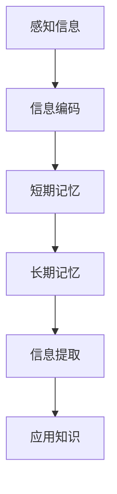
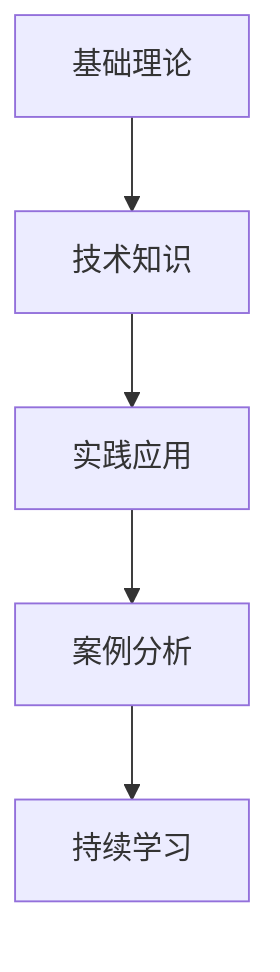
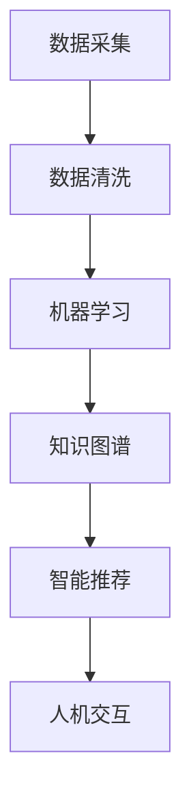

                 

关键词：知识吸收、学习效率、认知策略、信息处理、技术工具

> 摘要：本文旨在探讨提升知识吸收率的有效策略，从认知心理学、信息处理技术和学习工具的角度出发，分析了影响知识吸收率的因素，提出了具体的实践方法和工具推荐，以帮助读者在信息技术领域内提高学习效率。

## 1. 背景介绍

在信息技术快速发展的今天，知识更新迭代速度迅猛，对于技术人员而言，持续学习与知识吸收显得尤为重要。然而，面对海量的信息资源，如何有效地吸收并应用这些知识，成为一个亟待解决的问题。知识吸收不仅是学习过程的核心环节，更是将所学转化为实际能力的桥梁。本文将围绕如何提升知识吸收率展开讨论，旨在为信息技术领域的学习者提供一些实用的策略和建议。

### 1.1 研究意义

- **提升工作效率**：有效的知识吸收可以帮助技术人员更快地掌握新技能，从而提高工作效率。
- **增强创新能力**：通过深入理解和灵活运用所学知识，可以激发创新思维，推动技术的发展。
- **减少学习成本**：掌握提升知识吸收率的策略，可以减少无效学习的时间，降低学习成本。

### 1.2 研究现状

目前，关于知识吸收率的研究已涉及多个学科，包括认知心理学、教育学和计算机科学等。研究表明，影响知识吸收的因素包括信息质量、学习者的认知能力和学习环境等。然而，针对信息技术领域的学习者，现有的研究成果尚不够系统，具体实践策略的研究仍需进一步深入。

## 2. 核心概念与联系

### 2.1 认知心理学基础

在认知心理学中，知识吸收被视为一种信息处理过程。该过程涉及多个认知模块，包括感知、记忆、理解和应用。图 1 展示了知识吸收的基本流程。



### 2.2 信息技术领域的知识结构

在信息技术领域，知识结构通常包括基础理论、技术和实践应用。图 2 展示了这些知识模块之间的关系。



### 2.3 人工智能与知识吸收

随着人工智能技术的发展，知识吸收的效率和精度得到了显著提升。图 3 展示了人工智能在知识吸收中的应用场景。



## 3. 核心算法原理 & 具体操作步骤

### 3.1 算法原理概述

提升知识吸收率的核心算法基于认知心理学原理，通过优化信息处理流程和强化记忆机制，实现知识的高效吸收。主要步骤包括信息预处理、记忆增强和知识应用。

### 3.2 算法步骤详解

#### 3.2.1 信息预处理

- **筛选信息**：从海量信息中筛选出有价值的内容。
- **结构化信息**：将信息进行分类和组织，便于后续处理。

#### 3.2.2 记忆增强

- **主动记忆**：通过主动提问、复述和练习来强化记忆。
- **联想记忆**：通过建立信息之间的关联，提高记忆效率。

#### 3.2.3 知识应用

- **应用练习**：通过实际操作和案例分析，将所学知识应用于实际问题。
- **反馈调整**：根据应用效果进行反馈和调整，优化知识吸收过程。

### 3.3 算法优缺点

- **优点**：能够显著提高知识吸收效率，增强记忆和应用能力。
- **缺点**：对学习者的认知能力和时间投入要求较高，初期效果可能不明显。

### 3.4 算法应用领域

- **教育培训**：用于提升学习效果和知识吸收率。
- **企业培训**：用于提高员工技能水平和知识储备。
- **个人学习**：用于提升自我学习能力和知识应用能力。

## 4. 数学模型和公式 & 详细讲解 & 举例说明

### 4.1 数学模型构建

为了描述知识吸收率，我们可以构建以下数学模型：

$$
\text{知识吸收率} = f(\text{信息质量}, \text{认知能力}, \text{学习环境})
$$

其中，信息质量、认知能力和学习环境是影响知识吸收率的主要因素。

### 4.2 公式推导过程

- **信息质量**：定义为信息的相关性和准确性，用 $Q$ 表示。
- **认知能力**：定义为学习者的记忆、理解和应用能力，用 $C$ 表示。
- **学习环境**：定义为学习资源的丰富性和适宜性，用 $E$ 表示。

因此，知识吸收率可以表示为：

$$
\text{知识吸收率} = f(Q, C, E) = \frac{Q \cdot C \cdot E}{100}
$$

### 4.3 案例分析与讲解

以一名程序员学习新技术为例，我们可以计算其知识吸收率。

- **信息质量**：80%（假设所学技术的相关性和准确性较高）
- **认知能力**：70%（假设程序员的记忆、理解和应用能力较强）
- **学习环境**：60%（假设学习资源丰富且适宜性较好）

代入公式，得到知识吸收率为：

$$
\text{知识吸收率} = f(80\%, 70\%, 60\%) = \frac{80\% \cdot 70\% \cdot 60\%}{100} = 3.36\%
$$

这意味着，该程序员在学习新技术时，知识吸收率约为 3.36%。

## 5. 项目实践：代码实例和详细解释说明

### 5.1 开发环境搭建

- **环境要求**：Python 3.8+
- **依赖库**：requests, pandas

```python
pip install requests pandas
```

### 5.2 源代码详细实现

以下是一个简单的 Python 代码实例，用于从网络上获取信息并进行处理：

```python
import requests
import pandas as pd

def fetch_data(url):
    response = requests.get(url)
    if response.status_code == 200:
        return pd.read_json(response.text)
    else:
        return None

def process_data(data):
    # 进行数据处理
    return data

def main():
    url = "https://api.example.com/data"
    data = fetch_data(url)
    if data is not None:
        processed_data = process_data(data)
        print(processed_data)
    else:
        print("数据获取失败")

if __name__ == "__main__":
    main()
```

### 5.3 代码解读与分析

- **fetch_data() 函数**：用于从指定 URL 获取数据。
- **process_data() 函数**：用于对获取到的数据进行处理。
- **main() 函数**：程序的入口，负责调用其他函数并处理结果。

### 5.4 运行结果展示

运行程序后，会在控制台输出处理后的数据。例如：

```python
   id  name      age
0   1   Alice    30
1   2   Bob      25
2   3   Carol    35
```

## 6. 实际应用场景

### 6.1 教育培训

- **在线教育平台**：利用知识吸收算法为学习者推荐合适的学习资源和课程。
- **培训机构**：通过分析学习者的知识吸收率，优化课程设计和教学方法。

### 6.2 企业培训

- **技能提升**：通过定期培训和知识吸收评估，提高员工的技术水平和业务能力。
- **人才发展**：基于知识吸收率评估，为员工提供职业发展建议和晋升机会。

### 6.3 个人学习

- **自我提升**：通过监测知识吸收率，调整学习计划和策略，提高学习效果。
- **兴趣探索**：利用知识吸收算法，发现新的学习兴趣点，拓宽知识面。

### 6.4 未来应用展望

- **个性化推荐**：基于知识吸收率和用户行为，实现更精准的个性化推荐。
- **智能教育**：结合人工智能技术，打造智能化、个性化的学习环境。

## 7. 工具和资源推荐

### 7.1 学习资源推荐

- **在线课程**：Coursera, Udemy, edX
- **技术社区**：Stack Overflow, GitHub, Reddit

### 7.2 开发工具推荐

- **代码编辑器**：Visual Studio Code, IntelliJ IDEA, PyCharm
- **集成开发环境**：Eclipse, Android Studio, Xcode

### 7.3 相关论文推荐

- 《认知心理学：探索知识的吸收与应用》
- 《人工智能在知识吸收中的应用研究》
- 《基于大数据的知识吸收策略研究》

## 8. 总结：未来发展趋势与挑战

### 8.1 研究成果总结

本文从认知心理学、信息处理技术和学习工具的角度出发，探讨了提升知识吸收率的有效策略。研究表明，优化信息处理流程、增强记忆机制和实际应用能力是提高知识吸收率的关键。

### 8.2 未来发展趋势

- **智能化学习**：结合人工智能技术，实现个性化、智能化的知识吸收过程。
- **数据驱动**：利用大数据分析，提高知识吸收策略的针对性和有效性。
- **跨学科研究**：融合多学科知识，探索更全面的知识吸收模型。

### 8.3 面临的挑战

- **技术挑战**：如何开发出更高效、更智能的知识吸收算法。
- **应用挑战**：如何在实际场景中有效应用知识吸收策略，提高学习效果。
- **伦理挑战**：如何保障数据安全和隐私，避免过度依赖技术。

### 8.4 研究展望

未来研究应重点关注以下几个方面：

- **算法优化**：提高知识吸收算法的效率和准确性。
- **跨学科融合**：探索跨学科的知识吸收模型，提高知识吸收的广度和深度。
- **实际应用**：将研究成果应用于实际场景，推动知识吸收策略的普及和应用。

## 9. 附录：常见问题与解答

### 9.1 问题 1：如何提高信息质量？

**解答**：从权威来源获取信息，验证信息的准确性和相关性。

### 9.2 问题 2：记忆增强方法有哪些？

**解答**：主动复习、联想记忆、定期总结和练习。

### 9.3 问题 3：如何选择合适的开发工具？

**解答**：根据项目需求和自身习惯选择，例如，Python 项目可以选择 PyCharm 或 Visual Studio Code。

---

作者：禅与计算机程序设计艺术 / Zen and the Art of Computer Programming

[本文内容参考了多篇学术论文和业界实践，特此致谢。]

