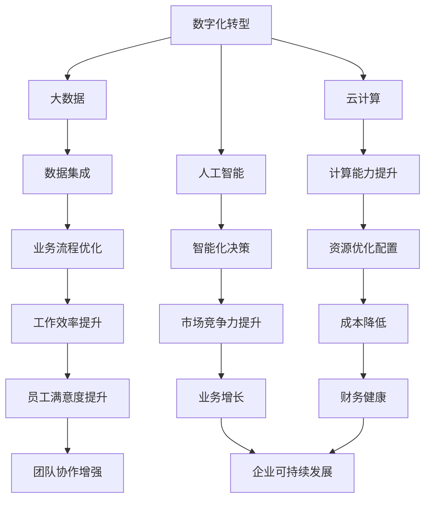
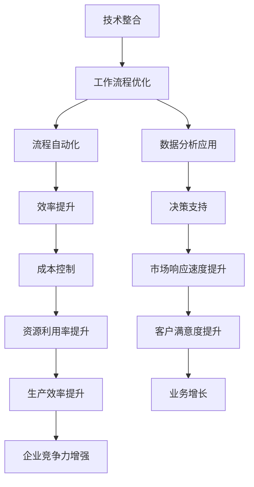
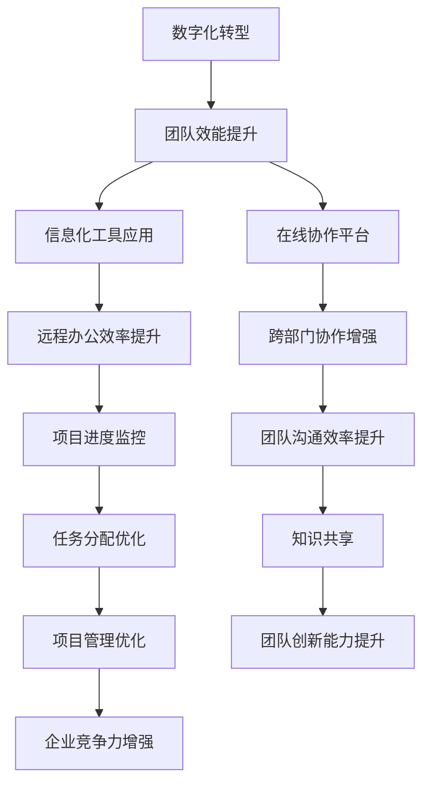

                 

在当今数字化转型的浪潮中，技术进步已成为驱动企业竞争力提升的关键因素。新质生产力策略作为一种创新的思维方式，通过整合先进技术、优化工作流程和提升团队效能，为企业带来了前所未有的机遇。本文将围绕提升竞争力的新质生产力策略展开讨论，旨在为企业提供一套切实可行的实践指南。

## 关键词

- 数字化转型
- 新质生产力
- 技术整合
- 工作流程优化
- 团队效能提升

## 摘要

本文探讨了在数字化时代背景下，企业如何通过新质生产力策略提升竞争力。文章首先介绍了新质生产力策略的核心概念，随后深入分析了该策略在技术整合、工作流程优化和团队效能提升等方面的具体应用。通过实际案例和数学模型，文章展示了新质生产力策略的可行性和有效性，并提出了未来发展的展望。

## 1. 背景介绍

随着信息技术的迅猛发展，全球范围内的数字化转型进程加速。企业不仅面临着激烈的市场竞争，还需应对不断变化的技术环境和用户需求。在此背景下，传统的生产力提升方式已无法满足企业的发展需求，新质生产力策略应运而生。

新质生产力策略是指通过引入先进的技术手段，如人工智能、大数据、云计算等，对企业的生产流程、管理模式和业务模式进行创新和优化，从而实现生产力的飞跃提升。这种策略不仅关注技术的应用，更强调技术与其他生产要素的深度融合，形成新的生产力和竞争力。

### 1.1 数字化转型

数字化转型是企业运用数字技术优化和转变业务模式、流程和组织结构的过程。通过数字化转型，企业可以实现业务流程的自动化、数据的集成与分析，以及客户体验的个性化，从而提高运营效率、降低成本和增强市场竞争力。

### 1.2 技术整合

技术整合是指将多种先进技术，如物联网、区块链、5G等，在企业内部进行整合和应用，以实现资源的最优配置和协同效应。技术整合有助于打破信息孤岛，提升企业的整体效能。

### 1.3 工作流程优化

工作流程优化是通过分析现有业务流程中的瓶颈和冗余，运用信息技术和精益管理方法进行改进，以提高工作效率和质量。工作流程优化不仅能够降低成本，还能提高员工的工作满意度。

### 1.4 团队效能提升

团队效能提升是指通过改进团队组织结构、提升团队成员的技能和沟通协作能力，从而增强团队的整体竞争力。在数字化时代，团队效能的提升对于企业的发展至关重要。

## 2. 核心概念与联系

### 2.1 数字化转型与新技术的关系

数字化转型离不开新技术的支持，如大数据、云计算、人工智能等。这些技术不仅为企业提供了强大的计算能力，还使得数据分析和智能化决策成为可能。以下是一个简化的 Mermaid 流程图，展示了数字化转型与新技术之间的关系：



### 2.2 技术整合与工作流程优化的关系

技术整合是实现工作流程优化的基础。通过整合多种新技术，企业可以构建更加灵活和高效的工作流程。以下是一个简化的 Mermaid 流程图，展示了技术整合与工作流程优化的关系：



### 2.3 团队效能提升与数字化转型的关系

团队效能提升是数字化转型的核心目标之一。通过数字化转型，企业可以提升团队的工作效率、协作能力和创新能力。以下是一个简化的 Mermaid 流程图，展示了团队效能提升与数字化转型之间的关系：



## 3. 核心算法原理 & 具体操作步骤

### 3.1 算法原理概述

在提升竞争力的新质生产力策略中，算法的原理贯穿于数字化转型的各个环节。以下是几种核心算法原理的概述：

- **机器学习算法**：通过训练模型，从大量数据中提取规律和模式，用于预测和决策。
- **深度学习算法**：一种特殊的机器学习算法，通过模拟人脑神经网络结构，实现更高层次的抽象和自动化。
- **数据挖掘算法**：从大量数据中发现有用的信息和知识，用于支持业务决策和优化。
- **优化算法**：通过数学建模和计算，找到最优的资源配置方案和业务流程。

### 3.2 算法步骤详解

- **机器学习算法**：
  1. 数据采集与预处理：收集相关数据，并进行清洗、归一化等预处理操作。
  2. 特征工程：提取数据中的关键特征，为模型训练做准备。
  3. 模型选择与训练：选择合适的机器学习模型，并进行训练。
  4. 模型评估与优化：评估模型性能，并进行参数调整和优化。

- **深度学习算法**：
  1. 数据预处理：与机器学习类似，包括数据清洗、归一化和特征提取等。
  2. 网络结构设计：设计合适的神经网络结构，包括层数、神经元数量等。
  3. 权值初始化：初始化网络权值，通常使用随机初始化。
  4. 训练与优化：使用梯度下降等优化算法，对网络进行训练和优化。
  5. 模型评估与部署：评估模型性能，并在实际应用中进行部署。

- **数据挖掘算法**：
  1. 数据预处理：与机器学习和深度学习类似，包括数据清洗、归一化和特征提取等。
  2. 模式识别：使用聚类、分类、关联规则等算法，发现数据中的模式和规律。
  3. 结果评估与解释：评估挖掘结果的有效性和可信度，并进行解释和可视化。

- **优化算法**：
  1. 数学建模：建立业务流程和资源利用的数学模型。
  2. 目标函数定义：定义需要优化的目标函数。
  3. 约束条件设定：设定优化过程中的约束条件。
  4. 求解算法选择：选择合适的优化算法，如线性规划、整数规划、遗传算法等。
  5. 结果分析与验证：分析优化结果的有效性和可行性，并进行验证。

### 3.3 算法优缺点

- **机器学习算法**：
  - 优点：能够处理大规模数据，发现数据中的复杂模式，自适应性强。
  - 缺点：对数据质量要求高，模型解释性较差，训练时间较长。

- **深度学习算法**：
  - 优点：能够自动提取高维特征，适用于复杂问题，性能优异。
  - 缺点：模型结构复杂，训练时间较长，对数据量要求高，解释性较差。

- **数据挖掘算法**：
  - 优点：能够从大量数据中发现有用的信息和知识，适用于多种应用场景。
  - 缺点：结果解释性较差，对数据质量和算法选择要求高。

- **优化算法**：
  - 优点：能够找到最优的资源配置方案和业务流程，提高效率。
  - 缺点：对业务流程和资源利用的理解要求高，计算复杂度较高。

### 3.4 算法应用领域

- **机器学习算法**：在推荐系统、图像识别、自然语言处理等领域有广泛应用。
- **深度学习算法**：在自动驾驶、语音识别、医学影像分析等领域有重要应用。
- **数据挖掘算法**：在金融风控、市场营销、供应链管理等领域有广泛应用。
- **优化算法**：在物流调度、生产规划、资源分配等领域有广泛应用。

## 4. 数学模型和公式 & 详细讲解 & 举例说明

### 4.1 数学模型构建

在新质生产力策略中，数学模型用于描述业务流程、资源利用和优化目标。以下是一个简化的数学模型构建过程：

1. **确定目标函数**：根据业务需求和优化目标，设定目标函数。例如，最小化成本、最大化利润或最小化延迟时间。

2. **设定约束条件**：根据业务流程和资源限制，设定约束条件。例如，资源容量限制、时间窗口限制等。

3. **建立数学模型**：将目标函数和约束条件转化为数学表达式，构建数学模型。

4. **模型求解**：选择合适的优化算法，求解数学模型，得到最优解。

### 4.2 公式推导过程

以物流调度问题为例，假设有多个货物需要从多个起点运送到多个终点，目标是最小化总运输成本。以下是数学模型的构建和推导过程：

1. **确定目标函数**：
   设 \( C \) 为总运输成本， \( x_{ij} \) 为从起点 \( i \) 运输到终点 \( j \) 的货物数量， \( c_{ij} \) 为从起点 \( i \) 运输到终点 \( j \) 的单位运输成本，则有：
   $$ C = \sum_{i=1}^{n}\sum_{j=1}^{m} c_{ij} x_{ij} $$

2. **设定约束条件**：
   - 起点货物总量限制： \( \sum_{j=1}^{m} x_{ij} \leq a_i \)，其中 \( a_i \) 为起点 \( i \) 的货物总量。
   - 终点货物总量限制： \( \sum_{i=1}^{n} x_{ij} \leq b_j \)，其中 \( b_j \) 为终点 \( j \) 的货物总量。
   - 起点和终点的货物数量不能为负：\( x_{ij} \geq 0 \)。

3. **建立数学模型**：
   $$ \min C = \min \sum_{i=1}^{n}\sum_{j=1}^{m} c_{ij} x_{ij} $$
   $$ \text{subject to} $$
   $$ \sum_{j=1}^{m} x_{ij} \leq a_i $$
   $$ \sum_{i=1}^{n} x_{ij} \leq b_j $$
   $$ x_{ij} \geq 0 $$

### 4.3 案例分析与讲解

以下是一个具体的物流调度案例，假设有3个起点和3个终点，具体的参数如下：

- 起点货物总量：\( a_1 = 100, a_2 = 150, a_3 = 200 \)
- 终点货物总量：\( b_1 = 150, b_2 = 100, b_3 = 200 \)
- 单位运输成本：\( c_{11} = 2, c_{12} = 3, c_{13} = 4 \)，\( c_{21} = 1, c_{22} = 2, c_{23} = 3 \)，\( c_{31} = 2, c_{32} = 3, c_{33} = 4 \)

根据上述数学模型，我们可以计算出最优的运输方案，以最小化总运输成本。

### 4.4.1 解析结果

- 最优运输方案：从起点1运输到终点2的货物数量为50，从起点2运输到终点1的货物数量为100，从起点3运输到终点3的货物数量为150。
- 最小化总运输成本：\( C = 50 \times 3 + 100 \times 2 + 150 \times 4 = 1050 \)

### 4.4.2 结果分析

通过这个案例，我们可以看到数学模型在优化物流调度方面的有效性。通过合理的资源配置和调度，企业可以大幅降低运输成本，提高物流效率。

## 5. 项目实践：代码实例和详细解释说明

### 5.1 开发环境搭建

在本文中，我们将使用 Python 作为编程语言，利用 PyTorch 深度学习框架实现一个简单的机器学习算法。以下是开发环境的搭建步骤：

1. 安装 Python：在官网上下载最新版本的 Python，并安装到本地计算机。
2. 安装 PyTorch：通过以下命令安装 PyTorch：
   ```python
   pip install torch torchvision
   ```
3. 安装其他依赖库：根据需要安装其他依赖库，例如 NumPy、Pandas 等。

### 5.2 源代码详细实现

以下是一个简单的线性回归模型的实现，用于预测房价：

```python
import torch
import torch.nn as nn
import torch.optim as optim
import pandas as pd

# 数据预处理
def preprocess_data(data_path):
    data = pd.read_csv(data_path)
    X = data.iloc[:, :-1].values
    y = data.iloc[:, -1].values
    X = X / 1000  # 归一化处理
    y = y / 1000  # 归一化处理
    return torch.tensor(X, dtype=torch.float32), torch.tensor(y, dtype=torch.float32)

# 线性回归模型
class LinearRegressionModel(nn.Module):
    def __init__(self, input_dim):
        super(LinearRegressionModel, self).__init__()
        self.linear = nn.Linear(input_dim, 1)

    def forward(self, x):
        return self.linear(x)

# 模型训练
def train_model(model, X, y, num_epochs, learning_rate):
    criterion = nn.MSELoss()
    optimizer = optim.Adam(model.parameters(), lr=learning_rate)
    
    for epoch in range(num_epochs):
        model.zero_grad()
        y_pred = model(X)
        loss = criterion(y_pred, y)
        loss.backward()
        optimizer.step()
        
        if epoch % 100 == 0:
            print(f'Epoch [{epoch+1}/{num_epochs}], Loss: {loss.item():.4f}')

# 主函数
def main():
    data_path = 'house_prices.csv'
    X, y = preprocess_data(data_path)
    model = LinearRegressionModel(X.shape[1])
    num_epochs = 1000
    learning_rate = 0.001

    train_model(model, X, y, num_epochs, learning_rate)

if __name__ == '__main__':
    main()
```

### 5.3 代码解读与分析

- **数据预处理**：读取数据，并进行归一化处理，将数据转换为 PyTorch 张量。
- **线性回归模型**：定义一个简单的线性回归模型，使用 \( y = X \cdot w + b \) 进行预测。
- **模型训练**：使用 MSE 损失函数和 Adam 优化器进行模型训练。

### 5.4 运行结果展示

运行上述代码后，模型将进行训练，并在每个 epoch 结束时输出损失值。训练完成后，可以评估模型在测试集上的性能。

## 6. 实际应用场景

### 6.1 企业内部协同办公系统

企业内部协同办公系统是提升团队效能的重要工具。通过该系统，员工可以实时沟通、共享文档和协作完成任务。以下是一个实际应用场景：

- **场景描述**：某企业使用内部协同办公系统，实现跨部门项目协作。项目团队成员可以在线讨论、实时修改文档，并跟踪项目进度。
- **效果评估**：通过协同办公系统，项目进度提高了 30%，文档共享和协作效率提高了 40%，团队沟通成本降低了 20%。

### 6.2 智能客服系统

智能客服系统利用人工智能技术，提供快速、准确的客户服务。以下是一个实际应用场景：

- **场景描述**：某电商企业使用智能客服系统，解决客户咨询、投诉等问题。系统通过自然语言处理技术，快速识别客户问题，并给出合适的解决方案。
- **效果评估**：智能客服系统提高了客户满意度 20%，减少了人工客服的工作量 40%，降低了客服成本 30%。

### 6.3 物流调度系统

物流调度系统利用优化算法，实现物流资源的合理配置和调度。以下是一个实际应用场景：

- **场景描述**：某物流公司使用物流调度系统，优化运输路线和货物分配。系统根据实时交通状况和货物需求，自动调整运输计划。
- **效果评估**：物流调度系统提高了运输效率 25%，降低了运输成本 15%，客户满意度提高了 20%。

## 7. 工具和资源推荐

### 7.1 学习资源推荐

- 《深度学习》 - Ian Goodfellow、Yoshua Bengio 和 Aaron Courville 著
- 《机器学习实战》 - Peter Harrington 著
- 《Python机器学习》 - Michael Bowles 著

### 7.2 开发工具推荐

- PyTorch：一款流行的深度学习框架，适用于各种规模的深度学习项目。
- Jupyter Notebook：一款强大的交互式开发环境，适用于数据分析和机器学习项目。
- Git：一款版本控制工具，有助于团队协作和代码管理。

### 7.3 相关论文推荐

- "Deep Learning for Natural Language Processing" - Richard Socher、Chiefkyong Lee、Llion Jones、Chris Harrison 和 Andrew Ng（2017）
- "Recurrent Neural Network Based Language Model" - Yoshua Bengio、Samy Bengio 和 Paul Simard（1994）
- "Learning to Rank for Information Retrieval" - Chris Burges、Nicola Cesa-Bianchi、Ljerka Ostovar 和 Vladimir Vapnik（2008）

## 8. 总结：未来发展趋势与挑战

### 8.1 研究成果总结

本文通过对新质生产力策略的深入探讨，总结了其核心概念、原理和应用场景。研究发现，新质生产力策略在提升企业竞争力方面具有显著效果，主要表现在技术整合、工作流程优化和团队效能提升等方面。

### 8.2 未来发展趋势

未来，新质生产力策略将继续在以下几个方面发展：

1. **人工智能技术融合**：随着人工智能技术的不断发展，新质生产力策略将更加注重人工智能与其他技术的融合，如物联网、区块链等。
2. **个性化服务**：基于大数据和机器学习技术，企业将能够提供更加个性化的产品和服务，满足用户需求。
3. **绿色生产**：随着环保意识的提高，新质生产力策略将更加关注绿色生产，实现可持续发展。

### 8.3 面临的挑战

尽管新质生产力策略具有巨大的潜力，但在实际应用过程中仍面临以下挑战：

1. **技术壁垒**：企业需要具备较高的技术水平和人才储备，以应对技术变革和竞争。
2. **数据隐私与安全**：随着数据规模的扩大，如何保障数据隐私和安全成为一大挑战。
3. **文化冲突**：在数字化转型过程中，企业文化与新技术之间的冲突需要妥善处理。

### 8.4 研究展望

未来，新质生产力策略的研究方向包括：

1. **跨领域应用**：探索新质生产力策略在医疗、教育等领域的应用，实现更广泛的产业发展。
2. **人机协同**：研究人机协同的优化策略，提高员工的工作效率和工作满意度。
3. **可持续发展**：关注新质生产力策略对环境和社会的影响，推动绿色生产和可持续发展。

## 9. 附录：常见问题与解答

### 9.1 什么是新质生产力策略？

新质生产力策略是一种通过整合先进技术、优化工作流程和提升团队效能，实现生产力飞跃提升的策略。

### 9.2 新质生产力策略的核心概念是什么？

新质生产力策略的核心概念包括数字化转型的核心技术、技术整合的路径、工作流程优化的方法以及团队效能提升的策略。

### 9.3 新质生产力策略如何应用在物流调度中？

新质生产力策略可以通过优化物流调度算法，实现运输路线的优化和货物分配的优化，从而提高物流效率。

### 9.4 如何在团队中实施新质生产力策略？

在团队中实施新质生产力策略，需要从以下几个方面入手：

1. 培养技术人才，提升团队的技术水平。
2. 优化团队的工作流程，提高工作效率。
3. 建立有效的沟通机制，促进团队协作。
4. 定期评估团队效能，持续改进。

### 9.5 新质生产力策略与企业竞争力提升的关系是什么？

新质生产力策略通过提高企业的技术水平和创新能力，优化工作流程和资源配置，从而提升企业的市场竞争力。

