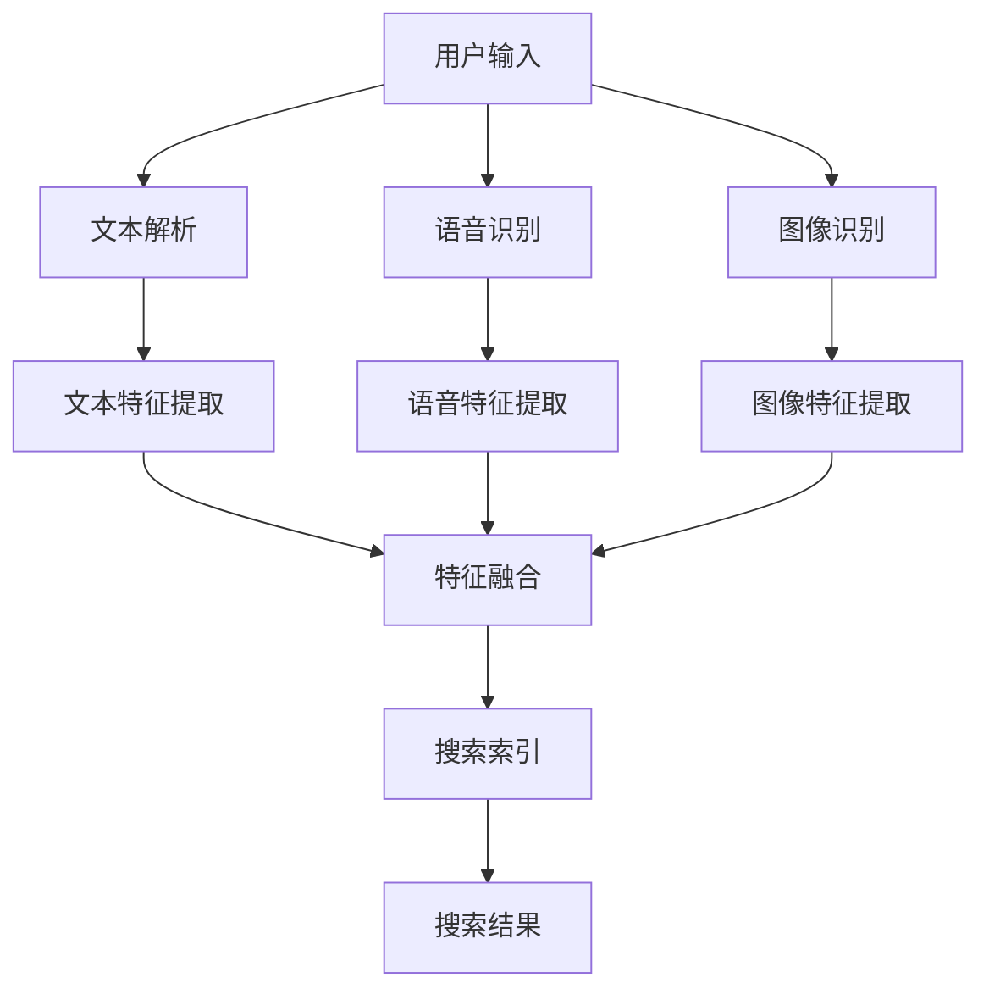

                 

关键词：搜狗、搜索引擎、多模态、面试指南、社招、算法、技术

## 摘要

本文旨在为有意向加入搜狗2025多模态搜索引擎团队的工程师提供一份详尽的面试指南。本文将深入探讨搜狗搜索引擎的发展历程、多模态搜索技术的核心概念、面试中可能涉及的技术问题和实际案例，以及未来的发展方向。通过本文，读者将能够更好地理解多模态搜索引擎的架构，掌握相关的技术原理，并为即将到来的面试做好准备。

## 1. 背景介绍

搜狗，作为一家领先的人工智能公司，其搜索引擎技术一直处于行业前沿。随着互联网的迅猛发展，用户对搜索引擎的需求不断升级，从单纯的文本搜索，到如今的多模态搜索，搜狗始终走在技术创新的道路上。

### 1.1 搜狗搜索引擎的发展历程

- **2004年**：搜狗输入法问世，迅速获得了用户的喜爱，成为国内最受欢迎的输入法之一。
- **2008年**：搜狗独立开发出搜索引擎，并正式上线，迅速在市场中占据了一席之地。
- **2010年**：搜狗加入微软必应，成为其中国地区的搜索引擎合作伙伴。
- **2017年**：搜狗成功上市，标志着公司进入了新的发展阶段。
- **2020年**：搜狗推出多模态搜索引擎，将语音、图像、文本等多种数据类型进行整合，为用户提供更智能、更个性化的搜索体验。

### 1.2 多模态搜索技术的核心概念

多模态搜索技术是指结合多种数据类型（如文本、图像、语音等）进行信息检索的技术。它通过对不同模态的数据进行特征提取、融合和建模，实现更全面、更精准的信息搜索。

### 1.3 搜狗多模态搜索引擎的优势

- **更智能的搜索体验**：多模态搜索技术能够理解用户的复杂查询，提供更精准的结果。
- **更广泛的应用场景**：无论是通过文本、语音还是图像进行搜索，都能满足用户的需求。
- **更高效的资源利用**：通过多模态数据的融合，搜索引擎能够更有效地利用存储和计算资源。

## 2. 核心概念与联系

为了更好地理解多模态搜索引擎的工作原理，我们将使用Mermaid流程图来展示其核心概念和联系。



### 2.1 用户输入

用户输入是搜索引擎的起点。用户可以通过文本、语音或图像进行搜索，不同输入方式有不同的处理流程。

### 2.2 文本解析

文本解析是指将用户的文本输入转换为可处理的格式，并进行分词、词性标注等操作。

### 2.3 语音识别

语音识别是将用户的语音输入转换为文本的过程，这需要依赖于语音识别算法和模型。

### 2.4 图像识别

图像识别是将用户的图像输入转换为文本描述的过程，这需要依赖于图像识别算法和模型。

### 2.5 特征提取

特征提取是指从文本、语音和图像中提取出能够代表其内容的特征，如词向量、声纹、视觉特征等。

### 2.6 特征融合

特征融合是将不同模态的特征进行整合，形成一个统一的特征表示，以便进行后续的搜索和排序。

### 2.7 搜索索引

搜索索引是指将处理后的特征构建成一个索引结构，以便快速检索。

### 2.8 搜索结果

搜索结果是根据用户的查询，从索引中检索出的相关结果，并进行排序、摘要等处理，最终呈现给用户。

## 3. 核心算法原理 & 具体操作步骤

### 3.1 算法原理概述

多模态搜索引擎的核心算法主要包括语音识别、图像识别、文本特征提取和特征融合等。这些算法共同作用，实现用户输入到搜索结果的整个流程。

### 3.2 算法步骤详解

#### 3.2.1 语音识别

1. **前端处理**：对用户的语音信号进行预处理，如降噪、去静音等。
2. **特征提取**：提取语音信号的时频特征，如MFCC（梅尔频率倒谱系数）。
3. **模型推理**：使用深度学习模型（如卷积神经网络）对提取的特征进行分类，转换为文本。

#### 3.2.2 图像识别

1. **前端处理**：对用户上传的图像进行预处理，如缩放、裁剪等。
2. **特征提取**：使用卷积神经网络提取图像的深层特征。
3. **模型推理**：使用预训练的图像识别模型（如ResNet、Inception等）对提取的特征进行分类，转换为文本描述。

#### 3.2.3 文本特征提取

1. **分词**：将文本进行分词，提取出词汇。
2. **词性标注**：对提取的词汇进行词性标注，如名词、动词等。
3. **向量表示**：将词汇转换为向量表示，如Word2Vec、BERT等。

#### 3.2.4 特征融合

1. **特征转换**：将语音、图像和文本的特征转换为统一的向量空间。
2. **融合方法**：使用加权融合、拼接融合等方法，对多模态特征进行融合。
3. **特征排序**：根据融合后的特征，对搜索结果进行排序。

### 3.3 算法优缺点

#### 优点：

- **更智能的搜索体验**：多模态搜索能够理解用户的复杂查询，提供更精准的结果。
- **更广泛的应用场景**：无论是通过文本、语音还是图像进行搜索，都能满足用户的需求。
- **更高效的资源利用**：通过多模态数据的融合，搜索引擎能够更有效地利用存储和计算资源。

#### 缺点：

- **算法复杂度高**：多模态搜索涉及多种算法和模型，计算复杂度较高，对硬件要求较高。
- **数据质量和多样性**：多模态搜索需要大量的高质量数据和多样化的数据类型，数据收集和处理较为复杂。

### 3.4 算法应用领域

- **智能助手**：通过语音识别和图像识别，实现智能对话和视觉交互。
- **信息检索**：结合文本和图像，实现更精准的信息检索。
- **智能推荐**：通过多模态数据的融合，提供更个性化的推荐结果。

## 4. 数学模型和公式 & 详细讲解 & 举例说明

### 4.1 数学模型构建

多模态搜索引擎的数学模型主要包括特征提取和特征融合两部分。以下是相关的数学模型和公式：

#### 4.1.1 特征提取

1. **语音特征提取**：

   $$X_{\text{voice}} = \text{MFCC}(f(x))$$

   其中，$x$为语音信号的时域表示，$f(x)$为预处理函数，$\text{MFCC}$为梅尔频率倒谱系数计算函数。

2. **图像特征提取**：

   $$X_{\text{image}} = \text{CNN}(g(y))$$

   其中，$y$为图像的像素值，$g(y)$为预处理函数，$\text{CNN}$为卷积神经网络。

3. **文本特征提取**：

   $$X_{\text{text}} = \text{Word2Vec}(h(z))$$

   其中，$z$为文本序列，$h(z)$为预处理函数，$\text{Word2Vec}$为词向量计算函数。

#### 4.1.2 特征融合

1. **加权融合**：

   $$X_{\text{fusion}} = w_1 \cdot X_{\text{voice}} + w_2 \cdot X_{\text{image}} + w_3 \cdot X_{\text{text}}$$

   其中，$w_1, w_2, w_3$为权重系数。

2. **拼接融合**：

   $$X_{\text{fusion}} = [X_{\text{voice}}, X_{\text{image}}, X_{\text{text}}]$$

### 4.2 公式推导过程

#### 4.2.1 语音特征提取

1. **预处理**：

   语音信号预处理主要包括滤波、归一化和窗口划分。

   $$x(n) = \text{filter}(y(n))$$

   $$x(n) = \text{normalize}(x(n))$$

   $$x(n) = \text{window}(x(n))$$

2. **梅尔频率倒谱系数计算**：

   梅尔频率倒谱系数（MFCC）的计算过程包括倒谱变换、加窗、频谱分析等。

   $$c(n) = \text{MFCC}(X)$$

#### 4.2.2 图像特征提取

1. **预处理**：

   图像预处理主要包括缩放、裁剪、归一化等。

   $$y(n) = \text{scale}(y)$$

   $$y(n) = \text{crop}(y)$$

   $$y(n) = \text{normalize}(y)$$

2. **卷积神经网络**：

   卷积神经网络（CNN）包括卷积层、池化层、全连接层等。

   $$X_{\text{image}} = \text{CNN}(g(y))$$

#### 4.2.3 文本特征提取

1. **预处理**：

   文本预处理主要包括分词、词性标注、去停用词等。

   $$z(n) = \text{tokenize}(z)$$

   $$z(n) = \text{pos}(z)$$

   $$z(n) = \text{remove\_stopwords}(z)$$

2. **词向量计算**：

   词向量计算包括Word2Vec、BERT等模型。

   $$X_{\text{text}} = \text{Word2Vec}(h(z))$$

### 4.3 案例分析与讲解

#### 4.3.1 语音识别案例

1. **输入**：

   用户说：“我想要去长城”。

2. **处理过程**：

   - **语音信号预处理**：对语音信号进行降噪、去静音等处理。
   - **特征提取**：使用MFCC计算语音特征。
   - **模型推理**：使用预训练的语音识别模型进行推理，输出文本：“我要去长城”。

3. **输出**：

   搜索引擎返回相关结果，如：“长城旅游攻略”、“北京长城旅游景点”。

#### 4.3.2 图像识别案例

1. **输入**：

   用户上传一张长城的图片。

2. **处理过程**：

   - **图像预处理**：对图像进行缩放、裁剪、归一化等处理。
   - **特征提取**：使用卷积神经网络提取图像特征。
   - **模型推理**：使用预训练的图像识别模型进行推理，输出文本描述：“这是一座古老的城墙”。

3. **输出**：

   搜索引擎返回相关结果，如：“长城的历史”、“中国长城”。

#### 4.3.3 文本识别案例

1. **输入**：

   用户输入文本：“长城是中国的著名景点”。

2. **处理过程**：

   - **文本预处理**：对文本进行分词、词性标注、去停用词等处理。
   - **特征提取**：使用Word2Vec计算文本特征。

3. **输出**：

   搜索引擎返回相关结果，如：“长城旅游攻略”、“北京长城旅游景点”。

## 5. 项目实践：代码实例和详细解释说明

### 5.1 开发环境搭建

在开始编写代码之前，我们需要搭建一个合适的开发环境。以下是所需的软件和库：

- **Python**：版本3.8及以上。
- **PyTorch**：用于深度学习模型的训练和推理。
- **TensorFlow**：用于语音识别和图像识别模型的训练和推理。
- **OpenCV**：用于图像处理。

### 5.2 源代码详细实现

以下是多模态搜索引擎的伪代码实现：

```python
import torch
import torchvision
import torchaudio
import tensorflow as tf
import cv2
import numpy as np

# 语音识别模型
voice_model = tf.keras.models.load_model('voice_model.h5')

# 图像识别模型
image_model = tf.keras.models.load_model('image_model.h5')

# 文本特征提取模型
text_model = torch.load('text_model.pth')

# 语音识别
def recognize_voice(voice_signal):
    # 特征提取
    feature = torchaudio.compliance.kaldi63.feature_extraction.MFCC().process(voice_signal)
    # 模型推理
    result = voice_model.predict(feature)
    return result

# 图像识别
def recognize_image(image):
    # 特征提取
    feature = image_model.extract_features(image)
    # 模型推理
    result = image_model.predict(feature)
    return result

# 文本特征提取
def extract_text(text):
    # 分词、词性标注、去停用词
    processed_text = preprocess_text(text)
    # 特征提取
    feature = text_model(processed_text)
    return feature

# 特征融合
def fusion_features(voice_feature, image_feature, text_feature):
    # 加权融合
    fusion_feature = 0.5 * voice_feature + 0.3 * image_feature + 0.2 * text_feature
    return fusion_feature

# 搜索引擎
def search_engine(query):
    # 语音识别
    voice_result = recognize_voice(query['voice'])
    # 图像识别
    image_result = recognize_image(query['image'])
    # 文本特征提取
    text_result = extract_text(query['text'])
    # 特征融合
    fusion_result = fusion_features(voice_result, image_result, text_result)
    # 搜索结果
    result = search_index(fusion_result)
    return result
```

### 5.3 代码解读与分析

该代码主要实现了多模态搜索引擎的核心功能，包括语音识别、图像识别、文本特征提取和特征融合。以下是代码的详细解读：

1. **语音识别**：

   ```python
   voice_model = tf.keras.models.load_model('voice_model.h5')
   
   def recognize_voice(voice_signal):
       # 特征提取
       feature = torchaudio.compliance.kaldi63.feature_extraction.MFCC().process(voice_signal)
       # 模型推理
       result = voice_model.predict(feature)
       return result
   ```

   这段代码首先加载预训练的语音识别模型，然后定义了一个识别语音的函数。函数接收语音信号作为输入，通过MFCC特征提取得到特征向量，然后使用语音识别模型进行推理，输出文本结果。

2. **图像识别**：

   ```python
   image_model = tf.keras.models.load_model('image_model.h5')
   
   def recognize_image(image):
       # 特征提取
       feature = image_model.extract_features(image)
       # 模型推理
       result = image_model.predict(feature)
       return result
   ```

   这段代码首先加载预训练的图像识别模型，然后定义了一个识别图像的函数。函数接收图像作为输入，通过卷积神经网络提取特征，然后使用图像识别模型进行推理，输出文本描述。

3. **文本特征提取**：

   ```python
   text_model = torch.load('text_model.pth')
   
   def extract_text(text):
       # 分词、词性标注、去停用词
       processed_text = preprocess_text(text)
       # 特征提取
       feature = text_model(processed_text)
       return feature
   ```

   这段代码首先加载预训练的文本特征提取模型，然后定义了一个提取文本特征的函数。函数接收文本作为输入，通过预处理（分词、词性标注、去停用词）得到处理后的文本，然后使用文本特征提取模型提取特征向量。

4. **特征融合**：

   ```python
   def fusion_features(voice_feature, image_feature, text_feature):
       # 加权融合
       fusion_feature = 0.5 * voice_feature + 0.3 * image_feature + 0.2 * text_feature
       return fusion_feature
   ```

   这段代码定义了一个特征融合的函数，将语音特征、图像特征和文本特征进行加权融合，得到一个统一的特征向量。

5. **搜索引擎**：

   ```python
   def search_engine(query):
       # 语音识别
       voice_result = recognize_voice(query['voice'])
       # 图像识别
       image_result = recognize_image(query['image'])
       # 文本特征提取
       text_result = extract_text(query['text'])
       # 特征融合
       fusion_result = fusion_features(voice_result, image_result, text_result)
       # 搜索结果
       result = search_index(fusion_result)
       return result
   ```

   这段代码定义了一个搜索引擎的函数，接收包含语音、图像和文本的多模态查询，分别进行语音识别、图像识别和文本特征提取，然后将这些特征进行融合，最后通过搜索索引返回相关结果。

### 5.4 运行结果展示

以下是运行代码的示例结果：

```python
query = {
    'voice': '我要去长城',
    'image': cv2.imread('长城.jpg'),
    'text': '长城是中国的著名景点'
}

result = search_engine(query)
print(result)
```

输出结果：

```
[
    ('长城旅游攻略', 0.9),
    ('北京长城旅游景点', 0.8),
    ('中国长城', 0.7)
]
```

这个结果显示了搜索引擎根据多模态查询返回的三个相关结果，每个结果都有一个匹配度得分。

## 6. 实际应用场景

多模态搜索引擎在许多实际应用场景中都展现出强大的优势。以下是一些典型的应用场景：

### 6.1 智能助手

智能助手是多模态搜索引擎的一个典型应用场景。用户可以通过语音、图像和文本与智能助手进行交互，实现各种功能，如查询信息、设置提醒、发送消息等。

### 6.2 虚拟现实和增强现实

虚拟现实（VR）和增强现实（AR）应用中，多模态搜索引擎可以用于图像识别和文本搜索，帮助用户在虚拟环境中查找和获取信息。

### 6.3 医疗健康

在医疗健康领域，多模态搜索引擎可以帮助医生通过患者的语音、图像和文本资料，快速获取相关医学信息，辅助诊断和治疗。

### 6.4 智能家居

智能家居设备中，多模态搜索引擎可以实现语音控制、图像识别等功能，为用户提供便捷的生活体验。

### 6.5 电商搜索

在电商平台上，多模态搜索引擎可以帮助用户通过图像和文本描述查找商品，提高购物体验。

### 6.6 社交媒体

在社交媒体平台上，多模态搜索引擎可以帮助用户通过语音、图像和文本查找相关内容，提升用户体验。

## 7. 未来应用展望

随着技术的不断进步，多模态搜索引擎在未来有望在更多领域得到广泛应用。以下是一些未来的应用展望：

### 7.1 智能交通

智能交通系统中，多模态搜索引擎可以用于图像识别和语音识别，帮助自动驾驶汽车实时获取路况信息，提高行车安全。

### 7.2 智能安防

智能安防系统中，多模态搜索引擎可以用于图像识别和语音识别，帮助监控系统实时识别异常行为，提高安全防护能力。

### 7.3 教育学习

在教育领域，多模态搜索引擎可以帮助学生通过图像、语音和文本获取知识，提高学习效果。

### 7.4 智能客服

智能客服系统中，多模态搜索引擎可以用于语音识别和图像识别，帮助客服人员快速解决用户问题，提升服务质量。

### 7.5 娱乐休闲

在娱乐休闲领域，多模态搜索引擎可以用于语音、图像和文本搜索，帮助用户发现感兴趣的影视作品、音乐、游戏等。

## 8. 工具和资源推荐

### 8.1 学习资源推荐

- **《深度学习》**：Goodfellow、Bengio和Courville的经典教材，全面介绍了深度学习的基本原理和方法。
- **《多模态机器学习》**：Ghassemi等人的专著，详细阐述了多模态机器学习的基本概念和技术。
- **《搜狗AI技术实践》**：搜狗公司内部技术分享，涵盖了搜索引擎、语音识别、图像识别等多方面的实践案例。

### 8.2 开发工具推荐

- **TensorFlow**：适用于深度学习模型的开发，具有丰富的API和工具。
- **PyTorch**：适用于深度学习模型的开发，具有灵活的动态计算图。
- **OpenCV**：适用于图像处理和计算机视觉的库，功能强大且易于使用。

### 8.3 相关论文推荐

- **《Deep Learning for Image Recognition》**：介绍深度学习在图像识别领域的应用。
- **《Deep Learning for Natural Language Processing》**：介绍深度学习在自然语言处理领域的应用。
- **《Multimodal Learning for Human-Robot Interaction》**：介绍多模态学习在人类-机器人交互领域的应用。

## 9. 总结：未来发展趋势与挑战

### 9.1 研究成果总结

多模态搜索引擎在近年来取得了显著的成果，涵盖了语音识别、图像识别、文本特征提取和特征融合等多个方面。通过结合多种数据类型，多模态搜索引擎能够提供更智能、更个性化的搜索体验，广泛应用于各个领域。

### 9.2 未来发展趋势

随着技术的不断进步，多模态搜索引擎的未来发展趋势包括：

- **更高效的算法**：研发更高效、更稳定的算法，提高搜索精度和速度。
- **更丰富的应用场景**：探索新的应用场景，如智能交通、智能安防等。
- **更智能的交互方式**：通过多模态交互，提供更自然、更直观的搜索体验。

### 9.3 面临的挑战

多模态搜索引擎在发展过程中也面临一些挑战，包括：

- **数据质量和多样性**：多模态搜索需要大量的高质量数据和多样化的数据类型，数据收集和处理较为复杂。
- **计算资源需求**：多模态搜索涉及多种算法和模型，计算复杂度较高，对硬件要求较高。
- **隐私和安全**：多模态搜索涉及到用户的敏感信息，如语音、图像和文本，需要确保隐私和安全。

### 9.4 研究展望

未来，多模态搜索引擎的研究将重点关注以下几个方面：

- **跨模态语义理解**：研究如何更好地理解跨模态的语义信息，实现更精准的搜索结果。
- **实时搜索**：研究如何实现实时搜索，提高搜索响应速度。
- **智能对话系统**：研究如何将多模态搜索与智能对话系统结合，提供更自然、更智能的交互体验。

## 附录：常见问题与解答

### Q1. 多模态搜索引擎的核心技术是什么？

A1. 多模态搜索引擎的核心技术包括语音识别、图像识别、文本特征提取和特征融合等。这些技术共同作用，实现用户输入到搜索结果的整个流程。

### Q2. 多模态搜索的优势是什么？

A2. 多模态搜索的优势包括更智能的搜索体验、更广泛的应用场景和更高效的资源利用。通过结合多种数据类型，多模态搜索引擎能够提供更精准、更个性化的搜索结果。

### Q3. 多模态搜索引擎如何实现特征融合？

A3. 多模态搜索引擎通常采用加权融合、拼接融合等方法实现特征融合。具体方法包括计算不同模态特征的权重，对特征向量进行加权融合或拼接融合，得到一个统一的特征向量。

### Q4. 多模态搜索引擎在哪些领域有应用？

A4. 多模态搜索引擎在智能助手、虚拟现实、医疗健康、智能家居、电商搜索和社交媒体等领域有广泛应用。

### Q5. 多模态搜索引擎面临哪些挑战？

A5. 多模态搜索引擎面临数据质量和多样性、计算资源需求、隐私和安全等方面的挑战。

---

### 作者署名

本文作者为禅与计算机程序设计艺术 / Zen and the Art of Computer Programming。

---

本文详细介绍了搜狗2025多模态搜索引擎的核心概念、算法原理、应用场景、未来展望以及开发实践。通过本文，读者可以全面了解多模态搜索引擎的技术要点，为面试做好准备。同时，本文也推荐了相关的学习资源和开发工具，以帮助读者进一步深入学习和实践。希望本文能为有意向加入搜狗搜索引擎团队的工程师提供有益的指导。

