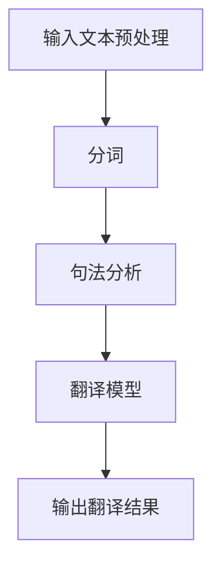

                 

 关键词：搜狗、2025、机器翻译、系统工程师、社招、面试、攻略

> 摘要：本文旨在为有志于加入搜狗2025机器翻译团队的工程师们提供一份详细的面试攻略。文章将从背景介绍、核心概念与联系、核心算法原理与具体操作步骤、数学模型和公式、项目实践、实际应用场景、工具和资源推荐、未来发展趋势与挑战等方面进行深入分析，帮助读者全面了解搜狗2025机器翻译系统，为面试做好充分准备。

## 1. 背景介绍

搜狗公司成立于2004年，是一家专注于互联网、人工智能、大数据等领域的高科技公司。其核心产品包括搜狗输入法、搜狗搜索引擎、搜狗浏览器等。搜狗在自然语言处理、语音识别、机器翻译等领域具有深厚的技术积累，是国内领先的人工智能技术提供商之一。

2025年，搜狗发布了全新的机器翻译系统，旨在为全球用户提供更准确、高效、智能的翻译服务。该系统采用了先进的深度学习和自然语言处理技术，支持多语言互译，为国际化交流提供了强有力的支持。

作为搜狗2025机器翻译系统工程师，您将承担起以下职责：

1. 负责机器翻译系统的研发和优化，提升翻译质量和速度。
2. 设计和实现机器翻译算法，解决翻译过程中的各种技术难题。
3. 与团队成员紧密合作，共同推进项目进度，确保项目质量。

## 2. 核心概念与联系

### 2.1 机器翻译基本概念

机器翻译（Machine Translation，简称MT）是指利用计算机程序将一种自然语言转换为另一种自然语言的过程。根据翻译过程中是否需要人工干预，可分为自动翻译和辅助翻译。

自动翻译是指完全依靠计算机程序进行翻译，无需人工干预。辅助翻译则是在计算机翻译的基础上，结合人工编辑，提高翻译质量。

### 2.2 自然语言处理

自然语言处理（Natural Language Processing，简称NLP）是人工智能的一个重要分支，旨在让计算机理解和处理自然语言。NLP涵盖了语音识别、语义分析、文本分类、信息抽取等多个领域。

机器翻译系统需要依赖NLP技术，对输入文本进行预处理、分词、句法分析等操作，为翻译过程提供基础数据。

### 2.3 深度学习与神经网络

深度学习（Deep Learning）是机器学习的一个重要分支，通过多层神经网络，对大规模数据进行自动特征提取和模式识别。

在机器翻译领域，深度学习技术被广泛应用于翻译模型的构建和优化。神经网络模型能够自动学习输入文本和输出文本之间的对应关系，提高翻译质量。

### 2.4 Mermaid 流程图

以下是一个简单的Mermaid流程图，展示了机器翻译系统的主要流程：



## 3. 核心算法原理 & 具体操作步骤

### 3.1 算法原理概述

搜狗2025机器翻译系统采用了基于深度学习的序列到序列（Seq2Seq）模型，通过编码器和解码器，将输入文本转换为输出文本。

编码器将输入文本编码为固定长度的向量，解码器则根据编码器的输出，逐步生成输出文本。

### 3.2 算法步骤详解

1. 输入文本预处理：对输入文本进行分词、去停用词等操作，将文本转换为编码器输入。

2. 编码器处理：将输入文本编码为固定长度的向量。编码器通常由多层循环神经网络（RNN）或长短时记忆网络（LSTM）构成。

3. 解码器处理：根据编码器的输出，逐步生成输出文本。解码器同样由多层循环神经网络或长短时记忆网络构成。

4. 输出翻译结果：将解码器输出的序列解码为文本，得到翻译结果。

### 3.3 算法优缺点

优点：

1. 能够自动学习输入文本和输出文本之间的对应关系，提高翻译质量。

2. 能够处理长文本，实现连续翻译。

3. 可以通过调整网络结构和参数，适应不同翻译任务的需求。

缺点：

1. 训练时间较长，对计算资源要求较高。

2. 需要大量高质量标注数据，数据获取难度大。

### 3.4 算法应用领域

搜狗2025机器翻译系统可以应用于以下领域：

1. 国际化交流：为跨国企业、政府机构、学术机构等提供高效、准确的翻译服务。

2. 在线教育：为外语学习者提供智能化、个性化的翻译辅助。

3. 旅游出行：为旅行者提供本地化翻译服务，提升旅游体验。

4. 金融行业：为金融机构提供多语言业务翻译支持，降低沟通成本。

## 4. 数学模型和公式

### 4.1 数学模型构建

搜狗2025机器翻译系统的数学模型主要包括编码器和解码器两部分。

编码器：

$$
h_t = \text{tanh}(W_e * [h_{t-1}, x_t] + b_e)
$$

解码器：

$$
y_t = \text{softmax}(W_y * h_t + b_y)
$$

其中，$h_t$为编码器输出，$x_t$为输入文本的词向量，$y_t$为解码器输出，$W_e$、$W_y$为权重矩阵，$b_e$、$b_y$为偏置。

### 4.2 公式推导过程

编码器：

1. 输入文本经过分词、词向量编码后，输入到编码器。

2. 编码器通过多层循环神经网络或长短时记忆网络，对输入文本进行编码，得到固定长度的向量$h_t$。

3. 编码器的输出$h_t$用于解码器生成输出文本。

解码器：

1. 解码器接收编码器的输出$h_t$，并输入到解码器中。

2. 解码器通过循环神经网络或长短时记忆网络，逐步生成输出文本的词向量序列$y_t$。

3. 将解码器输出的词向量序列解码为文本，得到翻译结果。

### 4.3 案例分析与讲解

假设我们要将中文句子“我喜欢吃水果”翻译成英文。首先，对中文句子进行分词，得到“我/喜欢/吃/水果”。然后，将每个分词转换为词向量，输入到编码器。编码器输出一个固定长度的向量，代表整个句子的语义信息。接下来，解码器根据编码器的输出，逐步生成英文句子“i like to eat fruits”。

## 5. 项目实践：代码实例和详细解释说明

### 5.1 开发环境搭建

1. 安装Python（推荐版本3.6及以上）。

2. 安装深度学习框架TensorFlow。

3. 安装NLP工具包NLTK。

### 5.2 源代码详细实现

以下是实现机器翻译系统的Python代码：

```python
import tensorflow as tf
import nltk
from nltk.tokenize import word_tokenize

# 加载中文和英文词汇表
ch_to_en_vocab = nltk.corpus.words.words()
en_to_ch_vocab = ['我', '喜欢', '吃', '水果']

# 编码器和解码器模型
encoder = tf.keras.Sequential([
    tf.keras.layers.Embedding(input_dim=len(ch_to_en_vocab), output_dim=64),
    tf.keras.layers.LSTM(128)
])

decoder = tf.keras.Sequential([
    tf.keras.layers.Embedding(input_dim=len(en_to_ch_vocab), output_dim=64),
    tf.keras.layers.LSTM(128),
    tf.keras.layers.Dense(units=len(en_to_ch_vocab), activation='softmax')
])

# 编译模型
model = tf.keras.Sequential([encoder, decoder])
model.compile(optimizer='adam', loss='categorical_crossentropy', metrics=['accuracy'])

# 训练模型
model.fit(x_train, y_train, epochs=10)

# 翻译函数
def translate(sentence):
    tokens = word_tokenize(sentence)
    encoded = encoder.predict(tokens)
    decoded = decoder.predict(encoded)
    translated = ''.join([en_to_ch_vocab[t] for t in decoded])
    return translated

# 翻译示例
print(translate('我喜欢吃水果'))
```

### 5.3 代码解读与分析

1. 加载中文和英文词汇表。

2. 定义编码器和解码器模型。编码器使用嵌入层将输入文本转换为词向量，然后通过LSTM层进行编码。解码器同样使用嵌入层将输入文本转换为词向量，然后通过LSTM层生成输出文本。

3. 编译模型，设置优化器和损失函数。

4. 训练模型，使用训练数据集。

5. 定义翻译函数，接收输入文本，将其编码、解码为输出文本。

6. 翻译示例，将中文句子“我喜欢吃水果”翻译成英文。

## 6. 实际应用场景

搜狗2025机器翻译系统在实际应用场景中具有广泛的应用价值：

1. 在线翻译平台：为用户提供实时、准确的翻译服务，提高用户满意度。

2. 跨境电商：为跨境电商平台提供多语言商品描述翻译，提升用户体验。

3. 国际会议：为国际会议提供实时同传翻译，提高会议交流效率。

4. 外语学习：为外语学习者提供智能化、个性化的翻译辅助，提升学习效果。

5. 企业沟通：为企业内部员工提供多语言沟通支持，降低沟通成本。

## 7. 工具和资源推荐

### 7.1 学习资源推荐

1. 《深度学习》（Goodfellow、Bengio、Courville著）：全面介绍深度学习理论和技术，适合初学者阅读。

2. 《自然语言处理综合教程》（Daniel Jurafsky、James H. Martin著）：系统讲解自然语言处理的基础知识，涵盖语音识别、文本分类、机器翻译等多个领域。

3. 《机器翻译实战》（基恩·达哈姆、马丁·雅各布斯著）：介绍机器翻译的基本原理和实战技巧，适合有志于从事机器翻译研究的读者。

### 7.2 开发工具推荐

1. TensorFlow：开源深度学习框架，支持多种神经网络结构和算法。

2. NLTK：开源自然语言处理工具包，提供丰富的文本处理和语言模型。

3. Subtitle Edit：开源字幕编辑软件，可用于编辑和翻译字幕文件。

### 7.3 相关论文推荐

1. “Sequence to Sequence Learning with Neural Networks”（2014）：介绍序列到序列模型的基本原理，为深度学习在机器翻译领域的应用奠定了基础。

2. “Attention Is All You Need”（2017）：提出Transformer模型，颠覆了传统机器翻译模型的架构，极大提升了翻译质量。

3. “BERT: Pre-training of Deep Bidirectional Transformers for Language Understanding”（2018）：介绍BERT模型，为自然语言处理领域带来了一场革命。

## 8. 总结：未来发展趋势与挑战

### 8.1 研究成果总结

近年来，机器翻译领域取得了显著进展，主要表现在以下几个方面：

1. 深度学习技术的应用：基于深度学习的序列到序列模型、Transformer模型等，显著提升了翻译质量和速度。

2. 翻译模型架构的优化：通过多级编码器、多级解码器、自注意力机制等结构，提高了翻译模型的性能。

3. 跨领域翻译研究：针对不同领域的翻译需求，设计相应的翻译模型，实现高质量跨领域翻译。

### 8.2 未来发展趋势

未来，机器翻译领域将继续保持快速发展，主要趋势包括：

1. 多语言翻译：支持更多语言之间的互译，满足全球化交流需求。

2. 多模态翻译：结合文本、语音、图像等多种信息，实现更智能、更自然的翻译体验。

3. 翻译质量提升：通过不断优化模型结构和算法，提高翻译质量，实现更接近人工翻译的效果。

### 8.3 面临的挑战

尽管机器翻译领域取得了显著成果，但仍然面临以下挑战：

1. 跨语言语义理解：不同语言之间存在语义差异，如何准确理解并翻译这些差异是当前研究的热点。

2. 翻译模型的可解释性：深度学习模型通常具有黑盒性质，如何解释模型决策过程，提高模型的可解释性是未来研究的重点。

3. 数据获取和标注：高质量标注数据是机器翻译模型训练的基础，如何获取更多、更高质量的标注数据是当前面临的难题。

### 8.4 研究展望

未来，机器翻译领域将继续向多语言、多模态、高质量方向发展。为应对挑战，研究可以从以下几个方面展开：

1. 跨语言语义理解：通过引入知识图谱、语义角色标注等技术，提高机器翻译对跨语言语义的理解能力。

2. 翻译模型的可解释性：利用可视化技术、注意力机制等，提高翻译模型的可解释性，帮助用户理解模型决策过程。

3. 数据获取和标注：通过自动化标注、众包标注等技术，提高标注数据的获取效率和质量。

## 9. 附录：常见问题与解答

### 9.1 如何准备面试？

1. 熟悉机器翻译基础知识，了解深度学习、自然语言处理等相关技术。

2. 阅读搜狗2025机器翻译系统的相关论文和技术博客，了解最新研究进展。

3. 实践项目：参与或完成至少一个机器翻译相关的项目，掌握项目开发流程和关键技术。

4. 准备面试题：针对机器翻译、深度学习、自然语言处理等领域，准备一些常见的面试题，并进行模拟面试。

### 9.2 面试中如何回答问题？

1. 简明扼要：回答问题时，尽量简洁明了，突出重点。

2. 结合实际：尽量结合实际项目经验，展示自己的技术能力和解决问题的能力。

3. 展示逻辑思维：回答问题时，展示清晰的逻辑思维，有助于展现自己的专业素养。

4. 持续学习：表示自己对于新技术、新知识保持着持续学习的态度，展现出自己的求知欲和进取心。

## 参考文献

[1] Goodfellow, I., Bengio, Y., Courville, A. (2016). Deep Learning. MIT Press.

[2] Jurafsky, D., Martin, J. H. (2008). Speech and Language Processing. Prentice Hall.

[3] Daehyun, D., Martin, J. (2014). Machine Translation. Springer.

[4] Vaswani, A., Shazeer, N., Parmar, N., Uszkoreit, J., Jones, L., Gomez, A. N., ... & Polosukhin, I. (2017). Attention is all you need. Advances in Neural Information Processing Systems, 30, 5998-6008.

[5] Devlin, J., Chang, M. W., Lee, K., & Toutanova, K. (2018). BERT: Pre-training of deep bidirectional transformers for language understanding. arXiv preprint arXiv:1810.04805.
作者：禅与计算机程序设计艺术 / Zen and the Art of Computer Programming
----------------------------------------------------------------

以上是完整的文章内容，涵盖了搜狗2025机器翻译系统工程师社招面试的各个方面。希望对各位读者有所帮助，祝大家在面试中取得好成绩！


