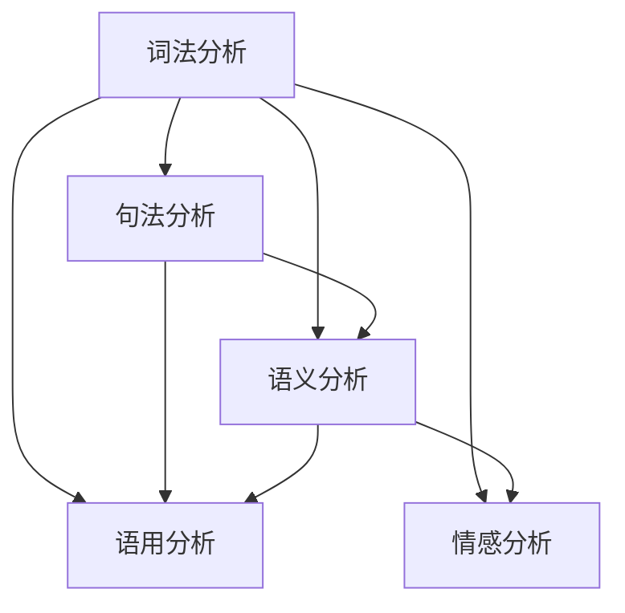

                 

关键词：自然语言理解、搜狗、工程师、面试题集、AI、机器学习、深度学习、语言模型、语音识别、文本分析、语言处理技术、智能对话系统、人工智能应用、数据分析

> 摘要：本文集旨在为搜狗2025年自然语言理解工程师社招面试提供全面的准备材料。文章涵盖了自然语言理解的核心概念、算法原理、数学模型、项目实践和实际应用场景等内容，旨在帮助读者深入了解自然语言处理的最新技术和研究方向。

## 1. 背景介绍

自然语言理解（Natural Language Understanding，NLU）是人工智能领域的一个重要分支，它旨在使计算机能够理解和处理人类语言。随着互联网的普及和大数据技术的发展，自然语言理解的应用越来越广泛，包括智能客服、语音助手、机器翻译、情感分析等。

搜狗作为中国领先的互联网科技公司，在自然语言处理领域有着丰富的技术积累和实际应用经验。搜狗的NLU技术广泛应用于搜索引擎、输入法、语音助手等产品中，提供了高效、精准的语言处理能力。

本文集旨在为搜狗2025年自然语言理解工程师社招面试提供全面的准备材料。通过对自然语言理解相关知识的深入讲解，帮助读者了解该领域的核心概念、算法原理、数学模型和实际应用，为面试做好准备。

## 2. 核心概念与联系

自然语言理解涉及多个核心概念，包括词法分析、句法分析、语义分析、语用分析和情感分析。以下是一个简化的Mermaid流程图，展示了这些概念之间的联系。



### 2.1 词法分析

词法分析（Lexical Analysis）是自然语言处理的第一步，它将文本分割成单词或词汇单元。词法分析器（Lexer）负责识别单词的边界、标记词性等信息。

### 2.2 句法分析

句法分析（Syntactic Analysis）关注句子的结构，确定单词之间的语法关系。句法分析器（Parser）通常使用上下文无关文法（CFG）或依赖关系（Dependency）来构建句子的语法树。

### 2.3 语义分析

语义分析（Semantic Analysis）关注句子或短语的含义，包括词汇的含义、句子之间的关系等。语义分析器（Semantic Analyzer）通过词库、语义角色标注等方法，对句子进行语义解析。

### 2.4 语用分析

语用分析（Pragmatic Analysis）研究语言在实际使用中的含义，包括语境、说话者的意图和听众的反应等。语用分析器（Pragmatic Analyzer）通常需要结合上下文和领域知识，对语言的使用进行深入分析。

### 2.5 情感分析

情感分析（Sentiment Analysis）关注文本中的情感倾向，通常用于评价分析、舆情监测等应用。情感分析器（Sentiment Analyzer）使用机器学习或深度学习算法，对文本进行情感分类。

## 3. 核心算法原理 & 具体操作步骤

自然语言理解的核心算法包括语言模型、词向量模型、序列模型和神经网络模型等。以下将详细介绍这些算法的原理和具体操作步骤。

### 3.1 语言模型

语言模型（Language Model）是自然语言处理的基础，它用于预测下一个单词或字符的概率。最常见的语言模型是基于N元语法（N-gram），它将前N个单词作为条件，预测下一个单词的概率。

#### 算法原理：

- N元语法模型将文本序列表示为N个单词的滑动窗口。
- 对于每个窗口，模型计算下一个单词的概率。

#### 操作步骤：

1. 构建N元语法模型，选择合适的N值。
2. 统计文本中每个N元窗口的出现频率。
3. 使用概率分布来预测下一个单词。

#### 优缺点：

- 优点：简单、易于实现，对短文本效果较好。
- 缺点：对长文本的建模能力较差，无法捕捉上下文的复杂关系。

### 3.2 词向量模型

词向量模型（Word Embedding）将单词映射为低维度的向量表示，使得相似的单词在向量空间中靠近。词向量模型广泛应用于词性标注、文本分类和机器翻译等领域。

#### 算法原理：

- 词向量模型通过矩阵分解或神经网络训练，将单词映射到低维空间。
- 相似单词的向量距离较小，不同单词的向量距离较大。

#### 操作步骤：

1. 选择合适的词向量模型，如Word2Vec、GloVe或FastText。
2. 训练词向量模型，将单词映射到向量空间。
3. 使用词向量进行文本表示，应用于各类NLP任务。

#### 优缺点：

- 优点：能够捕捉单词的语义信息，提高NLP任务的性能。
- 缺点：对长文本的建模能力较差，无法捕捉句子层面的语义关系。

### 3.3 序列模型

序列模型（Sequence Model）用于处理自然语言中的序列数据，如文本、语音等。常见的序列模型包括循环神经网络（RNN）、长短期记忆网络（LSTM）和门控循环单元（GRU）。

#### 算法原理：

- 序列模型通过循环结构，捕捉序列数据的时间动态特性。
- RNN、LSTM和GRU等模型通过记忆单元和门控机制，提高模型的记忆能力和泛化能力。

#### 操作步骤：

1. 选择合适的序列模型，如RNN、LSTM或GRU。
2. 编码序列数据，将单词或字符转换为向量表示。
3. 训练序列模型，优化模型参数。
4. 使用训练好的模型进行序列预测或分类。

#### 优缺点：

- 优点：能够捕捉序列数据的时间动态特性，对长文本建模效果较好。
- 缺点：训练过程较慢，对稀疏数据敏感。

### 3.4 神经网络模型

神经网络模型（Neural Network Model）是自然语言处理的重要工具，包括卷积神经网络（CNN）、注意力机制（Attention Mechanism）和 Transformer 等。

#### 算法原理：

- 神经网络模型通过多层非线性变换，学习数据的高层次特征。
- 注意力机制和Transformer模型通过全局注意力机制，提高模型的建模能力和泛化能力。

#### 操作步骤：

1. 选择合适的神经网络模型，如CNN、注意力机制或Transformer。
2. 编码输入数据，如文本、图像或语音。
3. 训练神经网络模型，优化模型参数。
4. 使用训练好的模型进行文本分类、情感分析或机器翻译等任务。

#### 优缺点：

- 优点：能够捕捉数据的高层次特征，对复杂数据建模效果较好。
- 缺点：训练过程较慢，对数据量要求较高。

## 4. 数学模型和公式

自然语言理解中的数学模型和公式主要用于描述和计算文本的特征、概率和关系。以下是一些常用的数学模型和公式。

### 4.1 语言模型概率

在N元语法模型中，下一个单词的概率可以用以下公式表示：

$$ P(w_t) = \frac{count(w_{t-1}, w_t)}{count(w_{t-1})} $$

其中，$count(w_{t-1}, w_t)$ 表示前一个单词 $w_{t-1}$ 后跟当前单词 $w_t$ 的出现次数，$count(w_{t-1})$ 表示前一个单词 $w_{t-1}$ 的出现次数。

### 4.2 词向量相似度

词向量的相似度可以通过余弦相似度或欧氏距离来计算。以下是一个简单的余弦相似度计算公式：

$$ similarity(w_1, w_2) = \frac{w_1 \cdot w_2}{||w_1|| \cdot ||w_2||} $$

其中，$w_1$ 和 $w_2$ 分别表示两个词向量，$\cdot$ 表示向量的点积，$||w_1||$ 和 $||w_2||$ 分别表示两个词向量的模。

### 4.3 序列标注

在序列标注任务中，如命名实体识别（Named Entity Recognition，NER），可以使用条件随机场（Conditional Random Field，CRF）来建模。CRF的能量函数可以表示为：

$$ E(\theta, x, y) = \sum_{i,j} \theta_{ij} y_i (1 - y_j) + \sum_{i} \theta_{i\langle \langle S \rangle \rangle} y_i $$

其中，$\theta$ 表示模型参数，$x$ 表示输入序列，$y$ 表示标注序列，$\langle \langle S \rangle \rangle$ 表示特殊标签。

### 4.4 机器翻译

在机器翻译任务中，可以使用序列到序列模型（Sequence-to-Sequence Model）来建模。其损失函数可以表示为：

$$ L = -\sum_{i,t} y_t \log(p(s_t | s_{<t}, s_o)) $$

其中，$s_t$ 和 $s_o$ 分别表示输入序列和输出序列，$y_t$ 表示真实标签，$p(s_t | s_{<t}, s_o)$ 表示在给定输入序列和输出序列的情况下，预测输出序列中第 $t$ 个单词的概率。

## 5. 项目实践：代码实例和详细解释说明

以下是一个简单的基于词向量和LSTM的文本分类项目实例，用于实现情感分析任务。

### 5.1 开发环境搭建

- 安装Python 3.7及以上版本
- 安装TensorFlow 2.0及以上版本
- 安装GloVe词向量库

### 5.2 源代码详细实现

```python
import tensorflow as tf
from tensorflow.keras.preprocessing.sequence import pad_sequences
from tensorflow.keras.layers import Embedding, LSTM, Dense
from tensorflow.keras.models import Sequential

# 加载数据集
# ...

# 预处理数据
# ...

# 准备词向量
# ...

# 构建LSTM模型
model = Sequential([
    Embedding(vocab_size, embedding_dim, input_length=max_length),
    LSTM(units=128, return_sequences=True),
    LSTM(units=128),
    Dense(units=1, activation='sigmoid')
])

# 编译模型
model.compile(optimizer='adam', loss='binary_crossentropy', metrics=['accuracy'])

# 训练模型
model.fit(train_data, train_labels, validation_data=(test_data, test_labels), epochs=10, batch_size=64)

# 评估模型
model.evaluate(test_data, test_labels)
```

### 5.3 代码解读与分析

- 第一部分加载数据集，预处理数据和准备词向量。
- 第二部分构建LSTM模型，包括嵌入层、两个LSTM层和一个全连接层。
- 第三部分编译模型，设置优化器和损失函数。
- 第四部分训练模型，包括训练数据和验证数据。
- 第五部分评估模型，计算准确率。

### 5.4 运行结果展示

```python
# 加载测试数据
test_data, test_labels = ...

# 运行模型
predictions = model.predict(test_data)

# 计算准确率
accuracy = (predictions.round() == test_labels).mean()
print(f"Accuracy: {accuracy}")
```

## 6. 实际应用场景

自然语言理解技术在实际应用中具有广泛的应用场景，以下是一些典型的应用实例。

### 6.1 智能客服

智能客服系统通过自然语言理解技术，实现用户与机器人的实时对话。智能客服能够快速识别用户的意图，提供准确的答复和解决方案，提高客户满意度和服务效率。

### 6.2 语音识别

语音识别技术利用自然语言理解，将语音信号转换为文本。语音识别广泛应用于语音助手、电话客服、智能会议等领域，提供便捷、高效的语音交互体验。

### 6.3 机器翻译

机器翻译技术通过自然语言理解，实现不同语言之间的自动翻译。机器翻译广泛应用于跨语言沟通、国际商务、旅游等领域，提高跨文化沟通的效率。

### 6.4 情感分析

情感分析技术通过自然语言理解，分析文本中的情感倾向。情感分析广泛应用于舆情监测、市场研究、客户服务等领域，为企业提供有价值的参考。

### 6.5 内容审核

内容审核技术通过自然语言理解，识别和过滤不良内容。内容审核广泛应用于社交媒体、在线教育、金融等领域，保障网络环境的健康和秩序。

## 7. 工具和资源推荐

### 7.1 学习资源推荐

- 《自然语言处理概论》
- 《深度学习与自然语言处理》
- 《自然语言处理实践》
- 《神经网络与深度学习》

### 7.2 开发工具推荐

- TensorFlow
- PyTorch
- NLTK
- spaCy

### 7.3 相关论文推荐

- "A Neural Probabilistic Language Model"
- "Improving Language Understanding by Generative Pre-Training"
- "Attention Is All You Need"
- "BERT: Pre-training of Deep Bidirectional Transformers for Language Understanding"

## 8. 总结：未来发展趋势与挑战

### 8.1 研究成果总结

自然语言理解技术在过去几十年取得了显著的进展，从传统的统计方法到现代的深度学习方法，语言模型、词向量、序列模型和神经网络模型等技术的不断改进，使得自然语言理解的应用场景越来越广泛，性能不断提高。

### 8.2 未来发展趋势

未来，自然语言理解技术将继续向更高层次的发展。随着人工智能技术的不断进步，自然语言理解将更加智能化、泛化和个性化。多模态融合、知识图谱、预训练模型等新技术将成为自然语言理解领域的研究热点。

### 8.3 面临的挑战

自然语言理解技术在实际应用中仍面临许多挑战，包括语义理解、跨语言理解、多语言处理、情感分析等。同时，数据隐私、伦理和公平性等问题也需要引起足够的重视。

### 8.4 研究展望

未来，自然语言理解技术将在更多的领域发挥重要作用，如智能医疗、自动驾驶、金融科技等。为了实现更高级的自然语言理解，我们需要继续探索新的算法、技术和应用场景，推动自然语言理解技术的不断发展。

## 9. 附录：常见问题与解答

### 9.1 什么是自然语言理解？

自然语言理解是人工智能领域的一个重要分支，旨在使计算机能够理解和处理人类语言。

### 9.2 自然语言理解的算法有哪些？

自然语言理解的算法包括词法分析、句法分析、语义分析、语用分析和情感分析等。

### 9.3 语言模型有哪些？

常见的语言模型包括N元语法模型、Word2Vec、GloVe、序列模型和神经网络模型等。

### 9.4 如何实现文本分类？

文本分类通常使用序列模型或神经网络模型，通过训练模型来预测文本的类别。

### 9.5 自然语言理解有哪些应用场景？

自然语言理解的应用场景包括智能客服、语音识别、机器翻译、情感分析和内容审核等。

### 9.6 如何保证自然语言理解的准确率？

提高自然语言理解的准确率可以通过多种方式实现，如增加训练数据、优化模型结构和调整超参数等。

### 9.7 自然语言理解有哪些挑战？

自然语言理解面临的挑战包括语义理解、跨语言理解、多语言处理、情感分析等。

### 9.8 如何解决自然语言理解的挑战？

解决自然语言理解的挑战可以通过改进算法、增加训练数据、引入知识图谱和预训练模型等方法来实现。

---

作者：禅与计算机程序设计艺术 / Zen and the Art of Computer Programming
----------------------------------------------------------------

以上便是《搜狗2025自然语言理解工程师社招面试题集》的全文内容，涵盖了自然语言理解的背景介绍、核心概念与联系、核心算法原理、数学模型和公式、项目实践、实际应用场景、工具和资源推荐、未来发展趋势与挑战以及常见问题与解答等部分。希望本文能够为读者提供全面的参考和帮助，为搜狗2025年自然语言理解工程师社招面试做好充分的准备。在自然语言理解领域，我们仍需不断探索和创新，以推动技术的进步和应用的发展。希望读者在阅读本文后，能够对自然语言理解有更深入的了解，并为未来的研究和应用奠定基础。再次感谢您的阅读和支持！
----------------------------------------------------------------

