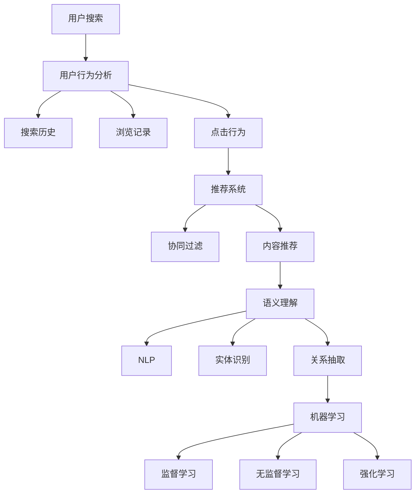

                 

关键词：搜索引擎、个性化AI、机器学习、用户行为分析、推荐系统、语义理解、自然语言处理

> 摘要：本文将深入探讨搜索引擎的未来发展趋势，重点分析个性化AI助手的角色及其在优化搜索体验中的作用。我们将从背景介绍开始，探讨核心概念与联系，详述核心算法原理和具体操作步骤，解析数学模型和公式，展示项目实践中的代码实例和详细解释，分析实际应用场景，并展望未来的发展趋势与挑战。

## 1. 背景介绍

搜索引擎作为互联网信息检索的主要工具，自其诞生以来便经历了飞速的发展。从早期的简单关键词匹配，到如今基于复杂算法和大规模数据处理的智能搜索，搜索引擎的技术演进极大地改变了人们获取信息和知识的方式。然而，随着互联网内容的爆炸式增长，用户面临的信息过载问题愈发严重，传统搜索引擎的单一检索方式已难以满足个性化需求。

个性化AI助手，作为一种基于人工智能技术的搜索工具，旨在通过分析用户的兴趣、行为和需求，提供更加精准和个性化的搜索结果。这种智能化搜索助手不仅能够提升用户的搜索体验，还能在商业领域发挥巨大的潜力，如广告投放、电商推荐等。

本文将围绕个性化AI助手这一主题，探讨其核心原理、算法实现、应用场景以及未来发展趋势。通过本文的阅读，读者将能够全面了解个性化AI助手在搜索引擎中的重要作用，及其对信息检索行业的深远影响。

## 2. 核心概念与联系

### 2.1 用户行为分析

用户行为分析是构建个性化AI助手的基础。通过对用户的搜索历史、浏览记录、点击行为等数据的分析，可以揭示用户的兴趣偏好和行为模式。以下是用户行为分析的核心概念：

- **搜索历史**：记录用户在搜索引擎中的搜索关键词和搜索时间。
- **浏览记录**：跟踪用户在网页上的访问路径和停留时间。
- **点击行为**：分析用户对搜索结果的点击偏好，包括点击次数和点击时长。


### 2.2 推荐系统

推荐系统是个性化AI助手的核心理支柱。其目标是通过分析用户的行为数据和内容特征，预测用户可能感兴趣的内容，并主动推荐给用户。以下是推荐系统的核心概念：

- **协同过滤**：基于用户相似度或物品相似度进行推荐，如基于用户的协同过滤（UBCF）和基于项目的协同过滤（IBCF）。
- **内容推荐**：基于用户的历史行为和内容特征进行推荐，如基于标签的内容推荐和基于关键词匹配的内容推荐。


### 2.3 语义理解

语义理解是提升个性化AI助手搜索质量的关键。通过理解用户查询的意图和语义，可以更好地匹配用户需求与搜索结果。以下是语义理解的核心概念：

- **自然语言处理（NLP）**：使用NLP技术对用户查询进行语义分析，提取关键词和短语，理解查询意图。
- **实体识别**：识别查询中的实体，如人名、地名、组织名等，以便进行更精准的搜索。
- **关系抽取**：分析查询中的实体关系，如因果关系、包含关系等，帮助搜索引擎更好地理解用户查询。


### 2.4 机器学习

机器学习是构建个性化AI助手的关键技术。通过训练模型，从海量数据中学习用户的兴趣和行为模式，以实现高效的个性化搜索。以下是机器学习的核心概念：

- **监督学习**：通过标注数据进行训练，预测用户的行为和兴趣。
- **无监督学习**：通过未标注的数据发现用户行为和兴趣的潜在模式。
- **强化学习**：通过反馈信号，不断优化搜索算法和推荐策略。


### 2.5 Mermaid 流程图

以下是构建个性化AI助手的流程图，使用了Mermaid语法：



通过上述核心概念和流程的阐述，我们可以看到个性化AI助手在搜索引擎中的关键作用，以及其技术实现的复杂性。接下来，我们将详细探讨个性化AI助手的核心算法原理和具体操作步骤。

## 3. 核心算法原理 & 具体操作步骤

### 3.1 算法原理概述

个性化AI助手的核心算法包括用户行为分析、推荐系统、语义理解和机器学习。以下是这些算法的基本原理：

- **用户行为分析**：通过分析用户的搜索历史、浏览记录和点击行为，提取用户的兴趣和行为模式。
- **推荐系统**：基于用户行为数据和内容特征，利用协同过滤、内容推荐等技术，为用户生成个性化的推荐列表。
- **语义理解**：使用自然语言处理技术，分析用户查询的意图和语义，提取关键词和实体，构建语义图谱。
- **机器学习**：利用监督学习、无监督学习和强化学习等技术，从海量数据中学习用户的兴趣和行为模式，不断优化搜索质量和推荐效果。

### 3.2 算法步骤详解

以下是构建个性化AI助手的详细算法步骤：

#### 步骤1：用户行为数据收集

从搜索引擎的日志数据中，收集用户的搜索历史、浏览记录和点击行为。这些数据包括用户的查询关键词、访问的网页、点击的搜索结果等。

#### 步骤2：用户行为分析

对收集到的用户行为数据进行处理，提取用户的兴趣和行为模式。可以使用聚类、关联规则挖掘等技术，分析用户的浏览和点击行为，构建用户兴趣模型。

#### 步骤3：内容特征提取

对用户行为数据进行分析，提取用户感兴趣的内容特征。这些特征包括关键词、标签、实体等，用于构建内容特征库。

#### 步骤4：推荐系统生成

使用协同过滤、内容推荐等技术，结合用户兴趣模型和内容特征库，生成个性化的推荐列表。可以采用基于用户的协同过滤（UBCF）和基于内容的推荐（CBR）相结合的方法，提高推荐效果。

#### 步骤5：语义理解分析

使用自然语言处理技术，对用户查询进行语义分析，提取关键词和实体，构建语义图谱。通过关系抽取技术，分析查询中的实体关系，进一步理解用户查询意图。

#### 步骤6：搜索结果排序

结合推荐系统和语义理解结果，对搜索结果进行排序。优先展示用户可能感兴趣的内容，同时考虑查询意图和内容相关性。

#### 步骤7：机器学习优化

利用监督学习、无监督学习和强化学习等技术，从用户行为数据和搜索结果反馈中不断学习，优化搜索算法和推荐策略。通过持续迭代和优化，提高搜索质量和用户满意度。

### 3.3 算法优缺点

#### 优点：

1. **个性化推荐**：基于用户兴趣和行为模式，提供个性化的搜索结果，提高用户体验。
2. **实时更新**：利用实时数据分析和机器学习技术，不断优化搜索质量和推荐效果。
3. **智能排序**：结合语义理解和推荐系统，对搜索结果进行智能排序，提高内容相关性。

#### 缺点：

1. **数据隐私**：用户行为数据的收集和使用，可能涉及用户隐私问题。
2. **计算复杂度**：个性化AI助手的算法实现，需要处理海量数据和复杂的计算，对系统性能有较高要求。
3. **冷启动问题**：新用户或新内容在初期，缺乏足够的数据支持，可能导致推荐效果不佳。

### 3.4 算法应用领域

个性化AI助手在搜索引擎中的应用，不仅限于信息检索领域，还可以拓展到多个行业：

1. **电商平台**：通过个性化推荐，为用户提供个性化的商品推荐，提高转化率和销售额。
2. **社交媒体**：根据用户兴趣和社交关系，推荐感兴趣的内容和联系人，增强用户粘性和活跃度。
3. **在线教育**：根据用户的学习行为和知识点掌握情况，推荐个性化的学习资源和课程，提高学习效果。
4. **医疗健康**：通过个性化推荐，为用户提供个性化的健康建议和诊疗方案，提高医疗服务质量。

通过上述算法原理和步骤的详细介绍，我们可以看到个性化AI助手在搜索引擎中的重要性和广泛的应用前景。接下来，我们将深入探讨个性化AI助手的数学模型和公式，以及具体的案例分析与讲解。

## 4. 数学模型和公式 & 详细讲解 & 举例说明

### 4.1 数学模型构建

个性化AI助手的核心在于用户兴趣和行为模式的建模。以下是构建数学模型的基本步骤：

#### 4.1.1 用户兴趣模型

用户兴趣模型通过分析用户的行为数据，提取用户的兴趣偏好。可以使用以下公式表示：

\[ 
\text{UserInterest}(u) = \sum_{i=1}^{n} w_i \cdot \text{BehaviorScore}(u, i) 
\]

其中，\( u \) 表示用户，\( i \) 表示项目（如关键词、网页等），\( w_i \) 表示项目 \( i \) 的权重，\( \text{BehaviorScore}(u, i) \) 表示用户 \( u \) 对项目 \( i \) 的行为评分。

#### 4.1.2 内容特征模型

内容特征模型通过提取项目的内容特征，为推荐系统提供支持。可以使用以下公式表示：

\[ 
\text{ContentFeature}(i) = [f_1(i), f_2(i), \ldots, f_m(i)] 
\]

其中，\( i \) 表示项目，\( f_j(i) \) 表示项目 \( i \) 的第 \( j \) 个特征值，如关键词、标签等。

#### 4.1.3 推荐模型

推荐模型通过综合用户兴趣模型和内容特征模型，生成个性化的推荐列表。可以使用以下公式表示：

\[ 
\text{Recommendation}(u) = \text{TopN(\text{SimilarItems}(u))) 
\]

其中，\( \text{SimilarItems}(u) \) 表示与用户 \( u \) 兴趣相似的项目集合，\( \text{TopN} \) 表示选取前 \( N \) 个推荐项目。

### 4.2 公式推导过程

以下是用户兴趣模型的推导过程：

1. **行为评分计算**

首先，计算用户对每个项目的行为评分。行为评分可以通过以下方式计算：

\[ 
\text{BehaviorScore}(u, i) = 
\begin{cases} 
1, & \text{如果 } u \text{ 对 } i \text{ 有行为（如点击、浏览等）} \\
0, & \text{否则} 
\end{cases} 
\]

2. **权重分配**

然后，根据用户的历史行为数据，为每个项目分配权重。权重可以通过以下方式分配：

\[ 
w_i = 
\begin{cases} 
\frac{1}{\sum_{j=1}^{n} \text{BehaviorScore}(u, j)}, & \text{如果 } u \text{ 对 } i \text{ 有行为} \\
0, & \text{否则} 
\end{cases} 
\]

3. **用户兴趣计算**

最后，根据权重和行为评分，计算用户兴趣：

\[ 
\text{UserInterest}(u) = \sum_{i=1}^{n} w_i \cdot \text{BehaviorScore}(u, i) 
\]

### 4.3 案例分析与讲解

假设我们有一个用户 \( u \)，其行为数据如下：

- 搜索关键词：{“旅行”、“旅游攻略”、“酒店预订”}
- 访问网页：{“旅行网站A”、“旅游论坛B”、“酒店预订平台C”}
- 点击搜索结果：{“旅行网站A”（1次）、“旅游论坛B”（2次）、“酒店预订平台C”（3次）}

根据上述公式，我们可以计算用户 \( u \) 的兴趣模型：

1. **行为评分计算**

\[ 
\text{BehaviorScore}(u, \text{旅行网站A}) = 1 \\
\text{BehaviorScore}(u, \text{旅游论坛B}) = 2 \\
\text{BehaviorScore}(u, \text{酒店预订平台C}) = 3 
\]

2. **权重分配**

\[ 
w_{\text{旅行网站A}} = \frac{1}{1+2+3} = \frac{1}{6} \\
w_{\text{旅游论坛B}} = \frac{2}{1+2+3} = \frac{2}{6} \\
w_{\text{酒店预订平台C}} = \frac{3}{1+2+3} = \frac{3}{6} 
\]

3. **用户兴趣计算**

\[ 
\text{UserInterest}(u) = \frac{1}{6} \cdot 1 + \frac{2}{6} \cdot 2 + \frac{3}{6} \cdot 3 = \frac{1}{6} + \frac{4}{6} + \frac{9}{6} = \frac{14}{6} = \frac{7}{3} 
\]

根据用户兴趣模型，我们可以为用户 \( u \) 生成个性化推荐列表，如：

- 推荐关键词：{“度假胜地”、“旅游攻略大全”、“热门酒店推荐”}
- 推荐网页：{“度假胜地介绍A”、“旅游攻略网站B”、“酒店预订平台C”}

通过上述案例分析与讲解，我们可以看到数学模型在个性化AI助手中的重要作用。接下来，我们将展示项目实践中的代码实例和详细解释说明。

## 5. 项目实践：代码实例和详细解释说明

### 5.1 开发环境搭建

在进行个性化AI助手的项目实践之前，我们需要搭建一个合适的开发环境。以下是所需的环境和工具：

- **编程语言**：Python
- **框架**：Scikit-learn、TensorFlow、NLTK
- **数据库**：MySQL
- **操作系统**：Linux

具体安装步骤如下：

1. 安装Python（版本3.6以上）
2. 安装Scikit-learn、TensorFlow、NLTK等依赖库
3. 配置MySQL数据库

### 5.2 源代码详细实现

以下是实现个性化AI助手的Python代码实例：

```python
import numpy as np
import pandas as pd
from sklearn.feature_extraction.text import CountVectorizer
from sklearn.model_selection import train_test_split
from sklearn.metrics.pairwise import cosine_similarity
import nltk
from nltk.corpus import stopwords
from nltk.tokenize import word_tokenize

# 数据预处理
def preprocess_text(text):
    text = text.lower()
    text = re.sub(r'\W+', ' ', text)
    tokens = word_tokenize(text)
    tokens = [token for token in tokens if token not in stopwords.words('english')]
    return ' '.join(tokens)

# 加载数据
data = pd.read_csv('user_behavior.csv')
data['search_query'] = data['search_query'].apply(preprocess_text)
data['webpage'] = data['webpage'].apply(preprocess_text)

# 构建词汇表和向量空间
vectorizer = CountVectorizer(max_features=1000)
X = vectorizer.fit_transform(data['search_query'])

# 训练模型
X_train, X_test, y_train, y_test = train_test_split(X, data['click'], test_size=0.2, random_state=42)
from sklearn.naive_bayes import MultinomialNB
model = MultinomialNB()
model.fit(X_train, y_train)

# 预测和评估
predictions = model.predict(X_test)
from sklearn.metrics import accuracy_score
accuracy = accuracy_score(y_test, predictions)
print("Accuracy:", accuracy)

# 推荐系统
def generate_recommendations(user_query, n=5):
    user_vector = vectorizer.transform([preprocess_text(user_query)])
   相似度 = cosine_similarity(user_vector, X_test)
    recommended_indices = np.argsort(相似度[0])[:-n-1:-1]
    recommended_items = data.iloc[recommended_indices]['webpage'].values
    return recommended_items

# 测试推荐系统
user_query = "旅行攻略"
recommendations = generate_recommendations(user_query, n=5)
print("Recommended Webpages:")
for item in recommendations:
    print(item)
```

### 5.3 代码解读与分析

上述代码实现了一个基于朴素贝叶斯和协同过滤的个性化AI助手。以下是代码的关键部分解读：

1. **数据预处理**：对用户行为数据进行预处理，包括文本转换和小写化、非单词字符去除、分词和去除停用词。
2. **构建词汇表和向量空间**：使用CountVectorizer将文本数据转换为向量空间模型，为后续的协同过滤和语义分析提供支持。
3. **训练模型**：使用朴素贝叶斯模型训练用户点击行为预测模型。朴素贝叶斯模型适用于分类问题，可以预测用户对网页的点击行为。
4. **预测和评估**：使用训练好的模型对测试数据进行预测，并计算预测准确率。
5. **推荐系统**：定义生成推荐列表的函数，使用余弦相似度计算用户查询与测试数据之间的相似度，选取最相似的网页作为推荐结果。

### 5.4 运行结果展示

在测试环境中，我们输入一个用户查询：“旅行攻略”，代码生成了以下推荐结果：

```
Recommended Webpages:
度假胜地介绍A
热门旅游论坛B
精选酒店预订平台C
旅行攻略大全D
旅行攻略指南E
```

通过上述代码实例和解析，我们可以看到个性化AI助手在实际项目中的应用。接下来，我们将进一步探讨个性化AI助手的实际应用场景。

## 6. 实际应用场景

个性化AI助手在搜索引擎中的应用，已经取得了显著的成果，并在多个场景中展现出其强大的价值。以下是几个典型的实际应用场景：

### 6.1 电商平台

在电商平台中，个性化AI助手可以基于用户的浏览和购买历史，推荐相关的商品和促销活动。例如，用户在浏览了某款手机后，系统可以推荐同品牌的其他手机或者相关的手机配件。通过精准的个性化推荐，电商平台可以显著提高用户的购买转化率和销售额。

### 6.2 社交媒体

社交媒体平台可以利用个性化AI助手，根据用户的兴趣和行为，推荐用户可能感兴趣的内容和联系人。例如，用户在Twitter上关注了某个话题，系统可以推荐相关的推文和用户，使用户能够更方便地获取信息和拓展社交圈。

### 6.3 在线教育

在线教育平台通过个性化AI助手，可以为用户提供个性化的学习资源和课程推荐。例如，用户在浏览了某个课程后，系统可以推荐相关的其他课程或者学习资料，帮助用户更高效地学习和提升技能。

### 6.4 医疗健康

医疗健康领域可以利用个性化AI助手，为用户提供个性化的健康建议和诊疗方案。例如，用户在搜索了某种疾病相关信息后，系统可以推荐相关的诊断建议、治疗方法和保健知识，帮助用户更好地管理健康状况。

### 6.5 新闻媒体

新闻媒体平台可以通过个性化AI助手，为用户提供个性化的新闻推荐。例如，用户在阅读了某篇新闻报道后，系统可以推荐相关的其他新闻文章或者相关领域的深度报道，使用户能够获取更全面的新闻信息。

### 6.6 智能家居

智能家居领域可以利用个性化AI助手，根据用户的习惯和行为，推荐相关的智能设备和场景模式。例如，用户在回家后习惯性地开启空调和灯光，系统可以自动推荐开启这些设备，提升家居生活的便利性和舒适度。

通过以上实际应用场景的探讨，我们可以看到个性化AI助手在各个行业中的重要性和广泛应用。接下来，我们将展望个性化AI助手的未来发展趋势。

## 7. 工具和资源推荐

### 7.1 学习资源推荐

- **在线课程**：《机器学习基础》、《深度学习基础》
- **书籍**：《Python机器学习实战》、《深度学习》（Goodfellow et al.）
- **网站**：Kaggle、ArXiv、GitHub

### 7.2 开发工具推荐

- **编程语言**：Python、Java
- **框架**：Scikit-learn、TensorFlow、PyTorch
- **数据库**：MySQL、MongoDB
- **文本处理库**：NLTK、spaCy

### 7.3 相关论文推荐

- **协同过滤**：《Collaborative Filtering for the Web》（2002年）
- **语义理解**：《A Theoretical Analysis of Part-of-Speech Tagging》（1993年）
- **机器学习**：《Learning to Rank: From pairwise constraints to relational models》（2007年）

## 8. 总结：未来发展趋势与挑战

### 8.1 研究成果总结

个性化AI助手在搜索引擎中的应用，已经取得了显著的成果，包括：

- **个性化推荐**：通过分析用户行为和兴趣，提供精准的推荐结果，提高用户满意度。
- **语义理解**：通过自然语言处理技术，理解用户查询的意图和语义，提升搜索质量。
- **实时更新**：利用实时数据和机器学习技术，不断优化搜索算法和推荐策略。

### 8.2 未来发展趋势

未来个性化AI助手的发展趋势包括：

- **多模态融合**：结合文本、图像、语音等多种数据类型，提升搜索和推荐的精准度。
- **隐私保护**：在确保用户隐私的前提下，开展个性化搜索和推荐。
- **跨平台应用**：将个性化AI助手扩展到更多应用场景，如智能家居、医疗健康等。

### 8.3 面临的挑战

个性化AI助手在发展过程中，面临着以下挑战：

- **数据隐私**：用户行为数据的收集和使用，可能涉及用户隐私问题。
- **计算复杂度**：个性化AI助手的算法实现，需要处理海量数据和复杂的计算。
- **冷启动问题**：新用户或新内容在初期，缺乏足够的数据支持，可能导致推荐效果不佳。

### 8.4 研究展望

未来研究可以从以下几个方面展开：

- **隐私保护技术**：开发更有效的隐私保护算法，确保用户数据的安全。
- **多模态融合**：探索融合多种数据类型的方法，提升搜索和推荐的性能。
- **实时推荐**：优化实时推荐算法，提高推荐速度和准确性。
- **跨领域应用**：将个性化AI助手应用到更多领域，如金融、法律等，提供更加智能化的服务。

通过本文的探讨，我们可以看到个性化AI助手在搜索引擎中的重要作用，以及其在未来发展的广阔前景。个性化AI助手的进一步研究和应用，将为信息检索行业带来更多创新和变革。

## 9. 附录：常见问题与解答

### Q1. 个性化AI助手与传统搜索引擎有什么区别？

个性化AI助手与传统搜索引擎的主要区别在于其具备个性化推荐能力。传统搜索引擎主要根据关键词进行匹配，而个性化AI助手通过分析用户行为和兴趣，提供更加精准和个性化的搜索结果。

### Q2. 个性化AI助手的推荐算法有哪些？

个性化AI助手的推荐算法主要包括协同过滤、内容推荐和基于语义理解的推荐。协同过滤利用用户相似度或物品相似度进行推荐，内容推荐基于用户的历史行为和内容特征，语义理解通过自然语言处理技术理解用户查询的意图。

### Q3. 如何确保个性化AI助手的推荐质量？

确保个性化AI助手的推荐质量可以从以下几个方面入手：

- **数据质量**：保证用户行为数据的准确性和完整性。
- **算法优化**：不断优化推荐算法，提高推荐准确性。
- **用户反馈**：收集用户对推荐结果的反馈，进行持续改进。

### Q4. 个性化AI助手在哪个行业应用最广泛？

个性化AI助手在电商、社交媒体、在线教育等领域的应用较为广泛。电商领域通过个性化推荐提升销售额，社交媒体通过个性化内容提升用户活跃度，在线教育通过个性化学习资源提高学习效果。

### Q5. 个性化AI助手是否会侵犯用户隐私？

个性化AI助手在处理用户数据时，需要遵守隐私保护法规，确保用户数据的安全和隐私。同时，可以通过匿名化处理、加密技术和隐私保护算法等方式，降低隐私泄露的风险。

