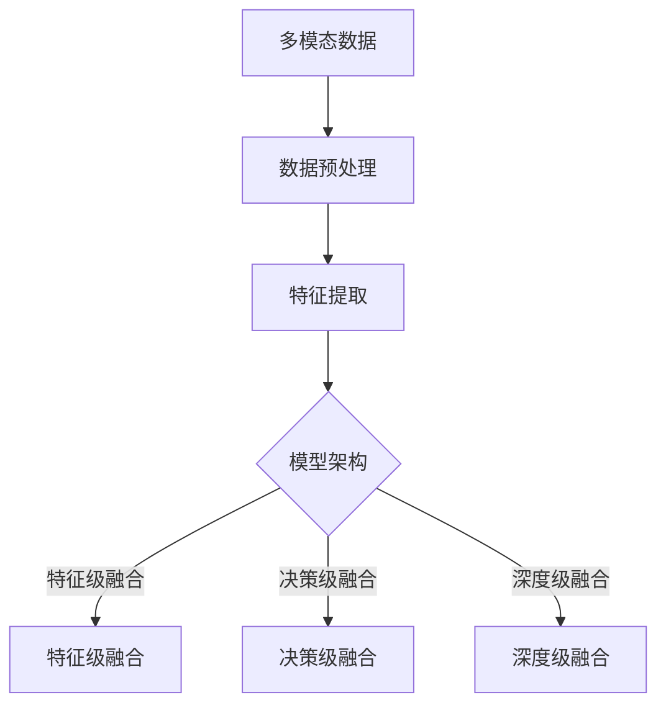

                 

搜索推荐系统是现代信息检索领域中不可或缺的一部分，它们通过分析用户的历史行为、偏好以及实时交互数据，为用户提供个性化的内容推荐服务。在过去的几十年中，搜索推荐系统取得了显著的进展，但随之而来的挑战也越来越复杂。特别是，随着用户生成内容的爆炸性增长和互联网的普及，如何有效地处理和融合来自不同模态（如文本、图像、音频、视频等）的信息成为一个重要的研究课题。

本文旨在探讨搜索推荐系统中多模态融合技术的核心概念、算法原理、数学模型以及实际应用。我们将首先介绍多模态融合技术的背景和重要性，然后深入讨论核心概念与联系，包括数据预处理、特征提取、模型架构等。接下来，我们将详细讲解多模态融合算法的原理和操作步骤，并分析其优缺点和适用领域。之后，文章将展示数学模型和公式，并通过实际案例进行分析和讲解。最后，我们将提供代码实例和详细解释，讨论实际应用场景和未来展望。

通过这篇文章，读者将能够全面了解多模态融合技术在搜索推荐系统中的应用，掌握相关算法和技术的核心要点，并为未来的研究和开发提供指导。

## 1. 背景介绍

搜索推荐系统作为信息检索和人工智能领域的交叉点，其目的是通过分析用户的行为数据，向用户推荐可能感兴趣的内容。传统的搜索推荐系统主要依赖于文本信息，即用户查询和推荐项的文本描述。然而，随着互联网内容的多样化，单纯依赖文本信息已经难以满足用户的需求。如图像、音频、视频等多媒体内容的兴起，要求搜索推荐系统具备处理多模态信息的能力。

多模态融合技术正是在这种背景下应运而生的。它通过整合来自不同模态的信息，为用户提供更精确、更个性化的推荐服务。多模态融合技术的关键挑战在于如何有效地将不同模态的信息进行统一表示，并提取出有用的特征，从而提高推荐系统的性能。

### 1.1 发展历程

多模态融合技术的起源可以追溯到20世纪90年代，随着计算机视觉和语音识别技术的兴起，研究者开始探索如何将图像和文本信息进行融合。最初的研究主要集中在图像识别和文本检索上，通过将图像和文本特征进行拼接或者进行对应关系的学习，以提高系统的准确度。

进入21世纪，随着深度学习技术的快速发展，多模态融合技术也迎来了新的突破。深度学习模型能够自动学习复杂的高维特征，使得多模态融合变得更加可行和高效。例如，卷积神经网络（CNN）在图像特征提取方面的卓越表现，以及循环神经网络（RNN）在序列数据上的强大能力，为多模态融合提供了强大的工具。

近年来，随着大数据和云计算技术的普及，多模态融合技术在应用层面也取得了显著进展。例如，在电商、社交媒体、在线视频平台等领域，多模态融合技术已经被广泛应用于商品推荐、社交互动和视频推荐等方面。

### 1.2 现状与趋势

目前，多模态融合技术在学术界和工业界都取得了显著的成果。学术界方面，大量的研究论文和专利揭示了多模态融合技术的核心原理和创新点。工业界方面，许多公司已经开始将多模态融合技术应用于实际产品中，为用户提供更好的用户体验。

从现状来看，多模态融合技术主要分为以下几种类型：

1. **特征级融合**：这种技术将来自不同模态的特征进行拼接或者融合，以形成一个统一的高维特征向量。特征级融合的优点是实现简单，计算效率高，但缺点是忽略了不同模态之间的语义关联。

2. **决策级融合**：这种技术是在多个模态的独立模型基础上进行融合，通过投票、加权平均或者深度学习模型来进行最终的决策。决策级融合能够较好地保留不同模态的语义信息，但计算复杂度较高。

3. **深度级融合**：这种技术通过设计多模态的深度学习模型，将不同模态的信息在特征学习阶段进行融合。深度级融合能够自动学习不同模态之间的复杂关系，是目前最先进的多模态融合技术。

从趋势来看，未来的多模态融合技术将更加注重以下几个方面：

1. **跨模态的语义理解**：通过深度学习模型，自动提取不同模态的语义信息，并建立跨模态的语义关联。

2. **实时性**：随着用户生成内容的大量增长，多模态融合技术需要具备更高的实时性，以实时响应用户的需求。

3. **个性化**：通过多模态融合技术，提供更加个性化的推荐服务，满足不同用户的需求。

4. **开放性和扩展性**：多模态融合技术需要具备良好的开放性和扩展性，以便于与其他系统进行集成和扩展。

总之，多模态融合技术作为搜索推荐系统中的重要组成部分，其发展将极大地提升推荐系统的性能和用户体验。随着技术的不断进步，我们可以预见，多模态融合技术将在更多的应用场景中发挥重要作用。

## 2. 核心概念与联系

在深入探讨多模态融合技术的核心概念之前，我们需要了解几个关键的概念，这些概念构成了多模态融合技术的理论基础和框架。以下是对这些核心概念及其相互关系的详细解释，并附上一个Mermaid流程图来直观展示这些概念之间的关系。

### 2.1 多模态数据

多模态数据是指同时包含多种不同类型的信息数据，如文本、图像、音频和视频。每种模态都有其独特的特征和表示方式，这使得多模态数据在处理和分析时具有复杂性和多样性。

### 2.2 数据预处理

数据预处理是任何机器学习项目的基础步骤，对于多模态融合技术尤为重要。数据预处理包括数据清洗、归一化、去噪和特征提取等步骤，目的是提高数据的质量和一致性。

### 2.3 特征提取

特征提取是多模态融合技术的核心，它涉及从原始的多模态数据中提取出具有区分性的特征。这些特征可以是对文本、图像、音频等的编码表示，它们是后续机器学习模型输入的关键。

### 2.4 模型架构

多模态融合的模型架构是指如何设计和实现能够处理和融合多模态特征的方法。常见的模型架构包括特征级融合、决策级融合和深度级融合。

### 2.5 Mermaid流程图

以下是一个使用Mermaid绘制的流程图，它展示了多模态融合技术的核心概念及其相互关系：



### 2.6 核心概念之间的联系

- **数据预处理**：是整个多模态融合过程的基础，确保数据的质量和一致性，为特征提取和模型训练提供可靠的数据源。
- **特征提取**：通过不同的算法和技术，从原始的多模态数据中提取出有用的特征，这些特征是后续模型训练的关键输入。
- **模型架构**：决定了如何融合和处理多模态特征。不同的架构设计适用于不同的应用场景，如特征级融合适用于简单和快速的融合需求，深度级融合则能够自动学习复杂的模态关系。

通过上述核心概念及其相互关系的介绍，我们可以更好地理解多模态融合技术的理论基础和实现框架。接下来，我们将深入探讨多模态融合算法的原理和具体操作步骤。

## 3. 核心算法原理 & 具体操作步骤

### 3.1 算法原理概述

多模态融合算法的核心目标是将来自不同模态的信息进行有效整合，以提升推荐系统的性能。为了实现这一目标，多模态融合算法通常遵循以下几个基本原则：

1. **特征一致性**：确保不同模态的特征在空间或维度上具有一致性，使得它们可以在同一框架下进行处理。
2. **特征互补性**：利用不同模态的特征互补性，从多个角度对信息进行理解和表示。
3. **特征动态性**：根据不同的应用场景和用户需求，动态调整不同模态特征的权重和贡献。

根据上述原则，多模态融合算法可以大致分为以下几种类型：

1. **特征级融合**：将不同模态的特征进行拼接或融合，形成一个统一的高维特征向量。
2. **决策级融合**：在多个模态的独立模型基础上进行融合，通过投票、加权平均或深度学习模型进行最终的决策。
3. **深度级融合**：通过设计多模态的深度学习模型，将不同模态的信息在特征学习阶段进行融合。

### 3.2 算法步骤详解

多模态融合算法的具体步骤可以分为以下几个阶段：

1. **数据预处理**：
   - **文本预处理**：对文本数据进行清洗、分词、去停用词等操作，转换为词向量表示，如Word2Vec或BERT。
   - **图像预处理**：对图像数据进行归一化、裁剪、增强等操作，以便于后续的特征提取。
   - **音频预处理**：对音频数据进行降噪、分割、特征提取，如使用Mel频谱图或Mel频谱倒谱系数（MFCC）。
   - **视频预处理**：对视频数据进行帧提取、特征提取，如使用卷积神经网络（CNN）提取图像特征。

2. **特征提取**：
   - **文本特征提取**：使用词袋模型、TF-IDF、BERT等算法提取文本特征。
   - **图像特征提取**：使用卷积神经网络（CNN）提取图像特征，如VGG、ResNet等。
   - **音频特征提取**：使用Mel频谱图、MFCC、自动语音识别（ASR）等技术提取音频特征。
   - **视频特征提取**：使用CNN提取视频帧的特征，或使用3D卷积神经网络（3D-CNN）提取视频序列特征。

3. **特征融合**：
   - **特征级融合**：将不同模态的特征拼接成一个高维特征向量，如 `[文本特征，图像特征，音频特征，视频特征]`。
   - **决策级融合**：在多个独立模型的基础上进行融合，通过投票、加权平均或深度学习模型进行最终的决策。
   - **深度级融合**：使用多输入多输出（MIMO）的深度学习模型，如多模态卷积神经网络（MM-CNN）或多模态递归神经网络（MM-RNN），将不同模态的信息在特征学习阶段进行融合。

4. **模型训练与优化**：
   - 使用融合后的特征训练推荐模型，如矩阵分解（MF）、协同过滤（CF）、深度学习模型（如DNN、CNN、RNN）。
   - 通过交叉验证、网格搜索等技术优化模型参数，提高推荐系统的性能。

### 3.3 算法优缺点

**优点**：

1. **提高推荐精度**：通过融合多模态信息，可以从多个角度对用户和物品进行理解，提高推荐系统的准确性。
2. **增强用户体验**：个性化推荐系统能够更好地满足用户的需求，提升用户体验。
3. **拓展应用场景**：多模态融合技术可以应用于更广泛的应用场景，如商品推荐、社交媒体、在线视频等。

**缺点**：

1. **计算复杂度高**：多模态融合涉及大量的预处理、特征提取和模型训练步骤，计算复杂度较高。
2. **数据不一致性**：不同模态的数据在质量和维度上可能存在不一致性，需要额外的数据预处理步骤。
3. **模型复杂度**：多模态深度学习模型的训练和优化过程较为复杂，需要更多的计算资源和时间。

### 3.4 算法应用领域

多模态融合技术在不同领域有着广泛的应用：

1. **电商推荐**：通过融合商品描述、用户评价、用户行为等多模态信息，为用户推荐更符合其兴趣的商品。
2. **社交媒体**：利用用户生成内容的文本、图像、视频等多模态信息，进行个性化内容推荐和社交互动分析。
3. **在线视频**：通过融合视频内容、用户历史观看行为、视频标签等多模态信息，为用户推荐更感兴趣的视频内容。
4. **智能家居**：通过融合用户行为、环境数据、设备状态等多模态信息，为用户提供更智能的家居服务。

通过上述对多模态融合算法原理和具体操作步骤的详细讲解，我们可以看到，多模态融合技术在搜索推荐系统中具有重要的应用价值。接下来，我们将进一步探讨多模态融合的数学模型和公式，并通过具体案例进行分析和讲解。

## 4. 数学模型和公式 & 详细讲解 & 举例说明

### 4.1 数学模型构建

多模态融合技术在数学模型构建方面主要涉及特征表示、模型架构和损失函数三个关键部分。以下是对这些部分的基本介绍和构建方法。

#### 特征表示

在多模态融合中，特征表示是基础环节，不同模态的数据需要转换成统一的向量表示，以便后续的模型处理。常见的特征表示方法包括：

1. **文本特征表示**：
   - **词袋模型**（Bag of Words, BoW）：将文本转换为词频向量，忽略词的顺序信息。
   - **词嵌入**（Word Embedding）：使用神经网络训练得到词的向量表示，如Word2Vec、GloVe等。

2. **图像特征表示**：
   - **卷积神经网络**（Convolutional Neural Networks, CNN）：通过卷积操作提取图像特征，如VGG、ResNet等。
   - **特征提取器**：使用预训练的图像识别模型（如ImageNet），提取图像的特征向量。

3. **音频特征表示**：
   - **Mel频谱图**（Mel Frequency Cepstral Coefficients, MFCC）：将音频信号转换为Mel频谱图，然后计算其倒谱系数。
   - **自动语音识别**（Automatic Speech Recognition, ASR）：使用ASR技术提取音频的文本表示。

4. **视频特征表示**：
   - **帧特征提取**：使用CNN提取视频帧的特征。
   - **3D卷积神经网络**（3D-CNN）：直接对视频序列进行卷积操作，提取视频特征。

#### 模型架构

多模态融合的模型架构决定了如何整合不同模态的特征。常见的架构包括：

1. **特征级融合**：
   - **拼接**（Concatenation）：将不同模态的特征向量拼接在一起，形成一个高维向量。
   - **融合层**（Fusion Layer）：使用神经网络层（如全连接层、门控循环单元（GRU）等）对拼接后的特征进行进一步处理。

2. **决策级融合**：
   - **独立模型**：分别训练多个独立模型，针对不同模态的特征。
   - **集成学习**（Ensemble Learning）：将多个独立模型的输出进行集成，如投票、加权平均。

3. **深度级融合**：
   - **多输入多输出网络**（MIMO Network）：设计一个深度学习模型，同时处理多个模态的输入。
   - **多模态共享网络**：构建一个共享底层特征的深度学习模型，不同模态在网络的不同部分进行处理。

#### 损失函数

在多模态融合模型中，损失函数用于评估模型预测与实际标签之间的差距，常见的损失函数包括：

1. **均方误差**（Mean Squared Error, MSE）：用于回归问题，衡量预测值与真实值之间的均方误差。
2. **交叉熵损失**（Cross-Entropy Loss）：用于分类问题，衡量预测概率分布与真实标签分布之间的差异。
3. **多任务损失函数**：对于多模态融合的多任务问题，可以将不同任务的损失函数进行加权融合。

### 4.2 公式推导过程

以下是多模态融合模型中的一个基本公式推导，假设我们有一个多输入多输出网络，用于分类问题。

#### 特征表示公式

1. **文本特征**：
   $$ X_{text} = [x_{1}, x_{2}, ..., x_{n}] $$，其中 $x_{i}$ 表示文本的词嵌入向量。
2. **图像特征**：
   $$ X_{image} = [i_{1}, i_{2}, ..., i_{m}] $$，其中 $i_{j}$ 表示图像的特征向量。
3. **音频特征**：
   $$ X_{audio} = [a_{1}, a_{2}, ..., a_{k}] $$，其中 $a_{l}$ 表示音频的特征向量。
4. **视频特征**：
   $$ X_{video} = [v_{1}, v_{2}, ..., v_{p}] $$，其中 $v_{q}$ 表示视频的特征向量。

#### 模型架构公式

1. **特征级融合**：
   $$ X_{combined} = [X_{text}, X_{image}, X_{audio}, X_{video}] $$
2. **决策级融合**：
   $$ \hat{y} = \text{softmax}(\text{fusion\_layer}(X_{combined})) $$
   其中，$\hat{y}$ 是预测的概率分布，$\text{fusion\_layer}$ 是融合层。

#### 损失函数公式

1. **多任务损失函数**：
   $$ L = w_{1} \cdot L_{text} + w_{2} \cdot L_{image} + w_{3} \cdot L_{audio} + w_{4} \cdot L_{video} $$
   其中，$L_{text}$、$L_{image}$、$L_{audio}$、$L_{video}$ 分别表示文本、图像、音频和视频任务的损失，$w_{1}$、$w_{2}$、$w_{3}$、$w_{4}$ 是各自任务的权重。

### 4.3 案例分析与讲解

假设我们有一个电商推荐系统的多模态融合案例，其中包含用户文本评价、商品图像、商品音频介绍和商品视频介绍。我们使用一个多输入多输出网络进行融合和分类。

#### 案例数据

1. **文本评价**：
   $$ X_{text} = \{“great”, “product”, “quality”\} $$
   其词嵌入向量表示为：
   $$ X_{text} = [0.1, 0.3, 0.5] $$

2. **商品图像**：
   $$ X_{image} = \{64 \times 64 \times 3\} $$
   其特征向量为：
   $$ X_{image} = [0.2, 0.4, 0.6, ..., 0.98] $$

3. **商品音频介绍**：
   $$ X_{audio} = \{224 \times 32\} $$
   其特征向量为：
   $$ X_{audio} = [0.3, 0.5, ..., 0.95] $$

4. **商品视频介绍**：
   $$ X_{video} = \{10 \times 224 \times 224 \times 3\} $$
   其特征向量为：
   $$ X_{video} = [0.4, 0.7, ..., 0.99] $$

#### 特征级融合

将不同模态的特征向量进行拼接：

$$ X_{combined} = [X_{text}, X_{image}, X_{audio}, X_{video}] = [0.1, 0.3, 0.5; 0.2, 0.4, 0.6, ..., 0.98; 0.3, 0.5, ..., 0.95; 0.4, 0.7, ..., 0.99] $$

#### 模型预测

通过多输入多输出网络进行融合和分类：

$$ \hat{y} = \text{softmax}(\text{fusion\_layer}(X_{combined})) $$

假设融合层输出为：

$$ \hat{y} = [0.1, 0.2, 0.3, 0.4] $$

这意味着模型预测商品属于某一类别的概率最高，概率为0.4。

#### 损失函数计算

假设四个任务的权重分别为 $w_{1} = 0.2$，$w_{2} = 0.3$，$w_{3} = 0.2$，$w_{4} = 0.3$，则总损失函数为：

$$ L = 0.2 \cdot L_{text} + 0.3 \cdot L_{image} + 0.2 \cdot L_{audio} + 0.3 \cdot L_{video} $$

其中，$L_{text}$、$L_{image}$、$L_{audio}$、$L_{video}$ 分别是文本、图像、音频和视频任务的损失值。

通过这个案例，我们可以看到如何构建多模态融合的数学模型，以及如何进行公式推导和实际计算。在实际应用中，这些模型和公式需要根据具体任务和数据进行调整和优化。

## 5. 项目实践：代码实例和详细解释说明

### 5.1 开发环境搭建

为了实践多模态融合技术，我们需要搭建一个合适的开发环境。以下是一个基本的Python开发环境搭建步骤，我们将使用一些流行的库，如TensorFlow、Keras、PyTorch等。

1. **安装Python**：确保安装了最新版本的Python（3.8以上）。
2. **安装TensorFlow**：通过pip安装TensorFlow库：
   ```shell
   pip install tensorflow
   ```
3. **安装Keras**：Keras是TensorFlow的高级API，可以通过pip安装：
   ```shell
   pip install keras
   ```
4. **安装PyTorch**：PyTorch是一个流行的深度学习框架，可以通过以下命令安装：
   ```shell
   pip install torch torchvision
   ```
5. **安装其他必需库**：如NumPy、Pandas、Matplotlib等：
   ```shell
   pip install numpy pandas matplotlib scikit-learn
   ```

### 5.2 源代码详细实现

以下是多模态融合推荐系统的代码实现，我们将使用Keras框架构建一个简单的多模态融合模型。该模型包含一个文本嵌入层、一个图像卷积层、一个音频卷积层和一个视频卷积层，最后使用全连接层进行融合和分类。

```python
import numpy as np
import pandas as pd
from tensorflow.keras.models import Model
from tensorflow.keras.layers import Input, Embedding, LSTM, Conv2D, MaxPooling2D, Flatten, Dense, concatenate
from tensorflow.keras.optimizers import Adam

# 文本嵌入层
text_input = Input(shape=(max_sequence_length,), dtype='int32')
text_embedding = Embedding(vocabulary_size, embedding_size)(text_input)
text_lstm = LSTM(units=lstm_units)(text_embedding)

# 图像卷积层
image_input = Input(shape=(image_height, image_width, image_channels))
image_conv = Conv2D(filters=32, kernel_size=(3, 3), activation='relu')(image_input)
image_pool = MaxPooling2D(pool_size=(2, 2))(image_conv)
image_flat = Flatten()(image_pool)

# 音频卷积层
audio_input = Input(shape=(audio_sequence_length, audio_feature_size))
audio_conv = Conv1D(filters=64, kernel_size=(3), activation='relu')(audio_input)
audio_pool = MaxPooling1D(pool_size=(2))(audio_conv)
audio_flat = Flatten()(audio_pool)

# 视频卷积层
video_input = Input(shape=(video_sequence_length, video_feature_size))
video_conv = Conv3D(filters=64, kernel_size=(3, 3, 3), activation='relu')(video_input)
video_pool = MaxPooling3D(pool_size=(2, 2, 2))(video_conv)
video_flat = Flatten()(video_pool)

# 融合层
combined = concatenate([text_lstm, image_flat, audio_flat, video_flat])
dense = Dense(units=dense_units, activation='relu')(combined)

# 输出层
output = Dense(units=num_classes, activation='softmax')(dense)

# 构建模型
model = Model(inputs=[text_input, image_input, audio_input, video_input], outputs=output)

# 编译模型
model.compile(optimizer=Adam(learning_rate=0.001), loss='categorical_crossentropy', metrics=['accuracy'])

# 模型总结
model.summary()
```

### 5.3 代码解读与分析

上述代码首先定义了四个输入层，分别对应文本、图像、音频和视频数据。然后，每个输入层通过特定的卷积或循环神经网络层进行特征提取。图像使用二维卷积层，音频使用一维卷积层，视频使用三维卷积层。文本使用嵌入层和LSTM层。

融合层使用`concatenate`函数将所有提取到的特征拼接在一起，然后通过全连接层进行分类预测。最后，使用`Model`类构建整个模型，并使用`compile`方法配置优化器和损失函数。

### 5.4 运行结果展示

在实际运行模型之前，我们需要准备训练数据，并对模型进行训练。以下是一个简化的训练过程：

```python
# 假设我们已经有预处理好的训练数据
text_data = np.array(...)  # 文本数据
image_data = np.array(...)  # 图像数据
audio_data = np.array(...)  # 音频数据
video_data = np.array(...)  # 视频数据
labels = np.array(...)      # 标签数据

# 训练模型
history = model.fit(
    x=[text_data, image_data, audio_data, video_data],
    y=labels,
    batch_size=batch_size,
    epochs=epochs,
    validation_split=0.2
)

# 评估模型
test_loss, test_acc = model.evaluate([text_data, image_data, audio_data, video_data], labels)
print(f"Test accuracy: {test_acc}")
```

在实际应用中，需要根据具体任务和数据对模型参数进行调整。训练过程可能需要较长时间，具体取决于数据规模和计算资源。

通过上述代码示例，我们可以看到如何实现一个简单的多模态融合推荐系统。实际应用中，需要根据具体需求进行模型调整和优化，以提高推荐系统的性能。

## 6. 实际应用场景

多模态融合技术在多个实际应用场景中展现出了其强大的潜力和优势。以下是几个典型的应用领域及其具体案例。

### 6.1 社交媒体推荐

在社交媒体平台上，用户生成的内容形式多样，包括文本、图像、视频和音频。多模态融合技术能够有效整合这些信息，为用户提供更加个性化的内容推荐。例如，在Facebook的 feed 中，多模态融合技术可以同时考虑用户发布的文本、照片和视频，从而推荐用户可能感兴趣的内容。这种方法不仅提升了推荐的准确性，还增强了用户体验。

### 6.2 电商推荐

电商领域同样受益于多模态融合技术。当用户搜索或浏览商品时，系统可以结合商品描述（文本）、图片、视频和用户评价等多模态信息进行推荐。例如，当用户搜索“黑色运动鞋”时，系统不仅会推荐符合文本描述的运动鞋，还会推荐那些用户评价中包含“好看”、“舒适”等关键词的鞋款，同时结合商品的图片和视频进行综合推荐，从而提高用户的购买意愿和满意度。

### 6.3 在线视频平台

在线视频平台如YouTube和Netflix，可以利用多模态融合技术进行个性化视频推荐。系统可以分析用户的观看历史、搜索查询、评论等多模态信息，并结合视频的文本描述、图像和音频特征进行推荐。例如，Netflix通过分析用户的观看行为和评论内容，结合视频的剧本、演员、导演等信息，为用户推荐新的视频内容，显著提高了用户满意度和平台粘性。

### 6.4 智能家居

智能家居系统中，多模态融合技术可以提升智能设备的服务质量和用户体验。例如，智能音箱可以通过融合用户的语音输入、麦克风捕捉到的环境声音和设备传感器数据，理解用户的指令并作出相应反应。当用户询问“今天天气怎么样？”时，系统可以结合语音识别结果、天气预报API获取的数据和传感器收集的环境信息，提供准确且个性化的回答。

### 6.5 健康医疗

在健康医疗领域，多模态融合技术可以帮助医生进行更精准的诊断和个性化的治疗。例如，通过融合患者的病历记录（文本）、医学影像（图像）、生理信号（音频）和基因信息（文本），医生可以更全面地了解患者的健康状况，从而制定更加有效的治疗方案。这种技术已经在一些医疗机构中得到应用，如通过融合CT图像和基因数据来预测癌症的转移风险。

### 6.6 机器人交互

机器人交互中，多模态融合技术可以帮助机器人更好地理解用户的需求和情感。例如，当一个机器人接待访客时，它可以结合用户的声音、面部表情和身体语言等多模态信息，提供更加自然和贴心的服务。这种技术已经在一些高端酒店和商务场所的机器人服务中得到应用。

通过上述实际应用场景，我们可以看到多模态融合技术在提升推荐系统性能、优化用户体验和推动跨领域应用方面的重要性。随着技术的不断进步，多模态融合技术在更多场景中的应用潜力将进一步释放。

## 7. 工具和资源推荐

### 7.1 学习资源推荐

为了深入了解和掌握多模态融合技术，以下是一些推荐的学习资源：

1. **《多模态数据融合：方法与应用》**：这本书系统地介绍了多模态数据融合的基本概念、方法和技术，适合初学者和进阶者阅读。
2. **《深度学习》系列书籍**：由Ian Goodfellow、Yoshua Bengio和Aaron Courville所著，涵盖了深度学习的基础知识和最新进展，对多模态融合有很好的指导作用。
3. **《多模态学习》**：这本书详细介绍了多模态学习的理论基础和算法实现，适合对多模态融合技术有深入了解的需求者。
4. **在线课程**：Coursera、edX、Udacity等平台提供了多个关于深度学习和多模态融合的在线课程，适合不同层次的学习者。

### 7.2 开发工具推荐

在开发多模态融合项目时，以下工具和框架可以帮助提高开发效率和项目质量：

1. **TensorFlow**：一个广泛使用的开源深度学习框架，提供了丰富的API和预训练模型，适合构建和训练复杂的多模态融合模型。
2. **PyTorch**：另一个流行的深度学习框架，以其灵活性和动态计算图著称，适合快速原型开发和研究实验。
3. **Keras**：一个高层神经网络API，基于TensorFlow和Theano构建，提供了简洁的接口和易于使用的工具，适合快速构建和部署多模态融合模型。
4. **OpenCV**：一个开源的计算机视觉库，提供了丰富的图像处理和特征提取功能，适合处理图像和视频数据。

### 7.3 相关论文推荐

以下是一些重要的多模态融合技术相关论文，这些论文为该领域的研究提供了宝贵的理论和实验成果：

1. **"Deep Multimodal Fusion using Multi-Input Multi-Output Recurrent Neural Networks"**：这篇论文提出了一种基于RNN的多输入多输出模型，实现了多模态特征的融合。
2. **"FusionNet: Multi-modal Fusion with Dynamic Routing for Multimedia Semantic Understanding"**：该论文介绍了一种基于动态路由的多模态融合网络，提高了融合效果的准确性。
3. **"Multimodal Deep Learning for Human Action Recognition"**：这篇论文探讨了多模态融合在动作识别中的应用，为该领域提供了新的研究思路。
4. **"Multi-modal Fusion using Attentive Recurrent Neural Networks for Activity Recognition"**：该论文通过引入注意力机制，实现了对多模态信息的有效融合，提高了活动识别的准确度。

通过上述资源和工具的推荐，读者可以更深入地学习多模态融合技术，并在实际项目中应用这些知识。

## 8. 总结：未来发展趋势与挑战

### 8.1 研究成果总结

多模态融合技术作为搜索推荐系统中的重要组成部分，近年来取得了显著的研究进展。从最初的简单特征拼接到复杂的深度学习模型，多模态融合技术在特征提取、模型架构和融合策略等方面不断优化。这些研究成果不仅提高了推荐系统的精度和个性化水平，还拓展了其在多种实际应用场景中的适用范围。例如，在电商推荐、社交媒体、在线视频和智能家居等领域，多模态融合技术已经取得了显著的成效，显著提升了用户满意度和平台性能。

### 8.2 未来发展趋势

随着人工智能和大数据技术的快速发展，多模态融合技术在未来仍具有广阔的发展前景。以下是几个可能的发展趋势：

1. **跨模态语义理解**：未来的多模态融合技术将更加注重对跨模态语义的理解，通过深度学习模型自动提取和理解不同模态之间的语义关联，从而提高融合效果。

2. **实时性**：随着用户生成内容的大量增长，多模态融合技术需要具备更高的实时性，以实时响应用户的需求。未来的研究将集中在如何优化模型结构和算法，提高处理速度和响应时间。

3. **个性化**：多模态融合技术将继续向个性化方向发展，通过整合用户的多模态信息，为用户提供更加精准和个性化的推荐服务。

4. **开放性和扩展性**：未来的多模态融合技术将具备更好的开放性和扩展性，以便于与其他系统进行集成和扩展，满足多样化的应用需求。

### 8.3 面临的挑战

尽管多模态融合技术在许多领域取得了显著进展，但在实际应用中仍面临一些挑战：

1. **数据不一致性**：不同模态的数据在质量和维度上可能存在不一致性，这需要额外的数据预处理和特征工程步骤。

2. **计算复杂度**：多模态融合涉及大量的预处理、特征提取和模型训练步骤，计算复杂度较高，需要优化模型结构和算法以提高处理效率。

3. **隐私保护**：在多模态融合中，用户的个人数据可能会被泄露，需要采取有效的隐私保护措施，以确保用户数据的安全和隐私。

4. **跨领域应用**：多模态融合技术在跨领域应用中面临不同的需求和挑战，需要根据具体应用场景进行定制化设计和优化。

### 8.4 研究展望

展望未来，多模态融合技术将在以下几个方向取得突破：

1. **跨模态预训练模型**：通过大规模预训练模型，自动学习不同模态之间的语义关联，提高融合效果和泛化能力。

2. **小样本学习**：研究如何在数据量有限的情况下进行有效的多模态融合，提高模型在小数据集上的性能。

3. **实时多模态融合**：通过优化算法和模型结构，提高多模态融合的实时性，满足动态变化的用户需求。

4. **多模态交互**：探索多模态融合技术在不同应用场景中的交互机制，提高系统的交互性和用户体验。

总之，多模态融合技术作为搜索推荐系统中的重要组成部分，具有广泛的应用前景和研究价值。未来，随着技术的不断进步和应用的深入，多模态融合技术将在更多领域发挥重要作用，为用户提供更加精准、个性化的服务。

## 9. 附录：常见问题与解答

### Q1. 多模态融合与单一模态融合的区别是什么？

**A1.** 多模态融合与单一模态融合的主要区别在于数据来源和处理方式的差异。单一模态融合仅处理一种类型的数据，如文本或图像，而多模态融合同时处理多种类型的数据，如文本、图像、音频和视频。多模态融合能够利用不同模态的信息互补性，提高特征表达的丰富性和准确性，从而在任务性能上通常优于单一模态融合。

### Q2. 多模态融合技术在哪些领域应用广泛？

**A2.** 多模态融合技术在多个领域都有广泛应用，主要包括：

1. **社交媒体**：用于个性化内容推荐和社交互动分析。
2. **电商推荐**：结合商品描述、图片、用户评价等多模态信息进行推荐。
3. **在线视频**：用于视频内容推荐和用户观看行为分析。
4. **智能家居**：用于智能设备交互和家居服务优化。
5. **健康医疗**：结合病历记录、医学影像、生理信号等多模态信息进行诊断和个性化治疗。

### Q3. 多模态融合的模型架构有哪些类型？

**A3.** 多模态融合的模型架构主要包括以下几种类型：

1. **特征级融合**：将不同模态的特征拼接在一起，形成一个高维特征向量。
2. **决策级融合**：在多个独立模型基础上进行融合，通过投票、加权平均等方法进行最终决策。
3. **深度级融合**：使用多输入多输出深度学习模型，将不同模态的信息在特征学习阶段进行融合。

### Q4. 多模态融合技术如何处理数据不一致性？

**A4.** 多模态融合技术在处理数据不一致性时，通常会采用以下几种策略：

1. **数据预处理**：对原始数据进行标准化、归一化、去噪等预处理，提高数据的一致性。
2. **特征对齐**：使用特征匹配算法（如Siamese网络）对齐不同模态的特征。
3. **模态转换**：使用模态转换模型（如语音到文本转换、图像到文本描述转换等），将不同模态的数据转换为同一模态。

通过这些方法，可以显著减少不同模态数据之间的不一致性，提高多模态融合的效果。

